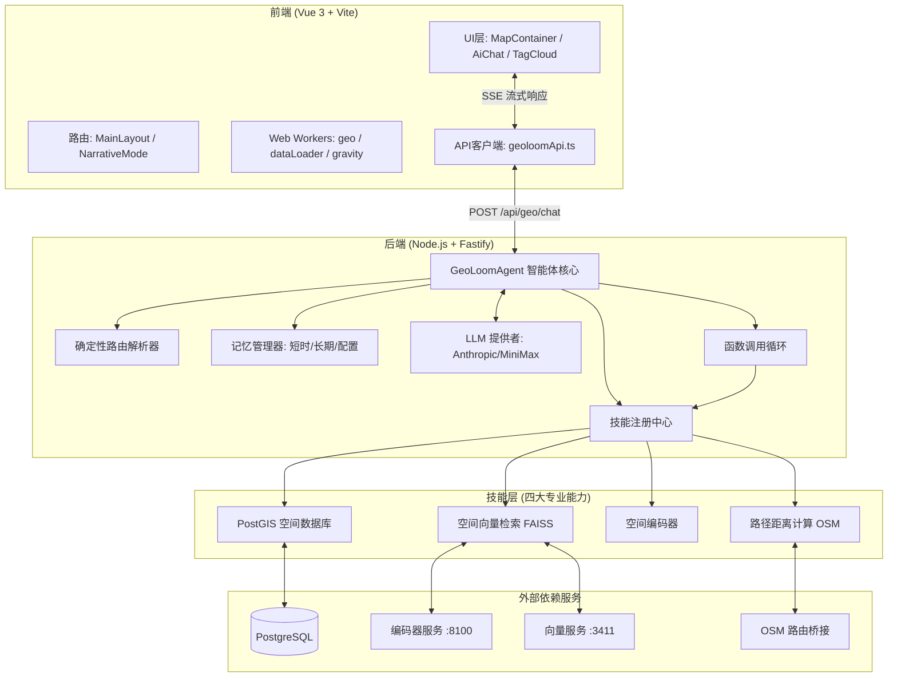
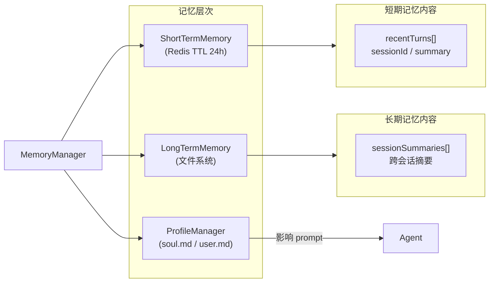
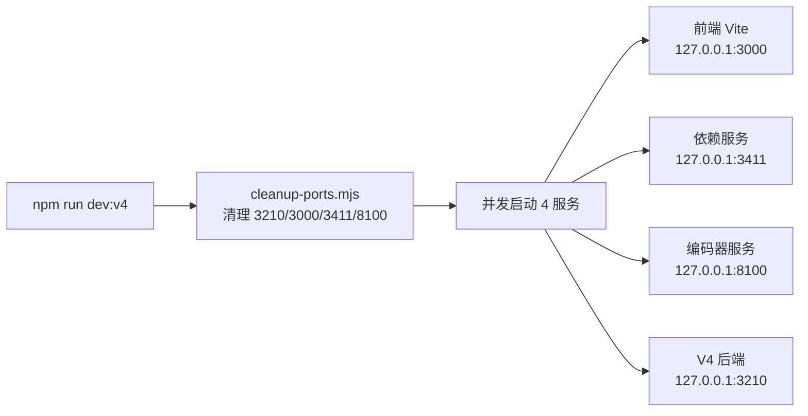

GeoLoom Agent 是一个**地理空间认知智能体系统**，它将大语言模型（LLM）与专业空间数据库能力深度融合，通过自然语言交互方式为用户提供地点查询、周边分析、商业选址等地理智慧服务。该项目从 `D:\AAA_Edu\TagCloud\vite-project` 拆分而出，形成独立维护的 V4 仓库，具备完整的前端 UI 框架、后端核心逻辑、真实空间依赖联调脚本和测试链路。

Sources: [README.md](README.md#L1-L30)

---

## 系统架构总览

GeoLoom Agent 采用**前后端分离架构**，前端基于 Vue 3 + Vite 构建交互界面，后端采用 Node.js + Fastify 实现智能体核心。整个系统围绕"技能（Skill）"插件体系组织，支持 PostGIS 空间查询、向量语义检索、空间编码和路径距离计算四大核心能力。



Sources: [backend/src/server.ts](backend/src/server.ts#L1-L60)
Sources: [src/MainLayout.vue](src/MainLayout.vue#L1-L50)
Sources: [backend/src/app.ts](backend/src/app.ts#L1-L53)

---

## 项目目录结构

```
geoloom-agent/
├── src/                          # 前端 Vue 3 应用
│   ├── components/               # 核心组件
│   │   ├── MapContainer.vue      # 地图容器 (OpenLayers + Deck.gl)
│   │   ├── AiChat.vue            # AI 对话界面
│   │   ├── TagCloud.vue          # 标签云可视化
│   │   ├── ControlPanel.vue      # 控制面板
│   │   └── V4EvidencePanel.vue   # 证据面板
│   ├── composables/               # Vue 组合式函数
│   │   └── map/                  # 地图相关逻辑
│   ├── lib/                      # 工具库
│   │   ├── geoloomApi.ts         # 后端 API 客户端
│   │   └── chatStreamState.ts    # 聊天流状态管理
│   ├── views/                    # 页面视图
│   │   ├── MainLayout.vue        # 主布局
│   │   └── NarrativeMode.vue     # 叙事模式
│   ├── workers/                  # Web Workers
│   │   ├── geo.worker.ts         # 地理数据处理
│   │   └── dataLoader.worker.ts  # 数据加载
│   └── utils/                    # 工具函数
│
├── backend/                      # 后端 Node.js 应用
│   ├── src/
│   │   ├── agent/                # 智能体核心
│   │   │   ├── GeoLoomAgent.ts   # 主智能体类
│   │   │   ├── SessionManager.ts # 会话管理
│   │   │   ├── ConversationMemory.ts
│   │   │   └── ConfidenceGate.ts # 置信度门控
│   │   ├── skills/               # 技能系统
│   │   │   ├── SkillRegistry.ts  # 技能注册中心
│   │   │   ├── postgis/          # PostGIS 技能
│   │   │   ├── spatial_vector/   # 空间向量技能
│   │   │   ├── spatial_encoder/  # 空间编码器技能
│   │   │   └── route_distance/   # 路径距离技能
│   │   ├── memory/               # 记忆系统
│   │   │   ├── MemoryManager.ts  # 记忆管理器
│   │   │   ├── ShortTermMemory.ts
│   │   │   └── LongTermMemory.ts
│   │   ├── routes/               # API 路由
│   │   │   ├── chat.ts           # 聊天路由 (SSE)
│   │   │   ├── geo.ts            # 地理健康检查
│   │   │   └── skills.ts         # 技能列表
│   │   ├── integration/          # 外部服务集成
│   │   │   ├── postgisPool.ts    # PostgreSQL 连接池
│   │   │   ├── faissIndex.ts     # FAISS 向量索引
│   │   │   ├── pythonBridge.ts   # Python 编码器桥接
│   │   │   └── osmBridge.ts      # OSM 路由桥接
│   │   ├── llm/                  # LLM 提供者
│   │   │   ├── FunctionCallingLoop.ts
│   │   │   └── createDefaultLLMProvider.ts
│   │   └── evidence/             # 证据生成
│   │       └── EvidenceViewFactory.ts
│   └── SKILLS/                   # 技能定义文件
│
├── shared/                       # 前后端共享
│   └── sseEventSchema.ts         # SSE 事件类型定义
│
├── scripts/                      # 运维脚本
│   ├── run-backend-v4.mjs        # 启动后端
│   ├── run-encoder-service.mjs   # 启动编码器
│   └── smoke-stack.mjs           # Smoke 测试
│
└── public/                       # 静态资源
    ├── data/                     # 武汉 POP 栅格数据
    └── split_data/               # POI 目录数据
```

Sources: [get_dir_structure](get_dir_structure#L1-L30)

---

## 核心模块介绍

### GeoLoomAgent 智能体核心

`GeoLoomAgent` 是整个系统的决策中枢，负责协调自然语言理解、意图路由、技能调度和响应生成。它内部维护一个**确定性路由解析器（DeterministicRouter）**，能够将用户模糊的空间查询（如"武大附近"）精确解析为结构化的意图类型，包括地点锚定、区域洞察、统计查询等。

```mermaid
sequenceDiagram
    participant User as 用户
    participant API as /api/geo/chat
    participant Agent as GeoLoomAgent
    participant Router as DeterministicRouter
    participant LLM as LLM Provider
    participant Loop as FunctionCallingLoop
    participant Registry as SkillRegistry

    User->>API: POST 聊天请求
    API->>Agent: handle(request)
    Agent->>Router: resolveIntent(query)
    Router-->>Agent: IntentResult
    Agent->>Agent: ConfidenceGate.check()
    alt 置信度通过
        Agent->>LLM: complete() + tools
        LLM-->>Loop: ToolCallRequests
        Loop->>Registry: execute(action, payload)
        Registry-->>Loop: SkillExecutionResult
        Loop-->>Agent: Traces + FinalAnswer
        Agent->>Agent: EvidenceViewFactory.build()
        Agent-->>API: SSE Event Stream
        API-->>User: job/stage/partial/done
    else 置信度不足
        Agent-->>API: clarification 事件
    end
```

Sources: [backend/src/agent/GeoLoomAgent.ts](backend/src/agent/GeoLoomAgent.ts#L1-L80)
Sources: [backend/src/llm/FunctionCallingLoop.ts](backend/src/llm/FunctionCallingLoop.ts#L1-L50)

### 技能注册与调度系统

技能系统采用**注册中心模式（Registry Pattern）**，所有空间能力通过 `SkillRegistry` 统一管理。每个技能定义包含名称、描述、能力列表和动作定义，运行时通过 `execute(action, payload, context)` 接口被调用。

| 技能名称 | 核心能力 | 依赖服务 | 动作类型 |
|---------|---------|---------|---------|
| PostGIS | 空间 SQL 查询、POI 搜索 | PostgreSQL | `search_nearby`、`area_stats`、`category_histogram` |
| SpatialVector | 语义向量检索、相似区域 | FAISS + 向量服务 | `semantic_search`、`similar_region` |
| SpatialEncoder | 文本→空间向量编码 | Python 编码器服务 | `encode_location`、`encode_text` |
| RouteDistance | 路径规划、距离计算 | OSM 路由服务 | `route_distance`、`route_path` |

Sources: [backend/src/skills/SkillRegistry.ts](backend/src/skills/SkillRegistry.ts#L1-L37)
Sources: [backend/src/skills/types.ts](backend/src/skills/types.ts#L1-L66)

---

## 前端技术栈

前端采用 **Vue 3 Composition API** 构建，配合 **Element Plus** UI 组件库实现交互界面。地图层基于 **OpenLayers** 提供基础地图能力，叠加 **Deck.gl** 实现热力图、聚类等高级可视化效果。

### 地图容器组件

`MapContainer.vue` 是前端的核心地理可视化组件，支持实时过滤、热力图叠加、标签权重渲染等功能。它通过 `useRegions` 组合式函数管理多边形选择区域，并利用 `useDeckBridge` 与 Deck.gl 层进行状态同步。

Sources: [src/components/MapContainer.vue](src/components/MapContainer.vue#L1-L100)

### AI 对话组件

`AiChat.vue` 负责与后端建立 SSE 流式连接，实时接收智能体处理过程中的各类事件（stage、thinking、pois、boundary、done 等），并以流式方式渲染到聊天界面。它支持：
- 流式文本增量渲染（`partial` 事件）
- 空间兴趣点推送（`pois` 事件）
- 区域边界可视化（`boundary` 事件）
- 管道阶段追踪（pipeline tracker）

Sources: [src/components/AiChat.vue](src/components/AiChat.vue#L1-L100)
Sources: [src/lib/geoloomApi.ts](src/lib/geoloomApi.ts#L1-L60)

---

## 后端技术栈

后端基于 **Fastify** 框架构建，提供 RESTful API 和 SSE 流式端点。核心依赖包括：

| 依赖 | 版本 | 用途 |
|-----|------|-----|
| fastify | ^5.3.0 | HTTP 服务器框架 |
| pg | ^8.16.3 | PostgreSQL 客户端 |
| pgsql-ast-parser | ^12.0.1 | SQL 语法解析与安全校验 |
| dotenv | ^16.6.1 | 环境变量管理 |

Sources: [backend/package.json](backend/package.json#L1-L36)

---

## 内存与记忆系统

系统采用**三层记忆架构**，确保智能体在会话中保持上下文一致性：



Sources: [backend/src/memory/MemoryManager.ts](backend/src/memory/MemoryManager.ts#L1-L63)
Sources: [backend/src/agent/types.ts](backend/src/agent/types.ts#L1-L30)

---

## SSE 事件流协议

前后端通过 **Server-Sent Events (SSE)** 实现实时流式通信。`shared/sseEventSchema.ts` 定义了所有事件的 JSON Schema，确保前后端数据契约一致性。

| 事件类型 | 用途 | 关键字段 |
|---------|------|---------|
| `job` | 任务开始 | `mode` |
| `stage` | 处理阶段 | `name` |
| `thinking` | 思考状态 | `status`, `message` |
| `intent_preview` | 意图预览 | `normalizedAnchor`, `confidence` |
| `partial` | 流式文本块 | `text_chunk` |
| `pois` | 空间兴趣点 | `Array<POIFeature>` |
| `boundary` | 区域边界 | `GeoJSON` |
| `stats` | 统计结果 | `{ count, categories }` |
| `done` | 任务完成 | `duration_ms` |
| `error` | 错误信息 | `message` |

Sources: [shared/sseEventSchema.ts](shared/sseEventSchema.ts#L1-L100)

---

## 一键启动配置

项目提供完整的**一键启动脚本**（Windows Batch），自动清理旧进程并同时启动四个服务：



Sources: [package.json](package.json#L1-L50)
Sources: [scripts/run-backend-v4.mjs](scripts/run-backend-v4.mjs#L1-L30)

---

## 下一步阅读

完成本概述后，建议按以下路径深入学习：

| 学习阶段 | 推荐页面 | 链接 |
|---------|---------|------|
| 快速上手 | 快速启动指南 | [快速启动指南](2-kuai-su-qi-dong-zhi-nan) |
| 架构理解 | 系统架构概览 | [系统架构概览](3-xi-tong-jia-gou-gai-lan) |
| 核心机制 | GeoLoomAgent 智能体核心 | [GeoLoomAgent 智能体核心](4-geoloomagent-zhi-neng-ti-he-xin) |
| 技能系统 | 技能注册与调度系统 | [技能注册与调度系统](6-ji-neng-zhu-ce-yu-diao-du-xi-tong) |
| 前端集成 | 地图容器组件 | [地图容器组件](16-di-tu-rong-qi-zu-jian) |
| 通信协议 | SSE 事件流协议 | [SSE 事件流协议](15-sse-shi-jian-liu-xie-yi) |
| 部署运维 | 一键启动编排 | [一键启动编排](25-jian-qi-dong-bian-pai) |