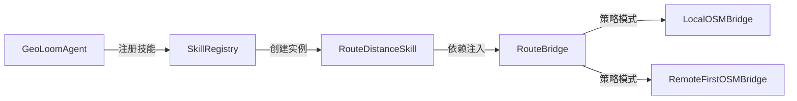
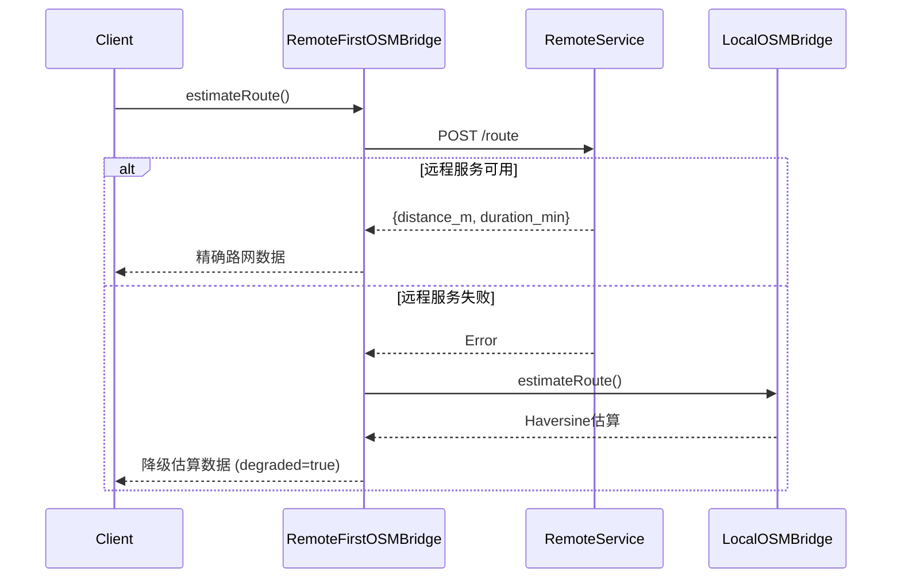

路径距离计算技能（RouteDistance Skill）是 GeoLoom Agent 系统中负责**路网可达性分析**的核心组件。该技能提供点到点距离估算和多候选目的地排序能力，为智能体在地理空间推理中提供现实可达性维度支撑。

## 核心架构设计

### 技能注册与依赖注入

RouteDistance 技能遵循标准的技能工厂模式，通过 `createRouteDistanceSkill` 函数创建可配置的技能实例。该设计允许依赖注入不同的路由桥接实现，从而支持本地估算和远程服务的灵活切换。



在服务器启动流程中，路由桥接实例被创建并注入到技能中：

Sources: [backend/src/server.ts#L9](backend/src/server.ts#L9-L9), [backend/src/server.ts#L66](backend/src/server.ts#L66-L66), [backend/src/server.ts#L134](backend/src/server.ts#L134-L134)

### 双层桥接模式

技能核心依赖 `RouteBridge` 接口，该接口定义了路由估算的统一契约：

```typescript
export interface RouteBridge {
  estimateRoute(origin: [number, number], destination: [number, number], mode: string): Promise<RouteEstimate>
  getStatus(): Promise<DependencyStatus>
}
```

Sources: [backend/src/integration/osmBridge.ts#L11-L14](backend/src/integration/osmBridge.ts#L11-L14)

## 技能动作定义

### 单点距离估算：get_route_distance

该动作计算两点之间的路网距离和预估耗时，输入输出规范如下：

| 字段 | 类型 | 说明 |
|------|------|------|
| `origin` | Point | 起点坐标 `[lon, lat]` |
| `destination` | Point | 终点坐标 `[lon, lat]` |
| `mode` | string | 出行方式：`walking` 或 `driving` |

返回结果包含：
- `distance_m`：路网距离（米）
- `duration_min`：预估耗时（分钟）
- `degraded`：是否处于降级模式
- `degraded_reason`：降级原因说明

Sources: [backend/src/skills/route_distance/RouteDistanceSkill.ts#L8-L27](backend/src/skills/route_distance/RouteDistanceSkill.ts#L8-L27)

### 多候选排序：get_multi_destination_matrix

该动作用于对多个候选目的地按距离进行排序，常用于 POI 推荐排序和区域可达性评估场景：

```typescript
// 输入结构
{
  origin: Point,
  destinations: Array<Point & { id?: string }>,
  mode?: string
}

// 输出结构
{
  results: Array<{
    id: string,
    distance_m: number,
    duration_min: number,
    rank: number  // 1 = 最近
  }>
}
```

Sources: [backend/src/skills/route_distance/actions/getMultiDestination.ts#L10-L32](backend/src/skills/route_distance/actions/getMultiDestination.ts#L10-L32)

## 路由桥接实现

### 本地估算器：LocalOSMBridge

当外部路网服务不可用时，系统使用 Haversine 公式进行直线距离估算，并应用 1.25 倍路网因子进行修正：

```javascript
// Haversine 公式计算球面距离
const earthRadiusMeters = 6371000
const deltaLat = toRadians(destination[1] - origin[1])
const deltaLon = toRadians(destination[0] - origin[0])
const a = Math.sin(deltaLat / 2) ** 2 
        + Math.cos(lat1) * Math.cos(lat2) * Math.sin(deltaLon / 2) ** 2
const distance = haversineDistance * 1.25  // 路网修正系数
```

Sources: [backend/src/integration/osmBridge.ts#L20-L36](backend/src/integration/osmBridge.ts#L20-L36)

速度参数根据出行模式确定：
- **步行模式**：75 米/分钟（约 4.5 km/h）
- **驾车模式**：600 米/分钟（约 36 km/h）

Sources: [backend/src/integration/osmBridge.ts#L37](backend/src/integration/osmBridge.ts#L37)

### 远程优先桥接：RemoteFirstOSMBridge

该实现采用远程优先降级策略，优先尝试调用外部路网服务，失败时自动回退到本地估算：



Sources: [backend/src/integration/osmBridge.ts#L112-L154](backend/src/integration/osmBridge.ts#L112-L154)

## 降级模式语义

SKILL.md 明确定义了降级处理的强制性要求：**若外部路网服务不可用，必须显式标记 degraded，不允许静默切换口径**。

Sources: [backend/SKILLS/RouteDistance/SKILL.md#L12](backend/SKILLS/RouteDistance/SKILL.md#L12-L12)

这一设计确保了智能体在生成响应时能够感知数据质量，从而在叙事中适当表达可达性估算的不确定性。

## 配置与环境变量

远程路由服务通过以下环境变量配置：

| 变量名 | 默认值 | 说明 |
|--------|--------|------|
| `ROUTING_BASE_URL` | 空字符串 | 路由服务基础 URL，未配置时使用本地估算 |
| `ROUTING_ROUTE_PATH` | `/route` | 路线计算接口路径 |
| `ROUTING_HEALTH_PATH` | `/health` | 健康检查接口路径 |
| `ROUTING_TIMEOUT_MS` | `3000` | 请求超时（毫秒） |

Sources: [backend/src/integration/osmBridge.ts#L81-L92](backend/src/integration/osmBridge.ts#L81-L92)

## 健康状态监控

技能实现了 `getStatus()` 接口，向外暴露运行时状态：

```typescript
{
  name: 'route_distance',
  ready: boolean,        // 服务是否就绪
  mode: 'remote' | 'fallback' | 'local',
  degraded: boolean,      // 是否处于降级模式
  reason?: string,       // 降级原因
  target?: string        // 远程服务地址
}
```

Sources: [backend/src/integration/dependencyStatus.ts#L3-L11](backend/src/integration/dependencyStatus.ts#L3-L11)

在 GeoLoomAgent 的健康检查端点中，所有技能的状态会被聚合汇总：

Sources: [backend/src/agent/GeoLoomAgent.ts#L376-L379](backend/src/agent/GeoLoomAgent.ts#L376-L379)

## 单元测试覆盖

技能实现了两个核心测试场景：

**单点距离计算测试**：验证武汉坐标点到另一坐标点的距离估算返回有效数值。

**多候选排序测试**：验证远处目的地（`id: 'far'`）和近处目的地（`id: 'near'`）的排序结果正确性。

Sources: [backend/tests/unit/skills/route_distance/RouteDistanceSkill.spec.ts](backend/tests/unit/skills/route_distance/RouteDistanceSkill.spec.ts#L1-L42)

**桥接降级测试**：覆盖远程服务可用、远程服务失败、瞬时故障恢复三种场景。

Sources: [backend/tests/unit/integration/osmBridge.spec.ts](backend/tests/unit/integration/osmBridge.spec.ts#L1-L102)

## 在技能系统中的位置

路径距离计算技能是 GeoLoom Agent 技能生态中的**基础设施技能**，与其他技能形成互补关系：

- **[空间向量检索技能](8-kong-jian-xiang-liang-jian-suo-ji-neng)**：提供语义相似区域搜索
- **[PostGIS 空间数据库技能](7-postgis-kong-jian-shu-ju-ku-ji-neng)**：提供周边 POI 查询
- **路径距离计算技能**：提供可达性维度排序

三者结合可实现"找相似区域 → 查周边设施 → 按可达性排序"的完整分析链路。

## 扩展与集成

### 自定义路由服务

若需接入私有路由服务（如 OSRM、GraphHopper），可配置 `ROUTING_BASE_URL` 并确保接口兼容：

```json
// 期望的路由服务响应格式
{
  "distance_m": 1234.5,
  "duration_min": 15,
  "degraded": false,
  "degraded_reason": null
}
```

### 混合出行模式

当前支持 `walking` 和 `driving` 两种模式。如需扩展骑行（`cycling`）等模式，需同时修改 `LocalOSMBridge` 的速度参数和 `RemoteFirstOSMBridge` 的请求逻辑。

---

**相关文档**：[技能注册与调度系统](6-ji-neng-zhu-ce-yu-diao-du-xi-tong) · [确定性路由解析器](13-que-ding-xing-lu-you-jie-xi-qi) · [依赖服务健康检查](22-yi-lai-fu-wu-jian-kang-jian-cha)