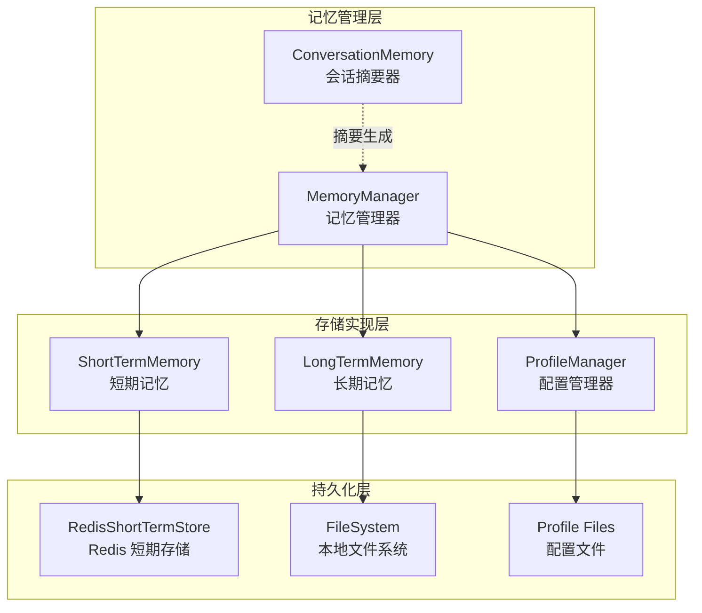

GeoLoom Agent 的记忆管理系统采用**分层存储架构**，通过短期记忆与长期记忆的协同工作，在保持会话上下文连贯性的同时，支持分布式部署场景下的状态持久化。该架构的核心设计理念是**远程优先、降级可用**——优先使用 Redis 等分布式存储，当远程服务不可用时自动回退到内存存储，确保系统在任何情况下都能继续服务。

## 架构分层概述

记忆管理器由四个核心组件构成，形成从数据源到消费端的完整数据流。以下架构图展示了各组件之间的关系：



这种分层设计的优势在于职责清晰：存储实现层专注于数据持久化策略，管理层负责协调多个存储源，摘要器则将原始数据转换为 LLM 可消费的格式。

## 核心数据结构

记忆管理系统的数据模型围绕会话生命周期设计，主要包含以下类型定义：

| 类型名称 | 用途描述 | 关键字段 |
|---------|---------|---------|
| `MemorySnapshot` | 会话快照，包含完整上下文 | sessionId, summary, recentTurns, turns |
| `MemoryTurn` | 单次交互记录 | traceId, userQuery, answer, createdAt |
| `ShortTermRecordData` | 短期记忆存储格式 | sessionId, summary, turns, updatedAt |
| `ProfilesSnapshot` | AI 人格配置 | soul, user |
| `DependencyStatus` | 依赖服务健康状态 | name, ready, mode, degraded |

Sources: [backend/src/agent/types.ts](backend/src/agent/types.ts#L1-L28)
Sources: [backend/src/memory/ShortTermMemory.ts](backend/src/memory/ShortTermMemory.ts#L4-L15)

## 短期记忆组件

`ShortTermMemory` 类实现了会话短期存储的核心逻辑，采用**本地内存优先、远程同步备份**的双层存储策略。每个会话的记录包含用户查询、AI 回答和完整的时间戳，用于后续的摘要生成和上下文恢复。

```typescript
// 核心数据结构
interface ShortTermRecordData {
  sessionId: string
  summary: string      // 自动生成的会话摘要
  turns: MemoryTurn[]   // 所有交互记录
  updatedAt: number     // 最后更新时间戳
}
```

该组件的核心方法包括：`getSnapshot` 用于获取会话快照并自动裁剪为最近 3 条记录，`appendTurn` 用于追加新交互并触发摘要重建，`getStatus` 用于返回健康检查状态。自动摘要生成策略是将最近 2 次交互拼接为 `"用户问题1 -> 回答1 | 用户问题2 -> 回答2"` 的格式。

Sources: [backend/src/memory/ShortTermMemory.ts](backend/src/memory/ShortTermMemory.ts#L22-L189)

### 健康状态与降级模式

短期记忆支持三种运行模式，每种模式对应不同的健康状态：

| 模式 | 触发条件 | ready 字段 | degraded 字段 | 说明 |
|------|---------|-----------|---------------|------|
| `local` | 未配置远程存储 | true | true | 使用内存存储，适合单机部署 |
| `remote` | Redis 连接正常 | true | false | 正常工作的分布式模式 |
| `fallback` | Redis 连接失败 | true | true | 自动降级到内存存储 |

这种设计确保了系统在 Redis 服务不可用时能够继续运行，尽管此时无法跨实例共享会话状态。

Sources: [backend/src/memory/ShortTermMemory.ts](backend/src/memory/ShortTermMemory.ts#L31-L50)
Sources: [backend/src/memory/ShortTermMemory.ts](backend/src/memory/ShortTermMemory.ts#L180-L188)

## Redis 远程存储实现

`RedisShortTermStore` 提供了可选的 Redis 分布式存储支持。该实现直接使用 Node.js 的 `net` 和 `tls` 模块构建 TCP 连接，手动实现了 Redis 协议解析器，无需引入额外的 Redis 客户端依赖。

### 协议解析器实现

协议解析器支持 Redis 响应格式的四个核心类型：

- **简单字符串** (`+`): 用于 PING 等命令的 OK 响应
- **错误** (`-`): 抛出为 JavaScript Error
- **整数** (`:`): 转换为 Number 类型
- **批量字符串** (`$`): 处理 null 值和二进制数据

```typescript
function parseRedisValue(buffer: Buffer, offset = 0): { value: RedisValue, nextOffset: number } {
  const type = String.fromCharCode(buffer[offset])
  // 根据类型解析相应格式
  if (type === '+') return { value: header.line, nextOffset: header.nextOffset }
  if (type === ':') return { value: Number(header.line), nextOffset: header.nextOffset }
  if (type === '$') {
    const length = Number(header.line)
    if (length === -1) return { value: null, nextOffset: header.nextOffset }
    // 解析固定长度的二进制数据
  }
  // ...
}
```

Sources: [backend/src/memory/RedisShortTermStore.ts](backend/src/memory/RedisShortTermStore.ts#L26-L83)

### 连接与认证

Redis 连接器支持完整的连接选项：

- **协议支持**: `redis://` 明文连接和 `rediss://` TLS 加密连接
- **认证**: 支持 AUTH 命令的用户名/密码认证
- **数据库选择**: 通过 URL 路径指定数据库索引
- **连接超时**: 可配置的连接超时时间（默认 2000ms）

```typescript
function createSocket(url: URL) {
  if (url.protocol === 'rediss:') {
    return tls.connect({
      host: url.hostname,
      port: Number(url.port || 6380),
      servername: url.hostname,
    })
  }
  return net.createConnection({
    host: url.hostname,
    port: Number(url.port || 6379),
  })
}
```

Sources: [backend/src/memory/RedisShortTermStore.ts](backend/src/memory/RedisShortTermStore.ts#L91-L104)

### 环境变量配置

通过 `createRedisShortTermStoreFromEnv` 工厂函数从环境变量创建存储实例：

| 环境变量 | 默认值 | 说明 |
|---------|--------|------|
| `REDIS_URL` | 空（不启用） | Redis 连接 URL，如 `redis://localhost:6379` |
| `SHORT_TERM_MEMORY_PREFIX` | `v4:short-term:` | Redis Key 前缀 |
| `REDIS_CONNECT_TIMEOUT_MS` | `2000` | 连接超时（毫秒） |

Sources: [backend/src/memory/RedisShortTermStore.ts](backend/src/memory/RedisShortTermStore.ts#L209-L220)

## 长期记忆组件

`LongTermMemory` 负责会话摘要的持久化存储，采用简单的 JSON 文件系统存储策略。与短期记忆不同，长期记忆只存储经过摘要处理的信息，避免了原始交互数据的无限膨胀。

### 存储格式

每个会话的摘要以单独文件存储在 `dataDir` 目录下，文件名为 `${sessionId}.json`：

```json
{
  "sessionId": "sess_abc123",
  "summary": "用户查询了武汉大学附近的咖啡店... | 用户进一步询问了地铁站信息...",
  "updatedAt": "2026-04-08T10:30:00.000Z"
}
```

Sources: [backend/src/memory/LongTermMemory.ts](backend/src/memory/LongTermMemory.ts#L18-L27)

### 读写操作

长期记忆提供两个核心操作：

- **`appendSessionSummary`**: 追加或更新会话摘要，自动创建目录结构
- **`readSessionSummary`**: 读取指定会话的摘要，文件不存在时返回空字符串

```typescript
async appendSessionSummary(sessionId: string, summary: string) {
  await mkdir(this.dataDir, { recursive: true })
  const filepath = join(this.dataDir, `${sessionId}.json`)
  const payload = { sessionId, summary, updatedAt: new Date().toISOString() }
  await writeFile(filepath, JSON.stringify(payload, null, 2), 'utf8')
}
```

Sources: [backend/src/memory/LongTermMemory.ts](backend/src/memory/LongTermMemory.ts#L18-L27)

## 记忆管理器编排

`MemoryManager` 是整个记忆系统的协调中心，它聚合短期记忆、长期记忆和配置管理器，为上层应用提供统一的记忆接口。

### 快照聚合逻辑

`getSnapshot` 方法是记忆聚合的核心，它将短期记忆的完整记录与长期记忆的摘要合并：

```typescript
async getSnapshot(sessionId: string): Promise<MemorySnapshot> {
  const shortTerm = await this.options.shortTerm.getSnapshot(sessionId)
  const longTermSummary = await this.options.longTerm.readSessionSummary(sessionId)
  
  return {
    ...shortTerm,
    summary: [longTermSummary, shortTerm.summary].filter(Boolean).join(' | '),
  }
}
```

这种合并策略确保了最终的摘要包含：历史会话的长期记忆 + 当前会话的短期摘要。

Sources: [backend/src/memory/MemoryManager.ts](backend/src/memory/MemoryManager.ts#L16-L24)

### 记忆记录流程

`recordTurn` 方法在每次 AI 交互完成后被调用，负责将新的对话轮次同时写入短期和长期存储：

1. 调用 `shortTerm.appendTurn` 添加新记录
2. 获取更新后的完整快照
3. 调用 `longTerm.appendSessionSummary` 持久化摘要

```typescript
async recordTurn(sessionId: string, turn: MemorySnapshot['turns'][number]) {
  await this.options.shortTerm.appendTurn(sessionId, turn)
  const snapshot = await this.options.shortTerm.getSnapshot(sessionId)
  await this.options.longTerm.appendSessionSummary(sessionId, snapshot.summary)
}
```

Sources: [backend/src/memory/MemoryManager.ts](backend/src/memory/MemoryManager.ts#L26-L30)

### 健康检查集成

记忆管理器实现了完整的健康检查接口，返回各存储组件的状态：

```typescript
async getHealth(): Promise<{
  ready: boolean
  short_term: DependencyStatus
  long_term: DependencyStatus
  dependencies: Record<string, DependencyStatus>
}>
```

Sources: [backend/src/memory/MemoryManager.ts](backend/src/memory/MemoryManager.ts#L36-L61)

## 配置管理

`ProfileManager` 负责加载 AI 人格配置文件，支持从文件系统读取 `soul.md.default` 和 `user.md.default` 两个配置文件。如果文件不存在，则使用内置的默认配置。

| 配置文件 | 用途 | 默认值 |
|---------|------|--------|
| `soul.md.default` | AI 灵魂角色设定 | "你是一个证据驱动的 GeoLoom 空间助手。" |
| `user.md.default` | 用户偏好描述 | "用户偏好清晰、具体、可落地的空间回答。" |

Sources: [backend/src/memory/ProfileManager.ts](backend/src/memory/ProfileManager.ts#L20-L34)

## 会话摘要器

`ConversationMemory` 是记忆系统与 LLM 提示词构建之间的桥接组件。它将原始的 `MemorySnapshot` 转换为更适合注入到 System Prompt 的格式。

```typescript
export class ConversationMemory {
  summarize(snapshot: MemorySnapshot) {
    if (!snapshot.summary) {
      return { summary: '', recentTurns: [] }
    }
    return {
      summary: snapshot.summary,
      recentTurns: snapshot.recentTurns.slice(-3),
    }
  }
}
```

该组件确保即使在无历史记录的初始会话中，LLM 也能获得结构化的上下文输入。

Sources: [backend/src/agent/ConversationMemory.ts](backend/src/agent/ConversationMemory.ts#L1-L18)

## 启动初始化流程

在 `server.ts` 中，记忆系统作为依赖注入链的一部分被初始化：

```typescript
const shortTerm = new ShortTermMemory({
  ttlMs: Number(process.env.SHORT_TERM_MEMORY_TTL_MS || `${24 * 60 * 60 * 1000}`),
  store: createRedisShortTermStoreFromEnv(),
})

const memory = new MemoryManager({
  shortTerm,
  longTerm: new LongTermMemory({
    dataDir: resolveResourceUrl(import.meta.url, ['../data/memory/', '../../data/memory/']),
  }),
  profiles: new ProfileManager({
    profileDir: resolveResourceUrl(import.meta.url, ['../profiles/', '../../profiles/']),
  }),
})
```

Sources: [backend/src/server.ts](backend/src/server.ts#L48-L60)

### TTL 配置

短期记忆的默认 TTL（Time To Live）为 **24 小时**（86400000 毫秒），可通过 `SHORT_TERM_MEMORY_TTL_MS` 环境变量调整。对于需要更短或更长会话保持时间的部署场景，可灵活配置。

Sources: [backend/src/server.ts](backend/src/server.ts#L48-L51)

## 在 GeoLoomAgent 中的集成

GeoLoomAgent 在处理每个请求时，通过以下步骤使用记忆系统：

1. **创建会话**: 通过 SessionManager 获取或创建会话
2. **读取记忆**: 调用 `memory.getSnapshot` 获取上下文
3. **加载配置**: 调用 `memory.loadProfiles` 获取人格设定
4. **构建提示词**: 将记忆和配置注入 AlivePromptBuilder
5. **记录结果**: 交互完成后调用 `memory.recordTurn`

```typescript
await writer.stage('memory')
const snapshot = this.conversationMemory.summarize(await this.memory.getSnapshot(session.id))
const profiles = await this.memory.loadProfiles()
const systemPrompt = this.alivePromptBuilder.build({
  sessionId: session.id,
  profiles,
  memory: {
    summary: snapshot.summary,
    recentTurns: snapshot.recentTurns,
  },
  skillSnippets: manifests.map((manifest) => manifest.promptSnippet),
})
```

Sources: [backend/src/agent/GeoLoomAgent.ts](backend/src/agent/GeoLoomAgent.ts#L482-L502)

## 单元测试验证

记忆系统的核心行为通过单元测试覆盖，确保降级路径的正确性：

```typescript
it('persists snapshots through the remote store when the store is available', async () => {
  const memory = new ShortTermMemory({ ttlMs: 60_000, store })
  await memory.appendTurn('sess_remote_memory', turnData)
  const snapshot = await memory.getSnapshot('sess_remote_memory')
  expect(snapshot.turns).toHaveLength(1)
  expect(store.setRecord).toHaveBeenCalledTimes(1)
})

it('falls back to in-memory state when the remote store is unavailable', async () => {
  const memory = new ShortTermMemory({ ttlMs: 60_000, store })
  await memory.appendTurn('sess_memory_fallback', turnData)
  const snapshot = await memory.getSnapshot('sess_memory_fallback')
  expect(snapshot.turns).toHaveLength(1)
  await expect(memory.getStatus()).resolves.toMatchObject({
    mode: 'fallback',
    degraded: true,
  })
})
```

Sources: [backend/tests/unit/memory/ShortTermMemory.spec.ts](backend/tests/unit/memory/ShortTermMemory.spec.ts#L1-L78)

## 架构决策记录

### 决策一：本地优先的降级策略

**问题**: 如何确保在 Redis 不可用时系统仍能正常工作？

**方案**: 采用本地内存存储 + 远程同步的双层架构。远程失败时自动降级到纯内存模式，记录 `degraded: true` 状态供监控使用。

**权衡**: 降级模式下会话状态无法跨实例共享，但系统整体可用性得到保障。

### 决策二：JSON 文件存储的长期记忆

**问题**: 长期记忆的持久化需要什么样的存储复杂度？

**方案**: 使用简单的 JSON 文件系统存储，仅保存会话摘要而非完整交互记录。

**权衡**: 避免了数据库依赖，但不支持复杂查询。摘要机制确保长期记忆数据量可控。

### 决策三：无外部依赖的 Redis 客户端

**问题**: 是否引入 Redis 客户端库？

**方案**: 手动实现 Redis 协议解析器，使用 Node.js 内置的 `net` 和 `tls` 模块。

**权衡**: 减少了依赖项，但需要维护协议解析代码。解析器仅支持当前场景必需的命令子集。

## 后续阅读建议

- 深入了解 [会话与上下文管理](12-hui-hua-yu-shang-xia-wen-guan-li)：掌握 SessionManager 如何与记忆系统协同工作
- 探索 [GeoLoomAgent 智能体核心](4-geoloomagent-zhi-neng-ti-he-xin)：理解记忆在 Agent 决策循环中的角色
- 参考 [依赖服务健康检查](22-yi-lai-fu-wu-jian-kang-jian-cha)：学习健康检查机制如何监控记忆系统状态