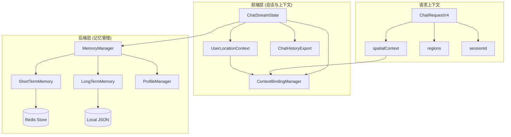
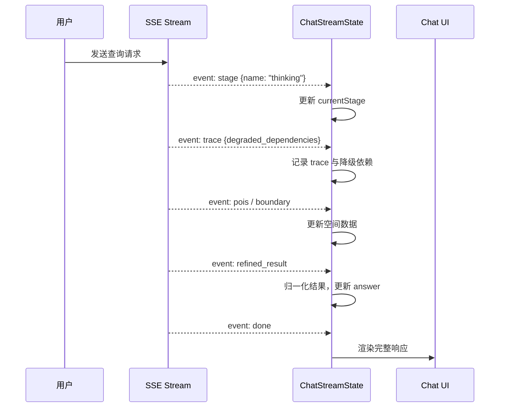
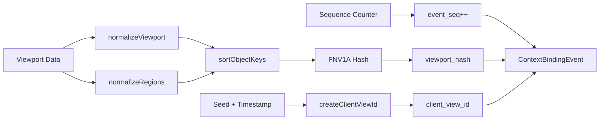
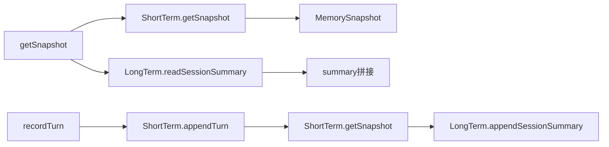
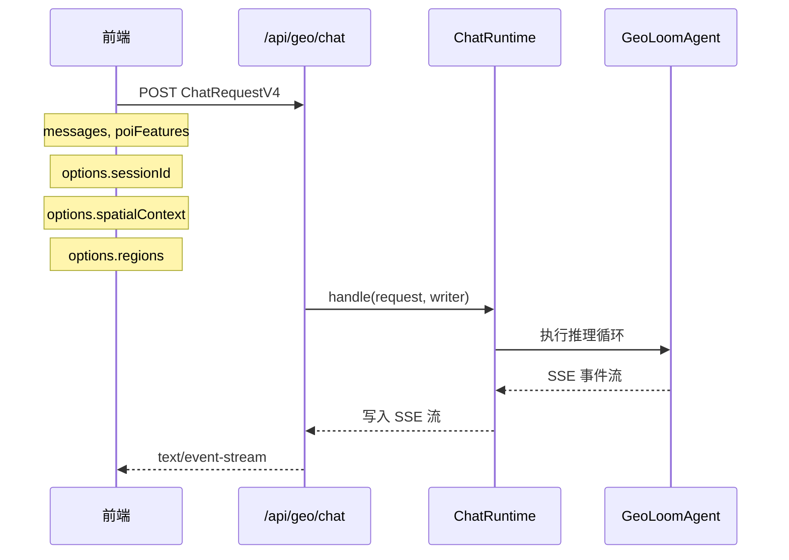

GeoLoom Agent 的会话与上下文管理系统负责维护用户对话状态、空间上下文绑定和记忆持久化。该系统采用分层架构设计，从前端的流式状态追踪到后端的多级记忆存储，形成完整的上下文生命周期管理。

## 系统架构概览



会话管理的核心在于追踪每次对话轮次的完整状态，包括用户查询、AI 推理过程、工具调用和最终响应。上下文管理则负责将空间信息（视口、区域、用户位置）与会话绑定，确保每次请求都能获取正确的空间上下文。

Sources: [src/lib/chatStreamState.ts](src/lib/chatStreamState.ts#L1-L167), [backend/src/memory/MemoryManager.ts](backend/src/memory/MemoryManager.ts#L1-L63), [backend/src/chat/types.ts](backend/src/chat/types.ts#L1-L50)

## 前端会话状态追踪

### ChatStreamState 状态机

前端通过 `AssistantRun` 接口追踪每个对话会话的完整生命周期。该状态机采用事件驱动模式，通过 `applyStreamEvent` 函数处理 SSE 流中的各类事件。



`AssistantRun` 数据结构记录了会话的关键状态字段：`id` 生成唯一标识符，`currentStage` 追踪当前处理阶段，`thinking` 存储推理过程，`toolCalls` 记录函数调用轨迹，`evidenceView` 保存最终证据视图。每个事件都会被记录到 `events` 数组中（最多保留 24 条）以支持调试追踪。

Sources: [src/lib/chatStreamState.ts](src/lib/chatStreamState.ts#L38-L80), [src/lib/chatStreamState.ts](src/lib/chatStreamState.ts#L83-L167)

### 流式事件处理

`applyStreamEvent` 函数根据事件类型执行差异化处理。`stage` 事件更新当前处理阶段，`thinking` 事件累积推理消息，`trace` 事件记录降级依赖项，`refined_result` 事件触发结果归一化并更新最终答案。

| 事件类型 | 处理逻辑 | 影响字段 |
|---------|---------|---------|
| `trace` | 提取 degraded_dependencies | degradedDependencies, trace |
| `stage` | 更新当前阶段名 | currentStage |
| `thinking` | 累积推理消息 | thinking |
| `pois` | 替换 POI 列表 | pois |
| `boundary` | 更新区域边界 | boundary |
| `refined_result` | 归一化并更新完整结果 | answer, toolCalls, evidenceView |
| `done` | 标记完成状态 | complete |
| `error` | 记录错误信息 | error, complete |

Sources: [src/lib/chatStreamState.ts](src/lib/chatStreamState.ts#L86-L167)

## 上下文绑定机制

### ContextBindingManager

`ContextBindingManager` 负责生成稳定的视口哈希和事件序列，确保空间上下文的一致性追踪。



上下文绑定事件包含以下关键字段：`viewport_hash` 通过 FNV1A 算法对规范化后的视口、绘图模式和区域数据生成稳定哈希，`client_view_id` 基于种子值生成的唯一客户端标识，`event_seq` 递增的事件序列号，`captured_at_ms` 捕获时间戳。

Sources: [src/utils/contextBinding.ts](src/utils/contextBinding.ts#L1-L191)

### 视口哈希生成

`buildViewportHash` 函数通过规范化处理确保哈希的确定性：视口坐标统一保留 6 位小数精度，区域数据按 ID、名称、类型排序后参与哈希计算。这种设计确保相同的空间状态始终生成相同的哈希值，便于上下文变更检测。

Sources: [src/utils/contextBinding.ts](src/utils/contextBinding.ts#L130-L155)

## 用户位置上下文

### 浏览器地理定位

`userLocationContext` 模块处理浏览器地理定位 API 的数据规范化。它将 WGS84 坐标转换为 GCJ02 坐标系（国内地图标准），并通过精度和距离阈值评估定位可靠性。

```typescript
// 坐标转换与质量评估流程
UserLocation -> createBrowserUserLocation() 
  -> toDisplayLonLat(rawLon, rawLat, 'wgs84')
  -> assessBrowserUserLocation()
     -> haversineDistanceKm() // 计算与参考点距离
     -> 返回 {reliable, reason, accuracyM, distanceKm}
```

Sources: [src/utils/userLocationContext.ts](src/utils/userLocationContext.ts#L1-L200), [backend/src/chat/types.ts](backend/src/chat/types.ts#L53-L63)

### 位置评估规则

| 评估条件 | 返回 reason | 说明 |
|---------|------------|------|
| 坐标无效 | `invalid_coordinates` | lon/lat 为 null |
| 精度过差 | `accuracy_too_coarse` | accuracyM > maxReasonableAccuracyM (默认 1500m) |
| 远离参考点 | `far_from_reference` | distanceKm > maxReferenceDistanceKm (默认 80km) |
| 极端精度差 | `accuracy_too_coarse` | accuracyM > hardRejectAccuracyM (5000m) |

Sources: [src/utils/userLocationContext.ts](src/utils/userLocationContext.ts#L150-L200)

## 后端记忆管理系统

### MemoryManager 协调层

`MemoryManager` 是记忆系统的核心协调器，它整合短期记忆、长期记忆和用户配置文件的访问接口。



Sources: [backend/src/memory/MemoryManager.ts](backend/src/memory/MemoryManager.ts#L1-L63)

### 短期记忆存储

`ShortTermMemory` 采用内存 Map 配合可选 Redis 存储的双层架构。默认 TTL 为 24 小时，支持自动过期清理和远程同步。

```typescript
interface ShortTermRecordData {
  sessionId: string
  summary: string        // 自动生成的会话摘要
  turns: MemoryTurn[]    // 对话轮次记录
  updatedAt: number      // 最后更新时间
}
```

关键方法：`getSnapshot` 获取会话快照，`appendTurn` 追加对话轮次并自动生成摘要，`setSummary` 手动设置摘要。摘要生成逻辑为最近 2 个轮次的 `userQuery -> answer` 拼接。

Sources: [backend/src/memory/ShortTermMemory.ts](backend/src/memory/ShortTermMemory.ts#L1-L190)

### Redis 持久化存储

`RedisShortTermStore` 提供 Redis 连接实现，支持 AUTH 认证、数据库选择和 RESP 协议解析。连接超时默认 2 秒，键名前缀为 `v4:short-term:`。

```typescript
// 存储操作
async getRecord(sessionId): Promise<ShortTermRecordData | null>
async setRecord(sessionId, record, ttlMs): Promise<void>
async ping(): Promise<unknown>

// Redis 连接参数
url: string           // redis:// 或 rediss://
keyPrefix?: string    // 默认 'v4:short-term:'
connectTimeoutMs?: number  // 默认 2000
```

Sources: [backend/src/memory/RedisShortTermStore.ts](backend/src/memory/RedisShortTermStore.ts#L1-L221)

### 长期记忆存储

`LongTermMemory` 将会话摘要持久化到本地 JSON 文件，支持夸会话的长期上下文恢复。文件存储在配置的 `dataDir` 目录下，文件名为 `{sessionId}.json`。

```typescript
interface StoredSummary {
  sessionId: string
  summary: string
  updatedAt: string  // ISO 时间戳
}
```

Sources: [backend/src/memory/LongTermMemory.ts](backend/src/memory/LongTermMemory.ts#L1-L40)

### ProfileManager 配置管理

`ProfileManager` 加载灵魂角色配置和用户偏好配置，支持 Markdown 格式的个性化提示词。

```typescript
interface ProfilesSnapshot {
  soul: string   // AI 灵魂角色描述
  user: string   // 用户偏好说明
}
```

配置文件默认路径为 `backend/profiles/`，包含 `soul.md.default` 和 `user.md.default` 两个模板文件。

Sources: [backend/src/memory/ProfileManager.ts](backend/src/memory/ProfileManager.ts#L1-L35)

## 请求上下文传递

### ChatRequestV4 上下文结构



`ChatRequestV4` 的 `options` 字段承载会话与空间上下文信息：sessionId 标识会话，`spatialContext` 传递额外空间参数，`regions` 指定分析区域列表。

Sources: [backend/src/chat/types.ts](backend/src/chat/types.ts#L11-L27), [backend/src/routes/chat.ts](backend/src/routes/chat.ts#L1-L92)

## 对话历史导出

### ChatHistoryExport 内容构建

`buildChatHistoryExportContent` 函数将消息数组转换为可读文本格式，支持对话编号、时间戳和推理内容分离展示。

```typescript
interface ChatHistoryMessage {
  role?: 'user' | 'assistant'
  content?: string
  timestamp?: string | number | Date
  thinkingMessage?: string   // 推理状态
  reasoningContent?: string // 详细推理
}
```

导出格式使用圆形数字符号（① ② ③...）标记对话序号，区分用户消息、智能助手响应和空间推理内容。

Sources: [src/utils/chatHistoryExport.ts](src/utils/chatHistoryExport.ts#L1-L86)

## 健康状态监控

MemoryManager 提供统一的健康检查接口，报告各记忆组件的可用性状态。

```typescript
interface MemoryHealth {
  ready: boolean
  short_term: DependencyStatus  // 短期记忆状态
  long_term: DependencyStatus   // 长期记忆状态
  dependencies: Record<string, DependencyStatus>
}
```

| 组件 | 模式 | 状态说明 |
|-----|------|---------|
| ShortTermMemory | local | 仅内存模式，未配置远程存储 |
| ShortTermMemory | remote | Redis 连接正常 |
| ShortTermMemory | fallback | Redis 不可用，回退到内存 |
| LongTermMemory | local | 本地文件存储 |

Sources: [backend/src/memory/MemoryManager.ts](backend/src/memory/MemoryManager.ts#L48-L63), [backend/src/memory/ShortTermMemory.ts](backend/src/memory/ShortTermMemory.ts#L48-L75)

## 进阶阅读

- [记忆管理器架构](11-ji-yi-guan-li-qi-jia-gou) — 深入了解多级记忆存储设计
- [确定性路由解析器](13-que-ding-xing-lu-you-jie-xi-qi) — 上下文如何影响路由决策
- [SSE 事件流协议](15-sse-shi-jian-liu-xie-yi) — 流式状态更新的传输机制
- [AI 聊天界面组件](17-ai-liao-tian-jie-mian-zu-jian) — 前端会话 UI 实现