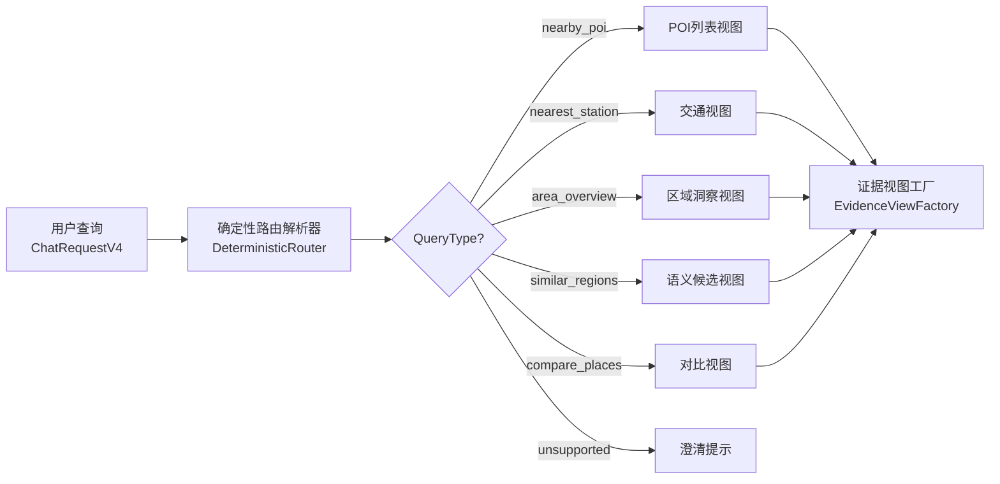
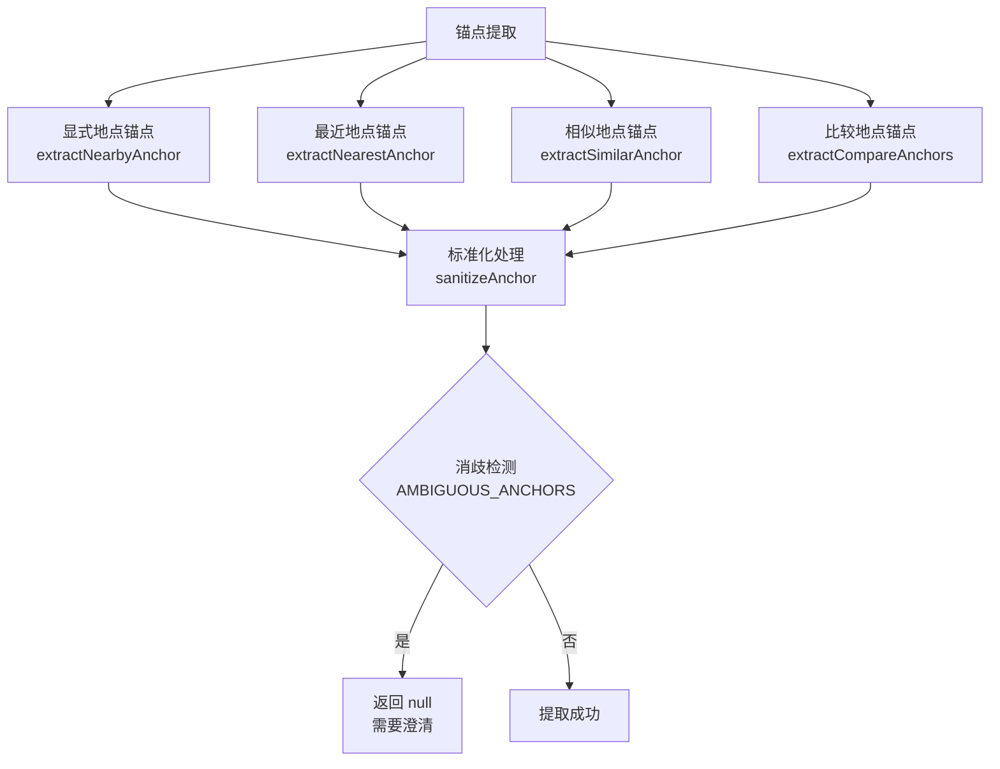
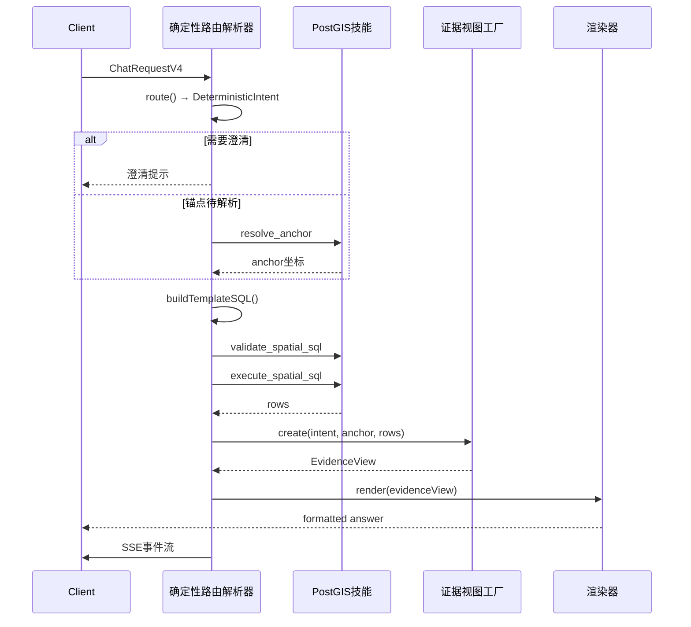

确定性路由解析器是 GeoLoom V4 系统中负责将自然语言空间查询转换为结构化执行意图的核心组件。与传统 LLM 驱动的意图识别不同，该解析器采用**纯规则引擎**实现，具备零幻觉风险、毫秒级响应和可审计决策路径的确定性行为特征。

## 架构定位

确定性路由解析器位于 [GeoLoomAgent 智能体核心](4-geoloomagent-zhi-neng-ti-he-xin) 与 [证据视图工厂](14-zheng-ju-shi-tu-gong-han) 之间，承担着请求理解的第一道关卡职责。其输出结果直接决定了后续 SQL 模板生成、技能调度和证据渲染的执行路径。



Sources: [DeterministicRouter.ts](backend/src/chat/DeterministicRouter.ts#L1-L55) | [EvidenceViewFactory.ts](backend/src/evidence/EvidenceViewFactory.ts#L1-L68)

## 查询类型体系

解析器定义了六种结构化查询类型，每种类型对应特定的执行模板和渲染策略。

| 查询类型 | 英文标识 | 语义说明 | 默认半径 | 意图模式 |
|---------|---------|---------|---------|----------|
| 附近查询 | `nearby_poi` | 检索特定地点周边指定类别的 POI | 800m | deterministic_visible_loop |
| 最近站点 | `nearest_station` | 查询最近地铁站及距离 | 3000m | agent_full_loop |
| 区域洞察 | `area_overview` | 分析当前区域业态、配套与机会 | 1200m | agent_full_loop |
| 相似片区 | `similar_regions` | 查找气质相似的其他区域 | 1200m | agent_full_loop |
| 地点比较 | `compare_places` | 对比两个地点的商业特征 | 800m | agent_full_loop |
| 不支持 | `unsupported` | 无法解析的查询类型 | — | — |

Sources: [types.ts](backend/src/chat/types.ts#L24-L30)

### 各类型解析规则详解

**附近查询 (`nearby_poi`)** 通过正则表达式 `/附近|周边/u` 识别，并在提取锚点后完成类别推断：

```typescript
if (/(附近|周边)/u.test(normalizedText)) {
  const placeName = extractNearbyAnchor(normalizedText)
  return {
    queryType: 'nearby_poi',
    intentMode: 'deterministic_visible_loop',
    placeName,
    targetCategory,
    radiusM: 800,
  }
}
```

Sources: [DeterministicRouter.ts](backend/src/chat/DeterministicRouter.ts#L306-L336)

**区域洞察 (`area_overview`)** 是解析复杂度最高的类型，支持三种锚点来源：

```typescript
// 锚点来源优先级: 用户定位 > 地图视口 > 显式地点
const useUserLocationAnchor = isUserRelativeAnchor(normalizedText)  // "我附近"
const useMapViewAnchor = requestHasSpatialView && currentAreaReference  // "这里"
const usePlaceAnchor = placeName && !currentAreaReference  // "武汉大学附近"
```

Sources: [DeterministicRouter.ts](backend/src/chat/DeterministicRouter.ts#L252-L288)

## 锚点提取机制

锚点（Anchor）是空间查询的定位基准，解析器支持四种锚点来源的智能识别与降级策略。

### 锚点来源类型



Sources: [DeterministicRouter.ts](backend/src/chat/DeterministicRouter.ts#L57-L119)

### 锚点消歧规则

解析器维护了明确的模糊锚点集合，任何匹配项将被置空并触发澄清流程：

```typescript
const AMBIGUOUS_ANCHORS = new Set([
  '这里', '这里附近', '这附近', '这片区', 
  '当前区域', '当前片区', '此处'
])
```

Sources: [DeterministicRouter.ts](backend/src/chat/DeterministicRouter.ts#L32-L33)

### 文本标准化处理

锚点提取前执行多阶段文本清理：

```typescript
function stripDecorators(text: string) {
  return text
    .replace(/^(请问|请帮我|帮我|想知道|我想知道|请直接|麻烦你)\s*/u, '')
    .replace(/[？?！!。.\s]+$/u, '')
    .trim()
}
```

Sources: [DeterministicRouter.ts](backend/src/chat/DeterministicRouter.ts#L50-L55)

## 类别推断系统

解析器内置基于别名匹配的行业类别知识库，支持中文和英文关键词的自动识别。

### 预定义类别映射

```typescript
const CATEGORY_HINTS: CategoryHint[] = [
  { key: 'coffee',     label: '咖啡',  aliases: ['咖啡', '咖啡店', '咖啡馆', 'coffee'] },
  { key: 'food',       label: '餐饮',  aliases: ['餐饮', '吃饭', '小吃', '餐馆', '美食'] },
  { key: 'supermarket',label: '商超',  aliases: ['商超', '超市', '商场', '便利店'] },
  { key: 'metro_station', label: '地铁站', aliases: ['地铁站', '地铁', '站点'] },
]
```

Sources: [DeterministicRouter.ts](backend/src/chat/DeterministicRouter.ts#L9-L30)

### 推断执行逻辑

```typescript
function inferCategoryFromText(text: string, selectedCategories: string[]) {
  const probes = [text, ...selectedCategories]
    .map((item) => String(item || '').trim().toLowerCase())
    .filter(Boolean)

  for (const hint of CATEGORY_HINTS) {
    if (probes.some((probe) => 
      hint.aliases.some((alias) => probe.includes(alias.toLowerCase()))
    )) {
      return { categoryKey: hint.key, targetCategory: hint.label }
    }
  }
  return { categoryKey: null, targetCategory: null }
}
```

Sources: [DeterministicRouter.ts](backend/src/chat/DeterministicRouter.ts#L121-L139)

## 澄清提示策略

当查询缺少必要信息时，解析器会根据预期意图类型生成针对性的澄清提示。

### 场景化提示模板

```typescript
function buildClarificationHint(queryType: DeterministicIntent['queryType']) {
  if (queryType === 'nearest_station')
    return '请告诉我一个明确地点，例如"武汉大学最近的地铁站是什么"。'
  if (queryType === 'area_overview')
    return '请告诉我一个明确地点，或者把地图移动到你想分析的区域后再问我。'
  if (queryType === 'similar_regions')
    return '请告诉我一个明确参考地点，例如"和武汉大学周边气质相似的片区有哪些"。'
  if (queryType === 'compare_places')
    return '请给出两个明确地点，例如"比较武汉大学和湖北大学附近的餐饮活跃度"。'
  return '请告诉我一个明确地点，例如"武汉大学附近有哪些咖啡店"。'
}
```

Sources: [DeterministicRouter.ts](backend/src/chat/DeterministicRouter.ts#L141-L159)

### 位置授权提示

针对"我附近"类相对定位查询，系统会优先检查浏览器地理定位权限：

```typescript
function buildUserLocationClarificationHint(queryType) {
  if (queryType === 'nearest_station')
    return '如果你想问离你最近的地铁站，请先授权当前位置，或者告诉我一个明确地点。'
  if (queryType === 'area_overview')
    return '如果你想分析我附近的业态和配套，请先授权当前位置，或者把地图移动到目标区域。'
  return '如果你想问我附近有什么，请先授权当前位置，或者直接告诉我一个明确地点。'
}
```

Sources: [DeterministicRouter.ts](backend/src/chat/DeterministicRouter.ts#L161-L171)

## 空间上下文感知

解析器通过检查请求中的 `spatialContext` 选项判断是否存在地图视口或用户定位信息，从而实现锚点降级和意图优化。

### 上下文检测逻辑

```typescript
function hasSpatialViewContext(request: ChatRequestV4) {
  const candidate = request.options?.spatialContext
  const viewport = candidate?.viewport
  const boundary = candidate?.boundary
  const center = candidate?.center

  // 视口边界满足其一即视为有空间上下文
  if (viewport?.length >= 4 || boundary?.length >= 3) return true
  if (Array.isArray(center) && center.length >= 2) return true
  
  // 对象形式中心点坐标检测
  if (center && typeof center === 'object') {
    const lon = Number(center.lon ?? center.lng ?? center.longitude)
    const lat = Number(center.lat ?? center.latitude)
    return Number.isFinite(lon) && Number.isFinite(lat)
  }
  return false
}
```

Sources: [DeterministicRouter.ts](backend/src/chat/DeterministicRouter.ts#L181-L202)

## 解析结果结构

`DeterministicIntent` 是路由解析的核心输出结构，包含执行意图的完整元数据：

```typescript
export interface DeterministicIntent {
  queryType: QueryType              // 查询类型标识
  intentMode: IntentMode            // 执行模式
  rawQuery: string                  // 标准化原始查询
  placeName: string | null          // 主锚点地名
  anchorSource?: AnchorSource       // 锚点来源
  secondaryPlaceName?: string | null // 比较模式副锚点
  targetCategory: string | null     // 目标类别
  comparisonTarget?: string | null  // 比较维度
  categoryKey?: string | null       // 类别键值
  radiusM: number                   // 查询半径
  needsClarification: boolean        // 是否需要澄清
  clarificationHint: string | null  // 澄清提示文本
}
```

Sources: [types.ts](backend/src/chat/types.ts#L41-L54)

## 执行流程集成

确定性路由解析器与 [证据视图工厂](14-zheng-ju-shi-tu-gong-han) 紧密协作，共同完成从查询理解到结果渲染的完整链路。



Sources: [DeterministicGeoChat.ts](backend/src/chat/DeterministicGeoChat.ts#L70-L236)

### 核心处理类

`DeterministicGeoChat` 类封装了完整的确定性对话处理流程：

```typescript
export class DeterministicGeoChat {
  private readonly router: DeterministicRouter
  private readonly evidenceFactory: EvidenceViewFactory
  private readonly renderer: Renderer

  async handle(request: ChatRequestV4, writer: SSEWriter) {
    const intent = this.router.route(request)    // 意图识别
    await writer.intentPreview(intent)            // 预览意图
    
    if (intent.needsClarification) {
      return this.respondWithoutExecution({ intent, ... })
    }
    
    const anchor = await this.resolveAnchor(intent)  // 锚点解析
    const sql = this.buildTemplateSQL(intent, anchor) // SQL生成
    await this.ensureValidSQL(skill, sql)              // SQL验证
    const rows = await this.executeSQL(skill, sql)     // SQL执行
    const view = this.evidenceFactory.create({ intent, anchor, rows })
    const answer = this.renderer.render(view)
  }
}
```

Sources: [DeterministicGeoChat.ts](backend/src/chat/DeterministicGeoChat.ts#L51-L236)

## 单元测试验证

解析器的确定性行为通过完整的单元测试覆盖保障：

```typescript
it('routes nearby poi queries and extracts anchor plus category hints', () => {
  const intent = router.route({
    messages: [{ role: 'user', content: '武汉大学附近有哪些咖啡店？' }],
    options: {},
  })
  
  expect(intent.queryType).toBe('nearby_poi')
  expect(intent.placeName).toBe('武汉大学')
  expect(intent.targetCategory).toBe('咖啡')
  expect(intent.radiusM).toBe(800)
  expect(intent.needsClarification).toBe(false)
})
```

Sources: [DeterministicRouter.spec.ts](backend/tests/unit/chat/DeterministicRouter.spec.ts#L8-L19)

测试覆盖的关键场景包括：附近 POI 查询、最近地铁站查询、区域洞察（带/不带地图视口）、用户定位锚点、相似片区、地点比较等核心路径。

## 技术优势

确定性路由解析器相比 LLM 驱动的意图识别具备以下优势：

| 维度 | 确定性路由 | LLM 意图识别 |
|------|-----------|--------------|
| 响应时间 | < 1ms | 500-2000ms |
| 决策可解释性 | 完整规则追踪 | 黑盒推理 |
| 边界情况处理 | 显式覆盖 | 依赖 Prompt |
| 部署依赖 | 无 | 需要 LLM 服务 |
| 一致性保证 | 100% | 概率性 |

这种设计使得 GeoLoom V4 能够在保持高质量空间查询理解的同时，实现稳定可靠的线上服务能力。

## 后续阅读

- [证据视图工厂](14-zheng-ju-shi-tu-gong-han) — 了解解析结果如何转化为可视化视图
- [SSE 事件流协议](15-sse-shi-jian-liu-xie-yi) — 了解意图预览事件的传输格式
- [函数调用循环机制](5-han-shu-diao-yong-xun-huan-ji-zhi) — 了解 resolve_anchor 技能调用的底层实现