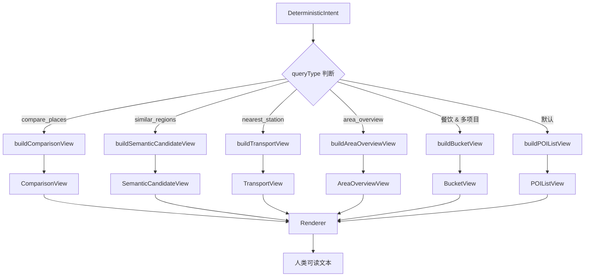
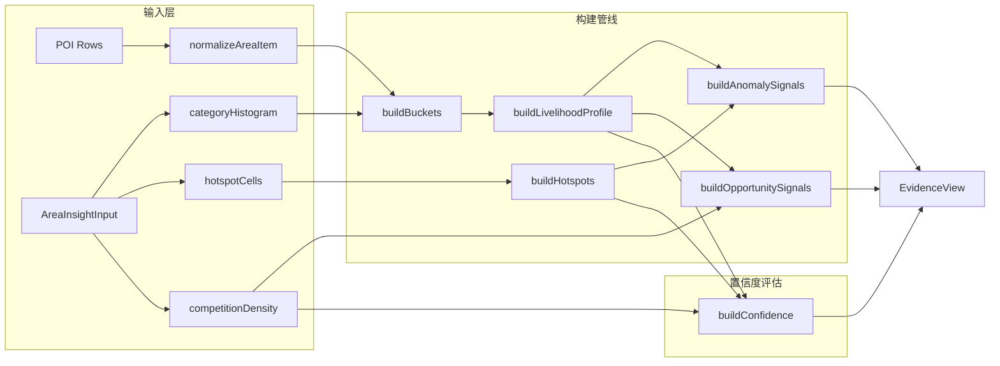
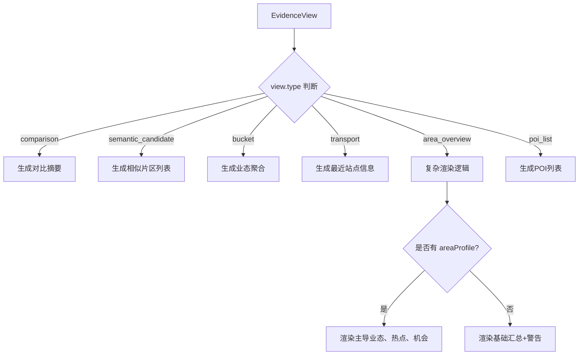
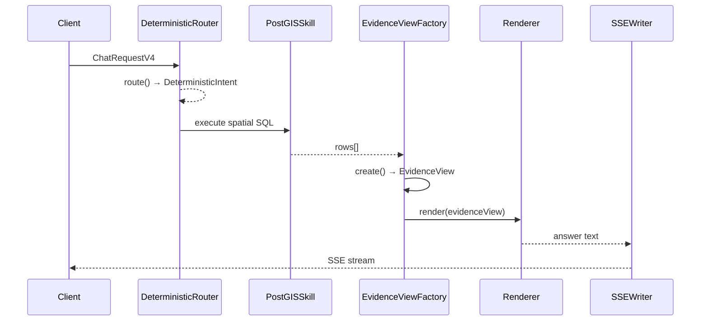

证据视图工厂（EvidenceViewFactory）是 GeoLoom 后端系统中负责将空间查询结果转化为结构化证据视图的核心组件。它采用工厂模式，根据查询意图类型动态选择最优的视图构建策略，实现从原始 POI 数据到可消费证据视图的标准化转换。

Sources: [EvidenceViewFactory.ts](backend/src/evidence/EvidenceViewFactory.ts#L1-L68)

## 工厂模式架构

证据视图工厂的核心职责是根据 `DeterministicIntent.queryType` 选择对应的视图构建函数。这种设计将视图类型的选择逻辑与具体构建逻辑分离，符合开闭原则，便于扩展新的视图类型而无需修改工厂类本身。



Sources: [EvidenceViewFactory.ts](backend/src/evidence/EvidenceViewFactory.ts#L19-L64)

## 视图类型体系

系统定义了六种证据视图类型，每种类型对应特定的空间查询语义和数据结构。

| 视图类型 | queryType | 核心数据结构 | 典型应用场景 |
|---------|-----------|-------------|-------------|
| `poi_list` | 默认 | items[] | 周边 POI 列表查询 |
| `transport` | nearest_station | items[] | 最近交通站点 |
| `area_overview` | area_overview | buckets, areaProfile, hotspots | 片区综合分析 |
| `bucket` | 餐饮 + 多项目 | buckets[] | 业态聚合展示 |
| `comparison` | compare_places | pairs[] | 多地点对比 |
| `semantic_candidate` | similar_regions | regions[] | 相似片区推荐 |

Sources: [types.ts](backend/src/chat/types.ts#L152-L167)

## AreaOverviewView 深度分析

`area_overview` 是最复杂的视图类型，集成了生活圈画像（Livelihood Profile）和机会信号分析能力。



Sources: [AreaOverviewView.ts](backend/src/evidence/views/AreaOverviewView.ts#L100-L158)

### 生活圈画像构建

生活圈画像（Livelihood Profile）将 POI 数据归类到八种生活维度：学习、医疗、食、住、购、行、闲、生活。这种语义归类超越了原始 POI 分类，提供更直观的片区特征描述。

```typescript
const LIVELIHOOD_PRIMARY_RULES: Array<{ label: string, keywords: string[] }> = [
  { label: '学习', keywords: ['教育', '学校', '大学', '学院', '培训', '图书馆', '科研', '校园', '科教文化'] },
  { label: '医疗', keywords: ['医疗', '医院', '诊所', '药店', '卫生', '门诊', '体检', '急救'] },
  { label: '食', keywords: ['餐饮', '美食', '小吃', '咖啡', '茶饮', '饮品', '餐厅', '甜品', '面包'] },
  // ... 其他维度
]
```

Sources: [livelihoodProfile.ts](backend/src/evidence/areaInsight/livelihoodProfile.ts#L25-L32)

### 机会信号生成

机会信号系统基于片区画像和竞争密度数据，生成可执行的机会洞察。系统识别四种类型的机会信号：

| 信号类型 | 触发条件 | 业务含义 |
|---------|---------|---------|
| `scarcity_opportunity` | 某类别在头部结构中缺失且竞争密度低 | 稀缺型机会 |
| `complementary_service_gap` | 互补类别尚未跟上主导业态 | 补位型机会 |
| `over_competition_warning` | 某类别竞争密度过高（≥8个或平均间距≤180m） | 过度竞争警告 |
| `mono_structure_risk` | 头部业态占比≥48%或单核化趋势明显 | 单一结构风险 |

Sources: [opportunitySignals.ts](backend/src/evidence/areaInsight/opportunitySignals.ts#L80-L130)

## 渲染器机制

Renderer 负责将 EvidenceView 对象转换为人类可读的文本叙述。它针对每种视图类型实现了专门的格式化策略：



Sources: [Renderer.ts](backend/src/evidence/Renderer.ts#L91-L115)

## 交通去重规范化

TransportView 包含专门的交通数据规范化逻辑，处理地铁站和出口的复杂命名模式：

```typescript
export function dedupeTransportItems(items: EvidenceItem[] = []) {
  // 按站点名分组
  // 保留最近出口
  // 按距离排序
}
```

Sources: [transportNormalization.ts](backend/src/evidence/transportNormalization.ts#L28-L52)

## 端到端集成

在确定性对话管道中，证据视图工厂与路由解析器、技能执行器紧密协作：



Sources: [DeterministicGeoChat.ts](backend/src/chat/DeterministicGeoChat.ts#L200-L220)

## 前端证据消费

前端通过 `SpatialEvidenceCard` 组件消费证据数据，结合意图模板选择器实现智能展示：

```typescript
const templateContext = computed(() =>
  deriveTemplateContext({
    clusters: props.clusters,
    vernacularRegions: props.vernacularRegions,
    fuzzyRegions: props.fuzzyRegions,
    analysisStats: props.analysisStats,
    intentMeta: props.intentMeta,
    intentMode: props.intentMode,
    queryType: props.queryType
  })
)
```

Sources: [SpatialEvidenceCard.vue](src/components/SpatialEvidenceCard.vue#L77-L89)

## 类型契约

EvidenceView 的完整类型定义如下：

```typescript
export interface EvidenceView {
  type: EvidenceViewType
  anchor: EvidenceAnchor
  items: EvidenceItem[]
  meta: Record<string, unknown>
  secondaryAnchor?: EvidenceAnchor
  pairs?: ComparisonPair[]
  buckets?: Array<{ label: string, value: number }>
  regions?: Array<{ name: string, score: number, summary?: string }>
  areaProfile?: AreaProfile
  hotspots?: AreaHotspot[]
  anomalySignals?: AreaInsightSignal[]
  opportunitySignals?: AreaInsightSignal[]
  confidence?: AreaInsightConfidence
}
```

Sources: [types.ts](backend/src/chat/types.ts#L168-L186)

## 扩展指南

添加新的视图类型需要三个步骤：

1. 在 `types.ts` 中定义新的 `EvidenceViewType` 枚举值
2. 创建对应的视图构建函数（参考 `views/` 目录）
3. 在 `EvidenceViewFactory.create()` 中添加类型判断分支