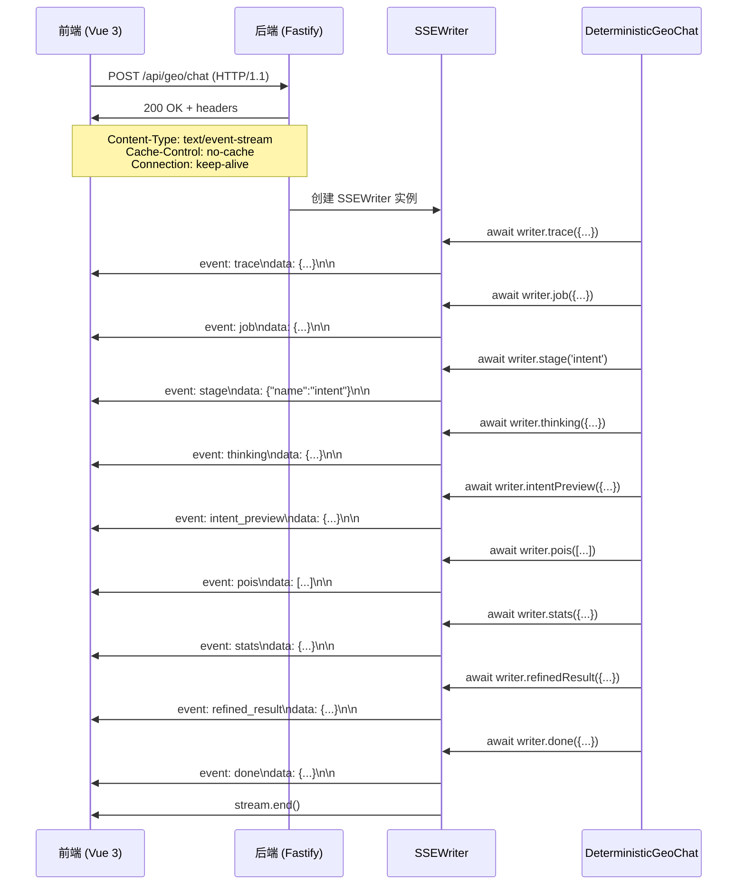
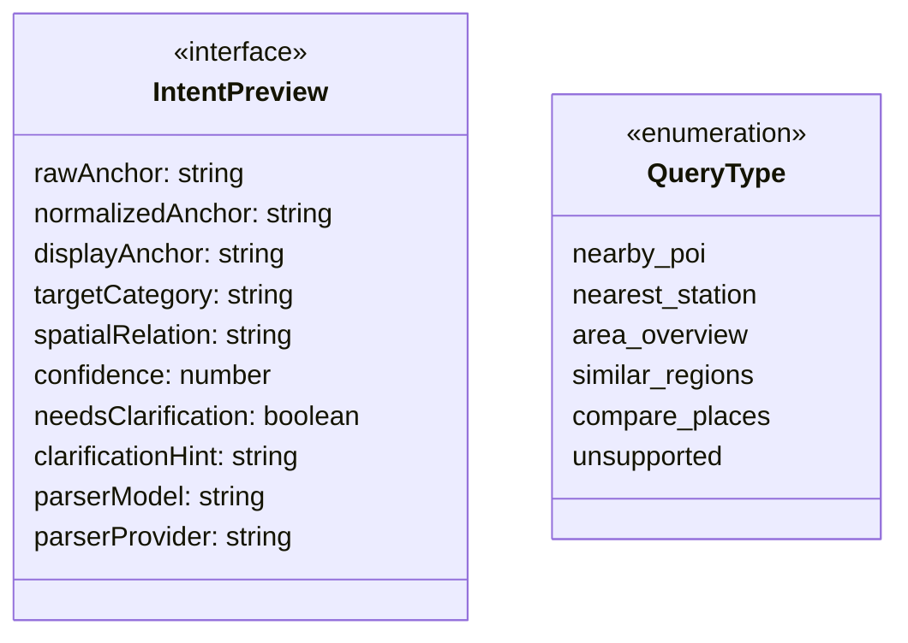
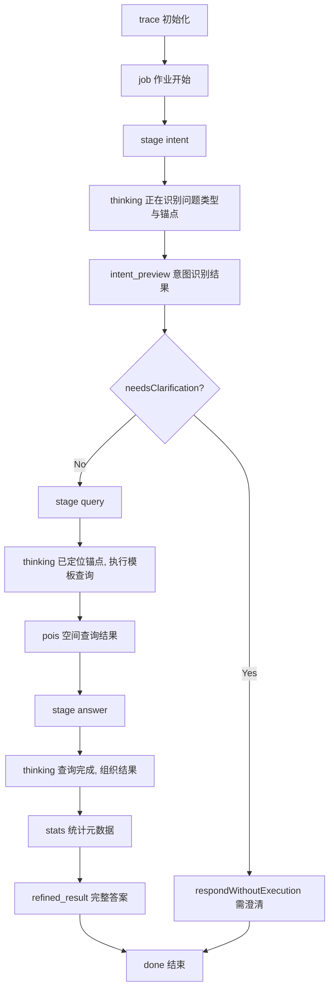

GeoLoom Agent 采用 **Server-Sent Events (SSE)** 协议实现后端到前端的实时流式通信。该协议允许服务端在单个 HTTP 连接上持续推送事件，使前端能够逐步渲染 AI 处理状态、意图识别结果、空间查询证据和最终答案，无需等待完整响应。

Sources: [shared/sseEventSchema.ts](shared/sseEventSchema.ts#L1-L300), [backend/src/routes/chat.ts](backend/src/routes/chat.ts#L1-L92)

## 协议架构

### 技术选型理由

SSE 相比 WebSocket 更适合 GeoLoom Agent 的单向数据流场景：服务端推送意图识别进度、空间数据查询状态和最终证据，无需双向通信。SSE 基于 HTTP/1.1，使用简单、无需额外协议握手，且天然支持 HTTP/2 多路复用。

### 传输层规范



Sources: [backend/src/routes/chat.ts](backend/src/routes/chat.ts#L69-L91), [backend/src/chat/SSEWriter.ts](backend/src/chat/SSEWriter.ts#L1-L99)

## 事件类型体系

### 元数据事件

| 事件类型 | 触发时机 | 核心载荷 | 前端处理 |
|---------|---------|---------|---------|
| `trace` | 请求初始化 | `trace_id`, `schema_version`, `capabilities` | 关联日志与调试标识 |
| `job` | 作业开始 | `mode`, `version` | 标识处理模式 (deterministic_single_turn / agent_full_loop) |
| `stage` | 阶段切换 | `name` (intent/query/answer) | 更新流水线进度指示器 |
| `thinking` | 思考状态 | `status` (start/end), `message` | 显示中间推理提示 |

Sources: [shared/sseEventSchema.ts](shared/sseEventSchema.ts#L54-L78), [backend/src/chat/DeterministicGeoChat.ts](backend/src/chat/DeterministicGeoChat.ts#L82-L94)

### 意图识别事件



意图预览事件携带完整的意图解析结果，包括锚点识别、目标类别、空间关系和置信度评分。前端据此决定是否需要向用户请求澄清。

Sources: [shared/sseEventSchema.ts](shared/sseEventSchema.ts#L87-L103), [backend/src/chat/DeterministicGeoChat.ts](backend/src/chat/DeterministicGeoChat.ts#L96-L107)

### 证据与结果事件

| 事件类型 | 数据结构 | 用途 |
|---------|---------|-----|
| `pois` | `EvidenceItem[]` | 原始 POI 列表，含坐标、距离、分类 |
| `boundary` | GeoJSON / null | 分析区域空间边界 |
| `spatial_clusters` | `{ hotspots: Cluster[] }` | 热点聚类结果 |
| `vernacular_regions` | `Region[]` | 俗名区域（如"光谷"） |
| `fuzzy_regions` | `Region[]` | 模糊区域（如"武汉三环内"） |
| `stats` | 统计元数据 | 查询类型、锚点坐标、结果数量、延迟等 |
| `refined_result` | 复合结构 | 完整答案 + evidence_view + intent |

Sources: [shared/sseEventSchema.ts](shared/sseEventSchema.ts#L119-L153), [backend/src/chat/DeterministicGeoChat.ts](backend/src/chat/DeterministicGeoChat.ts#L219-L235)

### 终止事件

```typescript
// error: 错误终止
{ message: string }

// done: 正常完成
{ duration_ms: number }

// schema_error: 验证失败 (非致命)
{ event: string, errors: string[] }
```

Sources: [shared/sseEventSchema.ts](shared/sseEventSchema.ts#L154-L180)

## 事件格式规范

### SSE 编码规则

每个事件块由 `event:` 行和 `data:` 行组成，以双换行符 `\n\n` 结束：

```
event: <event_type>\n
data: <JSON_payload>\n\n
```

后端 SSEWriter 自动为每个事件注入元数据字段：

```typescript
private withMeta(payload: unknown) {
  return {
    ...payload,
    trace_id: this.traceId,        // 请求追踪标识
    schema_version: this.schemaVersion  // 协议版本 (v4.det.v1)
  }
}

private write(event: string, payload: unknown) {
  const block = `event: ${event}\ndata: ${JSON.stringify(this.withMeta(payload))}\n\n`
  this.options.stream.write(block)
}
```

Sources: [backend/src/chat/SSEWriter.ts](backend/src/chat/SSEWriter.ts#L82-L97)

### 事件元数据结构

除 `pois`、`boundary`、`vernacular_regions`、`fuzzy_regions` 外的所有事件都自动携带元数据：

```json
{
  "trace_id": "chat_1699999999999_abc123",
  "schema_version": "v4.det.v1",
  ...event_specific_fields
}
```

## 事件流水线

### 标准流程 (Deterministic 模式)



Sources: [backend/src/chat/DeterministicGeoChat.ts](backend/src/chat/DeterministicGeoChat.ts#L70-L236)

## 前端消费层

### 事件分发机制

前端通过 `useAiStreamDispatcher` composable 消费 SSE 事件：

```typescript
// src/composables/ai/useAiStreamDispatcher.ts
function dispatchMetaEvent({ type, data, aiMessageIndex, fallbackIntentMode }) {
  switch (type) {
    case 'trace':
      // 记录追踪 ID
      currentMsg.traceId = String(data.trace_id)
      break
    case 'thinking':
      // 更新思考状态
      currentMsg.isThinking = data.status === 'start'
      currentMsg.thinkingMessage = String(data.message)
      break
    case 'intent_preview':
      // 存储意图预览
      currentMsg.intentPreview = extractIntentPreview(data)
      break
    case 'stage':
      // 更新流水线阶段
      updateMessagePipelineHighWater(currentMsg, normalizeStageName(data.name))
      break
    case 'refined_result':
      // 触发地图渲染、边界绘制、证据展示
      emit('ai-boundary', normalized.boundary)
      emit('ai-spatial-clusters', normalized.spatialClusters)
      emit('ai-analysis-stats', normalized.stats)
      break
  }
}
```

Sources: [src/composables/ai/useAiStreamDispatcher.ts](src/composables/ai/useAiStreamDispatcher.ts#L215-L389)

### 流式文本渲染

文本块通过 `partial` 事件渐进式传输，前端使用字符级节流渲染：

```typescript
// src/components/AiChat.vue
function enqueueStreamChunk(chunk, messageIndex) {
  activeMessageIndex.value = messageIndex
  streamQueue.value += chunk
  if (!streamTimer.value) {
    streamTimer.value = window.setInterval(() => {
      const { char: delta, rest } = takeNextStreamCharacter(streamQueue.value)
      streamQueue.value = rest
      currentMessage.content += delta
      // 每 3 个字符滚动一次
      if (streamScrollTick.value % 3 === 0) scrollToBottom()
    }, 16) // ~60fps
  }
}
```

Sources: [src/components/AiChat.vue](src/components/AiChat.vue#L904-L969)

## 事件验证机制

### Schema 验证

共享的 `sseEventSchema.ts` 定义了所有事件的结构化验证规则：

```typescript
export const SSE_EVENT_SCHEMAS = Object.freeze({
  intent_preview: withEventMeta({
    type: 'object',
    properties: {
      rawAnchor: { type: ['string', 'null'] },
      normalizedAnchor: { type: ['string', 'null'] },
      confidence: { type: 'number' },
      needsClarification: { type: 'boolean' }
    },
    additionalProperties: true
  }),
  stats: withEventMeta({
    type: 'object',
    additionalProperties: true
  }),
  // ... 其他事件定义
})

export function validateSSEEventPayload(eventName, payload): SSEValidationResult {
  const schema = SSE_EVENT_SCHEMAS[eventName]
  if (!schema) return { ok: true, skipped: true }
  
  const errors = []
  validateSchema(payload, schema, '$', errors)
  return { ok: errors.length === 0, event: eventName, errors }
}
```

Sources: [shared/sseEventSchema.ts](shared/sseEventSchema.ts#L54-L299)

### 验证工具函数

```typescript
// JSON Schema 子集验证
function validateSchema(value, schema, path, errors) {
  // 类型检查
  if (schema.type) {
    const matched = expectedTypes.some(t => matchesType(value, t))
    if (!matched) errors.push(`${path}: expected type ${expectedTypes.join('|')}`)
  }
  
  // 必需字段
  required.forEach(key => {
    if (!(key in objectValue)) errors.push(`${path}.${key}: required`)
  })
  
  // 嵌套验证
  Object.keys(properties).forEach(key => {
    if (key in objectValue) {
      validateSchema(objectValue[key], properties[key], `${path}.${key}`, errors)
    }
  })
}
```

Sources: [shared/sseEventSchema.ts](shared/sseEventSchema.ts#L206-L273)

## 测试策略

### 单元测试: SSEWriter

```typescript
// backend/tests/unit/chat/SSEWriter.spec.ts
it('writes ordered events with required meta fields', async () => {
  const stream = new PassThrough()
  const writer = new SSEWriter({
    stream,
    traceId: 'trace_v4_001',
    schemaVersion: 'v4.det.v1',
  })
  
  await writer.trace({ request_id: 'req_v4_001' })
  await writer.job({ mode: 'deterministic_single_turn' })
  await writer.stage('intent')
  await writer.done({ duration_ms: 88 })
  writer.close()
  
  const events = parseSSE(await captured)
  expect(events.map(e => e.event)).toEqual(['trace', 'job', 'stage', 'done'])
  for (const item of events) {
    expect(item.data.trace_id).toBe('trace_v4_001')
    expect(item.data.schema_version).toBe('v4.det.v1')
  }
})
```

Sources: [backend/tests/unit/chat/SSEWriter.spec.ts](backend/tests/unit/chat/SSEWriter.spec.ts#L1-L79)

### 集成测试: Smoke Tests

```typescript
// backend/tests/smoke/minimaxPhase8_3.smoke.spec.ts
it('parses SSE stream correctly', async () => {
  const response = await app.inject({
    method: 'POST',
    url: '/api/geo/chat',
    payload: { messages: [{ role: 'user', content: '武汉大学附近咖啡店' }] }
  })
  
  const events = parseSSE(response.body)
  const refined = events.find(e => e.event === 'refined_result')?.data
  const doneEvent = events.at(-1)
  
  expect(refined.results.stats.query_type).toBe('nearby_poi')
  expect(refined.results.evidence_view.type).toBe('poi_list')
  expect(doneEvent.event).toBe('done')
})
```

Sources: [backend/tests/smoke/minimaxPhase8_3.smoke.spec.ts](backend/tests/smoke/minimaxPhase8_3.smoke.spec.ts#L53-L84)

## 性能考量

### 流式渲染策略

| 策略 | 实现 | 效果 |
|-----|-----|-----|
| 字符级节流 | 每 16ms 渲染 1 个字符 | 60fps 流畅感 |
| 批量滚动 | 每 3 字符触发滚动 | 减少 reflow |
| 超时刷新 | 12s 后强制flush | 防止卡死 |

Sources: [src/components/AiChat.vue](src/components/AiChat.vue#L653-L669)

### 连接管理

```typescript
// 后端: 使用 PassThrough 流 + keep-alive
reply.raw.setHeader('Content-Type', 'text/event-stream; charset=utf-8')
reply.raw.setHeader('Cache-Control', 'no-cache, no-transform')
reply.raw.setHeader('Connection', 'keep-alive')
reply.raw.setHeader('X-Trace-Id', traceId)
reply.send(stream)
```

Sources: [backend/src/routes/chat.ts](backend/src/routes/chat.ts#L75-L79)

## 进阶阅读

- [确定性路由解析器](13-que-ding-xing-lu-you-jie-xi-qi) — 了解 `intent_preview` 事件的生成逻辑
- [证据视图工厂](14-zheng-ju-shi-tu-gong-han) — `refined_result` 中 evidence_view 的结构设计
- [前端组件集成](17-ai-liao-tian-jie-mian-zu-jian) — `AiChat.vue` 的完整交互实现