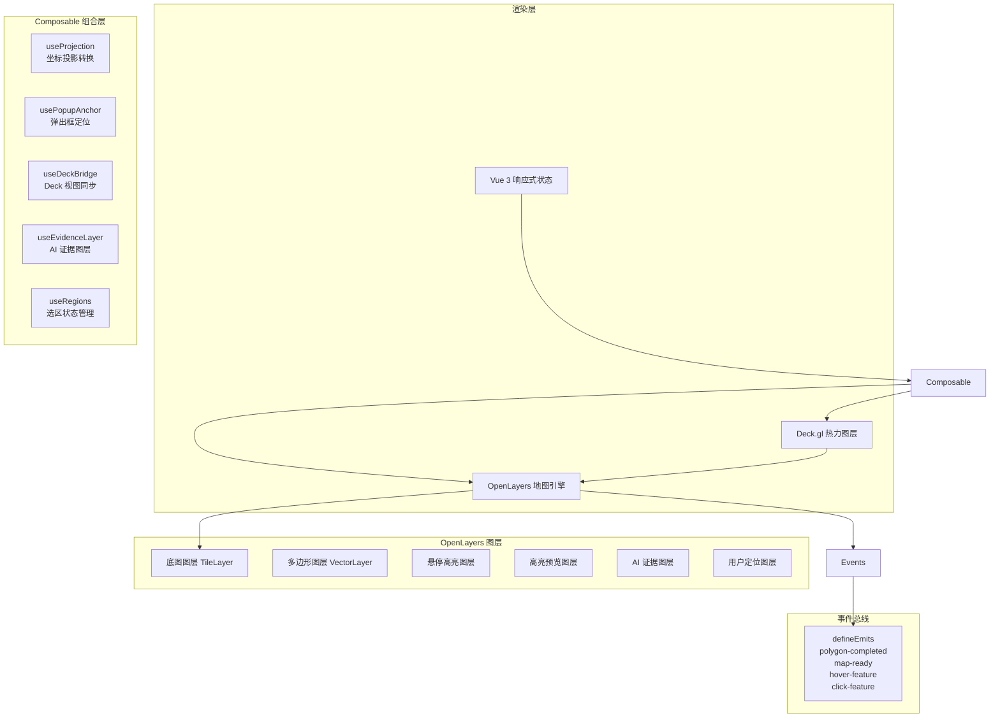

MapContainer.vue 是 GeoLoom Agent 前端应用的核心可视化组件，负责地图渲染、POI（兴趣点）交互、选区绘制、AI 空间证据展示以及热力图叠加等多维空间数据可视化功能。该组件采用组合式架构，通过多个Composable函数实现职责分离，形成了以 OpenLayers 为基础地图引擎、Deck.gl 为高级可视化层、Vue 3 Composition API 为状态管理框架的技术架构。

## 组件架构概览

MapContainer 组件的架构设计遵循分层职责原则，核心由三层可视化引擎协同工作。以下架构图展示了各组件之间的关系：



## 核心图层体系

MapContainer 初始化时创建了完整的 OpenLayers 图层堆叠，按 zIndex 从低到高依次为：底图图层、多边形图层、中心标记图层、悬停高亮图层、高亮预览图层、AI 证据图层、用户定位精度图层、定位图层、用户位置图层。这种分层设计确保了各类型空间数据在视觉层级上的正确叠加顺序。

### 底图配置

组件在 onMounted 钩子中通过动态加载高德地图瓦片服务构建底图，支持环境变量配置 API Key，默认使用 `VITE_AMAP_KEY`。底图加载状态通过 `isBaseLayerReady` 响应式变量追踪，配合 1.8 秒超时机制防止首屏白屏现象。底图采用 Web Mercator 投影（EPSG:3857），默认中心点设置为武汉（经度 114.33，纬度 30.58），缩放级别范围为 4-18。

Sources: [MapContainer.vue](src/components/MapContainer.vue#L668-L696)

### 矢量交互图层

POI 数据通过 `rebuildPoiOlFeatures()` 方法转换为 OpenLayers Feature 对象，每个 Feature 携带 `__raw` 属性存储原始数据，并通过 `rawToOlMap` Map 结构建立双向索引。悬停高亮图层使用橙色圆点样式（半径 9px，透明度 0.8），高亮预览图层支持锚点与普通 POI 的差异化渲染，通过 `__isAnchor` 标识区分。

Sources: [MapContainer.vue](src/components/MapContainer.vue#L409-L449)

## 坐标投影系统

坐标投影系统由 `useProjection` Composable 实现，支持 WGS84（EPSG:4326）与 GCJ-02（中国国测局加密坐标）之间的双向转换。该系统采用国际通用的 WGS84 坐标系到中国本地化 GCJ-02 的转换算法，基于克拉索夫斯基椭球体参数（WGS84 长半轴 6378245.0，扁率倒数 0.00669342162296594323）进行精确计算。

```typescript
function wgs84ToGcj02(lon: number, lat: number): CoordinatePair {
  if (outOfChina(lon, lat)) return [lon, lat];  // 境外数据不做转换
  const dlat = transformLat(lon - 105.0, lat - 35.0);
  const dlon = transformLon(lon - 105.0, lat - 35.0);
  const radlat = lat / 180.0 * Math.PI;
  let magic = Math.sin(radlat);
  magic = 1 - EE * magic * magic;
  const sqrtMagic = Math.sqrt(magic);
  const dLat = (dlat * 180.0) / ((A * (1 - EE)) / (magic * sqrtMagic) * Math.PI);
  const dLon = (dlon * 180.0) / (A / sqrtMagic * Math.cos(radlat) * Math.PI);
  return [lon + dLon, lat + dLat];
}
```

组件支持多数据源坐标系统自动识别，通过 `resolveFeatureCoordSys()` 函数从 Feature 的 `coordSys`、`coord_sys`、`properties.coordSys` 等多个可能字段中提取坐标系统标识，确保异构 POI 数据的正确显示。

Sources: [useProjection.ts](src/composables/map/useProjection.ts#L1-L56)

## POI 弹出框系统

弹出框定位由 `usePopupAnchor` Composable 管理，采用动态定位算法确保弹出框始终在可视区域内。核心定位逻辑首先将地理坐标转换为屏幕像素坐标，然后根据弹出框尺寸与地图容器边界的约束关系，智能选择顶部或底部作为弹出框的附着方向。

弹出框支持多种内容类型的展示：POI 名称气泡、边界信息气泡以及自定义文本气泡。POI 气泡自动从 Feature 的 `properties` 中提取名称、分类、地址等属性信息，格式化为最多 2 行详情文本。边界气泡则根据 `AiBoundaryMeta` 元数据结构显示锚点名称、生态位类型、边界可信度等 AI 分析结果。

Sources: [usePopupAnchor.ts](src/composables/map/usePopupAnchor.ts#L1-L214)

## 选区绘制与区域管理

选区系统由 `useRegions` Composable 提供状态管理，支持多边形（Polygon）和圆形（Circle）两种几何类型的选区绘制。每个选区携带唯一标识符（1-6）、名称、几何数据、WKT 格式边界、关联 POI 列表以及统计信息。系统预定义了 6 种颜色方案，用于在地图上可视化区分不同选区。

选区绘制的核心流程包括：用户激活绘制工具后，通过 OpenLayers 的 Draw 交互捕获几何要素；绘制完成时触发 `drawend` 事件，调用 `onPolygonCompleteMulti()` 或 `onCircleCompleteMulti()` 方法；方法内部执行 POI 空间包含测试，计算选区质心，并生成 WKT 边界格式用于后续空间查询。

Sources: [MapContainer.vue](src/components/MapContainer.vue#L1037-L1279)
Sources: [useRegions.ts](src/composables/useRegions.ts#L1-L242)

## AI 空间证据图层

AI 证据图层由 `useEvidenceLayer` Composable 实现，专门用于可视化 GeoLoom-RAG 智能体生成的区域边界分析结果。该图层支持多种边界类型的差异化渲染：

| 边界类型 | 颜色方案 | 填充透明度 | 描边宽度 | 语义说明 |
|---------|---------|-----------|---------|---------|
| fuzzyCore | 翡翠绿 RGB(16,185,129) | 0.15 | 2.4px | 模糊核心区（高确定性区域） |
| fuzzyTransition | 紫色 RGB(168,85,247) | 0.10 | 2.0px | 模糊过渡区（中等确定性区域） |
| fuzzyOuter | 天蓝色 RGB(56,189,248) | 0.08 | 1.6px | 模糊外围区（低确定性区域） |
| hotspot | 橙色 RGB(249,115,22) | 0.12 | 2.0px | 高活力热点区 |
| vernacular | 粉色 RGB(244,114,182) | 0.10 | 2.0px | 通俗认知区域 |
| queryBoundary | 蓝色 RGB(59,130,246) | 0.08 | 3.0px | 用户查询边界 |

边界可信度直接影响视觉样式参数：低可信度边界（< 40%）使用虚线样式，中可信度边界（40%-69%）使用点划线，高可信度边界（≥ 70%）使用实线。系统还支持根据地图缩放级别动态调整边界的几何简化程度，确保大数据量边界在低缩放级别下的渲染性能。

Sources: [useEvidenceLayer.ts](src/composables/map/useEvidenceLayer.ts#L76-L101)

### 证据载荷归一化

AI 证据数据通过 `normalizeAiEvidencePayload()` 函数进行标准化处理，统一兼容 camelCase 与 snake_case 两种属性命名风格。归一化后的数据结构包含：主边界（boundary）、统计信息（stats）、热点簇（clusters.hotspots）、通俗区域（vernacularRegions）以及模糊区域（fuzzyRegions）五个核心字段。

Sources: [aiEvidencePayload.ts](src/utils/aiEvidencePayload.ts#L1-L160)

## Deck.gl 热力图集成

热力图功能由 `useDeckBridge` Composable 实现，在 OpenLayers 地图之上叠加 Deck.gl 的 HeatmapLayer。该集成采用视图状态同步机制，确保 Deck.gl 渲染的热点与 OpenLayers 底图保持严格的坐标对齐。

热力图半径根据当前缩放级别动态计算：缩放级别 10 时半径为 90px，缩放级别 16 时半径缩减至 40px，中间级别按线性插值计算。颜色渐变采用 6 阶色带，从浅黄色（RGB 255,255,178）过渡到深红色（RGB 189,0,38），直观反映 POI 密度分布。

Sources: [useDeckBridge.ts](src/composables/map/useDeckBridge.ts#L94-L101)

## 组件事件接口

MapContainer 通过 `defineEmits` 向父组件暴露以下事件流：

```typescript
const emit = defineEmits([
  'polygon-completed',   // 选区绘制完成
  'map-ready',           // 地图初始化完成
  'hover-feature',       // 鼠标悬停 POI
  'click-feature',       // 鼠标点击 POI
  'map-move-end',        // 地图移动结束
  'toggle-filter',      // 实时过滤切换
  'toggle-overlay',     // 叠加模式切换
  'weight-change',      // 权重配置变化
  'global-analysis-change', // 全域感知开关
  'region-added',       // 新增选区
  'region-removed',     // 删除选区
  'regions-cleared'     // 清空所有选区
]);
```

## 组件 Props 与方法暴露

组件通过 `defineExpose` 向父组件暴露以下属性和方法供外部调用：

| 暴露项 | 类型 | 功能说明 |
|-------|------|---------|
| map | Ref\<OlMap\> | OpenLayers 地图实例引用 |
| openPolygonDraw() | Function | 激活多边形绘制工具 |
| closePolygonDraw() | Function | 关闭绘制工具 |
| showHighlights() | Function | 高亮指定 POI 集合 |
| showAnalysisBoundary() | Function | 显示分析边界 |
| showAiSpatialEvidence() | Function | 显示 AI 空间证据 |
| flyTo() | Function | 飞行定位到目标坐标 |
| addUploadedPolygon() | Function | 导入外部 GeoJSON 多边形 |
| captureMapScreenshot() | Function | 捕获地图截图 |

Sources: [MapContainer.vue](src/components/MapContainer.vue#L1755-L1783)

## 组件生命周期管理

组件在 onBeforeUnmount 阶段执行完整的资源清理：调用 `cleanupPopupAnchor()` 清除弹出框动画定时器、取消视图监听；调用 `setBoundaryInteractionMode(false)` 退出边界交互模式；调用 `destroyDeckBridge()` 销毁 Deck.gl 实例并移除 DOM 容器；调用 `clearBaseLayerStatusWatchers()` 清除底图加载监听；最后调用 `map.setTarget(null)` 解绑 OpenLayers 地图实例。

Sources: [MapContainer.vue](src/components/MapContainer.vue#L900-L908)

## 后续学习路径

建议开发者按以下顺序深入前端模块：

- 深入理解 [AI 聊天界面组件](17-ai-liao-tian-jie-mian-zu-jian) 了解对话流与地图的联动机制
- 学习 [空间请求构建器](18-kong-jian-qing-qiu-gou-jian-qi) 掌握 POI 数据查询的封装方式
- 研究 [空间证据卡片渲染](19-kong-jian-zheng-ju-qia-pian-xuan-ran) 了解证据数据的可视化展示
- 探索 [地理数据处理工作线程](20-di-li-shu-ju-chu-li-gong-zuo-xian-cheng) 掌握 Web Worker 在空间计算中的应用