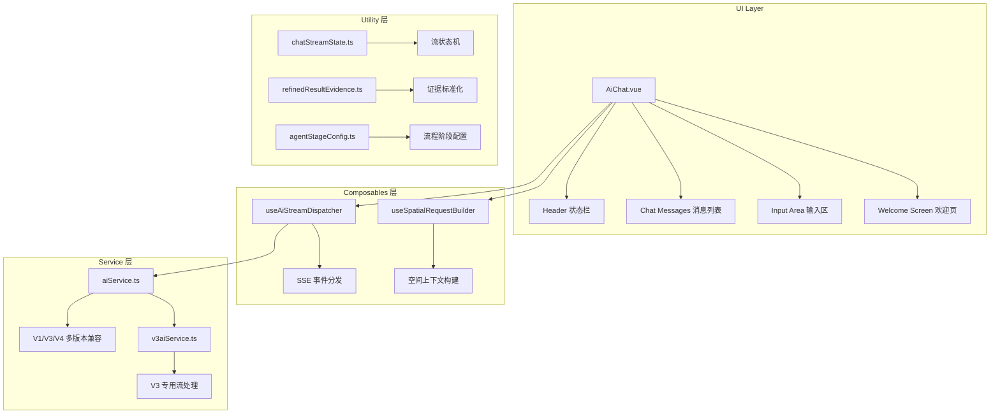
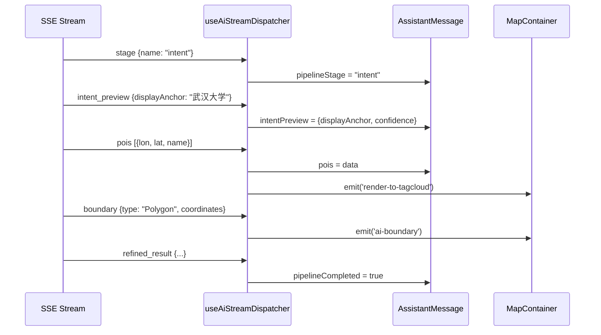

AI 聊天界面组件（`AiChat.vue`）是 GeoLoom 前端的核心交互模块，负责用户与 GeoAI 智能体之间的自然语言对话、空间查询上下文传递、流式响应渲染以及多模态证据展示。该组件采用 Vue 3 Composition API 构建，与后端 Agent 通过 SSE（Server-Sent Events）协议实现实时流式通信。

## 组件架构概览

组件采用**分层模块化设计**，将职责分离为界面渲染、状态管理、SSE 流处理和空间请求构建四个核心子模块。



Sources: [AiChat.vue](src/components/AiChat.vue#L1-L386), [useAiStreamDispatcher.ts](src/composables/ai/useAiStreamDispatcher.ts#L68-L74)

## 组件 Props 与事件

### 属性接口定义

组件通过 `defineProps` 接收来自父容器的上下文数据，包括地图选区、用户位置和类别筛选状态。

```typescript
const props = defineProps({
  poiFeatures: { type: Array, default: () => [] },           // POI 数据
  globalAnalysisEnabled: { type: Boolean, default: false },   // 全域感知模式
  boundaryPolygon: { type: Array, default: null },            // 空间边界几何
  drawMode: { type: String, default: '' },                    // 绘制模式
  circleCenter: { type: [Object, Array], default: null },     // 圆形选区中心
  circleRadius: { type: [Number, String], default: null },    // 圆形选区半径
  mapBounds: { type: Array, default: null },                  // 地图视野边界
  mapZoom: { type: Number, default: null },                   // 地图缩放级别
  userLocation: { type: Object, default: null },              // 用户位置
  userLocationStatus: { type: String, default: 'idle' },     // 定位状态
  selectedCategories: { type: Array, default: () => [] },      // 选中类别
  regions: { type: Array, default: () => [] }                 // 多区数据
});
```

Sources: [AiChat.vue](src/components/AiChat.vue#L423-L477)

### 事件定义

组件通过 `defineEmits` 向外触发关键业务事件，覆盖从地图渲染到数据状态同步的完整流程。

| 事件名 | 载荷类型 | 触发时机 | 用途 |
|--------|----------|----------|------|
| `close` | - | 用户点击收起按钮 | 关闭聊天面板 |
| `request-current-location` | - | 用户点击定位按钮 | 请求获取用户位置 |
| `render-to-tagcloud` | `Feature[]` | AI 返回 POI 数据 | 渲染标签云 |
| `render-pois-to-map` | `{pois, anchorFeature}` | 用户选择标签云项 | 地图聚焦 POI |
| `ai-boundary` | `Geometry` | 流式事件 `boundary` | 更新地图边界 |
| `ai-spatial-clusters` | `ClusterData` | 热点聚类完成 | 渲染空间热点 |
| `ai-vernacular-regions` | `Region[]` | 通俗区域识别 | 渲染认知片区 |
| `ai-fuzzy-regions` | `Region[]` | 模糊边界识别 | 渲染模糊区域 |
| `ai-analysis-stats` | `StatsObject` | 统计分析完成 | 更新统计面板 |
| `ai-intent-meta` | `IntentMeta` | 意图识别完成 | 更新意图状态 |
| `clear-chat-state` | - | 用户清空对话 | 重置组件状态 |

Sources: [AiChat.vue](src/components/AiChat.vue#L479-L492)

## 多后端版本路由

组件通过环境变量 `VITE_BACKEND_VERSION` 动态选择后端版本，支持 V1（模板模式）、V3（流式推理）和 V4（Agent 模式）三种后端协议。

```typescript
const isV3Mode = import.meta.env.VITE_BACKEND_VERSION === 'v3';
const isV4Mode = import.meta.env.VITE_BACKEND_VERSION === 'v4';

const API_BASE = IS_V4_MODE 
  ? `${AI_API_BASE_URL}/api/geo` 
  : `${AI_API_BASE_URL}/api/ai`;
```

Sources: [aiService.ts](src/utils/aiService.ts#L101-L104)

版本检测结果会实时反映在界面状态标签中，帮助用户理解当前使用的是哪套后端推理引擎。

```typescript
const reasoningRouteLabel = computed(() => {
  if (isV3Mode) return 'V3 流式';
  if (isV4Mode) return 'V4 Agent';
  return 'V1 模板';
});
```

Sources: [AiChat.vue](src/components/AiChat.vue#L506-L510)

## 流式消息处理机制

### 字符级流式渲染

组件采用**时间分片渲染**策略，将 SSE 流式响应以 16ms 间隔逐字符追加到消息内容中，确保 UI 线程不被阻塞。

```typescript
function enqueueStreamChunk(chunk, messageIndex) {
  activeMessageIndex.value = messageIndex;
  streamQueue.value += chunk;

  if (streamTimer.value) return;

  streamTimer.value = window.setInterval(() => {
    const { char: delta, rest } = takeNextStreamCharacter(streamQueue.value);
    if (!delta) {
      window.clearInterval(streamTimer.value);
      streamTimer.value = null;
      return;
    }

    streamQueue.value = rest;
    currentMessage.content += delta;

    // 每 3 次 tick 触发一次滚动
    streamScrollTick.value += 1;
    if (streamScrollTick.value % 3 === 0) {
      scrollToBottom(false, 'auto');
    }
  }, streamRenderIntervalMs);  // 16ms 间隔
}
```

Sources: [AiChat.vue](src/components/AiChat.vue#L922-L969)

### SSE 事件分发器

`useAiStreamDispatcher` composable 负责解析 SSE 事件类型并更新消息状态，支持 14 种元事件类型。

```typescript
const V3_META_EVENTS = new Set([
  'stage', 'thinking', 'reasoning', 'intent_preview', 'pois',
  'boundary', 'spatial_clusters', 'vernacular_regions', 
  'fuzzy_regions', 'stats', 'partial', 'progress',
  'refined_result', 'done', 'error'
] as const);
```

Sources: [v3aiService.ts](src/utils/v3aiService.ts#L5-L21)

核心事件处理流程如下：



Sources: [useAiStreamDispatcher.ts](src/composables/ai/useAiStreamDispatcher.ts#L215-L389)

## 意图识别与预览

### 意图预览状态

在流式响应的早期阶段，组件通过 `intent_preview` 事件实时展示 AI 对用户问题的结构化理解，包括地点锚点、需求类别和置信度。

```typescript
// intent_preview 事件处理
if (type === 'intent_preview' && data && typeof data === 'object') {
  const previewPayload = data as PlainObject
  if (currentMsg) {
    currentMsg.intentPreview = {
      rawAnchor: previewPayload.rawAnchor ?? null,
      normalizedAnchor: previewPayload.normalizedAnchor ?? null,
      displayAnchor: previewPayload.displayAnchor ?? previewPayload.place_name ?? null,
      targetCategory: previewPayload.targetCategory ?? previewPayload.poi_sub_type ?? null,
      spatialRelation: previewPayload.spatialRelation ?? null,
      confidence: Number.isFinite(Number(previewPayload.confidence)) 
        ? Number(previewPayload.confidence) : null,
      needsClarification: previewPayload.needsClarification === true,
      clarificationHint: String(previewPayload.clarificationHint || ''),
      isAbbreviation: previewPayload.isAbbreviation === true,
      parserModel: previewPayload.parserModel || previewPayload.parser_model || null,
      parserProvider: previewPayload.parserProvider || previewPayload.parser_provider || null
    }
  }
}
```

Sources: [useAiStreamDispatcher.ts](src/composables/ai/useAiStreamDispatcher.ts#L262-L284)

### 意图预览 UI 渲染

组件在消息气泡中以药丸标签（Pill）形式展示识别结果，用户可直观确认 AI 是否正确理解了问题意图。

```vue
<div v-if="msg.intentPreview?.needsClarification && msg.intentPreview?.clarificationHint" 
     class="pipeline-clarification-inline">
  {{ msg.intentPreview.clarificationHint }}
</div>
```

Sources: [AiChat.vue](src/components/AiChat.vue#L240-L244)

## 推理过程展示

### 思考状态指示器

V3 推理模型产生的思考过程通过可折叠面板展示，用户可查看 AI 的内部推理逻辑。

```typescript
// thinking 事件处理
if (type === 'thinking') {
  const thinkingPayload = asPlainObject(data)
  if (currentMsg) {
    if (thinkingPayload.status === 'start') {
      currentMsg.isThinking = true
      currentMsg.thinkingMessage = String(thinkingPayload.message || '正在思考...')
    } else if (thinkingPayload.status === 'end') {
      currentMsg.isThinking = currentMsg.isStreaming !== false
    }
  }
}

// reasoning 内容追加
if (type === 'reasoning') {
  const reasoningPayload = asPlainObject(data)
  if (currentMsg && reasoningPayload.content) {
    if (!currentMsg.reasoningContent) {
      currentMsg.reasoningContent = ''
    }
    currentMsg.reasoningContent += String(reasoningPayload.content)
  }
}
```

Sources: [useAiStreamDispatcher.ts](src/composables/ai/useAiStreamDispatcher.ts#L228-L260)

### 思考内容折叠面板

组件提供可交互的折叠面板，默认收起以减少视觉干扰，用户点击后展开查看完整推理过程。

```vue
<div class="run-status-header" 
     :class="{ clickable: Boolean(msg.reasoningContent) }"
     @click="msg.reasoningContent ? msg.isReasoningExpanded = !msg.isReasoningExpanded : null">
  <span class="run-status-label">{{ getRunStatusForMessage(msg, index).label }}</span>
</div>
<div class="thinking-content" :class="{ collapsed: !msg.isReasoningExpanded }">
  <div class="thinking-text">{{ msg.reasoningContent }}</div>
</div>
```

Sources: [AiChat.vue](src/components/AiChat.vue#L269-L306)

## 空间上下文构建

### useSpatialRequestBuilder

该 composable 负责将前端地图状态转换为后端可识别的空间查询参数，支持坐标系转换和边界规范化。

```typescript
export function useSpatialRequestBuilder({
  poiCoordSys = 'gcj02',
  contextBindingSeed = ''
}) {
  const shouldProjectToBackend = poiCoordSys === 'wgs84';
  
  function buildSpatialContext({
    boundaryPolygon,
    drawMode,
    circleCenter,
    circleRadius,
    mapBounds,
    mapZoom,
    regions = [],
    poiFeatures = [],
    userLocation = null
  }) {
    return {
      boundary: normalizeBoundaryForBackend(boundaryPolygon),
      mode: drawMode,
      center: normalizeCenterForBackend(circleCenter),
      radius: circleRadius,
      viewport: normalizeViewportForBackend(mapBounds),
      mapZoom,
      userLocation: normalizeUserLocationForBackend(userLocation),
      analysisScale: inferAnalysisScale(mapZoom),
      interactionHints: {
        hasDrawnRegion: regions.length > 0,
        regionCount: regions.length || 0,
        isComparing: (regions.length || 0) >= 2,
        poiCount: poiFeatures.length || 0
      }
    }
  }
}
```

Sources: [useSpatialRequestBuilder.ts](src/composables/ai/useSpatialRequestBuilder.ts#L360-L399)

### 深度空间模式判断

组件根据用户查询关键词和选区状态自动判断是否启用深度空间分析模式，该模式会启用视觉快照和多模型协同推理。

```typescript
function shouldRunDeepSpatialMode(
  queryText: unknown, 
  spatialContext: PlainObject | null | undefined, 
  regions: unknown[] | null | undefined, 
  poiCount: unknown
): boolean {
  const normalized = String(queryText || '').toLowerCase()
  if (!normalized) return false
  if ((regions?.length || 0) >= 2) return true
  if (DEEP_SPATIAL_KEYWORDS.some((kw) => normalized.includes(kw))) return true
  if (String(spatialContext?.mode || '').toLowerCase() === 'polygon' 
      && Number(poiCount) >= 180) return true
  return false
}
```

Sources: [useSpatialRequestBuilder.ts](src/composables/ai/useSpatialRequestBuilder.ts#L302-L309)

## 欢迎界面与快速入口

### 一键起手场景卡

组件在消息为空时展示欢迎界面，提供预置的空间查询场景卡片，用户点击后自动填充并发送。

```typescript
const welcomePrimaryScenarios = [
  {
    badge: '周边检索',
    title: '附近有什么设施？',
    prompt: '武汉大学附近有哪些便利店？请标注距离和位置。',
    accent: 'cyan'
  },
  {
    badge: '选址分析',
    title: '这片区适合开什么店？',
    prompt: '光谷广场周边适合开什么类型的餐饮店？请从人流、竞品和消费能力角度分析。',
    accent: 'amber'
  },
  {
    badge: '对比分析',
    title: '两个地点哪个更好？',
    prompt: '武汉二中和武汉一中周边，哪个更适合开文具店？请从竞争、需求和覆盖人群角度对比。',
    accent: 'emerald'
  }
];
```

Sources: [AiChat.vue](src/components/AiChat.vue#L775-L806)

### 示例问法芯片

欢迎界面还提供可编辑的示例问法，用户可基于示例修改后发送，降低输入门槛。

```typescript
const welcomeExamples = [
  { label: '珞珈山附近餐饮', prompt: '珞珈山附近有哪些餐饮选择？' },
  { label: '街道口地铁站', prompt: '街道口地铁站附近有哪些写字楼？' },
  { label: '徐东商圈分析', prompt: '徐东商圈的业态分布如何？' }
];
```

Sources: [AiChat.vue](src/components/AiChat.vue#L799-L807)

## 地图快照截取

### 视觉分析快照

当检测到深度空间分析模式时，组件在请求前自动截取地图快照并编码为 Base64，传递给后端进行视觉理解分析。

```typescript
async function captureMapSnapshot(snapshotKey) {
  const now = Date.now();
  if (
    snapshotCache.dataUrl &&
    snapshotCache.key === snapshotKey &&
    now - snapshotCache.capturedAt < SNAPSHOT_CACHE_TTL_MS
  ) {
    return snapshotCache.dataUrl;  // 缓存命中
  }

  const mapElement = document.querySelector('.map-container');
  if (!mapElement) return null;

  try {
    const html2canvas = await loadHtml2Canvas();
    const canvas = await html2canvas(mapElement, {
      useCORS: true,
      allowTaint: true,
      backgroundColor: '#000000',
      scale: 0.65
    });
    const dataUrl = canvas.toDataURL('image/jpeg', 0.68);
    return dataUrl;
  } catch (error) {
    console.warn('[AiChat] map snapshot capture failed:', error);
    return null;
  }
}
```

Sources: [AiChat.vue](src/components/AiChat.vue#L866-L896)

## Markdown 渲染管道

### 自定义表格解析

组件内置 Markdown 表格解析器，将 AI 返回的结构化数据转换为可阅读的 HTML 表格，同时支持从表格中提取 POI 信息。

```typescript
function extractPOIsFromResponse(content) {
  const pois = [];
  let inTable = false;
  let nameColIndex = -1;
  let distanceColIndex = -1;
  
  for (const line of lines) {
    const trimmed = line.trim();
    if (trimmed.startsWith('|') && trimmed.endsWith('|')) {
      const cells = parseCells(trimmed);
      
      if (!inTable) {
        nameColIndex = cells.findIndex(c => 
          c.includes('名称') || c.includes('店名') || c.includes('POI')
        );
        if (nameColIndex >= 0) inTable = true;
        continue;
      }
      
      if (inTable && cells[nameColIndex]) {
        pois.push({
          name: cells[nameColIndex].replace(/\*\*/g, '').trim(),
          distance: distanceColIndex >= 0 ? cells[distanceColIndex]?.trim() : null
        });
      }
    }
  }
  return pois;
}
```

Sources: [AiChat.vue](src/components/AiChat.vue#L1693-L1741)

### 渲染缓存机制

为优化性能，组件对 Markdown 渲染结果进行缓存，避免重复解析相同的消息内容。

```typescript
const markdownRenderCache = new WeakMap();

function getCachedRender(message, options) {
  const cached = markdownRenderCache.get(message);
  const cacheKey = options.streaming 
    ? `${content}::streaming` 
    : content;
  
  if (cached && cached.content === cacheKey) {
    return cached.html;
  }
  
  const html = renderMarkdown(content, options);
  markdownRenderCache.set(message, { content: cacheKey, html });
  return html;
}
```

Sources: [AiChat.vue](src/components/AiChat.vue#L1597-L1609)

## 聊天历史管理

### 导出对话记录

组件支持将对话历史导出为文本文件，便于用户保存分析结果。

```typescript
async function saveChatHistory() {
  const content = buildChatHistoryExportContent(messages.value);
  const blob = new Blob([content], { type: 'text/plain;charset=utf-8' });
  const url = URL.createObjectURL(blob);
  const link = document.createElement('a');
  link.href = url;
  link.download = `geoloom-chat-${Date.now()}.txt`;
  link.click();
  URL.revokeObjectURL(url);
}
```

Sources: [AiChat.vue](src/components/AiChat.vue#L1839-L1850)

### 清空对话状态

```typescript
function clearChat() {
  messages.value = [];
  inputText.value = '';
  streamQueue.value = '';
  currentStage.value = '';
  extractedPOIs.value = [];
  emit('clear-chat-state');
}
```

Sources: [AiChat.vue](src/components/AiChat.vue#L1864-L1871)

## 服务健康状态管理

### 在线状态检测与轮询

组件启动时检测后端服务可用性，并通过定时轮询维持状态同步。

```typescript
async function checkOnlineStatus() {
  isOnline.value = await checkAIService();
  if (isOnline.value) {
    const config = getCurrentProviderInfo();
    providerName.value = config.name;
    isLocalProvider.value = config.id === 'local';
    startStatusPolling();
  }
  return isOnline.value;
}

function startStatusPolling() {
  if (statusTimer) return;
  statusTimer = setInterval(() => {
    checkOnlineStatus().catch(() => {});
  }, 30000);  // 30 秒轮询间隔
}
```

Sources: [AiChat.vue](src/components/AiChat.vue#L835-L849)

## 样式系统

### 状态驱动的视觉反馈

组件使用 CSS 变量和动态类名实现状态变化时的视觉反馈，包括思考动画、加载指示和错误提示。

```css
/* 思考状态旋转动画 */
.thinking-spinner {
  animation: spin 1s linear infinite;
  color: #8b5cf6;
}

/* 管道阶段完成态 */
.trace-step-inline.completed .step-icon-wrapper {
  border-color: rgba(52, 211, 153, 0.78);
  background: rgba(10, 77, 67, 0.46);
  color: #dcfff5;
}

/* 流式渲染过渡 */
.streaming-markdown {
  transition: opacity 120ms ease;
}
```

Sources: [AiChat.vue](src/components/AiChat.vue#L2683-L2753)

### 管道阶段可视化

组件以步骤卡片形式展示分析管道的当前阶段，每个阶段包含编号、标签和状态指示。

```css
.pipeline-trace-inline {
  display: grid;
  grid-template-columns: repeat(auto-fit, minmax(60px, 1fr));
  gap: 6px;
}

.trace-step-inline::after {
  content: '';
  position: absolute;
  top: 11px;
  left: calc(50% + 14px);
  width: calc(100% - 26px);
  height: 1px;
  background: rgba(120, 164, 205, 0.3);
}
```

Sources: [AiChat.vue](src/components/AiChat.vue#L2914-L2936)

## 相关文档

- [空间请求构建器](18-kong-jian-qing-qiu-gou-jian-qi) — 空间上下文规范与请求构建
- [空间证据卡片渲染](19-kong-jian-zheng-ju-qia-pian-xuan-ran) — 证据数据结构与展示
- [SSE 事件流协议](15-sse-shi-jian-liu-xie-yi) — 前后端通信事件定义
- [确定性路由解析器](13-que-ding-xing-lu-you-jie-xi-qi) — 意图识别与路由机制