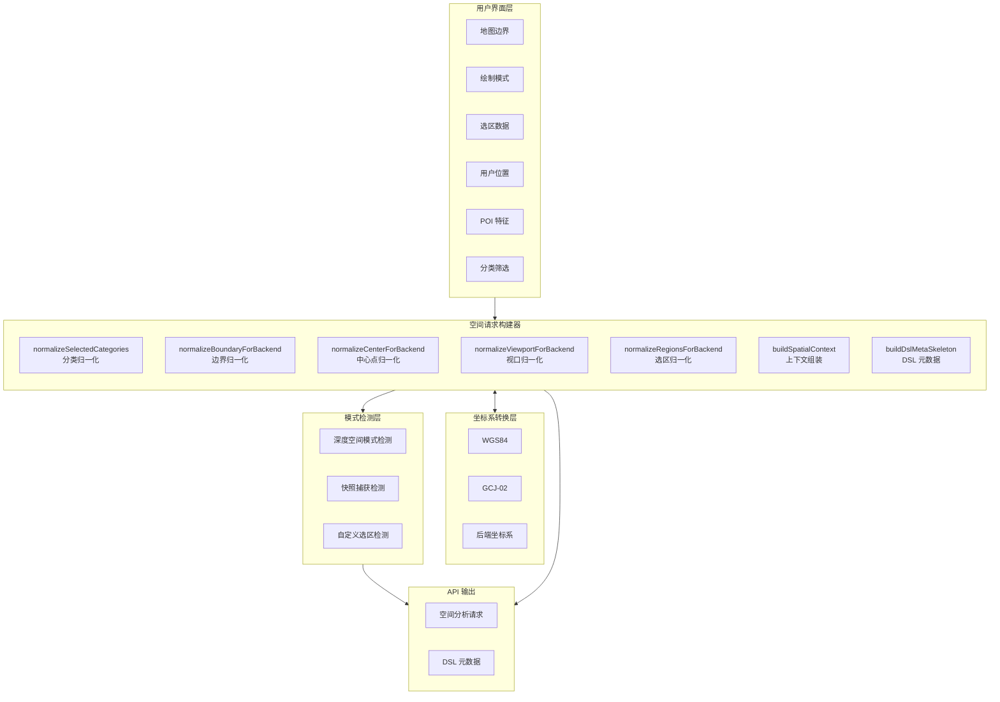

空间请求构建器（`useSpatialRequestBuilder`）是 GeoLoom 前端的核心模块，负责将用户界面状态（地图边界、绘制模式、选区、用户位置等）转换为标准化的后端 API 请求参数。该模块解决了前端坐标系转换、多源数据归一化、深度空间模式检测等关键技术问题，是连接交互层与智能分析引擎的桥梁。

## 架构概览

空间请求构建器采用**组合式函数（Composable）** 架构，基于 Vue 3 的 `useSpatialRequestBuilder` 工厂函数生成上下文绑定的请求构建能力。整个系统包含坐标系转换层、关键词检测层、上下文归一化层三个核心层次。



Sources: [useSpatialRequestBuilder.ts#L1-L416](src/composables/ai/useSpatialRequestBuilder.ts#L1-L416)

## 坐标系转换引擎

GeoLoom 系统需要处理多种坐标系场景：前端地图使用 GCJ-02 坐标系（高德、腾讯地图标准），浏览器 geolocation API 返回 WGS-84 坐标，而后端 PostGIS 数据库可能使用 WGS-84。构建器内置完整的坐标转换逻辑，确保数据在传输过程中准确无损。

### WGS84 ↔ GCJ-02 双向转换

```typescript
// WGS84 转 GCJ-02（用于前端显示）
function wgs84ToGcj02(lon: number, lat: number): LonLatTuple {
  if (outOfChina(lon, lat)) return [lon, lat]
  
  const dLat = transformLat(lon - 105.0, lat - 35.0)
  const dLon = transformLon(lon - 105.0, lat - 35.0)
  const radLat = lat / 180.0 * Math.PI
  let magic = Math.sin(radLat)
  magic = 1 - GCJ_EE * magic * magic
  const sqrtMagic = Math.sqrt(magic)
  const mgLat = lat + (dLat * 180.0) / ((GCJ_A * (1 - GCJ_EE)) / (magic * sqrtMagic) * Math.PI)
  const mgLon = lon + (dLon * 180.0) / (GCJ_A / sqrtMagic * Math.cos(radLat) * Math.PI)
  return [mgLon, mgLat]
}

// GCJ-02 转 WGS84（用于后端存储）
function gcj02ToWgs84(lon: number, lat: number): LonLatTuple {
  if (outOfChina(lon, lat)) return [lon, lat]
  const [gcjLon, gcjLat] = wgs84ToGcj02(lon, lat)
  return [lon * 2 - gcjLon, lat * 2 - gcjLat]
}
```

Sources: [useSpatialRequestBuilder.ts#L49-L134](src/composables/ai/useSpatialRequestBuilder.ts#L49-L134)

### 坐标转换的判定逻辑

```typescript
export function useSpatialRequestBuilder({
  poiCoordSys = (import.meta.env.VITE_POI_COORD_SYS || 'gcj02').toLowerCase(),
  contextBindingSeed = ''
}: {
  poiCoordSys?: string
  contextBindingSeed?: string
} = {}) {
  // 当 POI 坐标系配置为 wgs84 时，需要将前端 GCJ-02 坐标转换为 WGS-84
  const shouldProjectToBackend = poiCoordSys === 'wgs84'
  
  function toBackendLonLat(lon: CoordLike, lat: CoordLike): [number, number] | [CoordLike, CoordLike] {
    const numericLon = Number(lon)
    const numericLat = Number(lat)
    if (!Number.isFinite(numericLon) || !Number.isFinite(numericLat)) {
      return [lon, lat]  // 非数值保持原样
    }
    if (!shouldProjectToBackend) {
      return [numericLon, numericLat]  // 无需转换
    }
    return gcj02ToWgs84(numericLon, numericLat)  // 执行转换
  }
  // ...
}
```

Sources: [useSpatialRequestBuilder.ts#L118-L146](src/composables/ai/useSpatialRequestBuilder.ts#L118-L146)

该设计确保了：非中国区域的坐标保持不变、数值不合法时直接返回原值避免报错、根据环境变量自动决定是否执行转换。

## 数据归一化函数矩阵

构建器提供一组互补的归一化函数，分别处理不同数据结构的坐标转换需求。

| 函数名 | 输入类型 | 输出类型 | 典型用途 |
|--------|----------|----------|----------|
| `normalizeBoundaryForBackend` | 多边形点数组或对象数组 | 标准化点数组 | 绘制多边形的边界坐标 |
| `normalizeCenterForBackend` | `[lon, lat]` 元组或对象 | `[lon, lat]` 元组或对象 | 圆形选区中心点 |
| `normalizeViewportForBackend` | `[swLon, swLat, neLon, neLat]` | 同格式，坐标可能互换 | 地图边界框 |
| `normalizeBoundaryWKTForBackend` | WKT POLYGON 字符串 | 同格式，坐标已转换 | 区域边界几何文本 |
| `normalizeRegionGeometryForBackend` | GeoJSON geometry 对象 | 同对象，坐标已转换 | 区域几何数据 |
| `normalizeUserLocationForBackend` | 浏览器定位对象 | 标准化用户位置对象 | 用户当前位置 |
| `normalizeRegionsForBackend` | 区域数组 | 标准化区域数组 | 多选区批量处理 |

Sources: [useSpatialRequestBuilder.ts#L158-L293](src/composables/ai/useSpatialRequestBuilder.ts#L158-L293)

### 归一化实现示例

```typescript
function normalizeBoundaryForBackend(boundary: unknown): unknown {
  if (!Array.isArray(boundary)) return boundary
  return boundary
    .map((point) => {
      // 处理数组格式：[lon, lat]
      if (Array.isArray(point) && point.length >= 2) {
        const [lon, lat] = toBackendLonLat(point[0], point[1])
        return [lon, lat]
      }
      // 处理对象格式：{ lon, lat } 或 { lng, lat } 或 { longitude, latitude }
      if (isPlainObject(point)) {
        const [lon, lat] = toBackendLonLat(
          point.lon as CoordLike ?? point.lng as CoordLike ?? point.longitude as CoordLike,
          point.lat as CoordLike ?? point.latitude as CoordLike
        )
        return { ...point, lon, lat }
      }
      return null
    })
    .filter(Boolean)
}
```

Sources: [useSpatialRequestBuilder.ts#L158-L173](src/composables/ai/useSpatialRequestBuilder.ts#L158-L173)

### 用户位置归一化

用户位置的处理更为复杂，因为需要区分原始坐标和显示坐标：

```typescript
function normalizeUserLocationForBackend(userLocation: unknown): PlainObject | null {
  if (!userLocation || typeof userLocation !== 'object') return null
  const location = userLocation as PlainObject

  // 优先使用原始坐标（rawLon/rawLat）进行转换
  const rawLon = Number(location.rawLon ?? location.raw_lng ?? location.rawLongitude)
  const rawLat = Number(location.rawLat ?? location.raw_lat ?? location.rawLatitude)
  
  if (shouldProjectToBackend && Number.isFinite(rawLon) && Number.isFinite(rawLat)) {
    return {
      lon: rawLon,  // 原始坐标直接使用（WGS-84）
      lat: rawLat,
      accuracyM: Number.isFinite(accuracyM) ? accuracyM : null,
      source: String(location.source || 'browser_geolocation'),
      capturedAt: String(location.capturedAt || location.captured_at || ''),
      coordSys: String(location.rawCoordSys || location.raw_coord_sys || 'wgs84')
    }
  }

  // 回退：使用显示坐标
  if (Number.isFinite(displayLon) && Number.isFinite(displayLat)) {
    return {
      lon: displayLon,
      lat: displayLat,
      coordSys: String(location.coordSys || location.coord_sys || (shouldProjectToBackend ? 'wgs84' : 'gcj02'))
    }
  }
  // ...
}
```

Sources: [useSpatialRequestBuilder.ts#L188-L232](src/composables/ai/useSpatialRequestBuilder.ts#L188-L232)

## 分析模式检测系统

空间请求构建器内嵌智能模式检测，用于判断是否需要启用深度空间分析或视觉快照功能。

### 深度空间模式检测

```typescript
const DEEP_SPATIAL_KEYWORDS = [
  '模糊', '边界', '片区', '聚类', '热力', '对比', '空间结构', '可达性', '生态位',
  'fuzzy', 'vernacular', 'cluster', 'region', 'comparison'
]

function shouldRunDeepSpatialMode(
  queryText: unknown, 
  spatialContext: PlainObject | null | undefined, 
  regions: unknown[] | null | undefined, 
  poiCount: unknown
): boolean {
  const normalized = String(queryText || '').toLowerCase()
  if (!normalized) return false
  
  // 多选区直接触发深度分析
  if ((regions?.length || 0) >= 2) return true
  
  // 关键词命中
  if (DEEP_SPATIAL_KEYWORDS.some((kw) => normalized.includes(kw))) return true
  
  // 多边形模式 + 大量 POI
  if (String(spatialContext?.mode || '').toLowerCase() === 'polygon' && Number(poiCount) >= 180) return true
  
  return false
}
```

Sources: [useSpatialRequestBuilder.ts#L22-L37](src/composables/ai/useSpatialRequestBuilder.ts#L22-L37), [useSpatialRequestBuilder.ts#L302-L309](src/composables/ai/useSpatialRequestBuilder.ts#L302-L309)

### 视觉快照检测

```typescript
const VISUAL_SNAPSHOT_KEYWORDS = [
  '看图', '截图', '视觉', '形态', '地图', 'vlm', 'ocr'
]

function shouldCaptureSnapshot(queryText: unknown, deepSpatialMode: boolean): boolean {
  if (!deepSpatialMode) return false
  const normalized = String(queryText || '').toLowerCase()
  return VISUAL_SNAPSHOT_KEYWORDS.some((kw) => normalized.includes(kw)) || normalized.length >= 28
}
```

Sources: [useSpatialRequestBuilder.ts#L39-L47](src/composables/ai/useSpatialRequestBuilder.ts#L39-L47), [useSpatialRequestBuilder.ts#L311-L315](src/composables/ai/useSpatialRequestBuilder.ts#L311-L315)

### 分析尺度推断

根据地图缩放级别自动推断分析粒度：

```typescript
function inferAnalysisScale(zoom: unknown): string {
  const numericZoom = Number(zoom)
  if (!Number.isFinite(numericZoom) || numericZoom <= 0) return 'district'
  if (numericZoom >= 16) return 'street'   // 街道级别
  if (numericZoom >= 14) return 'block'   // 街区级别
  if (numericZoom >= 12) return 'district' // 街道级别
  return 'city'  // 城市级别
}
```

Sources: [useSpatialRequestBuilder.ts#L109-L116](src/composables/ai/useSpatialRequestBuilder.ts#L109-L116)

## 上下文组装与 DSL 元数据

### 空间上下文构建

`buildSpatialContext` 函数是主入口，整合所有归一化后的数据生成完整的空间上下文：

```typescript
function buildSpatialContext({
  boundaryPolygon,
  drawMode,
  circleCenter,
  circleRadius,
  mapBounds,
  mapZoom,
  regions = [],
  poiFeatures = [],
  userLocation = null
}) {
  const normalizedUserLocation = normalizeUserLocationForBackend(userLocation)

  return {
    boundary: normalizeBoundaryForBackend(boundaryPolygon),
    mode: drawMode,
    center: normalizeCenterForBackend(circleCenter),
    radius: circleRadius,
    viewport: normalizeViewportForBackend(mapBounds),
    mapZoom,
    userLocation: normalizedUserLocation,
    analysisScale: inferAnalysisScale(mapZoom),
    interactionHints: {
      hasDrawnRegion: regions.length > 0,
      regionCount: regions.length || 0,
      isComparing: (regions.length || 0) >= 2,
      poiCount: poiFeatures.length || 0
    }
  }
}
```

Sources: [useSpatialRequestBuilder.ts#L360-L399](src/composables/ai/useSpatialRequestBuilder.ts#L360-L399)

### 上下文绑定管理

构建器依赖 `contextBinding` 模块生成稳定的请求追踪标识：

```typescript
export function createContextBindingManager({
  seed = '',
  startSeq = 0,
  now = () => Date.now(),
  source = 'frontend_injected'
}: {
  seed?: unknown
  startSeq?: unknown
  now?: () => number
  source?: unknown
}): ContextBindingManager {
  const clientViewId = createClientViewId(seed)
  let eventSeq = Math.max(0, Math.trunc(Number(startSeq) || 0))

  return {
    getClientViewId() { return clientViewId },
    getEventSeq() { return eventSeq },
    next({ viewport = [], drawMode = 'none', regions = [], mapStateVersion = null, ... } = {}) {
      eventSeq += 1
      return {
        viewport_hash: buildViewportHash({ viewport, drawMode, regions }),
        client_view_id: clientViewId,
        event_seq: eventSeq,
        map_state_version: mapStateVersion ?? null,
        captured_at_ms: Date.now(),
        source: normalizeText(sourceOverride || source)
      }
    }
  }
}
```

Sources: [contextBinding.ts#L139-L185](src/utils/contextBinding.ts#L139-L185)

### 视口哈希生成

用于检测地图状态变更的稳定哈希算法：

```typescript
function fnv1aHash(input = ''): string {
  let hash = 0x811c9dc5
  const text = String(input)
  for (let i = 0; i < text.length; i += 1) {
    hash ^= text.charCodeAt(i)
    hash = Math.imul(hash, 0x01000193)
  }
  return (hash >>> 0).toString(16).padStart(8, '0')
}

export function buildViewportHash({
  viewport = [],
  drawMode = 'none',
  regions = []
}: BuildViewportHashInput = {}): string {
  const canonicalPayload = sortObjectKeys({
    viewport: normalizeViewport(viewport),
    draw_mode: normalizeText(drawMode).toLowerCase() || 'none',
    regions: normalizeRegionsForHash(regions)
  })
  const serialized = JSON.stringify(canonicalPayload)
  return `sha1:${fnv1aHash(serialized)}`
}
```

Sources: [contextBinding.ts#L72-L130](src/utils/contextBinding.ts#L72-L130)

## 集成应用流程

空间请求构建器在 [AI 聊天界面组件](17-ai-liao-tian-jie-mian-zu-jian) 中的典型应用流程如下：

```typescript
// AiChat.vue 中的集成代码
const {
  normalizeSelectedCategories,
  hasCustomSelection,
  shouldRunDeepSpatialMode,
  shouldCaptureSnapshot,
  normalizeRegionsForBackend,
  buildSpatialContext,
  buildDslMetaSkeleton
} = useSpatialRequestBuilder()

async function sendMessage(text) {
  // 1. 构建空间上下文
  const spatialContext = buildSpatialContext({
    boundaryPolygon: props.boundaryPolygon,
    drawMode: props.drawMode,
    circleCenter: props.circleCenter,
    circleRadius: props.circleRadius,
    mapBounds: props.mapBounds,
    mapZoom: props.mapZoom,
    regions: props.regions,
    poiFeatures: props.poiFeatures,
    userLocation: props.userLocation
  })
  
  // 2. 归一化选区数据
  const normalizedRegions = normalizeRegionsForBackend(props.regions)
  spatialContext.regions = normalizedRegions
  
  // 3. 归一化分类选择
  const normalizedSelectedCategories = normalizeSelectedCategories(props.selectedCategories)
  
  // 4. 检测分析模式
  const poiCount = props.poiFeatures?.length || 0
  const deepSpatialMode = shouldRunDeepSpatialMode(text, spatialContext, props.regions, poiCount)
  const shouldSnapshot = shouldCaptureSnapshot(text, deepSpatialMode)
  
  // 5. 构建请求选项
  const rawOptions = {
    requestId,
    sessionId: chatSessionId.value,
    selectedCategories: normalizedSelectedCategories,
    sourcePolicy: {
      enforceUiConstraints: true,
      hasCustomArea: hasCustomSelection(spatialContext, props.regions),
      hasCategoryFilter: normalizedSelectedCategories.length > 0
    },
    visualReviewEnabled: deepSpatialMode,
    analysisDepth: deepSpatialMode ? 'deep' : 'fast',
    spatialContext,
    regions: normalizedRegions,
    // ... 更多配置
  }
}
```

Sources: [AiChat.vue#L670-L1261](src/components/AiChat.vue#L670-L1261)

## 请求选项白名单

`v3RequestOptions` 模块定义了允许传递到后端 V3 API 的选项白名单，防止敏感信息泄露：

```typescript
const V3_OPTION_ALLOWLIST = [
  'requestId', 'request_id', 'sessionId', 'clientMetrics',
  'skipCache', 'forceRefresh', 'globalAnalysis', 'selectedCategories',
  'sourcePolicy', 'spatialContext', 'regions', 'analysisDepth'
] as const

export function filterV3ChatOptions(
  options: unknown
): Partial<Record<V3OptionAllowlistKey, unknown>> {
  if (!options || typeof options !== 'object' || Array.isArray(options)) {
    return {}
  }

  const filtered: Partial<Record<V3OptionAllowlistKey, unknown>> = {}
  const rawOptions = options as Record<string, unknown>

  for (const key of Object.keys(rawOptions)) {
    if (!isAllowedV3OptionKey(key)) continue  // 跳过未授权选项
    const value = rawOptions[key]
    if (value === undefined) continue
    filtered[key] = value
  }

  return filtered
}
```

Sources: [v3RequestOptions.ts#L1-L46](src/utils/v3RequestOptions.ts#L1-L46)

## 环境配置

空间请求构建器的行为可通过以下环境变量进行配置：

| 变量名 | 默认值 | 说明 |
|--------|--------|------|
| `VITE_POI_COORD_SYS` | `gcj02` | POI 坐标系，可设为 `wgs84` |
| `VITE_BACKEND_VERSION` | `v3` | 后端版本，决定路由策略 |
| `VITE_DSL_META_ENABLED` | `false` | 是否启用 DSL 元数据注入 |
| `VITE_DIRECT_DEV_API` | `false` | 开发环境是否直连后端 |

Sources: [useSpatialRequestBuilder.ts#L119](src/composables/ai/useSpatialRequestBuilder.ts#L119), [AiChat.vue#L503](src/components/AiChat.vue#L503), [AiChat.vue#L679](src/components/AiChat.vue#L679)

## 下一步

完成空间请求构建后，数据将发送至后端进行智能分析。建议继续阅读：

- [AI 聊天界面组件](17-ai-liao-tian-jie-mian-zu-jian) — 了解空间请求如何被消费和展示
- [空间证据卡片渲染](19-kong-jian-zheng-ju-qia-pian-xuan-ran) — 了解结果如何以卡片形式呈现
- [V3 AI 服务层](15-sse-shi-jian-liu-xie-yi) — 了解流式响应的协议处理