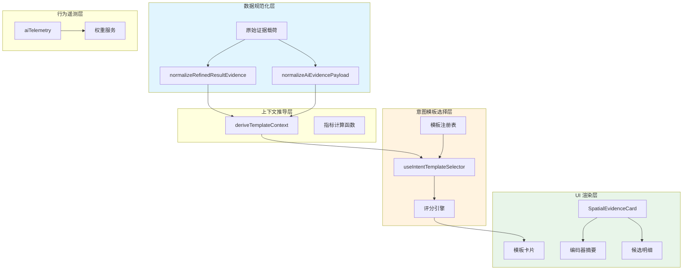

空间证据卡片是 GeoLoom 前端的核心可视化组件，负责将后端 AI 智能体返回的多维度空间证据数据转化为直观的可交互卡片界面。该系统通过意图驱动模板选择机制，动态生成适配用户查询意图的证据摘要卡片，同时集成远端遥测服务实现用户行为的闭环反馈。

## 系统架构概览

空间证据卡片渲染系统采用分层架构设计，从数据规范化到模板选择再到最终渲染形成清晰的单向数据流。核心组件包括 `SpatialEvidenceCard.vue` 主渲染组件、`useIntentTemplateSelector` 组合式函数、模板注册表以及 `aiTelemetry` 遥测服务四个关键模块。



数据流向遵循 `Props → Computed → Template` 的 Vue 3 Composition API 模式，父组件通过 Props 传递原始证据载荷，组件内部经过多层级规范化处理后生成渲染上下文，最终由模板系统选择最优卡片组合进行展示。

Sources: [SpatialEvidenceCard.vue](src/components/SpatialEvidenceCard.vue#L71-L105)
Sources: [useIntentTemplateSelector.ts](src/composables/ai/useIntentTemplateSelector.ts#L141-L176)
Sources: [aiTemplateMetrics.ts](src/utils/aiTemplateMetrics.ts#L330-L388)

## 数据规范化管道

空间证据卡片接收的原始载荷可能来自不同版本的 AI 服务接口，数据结构存在蛇形命名与驼峰命名混用、嵌套层级不一致等问题。系统通过两级规范化管道解决数据兼容性问题。

### 结果证据规范化

`normalizeRefinedResultEvidence` 函数实现第一级规范化，负责从混合结构中提取统一格式的空间证据数据。该函数采用渐进式候选提取策略，依次检查 `results` 嵌套结构与根级别字段，自动适配不同的 API 响应格式。

```typescript
function normalizeRefinedResultEvidence(payload: unknown): NormalizedRefinedResultEvidence {
  const root = pickObject(payload) || {}
  const results = pickObject(root.results) || root

  const boundary = results.boundary ?? root.boundary ?? null
  const spatialClusters =
    pickObject(results.spatial_clusters, results.spatialClusters, 
               root.spatial_clusters, root.spatialClusters) || { hotspots: [] }
  const vernacularRegions = pickArray(
    results.vernacular_regions, results.vernacularRegions,
    root.vernacular_regions, root.vernacularRegions
  )
  const fuzzyRegions = pickArray(
    results.fuzzy_regions, results.fuzzyRegions,
    root.fuzzy_regions, root.fuzzyRegions
  )
  // ... 返回规范化结构
}
```

规范化过程中，`pickObject` 和 `pickArray` 工具函数实现多候选字段的顺序查找，确保在字段缺失时能够优雅降级到备选字段。当检测到 `boundary`、`hotspots`、`vernacularRegions` 或 `fuzzyRegions` 中任意一项存在时，`hasEvidence` 标志位将被置为 `true`。

Sources: [refinedResultEvidence.ts](src/utils/refinedResultEvidence.ts#L122-L162)

### 证据载荷规范化

第二级规范化由 `normalizeAiEvidencePayload` 函数实现，专门处理 `fuzzyRegions` 数组中的模糊区域数据结构。该函数将原始数据映射为包含 `hierarchy` 与 `ambiguity` 两大子结构的标准化格式，并统一 `level` 字段的取值（`outer`、`transition`、`core` 三层语义）。

```typescript
function normalizeFuzzyRegion(item: unknown = {}): NormalizedFuzzyRegion {
  const region = asPlainObject(item)
  const hierarchy = asPlainObject(region.hierarchy)
  const membership = asPlainObject(region.membership)
  const ambiguity = asPlainObject(region.ambiguity)

  return {
    ...region,
    hierarchy: {
      macro_name: normalizeText(hierarchy.macro_name),
      micro_name: normalizeText(hierarchy.micro_name || region.name),
      level: normalizeText(hierarchy.level || region.level || membership.level || 'transition'),
      rank_in_macro: toFiniteNumberOrNull(hierarchy.rank_in_macro),
      macro_size: toFiniteNumberOrNull(hierarchy.macro_size),
      layer_mode: normalizeText(hierarchy.layer_mode || (region.layers ? 'multi_layer' : 'single_layer'))
    },
    ambiguity: Object.keys(ambiguity).length > 0 ? ambiguity : { score: null, flags: [] }
  }
}
```

Sources: [aiEvidencePayload.ts](src/utils/aiEvidencePayload.ts#L62-L80)

## 模板上下文推导

模板上下文是连接数据规范化层与模板选择层的核心数据结构。`deriveTemplateContext` 函数将规范化的证据数据转换为包含意图类型、热点、片区、模糊区域及多维度指标的完整上下文对象，供模板注册表进行可用性判断与评分计算。

### 意图类型解析

意图类型通过 `resolveIntentType` 函数根据 `intentMode` 与 `queryType` 字段的文本内容进行推断，返回 `macro`（宏观意图）、`micro`（微观意图）或 `comparison`（对比意图）三种类型之一。

```typescript
function resolveIntentType(intentMode: unknown, queryType: unknown): IntentType {
  const merged = `${intentMode || ''}|${queryType || ''}`.toLowerCase()
  if (merged.includes('comparison') || merged.includes('region_comparison')) return 'comparison'
  if (merged.includes('local_search') || merged.includes('poi_search') || merged.includes('micro')) return 'micro'
  return 'macro'
}
```

宏观意图适用于区域整体分析场景，微观意图针对局部热点或 POI 搜索场景，对比意图则服务于多片区或多热点间的差异化分析。

Sources: [aiTemplateMetrics.ts](src/utils/aiTemplateMetrics.ts#L205-L210)

### 派生指标计算

模板上下文包含六个预计算的派生指标，分别从不同维度量化空间证据的质量与特征：

| 指标名称 | 计算逻辑 | 取值范围 | 用途 |
|---------|---------|---------|------|
| `industryOverlap` | 基于第二业态占比与多样性加成的加权评分 | [0, 1] | 评估业态重叠与辐射能力 |
| `radiationCoverage` | 热点分散度与片区隶属度均值的综合评分 | [0, 1] | 衡量空间覆盖强度 |
| `confidence` | 边界置信度的聚合统计或逐项均值 | [0, 1] | 反映证据可信程度 |
| `risk` | 模糊区域歧义度与重叠风险的加权和 | [0, 1] | 预警潜在风险区域 |
| `accessibility` | 路网贴合度与热点分布的综合评分 | [0, 1] | 评估可达性水平 |

派生指标均通过 `clamp01` 函数确保输出值严格限制在 `[0, 1]` 区间内，避免异常数据导致的渲染问题。

Sources: [aiTemplateMetrics.ts](src/utils/aiTemplateMetrics.ts#L212-L328)

## 意图模板注册系统

模板注册表采用声明式配置模式，通过 `createTemplateRegistry` 函数返回预定义的模板定义数组。每个模板包含唯一标识符、标题、副标题、可用性判断函数、评分函数与内容构建函数五个核心属性。

### 预置模板清单

系统内置七种意图模板，分别对应不同的查询场景与用户需求：

```typescript
const templates = [
  { id: 'hotspot_overview',       title: '热点区域',         intent: macro },
  { id: 'dominant_industry',      title: '主导业态',         intent: macro },
  { id: 'industry_overlap_radiation', title: '业态辐射覆盖', intent: all },
  { id: 'opportunity_window',     title: '机会窗口',         intent: micro },
  { id: 'risk_radar',             title: '风险雷达',         intent: micro },
  { id: 'accessibility_snapshot', title: '可达性快照',       intent: all },
  { id: 'comparison_digest',      title: '结构对比摘要',      intent: comparison },
  { id: 'confidence_watch',       title: '可信度看板',        intent: all }
]
```

模板的 `isAvailable` 函数决定该模板是否可以被选中，例如 `hotspot_overview` 要求 `context.hotspots.length > 0`，而 `confidence_watch` 无前置条件始终可用。`score` 函数返回原始评分，与意图加成、证据丰富度加成和学习权重共同构成最终排序分数。

Sources: [templateRegistry.ts](src/components/ai/templateRegistry.ts#L62-L249)

### 模板评分引擎

评分引擎通过 `scoreTemplate` 函数综合考量四个维度的权重：

```typescript
function scoreTemplate(template: TemplateDefinition, context: TemplateContext): number {
  const baseScore = Number(template.score?.(context) || 0)
  const intentBonus = Number(INTENT_TEMPLATE_BONUS[context.intentType]?.[template.id] || 0)
  const richnessBonus = context.hotspots.length + context.regions.length + context.fuzzyRegions.length > 5 ? 2 : 0
  const learningWeight = context.traceId ? Number(getTemplateWeight(template.id) || 1) : 1
  const learningBonus = Number.isFinite(learningWeight) ? (learningWeight - 1) * 25 : 0
  return baseScore + intentBonus + richnessBonus + learningBonus
}
```

意图加成表为每种意图类型分配差异化的模板优先级，例如对比意图下 `comparison_digest` 获得 44 分加成而 `hotspot_overview` 仅获得 16 分。学习权重通过 `getTemplateWeight` 从本地存储或远端服务获取，实现基于历史用户点击行为的自适应模板排序。

Sources: [useIntentTemplateSelector.ts](src/composables/ai/useIntentTemplateSelector.ts#L101-L108)
Sources: [aiTelemetry.ts](src/services/aiTelemetry.ts#L130-L133)

## 卡片渲染机制

`SpatialEvidenceCard.vue` 组件采用 Vue 3 Composition API 的 `<script setup>` 语法，通过计算属性实现响应式数据流。组件接收五类 Props：空间聚类数据、方言区域数据、模糊区域数据、分析统计信息与意图元数据。

### 响应式数据流

组件内部维护两条平行的计算属性链：模板上下文链负责将 Props 转换为标准化上下文对象，模板选择链负责根据上下文生成最优卡片组合。

```typescript
const templateContext = computed(() =>
  deriveTemplateContext({
    clusters: props.clusters,
    vernacularRegions: props.vernacularRegions,
    fuzzyRegions: props.fuzzyRegions,
    analysisStats: props.analysisStats,
    intentMeta: props.intentMeta,
    intentMode: props.intentMode,
    queryType: props.queryType
  })
)

const selectedWidgets = computed(() => selectTemplates(templateContext.value))
const hasWidgets = computed(() => selectedWidgets.value.length > 0)
```

模板卡片的数量上限通过 `resolveMaxTemplateCount` 函数动态计算，规则为：无论何种意图类型，最多展示 3 张卡片，且卡片数不少于 2 张（当存在核心证据时）。

Sources: [SpatialEvidenceCard.vue](src/components/SpatialEvidenceCard.vue#L95-L109)
Sources: [useIntentTemplateSelector.ts](src/composables/ai/useIntentTemplateSelector.ts#L110-L123)

### 编码器摘要渲染

当分析统计信息包含编码器相关指标时，组件顶部显示编码器参与摘要区域，包含四个关键指标胶囊：

```typescript
const encoderSummary = computed(() => {
  const stats = props.analysisStats
  if (!stats || typeof stats !== 'object') return null

  const predictedCount = Number(stats.encoder_region_predicted_count)
  const highConfidenceCount = Number(stats.encoder_region_high_confidence_count)
  const purity = Number(stats.encoder_region_purity)
  const constraintSource = String(stats.vector_constraint_source || '').trim()
  const signalModel = String(stats.boundary_signal_model || '').trim().toLowerCase()

  const hasEncoderSignal = signalModel.includes('encoder')
    || Number.isFinite(predictedCount)
    || Number.isFinite(highConfidenceCount)
    || Number.isFinite(purity)
    || Boolean(constraintSource)

  if (!hasEncoderSignal) return null

  return {
    predictedCount: Number.isFinite(predictedCount) ? predictedCount : '--',
    highConfidenceCount: Number.isFinite(highConfidenceCount) ? highConfidenceCount : '--',
    purityText: Number.isFinite(purity) ? toPercent(purity) : '--',
    constraintSource: constraintSource || 'unknown'
  }
})
```

该计算属性通过检测 `boundary_signal_model` 字段是否包含 `'encoder'` 字符串或各编码器指标是否为有限数值来判断编码器是否参与当前分析。

Sources: [SpatialEvidenceCard.vue](src/components/SpatialEvidenceCard.vue#L126-L150)

### 候选明细面板

卡片底部的 `<details>` 折叠面板展示候选热点与片区的地理定位入口，便于用户快速导航至特定空间位置。面板内容通过 `detailRows` 计算属性聚合生成，最多展示 8 条明细（热点前 3、片区前 3、模糊区域前 2）。

```typescript
const detailRows = computed(() => {
  const rows = []
  const context = templateContext.value

  context.hotspots.slice(0, 3).forEach((item, index) => {
    rows.push({
      key: `hotspot-${item.id}`,
      rank: `热点 #${index + 1}`,
      name: item.name,
      metric: `${item.poiCount} POI`,
      center: item.center
    })
  })

  context.regions.slice(0, 3).forEach((item, index) => {
    rows.push({
      key: `region-${item.id}`,
      rank: `片区 #${index + 1}`,
      name: item.name,
      metric: `隶属度 ${toPercent(item.membershipScore)}`,
      center: item.center
    })
  })
  // ... 模糊区域处理逻辑
  return rows
})
```

点击明细行触发 `handleLocate` 事件，向父组件传递归一化的经纬度坐标数组 `[lon, lat]`，支持数组格式与对象格式（`{lon, lat}`、`{lng, lat}`、`{longitude, latitude}`）两种输入。

Sources: [SpatialEvidenceCard.vue](src/components/SpatialEvidenceCard.vue#L152-L187)
Sources: [SpatialEvidenceCard.vue](src/components/SpatialEvidenceCard.vue#L210-L228)

## 行为遥测闭环

系统集成 `aiTelemetry` 服务实现用户与模板卡片交互行为的实时追踪，为后续模板权重学习提供数据基础。遥测服务支持四种核心事件类型的上报。

| 事件类型 | 触发时机 | 上报字段 |
|---------|---------|---------|
| `template_impression` | 卡片首次进入视口 | traceId、templateId、intentMeta |
| `template_click` | 点击卡片任意区域 | traceId、templateId、intentMeta |
| `locate_click` | 点击定位按钮 | traceId、templateId、intentMeta |
| `followup_click` | 点击追问按钮 | traceId、templateId、intentMeta、extra |

模板权重通过 `refreshTemplateWeights` 函数从远端服务定期拉取，采用 60 秒 TTL 的缓存策略，在网络不可达时静默降级到本地存储的缓存权重。权重值经过归一化处理后转换为 `[1, 2]` 区间的学习加成系数。

```typescript
export function refreshTemplateWeights(options: TemplateWeightRefreshOptions = {}): Promise<TemplateWeightsSnapshot> {
  if (IS_V4_MODE) return getTemplateWeightsSnapshot()

  const ttlMs = Math.max(5_000, Number(options.ttlMs || 60_000))
  const force = options.force === true

  if (!force && cachedWeights.loadedAt > 0 && nowTs() - cachedWeights.loadedAt < ttlMs) {
    return getTemplateWeightsSnapshot()
  }
  // ... 远端拉取逻辑
}
```

Sources: [aiTelemetry.ts](src/services/aiTelemetry.ts#L135-L167)
Sources: [aiTelemetry.ts](src/services/aiTelemetry.ts#L204-L218)

## 视觉设计规范

空间证据卡片采用深色主题设计，通过 CSS 变量与渐变背景营造专业的空间分析氛围。关键视觉层级定义如下：

```css
.evidence-board {
  border-radius: 16px;
  border: 1px solid rgba(80, 125, 167, 0.35);
  background:
    radial-gradient(circle at 10% 0%, rgba(18, 102, 163, 0.18), transparent 55%),
    linear-gradient(150deg, rgba(9, 20, 40, 0.95), rgba(12, 28, 50, 0.9));
  box-shadow: 0 10px 30px rgba(0, 0, 0, 0.24);
}

.template-card {
  border-radius: 12px;
  border: 1px solid rgba(110, 160, 205, 0.22);
  background: linear-gradient(145deg, rgba(15, 23, 42, 0.82), rgba(15, 30, 56, 0.62));
  animation: widget-enter 220ms ease-out;
}
```

卡片网格采用 `auto-fit` 与 `minmax(210px, 1fr)` 的响应式布局，确保在不同屏幕尺寸下均能保持良好的可读性。移动端（≤768px）强制单列布局，弱动效偏好用户通过 `@media (prefers-reduced-motion: reduce)` 规则禁用所有过渡动画。

Sources: [SpatialEvidenceCard.vue](src/components/SpatialEvidenceCard.vue#L256-L483)

## 组件集成模式

空间证据卡片通过 Props 接收父组件传递的数据，并通过自定义事件与父组件通信。典型集成模式如下：

```typescript
// 父组件使用示例
const evidenceClusters = ref(null)
const vernacularRegions = ref([])
const fuzzyRegions = ref([])
const analysisStats = ref({})
const intentMeta = ref({})

function handleLocate(center) {
  map.value?.flyTo(center, { zoom: 15 })
}

function handleFollowup(payload) {
  chatService.sendMessage(payload)
}
```

父组件需要在 `watch` 中监听卡片暴露的事件，驱动地图导航或聊天输入更新。当 `traceId` 与 `selectedWidgets` 同时就绪时，组件自动触发模板展示事件的遥测上报，无需父组件显式调用。

Sources: [SpatialEvidenceCard.vue](src/components/SpatialEvidenceCard.vue#L236-L253)

## 进阶阅读

- [AI 聊天界面组件](17-ai-liao-tian-jie-mian-zu-jian) — 了解空间证据卡片所在的对话交互上下文
- [证据视图工厂](14-zheng-ju-shi-tu-gong-han) — 探索服务端视角的证据结构化封装
- [SSE 事件流协议](15-sse-shi-jian-liu-xie-yi) — 理解后端到前端的实时数据传输机制
- [行为遥测服务](src/services/aiTelemetry.ts) — 深入遥测服务的权重学习实现