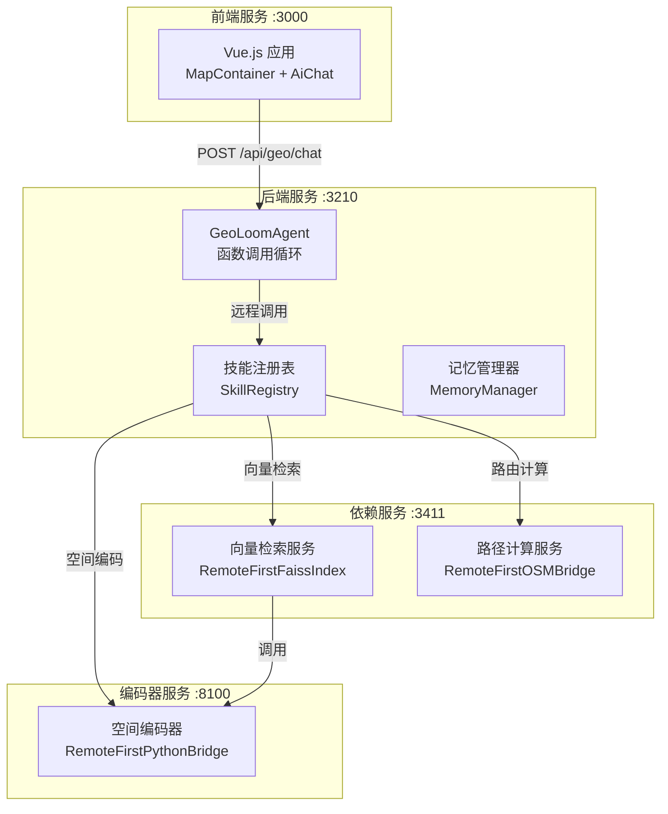
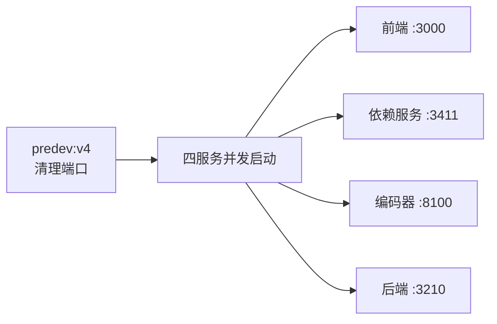
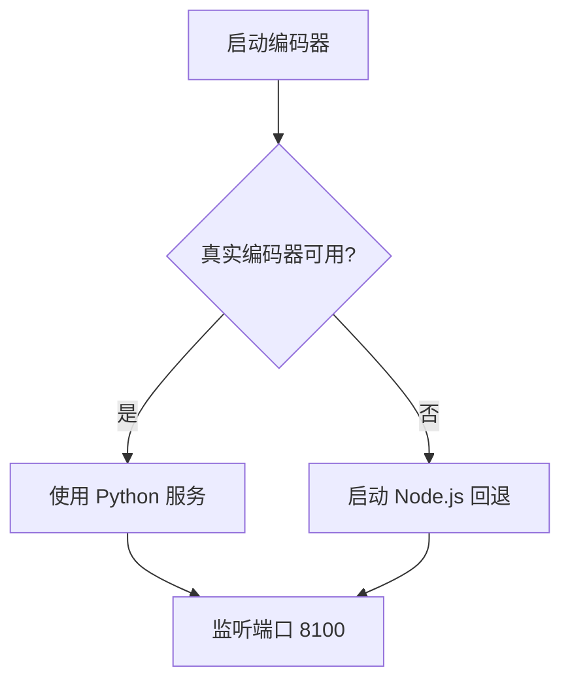

GeoLoom Agent 是一个空间智能应用平台，包含 Vue.js 前端、Node.js/TypeScript 后端以及真实的空间依赖服务（空间编码器、向量检索、路径计算）。本指南将帮助开发者在 Windows 环境下快速搭建可运行的全栈开发环境。

## 系统架构概览

GeoLoom Agent 采用微服务架构，由四个独立进程组成，通过 HTTP API 协同工作。以下架构图展示了各服务之间的连接关系：



## 服务端口映射

GeoLoom Agent 包含四个核心服务，每个服务监听特定端口：

| 服务名称 | 端口 | 技术栈 | 功能描述 |
|---------|------|--------|----------|
| 前端服务 | 3000 | Vue.js + Vite | 用户界面，地图展示与 AI 对话 |
| 后端服务 | 3210 | Node.js + Fastify | GeoLoomAgent 核心，函数调用循环 |
| 依赖服务 | 3411 | Node.js + Fastify | 向量检索 + 路径计算适配层 |
| 编码器服务 | 8100 | Python | 真实空间编码器服务 |

Sources: [package.json](package.json#L8-L11), [backend/package.json](backend/package.json#L5-L7)

## 前置条件

在开始之前，请确保开发环境满足以下要求：

- **Node.js**: 版本 >= 18.0.0
- **操作系统**: Windows（脚本基于 cmd.exe）
- **网络**: 能够访问外部 API（如 MiniMax、OSRM）

Sources: [package.json](package.json#L78-L80), [backend/package.json](backend/package.json#L34-L36)

## 安装步骤

### 第一步：安装根目录依赖

```bash
npm install
```

Sources: [package.json](package.json#L1-L77)

### 第二步：安装后端依赖

```bash
npm --prefix backend install
```

Sources: [backend/package.json](backend/package.json#L1-L36)

### 第三步：配置环境变量

如果目标机器上没有现有的环境配置文件，需要从示例文件复制：

```bash
copy .env.v4.example .env.v4
copy backend\.env.example backend\.env
```

对于本地开发，如果 `D:\AAA_Edu\geoloom-agent\.env.v4` 和 `D:\AAA_Edu\geoloom-agent\backend\.env` 已存在（从原 V4 有效配置复制），则可跳过此步骤。

Sources: [README.md](README.md#L41-L46)

## 启动应用

### 一键启动（推荐）

在 Windows 环境下，直接运行：

```bat
start.bat
```

或者使用 npm 命令：

```bash
npm run dev:v4
```

这两条命令的效果完全相同，都会先清理占用端口的旧进程，再同时启动四个服务。

Sources: [start.bat](start.bat#L1-L8), [package.json](package.json#L8)

### 启动流程详解

`dev:v4` 命令的实际执行过程如下：



**端口清理脚本**会按顺序终止以下端口上的进程：3210、3000、3411、8100。

Sources: [scripts/cleanup-ports.mjs](scripts/cleanup-ports.mjs#L1-L64), [package.json](package.json#L8-L11)

### 手动分步启动

如需单独启动某个服务，可以按以下顺序手动启动：

```bash
# 启动依赖服务
npm run dev:deps

# 启动编码器服务
npm run dev:encoder-service

# 启动后端服务
npm run dev:backend

# 启动前端服务
npm run dev:frontend:v4
```

Sources: [package.json](package.json#L11-L15)

## 验证部署状态

启动后，可以通过以下端点验证各服务是否正常运行：

### 后端健康检查

```bash
curl http://127.0.0.1:3210/api/geo/health
```

关键返回字段：
- `provider_ready`: LLM 提供商就绪状态
- `services.database`: PostGIS 数据库连接状态
- `dependencies.spatial_encoder.mode`: 应为 `remote`
- `dependencies.spatial_vector.mode`: 应为 `remote`
- `dependencies.route_distance.mode`: 应为 `remote`

Sources: [README.md](README.md#L56-L64)

### 依赖服务健康检查

```bash
curl http://127.0.0.1:8100/health
curl http://127.0.0.1:3411/health/vector
curl http://127.0.0.1:3411/health/routing
```

Sources: [README.md](README.md#L66-L68)

### 运行 Smoke 测试

完整的端到端测试：

```bash
npm run smoke:dev
```

测试会验证以下关键功能：
- 前端可访问性
- API 健康状态
- 编码器加载状态
- 向量检索（语义 POI 搜索）
- 相似片区检索
- 路径距离计算
- AI 对话功能

Sources: [scripts/smoke-stack.mjs](scripts/smoke-stack.mjs#L1-L189), [package.json](package.json#L50-L51)

## 环境变量配置

### 前端环境变量

文件位置：`.env.v4`

| 变量名 | 默认值 | 说明 |
|-------|--------|------|
| `VITE_DEV_API_BASE` | `http://127.0.0.1:3210` | 后端 API 地址 |
| `VITE_AI_DEV_API_BASE` | `http://127.0.0.1:3210` | AI 服务地址 |
| `VITE_BACKEND_VERSION` | `v4` | 后端版本标识 |

Sources: [.env.v4.example](.env.v4.example#L1-L5)

### 后端环境变量

文件位置：`backend/.env`

| 变量名 | 默认值 | 说明 |
|-------|--------|------|
| `PORT` | `3210` | 后端服务端口 |
| `HOST` | `127.0.0.1` | 后端服务地址 |
| `POSTGRES_HOST` | `127.0.0.1` | PostGIS 主机 |
| `POSTGRES_PORT` | `15432` | PostGIS 端口 |
| `LLM_BASE_URL` | `https://api.minimaxi.com/anthropic` | LLM API 地址 |
| `LLM_MODEL` | `MiniMax-M2` | LLM 模型名称 |
| `SPATIAL_ENCODER_BASE_URL` | `http://127.0.0.1:8100` | 编码器服务地址 |
| `SPATIAL_VECTOR_BASE_URL` | `http://127.0.0.1:3411` | 向量检索服务地址 |
| `ROUTING_BASE_URL` | `http://127.0.0.1:3411` | 路由服务地址 |

Sources: [backend/.env.example](backend/.env.example#L1-L37)

### 启动脚本环境注入

启动脚本 `run-backend-v4.mjs` 会在启动时注入默认的依赖服务地址：

Sources: [scripts/run-backend-v4.mjs](scripts/run-backend-v4.mjs#L1-L32)

## 编码器服务回退机制

当真实编码器服务（`vector-encoder`）不可用时，启动脚本会自动切换到 Node.js 回退实现：



回退服务由 `scripts/encoder-fallback-service.mjs` 提供。

Sources: [scripts/run-encoder-service.mjs](scripts/run-encoder-service.mjs#L1-L117)

## 常见问题排查

### 端口占用

如果启动时报错端口被占用，执行：

```bash
node scripts/cleanup-ports.mjs 3210 3000 3411 8100
```

Sources: [scripts/cleanup-ports.mjs](scripts/cleanup-ports.mjs#L1-L64)

### 数据库连接失败

检查 PostGIS 服务是否运行，并验证 `backend/.env` 中的数据库配置：

```bash
POSTGRES_HOST=127.0.0.1
POSTGRES_PORT=15432
POSTGRES_USER=postgres
POSTGRES_PASSWORD=123456
POSTGRES_DATABASE=geoloom
```

Sources: [backend/.env.example](backend/.env.example#L2-L6)

### 依赖服务降级

如果 `smoke:dev` 输出显示某些服务处于 `degraded` 状态，检查对应服务日志。常见的降级原因：
- Redis 连接失败：`short_term_memory` 会降级
- 向量服务不可用：会降级到本地模式

Sources: [README.md](README.md#L72-L75)

## 访问应用

启动成功后，在浏览器中访问：

- **前端界面**: http://127.0.0.1:3000
- **后端 API**: http://127.0.0.1:3210
- **依赖服务**: http://127.0.0.1:3411
- **编码器服务**: http://127.0.0.1:8100

Sources: [start.bat](start.bat#L2-L5)

## 下一步

完成快速启动后，建议按以下顺序深入学习：

1. [项目概述](1-xiang-mu-gai-shu) - 了解项目背景和设计目标
2. [系统架构概览](3-xi-tong-jia-gou-gai-lan) - 深入理解整体架构设计
3. [GeoLoomAgent 智能体核心](4-geoloomagent-zhi-neng-ti-he-xin) - 掌握核心智能体实现
4. [前端地图容器组件](16-di-tu-rong-qi-zu-jian) - 了解前端地图组件