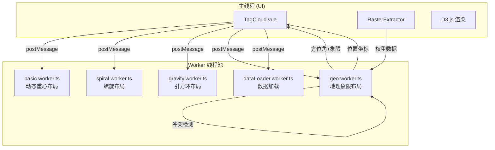
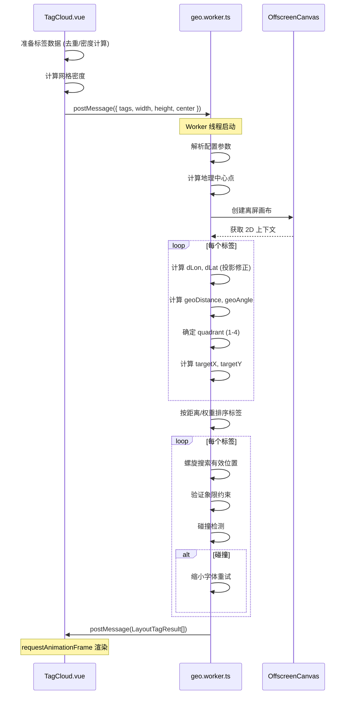

GeoLoom 前端采用 **Web Worker 并行计算架构**处理地理数据标签的布局计算，将计算密集型任务从主线程剥离，避免 UI 阻塞。本模块包含四种专用 Worker，分别针对不同布局场景进行优化，其中 `geo.worker.ts` 是实现地理感知布局的核心组件。

## 系统架构概览

前端 Worker 系统采用**策略模式**设计，根据数据特征自动选择最优布局算法。各 Worker 共享相似的消息协议，但实现差异显著：



Sources: [geo.worker.ts](src/workers/geo.worker.ts#L1-L503), [TagCloud.vue](src/components/TagCloud.vue#L48-L55)

## Worker 类型详解

### 1. 地理象限布局 Worker (geo.worker.ts)

**核心职责**：将地理标签按照其实际空间位置分布到画布的四个象限，保持方位一致性。这是本系统的特色布局算法。

#### 输入输出协议

```typescript
// 输入消息格式
type WorkerRequest = {
  tags?: WorkerTagInput[]           // 标签数据
  width?: number                    // 画布宽度
  height?: number                   // 画布高度
  center?: [number, number] | null  // 地理中心点 [lon, lat]
  config?: WorkerConfig | null     // 布局配置
}

// 输出消息格式  
type LayoutTagResult = BaseLayoutTag & {
  text: string
  rotation: number
  placed: boolean
  geoDistance?: number             // 地理距离
  geoAngle?: number                // 方位角
  quadrant?: 1 | 2 | 3 | 4         // 象限编号
}
```

Sources: [geo.worker.ts](src/workers/geo.worker.ts#L19-L65)

#### 地理坐标转换算法

Worker 首先将每个标签的经纬度转换为相对于中心点的极坐标：

```typescript
function runGeoLayout(tags, width, height, center, config) {
  // 计算地理中心（用户指定或自动计算）
  const latitudeRadians = (centerLat * Math.PI) / 180
  const longitudeFactor = Math.cos(latitudeRadians)
  
  // 经度投影修正（应对高纬度地区的纵向压缩）
  const dLon = (tag.lon - centerLon) * longitudeFactor
  const dLat = tag.lat - centerLat
  
  // 计算极坐标
  const geoDistance = Math.sqrt(dLon * dLon + dLat * dLat)
  const geoAngle = Math.atan2(dLat, dLon)
  
  // 确定象限
  if (dLon >= 0 && dLat >= 0) quadrant = 1  // 右上
  else if (dLon < 0 && dLat >= 0) quadrant = 2  // 左上
  else if (dLon < 0 && dLat < 0) quadrant = 3   // 左下
  else quadrant = 4  // 右下
}
```

Sources: [geo.worker.ts](src/workers/geo.worker.ts#L199-L244)

**关键设计**：经度投影修正因子 `longitudeFactor = cos(latitudeRadians)` 确保高纬度地区的标签分布不会被纵向压缩。

#### 位置搜索与象限约束

当标签无法放置在目标象限时，系统强制修正位置：

```typescript
function findValidPosition(tag, placedTags, centerX, centerY, ...) {
  const maxAttempts = 500
  let theta = 0
  
  while (attempt < maxAttempts) {
    // 螺旋轨迹采样
    const radius = (spiralStep * theta) / (2 * Math.PI)
    const testX = tag.targetX + radius * Math.cos(theta)
    const testY = tag.targetY + radius * Math.sin(theta)
    
    // 象限验证 - 确保标签位于正确象限
    if (!verifyQuadrant(testX, testY, centerX, centerY, tag.quadrant)) {
      theta += angleStep
      attempt += 1
      continue
    }
    
    // 碰撞检测
    if (!hasCollision(testX, testY, tag.width, tag.height, placedTags, minGap)) {
      return { x: testX, y: testY }
    }
    
    theta += angleStep
    attempt += 1
  }
  return null
}

function verifyQuadrant(x, y, centerX, centerY, targetQuadrant) {
  const isRight = x >= centerX
  const isUp = y <= centerY  // 屏幕坐标 Y 轴向下
  
  switch (targetQuadrant) {
    case 1: return isRight && isUp
    case 2: return !isRight && isUp
    case 3: return !isRight && !isUp
    case 4: return isRight && !isUp
  }
}
```

Sources: [geo.worker.ts](src/workers/geo.worker.ts#L367-L444)

#### 配置参数

| 参数名 | 默认值 | 说明 |
|--------|--------|------|
| `fontMin` | 14 | 最小字体大小(px) |
| `fontMax` | 18 | 最大字体大小(px) |
| `minTagSpacing` | 2 | 标签最小间距(px) |
| `angleStep` | 0.3 | 螺旋搜索角度步长(rad) |
| `spiralSpacing` | 3 | 螺旋密度参数 |
| `padding` | 40 | 画布边缘留白(px) |

Sources: [geo.worker.ts](src/workers/geo.worker.ts#L96-L109)

### 2. 动态重心布局 Worker (basic.worker.ts)

**核心职责**：基于已放置标签的**几何重心**引导后续标签放置，使布局更加紧凑有序。

采用 **RBush 空间索引树**优化碰撞检测，将 O(n²) 的碰撞检测降至近似 O(n log n)：

```typescript
// RBush 索引树结构
const tree = new RBush<TreeItem>()

// 插入已放置标签
const item: TreeItem = {
  minX: tag.x - tag.width / 2 - config.padding,
  minY: tag.y - tag.height / 2 - config.padding,
  maxX: tag.x + tag.width / 2 + config.padding,
  maxY: tag.y + tag.height / 2 + config.padding,
  tag
}
tree.insert(item)

// 碰撞检测查询
if (!tree.collides(candidateBox)) {
  return { x, y }  // 无碰撞，可放置
}
```

Sources: [basic.worker.ts](src/workers/basic.worker.ts#L1-L288)

### 3. 引力环布局 Worker (gravity.worker.ts)

**核心职责**：将标签按距离中心点的地理距离分配到不同**同心环**，再按方位角排列。

采用 Haversine 公式计算球面距离：

```typescript
function calculateDistance(lat1, lon1, lat2, lon2) {
  const earthRadius = 6371000  // 地球半径(m)
  const toRadians = (degrees) => (degrees * Math.PI) / 180
  
  const deltaLat = toRadians(lat2 - lat1)
  const deltaLon = toRadians(lon2 - lon1)
  
  const a = (
    Math.sin(deltaLat / 2) ** 2
    + Math.cos(toRadians(lat1)) * Math.cos(toRadians(lat2)) * Math.sin(deltaLon / 2) ** 2
  )
  
  return earthRadius * 2 * Math.atan2(Math.sqrt(a), Math.sqrt(1 - a))
}
```

Sources: [gravity.worker.ts](src/workers/gravity.worker.ts#L125-L143)

### 4. 螺旋布局 Worker (spiral.worker.ts)

**核心职责**：基于阿基米德螺旋线搜索无碰撞位置，支持多阶段间隙松弛。

```typescript
function findBestPosition(tag, placedTags, centerX, centerY, ...) {
  // 多阶段搜索：逐步放宽间距要求
  const searchPhases = [
    { factor: 1.0, maxAttempts: 100000 },  // 正常间距
    { factor: 0.8, maxAttempts: 100000 },  // 放宽 20%
    { factor: 0.6, maxAttempts: 100000 },  // 放宽 40%
    { factor: 0.4, maxAttempts: 100000 },  // 放宽 60%
    { factor: 0.2, maxAttempts: 100000 }   // 放宽 80%
  ]
  
  for (const phase of searchPhases) {
    // 阿基米德螺旋: r = a + b*θ
    const radius = a + (b * theta / density)
    const x = centerX + radius * Math.cos(theta)
    const y = centerY + radius * Math.sin(theta)
    // ...
  }
}
```

Sources: [spiral.worker.ts](src/workers/spiral.worker.ts#L186-L240)

### 5. 数据加载 Worker (dataLoader.worker.ts)

**核心职责**：在后台线程异步加载 POI 数据，通过 fetch 调用后端 API：

```typescript
self.onmessage = async (event) => {
  const { category, categories, name, bounds, geometry, limit, baseUrl } = event.data
  
  const response = await fetch(`${baseUrl}/api/spatial/fetch`, {
    method: 'POST',
    headers: { 'Content-Type': 'application/json' },
    body: JSON.stringify({ categories: finalCategories, bounds, geometry, limit })
  })
  
  const data = await response.json()
  self.postMessage({
    success: true,
    name,
    features: data.features
  })
}
```

Sources: [dataLoader.worker.ts](src/workers/dataLoader.worker.ts#L32-L82)

## 核心布局流程

以地理布局为例，完整流程如下：



Sources: [TagCloud.vue](src/components/TagCloud.vue#L218-L313)

## OffscreenCanvas 兼容性处理

由于 Web Worker 环境没有 DOM，Worker 内部实现了 `document.createElement` 的 polyfill：

```typescript
const workerDocumentScope = self as unknown as { document?: WorkerDocument }

if (typeof workerDocumentScope.document === 'undefined') {
  workerDocumentScope.document = {
    createElement: (tagName: string) => {
      if (tagName === 'canvas') {
        return new OffscreenCanvas(1, 1)
      }
      return {}
    }
  }
}
```

Sources: [geo.worker.ts](src/workers/geo.worker.ts#L71-L84)

## 权重系统与 Jenks 分类

权重数据来源于 `RasterExtractor` 提取的栅格值，经 Jenks 自然断点分类后映射到颜色：

```typescript
// TagCloud.vue 中的权重处理
if (props.weightEnabled && rasterLoaded.value) {
  const allWeights = tags.map(t => t.weight).filter(w => w > 0)
  const breaks = jenksBreaks(allWeights, 5)  // 5 分类
  
  // 暖色系配色 (蓝-白-红)
  const WEIGHT_COLORS = [
    '#2166ac',  // 蓝色 (最低)
    '#67a9cf',  // 浅蓝
    '#f7f7f7',  // 白色 (中间)
    '#ef8a62',  // 浅红
    '#b2182b'   // 深红 (最高)
  ]
}
```

Sources: [TagCloud.vue](src/components/TagCloud.vue#L92-L106)

## Worker 选择策略

TagCloud 根据数据特征自动选择最优 Worker：

```typescript
function initWorker() {
  const hasGeoData = props.data?.some(f => f.geometry?.coordinates)
  
  if (hasGeoData && props.algorithm !== 'spiral' && props.algorithm !== 'basic') {
    // 有坐标数据 → 使用 GravityWorker
    worker = new GravityWorker()
  } else if (props.algorithm === 'basic') {
    worker = new BasicWorker()
  } else {
    worker = new SpiralWorker()
  }
}
```

Sources: [TagCloud.vue](src/workers/basic.worker.ts#L204-L214)

## 性能优化策略

| 优化手段 | 实现位置 | 效果 |
|----------|----------|------|
| RBush 空间索引 | basic.worker.ts | 碰撞检测 O(n²) → O(n log n) |
| 字体大小预计算 | geo.worker.ts | 避免重复调用 measureText |
| 螺旋搜索步长 | spiral.worker.ts | 减少无效迭代 |
| 多阶段间隙松弛 | spiral.worker.ts | 优先保证布局密度 |
| requestAnimationFrame | TagCloud.vue | 合并渲染更新 |
| 数据上限截断 | TagCloud.vue | MAX_TAGS = 800 防止 DOM 膨胀 |

Sources: [basic.worker.ts](src/workers/basic.worker.ts#L161-L162), [TagCloud.vue](src/components/TagCloud.vue#L181)

## 测试覆盖

Worker 模块通过 Vitest 进行单元测试，关键测试用例：

```javascript
describe('geo worker', () => {
  it('respects minTagSpacing when searching for a valid position', async () => {
    // 验证不同间距配置下的布局结果
    // 紧密间距：标签距中心更近
    // 宽松间距：标签距中心更远
    expect(looseDistance).toBeGreaterThan(tightDistance + 5)
  })
})

describe('dataLoader worker', () => {
  it('falls back to single category when categories is empty', async () => {
    // 验证向后兼容的类别处理逻辑
    expect(payload.categories).toEqual(['中餐厅'])
  })
})
```

Sources: [geo.worker.spec.js](src/workers/__tests__/geo.worker.spec.js#L1-L104), [dataLoader.worker.spec.js](src/workers/__tests__/dataLoader.worker.spec.js#L1-L66)

## 扩展阅读

- [栅格数据提取器](21-zha-ge-shu-ju-ti-qu-qi) — 了解权重数据的来源
- [空间证据卡片渲染](19-kong-jian-zheng-ju-qia-pian-xuan-ran) — 了解标签的最终渲染方式
- [AI 聊天界面组件](17-ai-liao-tian-jie-mian-zu-jian) — 了解 Worker 与 AI 响应的集成