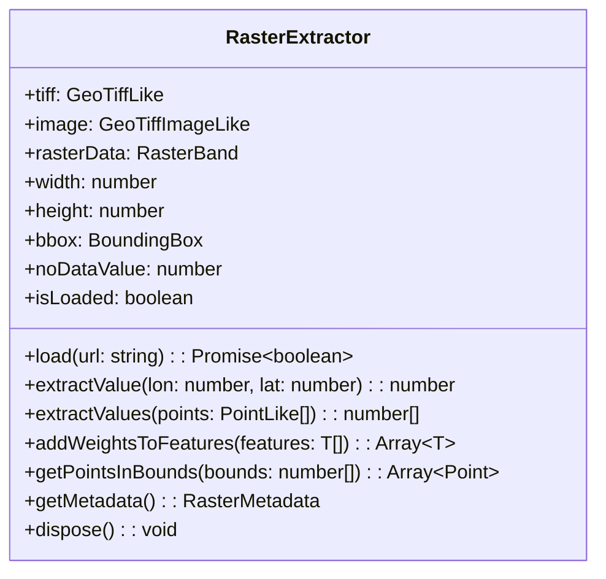

GeoLoom Agent 的栅格数据提取器是一个专用于从 GeoTIFF 格式栅格文件中解析空间权重的工具类。该模块位于 `src/utils/RasterExtractor.ts`，是连接地理人口数据与 POI 权重计算的核心桥梁，在标签云渲染和空间分析场景中发挥重要作用。

## 核心架构

栅格数据提取器采用单例模式的类设计，内部维护已加载栅格的所有元数据状态。其核心依赖为 `geotiff` 库，通过该库解析 GeoTIFF 文件的二进制内容并提取栅格波段数据。



### 关键类型定义

```typescript
type BoundingBox = [number, number, number, number]  // [minX, minY, maxX, maxY]
type PointLike = { lon: number; lat: number }
type FeatureLike = {
  geometry?: { coordinates?: unknown }
  properties?: Record<string, unknown>
}
```

Sources: [RasterExtractor.ts](src/utils/RasterExtractor.ts#L3-L34)

## 加载机制

### GeoTIFF 加载流程

`load()` 方法负责异步加载远程 GeoTIFF 文件，其执行流程包含以下关键步骤：

1. **HTTP 请求获取**: 通过 fetch API 下载 TIF 文件的二进制内容
2. **ArrayBuffer 转换**: 将响应转换为 ArrayBuffer 以供 geotiff 库解析
3. **图像数据提取**: 读取栅格宽度、高度、边界框等元数据
4. **NoData 值识别**: 从 GDAL 元数据中提取无效值标识

```typescript
async load(url: string): Promise<boolean> {
  const response = await fetch(url)
  const arrayBuffer = await response.arrayBuffer()
  const tiff = await GeoTIFF.fromArrayBuffer(arrayBuffer)
  const image = await tiff.getImage()
  
  this.width = image.getWidth()
  this.height = image.getHeight()
  this.bbox = this.toBoundingBox(image.getBoundingBox())
  
  const fileDirectory = image.getFileDirectory()
  this.noDataValue = fileDirectory.GDAL_NODATA 
    ? Number.parseFloat(fileDirectory.GDAL_NODATA) 
    : null
  
  const rasters = await image.readRasters()
  this.rasterData = rasters[0] ?? null
  this.isLoaded = true
  
  return true
}
```

Sources: [RasterExtractor.ts](src/utils/RasterExtractor.ts#L62-L106)

### 边界框验证

内部方法 `toBoundingBox()` 负责验证和转换边界框数据，确保四个坐标值均为有限数值：

```typescript
private toBoundingBox(value: unknown): BoundingBox | null {
  if (!Array.isArray(value) || value.length < 4) return null
  const [minX, minY, maxX, maxY] = [
    Number(value[0]), Number(value[1]), 
    Number(value[2]), Number(value[3])
  ]
  if (![minX, minY, maxX, maxY].every(Number.isFinite)) return null
  return [minX, minY, maxX, maxY]
}
```

Sources: [RasterExtractor.ts](src/utils/RasterExtractor.ts#L46-L60)

## 坐标到像元映射

### 单点值提取

`extractValue()` 方法实现经纬度坐标到栅格像元的精确映射，其数学原理如下：

- **列索引计算**: `col = (lon - minX) / pixelWidth`
- **行索引计算**: `row = (maxY - lat) / pixelHeight`
- **数组索引**: `index = row * width + col`

```typescript
extractValue(lon: number, lat: number): number {
  const [minX, minY, maxX, maxY] = this.bbox
  const pixelWidth = (maxX - minX) / this.width
  const pixelHeight = (maxY - minY) / this.height
  
  const col = Math.floor((lon - minX) / pixelWidth)
  const row = Math.floor((maxY - lat) / pixelHeight)
  
  const index = row * this.width + col
  const value = this.rasterData[index]
  
  // NoData 值和无效值过滤
  if (this.noDataValue !== null && value === this.noDataValue) return 0
  if (Number.isNaN(value) || value === undefined) return 0
  
  return value
}
```

Sources: [RasterExtractor.ts](src/utils/RasterExtractor.ts#L108-L144)

### 边界越界检查

该方法包含多重安全检查：坐标越界返回 0、像元尺寸无效返回 0、索引超出范围返回 0，确保在任何异常情况下都不会抛出错误。

## 批量数据处理

### 批量点值提取

`extractValues()` 方法封装了对多个坐标点的批量查询能力：

```typescript
extractValues(points: PointLike[]): number[] {
  return points.map((point) => this.extractValue(point.lon, point.lat))
}
```

Sources: [RasterExtractor.ts](src/utils/RasterExtractor.ts#L146-L152)

### 要素权重注入

`addWeightsToFeatures()` 是将栅格权重与 GeoJSON 要素集成的核心方法，广泛用于标签云和空间分析场景：

```typescript
addWeightsToFeatures<T extends FeatureLike>(
  features: T[]
): Array<T & { properties: Record<string, unknown> }> {
  const startTime = performance.now()
  
  const result = features.map((feature) => {
    const coords = feature.geometry?.coordinates
    const [lon, lat] = coords
    const weight = this.extractValue(Number(lon), Number(lat))
    
    return {
      ...feature,
      properties: { ...feature.properties, weight }
    }
  })
  
  // 统计信息输出
  const weights = result.map(f => Number(f.properties?.weight || 0))
  const nonZeroCount = weights.filter(w => w > 0).length
  console.log(`[RasterExtractor] 非零权重点数: ${nonZeroCount}`)
  
  return result
}
```

Sources: [RasterExtractor.ts](src/utils/RasterExtractor.ts#L154-L199)

### 边界内采样点提取

`getPointsInBounds()` 方法用于从指定地理边界内提取采样点，支持大规模栅格数据的可视化采样：

```typescript
getPointsInBounds(
  bounds: number[], 
  maxPoints = 5000
): Array<{ lon: number; lat: number; weight: number }> {
  const [minLon, minLat, maxLon, maxLat] = bounds
  const [rMinX, rMinY, rMaxX, rMaxY] = this.bbox
  
  // 计算重叠区域
  const overlapMinX = Math.max(minLon, rMinX)
  const overlapMaxX = Math.min(maxLon, rMaxX)
  
  // 自适应采样率
  const sampleRate = Math.max(1, Math.ceil(Math.sqrt(totalPixels / maxPoints)))
  
  const points: Array<{ lon: number; lat: number; weight: number }> = []
  for (let row = startRow; row <= endRow; row += sampleRate) {
    for (let col = startCol; col <= endCol; col += sampleRate) {
      const value = this.rasterData[row * this.width + col]
      if (value === this.noDataValue || value <= 0) continue
      
      const lon = rMinX + (col + 0.5) * pixelWidth
      const lat = rMaxY - (row + 0.5) * pixelHeight
      
      points.push({ lon, lat, weight: value })
    }
  }
  
  return points
}
```

Sources: [RasterExtractor.ts](src/utils/RasterExtractor.ts#L230-L289)

## 元数据接口

### 元数据获取

`getMetadata()` 方法提供只读的栅格元数据快照：

```typescript
getMetadata() {
  return {
    width: this.width,
    height: this.height,
    bbox: this.bbox,
    noDataValue: this.noDataValue,
    pixelCount: this.width * this.height
  }
}
```

Sources: [RasterExtractor.ts](src/utils/RasterExtractor.ts#L213-L228)

## 资源管理

### 单例导出

模块导出一个预创建的实例供全局复用：

```typescript
export const rasterExtractor = new RasterExtractor()
export default RasterExtractor
```

Sources: [RasterExtractor.ts](src/utils/RasterExtractor.ts#L292-L294)

### 资源释放

`dispose()` 方法用于清理已加载的栅格数据，释放内存：

```typescript
dispose(): void {
  this.tiff = null
  this.image = null
  this.rasterData = null
  this.isLoaded = false
}
```

Sources: [RasterExtractor.ts](src/utils/RasterExtractor.ts#L202-L207)

## 应用场景

栅格提取器与 [地理数据处理工作线程](20-di-li-shu-ju-chu-li-gong-zuo-xian-cheng) 紧密协作。当 GeoWorker 渲染标签云时，通过 `addWeightsToFeatures()` 方法为每个 POI 注入人口密度权重，权重值直接影响标签的字体大小和排列优先级：

```typescript
// GeoWorker 中的权重排序逻辑
const hasWeights = processedTags.some(t => t.weight > 0)
if (hasWeights) {
  processedTags.sort((a, b) => (b.weight || 0) - (a.weight || 0))
}
```

Sources: [geo.worker.ts](src/workers/geo.worker.ts#L275-L278)

## 示例数据

项目附带武汉人口密度栅格数据 `public/data/武汉POP.tif`，其元数据特征如下：

| 属性 | 值 |
|------|-----|
| 最小值 | 0 |
| 最大值 | 281.82 |
| 平均值 | 18.92 |
| 标准差 | 41.67 |
| 有效像元比例 | 22.81% |

Sources: [武汉POP.tif.aux.xml](public/data/武汉POP.tif.aux.xml#L3-L12)

## 测试覆盖

模块包含边界条件测试，验证提取器在栅格边缘坐标处的正确性：

```javascript
it('extracts values on the eastern and southern raster boundaries', () => {
  extractor.bbox = [0, 0, 2, 2]
  extractor.rasterData = [10, 20, 30, 40]
  
  expect(extractor.extractValue(2, 1.5)).toBe(20)  // 右上角边界
  expect(extractor.extractValue(1.5, 0)).toBe(40) // 右下角边界
})
```

Sources: [RasterExtractor.spec.js](src/utils/__tests__/RasterExtractor.spec.js#L1-L19)

## 下一步学习

- 继续深入 Web Workers 体系：[地理数据处理工作线程](20-di-li-shu-ju-chu-li-gong-zuo-xian-cheng)
- 了解空间数据可视化：[空间证据卡片渲染](19-kong-jian-zheng-ju-qia-pian-xuan-ran)
- 探索前端地图组件：[地图容器组件](16-di-tu-rong-qi-zu-jian)