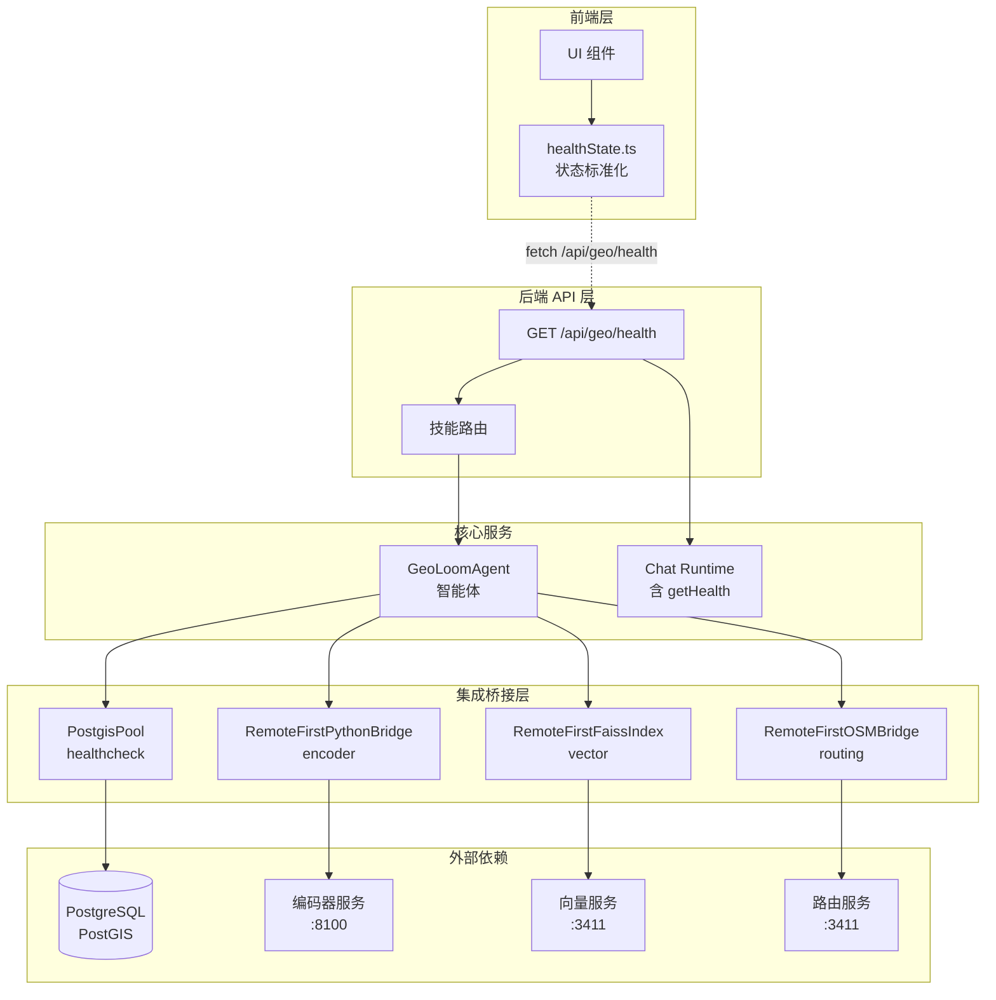
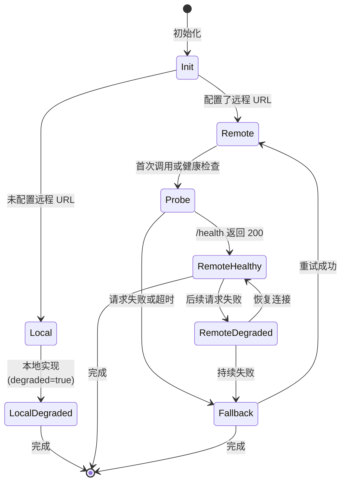
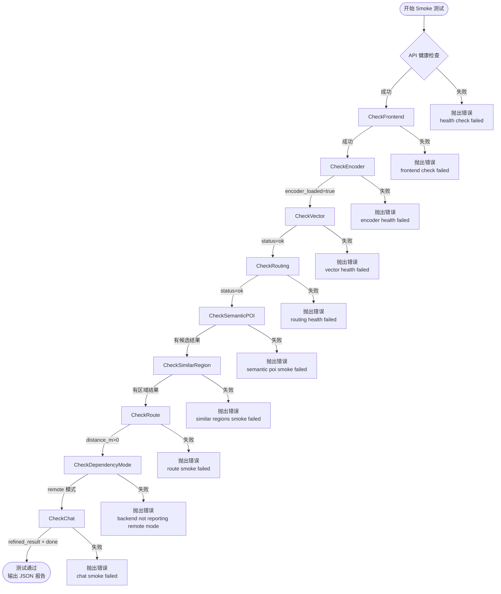

本文档阐述 GeoLoom Agent 项目中依赖服务健康检查的完整架构设计，包括后端健康端点、前端状态标准化、Smoke 测试套件以及各集成桥接模块的探测机制。

## 架构概览

GeoLoom Agent 采用分层健康检查架构，将依赖服务分为**核心基础设施**（PostgreSQL/PostGIS）和**空间计算服务**（编码器、向量检索、路径规划）两大类。系统通过统一的 `DependencyStatus` 类型描述每个依赖的健康状态，并支持三种运行模式：`remote`（完全可用）、`fallback`（回退本地）、`local`（仅本地）。



Sources: [backend/src/routes/geo.ts](backend/src/routes/geo.ts#L1-L63), [backend/src/app.ts](backend/src/app.ts#L1-L53), [src/lib/healthState.ts](src/lib/healthState.ts#L1-L65)

## 健康状态类型系统

后端使用 `dependencyStatus.ts` 定义统一的状态类型，确保前端和后端对健康检查数据结构有一致理解。

| 类型 | 字段 | 说明 |
|------|------|------|
| `DependencyMode` | `'remote' \| 'fallback' \| 'local' \| 'unconfigured'` | 服务运行模式 |
| `SemanticEvidenceLevel` | `'available' \| 'degraded' \| 'unavailable'` | 语义证据可用性级别 |
| `DependencyStatus` | `name, ready, mode, degraded, reason?, target?, details?` | 单个依赖的完整状态 |
| `SemanticEvidenceStatus` | `dependency, level, weakEvidence, mode, reason?, target?` | 语义证据视角的状态 |

`toSemanticEvidenceStatus()` 函数将 `DependencyStatus` 转换为语义证据级别：当 `ready=true` 且 `mode='remote'` 且 `degraded=false` 时，级别为 `available`；否则为 `degraded` 或 `unavailable`。

Sources: [backend/src/integration/dependencyStatus.ts](backend/src/integration/dependencyStatus.ts#L1-L93)

## 后端健康检查端点

`GET /api/geo/health` 端点聚合多个数据源的状态信息，统一返回给前端。

```typescript
// backend/src/routes/geo.ts (简化)
app.get('/health', async () => {
  const databaseHealthy = await deps.checkDatabaseHealth()
    .then(() => true)
    .catch(() => false)
  const chatHealth = await Promise.resolve(deps.chat?.getHealth?.() || {})
  
  const databaseDependency = {
    name: 'database',
    ready: databaseHealthy,
    mode: 'remote' as const,
    degraded: !databaseHealthy,
    reason: databaseHealthy ? null : 'connection_failed',
  }
  
  return {
    status: 'ok',
    version: deps.version,
    provider_ready: chatHealth.provider_ready || false,
    llm: chatHealth.llm || { ready: false },
    memory: chatHealth.memory || { ready: false },
    dependencies: {
      ...(chatHealth.dependencies || {}),
      database: databaseDependency,
    },
    degraded_dependencies: [...degradedDependencies],
    skills_registered: deps.registry.size(),
    skills: deps.registry.list().map(skill => ({
      name: skill.name,
      actions: skill.actions.map(a => a.name),
    })),
  }
})
```

**响应结构关键字段**：

| 字段 | 类型 | 来源 |
|------|------|------|
| `status` | string | 固定值 `'ok'` |
| `version` | string | 服务版本号 |
| `provider_ready` | boolean | LLM Provider 可用性 |
| `llm` | object | Chat Runtime 健康信息 |
| `memory` | object | 记忆服务健康信息 |
| `dependencies` | object | 技能依赖状态映射 |
| `degraded_dependencies` | string[] | 降级依赖名称列表 |
| `skills_registered` | number | 已注册技能数量 |
| `skills` | array | 技能详情列表 |

Sources: [backend/src/routes/geo.ts](backend/src/routes/geo.ts#L16-L62), [backend/src/app.ts](backend/src/app.ts#L13-L17)

## 前端状态标准化

前端 `healthState.ts` 模块负责将后端 API 响应标准化为 TypeScript 接口，确保 UI 层与后端解耦。

```typescript
// src/lib/healthState.ts
export interface HealthState {
  status: string
  version: string
  providerReady: boolean        // snake_case -> camelCase 转换
  llm: PlainObject
  memory: PlainObject
  degradedDependencies: string[]
  dependencies: HealthDependency[]
  skillsRegistered: number
  skills: unknown[]
  metrics: PlainObject | null
}

export function normalizeHealthState(payload: unknown = {}): HealthState {
  const safePayload = isPlainObject(payload) ? payload : {}
  const dependencyMap = isPlainObject(safePayload.dependencies) 
    ? safePayload.dependencies 
    : {}
  
  return {
    status: String(safePayload.status || 'unknown'),
    version: String(safePayload.version || 'unknown'),
    providerReady: safePayload.provider_ready === true,
    // ... 其他字段映射
    dependencies: Object.entries(dependencyMap).map(normalizeDependencyEntry),
  }
}
```

**规范化转换规则**：

| 后端字段 | 前端字段 | 转换逻辑 |
|----------|----------|----------|
| `provider_ready` | `providerReady` | 布尔值直接映射 |
| `degraded_dependencies` | `degradedDependencies` | 数组映射 + 过滤空值 |
| `skills_registered` | `skillsRegistered` | 数值转换 |
| `dependencies.{key}` | `dependencies[]` | 对象→数组转换 |

Sources: [src/lib/healthState.ts](src/lib/healthState.ts#L1-L65), [src/lib/healthState.spec.js](src/lib/healthState.spec.js#L1-L48)

## 集成桥接层健康探测

### 远程优先桥接模式

所有外部服务采用 **Remote-First** 模式：优先尝试远程服务，失败时自动回退到本地实现。这种设计确保服务在依赖不可用时仍能降级运行。



Sources: [backend/src/integration/pythonBridge.ts](backend/src/integration/pythonBridge.ts#L70-L189), [backend/src/integration/faissIndex.ts](backend/src/integration/faissIndex.ts#L119-L200)

### 编码器服务桥接

```typescript
// RemoteFirstPythonBridge 健康状态生命周期
private lastStatus = this.baseUrl
  ? { name: 'spatial_encoder', ready: false, mode: 'remote', 
      degraded: true, reason: 'awaiting_probe', target: this.baseUrl }
  : { name: 'spatial_encoder', ready: true, mode: 'local', 
      degraded: true, reason: 'remote_unconfigured' }

async getStatus(): Promise<DependencyStatus> {
  if (!this.baseUrl) return this.lastStatus  // 本地模式直接返回
  
  try {
    await requestJson({ baseUrl: this.baseUrl, path: this.healthPath })
    this.lastStatus = { name: 'spatial_encoder', ready: true, 
      mode: 'remote', degraded: false, target: this.baseUrl }
  } catch (error) {
    this.lastStatus = { name: 'spatial_encoder', ready: true, 
      mode: 'fallback', degraded: true, 
      reason: 'remote_request_failed', target: this.baseUrl }
  }
  return this.lastStatus
}
```

**配置参数**（环境变量）：

| 环境变量 | 默认值 | 说明 |
|----------|--------|------|
| `SPATIAL_ENCODER_BASE_URL` | `http://127.0.0.1:8100` | 编码器服务地址 |
| `SPATIAL_ENCODER_TIMEOUT_MS` | `3000` | 请求超时（毫秒） |

Sources: [backend/src/integration/pythonBridge.ts](backend/src/integration/pythonBridge.ts#L61-L189)

### 向量检索服务桥接

```typescript
// RemoteFirstFaissIndex 健康状态
interface RemoteFirstFaissIndexOptions {
  baseUrl?: string          // 默认: process.env.SPATIAL_VECTOR_BASE_URL
  semanticPoiPath?: string   // 默认: /search/semantic-pois
  similarRegionPath?: string // 默认: /search/similar-regions
  healthPath?: string        // 默认: /health
  timeoutMs?: number         // 默认: 3000
  fallback?: FaissIndex      // 本地回退实现
}
```

**依赖服务健康端点**：

| 端点 | 预期响应 | 用途 |
|------|----------|------|
| `GET /health` | `{ status: 'ok', service: string }` | 服务可用性检查 |
| `GET /health/vector` | `{ status: 'ok' }` | 向量服务检查 |
| `GET /health/routing` | `{ status: 'ok' }` | 路由服务检查 |

Sources: [backend/src/integration/faissIndex.ts](backend/src/integration/faissIndex.ts#L109-L189), [scripts/smoke-stack.mjs](scripts/smoke-stack.mjs#L68-L81)

### 数据库连接池健康检查

```typescript
// backend/src/integration/postgisPool.ts
export class PostgisPool {
  async healthcheck() {
    await this.pool.query('SELECT 1')  // 轻量级探活查询
    return true
  }
}
```

**配置参数**（环境变量）：

| 环境变量 | 默认值 | 说明 |
|----------|--------|------|
| `POSTGRES_HOST` | `127.0.0.1` | 数据库主机 |
| `POSTGRES_PORT` | `15432` | 数据库端口 |
| `POSTGRES_DATABASE` | `geoloom` | 数据库名 |
| `POSTGRES_POOL_MAX` | `10` | 连接池最大连接数 |

Sources: [backend/src/integration/postgisPool.ts](backend/src/integration/postgisPool.ts#L1-L73)

## Smoke 测试套件

`smoke-stack.mjs` 脚本执行端到端健康检查，验证所有依赖服务的可用性和功能正确性。



**测试检查点**：

```javascript
// scripts/smoke-stack.mjs
async function main() {
  // 1. API 健康检查
  const health = await fetchJson(`${apiBase}/api/geo/health`)
  
  // 2. 前端可用性
  const frontend = await fetch(frontendUrl)
  
  // 3. 编码器服务
  const encoderHealth = await fetchJson(`${encoderBase}/health`)
  
  // 4. 向量服务
  const vectorHealth = await fetchJson(`${dependencyBase}/health/vector`)
  
  // 5. 路由服务
  const routingHealth = await fetchJson(`${dependencyBase}/health/routing`)
  
  // 6. 语义 POI 搜索
  const semanticPois = await fetchJson(`${dependencyBase}/search/semantic-pois`, {
    method: 'POST',
    body: JSON.stringify({ text: '武汉大学附近适合开什么咖啡店？', top_k: 3 })
  })
  
  // 7. 相似片区检索
  const similarRegions = await fetchJson(`${dependencyBase}/search/similar-regions`, {
    method: 'POST',
    body: JSON.stringify({ text: '和武汉大学最像的片区有哪些？', top_k: 3 })
  })
  
  // 8. 路径距离计算
  const route = await fetchJson(`${dependencyBase}/route`, {
    method: 'POST',
    body: JSON.stringify({ origin: [114.364339, 30.536334], 
      destination: [114.365339, 30.537334], mode: 'walking' })
  })
  
  // 9. 依赖模式验证
  if (dependencies.spatial_encoder?.mode !== 'remote' || 
      dependencies.spatial_vector?.mode !== 'remote' || 
      dependencies.route_distance?.mode !== 'remote') {
    throw new Error('backend health does not report remote dependency mode')
  }
  
  // 10. 完整对话流程
  const chatResponse = await fetch(`${apiBase}/api/geo/chat`, { ... })
}
```

**运行方式**：

```bash
# 使用默认配置
node scripts/smoke-stack.mjs

# 自定义服务地址
node scripts/smoke-stack.mjs \
  --api-base http://127.0.0.1:3210 \
  --dependency-base http://127.0.0.1:3411 \
  --encoder-base http://127.0.0.1:8100 \
  --frontend-url http://127.0.0.1:4173
```

**输出报告结构**：

```json
{
  "frontend": "http://127.0.0.1:4173",
  "apiBase": "http://127.0.0.1:3210",
  "dependencyBase": "http://127.0.0.1:3411",
  "encoderBase": "http://127.0.0.1:8100",
  "providerReady": true,
  "degradedDependencies": [],
  "remoteModes": {
    "spatialEncoder": "remote",
    "spatialVector": "remote",
    "routeDistance": "remote"
  },
  "encoderLoaded": true,
  "semanticPoiTop": "校园咖啡实验室",
  "semanticPoiCount": 3,
  "similarRegionTop": "街道口-高校活力片区",
  "similarRegionCount": 3,
  "routeDistanceM": 1280,
  "chatAnswer": "武汉大学附近有多个适合开设咖啡店的位置..."
}
```

Sources: [scripts/smoke-stack.mjs](scripts/smoke-stack.mjs#L1-L189)

## 依赖适配器

### 向量与路由适配器

`v4-dependency-adapter.mjs` 提供本地模拟服务，用于开发和测试环境。

```javascript
// scripts/v4-dependency-adapter.mjs
const dependencyServer = http.createServer(async (request, response) => {
  const { method = 'GET', url = '/' } = request
  
  if (method === 'GET' && url === '/health') {
    return sendJson(response, { status: 'ok', service: 'dependency-adapter' })
  }
  
  if (method === 'POST' && url === '/search/semantic-pois') {
    const body = await readJsonBody(request)
    return sendJson(response, { candidates: createVectorCandidates(body.text) })
  }
  
  if (method === 'POST' && url === '/search/similar-regions') {
    return sendJson(response, {
      regions: [{ id: 'region_remote_001', name: '街道口-高校活力片区', ... }]
    })
  }
  
  if (method === 'POST' && url === '/route') {
    return sendJson(response, { distance_m: 1280, duration_min: 17, degraded: false })
  }
})

const encoderServer = http.createServer(async (request, response) => {
  if (method === 'GET' && url === '/health') {
    return sendJson(response, { status: 'ok', service: 'encoder-adapter' })
  }
  // ...
})

dependencyServer.listen(3411, '127.0.0.1')
encoderServer.listen(8100, '127.0.0.1')
```

**监听端口**：

| 适配器 | 端口 | 用途 |
|--------|------|------|
| `dependencyServer` | `3411` | 向量检索和路由服务 |
| `encoderServer` | `8100` | 空间编码服务 |

Sources: [scripts/v4-dependency-adapter.mjs](scripts/v4-dependency-adapter.mjs#L1-L130)

## 服务端初始化

`server.ts` 整合所有组件并注册健康检查依赖。

```typescript
// backend/src/server.ts
const spatialEncoderBridge = new RemoteFirstPythonBridge()
const spatialVectorIndex = new RemoteFirstFaissIndex()
const routeBridge = new RemoteFirstOSMBridge()

registry.register(createSpatialEncoderSkill({ bridge: spatialEncoderBridge }))
registry.register(createSpatialVectorSkill({ index: spatialVectorIndex }))
registry.register(createRouteDistanceSkill({ bridge: routeBridge }))

const app = createApp({
  registry,
  version,
  checkDatabaseHealth: async () => pool.healthcheck(),  // 数据库健康检查
  chat,
})
```

**集成桥接与技能注册关系**：

| 技能 | 桥接实现 | 依赖服务 |
|------|----------|----------|
| `postgis` | 直接使用 `PostgisPool` | PostgreSQL/PostGIS |
| `spatial_encoder` | `RemoteFirstPythonBridge` | 编码器服务 |
| `spatial_vector` | `RemoteFirstFaissIndex` | 向量服务 |
| `route_distance` | `RemoteFirstOSMBridge` | 路由服务 |

Sources: [backend/src/server.ts](backend/src/server.ts#L1-L150)

## 后续步骤

- 了解完整的环境配置方案：**[环境配置管理](23-huan-jing-pei-zhi-guan-li)**
- 掌握 Smoke 测试的详细实现：**[Smoke 测试脚本](24-smoke-ce-shi-jiao-ben)**
- 学习一键启动编排机制：**[一键启动编排](25-jian-qi-dong-bian-pai)**