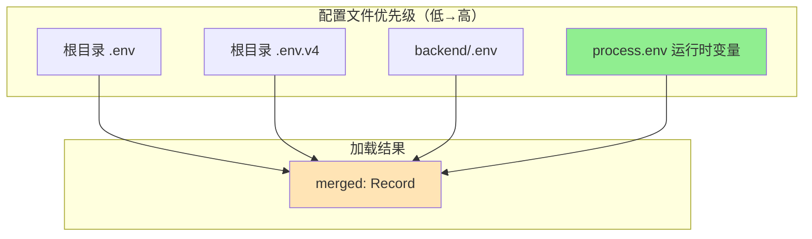
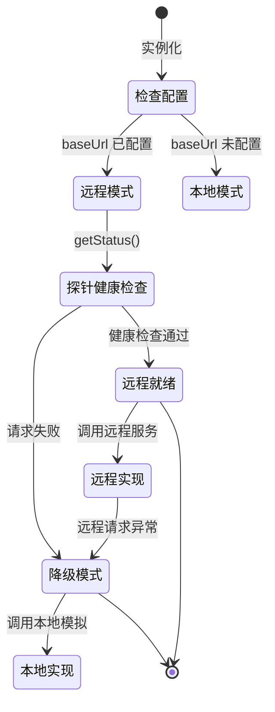

GeoLoom Agent 采用分层环境配置架构，覆盖前端开发环境、后端运行时、外部服务依赖三大维度。该系统支持多版本并行（V3/V4），通过 Remote-First 模式实现服务降级的优雅处理，确保在外部依赖不可用时系统仍能提供基础功能。

## 配置加载架构

### 后端环境文件加载机制

后端采用 `loadRuntimeEnv.ts` 中的 `loadRuntimeEnv()` 函数实现环境变量加载，采用级联覆盖策略：合并多个 `.env` 文件后，再由 `process.env` 环境变量覆盖。该设计允许在不同部署场景下灵活覆盖配置。



Sources: [loadRuntimeEnv.ts](backend/src/config/loadRuntimeEnv.ts#L1-L67)

### Vite 环境模式与代理配置

前端通过 Vite 的 `loadEnv()` 函数加载环境变量，支持按模式（mode）隔离配置。默认模式为 `v4`，开发服务器自动代理 API 请求到后端服务。

Sources: [vite.config.js](vite.config.js#L1-L103)

## 核心环境变量参考

### 后端服务器配置

| 变量名 | 默认值 | 说明 |
|--------|--------|------|
| `PORT` | `3210` | 后端服务监听端口 |
| `HOST` | `127.0.0.1` | 后端服务绑定地址 |

Sources: [server.ts](backend/src/server.ts#L13-L14)

### 外部服务连接配置

| 服务类型 | 变量名 | 默认值 | 用途 |
|----------|--------|--------|------|
| 空间编码器 | `SPATIAL_ENCODER_BASE_URL` | `http://127.0.0.1:8100` | 文本向量化服务 |
| 空间向量索引 | `SPATIAL_VECTOR_BASE_URL` | `http://127.0.0.1:3411` | 语义 POI/片区检索 |
| 路径计算 | `ROUTING_BASE_URL` | `http://127.0.0.1:3411` | 路径距离估算 |
| 公共路由 | `OSRM_BASE_URL` | `https://router.project-osrm.org` | 开源路由引擎 |

Sources: [run-backend-v4.mjs](scripts/run-backend-v4.mjs#L1-L32)

### Redis 缓存配置

| 变量名 | 默认值 | 说明 |
|--------|--------|------|
| `REDIS_URL` | 空（使用内存存储） | Redis 连接 URL |
| `SHORT_TERM_MEMORY_PREFIX` | `v4:short-term:` | Redis Key 前缀 |
| `REDIS_CONNECT_TIMEOUT_MS` | `2000` | 连接超时（毫秒） |
| `SHORT_TERM_MEMORY_TTL_MS` | `86400000`（24小时） | 记忆 TTL |

当 `REDIS_URL` 未设置时，系统自动降级为内存存储，保证无 Redis 环境下的基本功能。

Sources: [RedisShortTermStore.ts](backend/src/memory/RedisShortTermStore.ts#L212-L220)

### SQL 沙箱安全配置

| 变量名 | 默认值 | 说明 |
|--------|--------|------|
| `SQL_MAX_ROWS` | `200` | 单次查询返回最大行数 |
| `SQL_STATEMENT_TIMEOUT_MS` | `3000` | 查询超时（毫秒） |
| `POSTGRES_QUERY_TIMEOUT_MS` | `5000` | 连接池查询超时 |

Sources: [server.ts](backend/src/server.ts#L44-L48)

## Remote-First 服务降级模式

### 架构设计原则

所有外部服务桥接类（Bridge）均采用 **Remote-First** 模式：优先尝试连接远程服务，失败时自动降级到本地模拟实现。这种设计确保系统在依赖服务不可用时仍能提供基础功能，同时通过 `degraded` 标志通知客户端当前运行状态。



### 各服务降级行为

| 服务 | 本地实现 | 降级触发条件 | 降级影响 |
|------|----------|--------------|----------|
| 空间编码器 | 基于关键词的向量模拟（14维） | `SPATIAL_ENCODER_BASE_URL` 未配置或请求失败 | 返回简化的布尔向量 |
| 空间向量索引 | 内置 POI/片区目录匹配 | `SPATIAL_VECTOR_BASE_URL` 未配置或请求失败 | 使用预定义标签重叠计算 |
| 路径计算 | Haversine 公式直线距离 | `ROUTING_BASE_URL` 未配置或请求失败 | 返回直线距离的 1.25 倍估算 |

Sources: [pythonBridge.ts](backend/src/integration/pythonBridge.ts#L44-L61), [faissIndex.ts](backend/src/integration/faissIndex.ts#L60-L95), [osmBridge.ts](backend/src/integration/osmBridge.ts#L24-L46)

## 前端环境变量配置

### 开发与生产 API 基础路径

前端 `config.ts` 提供 `resolveApiBaseUrls()` 函数，根据运行时环境智能选择 API 端点：

```typescript
const isV4Mode = backendVersion === 'v4'
const devAiBaseDefault = isV4Mode ? 'http://127.0.0.1:3210' : 'http://127.0.0.1:3200'
```

| 变量名 | 开发默认值 | 生产默认值 | 说明 |
|--------|------------|------------|------|
| `VITE_DEV_API_BASE` | - | - | 通用开发 API 地址 |
| `VITE_AI_DEV_API_BASE` | `http://127.0.0.1:3210` | `/proxy-api` | AI 服务地址 |
| `VITE_SPATIAL_DEV_API_BASE` | 同上 | `/proxy-api` | 空间服务地址 |
| `VITE_DIRECT_DEV_API` | `false` | - | 是否绕过同源代理 |
| `VITE_BACKEND_VERSION` | - | - | 指定后端版本模式 |

Sources: [config.ts](src/config.ts#L1-L58)

### 同源代理优化

当前端开发服务与后端位于同一主机时，系统优先使用 Vite 代理而非直接跨域请求，以避免浏览器 CORS 限制：

```typescript
const shouldPreferSameOriginProxy = isDev
  && !directDevApi
  && isLocalDevBase(rawAiBase)
  && isLocalDevBase(rawSpatialBase)
  && rawAiBase === rawSpatialBase

return {
  aiBase: shouldPreferSameOriginProxy ? '' : rawAiBase,
  spatialBase: shouldPreferSameOriginProxy ? '' : rawSpatialBase
}
```

当 `aiBase` 和 `spatialBase` 为空字符串时，API 请求将使用相对路径，经由 Vite 开发服务器的代理转发。

Sources: [config.ts](src/config.ts#L36-L45)

## 快速启动配置清单

### 开发环境启动

根目录 `start.bat` 定义了标准开发环境的默认端口映射：

```batch
echo [GeoLoom Agent] frontend: http://127.0.0.1:3000
echo [GeoLoom Agent] deps    : http://127.0.0.1:3411
echo [GeoLoom Agent] encoder : http://127.0.0.1:8100
echo [GeoLoom Agent] backend : http://127.0.0.1:3210
```

Sources: [start.bat](start.bat#L1-L8)

### 环境变量文件模板

项目推荐创建以下环境配置文件（需手动创建，`gitignore` 已排除）：

| 文件路径 | 用途 |
|----------|------|
| `.env` | 全局通用配置 |
| `.env.v4` | V4 版本特定配置 |
| `backend/.env` | 后端服务配置 |

### 启动脚本环境注入

`run-backend-v4.mjs` 在启动后端进程前注入默认的服务端点配置：

```javascript
env: {
  ...process.env,
  SPATIAL_ENCODER_BASE_URL: process.env.SPATIAL_ENCODER_BASE_URL || 'http://127.0.0.1:8100',
  SPATIAL_VECTOR_BASE_URL: process.env.SPATIAL_VECTOR_BASE_URL || 'http://127.0.0.1:3411',
  ROUTING_BASE_URL: process.env.ROUTING_BASE_URL || 'http://127.0.0.1:3411',
  // ...
}
```

Sources: [run-backend-v4.mjs](scripts/run-backend-v4.mjs#L10-L24)

## Smoke 测试配置

`smoke-stack.mjs` 支持通过命令行参数和环境变量覆盖默认配置：

```javascript
const apiBase = String(
  readCliArg('--api-base')
    || process.env.GEOLOOM_API_BASE
    || process.env.VITE_GEOLOOM_API_BASE
    || 'http://127.0.0.1:3210',
).replace(/\/$/, '')
```

| 覆盖方式 | 优先级 | 示例 |
|----------|--------|------|
| CLI 参数 | 最高 | `--api-base http://localhost:3210` |
| 环境变量 | 中 | `GEOLOOM_API_BASE=http://localhost:3210` |
| 硬编码默认值 | 最低 | `http://127.0.0.1:3210` |

Sources: [smoke-stack.mjs](scripts/smoke-stack.mjs#L1-L30)

## 下一步

- 验证配置正确性：[依赖服务健康检查](22-yi-lai-fu-wu-jian-kang-jian-cha)
- 运行完整测试：[Smoke 测试脚本](24-smoke-ce-shi-jiao-ben)
- 了解一键启动编排：[一键启动编排](25-jian-qi-dong-bian-pai)