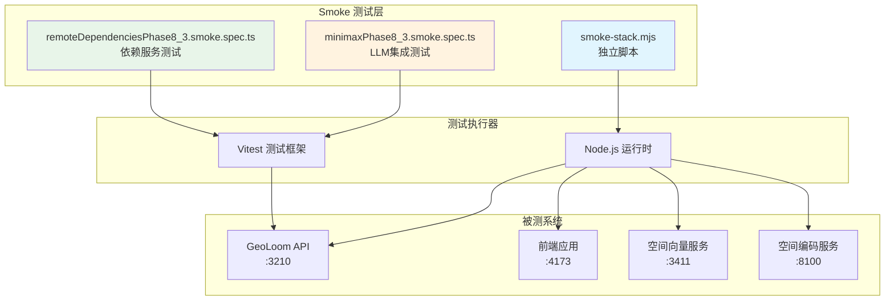
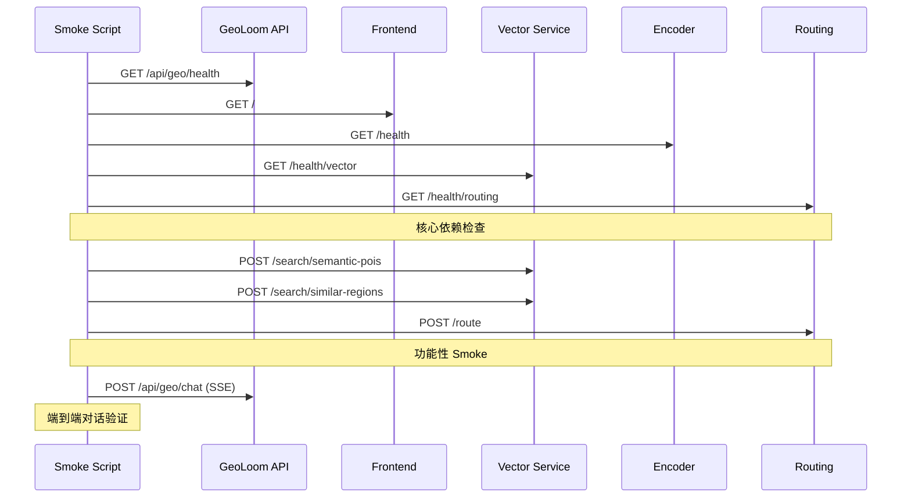

GeoLoom Agent 采用分层测试策略，其中 Smoke 测试套件作为系统健康状态的最外层验证机制。通过快速执行核心端到端场景，确保整个技术栈在部署前后处于可工作状态。

## 测试架构概览

Smoke 测试体系由两个互补层组成：独立可执行的 `smoke-stack.mjs` 脚本和 Vitest 框架下的结构化测试规范。



## 独立 Smoke 脚本

`scripts/smoke-stack.mjs` 是一个纯 Node.js 编写的端到端验证脚本，无需任何测试框架即可直接运行。

### 配置参数解析

脚本支持通过命令行参数或环境变量配置各个服务的 URL 地址。参数优先级为：命令行参数 > 环境变量 > 默认值。

| 参数 | 环境变量 | 默认值 | 说明 |
|------|----------|--------|------|
| `--api-base` | `GEOLOOM_API_BASE` / `VITE_GEOLOOM_API_BASE` | `http://127.0.0.1:3210` | GeoLoom 后端服务地址 |
| `--frontend-url` | `GEOLOOM_FRONTEND_URL` | `http://127.0.0.1:4173` | 前端应用地址 |
| `--dependency-base` | `GEOLOOM_DEPENDENCY_BASE` / `SPATIAL_VECTOR_BASE_URL` | `http://127.0.0.1:3411` | 空间向量与路由服务地址 |
| `--encoder-base` | `GEOLOOM_ENCODER_BASE` / `SPATIAL_ENCODER_BASE_URL` | `http://127.0.0.1:8100` | 空间编码服务地址 |

Sources: [smoke-stack.mjs](scripts/smoke-stack.mjs#L1-L32)

### 健康检查链路

脚本按顺序执行六项健康检查，任何一项失败都会导致整体退出：



#### 基础健康验证

第一阶段验证各服务可达性，包括 HTTP 响应状态码和业务层健康标志：

```javascript
const health = await fetchJson(`${apiBase}/api/geo/health`)
if (!health.response.ok) {
  throw new Error(`health check failed: ${health.response.status}`)
}
```

对于编码器服务，需额外验证 `encoder_loaded` 标志为 `true`；向量服务需 `status === 'ok'`；后端健康响应中的依赖模式必须全部报告为 `remote`。

Sources: [smoke-stack.mjs](scripts/smoke-stack.mjs#L58-L81)

#### 功能性 Smoke 测试

第二阶段通过实际业务调用验证服务功能完整性。语义 POI 搜索使用"武汉大学附近适合开什么咖啡店？"作为测试查询，验证返回的 `candidates` 数组非空；相似片区搜索使用"和武汉大学最像的片区有哪些？"，验证返回的 `regions` 数组非空；路径规划使用实际坐标 `[114.364339, 30.536334]` 到 `[114.365339, 30.537334]`，验证 `distance_m > 0`。

Sources: [smoke-stack.mjs](scripts/smoke-stack.mjs#L83-L124)

#### 端到端对话验证

最后阶段通过 SSE 流式接口发送完整对话请求，验证从工具调用到最终回答的完整链路：

```javascript
const chatResponse = await fetch(`${apiBase}/api/geo/chat`, {
  method: 'POST',
  headers: { 'Content-Type': 'application/json' },
  body: JSON.stringify({
    messages: [{ role: 'user', content: '武汉大学附近适合开什么咖啡店？' }],
    options: { requestId: 'smoke_stack_001' },
  }),
})

const events = parseSSE(await chatResponse.text())
const refined = events.find((item) => item.event === 'refined_result')?.data
const done = events.at(-1)

if (!refined || done?.event !== 'done') {
  throw new Error('chat smoke did not finish with refined_result + done')
}
```

成功执行后，脚本输出包含所有检查结果的 JSON 报告，包括各服务状态、依赖模式、编码器加载状态以及对话回答摘要。

Sources: [smoke-stack.mjs](scripts/smoke-stack.mjs#L131-L182)

## Vitest Smoke 测试套件

除独立脚本外，项目还维护两套基于 Vitest 框架的结构化 Smoke 测试，位于 `backend/tests/smoke/` 目录。

### MiniMax LLM 集成测试

`minimaxPhase8_3.smoke.spec.ts` 验证使用真实 MiniMax 大语言模型进行空间智能体编排的场景。该测试仅在 MiniMax 环境配置完整时执行：

```typescript
const minimaxReady = Boolean(
  String(process.env.LLM_API_KEY || '').trim()
  && String(process.env.LLM_MODEL || '').trim()
  && /minimax/i.test(String(process.env.LLM_BASE_URL || '')),
)

it.skipIf(!minimaxReady)(`uses MiniMax as the real orchestration provider`, async () => {
  // 测试实现...
}, perQueryTimeoutMs)
```

Sources: [minimaxPhase8_3.smoke.spec.ts](backend/tests/smoke/minimaxPhase8_3.smoke.spec.ts#L9-L38)

#### 测试语料库

测试用例通过 `minimaxPhase8_3.corpus.ts` 中定义的语料库驱动，覆盖四类核心查询类型：

| 查询类型 | 证据类型 | 测试用例数 | 示例查询 |
|----------|----------|------------|----------|
| `nearby_poi` | `poi_list` | 3 | 武汉大学附近有哪些咖啡店？ |
| `nearest_station` | `transport` | 3 | 湖北大学最近的地铁站，站口也列出来 |
| `compare_places` | `comparison` | 2 | 比较武汉大学和湖北大学附近的餐饮活跃度 |
| `similar_regions` | `semantic_candidate` | 2 | 和武汉大学周边气质相似的片区有哪些？ |

Sources: [minimaxPhase8_3.corpus.ts](backend/tests/smoke/minimaxPhase8_3.corpus.ts#L10-L89)

#### 断言策略

每个测试用例执行以下断言验证：

- **LLM 提供商验证**：确认健康接口返回的 `llm.provider` 包含 `minimax`
- **请求类型验证**：`refined.results.stats.query_type` 匹配预期类型
- **证据类型验证**：`refined.results.evidence_view.type` 匹配预期类型
- **证据内容验证**：根据证据类型检查 `items`、`pairs` 或 `regions` 数组非空
- **锚点关键词验证**：证据锚点中包含指定地点名称
- **输出关键词验证**：回答或证据视图中包含预期业务关键词
- **事件流验证**：SSE 事件流以 `done` 事件结尾

Sources: [minimaxPhase8_3.smoke.spec.ts](backend/tests/smoke/minimaxPhase8_3.smoke.spec.ts#L62-L84)

### 远程依赖服务测试

`remoteDependenciesPhase8_3.smoke.spec.ts` 验证 Redis、FAISS、OSM 路由和 Python 编码器等远程依赖服务的可用性。

#### 服务自举机制

测试启动时执行服务自举逻辑，优先使用已运行的服务，若检测到依赖适配器未启动且运行于默认端口，则自动启动 `v4-dependency-adapter.mjs`：

```typescript
async function bootstrapRemoteDependencies() {
  let adapterHealth = await waitForHealth(adapterBaseUrl, { timeoutMs: 1500 })
  
  if (!adapterHealth && adapterBaseUrl === DEFAULT_DEPENDENCY_BASE_URL) {
    adapterProcess = startDependencyAdapter(runtimeEnv.rootDir)
    adapterHealth = await waitForHealth(adapterBaseUrl, { timeoutMs: 30_000 })
  }
  // Redis 自举逻辑...
}
```

Sources: [remoteDependenciesPhase8_3.smoke.spec.ts](backend/tests/smoke/remoteDependenciesPhase8_3.smoke.spec.ts#L98-L120)

#### 依赖服务验证矩阵

| 测试用例 | 验证服务 | 健康标志 | 功能验证 |
|----------|----------|----------|----------|
| Redis 短时记忆 | Redis | `ready: true` | 追加会话并验证快照 |
| 空间向量检索 | FAISS | `mode: 'remote'` | 语义 POI 搜索返回结果 |
| 路径距离计算 | OSRM | `degraded: false` | 步行路线距离 > 0 |
| 空间编码服务 | Python | `dimension > 0` | 文本编码向量维度验证 |

Sources: [remoteDependenciesPhase8_3.smoke.spec.ts](backend/tests/smoke/remoteDependenciesPhase8_3.smoke.spec.ts#L181-L242)

## 测试执行指南

### 独立脚本执行

```bash
# 使用默认配置执行
node scripts/smoke-stack.mjs

# 指定服务地址
node scripts/smoke-stack.mjs \
  --api-base http://192.168.1.100:3210 \
  --encoder-base http://192.168.1.101:8100

# 环境变量方式
export GEOLOOM_API_BASE=http://192.168.1.100:3210
node scripts/smoke-stack.mjs
```

### Vitest 测试执行

```bash
# 执行 MiniMax 集成测试
cd backend && npm run test:smoke:minimax

# 执行远程依赖测试
npm run test:smoke:dependencies

# 执行全部 Phase 8.3 Smoke 测试
npm run test:smoke:phase8-3

# 配置超时时间（默认 45 秒）
export MINIMAX_SMOKE_TIMEOUT_MS=60000
npm run test:smoke:minimax
```

Sources: [backend/package.json](backend/package.json#L14-L17)

## 测试适配器

`scripts/v4-dependency-adapter.mjs` 作为本地开发环境的模拟依赖服务，提供确定性响应以支持离线或无外部服务环境下的 Smoke 测试。

### 模拟端点

| 端点 | 方法 | 响应 |
|------|------|------|
| `/health` | GET | `{ status: 'ok', service: 'dependency-adapter' }` |
| `/search/semantic-pois` | POST | 含咖啡关键词时返回"远端校园咖啡实验室" |
| `/search/similar-regions` | POST | 返回"街道口-高校活力片区" |
| `/route` | POST | 返回固定距离 1280m，时长 17 分钟 |

Sources: [v4-dependency-adapter.mjs](scripts/v4-dependency-adapter.mjs#L49-L91)

## 继承关系

Smoke 测试脚本验证整个 [依赖服务健康检查](22-yi-lai-fu-wu-jian-kang-jian-cha) 框架的实际运行状态，同时也依赖于 [一键启动编排](25-jian-qi-dong-bian-pai) 中各服务的正确启动。执行 Smoke 测试前，应确保已通过编排脚本启动了全部依赖服务。