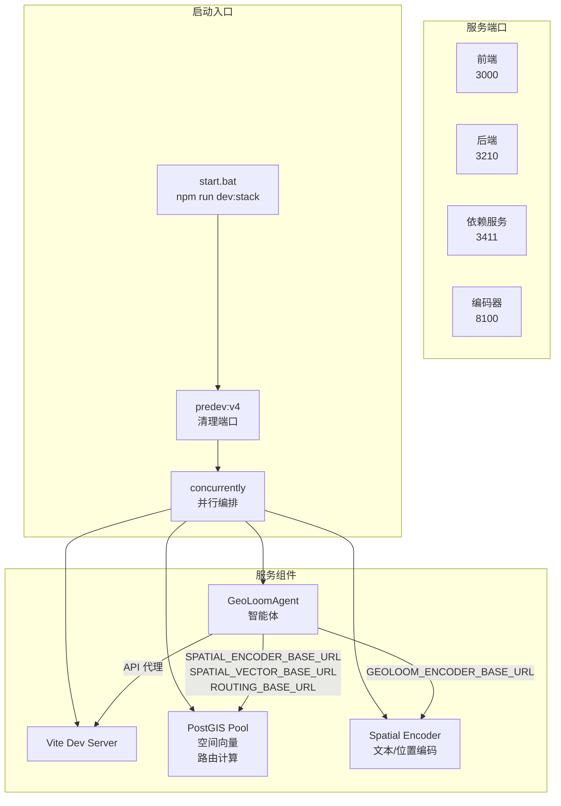
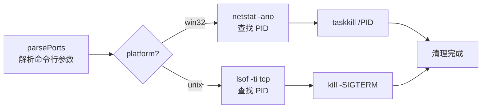
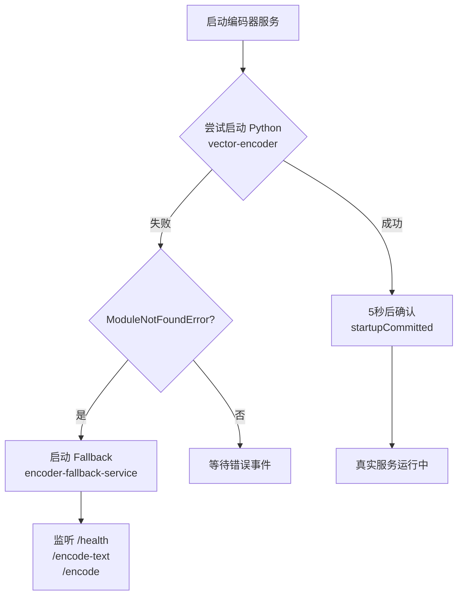
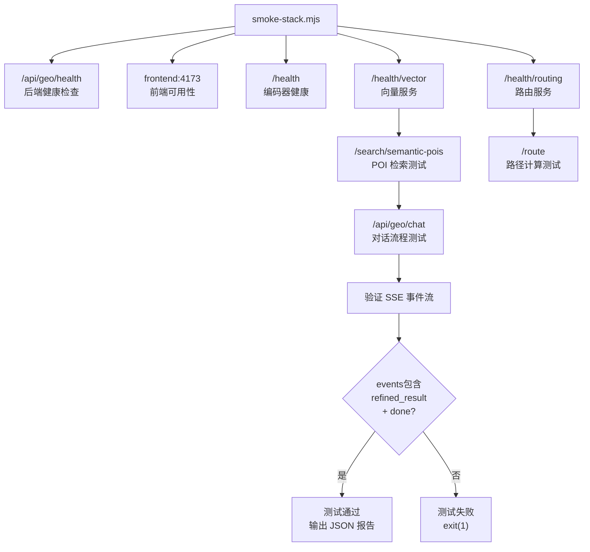

GeoLoom Agent 采用基于 [concurrently](https://www.npmjs.com/package/concurrently) 的服务编排机制，通过单一命令即可启动前端、后端、依赖服务和编码器四个核心组件，实现本地开发环境的零配置启动体验。

## 架构概览

GeoLoom Agent 的启动编排架构由四个并行运行的服务组成，它们通过预定义的环境变量建立相互连接：



| 服务组件 | 端口 | 技术栈 | 职责描述 |
|---------|------|--------|---------|
| 前端 | 3000 | Vite + Vue 3 | 地图容器与 AI 交互界面 |
| 后端 | 3210 | Fastify + TypeScript | GeoLoomAgent 智能体核心 |
| 依赖服务 | 3411 | tsx + PostGIS | 空间向量检索与路径计算 |
| 编码器 | 8100 | Python/Node.js | 文本语义与位置编码 |

Sources: [package.json](package.json#L10-L18)

## 启动入口与执行流程

### 主入口点

项目根目录的 `start.bat` 是 Windows 用户的首选启动脚本，它完成端口提示输出后调用 npm 脚本：

```batch
@echo off
cd /d %~dp0
echo [GeoLoom Agent] frontend: http://127.0.0.1:3000
echo [GeoLoom Agent] deps    : http://127.0.0.1:3411
echo [GeoLoom Agent] encoder : http://127.0.0.1:8100
echo [GeoLoom Agent] backend : http://127.0.0.1:3210
call npm run dev:stack
```

Sources: [start.bat](start.bat#L1-L8)

### npm 脚本链

启动脚本链遵循 npm 的 `pre` / `post` 钩子机制：

| 脚本 | 类型 | 功能 |
|------|------|------|
| `predev:v4` | prehook | 执行 `cleanup-ports.mjs` 清理 3210, 3000, 3411, 8100 |
| `dev:v4` | 主脚本 | concurrently 并行启动 4 个服务 |
| `dev:stack` | alias | 指向 `dev:v4` |
| `dev` | alias | 指向 `dev:v4` |

```json
{
  "scripts": {
    "predev:v4": "node scripts/cleanup-ports.mjs 3210 3000 3411 8100",
    "dev:v4": "concurrently -n front,deps,encoder,v4 -c cyan,magenta,yellow,green \"npm run dev:frontend:v4\" \"npm run dev:deps\" \"npm run dev:encoder-service\" \"npm run dev:backend\""
  }
}
```

Sources: [package.json](package.json#L10-L12)

## 端口清理机制

在服务启动前，`cleanup-ports.mjs` 脚本负责释放可能被占用的端口资源。该脚本兼容 Windows 和 Unix 双平台：



清理过程采用以下策略：

- 解析命令行传入的端口列表
- 根据操作系统选择进程查询命令
- 自动排除当前进程自身的 PID
- 对 Windows 使用强制终止（`/T /F`），Unix 使用优雅终止

```javascript
function listWindowsPids(port) {
  const output = execSync(`netstat -ano -p tcp | findstr :${port}`, {
    stdio: ['ignore', 'pipe', 'ignore'],
  }).toString('utf8')
  return output.split(/\r?\n/)
    .map((line) => line.trim().split(/\s+/).at(-1))
    .map((value) => Number(value))
    .filter((value) => Number.isFinite(value) && value > 0 && value !== process.pid)
}
```

Sources: [scripts/cleanup-ports.mjs](scripts/cleanup-ports.mjs#L18-L27)

## 服务组件详解

### 前端服务

前端采用 Vite 开发服务器运行在 3000 端口，配置了特定的主机地址和 V4 模式：

```json
{
  "dev:frontend:v4": "vite --mode v4 --host 127.0.0.1"
}
```

Sources: [package.json](package.json#L14)

### 后端服务

后端启动脚本 `run-backend-v4.mjs` 负责以 dev 模式启动 GeoLoom Agent，它在进程启动时注入关键的环境变量：

| 环境变量 | 默认值 | 用途 |
|---------|--------|------|
| `SPATIAL_ENCODER_BASE_URL` | `http://127.0.0.1:8100` | 空间编码器服务地址 |
| `SPATIAL_VECTOR_BASE_URL` | `http://127.0.0.1:3411` | 空间向量检索服务地址 |
| `ROUTING_BASE_URL` | `http://127.0.0.1:3411` | 路径计算服务地址 |
| `OSRM_BASE_URL` | `https://router.project-osrm.org` | OSRM 路由服务 |

```javascript
const child = spawn(
  `npm --prefix backend run ${script}`,
  {
    stdio: 'inherit',
    shell: true,
    env: {
      ...process.env,
      SPATIAL_ENCODER_BASE_URL: process.env.SPATIAL_ENCODER_BASE_URL || 'http://127.0.0.1:8100',
      SPATIAL_VECTOR_BASE_URL: process.env.SPATIAL_VECTOR_BASE_URL || 'http://127.0.0.1:3411',
      // ... 更多环境变量
    },
  },
)
```

Sources: [scripts/run-backend-v4.mjs](scripts/run-backend-v4.mjs#L1-L32)

### 依赖服务

依赖服务（端口 3411）聚合了 PostGIS 空间数据库、FAISS 向量索引和 OSM 路由计算能力：

```javascript
// backend/src/dev/realDependencyService.ts
const port = Number(process.env.DEPENDENCY_SERVICE_PORT || '3411')
const encoderBaseUrl = String(
  process.env.GEOLOOM_ENCODER_BASE_URL || process.env.SPATIAL_ENCODER_BASE_URL || 'http://127.0.0.1:8100',
).replace(/\/+$/u, '')
```

服务暴露以下健康检查端点：

| 端点 | 方法 | 功能 |
|------|------|------|
| `/health/vector` | GET | 向量索引健康状态 |
| `/health/routing` | GET | 路由计算健康状态 |
| `/search/semantic-pois` | POST | 语义 POI 检索 |
| `/search/similar-regions` | POST | 相似片区搜索 |
| `/route` | POST | 路径距离计算 |

Sources: [backend/src/dev/realDependencyService.ts](backend/src/dev/realDependencyService.ts#L1-L30)

### 编码器服务

编码器服务（端口 8100）采用智能降级策略：优先尝试启动真实的 Python 向量编码器，若失败则自动切换到 Node.js fallback 实现：



启动脚本的核心逻辑：

```javascript
// 尝试启动真实 Python 编码器
realChild = spawn(
  pythonExecutable,
  ['..\\vector-encoder\\run.py', 'serve', '--port', port],
  { stdio: ['ignore', 'pipe', 'pipe'], shell: true },
)

// 监控 stderr 识别模块缺失
realChild.stderr?.on('data', (chunk) => {
  if (/ModuleNotFoundError|No module named|ImportError/iu.test(text)) {
    startFallback(text.trim())
  }
})
```

Sources: [scripts/run-encoder-service.mjs](scripts/run-encoder-service.mjs#L40-L65)

#### Fallback 实现

当真实编码器不可用时，`encoder-fallback-service.mjs` 提供纯 JavaScript 的降级实现：

| 端点 | 功能 | 响应示例 |
|------|------|---------|
| `/health` | 健康检查 | `{ encoder_loaded: true, mode: 'fallback_js' }` |
| `/encode-text` | 文本编码 | `{ vector: [...], tokens: [...], dimension: 16 }` |
| `/encode` | 位置编码 | `{ embedding: [...], dimension: 16 }` |
| `/cell/search` | 相似片区 | `{ cells: [...], scene_tags: [...] }` |

Fallback 使用预定义的中文关键词库和伪随机向量生成算法，确保在无 Python 环境时服务仍可运行：

```javascript
const TEXT_VOCABULARY = [
  '高校', '大学', '学校', '学生', '咖啡',
  '地铁', '交通', '商圈', '夜间', '办公',
  '社区', '餐饮', '购物', '公园', '景区', '住宅',
]

function buildTextVector(text = '') {
  const tokens = tokenize(text)
  const vector = TEXT_VOCABULARY.map((term, index) => {
    const hasKeyword = tokens.some((token) => 
      token.includes(term) || term.includes(token)
    )
    if (hasKeyword) return 1
    return Number((hashNumber(text.length + term.length, index) * 0.15).toFixed(6))
  })
  return { vector: normalizeVector(vector), tokens, dimension: vector.length }
}
```

Sources: [scripts/encoder-fallback-service.mjs](scripts/encoder-fallback-service.mjs#L10-L60)

## Smoke 测试验证

项目提供了完整的 smoke 测试套件 `smoke-stack.mjs`，用于验证所有服务组件是否正常工作：



测试覆盖以下关键指标：

| 测试项 | 验证内容 | 失败条件 |
|--------|---------|---------|
| 后端健康 | `/api/geo/health` 返回 200 | HTTP 非 200 |
| 前端可用 | 预览服务器响应 | `frontend.ok === false` |
| 编码器加载 | `encoder_loaded === true` | 模块加载失败 |
| 向量服务 | `/health/vector` status=ok | 索引不可用 |
| 路由服务 | `/health/routing` status=ok | OSRM 不可达 |
| 语义检索 | semantic-pois 返回结果 | `candidates.length === 0` |
| 相似片区 | similar-regions 返回结果 | `regions.length === 0` |
| 路径计算 | route 返回 distance_m | `distance_m <= 0` |
| 远程模式 | 健康检查报告远程模式 | 未声明 remote mode |
| 对话流程 | SSE 包含 refined_result | 事件流不完整 |

运行 smoke 测试：

```bash
# 默认测试开发环境 (前端 4173)
npm run smoke

# 测试开发服务器 (前端 3000)
npm run smoke:dev
```

测试成功后输出详细的 JSON 报告：

```json
{
  "frontend": "http://127.0.0.1:4173",
  "apiBase": "http://127.0.0.1:3210",
  "providerReady": true,
  "remoteModes": {
    "spatialEncoder": "remote",
    "spatialVector": "remote",
    "routeDistance": "remote"
  },
  "semanticPoiCount": 3,
  "similarRegionCount": 3,
  "routeDistanceM": 142.5,
  "events": ["chunk", "chunk", "tool_call", "chunk", "refined_result", "done"]
}
```

Sources: [scripts/smoke-stack.mjs](scripts/smoke-stack.mjs#L1-L189)

## 环境变量参考

在启动编排过程中，以下环境变量控制各服务的连接和行为：

### 编码器服务

| 变量 | 默认值 | 说明 |
|------|--------|------|
| `GEOLOOM_ENCODER_PORT` | `8100` | Fallback 服务监听端口 |
| `GEOLOOM_ENCODER_PYTHON` | `python` | Python 解释器路径 |
| `GEOLOOM_ENCODER_STARTUP_GRACE_MS` | `5000` | 启动确认等待时间 |

### 后端服务

| 变量 | 默认值 | 说明 |
|------|--------|------|
| `SPATIAL_ENCODER_BASE_URL` | `http://127.0.0.1:8100` | 编码器地址 |
| `SPATIAL_VECTOR_BASE_URL` | `http://127.0.0.1:3411` | 向量服务地址 |
| `ROUTING_BASE_URL` | `http://127.0.0.1:3411` | 路由服务地址 |
| `OSRM_BASE_URL` | `https://router.project-osrm.org` | OSRM 服务器 |
| `POSTGRES_QUERY_TIMEOUT_MS` | `5000` | 数据库查询超时 |

### 依赖服务

| 变量 | 默认值 | 说明 |
|------|--------|------|
| `DEPENDENCY_SERVICE_HOST` | `127.0.0.1` | 服务绑定地址 |
| `DEPENDENCY_SERVICE_PORT` | `3411` | 服务监听端口 |

Sources: [scripts/run-encoder-service.mjs](scripts/run-encoder-service.mjs#L1-L15)
Sources: [scripts/run-backend-v4.mjs](scripts/run-backend-v4.mjs#L1-L32)
Sources: [backend/src/dev/realDependencyService.ts](backend/src/dev/realDependencyService.ts#L1-L30)

## 快速启动指南

对于新开发者，只需三步即可启动完整开发环境：

**Step 1：准备环境**
```bash
# 确保 Node.js >= 18.0.0 已安装
node --version

# 安装依赖
npm install
```

**Step 2：启动服务**
```bash
# Windows 用户
start.bat

# 或直接使用 npm
npm run dev
```

**Step 3：验证服务**
```bash
# 运行 smoke 测试确认所有组件正常
npm run smoke
```

正常启动后，终端将显示四个并发运行的服务日志：

```
[front]   VITE v5.x.x  ready in 200 ms
[deps]    Dependency service listening on 127.0.0.1:3411
[encoder] [encoder-launcher] real vector-encoder is running
[v4]     Server listening at http://127.0.0.1:3210
```

## 下一步

启动成功后，建议继续阅读：

- [环境配置管理](23-huan-jing-pei-zhi-guan-li) — 了解详细的环境变量配置
- [依赖服务健康检查](22-yi-lai-fu-wu-jian-kang-jian-cha) — 深入理解服务依赖关系
- [Smoke 测试脚本](24-smoke-ce-shi-jiao-ben) — 扩展测试用例
- [GeoLoomAgent 智能体核心](4-geoloomagent-zhi-neng-ti-he-xin) — 探索后端智能体架构