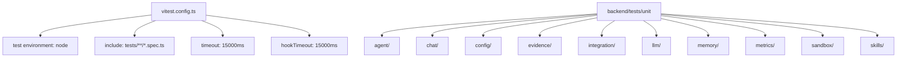

本页面详细阐述 GeoLoom 后端单元测试体系的架构设计、测试组织结构、核心测试模式以及运行维护规范。该测试体系基于 Vitest 构建，覆盖智能体核心、LLM 供应商、空间技能、证据渲染等关键模块，确保系统在 Node.js 环境下的行为一致性。

## 测试框架与配置

### Vitest 配置架构

后端测试采用 **Vitest** 作为测试运行器，相比传统的 Jest，Vitest 在 ESM 模块环境下具有更优的启动速度和 HMR 支持。配置文件位于 `backend/vitest.config.ts`，采用标准化的 Node.js 测试环境配置。



配置文件定义了全局超时限制为 15 秒，这一超时策略对于涉及外部服务调用的测试至关重要，既保证了测试不会无限等待，又为真实的 I/O 操作预留了足够时间。

Sources: [backend/vitest.config.ts](backend/vitest.config.ts#L1-L15)

### npm 脚本集成

`package.json` 中定义了完整的测试运行脚本，涵盖不同粒度的测试执行策略：

| 脚本命令 | 用途 | 执行范围 |
|---------|------|---------|
| `test` | 完整单元测试套件 | `tests/**/*.spec.ts` |
| `test:e2e:phase8-3` | Phase 8-3 端到端回归测试 | `tests/integration/e2e/` |
| `test:smoke:minimax` | MiniMax 依赖烟雾测试 | `tests/smoke/minimaxPhase8_3.smoke.spec.ts` |
| `test:smoke:dependencies` | 远程依赖健康检查 | `tests/smoke/remoteDependenciesPhase8_3.smoke.spec.ts` |
| `test:smoke:phase8-3` | 完整烟雾测试套件 | 两个 smoke 测试文件的组合 |

Sources: [backend/package.json](backend/package.json#L7-L12)

## 测试目录结构

### 单元测试模块划分

```
backend/tests/unit/
├── agent/                    # 智能体核心模块
│   ├── AlivePromptBuilder.spec.ts
│   ├── ConfidenceGate.spec.ts
│   ├── ConversationMemory.spec.ts
│   ├── GeoLoomAgent.spec.ts
│   └── SessionManager.spec.ts
├── chat/                     # 聊天路由与 SSE 协议
│   ├── DeterministicRouter.spec.ts
│   └── SSEWriter.spec.ts
├── config/                   # 配置加载
│   └── loadRuntimeEnv.spec.ts
├── evidence/                 # 证据视图工厂
│   ├── EvidenceViewFactory.spec.ts
│   ├── Renderer.spec.ts
│   └── livelihoodProfile.spec.ts
├── integration/              # 外部服务集成点测试
│   ├── faissIndex.spec.ts
│   ├── osmBridge.spec.ts
│   ├── postgisPool.spec.ts
│   └── pythonBridge.spec.ts
├── llm/                      # LLM 供应商抽象
│   ├── AnthropicCompatibleProvider.spec.ts
│   ├── FunctionCallingLoop.spec.ts
│   ├── InMemoryLLMProvider.spec.ts
│   ├── OpenAICompatibleProvider.spec.ts
│   ├── createDefaultLLMProvider.spec.ts
│   └── toolSchemas.spec.ts
├── memory/                   # 短时记忆管理
│   └── ShortTermMemory.spec.ts
├── metrics/                  # 运行时指标采集
│   └── RuntimeMetrics.spec.ts
├── sandbox/                  # SQL 沙箱安全验证
│   └── SQLSandbox.spec.ts
└── skills/                   # 技能系统测试
    ├── SkillManifestLoader.spec.ts
    ├── SkillRegistry.spec.ts
    ├── postgis/
    │   ├── executeSQL.spec.ts
    │   ├── resolveAnchor.spec.ts
    │   └── validateSQL.spec.ts
    ├── route_distance/
    │   └── RouteDistanceSkill.spec.ts
    ├── spatial_encoder/
    │   └── SpatialEncoderSkill.spec.ts
    └── spatial_vector/
        └── SpatialVectorSkill.spec.ts
```

这种模块划分与源代码目录 `backend/src/` 的结构形成镜像映射，便于快速定位对应的测试文件。

Sources: [backend/tests/unit/](backend/tests/unit)

## 核心测试模式

### 1. 确定性路由测试模式

**DeterministicRouter** 是系统意图识别的核心组件，其测试采用场景矩阵式覆盖策略。测试用例涵盖：地点锚定缺失时的澄清请求、基于浏览器地理位置的用户锚定、以及视口上下文可用时的当前区域推断。

```typescript
describe('DeterministicRouter', () => {
  it('routes nearby poi queries and extracts anchor plus category hints', () => {
    const intent = router.route({
      messages: [{ role: 'user', content: '武汉大学附近有哪些咖啡店？' }],
      options: {},
    })

    expect(intent.queryType).toBe('nearby_poi')
    expect(intent.placeName).toBe('武汉大学')
    expect(intent.targetCategory).toBe('咖啡')
    expect(intent.radiusM).toBe(800)
  })

  it('asks for location authorization when 我附近 lacks browser coordinates', () => {
    const intent = router.route({
      messages: [{ role: 'user', content: '我附近有哪些咖啡店？' }],
      options: {},
    })

    expect(intent.needsClarification).toBe(true)
    expect(intent.clarificationHint).toMatch(/授权当前位置|明确地点/)
  })
})
```

路由测试的核心验证点在于 `queryType`、`placeName`、`anchorSource` 和 `needsClarification` 四个字段的组合断言，确保系统在不同空间上下文下能够正确推断用户意图。

Sources: [backend/tests/unit/chat/DeterministicRouter.spec.ts](backend/tests/unit/chat/DeterministicRouter.spec.ts#L1-L30)

### 2. SQL 安全沙箱测试模式

**SQLSandbox** 是空间查询安全的关键防线，其测试采用负面测试（Negative Testing）策略，验证系统对各类攻击向量的拦截能力。

```typescript
describe('SQLSandbox', () => {
  it('rejects mutation statements', () => {
    const sandbox = createSandbox()
    const result = sandbox.validate('INSERT INTO pois(id) VALUES (1)')
    expect(result.ok).toBe(false)
  })

  it('rejects non-whitelisted functions', () => {
    const sandbox = createSandbox()
    const result = sandbox.validate('SELECT pg_sleep(1) FROM pois ... LIMIT 10')
    expect(result.ok).toBe(false)
  })

  it('rejects spatial queries without a required spatial predicate', () => {
    const sandbox = createSandbox()
    const result = sandbox.validate("SELECT id FROM pois WHERE name ILIKE '%咖啡%' LIMIT 10")
    expect(result.ok).toBe(false)
  })
})
```

安全测试覆盖了五个关键维度：**语句类型限制**（拒绝 INSERT/UPDATE/DELETE/DROP/ALTER）、**LIMIT 约束**（必须有且不超过最大值）、**表名白名单**（仅允许 pois、subway_stations）、**函数白名单**（仅允许预定义的空间函数）以及**空间谓词要求**（必须包含 ST_DWithin/ST_Intersects/ST_Contains 之一）。

Sources: [backend/tests/unit/sandbox/SQLSandbox.spec.ts](backend/tests/unit/sandbox/SQLSandbox.spec.ts#L1-L50)

### 3. LLM 函数调用循环测试模式

**FunctionCallingLoop** 的测试重点在于验证消息历史的管理和上下文累积能力。测试使用 `vi.fn()` 创建模拟的 LLM 供应商，分两次调用返回不同的响应内容。

```typescript
describe('runFunctionCallingLoop', () => {
  it('replays the full assistant tool-call message back into history before the next round', async () => {
    const provider = {
      isReady: () => true,
      complete: vi.fn()
        .mockImplementationOnce(async ({ messages }) => {
          // 第一次调用：工具调用
          expect(messages).toHaveLength(2) // system + user
          return {
            assistantMessage: { role: 'assistant', toolCalls: [...] },
            finishReason: 'tool_calls'
          }
        })
        .mockImplementationOnce(async ({ messages }) => {
          // 第二次调用：确认上下文已累积
          expect(messages).toHaveLength(4) // system + user + assistant.tool + tool
          return {
            assistantMessage: { content: '总结内容' },
            finishReason: 'stop'
          }
        }),
    }
  })
})
```

这种测试模式验证了函数调用循环的两个核心不变量：工具执行结果（role: tool）必须被正确注入到消息历史中，且下一轮 LLM 调用能够访问完整的对话上下文。

Sources: [backend/tests/unit/llm/FunctionCallingLoop.spec.ts](backend/tests/unit/llm/FunctionCallingLoop.spec.ts#L1-L50)

### 4. 外部服务降级模式测试

系统采用 **Remote-First 降级策略**，当远程服务不可用时自动回退到本地实现。测试使用 `vi.fn()` 模拟 HTTP 请求，分别验证正常、降级和恢复三种状态。

```typescript
describe('RemoteFirstFaissIndex', () => {
  it('uses remote semantic search results when the vector service is reachable', async () => {
    const index = new RemoteFirstFaissIndex({
      baseUrl: 'http://vector.test',
      fetchImpl: vi.fn(async (input) => {
        const url = String(input)
        if (url.endsWith('/health')) {
          return new Response(JSON.stringify({ status: 'ok' }))
        }
        return new Response(JSON.stringify({
          candidates: [{ id: 'poi_001', name: '远程咖啡馆' }]
        }))
      }),
      fallback: new LocalFaissIndex(),
    })

    await expect(index.getStatus()).resolves.toMatchObject({
      mode: 'remote', degraded: false, target: 'http://vector.test'
    })
  })

  it('falls back to the local semantic index when the remote vector service fails', async () => {
    const index = new RemoteFirstFaissIndex({
      fetchImpl: vi.fn(() => { throw new Error('timeout') }),
      fallback: new LocalFaissIndex(),
    })

    const candidates = await index.searchSemanticPOIs('高校周边咖啡', 3)
    expect(candidates.length).toBeGreaterThan(0)

    await expect(index.getStatus()).resolves.toMatchObject({
      mode: 'fallback', degraded: true, reason: 'remote_request_failed'
    })
  })
})
```

Sources: [backend/tests/unit/integration/faissIndex.spec.ts](backend/tests/unit/integration/faissIndex.spec.ts#L1-L50)

### 5. 证据视图工厂测试模式

**EvidenceViewFactory** 负责将原始查询结果转换为前端可渲染的证据视图。其测试覆盖多种证据类型和去重逻辑。

```typescript
describe('EvidenceViewFactory', () => {
  it('deduplicates nearby metro exits and suppresses repeated station shell entries', () => {
    const view = factory.create({
      intent: { queryType: 'nearby_poi', targetCategory: '地铁站', categoryKey: 'metro_station' },
      anchor: { ... },
      rows: [
        { id: 2101, name: '湖北大学地铁站E口', ... },
        { id: 2102, name: '湖北大学地铁站A口', ... },
        { id: 2103, name: '湖北大学地铁站D口', ... },
        { id: 2104, name: '湖北大学(地铁站)', ... },  // 重复的站名
        { id: 2105, name: '湖北大学(地铁站)', ... },  // 再次重复
        { id: 2106, name: '三角路地铁站H口', ... },
      ],
    })

    expect(view.items.map(item => item.name)).toEqual([
      '湖北大学地铁站E口', '湖北大学地铁站A口', '湖北大学地铁站D口', '三角路地铁站H口'
    ])
  })
})
```

去重测试验证了地铁口列表在渲染前的规范化处理，避免同一地铁站的多个出入口和站名壳体导致重复展示。

Sources: [backend/tests/unit/evidence/EvidenceViewFactory.spec.ts](backend/tests/unit/evidence/EvidenceViewFactory.spec.ts#L1-L80)

### 6. 技能注册与清单加载测试

**SkillRegistry** 测试验证技能注册的单例性和查询能力，而 **SkillManifestLoader** 则测试从文件系统加载技能描述的完整性。

```typescript
describe('SkillRegistry', () => {
  it('throws when registering the same skill twice', () => {
    const registry = new SkillRegistry()
    registry.register(skill)
    expect(() => registry.register(skill)).toThrow(/already registered/i)
  })

  it('lists registered skills and their action summaries', () => {
    const summaries = registry.list()
    expect(summaries[0]).toMatchObject({
      name: 'postgis', description: 'mock skill', capabilities: ['query']
    })
  })
})
```

Sources: [backend/tests/unit/skills/SkillRegistry.spec.ts](backend/tests/unit/skills/SkillRegistry.spec.ts#L1-L40)

```typescript
describe('SkillManifestLoader', () => {
  it('loads markdown skill manifests from the SKILLS directory', async () => {
    const manifests = await loader.loadAll()
    const postgis = manifests.find(item => item.name === 'postgis')

    expect(postgis?.actions).toContain('resolve_anchor')
    expect(postgis?.promptSnippet).toMatch(/只读空间事实技能/)
  })
})
```

Sources: [backend/tests/unit/skills/SkillManifestLoader.spec.ts](backend/tests/unit/skills/SkillManifestLoader.spec.ts#L1-L30)

## 特殊测试技术

### 环境变量模拟

LLM 供应商测试使用 `vi.stubEnv()` 模拟运行时环境变量，无需修改真实的 `.env` 文件。

```typescript
describe('AnthropicCompatibleProvider', () => {
  it('reports MiniMax anthropic target details in provider status', () => {
    vi.stubEnv('LLM_BASE_URL', 'https://api.minimaxi.com/anthropic')
    vi.stubEnv('LLM_API_KEY', 'sk-test')
    vi.stubEnv('LLM_MODEL', 'MiniMax-M2.7')

    const provider = new AnthropicCompatibleProvider()
    expect(provider.getStatus()).toMatchObject({
      provider: 'minimax-anthropic-compatible',
      model: 'MiniMax-M2.7'
    })
  })
})
```

Sources: [backend/tests/unit/llm/AnthropicCompatibleProvider.spec.ts](backend/tests/unit/llm/AnthropicCompatibleProvider.spec.ts#L1-L30)

### 临时文件系统测试

配置加载测试使用 `mkdtempSync` 创建临时目录，避免对真实文件系统产生副作用。

```typescript
describe('loadRuntimeEnv', () => {
  afterEach(() => {
    while (tempDirs.length > 0) {
      rmSync(tempDirs.pop(), { recursive: true, force: true })
    }
  })

  it('loads root .env and .env.v4 for the V4 app', () => {
    const { rootDir, appDir } = createTempWorkspace()
    writeFileSync(join(rootDir, '.env'), 'LLM_BASE_URL=https://legacy.example/v1')
    writeFileSync(join(rootDir, '.env.v4'), 'LLM_BASE_URL=https://api.minimaxi.com/anthropic')
    
    const result = loadRuntimeEnv({ appDir, env: process.env })
    expect(result.loadedFiles.length).toBe(3)
  })
})
```

Sources: [backend/tests/unit/config/loadRuntimeEnv.spec.ts](backend/tests/unit/config/loadRuntimeEnv.spec.ts#L1-L50)

### SSE 流式输出解析

SSE 编写器测试通过 `PassThrough` 流捕获输出，手动解析 SSE 格式事件。

```typescript
function parseSSE(raw: string) {
  return raw.trim().split('\n\n').filter(Boolean).map(block => {
    const event = block.split('\n').find(line => line.startsWith('event: '))?.slice(7).trim()
    const dataLine = block.split('\n').find(line => line.startsWith('data: '))
    const data = dataLine ? JSON.parse(dataLine.slice(6)) : null
    return { event, data }
  })
}

describe('SSEWriter', () => {
  it('writes ordered events with required meta fields', async () => {
    const stream = new PassThrough()
    const writer = new SSEWriter({ stream, traceId: 'trace_v4_001' })
    const captured = captureStream(stream)

    await writer.trace({ request_id: 'req_v4_001' })
    await writer.stage('intent')
    await writer.done({ duration_ms: 88 })
    writer.close()

    const events = parseSSE(await captured)
    expect(events.map(item => item.event)).toEqual(['trace', 'stage', 'done'])
  })
})
```

Sources: [backend/tests/unit/chat/SSEWriter.spec.ts](backend/tests/unit/chat/SSEWriter.spec.ts#L1-L50)

## 测试覆盖的关键模块

### 智能体核心模块

| 测试文件 | 覆盖功能 |
|---------|---------|
| `GeoLoomAgent.spec.ts` | SQL 模板构建、锚点坐标系统记录、区域洞察查询类型处理 |
| `ConversationMemory.spec.ts` | 会话摘要生成、最近轮次截断逻辑 |
| `SessionManager.spec.ts` | 会话 ID 复用与创建、轮次元数据持久化 |
| `ConfidenceGate.spec.ts` | 置信度评估与澄清触发条件 |
| `AlivePromptBuilder.spec.ts` | 提示词组装、模型编排指导生成 |

Sources: [backend/tests/unit/agent/](backend/tests/unit/agent)

### LLM 抽象层

| 测试文件 | 覆盖功能 |
|---------|---------|
| `AnthropicCompatibleProvider.spec.ts` | Anthropic 内容块解析、工具调用提取 |
| `OpenAICompatibleProvider.spec.ts` | OpenAI 格式响应解析、finish_reason 处理 |
| `InMemoryLLMProvider.spec.ts` | 内存内模拟、锚点解析引导 |
| `FunctionCallingLoop.spec.ts` | 消息历史累积、工具调用编排 |
| `toolSchemas.spec.ts` | 技能清单到工具 schema 转换 |

Sources: [backend/tests/unit/llm/](backend/tests/unit/llm)

### 空间技能模块

| 测试文件 | 覆盖功能 |
|---------|---------|
| `postgis/validateSQL.spec.ts` | SQL 白名单验证、空间谓词检查 |
| `postgis/executeSQL.spec.ts` | 查询执行、行数截断、审计哈希 |
| `postgis/resolveAnchor.spec.ts` | 地点解析、别名规范化、模糊匹配 |
| `spatial_encoder/SpatialEncoderSkill.spec.ts` | 文本向量化、语义相似度评分 |
| `spatial_vector/SpatialVectorSkill.spec.ts` | 语义 POI 搜索、相似片区检索 |
| `route_distance/RouteDistanceSkill.spec.ts` | 路径距离计算、多目标排序 |

Sources: [backend/tests/unit/skills/](backend/tests/unit/skills)

## 运行与维护

### 本地运行测试

```bash
# 运行所有单元测试
cd backend && npm test

# 运行特定模块的测试
cd backend && npx vitest run tests/unit/skills/postgis/

# 运行单个测试文件
cd backend && npx vitest run tests/unit/chat/DeterministicRouter.spec.ts

# 监听模式（文件变更时自动重新运行）
cd backend && npx vitest
```

### 测试命名约定

测试文件采用 `*.spec.ts` 命名后缀，与 Vitest 的默认匹配模式保持一致。测试用例使用 `it` 描述块，每条用例的描述应包含预期行为和触发条件的自然语言说明。

### 扩展测试覆盖的建议

1. **增加负面边界测试**：对于 SQL 沙箱和技能执行，增加更多边缘情况的负面测试
2. **模拟时钟驱动**：对于涉及超时和 TTL 的测试，使用 `vi.useFakeTimers()` 验证时间相关逻辑
3. **属性快照测试**：对于复杂的嵌套数据结构，使用 `toMatchSnapshot()` 防止意外的 API 变更

---

## 下一步

- 继续阅读 [集成测试策略](27-ji-cheng-ce-shi-ce-lue)，了解端到端测试与单元测试的协同策略
- 探索 [Smoke 测试套件](28-smoke-ce-shi-tao-jian)，掌握生产环境健康检查的自动化验证方法