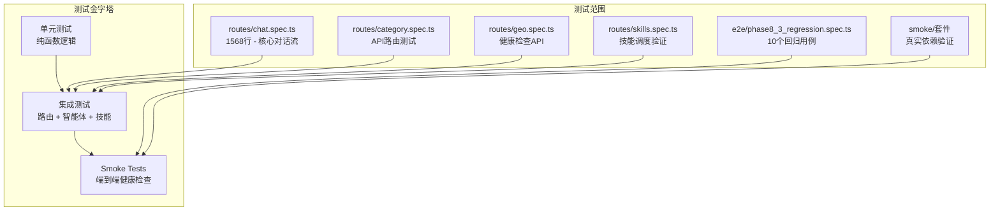
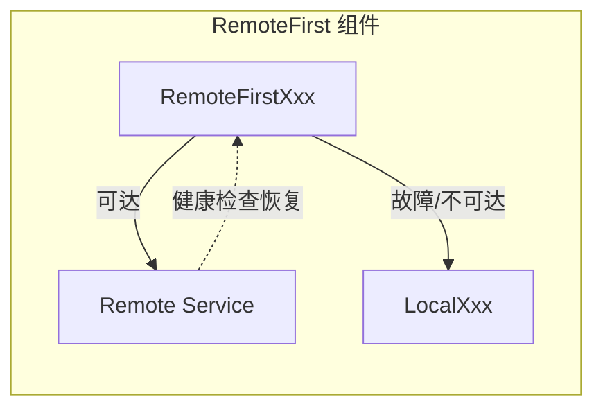

本文档描述 GeoLoom Agent 后端的集成测试策略，涵盖测试层次结构、路由级集成测试、E2E 回归测试、Smoke 测试套件以及外部依赖桥接验证。

## 测试层次结构

GeoLoom Agent 采用三层测试金字塔模型，从底向上依次为单元测试、集成测试和 Smoke 测试。集成测试位于中间层，重点验证组件间的交互逻辑和 API 路由契约。



Sources: [backend/tests/integration/routes/chat.spec.ts](backend/tests/integration/routes/chat.spec.ts#L1-L100), [backend/vitest.config.ts](backend/vitest.config.ts#L1-L15)

## 测试配置与运行

### Vitest 配置

测试框架采用 Vitest，运行于 Node 环境，超时阈值设置为 15 秒以适应外部服务调用的延迟：

```typescript
export default defineConfig({
  test: {
    environment: 'node',
    include: ['tests/**/*.spec.ts'],
    testTimeout: 15000,
    hookTimeout: 15000,
    coverage: { enabled: false },
  },
})
```

Sources: [backend/vitest.config.ts](backend/vitest.config.ts#L1-L15)

### NPM 测试命令

| 命令 | 目标文件 | 用途 |
|------|---------|------|
| `test:e2e:phase8-3` | `tests/integration/e2e/phase8_3_regression.spec.ts` | Phase 8.3 回归测试 |
| `test:smoke:minimax` | `tests/smoke/minimaxPhase8_3.smoke.spec.ts` | MiniMax 真实调用 |
| `test:smoke:phase8-3` | 两项 smoke 测试组合 | 完整健康验证 |

Sources: [backend/package.json](backend/package.json#L12-L16)

## 路由级集成测试

### Chat 路由测试 (核心)

`routes/chat.spec.ts` 是最核心的集成测试文件（1568 行），验证完整的对话流程：

```typescript
describe('POST /api/geo/chat', () => {
  it('streams a nearby poi answer for 武汉大学附近有哪些咖啡店', async () => {
    const app = buildTestApp()
    await app.ready()

    const response = await app.inject({
      method: 'POST',
      url: '/api/geo/chat',
      payload: {
        messages: [{ role: 'user', content: '武汉大学附近有哪些咖啡店？' }],
        options: { requestId: 'req_chat_001' },
      },
    })

    expect(response.statusCode).toBe(200)
    expect(response.headers['content-type']).toMatch(/text\/event-stream/)

    const events = parseSSE(response.body)
    expect(events.map((item) => item.event)).toContain('intent_preview')
    expect(events.map((item) => item.event)).toContain('pois')
    expect(events.map((item) => item.event)).toContain('refined_result')
    expect(events.at(-1)?.event).toBe('done')
  })
})
```

Sources: [backend/tests/integration/routes/chat.spec.ts](backend/tests/integration/routes/chat.spec.ts#L340-L380)

### SSE 事件流验证

Chat 路由测试的核心是 SSE 事件流解析，使用 `parseSSE` 辅助函数将原始响应转换为结构化事件：

```typescript
function parseSSE(raw: string) {
  return raw
    .trim()
    .split('\n\n')
    .filter(Boolean)
    .map((block) => {
      const event = block.split('\n').find((line) => line.startsWith('event: '))?.slice(7).trim()
      const dataLine = block.split('\n').find((line) => line.startsWith('data: '))
      const data = dataLine ? JSON.parse(dataLine.slice(6)) : null
      return { event, data }
    })
}
```

Sources: [backend/tests/integration/routes/chat.spec.ts](backend/tests/integration/routes/chat.spec.ts#L40-L60)

### 测试应用构建器

`buildTestApp` 函数是集成测试的核心工厂，封装了完整的应用组装过程：

```typescript
function buildTestApp(options = {}) {
  const registry = new SkillRegistry()
  const catalog = createPostgisCatalog()
  const sandbox = new SQLSandbox({
    catalog,
    maxRows: 20,
    statementTimeoutMs: 1200,
  })

  registry.register(createPostgisSkill({
    catalog,
    sandbox,
    query: vi.fn(async (sql) => { /* 模拟 SQL 查询 */ }),
    searchCandidates: async (placeName) => { /* 模拟地点搜索 */ },
    healthcheck: async () => true,
  }))
  // ... 其他技能注册

  const chat = new GeoLoomAgent({
    registry,
    version: '0.3.0-test',
    provider: options.provider || new InMemoryLLMProvider(),
    memory: new MemoryManager({ /* ... */ }),
  })

  return createApp({ registry, version: '0.3.0-test', checkDatabaseHealth: async () => true, chat })
}
```

Sources: [backend/tests/integration/routes/chat.spec.ts](backend/tests/integration/routes/chat.spec.ts#L240-L330)

### 其他路由测试

**Category 路由** - 验证分类树 API 的响应契约：

```typescript
describe('GET /api/category/tree', () => {
  it('returns the category tree expected by the control panel', async () => {
    const app = createApp({
      registry: new SkillRegistry(),
      version: '0.3.1-test',
      checkDatabaseHealth: async () => true,
      getCategoryTree: async () => [/* 模拟树结构 */],
    })
    
    const response = await app.inject({ method: 'GET', url: '/api/category/tree' })
    expect(response.statusCode).toBe(200)
    expect(response.json()).toEqual([/* 预期结构 */])
  })
})
```

Sources: [backend/tests/integration/routes/category.spec.ts](backend/tests/integration/routes/category.spec.ts#L1-L67)

**Geo 健康检查路由** - 验证依赖降级状态报告：

```typescript
describe('GET /api/geo/health', () => {
  it('returns explicit dependency modes and degraded dependencies', async () => {
    const response = await app.inject({ method: 'GET', url: '/api/geo/health' })
    const payload = response.json()
    
    expect(payload.dependencies.spatial_vector.mode).toBe('fallback')
    expect(payload.degraded_dependencies).toEqual(expect.arrayContaining([
      'llm_provider', 'short_term_memory', 'spatial_vector',
    ]))
  })
})
```

Sources: [backend/tests/integration/routes/geo.spec.ts](backend/tests/integration/routes/geo.spec.ts#L1-L120)

**Skills 路由** - 验证技能注册和调试端点：

```typescript
it('runs get_schema_catalog through the postgis debug route', async () => {
  const response = await app.inject({
    method: 'POST',
    url: '/api/geo/skills/postgis/call',
    payload: { action: 'get_schema_catalog', payload: {} },
  })
  expect(response.statusCode).toBe(200)
  expect(response.json().ok).toBe(true)
})

it('rejects illegal SQL through the postgis debug route', async () => {
  const response = await app.inject({
    method: 'POST',
    url: '/api/geo/skills/postgis/call',
    payload: { action: 'validate_spatial_sql', payload: { sql: 'DELETE FROM pois WHERE id = 1' } },
  })
  expect(response.statusCode).toBe(400)
})
```

Sources: [backend/tests/integration/routes/skills.spec.ts](backend/tests/integration/routes/skills.spec.ts#L50-L90)

## E2E 回归测试套件

### 回归 Fixtures 数据

Phase 8.3 回归测试使用结构化的 Fixture 定义，覆盖 10 种典型查询场景：

```typescript
export interface Phase83RegressionFixture {
  id: string
  query: string
  expectedQueryType: 'nearby_poi' | 'nearest_station' | 'similar_regions' | 'compare_places' | 'unsupported'
  expectedEvidenceType: 'poi_list' | 'transport' | 'semantic_candidate' | 'comparison'
  expectedKeywords: string[]
  providerMode?: RegressionProviderMode
  expectedProviderReady?: boolean
}

export const phase83RegressionFixtures: Phase83RegressionFixture[] = [
  {
    id: 'q01_nearby_coffee_default',
    query: '武汉大学附近有哪些咖啡店？',
    expectedQueryType: 'nearby_poi',
    expectedEvidenceType: 'poi_list',
    expectedKeywords: ['武汉大学', 'luckin coffee'],
  },
  // ... 共10个测试用例
]
```

Sources: [backend/tests/integration/e2e/phase8_3_regression.fixture.ts](backend/tests/integration/e2e/phase8_3_regression.fixture.ts#L1-L92)

### 回归测试执行

```typescript
describe('Phase 8.3 regression fixtures', () => {
  it('declares the full 10-question regression corpus', () => {
    expect(phase83RegressionFixtures).toHaveLength(10)
  })

  for (const fixture of phase83RegressionFixtures) {
    it(`closes the loop for ${fixture.id}`, async () => {
      const app = buildRegressionApp({ providerMode: fixture.providerMode })
      await app.ready()

      const response = await app.inject({
        method: 'POST',
        url: '/api/geo/chat',
        payload: { messages: [{ role: 'user', content: fixture.query }], options: { requestId: `phase83_${fixture.id}` } },
      })

      const events = parseSSE(response.body)
      const refined = events.find((item) => item.event === 'refined_result')?.data

      expect(refined.results.stats.query_type).toBe(fixture.expectedQueryType)
      expect(refined.results.evidence_view.type).toBe(fixture.expectedEvidenceType)
      expect(events.at(-1)?.event).toBe('done')
    })
  }
})
```

Sources: [backend/tests/integration/e2e/phase8_3_regression.spec.ts](backend/tests/integration/e2e/phase8_3_regression.spec.ts#L1-L52)

### Mock Provider 模式

回归测试支持多种 Provider 模式以模拟不同场景：

```typescript
export type RegressionProviderMode =
  | 'default'           // 标准内存 Provider
  | 'env_default'        // 读取环境变量配置
  | 'nearest_station_recovery'  // 最近站点恢复场景
  | 'provider_unavailable'      // Provider 不可用
  | 'polished_answer'            // 抛光答案模式
  | 'compare_metro'              // 地铁对比模式
  | 'provider_throwing'           // Provider 异常抛出
```

Sources: [backend/tests/integration/helpers/chatRegressionHarness.ts](backend/tests/integration/helpers/chatRegressionHarness.ts#L20-L30)

## Smoke 测试套件

### MiniMax 真实调用测试

MiniMax Smoke 测试使用真实的 LLM Provider（通过环境变量配置）：

```typescript
const perQueryTimeoutMs = Number(String(process.env.MINIMAX_SMOKE_TIMEOUT_MS || '45000').replace(/_/g, ''))
const minimaxReady = Boolean(
  String(process.env.LLM_API_KEY || '').trim()
  && String(process.env.LLM_MODEL || '').trim()
  && /minimax/i.test(String(process.env.LLM_BASE_URL || '')),
)

describe('MiniMax Phase 8.3 smoke', () => {
  for (const query of minimaxPhase83SmokeCases) {
    it.skipIf(!minimaxReady)(`uses MiniMax as the real orchestration provider`, async () => {
      const app = buildRegressionApp({ providerMode: 'env_default' })
      await app.ready()

      const health = await app.inject({ method: 'GET', url: '/api/geo/health' })
      expect(healthPayload.llm.provider).toContain('minimax')
      // ... 执行真实查询并验证
    }, perQueryTimeoutMs)
  }
})
```

Sources: [backend/tests/smoke/minimaxPhase8_3.smoke.spec.ts](backend/tests/smoke/minimaxPhase8_3.smoke.spec.ts#L1-L90)

### 远程依赖 Smoke 测试

验证外部服务（Redis、向量服务、编码器、路由服务）的引导和健康状态：

```typescript
describe('Phase 8.3 remote dependency smoke', () => {
  it.skipIf(!redisReady)('promotes short-term memory to remote mode when Redis is configured', async () => {
    const store = new RedisShortTermStore({
      url: String(process.env.REDIS_URL),
      keyPrefix: `v4:smoke:${Date.now()}:`,
    })
    const memory = new ShortTermMemory({ ttlMs: 60_000, store })

    await memory.appendTurn('phase83_smoke_session', { /* ... */ })
    const snapshot = await memory.getSnapshot('phase83_smoke_session')
    expect(snapshot.turns).toHaveLength(1)
  })

  it.skipIf(!vectorReady)('connects to remote vector service when configured', async () => {
    const index = new RemoteFirstFaissIndex({ baseUrl: String(process.env.SPATIAL_VECTOR_BASE_URL) })
    const candidates = await index.searchSemanticPOIs('武汉大学附近咖啡店', 3)
    expect(candidates.length).toBeGreaterThan(0)
  })

  it.skipIf(!encoderReady)('uses remote encoder when available', async () => {
    const bridge = new RemoteFirstPythonBridge({ baseUrl: String(process.env.SPATIAL_ENCODER_BASE_URL) })
    const encoded = await bridge.encodeText('高校周边咖啡和夜间活跃')
    expect(encoded.dimension).toBeGreaterThan(0)
  })
})
```

Sources: [backend/tests/smoke/remoteDependenciesPhase8_3.smoke.spec.ts](backend/tests/smoke/remoteDependenciesPhase8_3.smoke.spec.ts#L150-L200)

## 外部依赖桥接测试

### Remote-First 模式验证

外部依赖组件采用 Remote-First 模式，优先使用远程服务，降级到本地实现：



#### Python Bridge 测试

```typescript
describe('RemoteFirstPythonBridge', () => {
  it('prefers the remote encoder when configured and reachable', async () => {
    const bridge = new RemoteFirstPythonBridge({
      baseUrl: 'http://encoder.test',
      fetchImpl: vi.fn(async (input) => {
        if (url.endsWith('/health')) return Response.json({ status: 'ok' })
        return Response.json({ vector: [0.12, 0.88], tokens: ['武汉大学', '咖啡'], dimension: 2 })
      }),
      fallback: new LocalPythonBridge(),
    })

    const encoded = await bridge.encodeText('武汉大学附近咖啡店')
    expect(encoded.vector).toEqual([0.12, 0.88])
    await expect(bridge.getStatus()).resolves.toMatchObject({ mode: 'remote', degraded: false })
  })

  it('falls back to the local encoder when the remote request fails', async () => {
    const bridge = new RemoteFirstPythonBridge({
      baseUrl: 'http://encoder.test',
      fetchImpl: vi.fn(() => { throw new Error('connect ECONNREFUSED') }),
      fallback: new LocalPythonBridge(),
    })

    const encoded = await bridge.encodeText('高校周边咖啡')
    expect(encoded.dimension).toBeGreaterThan(0)
    await expect(bridge.getStatus()).resolves.toMatchObject({ mode: 'fallback', degraded: true })
  })
})
```

Sources: [backend/tests/unit/integration/pythonBridge.spec.ts](backend/tests/unit/integration/pythonBridge.spec.ts#L1-L113)

#### FAISS 向量索引测试

```typescript
describe('RemoteFirstFaissIndex', () => {
  it('uses remote semantic search results when the vector service is reachable', async () => {
    const index = new RemoteFirstFaissIndex({
      baseUrl: 'http://vector.test',
      fetchImpl: vi.fn(async (input) => {
        if (url.endsWith('/health')) return Response.json({ status: 'ok' })
        return Response.json({ candidates: [{ id: 'poi_001', name: '远程咖啡馆', category: '咖啡', score: 0.97 }] })
      }),
      fallback: new LocalFaissIndex(),
    })

    const candidates = await index.searchSemanticPOIs('高校周边的咖啡馆', 3)
    expect(candidates).toEqual([{ id: 'poi_001', name: '远程咖啡馆', category: '咖啡', score: 0.97 }])
  })
})
```

Sources: [backend/tests/unit/integration/faissIndex.spec.ts](backend/tests/unit/integration/faissIndex.spec.ts#L1-L110)

#### OSM 路由桥接测试

```typescript
describe('RemoteFirstOSMBridge', () => {
  it('uses the remote routing service when it is reachable', async () => {
    const bridge = new RemoteFirstOSMBridge({
      baseUrl: 'http://routing.test',
      fetchImpl: vi.fn(async (input) => {
        if (url.endsWith('/health')) return Response.json({ status: 'ok' })
        return Response.json({ distance_m: 820, duration_min: 11, degraded: false })
      }),
      fallback: new LocalOSMBridge(),
    })

    const route = await bridge.estimateRoute([114.364339, 30.536334], [114.355, 30.54], 'walking')
    expect(route.distance_m).toBe(820)
    await expect(bridge.getStatus()).resolves.toMatchObject({ mode: 'remote', degraded: false })
  })

  it('recovers status after a transient routing failure', async () => {
    // 验证故障恢复机制
  })
})
```

Sources: [backend/tests/unit/integration/osmBridge.spec.ts](backend/tests/unit/integration/osmBridge.spec.ts#L1-L103)

## 关键测试场景覆盖

### 查询类型覆盖矩阵

| 测试场景 | Query Type | Evidence Type | Provider 模式 |
|---------|------------|---------------|---------------|
| 附近咖啡店查询 | `nearby_poi` | `poi_list` | default |
| 最近地铁站查询 | `nearest_station` | `transport` | nearest_station_recovery |
| 相似片区推荐 | `similar_regions` | `semantic_candidate` | default |
| 区域对比 | `compare_places` | `comparison` | compare_metro |
| 区域洞察 | `area_overview` | `area_overview` | polished_answer |
| Provider 不可用 | `nearby_poi` | `poi_list` | provider_unavailable |
| Provider 异常 | `nearby_poi` | `poi_list` | provider_throwing |

Sources: [backend/tests/integration/e2e/phase8_3_regression.fixture.ts](backend/tests/integration/e2e/phase8_3_regression.fixture.ts#L1-L92)

### 降级与恢复场景

```typescript
it('falls back to the deterministic visible loop when the configured provider is unavailable', async () => {
  const app = buildTestApp({ provider: { isReady: () => false, /* ... */ } })

  const response = await app.inject({ /* ... */ })
  const events = parseSSE(response.body)
  const job = events.find((item) => item.event === 'job')?.data

  expect(job.mode).toBe('deterministic_visible_loop')
  expect(refined.results.stats.provider_ready).toBe(false)
})

it('degrades gracefully when the provider throws', async () => {
  // 验证 Provider 异常不导致 SSE 流中断
  expect(events.at(-1)?.event).toBe('done')
  expect(refined.answer).toMatch(/武汉大学|咖啡/)
})
```

Sources: [backend/tests/integration/routes/chat.spec.ts](backend/tests/integration/routes/chat.spec.ts#L1100-L1150)

### 错误处理边界

```typescript
it('emits an SSE error when a tool throws during tool_run', async () => {
  const response = await app.inject({ /* ... */ })
  const events = parseSSE(response.body)
  const errorEvent = events.find((item) => item.event === 'error')?.data

  expect(events.map((item) => item.event)).toContain('error')
  expect(events.at(-1)?.event).toBe('error')
  expect(errorEvent?.message).toMatch(/searchCandidates boom/)
})

it('does not append a late SSE error after refined_result when memory persistence fails', async () => {
  vi.spyOn(memory, 'recordTurn').mockRejectedValue(new Error('memory write failed'))

  const events = parseSSE(response.body)
  expect(events.map((item) => item.event)).toContain('refined_result')
  expect(events.map((item) => item.event)).not.toContain('error')
  expect(events.at(-1)?.event).toBe('done')
})
```

Sources: [backend/tests/integration/routes/chat.spec.ts](backend/tests/integration/routes/chat.spec.ts#L1400-L1470)

## 下一步

- [后端单元测试](26-hou-duan-dan-yuan-ce-shi) - 了解单元测试层的覆盖范围
- [Smoke 测试套件](28-smoke-ce-shi-tao-jian) - 深入了解端到端健康验证
- [依赖服务健康检查](22-yi-lai-fu-wu-jian-kang-jian-cha) - 了解运行时依赖监控