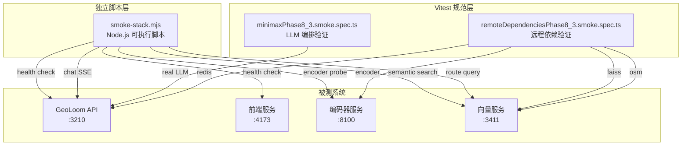
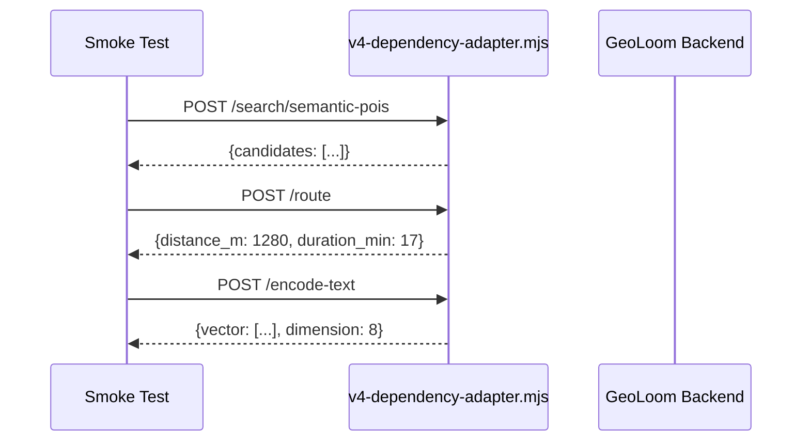
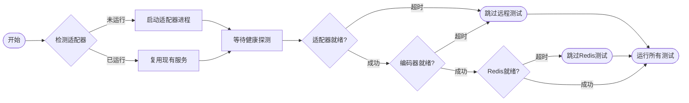

Smoke 测试套件是 GeoLoom Agent 项目质量保障体系中的快速验证层，旨在以最小代价确认系统核心功能链路可用。与全面回归测试不同，Smoke 测试聚焦于**关键依赖就绪状态**和**端到端交互完整性**，是 CI/CD 流水线中每次代码变更后最先执行的验证关卡。

## 架构设计

### 双层测试策略

Smoke 测试套件采用**独立脚本层**与**Vitest 规范层**并行的双层架构，分别承担不同的验证职责。



**独立脚本层**（`scripts/smoke-stack.mjs`）是一个自包含的 Node.js 可执行文件，通过 HTTP 调用直接探测所有依赖服务的健康状态，并在单个流程内完成从 API 到前端再到向量服务的全链路验证。这种设计使得脚本可以在 **Vitest 环境之外独立运行**，适合部署到 CI 流水线或开发机器的快速自检。

**Vitest 规范层**则利用测试框架的能力进行更精细的断言验证，包括对 SSE 事件流的结构化解析、证据视图类型的强类型校验、以及与真实 LLM Provider 的集成验证。

Sources: [smoke-stack.mjs](scripts/smoke-stack.mjs#L1-L189)
Sources: [minimaxPhase8_3.smoke.spec.ts](backend/tests/smoke/minimaxPhase8_3.smoke.spec.ts#L1-L90)
Sources: [remoteDependenciesPhase8_3.smoke.spec.ts](backend/tests/smoke/remoteDependenciesPhase8_3.smoke.spec.ts#L1-L244)

### 依赖适配器

当外部依赖服务未就绪时，`scripts/v4-dependency-adapter.mjs` 提供一个本地 Mock 服务器，确保 Smoke 测试可以在完全隔离的环境中运行。该适配器监听两个端口：`3411` 提供向量检索和路径规划接口，`8100` 提供文本编码接口。



Sources: [v4-dependency-adapter.mjs](scripts/v4-dependency-adapter.mjs#L1-L130)

## 测试文件结构

```
backend/tests/smoke/
├── minimaxPhase8_3.corpus.ts          # 测试用例语料库
├── minimaxPhase8_3.smoke.spec.ts      # MiniMax LLM 集成测试
└── remoteDependenciesPhase8_3.smoke.spec.ts  # 远程依赖验证
```

### 用例语料库设计

`minimaxPhase8_3.corpus.ts` 定义了 10 个代表性查询，覆盖系统支持的核心查询类型。每个用例包含标识符、查询文本、预期查询类型、预期证据类型以及可选的锚点关键词验证。

```typescript
export interface MiniMaxPhase83SmokeCase {
  id: string
  query: string
  expectedQueryType: 'nearby_poi' | 'nearest_station' | 'similar_regions' | 'compare_places'
  expectedEvidenceType: 'poi_list' | 'transport' | 'semantic_candidate' | 'comparison'
  expectedAnchorKeyword?: string
  expectedKeyword?: string
}
```

测试用例按功能域组织：

| 查询类型 | 用例数 | 示例查询 |
|---------|-------|---------|
| `nearby_poi` | 4 | "武汉大学附近有哪些咖啡店？" |
| `nearest_station` | 3 | "武汉大学最近的地铁站是什么？" |
| `compare_places` | 2 | "比较武汉大学和湖北大学附近的餐饮活跃度" |
| `similar_regions` | 2 | "和武汉大学周边气质相似的片区有哪些？" |

Sources: [minimaxPhase8_3.corpus.ts](backend/tests/smoke/minimaxPhase8_3.corpus.ts#L1-L90)

## 执行机制

### 独立脚本执行

`smoke-stack.mjs` 支持通过命令行参数或环境变量配置目标服务地址：

```bash
# 通过命令行参数指定
node scripts/smoke-stack.mjs \
  --api-base http://127.0.0.1:3210 \
  --dependency-base http://127.0.0.1:3411 \
  --encoder-base http://127.0.0.1:8100 \
  --frontend-url http://127.0.0.1:4173

# 通过环境变量指定
GEOLOOM_API_BASE=http://127.0.0.1:3210 \
SPATIAL_VECTOR_BASE_URL=http://127.0.0.1:3411 \
SPATIAL_ENCODER_BASE_URL=http://127.0.0.1:8100 \
node scripts/smoke-stack.mjs
```

脚本按顺序执行以下验证步骤：

1. **健康检查探测**：验证 API、前端、编码器、向量服务各自的状态端点
2. **语义搜索验证**：向量化服务对"武汉大学附近适合开什么咖啡店？"返回有效候选
3. **相似片区验证**：向量服务对"和武汉大学最像的片区有哪些？"返回有效结果
4. **路径计算验证**：路由服务对指定坐标对返回正距离值
5. **依赖模式确认**：API 健康端点报告所有技能处于远程模式
6. **对话流验证**：通过 `/api/geo/chat` 发起完整对话，确认 SSE 流包含 `refined_result` 和 `done` 事件

执行成功时输出结构化 JSON 报告：

```json
{
  "frontend": "http://127.0.0.1:4173",
  "apiBase": "http://127.0.0.1:3210",
  "providerReady": true,
  "remoteModes": {
    "spatialEncoder": "remote",
    "spatialVector": "remote",
    "routeDistance": "remote"
  },
  "semanticPoiCount": 3,
  "similarRegionCount": 3,
  "routeDistanceM": 1280,
  "chatAnswer": "根据分析...",
  "queryType": "nearby_poi",
  "events": ["selected_skills", "tool_call", "tool_result", "refined_result", "done"]
}
```

Sources: [smoke-stack.mjs](scripts/smoke-stack.mjs#L48-L189)

### Vitest 规范执行

Vitest 层提供更细致的测试断言。通过 npm scripts 可以选择性运行特定测试套件：

```bash
# 运行所有 smoke 测试
npm run test:smoke:phase8-3

# 仅运行 MiniMax LLM 集成测试
npm run test:smoke:minimax

# 仅运行远程依赖验证测试
npm run test:smoke:dependencies
```

Vitest 配置使用 `node` 环境，默认超时时间为 15 秒：

```typescript
export default defineConfig({
  test: {
    environment: 'node',
    include: ['tests/**/*.spec.ts'],
    testTimeout: 15000,
    hookTimeout: 15000,
    coverage: { enabled: false },
  },
})
```

Sources: [vitest.config.ts](backend/vitest.config.ts#L1-L15)
Sources: [package.json](backend/package.json#L10-L14)

## 远程依赖验证

### 自举机制

`remoteDependenciesPhase8_3.smoke.spec.ts` 实现了依赖服务的自举（bootstrap）逻辑，在测试运行前自动检测并启动必要的服务：



自举过程首先探测默认的依赖适配器地址（`http://127.0.0.1:3411`），若探测失败则自动启动 `v4-dependency-adapter.mjs` 进程。随后依次检测编码器服务和 Redis 服务的可用性。

Sources: [remoteDependenciesPhase8_3.smoke.spec.ts](backend/tests/smoke/remoteDependenciesPhase8_3.smoke.spec.ts#L88-L141)

### 依赖探测策略

采用 **Remote-First** 模式进行依赖服务探测：优先尝试连接远程服务，若连接失败则回退到本地实现。

| 依赖服务 | 接口 | 降级模式 |
|---------|-----|---------|
| `spatial_vector` | `RemoteFirstFaissIndex` | 回退到 `LocalFaissIndex` |
| `route_distance` | `RemoteFirstOSMBridge` | 回退到 `LocalOSMBridge` |
| `spatial_encoder` | `RemoteFirstPythonBridge` | 回退到 `LocalPythonBridge` |

每个 `RemoteFirst*` 类实现以下行为：
- 构造时记录目标 URL 和回退实例
- 首次调用时执行健康探测
- 探测成功则进入远程模式
- 探测失败则记录 `degraded: true` 并使用本地实现

Sources: [faissIndex.ts](backend/src/integration/faissIndex.ts#L97-L130)
Sources: [pythonBridge.ts](backend/src/integration/pythonBridge.ts#L61-L100)
Sources: [osmBridge.ts](backend/src/integration/osmBridge.ts#L55-L80)

### 测试用例覆盖

远程依赖验证测试覆盖四个核心服务：

```typescript
describe('Phase 8.3 remote dependency smoke', () => {
  it.skipIf(!redisReady)(
    'promotes short-term memory to remote mode when Redis is configured',
    async () => {
      const store = new RedisShortTermStore({ url: String(process.env.REDIS_URL) })
      const memory = new ShortTermMemory({ ttlMs: 60_000, store })
      await memory.appendTurn('phase83_smoke_session', { /* ... */ })
      const snapshot = await memory.getSnapshot('phase83_smoke_session')
      expect(snapshot.turns).toHaveLength(1)
      await expect(memory.getStatus()).resolves.toMatchObject({
        name: 'short_term_memory',
        mode: 'remote',
        degraded: false,
      })
    }
  )

  it.skipIf(!vectorReady)(
    'reaches the remote FAISS service when configured',
    async () => {
      const index = new RemoteFirstFaissIndex()
      const candidates = await index.searchSemanticPOIs('武汉大学附近咖啡店', 3)
      expect(Array.isArray(candidates)).toBe(true)
      await expect(index.getStatus()).resolves.toMatchObject({
        name: 'spatial_vector',
        mode: 'remote',
        degraded: false,
      })
    }
  )

  it.skipIf(!routingReady)(
    'reaches the remote routing service when configured',
    async () => {
      const bridge = new RemoteFirstOSMBridge()
      const route = await bridge.estimateRoute(
        [114.364339, 30.536334],
        [114.355, 30.54],
        'walking'
      )
      expect(route.distance_m).toBeGreaterThan(0)
      await expect(bridge.getStatus()).resolves.toMatchObject({
        name: 'route_distance',
        mode: 'remote',
        degraded: false,
      })
    }
  )

  it.skipIf(!encoderReady)(
    'reaches the remote Python encoder when configured',
    async () => {
      const bridge = new RemoteFirstPythonBridge()
      const encoded = await bridge.encodeText('武汉大学附近咖啡店')
      expect(encoded.dimension).toBeGreaterThan(0)
      await expect(bridge.getStatus()).resolves.toMatchObject({
        name: 'spatial_encoder',
        mode: 'remote',
        degraded: false,
      })
    }
  )
})
```

测试使用 `it.skipIf()` 模式，当对应服务未就绪时自动跳过，而非失败。这种设计确保测试套件在任何环境下都能给出明确的通过/跳过/失败结果。

Sources: [remoteDependenciesPhase8_3.smoke.spec.ts](backend/tests/smoke/remoteDependenciesPhase8_3.smoke.spec.ts#L148-L243)

## MiniMax LLM 集成验证

### 环境就绪检测

MiniMax 测试首先验证 LLM Provider 的环境配置：

```typescript
const minimaxReady = Boolean(
  String(process.env.LLM_API_KEY || '').trim()
  && String(process.env.LLM_MODEL || '').trim()
  && /minimax/i.test(String(process.env.LLM_BASE_URL || ''))
)
```

测试仅在满足以下条件时执行：
- `LLM_API_KEY` 已配置且非空
- `LLM_MODEL` 已配置且非空
- `LLM_BASE_URL` 包含 "minimax" 标识

Sources: [minimaxPhase8_3.smoke.spec.ts](backend/tests/smoke/minimaxPhase8_3.smoke.spec.ts#L12-L18)

### SSE 事件流验证

测试使用回归测试工具（Regression Harness）构建隔离的测试应用，并解析 SSE 响应：

```typescript
function parseSSE(raw: string) {
  return raw
    .trim()
    .split('\n\n')
    .filter(Boolean)
    .map((block) => {
      const event = block
        .split('\n')
        .find((line) => line.startsWith('event: '))
        ?.slice(7)
        .trim()
      const dataLine = block
        .split('\n')
        .find((line) => line.startsWith('data: '))
      const data = dataLine ? JSON.parse(dataLine.slice(6)) : null
      return { event, data }
    })
}
```

对每个查询用例验证：
1. HTTP 响应状态码为 200
2. SSE 流包含 `refined_result` 事件
3. `refined_result` 包含 `answer` 和 `results` 字段
4. `results.stats.query_type` 与预期类型匹配
5. `results.evidence_view.type` 与预期证据类型匹配
6. 证据视图包含有效的 `items`、`pairs` 或 `regions` 数据
7. SSE 流以 `done` 事件结束

Sources: [chatRegressionHarness.ts](backend/tests/integration/helpers/chatRegressionHarness.ts#L295-L310)
Sources: [minimaxPhase8_3.smoke.spec.ts](backend/tests/smoke/minimaxPhase8_3.smoke.spec.ts#L45-L80)

## 配置参考

### 环境变量矩阵

| 变量名 | 用途 | 默认值 |
|-------|-----|-------|
| `GEOLOOM_API_BASE` | GeoLoom 后端地址 | `http://127.0.0.1:3210` |
| `GEOLOOM_FRONTEND_URL` | 前端服务地址 | `http://127.0.0.1:4173` |
| `SPATIAL_VECTOR_BASE_URL` | 向量检索服务地址 | `http://127.0.0.1:3411` |
| `SPATIAL_ENCODER_BASE_URL` | 编码器服务地址 | `http://127.0.0.1:8100` |
| `LLM_API_KEY` | MiniMax API 密钥 | - |
| `LLM_MODEL` | MiniMax 模型标识 | - |
| `LLM_BASE_URL` | MiniMax API 端点 | - |
| `MINIMAX_SMOKE_TIMEOUT_MS` | 单次查询超时 | `45000` |
| `REDIS_URL` | Redis 连接地址 | 自动解析 |

### 端口映射

| 服务 | 端口 | 协议 |
|-----|-----|-----|
| GeoLoom API | 3210 | HTTP |
| 前端服务 | 4173 | HTTP |
| 依赖适配器 | 3411 | HTTP |
| 编码器服务 | 8100 | HTTP |

## 最佳实践

### 本地开发工作流

在本地开发时，建议使用一键启动编排脚本同时启动所有依赖服务，然后执行 Smoke 测试验证系统就绪状态：

```bash
# 终端 1：启动依赖服务
node scripts/v4-dependency-adapter.mjs &

# 终端 2：启动后端
cd backend && npm run dev

# 终端 3：执行 Smoke 测试
node scripts/smoke-stack.mjs
```

### CI/CD 集成

在 CI 流水线中，Smoke 测试应作为构建成功后的第一道关卡：

```yaml
# 示例 CI 配置
stages:
  - build
  - smoke
  
smoke:
  stage: smoke
  script:
    - npm run start:dependency-service
    - cd backend && npm run dev &
    - sleep 5
    - node ../scripts/smoke-stack.mjs
  timeout: 2m
```

### 故障排查

| 症状 | 可能原因 | 解决方案 |
|-----|---------|---------|
| `encoder health failed` | 编码器服务未启动 | 启动 `scripts/run-encoder-service.mjs` |
| `vector health failed` | 依赖适配器未启动 | 启动 `scripts/v4-dependency-adapter.mjs` |
| `chat smoke did not finish` | LLM 超时或服务不可用 | 检查 `LLM_API_KEY` 和网络连接 |
| `semantic poi smoke failed` | 向量检索返回空结果 | 检查 FAISS 索引是否正确加载 |

---

**相关文档**：
- [依赖服务健康检查](22-yi-lai-fu-wu-jian-kang-jian-cha) - 了解 `/api/geo/health` 接口的详细行为
- [一键启动编排](25-jian-qi-dong-bian-pai) - 了解完整的本地开发环境启动方案
- [集成测试策略](27-ji-cheng-ce-shi-ce-lue) - 了解 Smoke 测试在整体测试金字塔中的定位