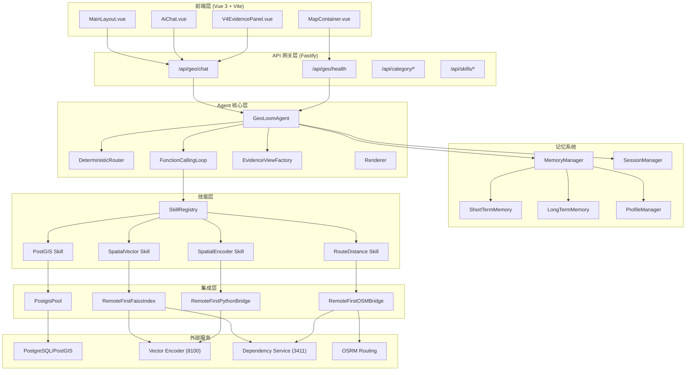

GeoLoom Agent 是一个面向地理空间智能查询的多智能体系统，通过自然语言处理与空间数据库的深度结合，为用户提供区域洞察、POI 检索、路径规划等能力。本文档将系统性地解析其整体架构、核心模块交互以及服务依赖关系，帮助开发者理解系统的设计哲学与实现路径。

Sources: [README.md](README.md#L1-L50)

## 系统架构总览

GeoLoom Agent 采用 **Fastify + TypeScript** 构建后端服务，配合 **Vue 3 + Vite** 构建前端界面。系统遵循 **Remote-First** 架构原则，外部依赖服务（向量检索、空间编码、路径规划）均支持远程调用与本地回退的双模式运行，确保在不同部署环境下都能保持可用性。

系统的核心逻辑由 `GeoLoomAgent` 主导，通过 `SkillRegistry` 实现技能分发，借助 `FunctionCallingLoop` 完成 LLM 函数调用循环，最终通过 `SSEWriter` 将处理结果以流式事件形式推送给前端。



Sources: [backend/src/server.ts](backend/src/server.ts#L1-L80), [backend/src/app.ts](backend/src/app.ts#L1-L53), [backend/src/agent/GeoLoomAgent.ts](backend/src/agent/GeoLoomAgent.ts#L1-L50)

## 服务端口与依赖关系

系统采用 **四服务并行架构**，通过 `start.bat` 或 `npm run dev:v4` 命令一键启动全部服务实例。各服务间通过 HTTP API 进行通信，形成清晰的服务依赖网络。

| 服务 | 端口 | 职责 | 启动方式 |
|------|------|------|----------|
| 前端 | `3000` | Vue 3 SPA，提供交互界面 | `npm run dev` |
| 依赖适配服务 | `3411` | 向量检索与路径规划的远程适配 | `npm run dev:dependency-service` |
| 空间编码器 | `8100` | 空间坐标编码服务 | `node encoder-fallback-service.mjs` |
| V4 后端 | `3210` | 核心 Agent 逻辑与 API 路由 | `npm --prefix backend run dev` |

默认连接配置由 `scripts/run-backend-v4.mjs` 注入后端环境变量，包括各远程服务的基准 URL 和健康检查路径。当外部服务不可用时，系统会自动切换到本地回退模式（Local Fallback Mode）。

Sources: [start.bat](start.bat#L1-L8), [scripts/run-backend-v4.mjs](scripts/run-backend-v4.mjs#L1-L32)

## 核心模块设计

### GeoLoomAgent 智能体核心

`GeoLoomAgent` 是整个系统的中枢控制器，负责协调意图路由、技能执行、证据生成与响应渲染的全流程。其核心职责包括：

**请求处理管道**：接收 `ChatRequestV4` 请求后，首先通过 `DeterministicRouter` 解析用户意图，确定查询类型（区域概览、POI 检索、相似片区、最近站点、对比分析），然后根据意图类型选择对应的技能链执行。

**锚点解析机制**：系统支持三种锚点来源 —— 用户直接指定地点名称、地图视图中心坐标、浏览器地理定位。当用户询问"附近"类问题时，系统会优先使用 `spatialContext` 中的上下文信息。

**函数调用循环**：对于需要 LLM 介入的复杂查询，系统通过 `runFunctionCallingLoop` 执行多轮函数调用，每轮调用完成后将结果追加到消息历史，直到达到最大轮数或 LLM 停止调用工具。

```mermaid
sequenceDiagram
    participant Client as 前端客户端
    participant Writer as SSEWriter
    participant Agent as GeoLoomAgent
    participant Router as DeterministicRouter
    participant Loop as FunctionCallingLoop
    participant Registry as SkillRegistry
    participant Skills as 技能实现

    Client->>Agent: POST /api/geo/chat
    Agent->>Router: route(request)
    Router-->>Agent: DeterministicIntent
    Agent->>Writer: job event
    Agent->>Writer: stage: intent_parsing
    Agent->>Writer: intent_preview event
    
    alt 完整 Agent 模式
        Agent->>Loop: runFunctionCallingLoop
        Loop->>Registry: 遍历注册技能
        Loop->>Skills: execute(action, payload)
        Skills-->>Loop: SkillExecutionResult
        Loop-->>Agent: traces + assistantMessage
    else 确定性回退模式
        Agent->>Skills: 直接执行技能
        Skills-->>Agent: 执行结果
    end
    
    Agent->>Writer: stage: evidence_generation
    Agent->>Writer: stage: answer_rendering
    Agent-->>Client: SSE 流式响应
```

Sources: [backend/src/agent/GeoLoomAgent.ts](backend/src/agent/GeoLoomAgent.ts#L350-L450), [backend/src/chat/DeterministicRouter.ts](backend/src/chat/DeterministicRouter.ts#L1-L100)

### 技能注册与调度系统

`SkillRegistry` 实现了轻量级的技能注册中心模式，所有技能以名称为键注册到内部 Map 中。技能定义遵循统一的 `SkillDefinition` 接口规范，包含名称、描述、能力列表、动作定义以及执行入口。

**技能结构**：

```typescript
interface SkillDefinition {
  name: string                    // 技能唯一标识
  description: string              // 人类可读描述
  actions: Record<string, SkillActionDefinition>  // 支持的动作映射
  capabilities: string[]           // 能力标签列表
  getStatus?(): Promise<DependencyStatus>  // 健康检查方法
  execute(action, payload, context): Promise<SkillExecutionResult>  // 执行入口
}
```

**当前注册技能**：

| 技能名称 | 描述 | 核心动作 |
|----------|------|----------|
| `postgis` | 空间数据库技能 | `get_schema_catalog`, `resolve_anchor`, `validate_spatial_sql`, `execute_spatial_sql` |
| `spatial_encoder` | 空间编码服务 | `encode_coordinates`, `encode_region` |
| `spatial_vector` | 向量检索技能 | `search_semantic_pois`, `search_similar_regions` |
| `route_distance` | 路径距离计算 | `calculate_distance`, `find_nearest` |

Sources: [backend/src/skills/SkillRegistry.ts](backend/src/skills/SkillRegistry.ts#L1-L37), [backend/src/skills/types.ts](backend/src/skills/types.ts#L1-L66)

### Remote-First 集成层

集成层采用 **Remote-First** 设计模式，每个外部依赖都遵循相同的模式：优先尝试连接远程服务，失败后自动降级到本地回退实现。

**PostgisPool**：管理 PostgreSQL 连接池，通过 `pg` 库与 PostGIS 扩展通信。连接参数由环境变量 `DATABASE_URL` 配置，支持查询超时控制和健康检查。

**RemoteFirstFaissIndex**：向量索引的远程调用封装，支持语义 POI 检索和相似片区召回。远程调用失败时回退到 `LocalFaissIndex`（基于标签重叠计分的简单实现），确保系统基本可用。

**RemoteFirstOSMBridge**：OSRM 路由服务的封装，计算两点间的驾驶距离和时间。默认使用公共 OSRM 实例 `https://router.project-osrm.org`，也支持配置私有部署实例。

**RemoteFirstPythonBridge**：Python 空间编码服务的封装，将坐标或区域描述转换为向量表示。

Sources: [backend/src/integration/faissIndex.ts](backend/src/integration/faissIndex.ts#L1-L200), [backend/src/integration/postgisPool.ts](backend/src/integration/postgisPool.ts#L1-L50), [backend/src/integration/dependencyStatus.ts](backend/src/integration/dependencyStatus.ts#L1-L21)

### 记忆系统架构

记忆系统采用 **三层架构**，分别处理不同时间尺度和重要性的信息。

**短期记忆 (ShortTermMemory)**：基于 Redis 的会话存储，TTL 默认 24 小时。记录每个会话的对话历史、用户意图摘要和关键中间结果。提供 `appendTurn`、`getSnapshot`、`getStatus` 等方法。

**长期记忆 (LongTermMemory)**：基于文件系统的持久化存储，在 `backend/data/memory/` 目录下保存会话摘要。用于跨会话的知识积累和问题模式识别。

**用户画像 (ProfileManager)**：管理用户个性化配置，在 `backend/profiles/` 目录下存储用户偏好、常用地点、查询习惯等结构化数据。

**MemoryManager**：统一封装三层记忆，提供统一的 `getSnapshot` 和 `recordTurn` 接口，对上层屏蔽底层实现差异。

Sources: [backend/src/memory/MemoryManager.ts](backend/src/memory/MemoryManager.ts#L1-L63), [backend/src/agent/SessionManager.ts](backend/src/agent/SessionManager.ts#L1-L42)

## SSE 事件流协议

系统采用 **Server-Sent Events (SSE)** 实现服务端推送，前端通过 `EventSource` 或 `fetch` API 消费流式响应。`SSEWriter` 负责序列化事件并写入可写流，`shared/sseEventSchema.ts` 定义了完整的事件类型与数据模式。

**核心事件类型**：

| 事件名称 | 描述 | 典型载荷 |
|----------|------|----------|
| `job` | 任务初始化 | `{ mode, provider_ready, version }` |
| `stage` | 处理阶段变更 | `{ name }` |
| `thinking` | AI 思考中状态 | `{ status, message }` |
| `intent_preview` | 意图解析预览 | `{ rawAnchor, normalizedAnchor, targetCategory, confidence }` |
| `pois` | POI 结果集 | `Array<POIRecord>` |
| `boundary` | 区域边界数据 | `GeoJSON` |
| `spatial_clusters` | 空间聚类热点 | `{ hotspots }` |
| `refined_result` | 精炼结果摘要 | 结构化数据 |
| `error` | 错误信息 | `{ message }` |
| `done` | 处理完成 | `{ duration_ms }` |

前端通过 `parseSseEventBlock` 解析每个事件块，并通过 `validateSSEEventPayload` 进行 Schema 校验，确保数据完整性。

Sources: [shared/sseEventSchema.ts](shared/sseEventSchema.ts#L1-L200), [backend/src/chat/SSEWriter.ts](backend/src/chat/SSEWriter.ts#L1-L99), [src/lib/geoloomApi.ts](src/lib/geoloomApi.ts#L1-L113)

## 确定性路由解析器

`DeterministicRouter` 实现了无需 LLM 的意图识别机制，通过正则表达式匹配和规则引擎解析用户查询。该设计确保了核心功能在 LLM 服务不可用时仍能正常工作。

**支持的查询类型**：

- `area_overview`：区域配套与业态分析（如"武汉大学附近有什么配套"）
- `nearest_station`：最近交通站点检索（如"最近的地铁站在哪"）
- `similar_regions`：相似片区召回（如"和这个区域气质相似的地方"）
- `compare_places`：两地点对比分析（如"对比武汉大学和光谷的餐饮"）
- `poi_search`：通用 POI 检索（如"附近咖啡店"）

路由解析时会同时提取锚点位置、目标类别、空间关系修饰词等关键信息，生成 `DeterministicIntent` 对象传递给下游处理。

Sources: [backend/src/chat/DeterministicRouter.ts](backend/src/chat/DeterministicRouter.ts#L1-L200)

## 证据视图工厂

`EvidenceViewFactory` 根据意图类型和数据形态，选择最合适的视图模板生成结构化证据展示。工厂模式的设计使得新增视图类型无需修改核心逻辑。

**视图生成策略**：

- `compare_places` + 双锚点 → `buildComparisonView`
- `similar_regions` → `buildSemanticCandidateView`
- `nearest_station` → `buildTransportView`
- `area_overview` → `buildAreaOverviewView`
- 多 POI + 餐饮类 → `buildBucketView`（按子类别分组）
- 默认 → `buildPOIListView`

每个视图模板接收锚点信息、查询结果和意图配置，输出标准化的 `EvidenceView` 结构，确保前端渲染逻辑的一致性。

Sources: [backend/src/evidence/EvidenceViewFactory.ts](backend/src/evidence/EvidenceViewFactory.ts#L1-L68)

## 健康检查与降级策略

系统提供统一的健康检查端点 `/api/geo/health`，返回各组件的就绪状态和依赖模式。响应结构包含：

```json
{
  "status": "ok",
  "version": "0.1.0",
  "services": { "database": "connected" },
  "llm": { "ready": true },
  "memory": { "ready": true },
  "provider_ready": true,
  "dependencies": {
    "database": { "mode": "remote", "ready": true },
    "spatial_encoder": { "mode": "remote", "ready": true },
    "spatial_vector": { "mode": "remote", "ready": false },
    "route_distance": { "mode": "remote", "ready": true }
  },
  "degraded_dependencies": ["spatial_vector"],
  "skills_registered": 4
}
```

`degraded_dependencies` 字段列出当前未就绪的服务，`dependencies.*.mode` 指示服务运行模式（`remote`、`fallback`、`local`、`unconfigured`）。

Sources: [backend/src/routes/geo.ts](backend/src/routes/geo.ts#L1-L63)

## 快速启动与验证

开发者可以通过以下命令验证系统是否正常运行：

```bash
# 一键启动全部服务
start.bat
# 或
npm run dev:v4

# 检查后端健康状态
curl http://127.0.0.1:3210/api/geo/health

# 检查依赖服务
curl http://127.0.0.1:8100/health
curl http://127.0.0.1:3411/health/vector
curl http://127.0.0.1:3411/health/routing
```

启动成功后在浏览器访问 `http://127.0.0.1:3000` 即可使用完整功能。测试命令 `npm run smoke:dev` 可以快速验证核心功能链路。

Sources: [README.md](README.md#L50-L100)

## 下一步阅读建议

深入理解各模块的内部实现，推荐按以下顺序阅读：

- [GeoLoomAgent 智能体核心](4-geoloomagent-zhi-neng-ti-he-xin) — 深入理解 Agent 的处理管道和状态管理
- [函数调用循环机制](5-han-shu-diao-yong-xun-huan-ji-zhi) — 了解 LLM 函数调用的实现细节
- [技能注册与调度系统](6-ji-neng-zhu-ce-yu-diao-du-xi-tong) — 掌握技能系统的扩展机制
- [SSE 事件流协议](15-sse-shi-jian-liu-xie-yi) — 理解前后端实时通信的完整事件规范