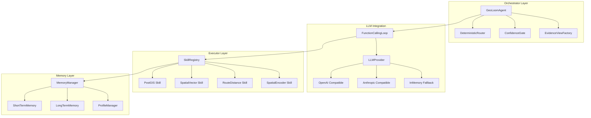
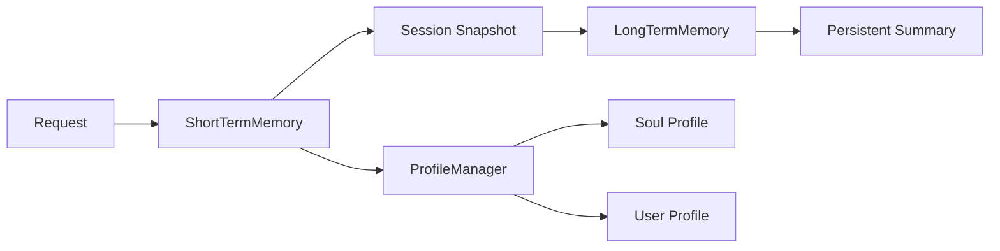

GeoLoomAgent 是 GeoLoom V4 系统的智能编排引擎，承担意图识别、技能调度、证据聚合与响应生成的核心职责。该模块采用 **Orchestrator-Executor（编排器-执行器）架构模式**，通过解耦 LLM 推理层与技能执行层，实现了可靠的空间查询能力与灵活的模型替换机制。

Sources: [GeoLoomAgent.ts](backend/src/agent/GeoLoomAgent.ts#L320-L356)

## 核心架构设计

### Orchestrator-Executor 模式

GeoLoomAgent 作为编排器（Orchestrator），负责协调整个对话流程的生命周期管理。技能系统作为执行器（Executor），提供原子化的空间计算能力。这种设计将 **LLM 推理决策** 与 **确定性业务逻辑** 分离，确保即使 LLM 服务不可用时，系统仍能通过确定性路径提供基本服务。



Sources: [GeoLoomAgent.ts](backend/src/agent/GeoLoomAgent.ts#L1-L42), [FunctionCallingLoop.ts](backend/src/llm/FunctionCallingLoop.ts#L1-L93)

### 请求处理生命周期

GeoLoomAgent 的 `handle` 方法定义了完整的请求处理流水线，包含七个关键阶段：

| 阶段 | 职责 | SSE 事件 |
|------|------|----------|
| **intent** | 意图分类与锚点解析 | `intent_preview` |
| **memory** | 会话上下文加载 | `thinking` |
| **tool_select** | 技能调用规划 | `thinking` |
| **tool_run** | 技能执行与追踪 | `thinking` + `trace` |
| **evidence** | 证据视图构建 | `boundary`, `spatial_clusters` |
| **answer** | 响应渲染 | `pois` |
| **done** | 完成统计输出 | `stats`, `refined_result` |

Sources: [GeoLoomAgent.ts](backend/src/agent/GeoLoomAgent.ts#L399-L661)

## 关键组件详解

### 函数调用循环机制

`FunctionCallingLoop` 实现了 ReAct（Reasoning + Acting）模式的核心循环，通过最大轮次限制防止无限循环：

```typescript
export async function runFunctionCallingLoop<TResult = unknown>(
  options: FunctionCallingLoopOptions<TResult>,
): Promise<FunctionCallingLoopResult> {
  const traces: ToolExecutionTrace[] = []
  const seenFingerprints = new Set<string>()
  const maxRounds = options.maxRounds || 4

  for (let round = 0; round < maxRounds; round += 1) {
    const response = normalizeResponse(await options.provider.complete({
      messages,
      tools: options.tools,
    }))
    // 检测重复调用以防止循环
    // ...
  }
}
```

关键特性包括：
- **去重机制**：通过函数调用签名的 JSON 指纹检测重复工具调用
- **工具结果注入**：每次工具执行后，结果作为 `tool` 角色消息追加到上下文
- **优雅降级**：LLM 服务异常时自动切换到 `InMemoryLLMProvider`

Sources: [FunctionCallingLoop.ts](backend/src/llm/FunctionCallingLoop.ts#L37-L93)

### 技能注册与调度

`SkillRegistry` 采用**中心化注册**模式管理所有技能实例：

```typescript
export class SkillRegistry {
  private readonly skills = new Map<string, SkillDefinition>()

  register(skill: SkillDefinition) {
    if (this.skills.has(skill.name)) {
      throw new AppError('duplicate_skill', ...)
    }
    this.skills.set(skill.name, skill)
  }

  list(): SkillSummary[] {
    return [...this.skills.values()].map((skill) => ({
      name: skill.name,
      actions: Object.values(skill.actions),
    }))
  }
}
```

技能定义遵循统一的接口契约：

```typescript
export interface SkillDefinition {
  name: string
  description: string
  actions: Record<string, SkillActionDefinition>
  capabilities: string[]
  getStatus?(): Promise<Record<string, DependencyStatus>>
  execute(
    action: string,
    payload: unknown,
    context: SkillExecutionContext,
  ): Promise<SkillExecutionResult<any>>
}
```

Sources: [SkillRegistry.ts](backend/src/skills/SkillRegistry.ts#L1-L37), [types.ts](backend/src/skills/types.ts#L47-L58)

### 置信度门控机制

`ConfidenceGate` 在响应渲染前进行**确定性质量评估**：

```typescript
evaluate(input: {
  anchorResolved: boolean
  evidenceCount: number
  hasConflict: boolean
}): ConfidenceDecision {
  if (!input.anchorResolved) {
    return { status: 'clarify', reason: 'unresolved_anchor' }
  }
  if (input.hasConflict) {
    return { status: 'clarify', reason: 'conflicting_evidence' }
  }
  if (input.evidenceCount <= 0) {
    return { status: 'degraded', reason: 'insufficient_evidence' }
  }
  return { status: 'allow', reason: 'ok' }
}
```

该机制确保只有满足质量标准的响应才会被推送给用户，低于阈值的请求会触发澄清流程或降级响应。

Sources: [ConfidenceGate.ts](backend/src/agent/ConfidenceGate.ts#L1-L39)

### 证据视图工厂

`EvidenceViewFactory` 根据查询类型动态选择视图构建策略：

```typescript
if (input.intent.queryType === 'compare_places' && input.secondaryAnchor && input.pairs) {
  return buildComparisonView({ anchor, secondaryAnchor, intent, pairs })
}
if (input.intent.queryType === 'similar_regions') {
  return buildSemanticCandidateView({ anchor, intent, items })
}
if (input.intent.queryType === 'nearest_station') {
  return buildTransportView({ anchor, rows, intent })
}
if (input.intent.queryType === 'area_overview') {
  return buildAreaOverviewView({ anchor, rows, intent, areaInsight })
}
return buildPOIListView({ anchor, rows, intent })
```

支持的证据视图类型包括：POI 列表、交通站点、区域概览、分类桶、对比视图和语义候选视图。

Sources: [EvidenceViewFactory.ts](backend/src/evidence/EvidenceViewFactory.ts#L9-L67)

### 存活提示构建器

`AlivePromptBuilder` 动态组装系统提示词，整合会话记忆、技能契约和用户画像：

```typescript
build(input: {
  sessionId: string
  profiles: ProfilesSnapshot
  memory: Pick<MemorySnapshot, 'summary' | 'recentTurns'>
  skillSnippets: string[]
}) {
  return [
    '你是 GeoLoom V4 的空间智能助手。',
    '【Agent Contract】模型负责思考和编排，skills 负责提供真实空间证据。',
    '【Soul】',
    input.profiles.soul.trim(),
    '【Conversation Memory】',
    input.memory.summary || '当前没有可复用的历史摘要。',
    '【Skill Contracts】',
    ...input.skillSnippets.map((snippet) => `- ${snippet}`),
  ].join('\n')
}
```

Sources: [AlivePromptBuilder.ts](backend/src/agent/AlivePromptBuilder.ts#L1-L43)

## 记忆系统架构

GeoLoomAgent 采用**三层记忆架构**：



- **ShortTermMemory**：会话级记忆，存储最近交互轮次
- **LongTermMemory**：持久化摘要，支持夸会话上下文复用
- **ProfileManager**：人格配置（soul.md）和用户画像（user.md）管理

Sources: [MemoryManager.ts](backend/src/memory/MemoryManager.ts#L1-L62)

## 工具模式与工具 Schema 构建

`toolSchemaBuilder` 将技能注册信息转换为 LLM 可理解的工具定义：

```typescript
export function buildToolSchemas(input: {
  skills: SkillDefinition[]
  manifests: SkillManifest[]
}): ToolSchema[] {
  return input.skills.map((skill) => {
    const manifest = input.manifests.find(
      (item) => item.runtimeSkill === skill.name
    )
    return {
      name: skill.name,
      description: manifest?.description || skill.description,
      inputSchema: {
        type: 'object',
        required: ['action', 'payload'],
        properties: {
          action: { type: 'string', enum: allowedActions },
          payload: { type: 'object', additionalProperties: true },
        },
      },
    }
  })
}
```

Sources: [toolSchemaBuilder.ts](backend/src/llm/toolSchemaBuilder.ts#L1-L35)

## 确定性降级恢复机制

GeoLoomAgent 实现了**双重保障**的容错设计：

1. **LLM 服务降级**：检测到 LLM 异常时，自动切换到 `InMemoryLLMProvider`（内存模拟模式）
2. **证据兜底恢复**：当 LLM 未生成有效空间证据时，触发确定性 SQL 兜底流程

```typescript
private async recoverCoreSpatialEvidenceIfNeeded(input) {
  const needsDeterministicSql = !this.hasAlignedCorePostgisEvidence(intent, state)
    && ['nearby_poi', 'nearest_station', 'compare_places', 'area_overview'].includes(intent.queryType)

  if (needsDeterministicSql) {
    // 执行确定性 SQL 模板
    await this.executeToolCall({
      id: `fallback_core_sql_${state.toolCalls.length + 1}`,
      name: 'postgis',
      arguments: { action: 'execute_spatial_sql', payload: { template: 'nearby_poi' } }
    }, intent, state, context)
  }
}
```

Sources: [GeoLoomAgent.ts](backend/src/agent/GeoLoomAgent.ts#L1222-L1363)

## 会话与状态管理

`SessionManager` 负责会话的生命周期管理，支持请求级别的会话绑定：

```typescript
export class SessionManager {
  async getOrCreate(input: { requestId: string, sessionId?: string }): Promise<SessionRecord> {
    const sessionId = input.sessionId || `sess_${randomUUID()}`
    const snapshot = await this.options.memory.getSnapshot(sessionId)
    const createdAt = snapshot.turns[0]?.createdAt || now
    return { id: sessionId, requestId: input.requestId, createdAt, updatedAt: now }
  }
}
```

`AgentTurnState` 跟踪单轮请求的完整执行状态：

```typescript
export interface AgentTurnState {
  requestId: string
  traceId: string
  sessionId: string
  toolCalls: ToolExecutionTrace[]
  anchors: Partial<Record<string, ResolvedAnchor>>
  evidenceView?: EvidenceView
  sqlValidationAttempts: number
  sqlValidationPassed: number
}
```

Sources: [SessionManager.ts](backend/src/agent/SessionManager.ts#L1-L41), [types.ts](backend/src/agent/types.ts#L36-L45)

## 指标与健康监控

GeoLoomAgent 集成了运行时指标收集，支持请求级别的性能追踪：

```typescript
private recordRequestMetrics(input: {
  startedAt: number
  state: AgentTurnState
  answer: string
  evidenceView?: EvidenceView
}) {
  this.metrics.recordRequest({
    latencyMs: Date.now() - input.startedAt,
    sqlValidated: input.state.sqlValidationAttempts > 0,
    sqlAccepted: input.state.sqlValidationAttempts === input.state.sqlValidationPassed,
    answerGrounded: this.isAnswerGrounded(input.answer, input.evidenceView),
  })
}
```

`getHealth` 方法聚合所有依赖组件的健康状态：

Sources: [GeoLoomAgent.ts](backend/src/agent/GeoLoomAgent.ts#L1472-L1485), [GeoLoomAgent.ts](backend/src/agent/GeoLoomAgent.ts#L366-L397)

## 下一步阅读

- [函数调用循环机制](5-han-shu-diao-yong-xun-huan-ji-zhi) — 深入了解 ReAct 模式的实现细节
- [技能注册与调度系统](6-ji-neng-zhu-ce-yu-diao-du-xi-tong) — 掌握技能系统的扩展机制
- [确定性路由解析器](13-que-ding-xing-lu-you-jie-xi-qi) — 理解意图分类的实现