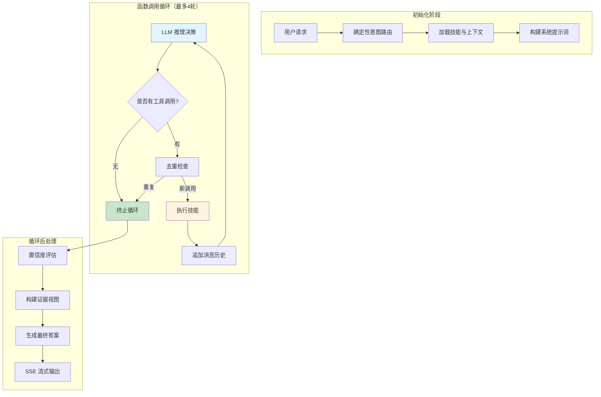
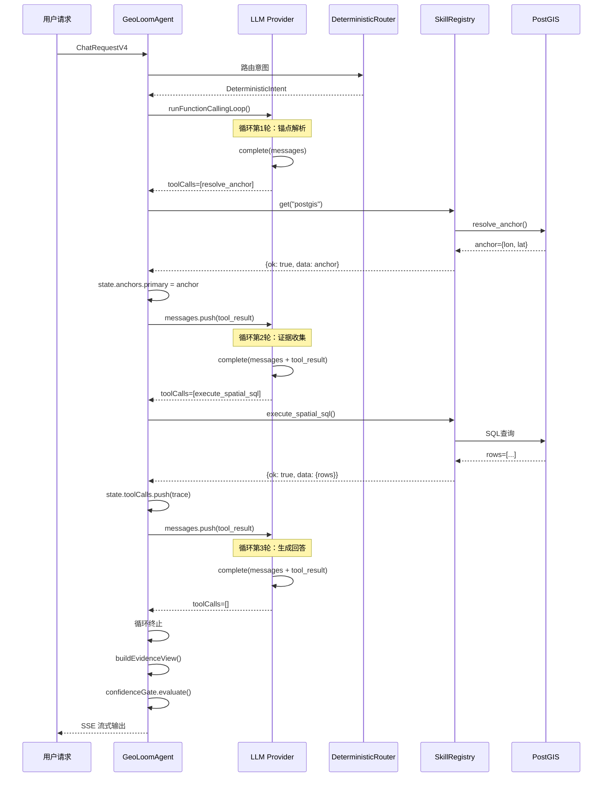
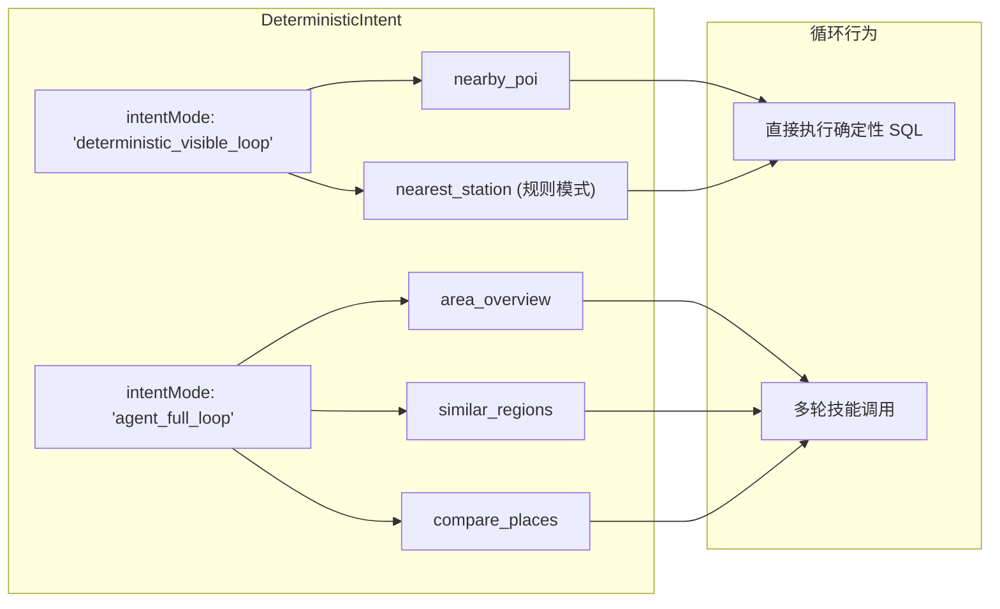

本文档详细阐述 GeoLoom Agent 的核心执行范式——**函数调用循环（Function Calling Loop）**。该机制是连接大语言模型决策能力与空间技能执行的桥梁，通过多轮交互循环实现复杂地理空间问题的自主求解。

## 架构概览

函数调用循环是 GeoLoom Agent 的核心执行引擎，其设计遵循 ReAct（Reasoning + Acting）范式。系统通过循环迭代，让 LLM 逐步规划、执行技能操作，直到累积足够证据生成最终答案。



**核心交互流程**：[LLM 推理决策](5-han-shu-diao-yong-xun-huan-ji-zhi) → [技能执行](6-ji-neng-zhu-ce-yu-diao-du-xi-tong) → 结果注入 → 重复直到终止

Sources: [FunctionCallingLoop.ts](backend/src/llm/FunctionCallingLoop.ts#L1-L94), [GeoLoomAgent.ts](backend/src/agent/GeoLoomAgent.ts#L510-L562)

---

## 核心组件

### 1. 函数调用循环引擎

`runFunctionCallingLoop` 函数是循环机制的核心实现，位于 `backend/src/llm/FunctionCallingLoop.ts`：

```typescript
export async function runFunctionCallingLoop<TResult = unknown>(
  options: FunctionCallingLoopOptions<TResult>,
): Promise<FunctionCallingLoopResult> {
  const traces: ToolExecutionTrace[] = []
  const messages = [...options.messages]
  const seenFingerprints = new Set<string>()
  const maxRounds = options.maxRounds || 4

  for (let round = 0; round < maxRounds; round += 1) {
    const response = normalizeResponse(await options.provider.complete({
      messages,
      tools: options.tools,
    }))

    if (response.toolCalls.length === 0) {
      return { assistantMessage: response.assistantMessage, traces }
    }

    messages.push({
      role: 'assistant',
      content: response.assistantMessage.content,
      toolCalls: response.assistantMessage.toolCalls,
    })

    for (const call of response.toolCalls) {
      const fingerprint = JSON.stringify({
        name: call.name,
        arguments: call.arguments,
      })

      if (seenFingerprints.has(fingerprint)) {
        return { assistantMessage: response.assistantMessage, traces }
      }
      seenFingerprints.add(fingerprint)

      const toolResult = await options.onToolCall(call)
      traces.push(toolResult.trace)
      messages.push({
        role: 'tool',
        name: call.name,
        toolCallId: call.id,
        content: toolResult.content,
      })
    }
  }

  return { assistantMessage: null, traces }
}
```

**关键设计决策**：

| 特性 | 实现方式 | 作用 |
|------|----------|------|
| 循环上限 | `maxRounds`（默认4） | 防止无限循环 |
| 自然终止 | 检测 `toolCalls.length === 0` | LLM 返回最终回答时停止 |
| 去重机制 | `seenFingerprints` Set | 跳过重复调用，防止死循环 |
| 消息历史 | 累积到 `messages` 数组 | 为每轮 LLM 调用提供完整上下文 |

Sources: [FunctionCallingLoop.ts](backend/src/llm/FunctionCallingLoop.ts#L37-L93)

### 2. 工具调用请求结构

LLM 返回的工具调用请求遵循统一格式：

```typescript
interface ToolCallRequest {
  id: string                          // 唯一标识符
  name: string                        // 技能名称：'postgis' | 'spatial_vector' | 'route_distance' | 'spatial_encoder'
  arguments: {
    action: string                    // 技能内的具体动作
    payload: Record<string, unknown>  // 动作参数
  }
}
```

**工具模式示例**：

```json
{
  "id": "call_resolve_anchor",
  "name": "postgis",
  "arguments": {
    "action": "resolve_anchor",
    "payload": {
      "place_name": "武汉大学",
      "role": "primary"
    }
  }
}
```

Sources: [types.ts](backend/src/llm/types.ts#L14-L18)

### 3. LLM Provider 接口

循环引擎通过抽象的 `LLMProvider` 接口支持多种 LLM 后端：

```typescript
export interface LLMProvider {
  getStatus(): LLMProviderStatus
  isReady(): boolean
  complete(request: LLMCompletionRequest): Promise<LLMResponse>
}
```

**支持的 Provider 实现**：

| Provider | 用途 | 特性 |
|----------|------|------|
| `OpenAICompatibleProvider` | OpenAI 兼容 API | 生产环境主力 |
| `AnthropicCompatibleProvider` | Claude API | 支持 content blocks |
| `InMemoryLLMProvider` | 本地模拟 | 测试/降级模式 |

Sources: [types.ts](backend/src/llm/types.ts#L55-L59)

---

## 循环执行流程

### 完整执行序列



### 循环轮次详解

#### 第1轮：意图识别与锚点解析

当用户询问"武汉大学附近有哪些咖啡店"时：

1. **LLM 决策**：识别需要先解析地点坐标
2. **调用**：`postgis.resolve_anchor({ place_name: "武汉大学" })`
3. **结果**：返回 `{ lon: 114.364339, lat: 30.536334 }`
4. **状态更新**：`state.anchors.primary = resolved_anchor`

Sources: [GeoLoomAgent.ts](backend/src/agent/GeoLoomAgent.ts#L743-L848)

#### 第2轮：空间数据查询

基于解析的锚点，LLM 决定查询 POI 数据：

1. **LLM 决策**：需要查询指定类别的设施
2. **调用**：`postgis.execute_spatial_sql({ sql: "...", template: "nearby_poi" })`
3. **结果**：返回符合条件的 POI 列表
4. **状态更新**：`state.toolCalls.push(trace)`

#### 第3轮：置信度评估

LLM 检查已有证据是否足够：

1. **证据检查**：已收集锚点和 POI 数据
2. **决策**：证据充分，可以生成回答
3. **调用**：无（`toolCalls = []`）
4. **循环终止**：进入后处理阶段

Sources: [GeoLoomAgent.ts](backend/src/agent/GeoLoomAgent.ts#L576-L580)

---

## 技能执行机制

### 技能注册与查找

技能通过 `SkillRegistry` 统一管理：

```typescript
export class SkillRegistry {
  private readonly skills = new Map<string, SkillDefinition>()

  register(skill: SkillDefinition) {
    if (this.skills.has(skill.name)) {
      throw new AppError('duplicate_skill', `Skill "${skill.name}" is already registered`, 400)
    }
    this.skills.set(skill.name, skill)
  }

  get(name: string) {
    return this.skills.get(name) || null
  }
}
```

Sources: [SkillRegistry.ts](backend/src/skills/SkillRegistry.ts#L1-L35)

### 技能定义接口

```typescript
export interface SkillDefinition {
  name: string
  description: string
  actions: Record<string, SkillActionDefinition>
  capabilities: string[]
  getStatus?(): Promise<Record<string, DependencyStatus>> | Record<string, DependencyStatus>
  execute(
    action: string,
    payload: unknown,
    context: SkillExecutionContext,
  ): Promise<SkillExecutionResult<any>>
}
```

Sources: [types.ts](backend/src/skills/types.ts#L47-L58)

### PostGIS 技能执行示例

```typescript
async execute(action, payload, _context: SkillExecutionContext): Promise<SkillExecutionResult> {
  switch (action) {
    case 'resolve_anchor':
      return resolveAnchorAction(payload as { place_name: string, role?: string }, {
        searchCandidates: options.searchCandidates,
      })
    case 'execute_spatial_sql':
      return executeSpatialSQLAction(payload as { sql: string }, {
        sandbox: options.sandbox,
        query: options.query,
      })
    default:
      return { ok: false, error: { code: 'unknown_action', message: `Unknown postgis action "${action}"` }, meta: { action, audited: false } }
  }
}
```

Sources: [PostGISSkill.ts](backend/src/skills/postgis/PostGISSkill.ts#L108-L139)

---

## 去重与循环控制

### 指纹计算机制

每次工具调用前，系统计算调用指纹用于去重：

```typescript
const fingerprint = JSON.stringify({
  name: call.name,
  arguments: call.arguments,
})

if (seenFingerprints.has(fingerprint)) {
  return { assistantMessage: response.assistantMessage, traces }
}
seenFingerprints.add(fingerprint)
```

**去重逻辑解决的问题**：
- LLM 重复请求相同查询
- 多轮对话中上下文累积导致的重复决策
- 防止技能执行中的无限递归

Sources: [FunctionCallingLoop.ts](backend/src/llm/FunctionCallingLoop.ts#L64-L76)

### 最大轮次限制

```typescript
const maxRounds = options.maxRounds || 4

for (let round = 0; round < maxRounds; round += 1) {
  // 循环体
}
```

| 场景 | 轮次消耗 | 原因 |
|------|----------|------|
| 简单查询（单步完成） | 1 轮 | 无工具调用，自然终止 |
| 标准 POI 查询 | 2-3 轮 | 锚点解析 → 数据查询 → 回答生成 |
| 复杂区域洞察 | 4 轮 | 多个模板 SQL 查询，触发上限 |

---

## 降级与容错

### LLM 调用失败处理

当 LLM 调用异常时，系统自动切换到内存模式：

```typescript
try {
  execution = await runFunctionCallingLoop({
    provider: activeProvider,
    tools,
    maxRounds: 4,
    messages: [systemPrompt, userMessage],
    onToolCall: async (call) => { /* ... */ },
  })
} catch (error) {
  if (error instanceof ToolExecutionAbortError) {
    throw error
  }
  // 降级到 InMemoryLLMProvider
  execution = await runFunctionCallingLoop({
    provider: new InMemoryLLMProvider(),
    tools,
    maxRounds: 4,
    messages: [systemPrompt, userMessage],
    onToolCall: async (call) => { /* 继续执行工具调用 */ },
  })
}
```

Sources: [GeoLoomAgent.ts](backend/src/agent/GeoLoomAgent.ts#L533-L562)

### 意图模式与循环模式映射



**两种模式对比**：

| 模式 | intentMode | 特点 | 典型场景 |
|------|------------|------|----------|
| 确定性可见循环 | `deterministic_visible_loop` | 快速响应，LLM 仅做摘要 | 附近设施查询 |
| 智能体完整循环 | `agent_full_loop` | 深度推理，多轮技能调用 | 区域洞察、相似片区 |

Sources: [DeterministicRouter.ts](backend/src/chat/DeterministicRouter.ts#L217-L382)

---

## 消息历史管理

### 消息累积结构

循环过程中，消息历史按以下结构累积：

```
messages: [
  { role: 'system', content: '你是一个地理空间助手...' },
  { role: 'user', content: '武汉大学附近有哪些咖啡店？' },
  // --- 第1轮 ---
  { role: 'assistant', toolCalls: [...], content: null },
  { role: 'tool', name: 'postgis', toolCallId: 'call_1', content: '{"anchor": {...}}' },
  // --- 第2轮 ---
  { role: 'assistant', toolCalls: [...], content: null },
  { role: 'tool', name: 'postgis', toolCallId: 'call_2', content: '{"rows": [...]}' },
  // --- 第3轮 ---
  { role: 'assistant', content: '根据查询结果...', toolCalls: [] },
]
```

### 测试用例验证

```typescript
it('replays the full assistant tool-call message back into history before the next round', async () => {
  const provider = {
    complete: vi.fn()
      .mockImplementationOnce(async ({ messages }) => {
        // 第1轮：检查初始消息
        expect(messages).toHaveLength(2)
        return { assistantMessage: { toolCalls: [...] }, ... }
      })
      .mockImplementationOnce(async ({ messages }) => {
        // 第2轮：检查累积的消息历史
        expect(messages).toHaveLength(4)
        expect(messages[2]).toMatchObject({ role: 'assistant', toolCalls: [...] })
        expect(messages[3]).toMatchObject({ role: 'tool', ... })
        return { assistantMessage: { content: '总结', toolCalls: [] }, ... }
      }),
  }
  // ...
})
```

Sources: [FunctionCallingLoop.spec.ts](backend/tests/unit/llm/FunctionCallingLoop.spec.ts#L6-L117)

---

## 置信度评估

循环结束后，`ConfidenceGate` 评估证据是否足以生成可靠回答：

```typescript
export class ConfidenceGate {
  evaluate(input: {
    anchorResolved: boolean
    evidenceCount: number
    hasConflict: boolean
  }): ConfidenceDecision {
    if (!input.anchorResolved) {
      return { status: 'clarify', reason: 'unresolved_anchor', message: '请补充更具体的地点。' }
    }
    if (input.hasConflict) {
      return { status: 'clarify', reason: 'conflicting_evidence', message: '证据存在冲突。' }
    }
    if (input.evidenceCount <= 0) {
      return { status: 'degraded', reason: 'insufficient_evidence', message: '证据不足...' }
    }
    return { status: 'allow', reason: 'ok', message: null }
  }
}
```

Sources: [ConfidenceGate.ts](backend/src/agent/ConfidenceGate.ts#L1-L39)

---

## 工具调用追踪

每次技能执行都会生成 `ToolExecutionTrace` 用于追踪：

```typescript
export interface ToolExecutionTrace {
  id: string
  skill: string          // 'postgis' | 'spatial_vector' | ...
  action: string         // 'resolve_anchor' | 'execute_spatial_sql' | ...
  status: 'planned' | 'running' | 'done' | 'error'
  error_kind?: 'execution_exception' | 'tool_result_error' | null
  payload: Record<string, unknown>
  result?: unknown
  error?: string | null
  latency_ms?: number
}
```

Sources: [types.ts](backend/src/chat/types.ts#L209-L219)

---

## 配置与扩展

### 循环配置参数

| 参数 | 默认值 | 说明 |
|------|--------|------|
| `maxRounds` | 4 | 最大循环轮次 |
| 系统提示词 | 动态构建 | 包含技能描述、记忆摘要、用户画像 |

### 添加新技能

1. 在 `backend/src/skills/` 下创建技能目录
2. 实现 `SkillDefinition` 接口
3. 在应用启动时注册到 `SkillRegistry`

**技能注册示例**：

```typescript
const registry = new SkillRegistry()
registry.register(createPostgisSkill({ sandbox, query, searchCandidates }))
registry.register(createSpatialVectorSkill({ index, encoder }))
registry.register(createRouteDistanceSkill({ router }))
registry.register(createSpatialEncoderSkill({ encoder }))
```

Sources: [GeoLoomAgent.ts](backend/src/agent/GeoLoomAgent.ts#L320-L356)

---

## 总结

函数调用循环机制是 GeoLoom Agent 实现智能地理空间问答的核心范式。其关键设计包括：

1. **多轮迭代推理**：通过循环让 LLM 逐步规划技能调用
2. **统一工具接口**：标准化技能调用结构，支持多种后端
3. **智能终止控制**：通过去重、轮次限制、自然终止确保可靠性
4. **优雅降级**：LLM 异常时自动切换到确定性模式

该机制成功平衡了**灵活性**（支持复杂多步骤推理）与**可靠性**（防止无限循环），为地理空间智能应用提供了坚实的技术基础。

---

**延伸阅读**：
- [GeoLoomAgent 智能体核心](4-geoloomagent-zhi-neng-ti-he-xin) - Agent 整体架构
- [技能注册与调度系统](6-ji-neng-zhu-ce-yu-diao-du-xi-tong) - 技能系统详解
- [PostGIS 空间数据库技能](7-postgis-kong-jian-shu-ju-ku-ji-neng) - 主力技能实现