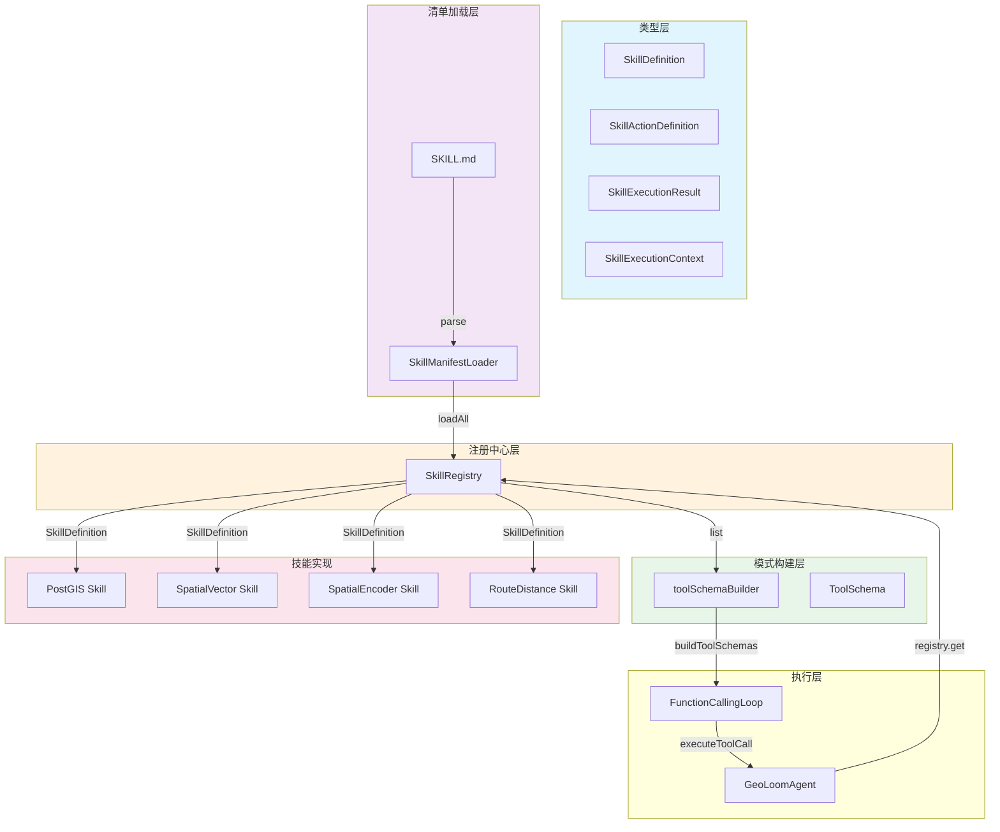
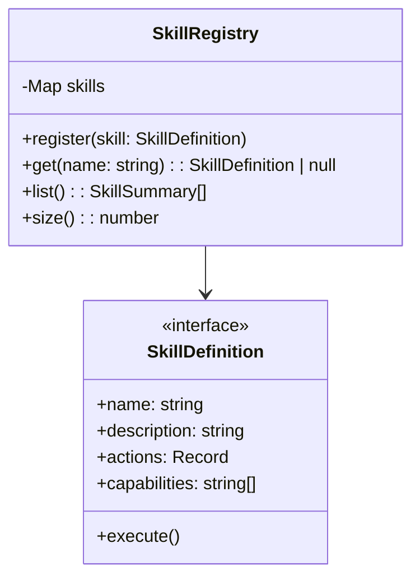
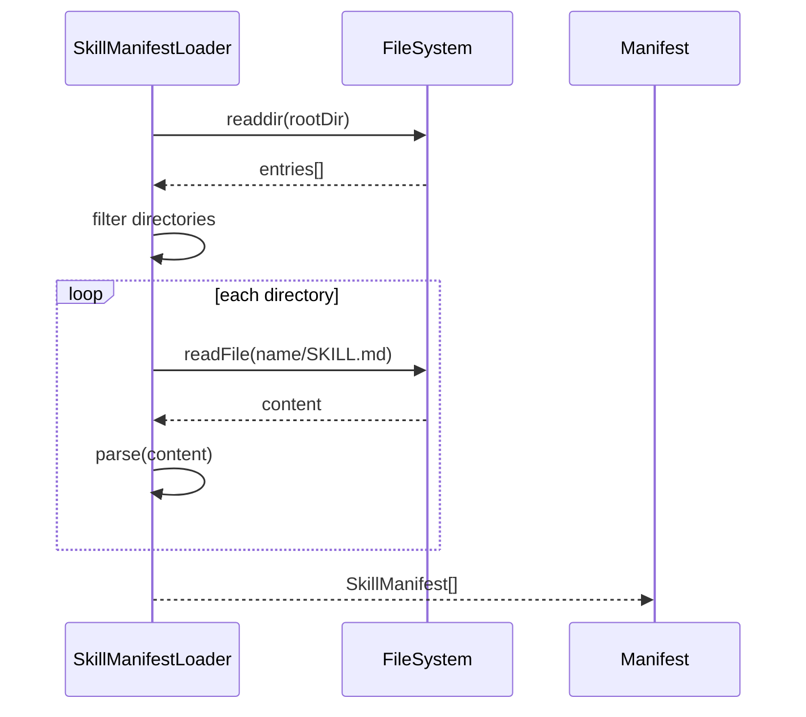
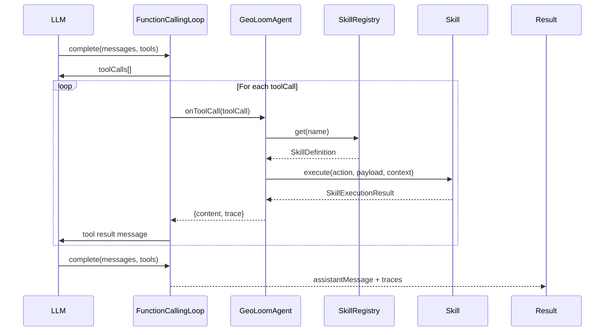

技能注册与调度系统是 GeoLoomAgent 的核心能力基础设施，负责将地理空间智能分解为可组合、可调度的功能单元。该系统采用**注册中心模式**结合**清单驱动**机制，实现了技能的热插拔式扩展和 LLM 函数调用协议的透明映射。

## 核心架构组件

技能系统由四个核心模块构成，它们之间形成清晰的单向依赖关系：**类型定义** → **注册中心** → **清单加载器** → **工具模式构建器**。



### 类型体系（types.ts）

技能系统的类型定义采用 **interface 组合模式**，将技能的能力描述、执行结果和执行上下文解耦为独立接口。

```typescript
// SkillDefinition - 技能核心接口
export interface SkillDefinition {
  name: string
  description: string
  actions: Record<string, SkillActionDefinition>
  capabilities: string[]
  getStatus?(): Promise<Record<string, DependencyStatus>>
  execute(
    action: string,
    payload: unknown,
    context: SkillExecutionContext,
  ): Promise<SkillExecutionResult<any>>
}

// SkillActionDefinition - 动作描述接口
export interface SkillActionDefinition {
  name: string
  description: string
  inputSchema: JsonSchema
  outputSchema: JsonSchema
}

// SkillExecutionResult - 执行结果包装
export interface SkillExecutionResult<TData = any> {
  ok: boolean
  data?: TData
  error?: SkillError
  meta: SkillExecutionMeta
}
```

类型体系的层次设计使得每个技能只需关注自身的业务逻辑，而无需关心执行上下文的创建和追踪机制。

Sources: [backend/src/skills/types.ts](backend/src/skills/types.ts#L1-L66)

## 注册中心机制

### SkillRegistry（注册中心）

注册中心采用 **Map 存储 + 工厂方法** 模式，提供技能的注册、查询和列举功能。



注册方法通过**唯一性约束**防止同名技能重复注册：

```typescript
register(skill: SkillDefinition) {
  if (this.skills.has(skill.name)) {
    throw new AppError(
      'duplicate_skill',
      `Skill "${skill.name}" is already registered`,
      400,
    )
  }
  this.skills.set(skill.name, skill)
}
```

查询方法返回空值而非抛出异常，保持调用方的灵活性：

```typescript
get(name: string) {
  return this.skills.get(name) || null
}
```

Sources: [backend/src/skills/SkillRegistry.ts](backend/src/skills/SkillRegistry.ts#L1-L37)

## 清单加载机制

### SkillManifestLoader（清单加载器）

清单加载器负责从 SKILL.md 文件中解析技能元数据，为 LLM 提供可读的技能提示词片段。



清单格式采用 **YAML 前置元数据 + Markdown 正文** 的混合结构：

```markdown
---
name: postgis
runtimeSkill: postgis
description: 只读空间事实技能
actions: get_schema_catalog, resolve_anchor, validate_spatial_sql, execute_spatial_sql
capabilities: catalog, anchor_resolution, sql_validation, sql_execution
---

# PostGIS Skill

## Prompt
只读空间事实技能。优先用于锚点解析、合法 SQL 校验...
```

解析器通过状态机识别元数据区和 Prompt 区：

```typescript
private parse(path: string, content: string): SkillManifest {
  // 状态机：inMeta / inPrompt
  for (const line of sections) {
    if (trimmed === '---') {
      inMeta = !inMeta  // 切换元数据区
      continue
    }
    
    if (inMeta) {
      // 解析 key: value
      const separator = trimmed.indexOf(':')
      const key = trimmed.slice(0, separator).trim()
      const value = trimmed.slice(separator + 1).trim()
      metadata[key] = value
    }
    
    if (/^##\s+Prompt/i.test(trimmed)) {
      inPrompt = true  // 进入 Prompt 区
    }
  }
}
```

Sources: [backend/src/skills/SkillManifestLoader.ts](backend/src/skills/SkillManifestLoader.ts#L1-L97)
Sources: [backend/SKILLS/PostGIS/SKILL.md](backend/SKILLS/PostGIS/SKILL.md#L1-L14)

## 技能执行上下文

### SkillExecutionContext（执行上下文）

执行上下文通过工厂函数创建，为每次技能调用注入**追踪标识**和**日志记录器**：

```typescript
export function createSkillExecutionContext(
  options: CreateSkillContextOptions = {},
): SkillExecutionContext {
  const traceId = options.traceId || randomUUID()
  const requestId = options.requestId || randomUUID()
  const logger = (options.logger || createLogger()).child({
    traceId,
    requestId,
    sessionId: options.sessionId || null,
  })
  
  return {
    traceId,
    requestId,
    sessionId: options.sessionId,
    logger,
  }
}
```

这种设计确保每个技能执行的日志都可以通过 traceId 串联，形成完整的请求链路视图。

Sources: [backend/src/skills/SkillContext.ts](backend/src/skills/SkillContext.ts#L1-L32)

## 技能调度流程

### LLM 函数调用循环

技能调度发生在函数调用循环（Function Calling Loop）中，这是技能系统与 LLM 交互的枢纽。



函数调用循环实现了**幂等性检测**机制，防止重复执行相同的工具调用：

```typescript
for (const call of response.toolCalls) {
  const fingerprint = JSON.stringify({
    name: call.name,
    arguments: call.arguments,
  })
  
  if (seenFingerprints.has(fingerprint)) {
    return { assistantMessage, traces }  // 跳过重复调用
  }
  seenFingerprints.add(fingerprint)
  
  const toolResult = await options.onToolCall(call)
  traces.push(toolResult.trace)
}
```

Sources: [backend/src/llm/FunctionCallingLoop.ts](backend/src/llm/FunctionCallingLoop.ts#L1-L94)

### 工具调用分发（executeToolCall）

Agent 的 executeToolCall 方法是技能调度的核心入口，负责从 SkillRegistry 获取技能实例并执行相应的动作：

```typescript
private async executeToolCall(call, intent, state, context) {
  const startedAt = Date.now()
  const skill = this.options.registry.get(call.name)  // 获取技能
  const payload = call.arguments.payload || {}
  const action = String(call.arguments.action || '')
  
  if (!skill) {
    // 技能未找到处理
    return { content: { ok: false }, trace: { status: 'error' } }
  }
  
  let result
  // 特殊路径：锚点合成（避免重复查询）
  if (call.name === 'postgis' && action === 'resolve_anchor' 
      && hasCoordinates(state.anchors.primary)) {
    result = { ok: true, data: { anchor: state.anchors.primary } }
  } else if (call.name === 'postgis' && action === 'execute_spatial_sql' 
             && payload.template) {
    // 模板化 SQL 执行路径
    result = await this.executePostgisTemplate(...)
  } else {
    // 标准技能执行路径
    result = await skill.execute(action, payload, context)
  }
  
  // 构建追踪记录
  const trace: ToolExecutionTrace = {
    id: call.id,
    skill: call.name,
    action,
    status: result.ok ? 'done' : 'error',
    result: result.data,
    latency_ms: Date.now() - startedAt,
  }
  
  state.toolCalls.push(trace)
  return { content: result.data, trace }
}
```

Sources: [backend/src/agent/GeoLoomAgent.ts](backend/src/agent/GeoLoomAgent.ts#L743-L848)

## 技能实现模式

### 技能工厂函数

所有技能都遵循**工厂函数模式**创建 SkillDefinition 实例，这种设计实现了依赖注入和配置分离：

```typescript
export function createPostgisSkill(options: CreatePostgisSkillOptions): SkillDefinition {
  return {
    name: 'postgis',
    description: 'V4 Phase 0-1 的最小 PostGIS skill 闭环',
    capabilities: ['catalog', 'anchor_resolution', 'sql_validation', 'sql_execution'],
    actions: postgisActions,
    async execute(action, payload, context) {
      switch (action) {
        case 'get_schema_catalog':
          return getSchemaCatalogAction(...)
        case 'resolve_anchor':
          return resolveAnchorAction(...)
        case 'validate_spatial_sql':
          return validateSpatialSQLAction(...)
        case 'execute_spatial_sql':
          return executeSpatialSQLAction(...)
        default:
          return { ok: false, error: { code: 'unknown_action' } }
      }
    },
  }
}
```

### 动作定义模式

每个动作通过 **SkillActionDefinition** 接口声明其输入输出模式：

```typescript
const actions: Record<string, SkillActionDefinition> = {
  resolve_anchor: {
    name: 'resolve_anchor',
    description: '离线规则 + POI 模糊检索的锚点解析',
    inputSchema: {
      type: 'object',
      required: ['place_name'],
      properties: {
        place_name: { type: 'string' },
        role: { type: 'string' },
      },
    },
    outputSchema: {
      type: 'object',
      properties: {
        anchor: { type: 'object' },
      },
    },
  },
}
```

Sources: [backend/src/skills/postgis/PostGISSkill.ts](backend/src/skills/postgis/PostGISSkill.ts#L100-L141)

## 技能注册流程

### 服务器启动时注册

技能在服务器启动时通过 registry.register() 方法完成注册：

```typescript
// backend/src/server.ts
const registry = new SkillRegistry()

// 创建技能实例并注册
registry.register(
  createPostgisSkill({
    catalog,
    sandbox,
    query: (sql, params, timeoutMs) => pool.query(sql, params, timeoutMs),
    searchCandidates: async (placeName, variants) => { ... },
    healthcheck: () => pool.healthcheck(),
  }),
)

registry.register(createSpatialEncoderSkill({ bridge: spatialEncoderBridge }))
registry.register(createSpatialVectorSkill({ index: spatialVectorIndex }))
registry.register(createRouteDistanceSkill({ bridge: routeBridge }))

// 传递给 Agent
const chat = new GeoLoomAgent({ registry, version, memory, sessionManager })
```

Sources: [backend/src/server.ts](backend/src/server.ts#L47-L141)

## 工具模式构建

### toolSchemaBuilder（工具模式构建器）

工具模式构建器将 SkillDefinition 转换为 LLM 可理解的 ToolSchema：

```typescript
export function buildToolSchemas(input: {
  skills: SkillDefinition[]
  manifests: SkillManifest[]
}): ToolSchema[] {
  return input.skills.map((skill) => {
    const manifest = input.manifests.find(
      (item) => item.runtimeSkill === skill.name
    )
    // 从清单中获取允许的动作列表
    const allowedActions = manifest?.actions?.length
      ? manifest.actions
      : Object.keys(skill.actions)
    
    return {
      name: skill.name,
      description: manifest?.description || skill.description,
      inputSchema: {
        type: 'object',
        required: ['action', 'payload'],
        properties: {
          action: {
            type: 'string',
            enum: allowedActions,  // 限制 LLM 可选择的动作
          },
          payload: {
            type: 'object',
            additionalProperties: true,
          },
        },
      },
    }
  })
}
```

Sources: [backend/src/llm/toolSchemaBuilder.ts](backend/src/llm/toolSchemaBuilder.ts#L1-L36)

## 技能路由 API

### REST API 端点

技能系统暴露了两个 HTTP 端点供外部调用：

| 端点 | 方法 | 描述 |
|------|------|------|
| `/api/geo/skills` | GET | 列举所有已注册技能 |
| `/api/geo/skills/:name/call` | POST | 直接调用指定技能的动作 |

```typescript
// GET /api/geo/skills
app.get('/skills', async () => ({
  skills: deps.registry.list(),
}))

// POST /api/geo/skills/:name/call
app.post('/skills/:name/call', async (request, reply) => {
  const skill = deps.registry.get(params.name)
  if (!skill) {
    return reply.code(404).send({ ok: false, error: 'skill_not_found' })
  }
  
  const result = await skill.execute(
    String(body.action || ''),
    body.payload || {},
    createSkillExecutionContext({ traceId, sessionId: body.session_id }),
  )
  
  return reply.code(result.ok ? 200 : 400).send({
    ok: result.ok,
    skill: params.name,
    action: body.action,
    data: result.data,
    trace_id: traceId,
    latency_ms: Date.now() - startedAt,
  })
})
```

Sources: [backend/src/routes/skills.ts](backend/src/routes/skills.ts#L1-L63)

## 现有技能一览

| 技能名称 | 职责描述 | 核心动作 |
|----------|----------|----------|
| **postgis** | PostGIS 空间数据库技能，负责锚点解析、SQL 校验和空间查询 | get_schema_catalog, resolve_anchor, validate_spatial_sql, execute_spatial_sql |
| **spatial_vector** | 空间向量检索技能，基于 FAISS 索引的语义召回 | search_semantic_pois, search_similar_regions |
| **spatial_encoder** | 空间编码器技能，负责 query/region 编码和相似度评分 | encode_query, encode_region, score_similarity |
| **route_distance** | 路径距离计算技能，基于 OSM 路网估算可达性 | get_route_distance, get_multi_destination_matrix |

Sources: [backend/src/skills/postgis/PostGISSkill.ts](backend/src/skills/postgis/PostGISSkill.ts#L100-L141)
Sources: [backend/src/skills/spatial_vector/SpatialVectorSkill.ts](backend/src/skills/spatial_vector/SpatialVectorSkill.ts#L1-L83)
Sources: [backend/src/skills/spatial_encoder/SpatialEncoderSkill.ts](backend/src/skills/spatial_encoder/SpatialEncoderSkill.ts#L1-L107)
Sources: [backend/src/skills/route_distance/RouteDistanceSkill.ts](backend/src/skills/route_distance/RouteDistanceSkill.ts#L1-L86)

## 总结与扩展建议

技能注册与调度系统通过清晰的接口契约和单向依赖关系，实现了高度解耦的技能扩展能力。系统支持两种扩展路径：

- **清单驱动扩展**：新增 `SKILLS/<Name>/SKILL.md` 文件，Agent 自动加载并纳入 LLM 函数调用选择范围
- **代码驱动扩展**：实现 SkillDefinition 接口并调用 `registry.register()`，适用于需要自定义依赖注入的场景

建议在后续迭代中考虑为技能系统增加**健康检查聚合**功能（已部分实现于 getHealth 方法中），以及对技能依赖关系的可视化追踪能力。

---

**继续阅读**：
- [函数调用循环机制](5-han-shu-diao-yong-xun-huan-ji-zhi) — 深入了解 LLM 与技能的交互模式
- [PostGIS 空间数据库技能](7-postgis-kong-jian-shu-ju-ku-ji-neng) — 掌握 PostGIS 技能的实现细节
- [确定性路由解析器](13-que-ding-xing-lu-you-jie-xi-qi) — 了解请求如何被路由到正确的技能组合