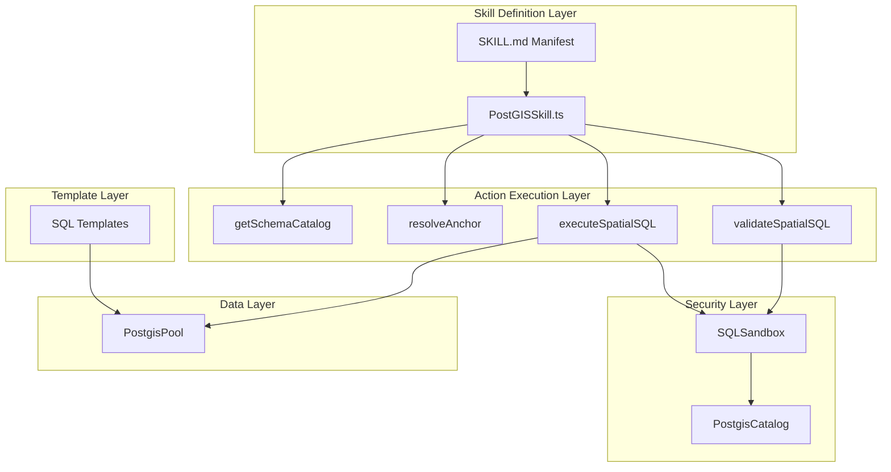
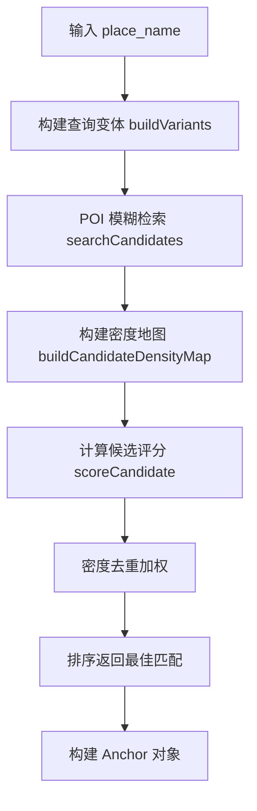
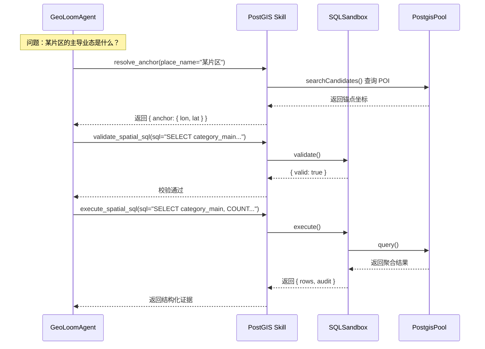

PostGIS 空间数据库技能是 GeoLoom Agent v4 Phase 0-1 阶段的核心只读空间事实技能，提供锚点解析、SQL 校验和模板化空间查询的闭环能力。该技能通过四层安全防护（白名单、AST 解析、空间谓词校验、执行时沙箱）确保查询安全，专为片区洞察分析场景优化。

## 技能架构概览

PostGIS 技能采用**依赖注入模式**构建，核心组件包括：技能定义层（PostGISSkill.ts）、动作执行层（actions 目录）、安全校验层（sqlSecurity.ts、SQLSandbox.ts）和模板层（templates 目录）。



Sources: [PostGISSkill.ts](backend/src/skills/postgis/PostGISSkill.ts#L1-L142), [SKILL.md](backend/SKILLS/PostGIS/SKILL.md#L1-L14)

## 核心动作定义

技能系统通过标准化接口暴露四个原子动作，每个动作具备独立的输入输出模式定义。

| 动作名称 | 功能描述 | 输入参数 | 输出结构 |
|---------|---------|---------|---------|
| `get_schema_catalog` | 返回 V4 允许访问的最小 schema 目录 | 无 | `{ tables, functions, maxLimit }` |
| `resolve_anchor` | 离线规则 + POI 模糊检索的锚点解析 | `place_name`, `role` | `{ anchor: AnchorObject }` |
| `validate_spatial_sql` | 执行 SQL 白名单、AST 和空间谓词校验 | `sql` | `{ valid, errors, meta }` |
| `execute_spatial_sql` | 执行经过校验的只读模板化 SQL | `sql` | `{ rows, meta, audit }` |

Sources: [PostGISSkill.ts](backend/src/skills/postgis/PostGISSkill.ts#L36-L98)

### 动作调度实现

技能执行器采用**策略模式**根据 action 参数分发到对应的处理函数，每个动作返回统一格式的 `SkillExecutionResult`。

```typescript
async execute(action, payload, _context: SkillExecutionContext): Promise<SkillExecutionResult> {
  switch (action) {
    case 'get_schema_catalog':
      return getSchemaCatalogAction({}, { catalog })
    case 'resolve_anchor':
      return resolveAnchorAction(payload as { place_name: string, role?: string }, {
        searchCandidates: options.searchCandidates,
      })
    case 'validate_spatial_sql':
      return validateSpatialSQLAction(payload as { sql: string }, {
        catalog,
        sandbox: options.sandbox,
      })
    case 'execute_spatial_sql':
      return executeSpatialSQLAction(payload as { sql: string }, {
        sandbox: options.sandbox,
        query: options.query,
      })
  }
}
```

Sources: [PostGISSkill.ts](backend/src/skills/postgis/PostGISSkill.ts#L108-L139)

## 锚点解析机制

锚点解析是地理空间查询的关键前置步骤，通过**多策略评分排序**从 POI 数据库中匹配最相关的地点实体。

### 解析流程



### 评分策略

评分算法综合考虑文本匹配度、类别一致性和空间密度三个维度：

```typescript
function scoreCandidate(candidate: AnchorCandidate, variants: string[], placeName: string) {
  const placeKind = inferPlaceKind(placeName)  // education | transport | scenic | generic
  const categoryTokens = getCategoryTokens(candidate)
  const match = getBestVariantMatch(candidate.name, variants)
  let score = match.score - (match.lengthGap * 2)

  if (placeKind === 'education') {
    if (isEducationCategory) score += 1000
    if (EDUCATION_SAME_ENTITY_SUFFIX_RE.test(matchedSuffix)) score += 1100
    // 降权子地点（教学楼、图书馆等）
    if (/(东门|西门|南门|北门|图书馆)/.test(candidate.name)) score -= 500
  }
  // 密度加权去重
  score += densityBonus
  return score
}
```

Sources: [resolveAnchor.ts](backend/src/skills/postgis/actions/resolveAnchor.ts#L151-L182)

### 地点类型推断

系统通过关键词匹配推断查询的地点类型，不同类型采用差异化的评分策略：

```typescript
function inferPlaceKind(placeName = '') {
  if (/(大学|学院|学校|校区|中学|小学|幼儿园|附中|高中|初中)/.test(placeName)) return 'education'
  if (/(地铁站|地铁口|火车站|高铁站|站)/.test(placeName)) return 'transport'
  if (/(公园|景区|广场)/.test(placeName)) return 'scenic'
  return 'generic'
}
```

Sources: [resolveAnchor.ts](backend/src/skills/postgis/actions/resolveAnchor.ts#L67-L72)

## SQL 安全沙箱

SQL 执行采用**五层安全防护**机制，从解析、语法、语义、执行和结果五个环节确保查询安全可控。

### 校验规则体系

| 校验层级 | 校验内容 | 违规处理 |
|---------|---------|---------|
| 语句类型 | 仅允许 SELECT 语句 | 拒绝非查询语句 |
| 关键词过滤 | 禁止 INSERT/UPDATE/DELETE/DROP/ALTER/TRUNCATE/CREATE | 阻止数据修改 |
| 列选择限制 | 禁止 SELECT * 全字段查询 | 强制显式列声明 |
| 空间谓词 | 非聚合查询必须包含 ST_DWithin/ST_Intersects/ST_Contains | 防止全表扫描 |
| 结果集限制 | 缺少 LIMIT 的明细查询需包含聚合函数 | 控制数据量上限 |
| 表/列/函数白名单 | 仅允许预定义目录中的元素 | 防止越权访问 |
| LIMIT 上限 | 最大返回行数限制（默认 200） | 截断超限结果 |

Sources: [SQLSandbox.ts](backend/src/sandbox/SQLSandbox.ts#L52-L134)

### AST 解析验证

使用 `pgsql-ast-parser` 库进行 SQL 语法树解析，确保语句结构的合法性：

```typescript
try {
  const ast = parse(normalizedSql)
  if (ast.length !== 1) {
    errors.push('Only one SQL statement is allowed')
  } else {
    const statement = ast[0] as { type?: string }
    if (statement.type !== 'select') {
      errors.push(`Only SELECT statements are allowed, received ${statement.type || 'unknown'}`)
    }
  }
} catch (error) {
  errors.push(error instanceof Error ? error.message : 'SQL parse error')
}
```

Sources: [SQLSandbox.ts](backend/src/sandbox/SQLSandbox.ts#L60-L72)

### 执行时保护

```typescript
async execute({ sql, executor }): Promise<SQLExecutionResult> {
  const validation = this.validate(sql)
  if (!validation.ok) {
    throw new AppError('sql_validation_failed', `SQL validation failed: ${validation.errors.join('; ')}`, 400, validation)
  }

  const execution = await executor({
    sql,
    timeoutMs: this.options.statementTimeoutMs,  // 3秒超时
  })

  const rows = execution.rows.slice(0, this.options.maxRows)  // 200行上限
  const truncated = execution.rows.length > rows.length

  return {
    rows,
    meta: { ...validation.meta, truncated, statementTimeoutMs },
    audit: { sqlHash: sha256(sql), rowCount: execution.rowCount },
  }
}
```

Sources: [SQLSandbox.ts](backend/src/sandbox/SQLSandbox.ts#L136-L168)

## 空间查询模板

技能提供七类预定义 SQL 模板，覆盖片区洞察分析的核心场景。

### 模板类型总览

| 模板名称 | 分析目的 | 关键输出 |
|---------|---------|---------|
| `area_category_histogram` | 业态分布统计 | 各主类别的 POI 数量直方图 |
| `area_ring_distribution` | 环形分布分析 | 0-300m/300-600m/600-900m/900m+ 分圈层统计 |
| `area_representative_sample` | 代表性样本提取 | 距锚点最近的 N 个 POI 详情 |
| `area_competition_density` | 竞争密度分析 | 按竞争维度聚合的密度指标 |
| `area_h3_hotspots` | 热点区域识别 | 基于网格的空间密度热力图数据 |
| `nearby_poi` | 周边 POI 查询 | 距离排序的周边兴趣点列表 |
| `nearest_station` | 最近站点检索 | 最近的地铁站及距离 |

Sources: [templates](backend/src/skills/postgis/templates)

### 核心模板示例

**环形分布查询** — 分析 POI 在不同距离圈层的空间分布：

```sql
SELECT
  CASE
    WHEN ST_Distance(geom::geography, {{POINT_GEOGRAPHY}}) < 300 THEN '0-300m'
    WHEN ST_Distance(geom::geography, {{POINT_GEOGRAPHY}}) < 600 THEN '300-600m'
    WHEN ST_Distance(geom::geography, {{POINT_GEOGRAPHY}}) < 900 THEN '600-900m'
    ELSE '900m+'
  END AS ring_label,
  COUNT(id) AS poi_count
FROM pois
WHERE ST_DWithin(geom::geography, {{POINT_GEOGRAPHY}}, {{RADIUS_M}})
{{CATEGORY_FILTER}}
GROUP BY ring_label, ring_order
ORDER BY ring_order ASC;
```

Sources: [areaRingDistribution.sql](backend/src/skills/postgis/templates/areaRingDistribution.sql#L1-L24)

**热点区域查询** — 使用 SquareGrid 网格化降维：

```sql
SELECT
  ST_AsText(grid.geom) AS grid_wkt,
  COUNT(p.id) AS poi_count
FROM ST_SquareGrid({{CELL_SIZE_DEG}}, ST_Buffer({{POINT_GEOGRAPHY}}, {{RADIUS_M}})::geometry) AS grid
LEFT JOIN pois p ON ST_Intersects(p.geom, grid.geom)
  AND ST_DWithin(p.geom::geography, {{POINT_GEOGRAPHY}}, {{RADIUS_M}})
{{CATEGORY_JOIN_FILTER}}
GROUP BY grid.geom
HAVING COUNT(p.id) > 0
ORDER BY poi_count DESC
LIMIT {{LIMIT}};
```

Sources: [areaH3Hotspots.sql](backend/src/skills/postgis/templates/areaH3Hotspots.sql#L1-L23)

## 数据模型与目录

### POI 表结构

技能白名单仅暴露 `pois` 表的核心字段：

```typescript
const catalog = {
  tables: {
    pois: [
      'id', 'name', 'category_main', 'category_sub',
      'longitude', 'latitude', 'city', 'region_label',
      'location_hint', 'brand_category', 'geom',
    ],
  },
  functions: [
    // 聚合函数
    'count', 'sum', 'avg', 'min', 'max',
    // 空间度量
    'st_dwithin', 'st_distance', 'st_setsrid', 'st_makepoint', 'st_x', 'st_y',
    // 空间关系
    'st_intersects', 'st_contains', 'st_buffer', 'st_astext', 'st_geomfromtext',
    // 网格函数
    'st_squaregrid', 'st_hexagongrid',
  ],
  requiredSpatialFunctions: ['st_dwithin', 'st_intersects', 'st_contains'],
  maxLimit: 200,
}
```

Sources: [sqlSecurity.ts](backend/src/skills/postgis/sqlSecurity.ts#L8-L48)

### 坐标系约定

所有地理坐标采用 **GCJ-02（国测局坐标系）**，空间函数调用需显式设置 SRID：

```typescript
ST_SetSRID(ST_MakePoint(longitude, latitude), 4326)::geography
```

Sources: [nearestStation.sql](backend/src/skills/postgis/templates/nearestStation.sql#L3-L5)

## 集成与初始化

PostGIS 技能在应用启动时通过依赖注入方式注册到技能注册表：

```typescript
const catalog = createPostgisCatalog()
const pool = new PostgisPool({ queryTimeoutMs: 5000 })
const sandbox = new SQLSandbox({
  catalog,
  maxRows: 200,
  statementTimeoutMs: 3000,
})

registry.register(
  createPostgisSkill({
    catalog,
    sandbox,
    query: (sql, params, timeoutMs) => pool.query(sql, params, timeoutMs),
    searchCandidates: async (placeName, variants) => {
      // 自适应查询逻辑：根据地点类型调整检索策略
    },
    healthcheck: () => pool.healthcheck(),
  }),
)
```

Sources: [server.ts](backend/src/server.ts#L38-L131)

### 数据库连接配置

连接参数通过环境变量或构造函数注入：

| 环境变量 | 默认值 | 说明 |
|---------|-------|-----|
| `POSTGRES_HOST` | 127.0.0.1 | 数据库主机 |
| `POSTGRES_PORT` | 15432 | 连接端口 |
| `POSTGRES_USER` | postgres | 用户名 |
| `POSTGRES_PASSWORD` | 123456 | 密码 |
| `POSTGRES_DATABASE` | geoloom | 数据库名 |
| `POSTGRES_POOL_MAX` | 10 | 连接池最大连接数 |
| `POSTGRES_QUERY_TIMEOUT_MS` | 5000 | 查询超时（毫秒） |

Sources: [postgisPool.ts](backend/src/integration/postgisPool.ts#L27-L39)

## 使用场景与决策流

处理片区洞察问题时的典型技能调用序列：



Sources: [PostGISSkill.ts](backend/src/skills/postgis/PostGISSkill.ts#L108-L139), [executeSQL.ts](backend/src/skills/postgis/actions/executeSQL.ts#L1-L46)

## 后续学习路径

完成 PostGIS 技能的学习后，建议按以下顺序继续深入：

- **[空间向量检索技能](8-kong-jian-xiang-liang-jian-suo-ji-neng)** — 了解基于 FAISS 索引的语义相似区域检索，与 PostGIS 形成空间事实+语义的互补
- **[空间编码器技能](9-kong-jian-bian-ma-qi-ji-neng)** — 掌握地理编码/解码的向量表示方法
- **[确定性路由解析器](13-que-ding-xing-lu-you-jie-xi-qi)** — 理解如何根据问题类型选择合适的技能路由
- **[证据视图工厂](14-zheng-ju-shi-tu-gong-han)** — 学习如何将 SQL 查询结果转换为前端可渲染的证据卡片

---

**快速导航**：
- 返回 [技能注册与调度系统](6-ji-neng-zhu-ce-yu-diao-du-xi-tong) 了解技能如何被 Agent 调用
- 查看 [路径距离计算技能](10-lu-jing-ju-chi-ji-suan-ji-neng) 了解路线规划与距离计算能力