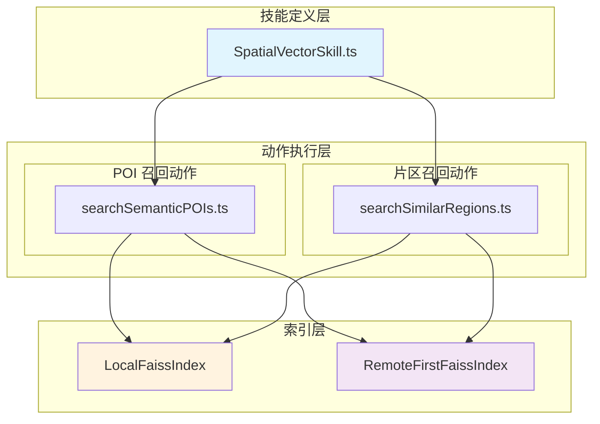

空间向量检索技能（`spatial_vector`）是 GeoLoom Agent V4 架构中负责**模糊语义召回**的核心技能模块。与 [PostGIS 空间数据库技能](7-postgis-kong-jian-shu-ju-ku-ji-neng) 的确定性空间查询形成互补，该技能通过向量相似度匹配实现语义层面的候选召回，为片区洞察和 POI 语义检索提供候选集支持。

## 技能定位与设计哲学

空间向量检索技能在 GeoLoom Agent 的技能体系中承担着**候选召回层**的角色，其核心定位体现在以下三个维度：

**第一，候选集而非结论**。技能召回的结果是候选集而非最终确定性结论。根据 SKILL.md 的设计说明，该技能更适合补充相似片区、模糊业态候选和语义对照，不能替代 PostGIS 结构证据来直接回答机会、供给或竞争问题 [backend/SKILLS/SpatialVector/SKILL.md](backend/SKILLS/SpatialVector/SKILL.md#L1-L14)。

**第二，语义层而非结构层**。PostGIS 技能处理精确的地理空间查询（如“武汉大学 800 米内的咖啡店”），而空间向量技能处理模糊的语义描述（如“适合学生社交的咖啡氛围”），两者在查询类型上形成正交覆盖。

**第三，降级兜底设计**。技能采用 Remote-First 架构模式，当远程向量服务不可用时，自动降级到基于标签重叠的本地召回策略，确保系统在各种依赖状态下的可用性 [backend/src/integration/faissIndex.ts](backend/src/integration/faissIndex.ts#L119-L167)。

## 架构设计

### 技能模块结构

空间向量检索技能采用标准的技能插件架构，由技能定义层和动作执行层组成：



**技能定义层**位于 `SpatialVectorSkill.ts`，负责声明技能元数据、动作定义和执行调度 [backend/src/skills/spatial_vector/SpatialVectorSkill.ts](backend/src/skills/spatial_vector/SpatialVectorSkill.ts#L1-L83)。

**动作执行层**包含两个独立的动作模块：
- `searchSemanticPOIs`：基于语义描述召回 POI 候选 [backend/src/skills/spatial_vector/actions/searchSemanticPOIs.ts](backend/src/skills/spatial_vector/actions/searchSemanticPOIs.ts#L1-L27)
- `searchSimilarRegions`：召回与给定描述相似的片区 [backend/src/skills/spatial_vector/actions/searchSimilarRegions.ts](backend/src/skills/spatial_vector/actions/searchSimilarRegions.ts#L1-L27)

### 索引层双实现模式

技能通过 `FaissIndex` 接口抽象底层索引实现，支持两种部署模式：

| 模式 | 类 | 适用场景 | 依赖 |
|------|-----|---------|------|
| 本地模式 | `LocalFaissIndex` | 开发调试、无外部服务 | 无外部依赖 |
| 远程优先模式 | `RemoteFirstFaissIndex` | 生产部署、需连接专用向量服务 | SPATIAL_VECTOR_BASE_URL 环境变量 |

**LocalFaissIndex** 实现基于标签重叠度的简单相似度计算，适用于开发和演示场景 [backend/src/integration/faissIndex.ts](backend/src/integration/faissIndex.ts#L71-L107)：

```typescript
function overlapScore(text: string, tags: string[]) {
  const query = String(text || '')
  const hits = tags.filter((tag) => query.includes(tag)).length
  return hits / Math.max(tags.length, 1)
}

export class LocalFaissIndex implements FaissIndex {
  async searchSemanticPOIs(text: string, topK = 5): Promise<SemanticPoiCandidate[]> {
    return POI_CATALOG
      .map((item) => ({
        ...item,
        score: Number((item.scoreBase + overlapScore(text, item.tags) * 0.12).toFixed(3)),
      }))
      .sort((a, b) => b.score - a.score)
      .slice(0, topK)
  }
}
```

**RemoteFirstFaissIndex** 实现远程优先+本地降级的容错模式，当远程服务不可用时自动回退到本地索引 [backend/src/integration/faissIndex.ts](backend/src/integration/faissIndex.ts#L119-L245)：

```typescript
async searchSemanticPOIs(text: string, topK = 5): Promise<SemanticPoiCandidate[]> {
  if (!this.baseUrl) {
    this.lastStatus = await this.fallback.getStatus()
    return this.fallback.searchSemanticPOIs(text, topK)
  }

  try {
    const response = await requestJson<{ candidates: SemanticPoiCandidate[] }>({
      baseUrl: this.baseUrl,
      path: this.semanticPoiPath,
      method: 'POST',
      body: { text, top_k: topK },
      timeoutMs: this.timeoutMs,
      fetchImpl: this.options.fetchImpl,
    })
    this.lastStatus = createDependencyStatus({...})
    return response.candidates || []
  } catch (error) {
    this.lastStatus = createDependencyStatus({
      name: 'spatial_vector',
      ready: true,
      mode: 'fallback',
      degraded: true,
      reason: 'remote_request_failed',
    })
    return this.fallback.searchSemanticPOIs(text, topK)
  }
}
```

## 动作接口规范

### search_semantic_pois 动作

**用途**：根据空间语义描述召回 POI 候选。

**输入 Schema**：
```typescript
{
  type: 'object',
  required: ['text'],
  properties: {
    text: { type: 'string' },      // 语义描述文本
    top_k: { type: 'number' },    // 返回结果数量上限
  },
}
```

**输出 Schema**：
```typescript
{
  type: 'object',
  properties: {
    candidates: {
      type: 'array',
      items: {
        poi_id: string,
        name: string,
        score: number,
        category: string,
      },
    },
  },
}
```

**使用示例**：当用户询问“附近有什么适合学生社交的轻消费场所”时，Agent 可调用此动作获取语义匹配的 POI 候选 [backend/src/skills/spatial_vector/actions/searchSemanticPOIs.ts](backend/src/skills/spatial_vector/actions/searchSemanticPOIs.ts#L1-L27)。

### search_similar_regions 动作

**用途**：召回与给定描述相似的片区。

**输入 Schema**：
```typescript
{
  type: 'object',
  required: ['text'],
  properties: {
    text: { type: 'string' },      // 片区描述文本
    top_k: { type: 'number' },    // 返回结果数量上限
  },
}
```

**输出 Schema**：
```typescript
{
  type: 'object',
  properties: {
    regions: {
      type: 'array',
      items: {
        region_id: string,
        name: string,
        score: number,
        summary: string,
      },
    },
  },
}
```

**典型应用场景**：
- “和武汉大学周边气质相似的片区有哪些”
- “找出年轻消费活跃的社区”
- “哪个片区最像光谷青年社区”

## 与 Agent 的集成机制

### 技能注册与初始化

技能在服务启动时通过 `SkillRegistry` 注册到 Agent 系统 [backend/src/server.ts](backend/src/server.ts#L1-L164)：

```typescript
const spatialVectorIndex = new RemoteFirstFaissIndex()
registry.register(createSpatialVectorSkill({ index: spatialVectorIndex }))
```

注册时注入的 `FaissIndex` 实例决定了技能使用的索引实现模式，支持通过环境变量配置远程服务连接参数 [backend/src/integration/faissIndex.ts](backend/src/integration/faissIndex.ts#L134-L167)。

### 意图路由与技能调度

当用户问题匹配 `similar_regions` 意图类型时，Agent 将调度空间向量技能 [backend/src/chat/DeterministicRouter.ts](backend/src/chat/DeterministicRouter.ts#L290-L304)：

```typescript
if (/(相似|像)/u.test(normalizedText) && /(片区|区域|周边|气质)/u.test(normalizedText)) {
  const placeName = extractSimilarAnchor(normalizedText)
  return {
    queryType: 'similar_regions',
    intentMode: 'agent_full_loop',
    targetCategory: '相似片区',
    categoryKey: 'semantic_region',
    ...
  }
}
```

### 证据视图构建

技能执行结果通过 `EvidenceViewFactory` 转换为前端可渲染的证据视图 [backend/src/evidence/EvidenceViewFactory.ts](backend/src/evidence/EvidenceViewFactory.ts#L28-L34)：

```typescript
if (input.intent.queryType === 'similar_regions') {
  return buildSemanticCandidateView({
    anchor: input.anchor,
    intent: input.intent,
    items: input.items || [],
  })
}
```

证据视图类型为 `semantic_candidate`，包含片区名称、相似度分数和摘要描述 [backend/src/evidence/views/SemanticCandidateView.ts](backend/src/evidence/views/SemanticCandidateView.ts#L14-L33)：

```typescript
export function buildSemanticCandidateView(input: {...}): EvidenceView {
  return {
    type: 'semantic_candidate',
    anchor: normalizeAnchor(input.anchor),
    items: input.items,
    regions: input.items.map((item) => ({
      name: item.name,
      score: item.score || 0,
      summary: String(item.meta?.summary || ''),
    })),
    ...
  }
}
```

## 数据目录与扩展

### 内置 POI 目录

技能预置了语义 POI 目录用于本地模式下的演示和测试 [backend/src/integration/faissIndex.ts](backend/src/integration/faissIndex.ts#L47-L69)：

| poi_id | name | category | tags |
|--------|------|----------|------|
| poi_semantic_001 | 校园咖啡实验室 | 咖啡 | 学生, 咖啡, 高校 |
| poi_semantic_002 | 地铁口轻食咖啡 | 咖啡 | 交通, 咖啡 |
| poi_semantic_003 | 社区便利咖啡馆 | 咖啡 | 社区, 咖啡 |

### 内置片区目录

技能预置了片区目录用于相似片区检索 [backend/src/integration/faissIndex.ts](backend/src/integration/faissIndex.ts#L26-L45)：

| region_id | name | summary | tags |
|-----------|------|---------|------|
| region_wuda | 街道口-武大商圈 | 高校密集、咖啡和夜间活跃度较高 | 高校, 学生, 咖啡, 活跃, 夜间 |
| region_huazhong | 光谷青年社区 | 年轻人消费活跃，咖啡与轻餐饮集中 | 学生, 年轻, 咖啡, 交通 |
| region_warehouse | 远郊物流仓储片区 | 以仓储和办公为主，生活配套较弱 | 仓储, 办公 |

### 生产扩展

在生产环境中，可通过以下方式扩展数据目录：

1. **连接外部向量服务**：设置 `SPATIAL_VECTOR_BASE_URL` 环境变量指向专用向量检索服务
2. **自定义 POI 导入**：扩展 `POI_CATALOG` 数组或实现远程数据同步
3. **动态片区注册**：通过管理接口动态注册新的片区语义描述

## 依赖管理与健康检查

### 依赖状态模型

技能通过 `getStatus()` 方法暴露依赖健康状态 [backend/src/skills/spatial_vector/SpatialVectorSkill.ts](backend/src/skills/spatial_vector/SpatialVectorSkill.ts#L56-L60)：

```typescript
async getStatus(): Promise<Record<string, DependencyStatus>> {
  return {
    spatial_vector: await index.getStatus(),
  }
}
```

返回的状态包含以下维度：

| 字段 | 含义 | 典型值 |
|------|------|--------|
| ready | 服务是否可用 | true/false |
| mode | 当前运行模式 | local/remote/fallback |
| degraded | 是否处于降级状态 | true/false |
| reason | 降级原因（可选） | remote_unconfigured/remote_request_failed |

### 降级场景

| 场景 | 触发条件 | 降级模式 |
|------|---------|---------|
| 远程未配置 | SPATIAL_VECTOR_BASE_URL 为空 | 始终使用本地索引 |
| 远程连接超时 | 请求超时超过 3000ms | 自动回退到本地索引 |
| 远程服务错误 | HTTP 状态码非 200 | 自动回退到本地索引 |

## 单元测试

技能包含完整的单元测试覆盖 [backend/tests/unit/skills/spatial_vector/SpatialVectorSkill.spec.ts](backend/tests/unit/skills/spatial_vector/SpatialVectorSkill.spec.ts#L1-L38)：

```typescript
describe('SpatialVectorSkill', () => {
  it('returns semantic poi candidates for descriptive search text', async () => {
    const skill = createSpatialVectorSkill()
    const result = await skill.execute(
      'search_semantic_pois',
      { text: '适合学生社交、轻消费、靠近高校的咖啡店', top_k: 3 },
      createSkillExecutionContext(),
    )
    expect(result.ok).toBe(true)
    expect(result.data?.candidates.length).toBeGreaterThan(0)
  })

  it('returns similar regions ordered by semantic score', async () => {
    const skill = createSpatialVectorSkill()
    const result = await skill.execute(
      'search_similar_regions',
      { text: '和武汉大学周边气质相似的片区', top_k: 3 },
      createSkillExecutionContext(),
    )
    expect(result.ok).toBe(true)
    expect(result.data?.regions[0]?.score).toBeGreaterThanOrEqual(
      result.data?.regions[1]?.score ?? 0
    )
  })
})
```

测试覆盖两个核心动作的正常执行路径和结果格式验证。

## 前端渲染集成

技能执行结果通过 `V4EvidencePanel` 组件在前端展示 [src/components/V4EvidencePanel.vue](src/components/V4EvidencePanel.vue#L81-L92)：

```vue
<div v-else-if="semanticRegions.length > 0" class="semantic-grid">
  <article v-for="region in semanticRegions" :key="region.name" class="semantic-card">
    <div class="semantic-head">
      <strong>{{ region.name }}</strong>
      <span>{{ formatScore(region.score) }}</span>
    </div>
    <div class="semantic-bar">
      <span class="semantic-bar-fill" :style="{ width: `${Math.max(8, Math.round((region.score || 0) * 100))}%` }"></span>
    </div>
    <p>{{ region.summary || '暂无摘要' }}</p>
  </article>
</div>
```

前端渲染逻辑从 SSE 事件流中提取 `regions` 数组，以语义卡片形式展示片区名称、相似度分数（可视化进度条）和片区摘要描述。

## 后续学习路径

掌握空间向量检索技能后，建议继续深入以下相关模块：

- **[空间编码器技能](9-kong-jian-bian-ma-qi-ji-neng)**：了解将地理实体编码为向量的上游服务
- **[证据视图工厂](14-zheng-ju-shi-tu-gong-han)**：深入理解技能结果如何转换为前端可渲染格式
- **[确定性路由解析器](13-que-ding-xing-lu-you-jie-xi-qi)**：掌握 Agent 如何识别并调度到空间向量技能