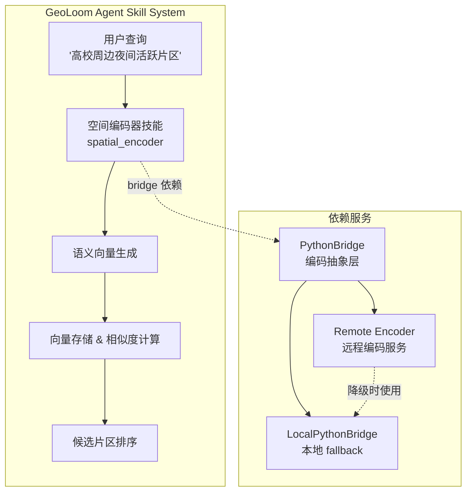
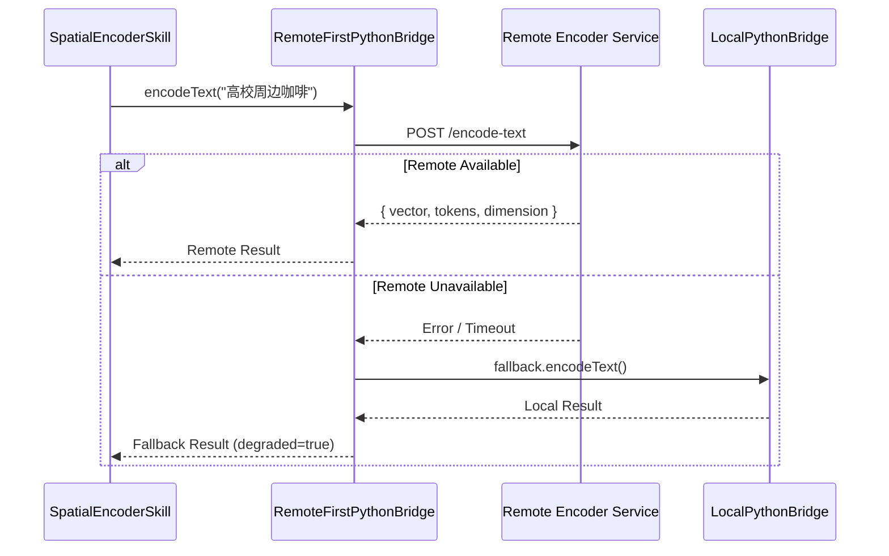

空间编码器技能（spatial_encoder）是 GeoLoom Agent 系统中负责**空间语义编码**的核心技能模块。该技能将自然语言空间描述转换为可计算的向量表示，并支持向量间的相似度评分。在片区洞察类任务中，它为模型理解语义相似性、候选主题匹配和区域描述比对提供向量层面的支持。

## 系统定位

在 GeoLoom Agent 的技能生态中，空间编码器技能与其他技能形成互补关系：PostGIS 技能提供精确的地理空间查询能力，空间向量技能管理高维向量索引，而空间编码器技能则负责**语义编码层**的抽象。这种分层设计使得系统能够在保持查询精度的同时融入语义理解能力。



**关键约束**：根据 SKILL.md 中的设计原则，编码器生成的相似度分数**仅作为语义辅助证据**，不能冒充硬事实。在片区洞察分析中，该技能不能单独支撑主导业态、热点检测、异常识别或机会发现等核心结论。

Sources: [backend/SKILLS/SpatialEncoder/SKILL.md](backend/SKILLS/SpatialEncoder/SKILL.md#L1-L14)
Sources: [backend/src/skills/spatial_encoder/SpatialEncoderSkill.ts](backend/src/skills/spatial_encoder/SpatialEncoderSkill.ts#L1-L107)

## 核心架构

### 技能定义与 Actions

空间编码器技能通过 `createSpatialEncoderSkill` 工厂函数创建，暴露三个原子 Actions：

| Action | 输入 | 输出 | 功能描述 |
|--------|------|------|----------|
| `encode_query` | `{ text: string }` | `{ embedding_id, vector_dim, vector_ref }` | 将查询文本编码为向量引用 |
| `encode_region` | `{ label?: string, text?: string }` | `{ embedding_id, vector_dim, vector_ref }` | 将区域标签/描述编码为向量引用 |
| `score_similarity` | `{ query_vector_ref, candidate_vector_refs[] }` | `{ scores: [{ candidate_id, score }] }` | 计算余弦相似度并排序 |

技能内部维护一个 `Map<string, VectorRecord>` 内存存储，用于保存已编码的向量记录。每个向量记录包含 ID、引用字符串、实际向量数组和原始文本来源。

Sources: [backend/src/skills/spatial_encoder/SpatialEncoderSkill.ts](backend/src/skills/spatial_encoder/SpatialEncoderSkill.ts#L31-L88)
Sources: [backend/src/skills/types.ts](backend/src/skills/types.ts#L1-L66)

### 编码 Actions 实现

**encodeQuery Action** 接收纯文本查询，通过 PythonBridge 进行向量化，生成唯一 UUID 作为 embedding_id，构造格式为 `vector:query:{embedding_id}` 的向量引用，并存储到内部 Map 中：

```typescript
export async function encodeQueryAction(
  payload: { text: string },
  deps: { bridge: PythonBridge, store: Map<string, VectorRecord> },
): Promise<SkillExecutionResult<{ embedding_id: string, vector_dim: number, vector_ref: string }>> {
  const encoded = await deps.bridge.encodeText(payload.text)
  const embeddingId = `query_${randomUUID()}`
  const vectorRef = `vector:query:${embeddingId}`
  deps.store.set(vectorRef, { id: embeddingId, ref: vectorRef, vector: encoded.vector, source: payload.text })
  return { ok: true, data: { embedding_id: embeddingId, vector_dim: encoded.dimension, vector_ref: vectorRef }, meta: { action: 'encode_query', audited: false } }
}
```

**encodeRegion Action** 与 encodeQuery 类似，但优先使用 `label` 字段（fallback 到 `text`），生成的向量引用格式为 `vector:region:{embedding_id}`，以区分查询向量和区域向量。

**scoreSimilarity Action** 实现余弦相似度计算：

```typescript
function cosineSimilarity(a: number[], b: number[]) {
  if (a.length !== b.length || a.length === 0) return 0
  let dot = 0, normA = 0, normB = 0
  for (let index = 0; index < a.length; index += 1) {
    dot += a[index] * b[index]
    normA += a[index] ** 2
    normB += b[index] ** 2
  }
  if (normA === 0 || normB === 0) return 0
  return dot / (Math.sqrt(normA) * Math.sqrt(normB))
}
```

计算结果按 score 降序排列返回，确保高相似度候选排在前面。

Sources: [backend/src/skills/spatial_encoder/actions/encodeQuery.ts](backend/src/skills/spatial_encoder/actions/encodeQuery.ts#L1-L47)
Sources: [backend/src/skills/spatial_encoder/actions/encodeRegion.ts](backend/src/skills/spatial_encoder/actions/encodeRegion.ts#L1-L42)
Sources: [backend/src/skills/spatial_encoder/actions/scoreSimilarity.ts](backend/src/skills/spatial_encoder/actions/scoreSimilarity.ts#L1-L59)

## PythonBridge 抽象层

PythonBridge 是连接 TypeScript 技能层与底层编码服务的关键抽象，支持多种部署模式。

### LocalPythonBridge（本地 Fallback）

当远程服务不可用时，`LocalPythonBridge` 提供基于关键词匹配的本地编码实现。其词汇表包含 13 个地理语义关键词：

```typescript
const VOCABULARY = [
  '高校', '学生', '咖啡', '地铁', '交通', '商圈', '活跃',
  '夜间', '片区', '餐饮', '购物', '办公', '社区',
]
```

编码逻辑采用二值向量表示：若文本分词后的任意 token 与词汇表中的 term 存在包含关系（正序或逆序），则对应维度设为 1，否则为 0。这种方法虽然简单，但在远程服务不可用时能保证系统基本可用性。

Sources: [backend/src/integration/pythonBridge.ts](backend/src/integration/pythonBridge.ts#L17-L36)

### RemoteFirstPythonBridge（远程优先）

`RemoteFirstPythonBridge` 实现**远程优先、降级 fallback** 的弹性策略：



该策略的核心优势在于：
- 正常情况下利用远程服务的高质量编码能力
- 网络抖动或服务重启时自动降级，保证业务连续性
- 健康检查探针持续监控远程服务状态，支持自动恢复

Sources: [backend/src/integration/pythonBridge.ts](backend/src/integration/pythonBridge.ts#L66-L189)
Sources: [backend/tests/unit/integration/pythonBridge.spec.ts](backend/tests/unit/integration/pythonBridge.spec.ts#L1-L101)

## Fallback 服务独立进程

`scripts/encoder-fallback-service.mjs` 提供了**独立运行的 Node.js HTTP 服务器**，作为远程编码服务的替代实现。该服务监听 `/encode-text`、`/encode` 和 `/cell/search` 三个端点。

### 端点规范

| 端点 | 方法 | 输入 | 输出 |
|------|------|------|------|
| `/health` | GET | - | `{ status, encoder_loaded, loaded, mode, service }` |
| `/encode-text` | POST | `{ text: string }` | `{ vector, tokens, dimension }` |
| `/encode` | POST | `{ lon, lat }` | `{ embedding, dimension }` |
| `/cell/search` | POST | `{ anchor_lon, anchor_lat, user_query, top_k }` | `{ cells[], scene_tags, dominant_buckets }` |

### 文本编码实现

Fallback 服务采用**增强型关键词匹配**：

1. **文本标准化**：去除标点，转换为小写，分词
2. **向量构建**：词汇表匹配时设为 1，未匹配维度使用基于文本长度的伪随机扰动（amplitude 0.15）
3. **向量归一化**：L2 范数归一化，确保向量长度一致

这种设计使得 fallback 服务在无需外部依赖的情况下，能够提供**与正式服务兼容的向量格式**，便于下游处理。

Sources: [scripts/encoder-fallback-service.mjs](scripts/encoder-fallback-service.mjs#L1-L197)

## 技能注册与生命周期

在 `backend/src/server.ts` 中，空间编码器技能于服务启动时注册到 SkillRegistry：

```typescript
const spatialEncoderBridge = new RemoteFirstPythonBridge()
registry.register(createSpatialEncoderSkill({ bridge: spatialEncoderBridge }))
```

注册后的技能通过 Fastify 路由 `/api/geo/skills/:name/call` 暴露给外部调用，支持 JSON-RPC 风格的 action 调用。路由层自动注入 trace_id、计算执行延迟，并将结果封装为统一格式返回。

Sources: [backend/src/server.ts](backend/src/server.ts#L95-L100)
Sources: [backend/src/routes/skills.ts](backend/src/routes/skills.ts#L1-L63)

## 典型使用场景

空间编码器技能最适合以下场景：

1. **多候选片区语义排序**：将用户需求编码为 query 向量，将候选片区编码为 region 向量，通过 score_similarity 获得语义相关性排序

2. **区域描述向量化存储**：将片区的文字描述转换为向量，供后续的空间关系计算使用

3. **跨语言/跨表述匹配**：支持"高校周边"与"大学附近"等不同表述的语义对齐

在片区洞察分析的完整 Pipeline 中，该技能通常与 PostGIS 技能配合使用：PostGIS 技能负责**精确地理范围筛选**（硬约束），空间编码器技能负责**语义相关性排序**（软排序）。

## 单元测试

技能实现包含完整的单元测试覆盖：

```typescript
it('encodes query text into a reusable vector reference', async () => {
  const skill = createSpatialEncoderSkill()
  const result = await skill.execute('encode_query', 
    { text: '适合学生消费、交通便利、夜间活跃的片区' }, 
    createSkillExecutionContext())
  expect(result.ok).toBe(true)
  expect(result.data).toMatchObject({ vector_dim: expect.any(Number), vector_ref: expect.stringMatching(/^vector:query:/) })
})

it('scores similarity between encoded candidates', async () => {
  const skill = createSpatialEncoderSkill()
  const query = await skill.execute('encode_query', { text: '高校周边咖啡和夜生活' }, context)
  const regionA = await skill.execute('encode_region', { label: '武大商圈，高校和咖啡密集' }, context)
  const regionB = await skill.execute('encode_region', { label: '远郊仓储园区' }, context)
  const score = await skill.execute('score_similarity', { query_vector_ref: query.data?.vector_ref, candidate_vector_refs: [regionA.data?.vector_ref, regionB.data?.vector_ref] }, context)
  expect(score.data?.scores[0]?.score).toBeGreaterThan(score.data?.scores[1]?.score ?? 0)
})
```

测试用例验证了两个关键契约：
- 编码操作成功返回格式正确的向量引用
- 相似度评分能够正确区分语义相关与不相关的区域

Sources: [backend/tests/unit/skills/spatial_encoder/SpatialEncoderSkill.spec.ts](backend/tests/unit/skills/spatial_encoder/SpatialEncoderSkill.spec.ts#L1-L39)

## 下一步学习路径

在掌握空间编码器技能后，建议继续深入以下相关主题：

- **[空间向量检索技能](8-kong-jian-xiang-liang-jian-suo-ji-neng)**：了解如何利用 FAISS 等向量索引实现大规模向量检索
- **[PostGIS 空间数据库技能](7-postgis-kong-jian-shu-ju-ku-ji-neng)**：学习精确地理查询的 SQL 模式与空间函数
- **[记忆管理器架构](11-ji-yi-guan-li-qi-jia-gou)**：探索向量存储与会话记忆的整合机制