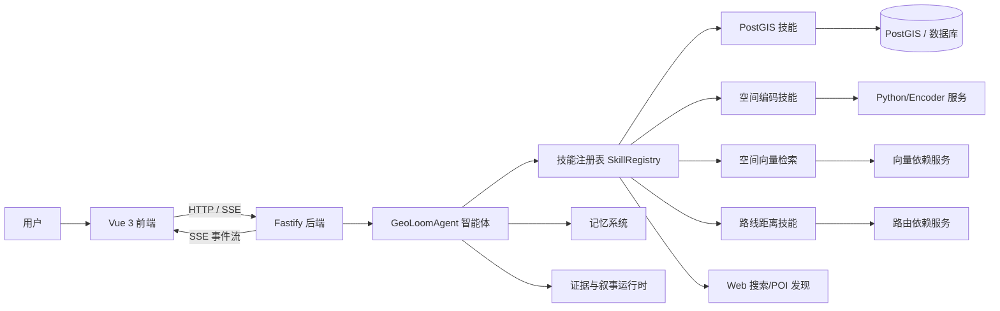

本页用于帮助初学者先建立对 **GeoLoom Agent 是什么、解决什么问题、由哪些部分组成、系统如何整体协作** 的第一层理解。按照仓库现状，它不是单一的聊天应用，也不是只有地图可视化的前端项目，而是一个把 **Vue 3 前端界面、Fastify 后端服务、空间分析能力、LLM 驱动智能体、流式事件协议，以及真实外部空间依赖服务** 组合在一起的地理智能代理系统。对于初学者来说，最重要的不是立刻进入单个模块细节，而是先把“这是一个多进程、多模块、面向地理问题问答的整栈系统”这件事看清楚。Sources: [README.md](README.md#L1-L5) [README.md](README.md#L13-L39) [.omm description](.omm/overall-architecture/description.md#L1-L2)

## 这个项目在仓库中的定位

从项目说明可以直接确认，GeoLoom Agent 是从原有工程中拆分出来的独立 V4 仓库，目标不是保留一个可演示的最小样例，而是保留 **完整前端 UI 框架壳、独立可运行的 V4 后端、真实空间依赖联调脚本、测试链路和构建链路**，使其能够独立维护、独立测试与独立启动。这意味着它从一开始就被设计成一个可运行系统，而不是只供阅读的代码样本。Sources: [README.md](README.md#L1-L5) [README.md](README.md#L13-L39)

从目录结构也能看到这种“整栈独立化”的特征：根目录有前端 `src/`、共享契约 `shared/`、启动脚本 `scripts/`，同时还有独立的 `backend/` 目录；后端内部再细分为 `agent`、`chat`、`routes`、`skills`、`integration`、`memory`、`narrative` 等子域，说明系统不是一个扁平脚本集合，而是围绕能力边界组织的多层架构。Sources: [backend/src 目录结构](backend/src#L1-L62) [src 目录结构](src#L1-L57)

## 它要解决的问题

依据官方架构描述，GeoLoom Agent 的目标是回答 **位置感知型问题**：也就是围绕区域、POI（兴趣点）与城市特征提出的问题，并结合空间数据库、检索能力与 LLM 推理给出回答。它不是纯文本聊天机器人，而是一个面向地理场景的“空间智能问答系统”。Sources: [.omm description](.omm/overall-architecture/description.md#L1-L2)

后端主入口进一步表明，这个系统围绕多个地理与语义能力构建：它注册了 PostGIS、空间编码、空间向量检索、路线距离、语义选择、多搜索引擎、实体对齐、Web POI 发现等技能；同时还初始化目录类 embedding 索引、POI embedding 检查与记忆组件。这说明系统回答问题时依赖的不只是 LLM 文本生成，而是 **“LLM + 技能调用 + 空间数据 + 检索 + 证据组织”** 的组合模式。Sources: [server.ts](backend/src/server.ts#L50-L79) [server.ts](backend/src/server.ts#L80-L183)

## 一句话理解系统

如果用最简洁的话概括，GeoLoom Agent 可以理解为：**一个以地图和聊天界面为入口，由后端智能体调度空间技能和外部依赖，最终通过 SSE 流式返回分析过程与结果的地理智能代理平台**。这个表述可以同时被前端开发者、后端开发者和初学者接受，因为它抓住了可验证的三个核心：界面入口、智能体编排、流式结果输出。Sources: [src/main.ts](src/main.ts#L1-L30) [app.ts](backend/src/app.ts#L33-L66) [chat.ts](backend/src/routes/chat.ts#L69-L90)

## 系统的整体组成

从启动脚本可以验证，这个项目默认不是只启动一个服务，而是同时启动四个进程：前端、真实依赖适配服务、空间编码器服务、V4 后端。项目文档明确给出了端口：前端 `3000`、真实依赖适配服务 `3411`、空间编码器服务 `8100`、后端 `3210`。这说明 GeoLoom Agent 的“系统”概念天然包含多个协作服务。Sources: [README.md](README.md#L41-L73) [package.json](package.json#L11-L27)

下面这张图适合先建立整体心智模型。阅读前可以先记住两个原则：第一，**前端只负责交互与展示，不直接完成地理推理**；第二，**真正的分析中枢位于后端智能体与技能体系**。Sources: [package.json](package.json#L11-L27) [app.ts](backend/src/app.ts#L43-L64)


Sources: [server.ts](backend/src/server.ts#L50-L79) [server.ts](backend/src/server.ts#L80-L183) [chat.ts](backend/src/routes/chat.ts#L69-L90)

## 前端、后端与共享契约分别承担什么角色

前端的应用入口非常轻：`src/main.ts` 创建 Vue 应用、挂载路由，而 `src/App.vue` 只负责渲染 `router-view`。这表明应用的复杂度主要被下沉到路由页面和主布局中，而不是堆积在入口文件。Sources: [main.ts](src/main.ts#L1-L30) [App.vue](src/App.vue#L1-L16)

路由定义显示系统至少有两个交互表面：主页 `/` 对应 `MainLayout`，以及叙事相关的 `/narrative` 与 `/narrative/probe` 页面。这说明 GeoLoom Agent 不只是单页面地图，而是包含标准主界面和叙事模式两类体验入口。Sources: [router](src/router/index.ts#L1-L32)

`MainLayout.vue` 则直接暴露了系统的主要前端构成：它将 `ControlPanel`、`MapContainer`、`TagCloud`、AI 面板组织在同一布局中，说明前端的核心不是单纯聊天框，而是 **地图 + 控制面板 + 标签分析 + AI 面板** 的复合界面。对初学者而言，这有助于理解为什么这是“地理智能代理”，而不是“带地图背景的聊天机器人”。Sources: [MainLayout.vue](src/MainLayout.vue#L44-L90) [MainLayout.vue](src/MainLayout.vue#L115-L199)

后端的职责则更清晰：`createApp` 创建 Fastify 应用，统一挂载 `/api/category`、`/api/spatial` 和 `/api/geo` 三组路由；其中 `/api/geo` 下继续承载健康检查、技能接口、聊天接口与叙事探针接口。也就是说，后端是系统的 **统一能力网关**。Sources: [app.ts](backend/src/app.ts#L33-L66)

共享契约方面，`shared/sseEventSchema.ts` 定义了一整套 SSE 事件模式，包括 `job`、`stage`、`thinking`、`reasoning`、`intent_preview`、`progress`、`partial`、`spatial_clusters`、`web_search`、`entity_alignment`、`refined_result`、`error`、`done` 等事件。这说明前后端之间的核心交互不是“后端一次性返回整段答案”，而是通过 **结构化事件流** 逐步传递过程、状态与结果。Sources: [sseEventSchema.ts](shared/sseEventSchema.ts#L14-L28) [sseEventSchema.ts](shared/sseEventSchema.ts#L54-L200)

## 初学者最应该先掌握的三件事

第一，GeoLoom Agent 是 **多服务协作** 的系统，不是只运行一个 `npm run dev` 的前端项目。根脚本已经明确将前端、依赖适配、编码器、后端并发启动。Sources: [package.json](package.json#L11-L27)

第二，GeoLoom Agent 的后端不是传统 CRUD API，而是围绕 **智能体编排与技能调用** 组织的服务。`server.ts` 中的 `SkillRegistry`、`GeoLoomAgent`、多种 `create...Skill()` 的注册过程，就是这个系统的核心模式。Sources: [server.ts](backend/src/server.ts#L59-L79) [server.ts](backend/src/server.ts#L80-L145)

第三，用户看到的结果不是普通接口响应，而是 **SSE 流式事件序列**。`/api/geo/chat` 路由会设置 `text/event-stream` 响应头，创建 `SSEWriter`，再把智能体运行过程持续写回前端。Sources: [chat.ts](backend/src/routes/chat.ts#L69-L90) [SurfaceChatRuntime.ts](backend/src/chat/SurfaceChatRuntime.ts#L18-L31)

## 项目结构速览

下面这张结构图不是完整目录，而是帮助新读者抓住“哪里是系统骨架”。Sources: [backend/src 目录结构](backend/src#L1-L62) [src 目录结构](src#L1-L57)

```text
geoloom-agent/
├─ src/                    # Vue 3 前端
│  ├─ components/          # 地图、控制面板、聊天、证据卡等组件
│  ├─ views/               # 页面级视图
│  ├─ router/              # 路由入口
│  └─ utils/               # 前端分析与协议处理工具
├─ backend/
│  ├─ src/
│  │  ├─ agent/            # 智能体编排核心
│  │  ├─ chat/             # SSE 与聊天运行时
│  │  ├─ routes/           # API 路由
│  │  ├─ skills/           # 技能模块
│  │  ├─ integration/      # 外部依赖桥接
│  │  ├─ memory/           # 记忆系统
│  │  ├─ narrative/        # 叙事分析能力
│  │  └─ evidence/         # 证据生成与渲染
├─ shared/                 # 前后端共享契约
├─ scripts/                # 启动、联调、烟雾测试脚本
└─ public/                 # 前端静态资源与数据
```
Sources: [backend/src 目录结构](backend/src#L1-L62) [src 目录结构](src#L1-L57)

## 关键能力一览

下表适合作为第一次阅读仓库时的“定位地图”，帮助你知道每块代码大致负责什么。Sources: [README.md](README.md#L13-L39) [server.ts](backend/src/server.ts#L50-L79) [app.ts](backend/src/app.ts#L43-L64)

| 维度 | 仓库位置 | 作用 | 初学者应如何理解 |
|---|---|---|---|
| 前端界面 | `src/` | 提供地图、控制面板、标签云、AI 面板与页面路由 | 这是用户操作系统的入口 |
| 后端 API | `backend/src/app.ts`、`backend/src/routes/` | 提供统一 HTTP/SSE 接口 | 这是能力暴露层，不是最终推理层 |
| 智能体核心 | `backend/src/agent/` | 组织对话、技能调度、推理流程 | 这是系统“大脑” |
| 技能体系 | `backend/src/skills/` | 封装 PostGIS、空间编码、检索、路线等能力 | 这是系统“工具箱” |
| 外部桥接 | `backend/src/integration/` | 连接数据库、向量服务、Python 服务、OSM 路由等 | 这是系统与真实世界依赖的接口 |
| 记忆与叙事 | `backend/src/memory/`、`backend/src/narrative/`、`backend/src/evidence/` | 维持上下文、生成证据与叙事分析结果 | 这是把分析组织成可读结果的层 |
| 共享协议 | `shared/sseEventSchema.ts` | 规范 SSE 事件类型与字段 | 这是前后端对“流式返回格式”的共识 |
Sources: [README.md](README.md#L13-L39) [server.ts](backend/src/server.ts#L50-L79) [sseEventSchema.ts](shared/sseEventSchema.ts#L54-L200)

## 系统如何对外提供能力

从应用装配代码可以验证，后端按前缀暴露三类主接口：`/api/category` 用于分类树相关能力，`/api/spatial` 用于空间要素获取，而 `/api/geo` 则聚合健康检查、技能、聊天与叙事能力。这种组织方式说明 GeoLoom Agent 对外不是大量零散端点，而是按领域分组的 API。Sources: [app.ts](backend/src/app.ts#L43-L64)

其中最值得概览页强调的是 `/api/geo/health` 与聊天接口。`/health` 会返回数据库、LLM、记忆、依赖状态、已注册技能列表和数量；这意味着它不只是“服务是否活着”的简单心跳，而是一个 **系统级健康视图**。Sources: [geo.ts](backend/src/routes/geo.ts#L16-L61)

聊天接口则通过 `POST /chat` 接收请求，并兼容若干旧字段命名；随后把请求交给聊天运行时处理，并以 SSE 流持续输出。这说明 GeoLoom Agent 明显考虑了 **协议兼容性** 和 **长过程响应** 两个现实问题。Sources: [chat.ts](backend/src/routes/chat.ts#L9-L61) [chat.ts](backend/src/routes/chat.ts#L63-L91)

## 为什么这个系统称为“Agent”

“Agent” 这个词在这里并不是营销术语，而是能从代码里验证的设计事实。`server.ts` 初始化了 `GeoLoomAgent`，同时构建 `SkillRegistry` 并注册多类技能；`GeoLoomAgent.ts` 也确实引入了 LLM Provider、Function Calling Loop、SkillContext、ConversationMemory、IntentAlignmentGuard、RequirementResolver、DeterministicEvidenceRuntime 等组件。由这些命名关系可以确认，它的核心模式是 **基于意图、记忆、工具调用和证据生成的代理式编排**。Sources: [server.ts](backend/src/server.ts#L5-L37) [server.ts](backend/src/server.ts#L59-L79) [GeoLoomAgent.ts](backend/src/agent/GeoLoomAgent.ts#L31-L68)

换句话说，系统不会把所有问题都当成“一次 LLM 回复”；相反，它更像是在一个运行时里判断当前问题需要哪些能力，再把结果重新组织成前端可消费的流式输出。这也是为什么系统中同时存在技能注册、记忆管理、证据工厂和渲染器等角色。Sources: [GeoLoomAgent.ts](backend/src/agent/GeoLoomAgent.ts#L23-L68)

## 它与普通 Web 项目的差异

对于刚接触这个仓库的开发者，最容易误判的一点是把它当成“Vue 前端 + Node 后端”的普通项目。实际上，从依赖和脚本层面可以直接看到，它比典型 CRUD 系统多出大量地理与 AI 相关特征：前端依赖有 `ol`、`geotiff`、`d3`、`three`、`element-plus`；后端依赖有 `fastify`、`pg`；根脚本还专门维护编码器服务、依赖适配服务和烟雾测试脚本。Sources: [package.json](package.json#L46-L85) [backend/package.json](backend/package.json#L6-L36)

更关键的是，它的数据返回形式也不同于常见 REST 页面应用。共享 SSE Schema 显示，系统会流式发出阶段、推理、进度、空间聚类、Web 搜索、实体对齐、最终结果和完成事件，因此用户看到的是“分析过程逐渐展开”的体验，而非一个阻塞后突然返回的大对象。Sources: [sseEventSchema.ts](shared/sseEventSchema.ts#L54-L200)

## 面向初学者的阅读建议

如果你当前只是第一次接触 GeoLoom Agent，最合理的阅读顺序不是立刻钻进 `GeoLoomAgent.ts` 这种超大文件，而是先沿着“系统是什么 → 怎么启动 → 怎么协作 → 关键模块是什么”的路径逐步建立框架。基于当前文档目录，建议接下来依次阅读 [快速开始：环境配置与启动指南](2-kuai-su-kai-shi-huan-jing-pei-zhi-yu-qi-dong-zhi-nan)、[架构概览：前端、后端与 AI 引擎协同](3-jia-gou-gai-lan-qian-duan-hou-duan-yu-ai-yin-qing-xie-tong)、[请求生命周期管理：从用户输入到流式响应](7-qing-qiu-sheng-ming-zhou-qi-guan-li-cong-yong-hu-shu-ru-dao-liu-shi-xiang-ying)。这样可以先理解运行方式，再理解系统协作，再理解一次请求如何流过整条链路。Sources: [package.json](package.json#L11-L45) [app.ts](backend/src/app.ts#L43-L64) [chat.ts](backend/src/routes/chat.ts#L69-L90)

如果你更偏向“模块导向”学习，也可以在完成概览后按角色继续深入：想看前端界面，就读 [前端架构：Vue 3 + Vite + 地理可视化组件](9-qian-duan-jia-gou-vue-3-vite-di-li-ke-shi-hua-zu-jian)；想看 AI 与推理，就读 [LLM 集成：意图识别与推理引擎](5-llm-ji-cheng-yi-tu-shi-bie-yu-tui-li-yin-qing)；想看数据库与空间服务，就读 [空间数据服务：OSM 桥接与 PostGIS 存储](6-kong-jian-shu-ju-fu-wu-osm-qiao-jie-yu-postgis-cun-chu)。这比直接从目录里随机挑文件阅读更高效。Sources: [server.ts](backend/src/server.ts#L10-L37) [src/router/index.ts](src/router/index.ts#L9-L30)

## 结论

GeoLoom Agent 的本质可以归纳为一个 **面向地理问题的整栈智能代理平台**：前端提供地图与 AI 交互界面，后端以 Fastify 为宿主暴露统一 API，由 `GeoLoomAgent` 和技能注册表完成推理与能力编排，并通过结构化 SSE 协议把分析过程实时返回给前端。对初学者而言，只要先掌握这条主线，后续阅读各个专题页面时就不会迷失在局部实现细节中。Sources: [.omm description](.omm/overall-architecture/description.md#L1-L2) [app.ts](backend/src/app.ts#L33-L66) [server.ts](backend/src/server.ts#L50-L79) [sseEventSchema.ts](shared/sseEventSchema.ts#L54-L200)