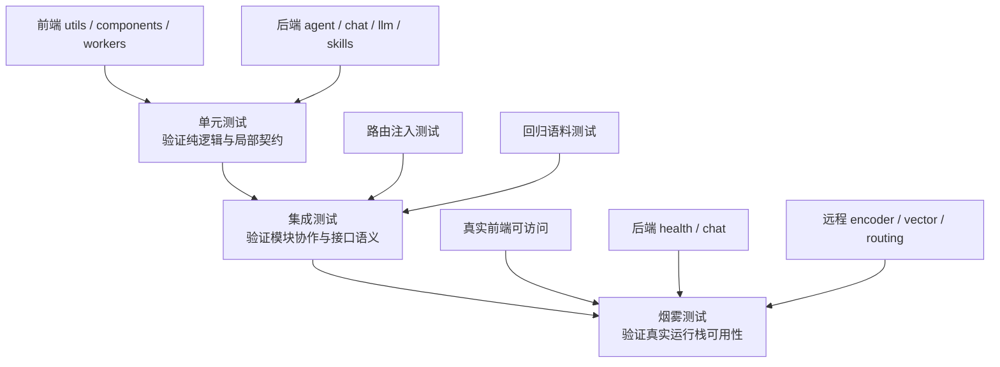
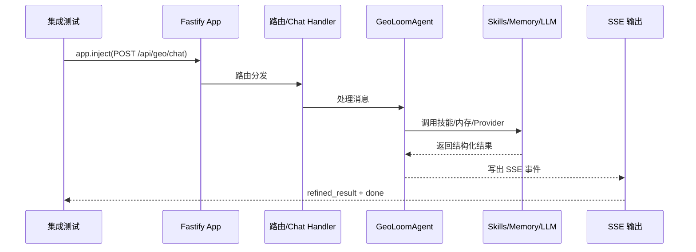

本页聚焦 **GeoLoom Agent 的测试分层策略**，解释仓库如何把测试划分为前端单元测试、后端单元测试、路由/回归级集成测试，以及面向真实运行栈的烟雾测试。对中级开发者而言，关键不是记住有哪些 spec 文件，而是理解这些测试各自验证什么边界、如何组合成风险控制链，以及在什么阶段执行最合适。Sources: [package.json](package.json#L6-L45), [backend/package.json](backend/package.json#L6-L18), [vitest.config.js](vitest.config.js#L4-L17), [backend/vitest.config.ts](backend/vitest.config.ts#L3-L13)

从仓库结构可以直接看出，这个项目采用了 **前后端分治、再按测试目标分层** 的组织方式：前端测试跟随组件、组合式函数、工具模块和 worker 就近放置；后端则在 `backend/tests` 下集中分成 `unit`、`integration`、`smoke` 三层。这种布局天然对应“局部逻辑正确 → 模块协作正确 → 真实依赖可用”的验证递进。Sources: [backend/tests](backend/tests), [src/components/__tests__](src/components/__tests__), [src/composables/__tests__](src/composables/__tests__), [src/utils/__tests__](src/utils/__tests__), [src/views/__tests__](src/views/__tests__), [src/workers/__tests__](src/workers/__tests__)

## 先看整体：测试分层如何覆盖风险

在第一性原理上，测试策略解决的是三类不同失败源：**纯逻辑错误**、**模块边界错配**、**运行环境或外部依赖失效**。GeoLoom Agent 对应地使用单元测试覆盖小范围确定性逻辑，集成测试覆盖 API、SSE、技能编排与回归语料，烟雾测试覆盖真实服务、远程依赖和最小业务闭环。Sources: [backend/tests/unit/chat/SSEWriter.spec.ts](backend/tests/unit/chat/SSEWriter.spec.ts#L37-L79), [backend/tests/integration/routes/chat.spec.ts](backend/tests/integration/routes/chat.spec.ts#L79-L158), [backend/tests/integration/e2e/phase8_3_regression.spec.ts](backend/tests/integration/e2e/phase8_3_regression.spec.ts#L6-L54), [backend/tests/smoke/minimaxPhase8_3.smoke.spec.ts](backend/tests/smoke/minimaxPhase8_3.smoke.spec.ts#L36-L92), [scripts/smoke-stack.mjs](scripts/smoke-stack.mjs#L57-L188)



上图的阅读前提是：**层级越高，覆盖面越大，但定位问题的粒度越粗、运行成本越高**。因此该项目并没有把所有风险都推给 E2E，而是让低层测试先过滤绝大多数确定性错误，再让少量集成与烟雾测试承担系统级把关。Sources: [package.json](package.json#L29-L44), [backend/package.json](backend/package.json#L13-L18), [backend/vitest.config.ts](backend/vitest.config.ts#L4-L12)

## 测试入口与执行方式

根目录脚本把测试分成前端与后端两部分：`npm test` 顺序执行 `test:frontend` 和 `test:backend`；前端测试由根目录 Vitest 配置驱动，运行环境是 `jsdom`，仅包含 `src/**/*.spec.js`；后端测试由 `backend/vitest.config.ts` 驱动，运行环境是 `node`，包含 `tests/**/*.spec.ts`。这意味着测试边界在脚本层已经被明确编码，而不是依赖人工约定。Sources: [package.json](package.json#L28-L44), [vitest.config.js](vitest.config.js#L4-L17), [backend/package.json](backend/package.json#L13-L17), [backend/vitest.config.ts](backend/vitest.config.ts#L3-L13)

| 维度 | 前端测试 | 后端测试 |
|---|---|---|
| 执行入口 | `npm run test:frontend` | `npm run test:backend` |
| 配置文件 | `vitest.config.js` | `backend/vitest.config.ts` |
| 运行环境 | `jsdom` | `node` |
| 匹配规则 | `src/**/*.spec.js` | `tests/**/*.spec.ts` |
| 主要目标 | 组件/UI/工具/worker 逻辑 | 服务/路由/技能/依赖协作 |
| 默认位置 | `src` 下就近测试 | `backend/tests` 分层集中测试 |

Sources: [package.json](package.json#L29-L31), [vitest.config.js](vitest.config.js#L12-L16), [backend/package.json](backend/package.json#L13-L17), [backend/vitest.config.ts](backend/vitest.config.ts#L4-L8)

## 项目中的测试版图

从目录结构看，前端测试广泛分布在 `components`、`composables`、`utils`、`views`、`workers` 五类区域；后端则把 `agent`、`chat`、`config`、`contract`、`evidence`、`integration`、`llm`、`memory`、`metrics`、`narrative`、`sandbox`、`skills` 等模块纳入单元测试，并额外提供路由级集成测试、端到端回归测试和 smoke 测试。这说明项目不是只测试 UI 表层，而是对 AI 编排、SSE 传输、空间技能与远程依赖都建立了验证面。Sources: [backend/tests](backend/tests), [src/components/__tests__](src/components/__tests__), [src/composables/__tests__](src/composables/__tests__), [src/utils/__tests__](src/utils/__tests__), [src/views/__tests__](src/views/__tests__), [src/workers/__tests__](src/workers/__tests__)

```text
测试结构概览
.
├─ src/components/__tests__      # 组件渲染与交互
├─ src/composables/__tests__     # 组合式状态逻辑
├─ src/utils/__tests__           # 前端纯函数与流式协议处理
├─ src/views/__tests__           # 页面级行为
├─ src/workers/__tests__         # Worker 计算逻辑
└─ backend/tests
   ├─ unit                       # 后端模块级单元测试
   ├─ integration/routes         # 路由与服务协作
   ├─ integration/e2e            # 回归语料闭环
   └─ smoke                      # 真实依赖与最小可用栈
```

Sources: [backend/tests](backend/tests), [src/components/__tests__](src/components/__tests__), [src/composables/__tests__](src/composables/__tests__), [src/utils/__tests__](src/utils/__tests__), [src/views/__tests__](src/views/__tests__), [src/workers/__tests__](src/workers/__tests__)

## 单元测试：把复杂系统拆成可确定验证的最小部件

本仓库中的单元测试并不局限于“纯函数输入输出”，还覆盖了 **组件局部交互、SSE 写入器、worker 布局算法、组合式状态派生** 等可在隔离环境中验证的对象。其共同特征是：依赖被最小化，断言目标聚焦于局部契约，而不是整个请求链路。Sources: [src/components/__tests__/AgentMessageCard.spec.js](src/components/__tests__/AgentMessageCard.spec.js#L51-L106), [src/composables/__tests__/useRegions.spec.js](src/composables/__tests__/useRegions.spec.js#L5-L36), [src/workers/__tests__/geo.worker.spec.js](src/workers/__tests__/geo.worker.spec.js#L57-L103), [backend/tests/unit/chat/SSEWriter.spec.ts](backend/tests/unit/chat/SSEWriter.spec.ts#L37-L79)

以前端为例，`AgentMessageCard.spec.js` 关注的是答案优先布局、过程时间线展开、标签云 stub、以及 web search 调试信息是否正确呈现。它并不依赖真实后端，也不验证整条聊天链路，而是确认组件在既定 props 下是否稳定地渲染关键信息。这样的测试能快速发现 UI 结构回归。Sources: [src/components/__tests__/AgentMessageCard.spec.js](src/components/__tests__/AgentMessageCard.spec.js#L6-L49), [src/components/__tests__/AgentMessageCard.spec.js](src/components/__tests__/AgentMessageCard.spec.js#L51-L106)

`useRegions.spec.js` 展示了另一类单元测试思路：组合式 API 接收区域几何与 POI 集合后，是否能派生出 `poiCount`、`categories`、`topCategories` 等统计信息。这里验证的是 **状态推导规则**，而不是视图层效果，因此非常适合做低成本高确定性的断言。Sources: [src/composables/__tests__/useRegions.spec.js](src/composables/__tests__/useRegions.spec.js#L5-L36)

`geo.worker.spec.js` 则把 worker 运行环境伪造出来，替换 `self` 和 `OffscreenCanvas`，验证 `minTagSpacing` 增大时标签布局距离也随之增大。它说明这个项目的单元测试不仅覆盖业务逻辑，还覆盖前端并行计算模块中的 **算法性约束**。Sources: [src/workers/__tests__/geo.worker.spec.js](src/workers/__tests__/geo.worker.spec.js#L3-L55), [src/workers/__tests__/geo.worker.spec.js](src/workers/__tests__/geo.worker.spec.js#L57-L103)

后端单元测试中，`SSEWriter.spec.ts` 很有代表性。它验证 `trace`、`job`、`stage`、`thinking`、`done` 事件顺序，以及所有事件都携带统一的 `trace_id` 与 `schema_version`；同时还验证错误事件的稳定载荷结构。这类测试的意义在于：SSE 是跨前后端的流式契约，必须在最小层级先锁定格式。Sources: [backend/tests/unit/chat/SSEWriter.spec.ts](backend/tests/unit/chat/SSEWriter.spec.ts#L7-L35), [backend/tests/unit/chat/SSEWriter.spec.ts](backend/tests/unit/chat/SSEWriter.spec.ts#L37-L79)

| 单元测试对象 | 典型文件 | 核心断言 | 隔离方式 |
|---|---|---|---|
| Vue 组件 | `AgentMessageCard.spec.js` | 渲染、交互、条件显示 | props + stub |
| 组合式函数 | `useRegions.spec.js` | 状态派生与统计规则 | 直接调用 composable |
| Worker 模块 | `geo.worker.spec.js` | 布局约束、算法效果 | 伪造 `self`/`OffscreenCanvas` |
| SSE 基础设施 | `SSEWriter.spec.ts` | 事件顺序、元字段、错误格式 | `PassThrough` 流捕获 |

Sources: [src/components/__tests__/AgentMessageCard.spec.js](src/components/__tests__/AgentMessageCard.spec.js#L51-L106), [src/composables/__tests__/useRegions.spec.js](src/composables/__tests__/useRegions.spec.js#L5-L36), [src/workers/__tests__/geo.worker.spec.js](src/workers/__tests__/geo.worker.spec.js#L57-L103), [backend/tests/unit/chat/SSEWriter.spec.ts](backend/tests/unit/chat/SSEWriter.spec.ts#L37-L79)

## 集成测试：验证模块协作而不是单点逻辑

当系统进入集成测试层，验证重点从“一个模块是否正确”转向“多个模块组合后是否仍符合契约”。在 GeoLoom Agent 中，这主要表现为 **Fastify 路由注入测试** 与 **回归语料闭环测试**。它们不一定依赖所有真实外部系统，但会把路由、代理、技能、内存、SSE 输出等关键模块串起来。Sources: [backend/tests/integration/routes/chat.spec.ts](backend/tests/integration/routes/chat.spec.ts#L79-L103), [backend/tests/integration/e2e/phase8_3_regression.spec.ts](backend/tests/integration/e2e/phase8_3_regression.spec.ts#L11-L54), [backend/tests/integration/helpers/chatRegressionHarness.ts](backend/tests/integration/helpers/chatRegressionHarness.ts#L27-L35)

`backend/tests/integration/routes/chat.spec.ts` 的一个关键模式是：通过 `createApp()` 组装应用，再为 PostGIS、向量检索、编码器等技能提供 mock 或受控实现，然后用 `app.inject()` 调用 `/api/geo/chat`。这让测试可以在不启动真实 HTTP 服务的前提下，验证请求进入路由后是否触发正确的技能编排与响应结构。Sources: [backend/tests/integration/routes/chat.spec.ts](backend/tests/integration/routes/chat.spec.ts#L79-L108), [backend/tests/integration/routes/chat.spec.ts](backend/tests/integration/routes/chat.spec.ts#L104-L158)

同一个文件还体现出此项目集成测试的一个重要特点：**它不是只断言状态码，而是断言语义结果**。例如 SQL 片段不同就返回不同 mock 数据，测试可借此覆盖分类统计、环带聚合、竞争分析、AOI、landuse 等不同查询分支。这类测试更接近“受控条件下的业务回归”。Sources: [backend/tests/integration/routes/chat.spec.ts](backend/tests/integration/routes/chat.spec.ts#L108-L199)

`geo.spec.ts` 则展示了健康检查接口的集成价值：它不是验证数据库连通，而是验证 `/api/geo/health` 输出中是否明确包含 `dependencies.*.mode`、`degraded_dependencies`、`metrics` 等结构化健康信息。换言之，这里的契约重点是 **运维可观测语义**，不是简单的 200 OK。Sources: [backend/tests/integration/routes/geo.spec.ts](backend/tests/integration/routes/geo.spec.ts#L6-L19), [backend/tests/integration/routes/geo.spec.ts](backend/tests/integration/routes/geo.spec.ts#L80-L118)

回归测试层进一步把“模块协作”提升到“语料闭环”。`phase8_3_regression.spec.ts` 会遍历 fixture 集，发送聊天请求，解析 SSE，提取 `refined_result`，断言 `query_type`、`evidence_view.type`、预期关键词以及最终 `done` 事件是否出现。这说明项目已经将某些关键业务结果固定为可回归的 **黄金语料标准**。Sources: [backend/tests/integration/e2e/phase8_3_regression.spec.ts](backend/tests/integration/e2e/phase8_3_regression.spec.ts#L6-L54)

而 `chatRegressionHarness.ts` 的作用，是把创建 provider、技能注册表、内存管理器和应用实例等样板逻辑集中封装，从而让不同回归场景可以切换 `providerMode`，例如 `default`、`env_default`、`provider_unavailable`、`polished_answer` 等。这种 harness 设计减少了集成测试的重复搭建成本，也让场景切换更显式。Sources: [backend/tests/integration/helpers/chatRegressionHarness.ts](backend/tests/integration/helpers/chatRegressionHarness.ts#L27-L35), [backend/tests/integration/helpers/chatRegressionHarness.ts](backend/tests/integration/helpers/chatRegressionHarness.ts#L70-L198)



理解上图的关键是：这里没有启动真正监听端口的服务，而是通过应用实例内注入完成链路验证，所以它比烟雾测试更快、更稳定，但仍能覆盖较长的协作路径。Sources: [backend/tests/integration/routes/chat.spec.ts](backend/tests/integration/routes/chat.spec.ts#L79-L95), [backend/tests/integration/e2e/phase8_3_regression.spec.ts](backend/tests/integration/e2e/phase8_3_regression.spec.ts#L12-L33)

## 烟雾测试：确认真实运行栈“能活着工作”

烟雾测试在本项目中承担的是 **最小真实可用性证明**。与集成测试不同，它不是在受控注入环境中验证内部协作，而是尽量面向真实服务地址、真实远程依赖和真实进程组合，回答“当前这套栈能不能跑”。Sources: [scripts/smoke-stack.mjs](scripts/smoke-stack.mjs#L7-L32), [backend/package.json](backend/package.json#L14-L17), [package.json](package.json#L43-L44)

根目录的 `scripts/smoke-stack.mjs` 会依次验证后端 `/api/geo/health`、前端页面可访问、encoder `/health`、向量和路由服务健康接口、语义 POI 检索、相似区域检索、route 路径距离、以及最终聊天 SSE 是否能返回 `refined_result` 与 `done`。也就是说，它不是单纯 health ping，而是包含了跨服务业务动作的真实探测。Sources: [scripts/smoke-stack.mjs](scripts/smoke-stack.mjs#L57-L159), [scripts/smoke-stack.mjs](scripts/smoke-stack.mjs#L161-L182)

`remoteDependenciesPhase8_3.smoke.spec.ts` 进一步展示了后端 smoke 的工程化特点：若默认依赖适配器未启动，它会尝试拉起 `scripts/v4-dependency-adapter.mjs`；同时等待 encoder、vector/routing 与 Redis 准备就绪，再验证短期记忆是否切换到 remote mode。这种 smoke 已经不只是“冒烟”，而是在检验 **远程依赖启动与退化模式是否符合预期**。Sources: [backend/tests/smoke/remoteDependenciesPhase8_3.smoke.spec.ts](backend/tests/smoke/remoteDependenciesPhase8_3.smoke.spec.ts#L42-L84), [backend/tests/smoke/remoteDependenciesPhase8_3.smoke.spec.ts](backend/tests/smoke/remoteDependenciesPhase8_3.smoke.spec.ts#L98-L178), [backend/tests/smoke/remoteDependenciesPhase8_3.smoke.spec.ts](backend/tests/smoke/remoteDependenciesPhase8_3.smoke.spec.ts#L180-L200)

`minimaxPhase8_3.smoke.spec.ts` 则把 smoke 推向真实大模型编排层。它要求环境变量中存在可用的 LLM 配置，并且 `LLM_BASE_URL` 匹配 minimax；随后对一组 smoke 语料逐个发起聊天请求，验证 provider 健康、`query_type`、`evidence_view.type`、证据是否被填充，以及最终是否以 `done` 结束。这里验证的是 **真实编排提供方是否仍能完成关键业务闭环**。Sources: [backend/tests/smoke/minimaxPhase8_3.smoke.spec.ts](backend/tests/smoke/minimaxPhase8_3.smoke.spec.ts#L7-L15), [backend/tests/smoke/minimaxPhase8_3.smoke.spec.ts](backend/tests/smoke/minimaxPhase8_3.smoke.spec.ts#L16-L34), [backend/tests/smoke/minimaxPhase8_3.smoke.spec.ts](backend/tests/smoke/minimaxPhase8_3.smoke.spec.ts#L36-L92)

| 测试类型 | 主要问题 | 是否依赖真实外部系统 | 典型文件 | 失败信号 |
|---|---|---|---|---|
| 单元测试 | 局部逻辑是否正确 | 通常否 | `SSEWriter.spec.ts`、`geo.worker.spec.js` | 精准、局部 |
| 集成测试 | 模块协作是否正确 | 可控 mock/半真实 | `chat.spec.ts`、`phase8_3_regression.spec.ts` | 业务链路断裂 |
| 烟雾测试 | 当前运行栈是否可用 | 是，尽量真实 | `smoke-stack.mjs`、`*.smoke.spec.ts` | 服务不可用、依赖失活 |

Sources: [backend/tests/unit/chat/SSEWriter.spec.ts](backend/tests/unit/chat/SSEWriter.spec.ts#L37-L79), [backend/tests/integration/routes/chat.spec.ts](backend/tests/integration/routes/chat.spec.ts#L79-L103), [backend/tests/integration/e2e/phase8_3_regression.spec.ts](backend/tests/integration/e2e/phase8_3_regression.spec.ts#L11-L54), [backend/tests/smoke/minimaxPhase8_3.smoke.spec.ts](backend/tests/smoke/minimaxPhase8_3.smoke.spec.ts#L36-L92), [scripts/smoke-stack.mjs](scripts/smoke-stack.mjs#L57-L188)

## 前端与后端的测试侧重点不同

前端测试明显偏向 **表现逻辑、流式事件消费和浏览器替身环境**。例如 `v3aiService.spec.js` 通过伪造 SSE chunk，验证结构化事件如何经 `onMeta` 传递，非法事件如何转成 `schema_error`，以及剥离 think 标签后文本流是否保留可见空白。这类测试控制的是前端对协议流的消费稳定性。Sources: [src/utils/__tests__/v3aiService.spec.js](src/utils/__tests__/v3aiService.spec.js#L5-L25), [src/utils/__tests__/v3aiService.spec.js](src/utils/__tests__/v3aiService.spec.js#L34-L125)

页面级前端测试则偏向交互流程。`NarrativeMode.spec.js` 通过 mock 路由与 `sendChatMessageStream`，验证用户在会话中途切换 tour style 后，播放状态是否被重置、是否触发新的叙事请求，以及 UI 是否同步切换到新风格。这里测试的是 **状态机行为与界面响应的一致性**。Sources: [src/views/__tests__/NarrativeMode.spec.js](src/views/__tests__/NarrativeMode.spec.js#L10-L18), [src/views/__tests__/NarrativeMode.spec.js](src/views/__tests__/NarrativeMode.spec.js#L97-L170)

相对地，后端测试更强调 **技能编排、依赖模式、SSE 输出契约和回归语料稳定性**。这与系统职责划分一致：前端负责消费与呈现，后端负责生成、组织与退化处理。因此两边虽然都使用 Vitest，但验证对象并不对称。Sources: [vitest.config.js](vitest.config.js#L12-L16), [backend/vitest.config.ts](backend/vitest.config.ts#L4-L8), [backend/tests/integration/routes/geo.spec.ts](backend/tests/integration/routes/geo.spec.ts#L6-L19), [src/utils/__tests__/v3aiService.spec.js](src/utils/__tests__/v3aiService.spec.js#L34-L125)

## 这个策略真正保护了什么

如果把项目视作一个地理智能代理系统，那么最容易出现回归的高风险点有四个：**流式协议格式、AI 编排分支、空间技能返回结构、远程依赖可达性**。当前测试策略对这四点分别设置了防线：SSEWriter 与前端 SSE 消费测试守住协议；路由与回归测试守住编排分支；受控技能 mock 与 evidence 断言守住结果结构；smoke-stack 与远程依赖 smoke 守住真实环境。Sources: [backend/tests/unit/chat/SSEWriter.spec.ts](backend/tests/unit/chat/SSEWriter.spec.ts#L37-L79), [src/utils/__tests__/v3aiService.spec.js](src/utils/__tests__/v3aiService.spec.js#L34-L125), [backend/tests/integration/e2e/phase8_3_regression.spec.ts](backend/tests/integration/e2e/phase8_3_regression.spec.ts#L11-L54), [scripts/smoke-stack.mjs](scripts/smoke-stack.mjs#L57-L188)

这种分层还体现了一种很实用的工程取舍：**把高频、易定位的问题下沉到单元测试，把高价值业务语义放到集成回归，把部署级风险保留给少量烟雾测试**。因此开发者日常改动时主要依赖快速测试反馈，而不是每次都启动整套系统等待全链路验证。Sources: [package.json](package.json#L29-L44), [backend/package.json](backend/package.json#L13-L17), [backend/tests/integration/helpers/chatRegressionHarness.ts](backend/tests/integration/helpers/chatRegressionHarness.ts#L70-L198)

## 建议的使用顺序

如果你刚接触本仓库的测试体系，最合理的阅读和实践顺序是：先理解本页的分层，再去看 [前端架构：Vue 3 + Vite + 地理可视化组件](9-qian-duan-jia-gou-vue-3-vite-di-li-ke-shi-hua-zu-jian) 以理解前端测试对象来源；再看 [请求生命周期管理：从用户输入到流式响应](7-qing-qiu-sheng-ming-zhou-qi-guan-li-cong-yong-hu-shu-ru-dao-liu-shi-xiang-ying) 理解为什么 SSE 与 chat 回归测试如此关键；最后看 [工具链与脚本：开发、构建与部署自动化](11-gong-ju-lian-yu-jiao-ben-kai-fa-gou-jian-yu-bu-shu-zi-dong-hua) 以掌握 smoke 脚本在开发和发布流程中的位置。Sources: [package.json](package.json#L29-L44), [scripts/smoke-stack.mjs](scripts/smoke-stack.mjs#L57-L188), [backend/tests/integration/e2e/phase8_3_regression.spec.ts](backend/tests/integration/e2e/phase8_3_regression.spec.ts#L11-L54)

## 实践落点：什么时候跑哪一层

在日常开发中，修改前端组件、组合式函数、工具模块或 worker 时，优先运行前端单元测试；修改后端技能、SSE 输出、健康接口或聊天编排时，优先运行后端单元与路由级集成测试；只有当你调整真实依赖、部署脚本、环境变量、外部服务地址或发布候选版本时，才需要补跑 smoke。这不是经验主义，而是由仓库现有脚本和测试成本结构直接推导出的最优路径。Sources: [package.json](package.json#L29-L44), [backend/package.json](backend/package.json#L13-L17), [scripts/smoke-stack.mjs](scripts/smoke-stack.mjs#L7-L32)

## 小结

GeoLoom Agent 的测试体系不是简单地“有单元、有集成、有烟雾”，而是形成了一条清晰的质量链：**单元测试锁局部契约，集成测试锁业务协作，烟雾测试锁真实可用性**。这条链路尤其适合同时涉及 UI、SSE、AI 编排、空间技能与远程依赖的复杂系统，因为任何一层都无法单独替代另外两层。Sources: [backend/tests/unit/chat/SSEWriter.spec.ts](backend/tests/unit/chat/SSEWriter.spec.ts#L37-L79), [backend/tests/integration/routes/chat.spec.ts](backend/tests/integration/routes/chat.spec.ts#L79-L103), [backend/tests/integration/e2e/phase8_3_regression.spec.ts](backend/tests/integration/e2e/phase8_3_regression.spec.ts#L11-L54), [backend/tests/smoke/minimaxPhase8_3.smoke.spec.ts](backend/tests/smoke/minimaxPhase8_3.smoke.spec.ts#L36-L92), [scripts/smoke-stack.mjs](scripts/smoke-stack.mjs#L57-L188)