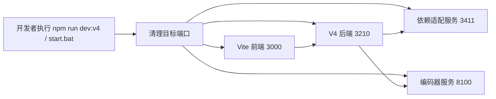
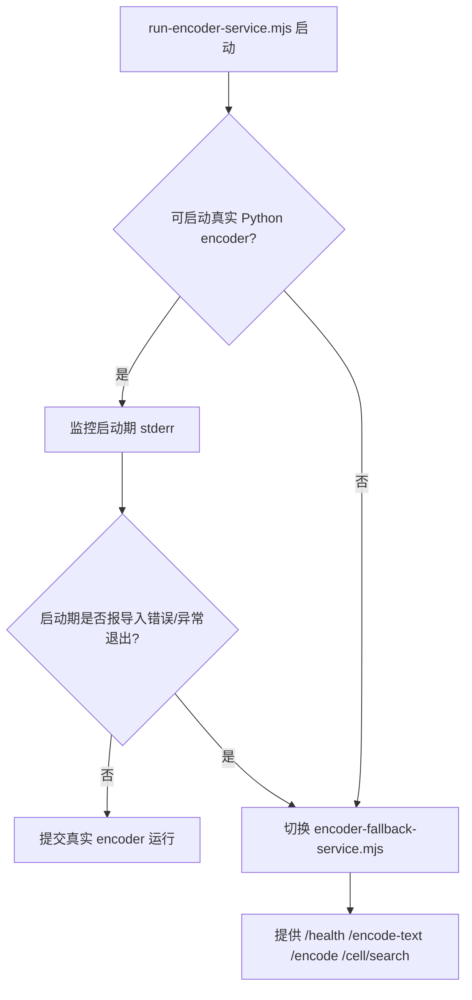
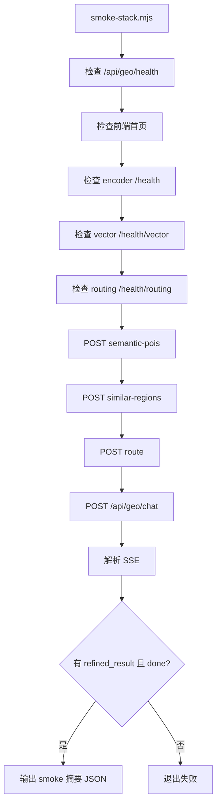
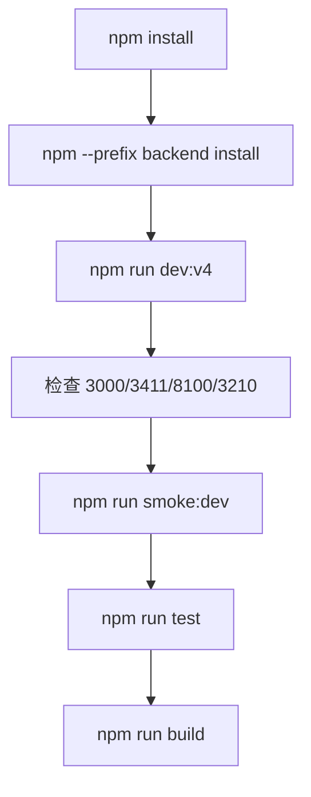

这一页聚焦 **GeoLoom Agent 的开发、构建、启动与自动化验证工具链**，只回答一个核心问题：开发者如何通过仓库内已有脚本，把前端、后端、依赖适配服务、编码器服务以及验证链路组织成一套可重复执行的工程流程。它不是架构页，也不展开业务算法，而是说明“如何把系统跑起来、构建出来、验证通过”。若你希望先理解系统整体协作关系，建议先阅读 [架构概览：前端、后端与 AI 引擎协同](3-jia-gou-gai-lan-qian-duan-hou-duan-yu-ai-yin-qing-xie-tong)；若你希望随后深入测试设计，可继续阅读 [测试策略：单元测试、集成测试与烟雾测试](10-ce-shi-ce-lue-dan-yuan-ce-shi-ji-cheng-ce-shi-yu-yan-wu-ce-shi)。Sources: [package.json](package.json#L1-L89) [README.md](README.md#L34-L72)

## 工具链的第一性原理：它编排的是“整栈运行”，不是单点命令

从仓库脚本设计看，项目工具链的基本单位不是单个服务，而是一个 **四服务整栈**：前端 Vite 开发服务器、后端依赖适配服务、空间编码器服务、V4 后端服务。根目录 `dev:v4` 与 `start` 都采用 `concurrently` 并行拉起四个进程，而不是要求开发者分别进入不同目录手工执行命令。这意味着该仓库的自动化目标首先是 **降低本地联调复杂度**，其次才是构建和测试。Sources: [package.json](package.json#L6-L45) [README.md](README.md#L41-L72) [start.bat](start.bat#L5-L12)

在开发模式下，默认端口被明确固定为：前端 `3000`、依赖服务 `3411`、编码器 `8100`、后端 `3210`；在预览模式下，前端切换为 `4173`。这些端口不是文档约定，而是脚本层面的硬编码编排结果，并且每个入口都绑定了对应的 `pre*` 清端口步骤，以确保启动前运行环境尽可能处于可预测状态。Sources: [package.json](package.json#L7-L45) [vite.config.js](vite.config.js#L70-L106) [start.bat](start.bat#L7-L11)


Sources: [package.json](package.json#L11-L23) [scripts/cleanup-ports.mjs](scripts/cleanup-ports.mjs#L4-L16) [scripts/run-backend-v4.mjs](scripts/run-backend-v4.mjs#L14-L29)

## 项目脚本版图

从目录上看，根目录 `scripts/` 负责整栈编排、环境兼容与运维辅助；`backend/scripts/` 更偏向后端实验或专项验证。这个划分说明：**跨服务 orchestration 放在仓库根，服务内部实验放在子工程内部**，避免了开发入口与研究脚本混杂。Sources: [scripts](scripts#L1-L10) [backend/scripts](backend/scripts#L1-L2)

```text
scripts/
├── cleanup-ports.mjs          # 启动前端口清理
├── run-backend-v4.mjs         # V4 后端启动包装
├── run-encoder-service.mjs    # 编码器启动与 fallback 切换
├── encoder-fallback-service.mjs # JS fallback 编码器
├── smoke-stack.mjs            # 整栈烟雾验证
├── import-pop-raster.py       # 栅格人口数据导入
├── check-aoi-geom.mjs         # AOI 几何检查
├── kill-ports.ps1             # Windows 端口强制清理
└── v4-dependency-adapter.mjs  # 轻量依赖适配器/模拟器

backend/scripts/
├── test_full_pipeline.mjs     # 本地实验性全链路脚本
└── lib/query_scene_profile.mjs
```
Sources: [scripts](scripts#L1-L10) [backend/scripts](backend/scripts#L1-L2)

## 根级 npm scripts：开发、构建、测试、运行四条主线

根目录 `package.json` 的脚本可以分为四类：**开发启动**、**生产预览/启动**、**构建**、**测试与校验**。其中 `dev`、`dev:stack`、`dev:v4` 最终都汇聚到同一整栈入口；`build` 同时构建前端与后端；`test` 则串联前后端测试；`smoke` 与 `smoke:dev` 用于整栈健康验证。脚本命名体现出较强的一致性：前缀用于阶段，后缀用于服务或模式。Sources: [package.json](package.json#L6-L45)

| 类别 | 关键脚本 | 作用 | 典型场景 |
|---|---|---|---|
| 开发 | `dev:v4` / `dev` / `dev:stack` | 并行启动前端、依赖服务、编码器、后端 | 本地联调 |
| 单服务开发 | `dev:frontend:v4` / `dev:deps` / `dev:encoder-service` / `dev:backend` | 分别启动某一子服务 | 定位单点问题 |
| 构建 | `build` / `build:v4` / `build:backend` | 生成前后端构建产物 | 发布前检查 |
| 预览/运行 | `preview:v4` / `start` / `start:*` | 以 preview + 后端服务形式运行整栈 | 本地近生产验证 |
| 测试 | `test` / `test:frontend` / `test:backend` | 执行前后端自动化测试 | 提交前验证 |
| 烟雾 | `smoke` / `smoke:dev` | 校验服务健康、依赖可达、聊天链路可用 | 整栈回归 |
| 数据工具 | `pop:dry-run` / `pop:import` | 导入人口栅格数据 | 数据准备 |
| 维护 | `clean:ports:*` | 释放预定端口 | 启动前清理 |
Sources: [package.json](package.json#L6-L45)

## 一键启动路径：Windows 批处理只是入口，真正编排在 npm scripts

`start.bat` 的职责非常克制：切换到仓库目录、输出四个服务地址，然后调用 `npm run dev:v4`。这说明 Windows 一键启动并没有额外业务逻辑，真正可维护的启动逻辑全部保留在 `package.json` 与 `scripts/*.mjs` 中。因此从文档角度看，**批处理文件只是 UX 包装层**，不是系统行为定义层。Sources: [start.bat](start.bat#L1-L13) [package.json](package.json#L11-L23)

对于中级开发者，这意味着排障时应优先检查 `npm script` 和 `.mjs` 包装脚本，而不是先修改 `start.bat`。如果要理解为何某个端口、某个环境变量、某个服务地址被注入，应直接查看 `dev:v4`、`run-backend-v4.mjs` 与 `run-encoder-service.mjs`。Sources: [start.bat](start.bat#L11-L12) [scripts/run-backend-v4.mjs](scripts/run-backend-v4.mjs#L11-L29) [scripts/run-encoder-service.mjs](scripts/run-encoder-service.mjs#L9-L15)

## 启动前治理：端口清理脚本把“脏环境”显式纳入工具链

`scripts/cleanup-ports.mjs` 是整个开发体验稳定性的基础脚本。它从命令行读取端口列表，去重后在 Windows 使用 `netstat` + `taskkill` 查找并终止占用端口的监听进程，在 Unix 上则尝试 `lsof`。清理后脚本会再次确认端口是否已释放，如果仍被占用则直接退出失败。这里的关键设计不是“能杀进程”，而是 **把端口可用性前置成启动契约**。Sources: [scripts/cleanup-ports.mjs](scripts/cleanup-ports.mjs#L4-L16) [scripts/cleanup-ports.mjs](scripts/cleanup-ports.mjs#L23-L50) [scripts/cleanup-ports.mjs](scripts/cleanup-ports.mjs#L79-L127)

与之相比，`scripts/kill-ports.ps1` 是更简单的 Windows 辅助脚本，直接针对固定端口集合 `3000/3411/8100/5100/3210` 调用 `Get-NetTCPConnection` 与 `Stop-Process`。两者功能相似，但定位不同：前者是 npm 工作流中的正式依赖，后者更像人工维护时的快捷工具。Sources: [scripts/kill-ports.ps1](scripts/kill-ports.ps1#L1-L14) [package.json](package.json#L7-L8)

| 工具 | 入口方式 | 端口来源 | 平台策略 | 用途定位 |
|---|---|---|---|---|
| `cleanup-ports.mjs` | npm `pre*` 脚本自动调用 | 命令行参数 | Windows/Unix 双分支 | 正式启动前置步骤 |
| `kill-ports.ps1` | 手工执行 | 固定端口数组 | Windows PowerShell | 人工应急清理 |
Sources: [scripts/cleanup-ports.mjs](scripts/cleanup-ports.mjs#L4-L16) [scripts/cleanup-ports.mjs](scripts/cleanup-ports.mjs#L73-L127) [scripts/kill-ports.ps1](scripts/kill-ports.ps1#L1-L14)

## 后端启动包装：开发模式优先保证产物正确，而不是热更新优先

`scripts/run-backend-v4.mjs` 明确区分 `dev` 与 `start` 两种模式，但其 `dev` 实现并不是直接 `tsx watch`，而是先执行 `tsc -p tsconfig.json` 编译到 `dist`，然后用 `node dist/src/server.js` 启动。脚本注释直接给出原因：**绕过 tsx watch 缓存**。这表明该项目在当前阶段，更重视开发产物与运行结果的一致性，而不是追求后端热更新体验最大化。Sources: [scripts/run-backend-v4.mjs](scripts/run-backend-v4.mjs#L2-L8) [scripts/run-backend-v4.mjs](scripts/run-backend-v4.mjs#L31-L42)

该脚本还统一注入了后端运行环境，包括监听地址、依赖服务地址、健康检查路径、超时参数、OSRM 地址、NER 与 Crawl4AI 地址。换言之，**后端的远端依赖模式由启动包装层决定**，而不是要求开发者总是手工配置 shell 环境。这是工具链对“可启动性”的又一次封装。Sources: [scripts/run-backend-v4.mjs](scripts/run-backend-v4.mjs#L13-L29) [README.md](README.md#L105-L123)

## 编码器启动策略：先尝试真实服务，失败后自动降级到 fallback

`scripts/run-encoder-service.mjs` 展现了工具链中最有代表性的弹性设计。它优先调用 Python 执行 `..\vector-encoder\run.py serve --port <port>`，并监控标准错误输出；如果在启动早期发现 `ModuleNotFoundError`、`ImportError` 等异常，或者子进程创建失败、过早退出，则自动切换到 `scripts/encoder-fallback-service.mjs`。因此，编码器服务在工具链中的角色不是“必须真实可用”，而是“必须提供约定接口”。Sources: [scripts/run-encoder-service.mjs](scripts/run-encoder-service.mjs#L9-L15) [scripts/run-encoder-service.mjs](scripts/run-encoder-service.mjs#L27-L51) [scripts/run-encoder-service.mjs](scripts/run-encoder-service.mjs#L55-L116)

fallback 服务本身是一个 Node HTTP 服务，暴露 `/health`、`/encode-text`、`/encode`、`/cell/search` 等接口，并返回可归一化的伪向量、锚点 embedding 与本地生成的相似片区候选。它并不伪装成完整算法实现，但它满足了编排所需的最小 API 面，从而保证前后端联调和 smoke 测试在缺少真实 Python 依赖时仍可推进。Sources: [scripts/encoder-fallback-service.mjs](scripts/encoder-fallback-service.mjs#L13-L31) [scripts/encoder-fallback-service.mjs](scripts/encoder-fallback-service.mjs#L80-L111) [scripts/encoder-fallback-service.mjs](scripts/encoder-fallback-service.mjs#L155-L196)


Sources: [scripts/run-encoder-service.mjs](scripts/run-encoder-service.mjs#L27-L51) [scripts/run-encoder-service.mjs](scripts/run-encoder-service.mjs#L72-L116) [scripts/encoder-fallback-service.mjs](scripts/encoder-fallback-service.mjs#L155-L181)

## 依赖适配服务：根编排通过后端子工程脚本拉起专用服务

根脚本中的 `dev:deps` 与 `start:deps` 并不直接运行根目录脚本，而是通过 `npm --prefix backend` 调用后端子工程的 `dev:dependency-service` 或 `start:dependency-service`。这表明依赖适配服务虽然属于整栈运行的一部分，但在所有权上被视为后端开发域的一部分。Sources: [package.json](package.json#L20-L23) [package.json](package.json#L39-L42) [backend/package.json](backend/package.json#L6-L18)

`backend/src/dev/realDependencyService.ts` 则实现了这个服务的真实逻辑入口。文件开头加载运行时环境，创建 Fastify 服务，读取编码器与 OSRM 基地址，并初始化 `PostgisPool`。从命名与实现看，该服务是“真实向量检索和真实路由服务适配层”，而不是一个简单 mock server。工具链文档在这里应强调的是：**依赖服务本身也被纳入可启动脚本体系，而不是外部手动依赖**。Sources: [backend/src/dev/realDependencyService.ts](backend/src/dev/realDependencyService.ts#L1-L19) [backend/src/dev/realDependencyService.ts](backend/src/dev/realDependencyService.ts#L81-L84) [README.md](README.md#L107-L123)

作为对照，根目录的 `scripts/v4-dependency-adapter.mjs` 提供了一个更轻量的 HTTP 适配器，支持 `/health`、`/search/semantic-pois`、`/search/similar-regions`、`/route` 与编码器 `/encode-text` 接口。这说明仓库中同时存在 **真实依赖适配入口** 与 **轻量本地适配器** 两种工具，但根级正式整栈编排当前选择的是后端子工程中的真实依赖服务。Sources: [scripts/v4-dependency-adapter.mjs](scripts/v4-dependency-adapter.mjs#L3-L27) [scripts/v4-dependency-adapter.mjs](scripts/v4-dependency-adapter.mjs#L49-L121) [package.json](package.json#L20-L23)

## 前端构建与开发服务器：Vite 配置把代理与分块一起纳入工具链

前端工具链由 Vite 驱动，但 `vite.config.js` 并不只是基础配置。它根据 `mode` 动态决定 API 代理目标，在 `v4` 模式下默认代理到 `http://127.0.0.1:3210`，并为 `/api/geo`、`/api/ai`、`/api/category`、`/api/spatial`、`/api/search` 配置了不同超时与转发策略。这说明前端开发环境不是通过修改代码切换后端，而是通过 **mode + 代理** 与后端脚本编排对接。Sources: [vite.config.js](vite.config.js#L12-L19) [vite.config.js](vite.config.js#L70-L100)

构建阶段，Vite 还通过 `manualChunks` 对 Vue、路由、OpenLayers、deck.gl、Element Plus、D3、GeoTIFF、Turf、Three、Axios 等依赖进行人为分块。虽然这属于前端构建细节，但在“工具链”语境下它说明项目不仅关心能否 build，还关心构建产物组织方式。因此该页可以把它视为 **前端构建自动化的一部分**。Sources: [vite.config.js](vite.config.js#L31-L69)

| 维度 | 开发模式 | 预览模式 | 构建模式 |
|---|---|---|---|
| 前端入口 | `vite --mode v4 --host 127.0.0.1` | `vite preview --host 127.0.0.1 --port 4173` | `vite build --mode v4` |
| 端口 | `3000` | `4173` | 无常驻端口 |
| API 对接 | dev proxy → `3210` | 依赖已构建产物 + 后端服务 | 生成静态资源 |
| 工具目标 | 快速联调 | 近生产验证 | 发布产物 |
Sources: [package.json](package.json#L15-L18) [package.json](package.json#L24-L27) [package.json](package.json#L33-L42) [vite.config.js](vite.config.js#L70-L106)

## 后端子工程脚本：标准化程度高于根工程

`backend/package.json` 中的脚本比根工程更单纯：`dev` 使用 `tsx watch src/server.ts`，`dev:dependency-service` 使用 `tsx watch src/dev/realDependencyService.ts`，`build` 走 `tsc`，`start` 走 `node dist/...`，测试则统一交给 `vitest run`。相较根级脚本的“整栈编排导向”，后端子工程是典型的 **服务级 TypeScript 工程脚本布局**。Sources: [backend/package.json](backend/package.json#L6-L18)

这也意味着根工具链与后端工具链存在分层关系：根层解决“把系统整体拉起”，后端层解决“如何独立开发和发布该服务”。对于中级开发者，如果只是调试后端实现，可直接进入后端脚本；如果要验证前后端加依赖服务的协同，则应回到根级入口。Sources: [package.json](package.json#L11-L23) [backend/package.json](backend/package.json#L6-L18)

## 烟雾测试脚本：验证的不只是健康，而是整条最小可用链路

`scripts/smoke-stack.mjs` 的验证顺序非常有代表性。它先读取 CLI 参数或环境变量，推导 API、前端、依赖服务、编码器的基地址；随后依次检查后端健康、前端可达、编码器健康、向量服务健康、路由服务健康，再执行语义 POI 检索、相似区域检索、路径规划，最后调用 `/api/geo/chat` 并解析 SSE，确认至少出现 `refined_result` 且以 `done` 事件结束。这里验证的不是“服务在线”，而是 **整栈关键能力已贯通**。Sources: [scripts/smoke-stack.mjs](scripts/smoke-stack.mjs#L1-L32) [scripts/smoke-stack.mjs](scripts/smoke-stack.mjs#L57-L129) [scripts/smoke-stack.mjs](scripts/smoke-stack.mjs#L131-L188)

特别值得注意的是，该脚本还要求后端健康接口返回的 `dependencies.spatial_encoder.mode`、`dependencies.spatial_vector.mode`、`dependencies.route_distance.mode` 全部为 `remote`。这说明 smoke 的判定标准不仅包含接口成功，还包含 **依赖模式符合预期**。因此它更像一个“环境契约检查器”，而不是普通 ping 脚本。Sources: [scripts/smoke-stack.mjs](scripts/smoke-stack.mjs#L126-L129) [README.md](README.md#L125-L177)


Sources: [scripts/smoke-stack.mjs](scripts/smoke-stack.mjs#L57-L188)

## 数据导入与空间检查脚本：工具链不止服务编排，也覆盖开发运维任务

根脚本中的 `pop:dry-run` 与 `pop:import` 调用 `scripts/import-pop-raster.py`。该 Python 脚本会加载根目录和 `backend/.env`，读取 TIFF 栅格数据，推导像元边界和中心点，必要时创建 PostGIS 表与索引，并以批量 upsert 方式写入人口网格数据。它属于典型的 **数据准备自动化脚本**，服务于开发和部署前的数据装载。Sources: [package.json](package.json#L9-L10) [scripts/import-pop-raster.py](scripts/import-pop-raster.py#L11-L39) [scripts/import-pop-raster.py](scripts/import-pop-raster.py#L110-L199)

与之对应，`scripts/check-aoi-geom.mjs` 直接连接 PostgreSQL，查询 AOI 几何类型、有效性、面积以及 GeoJSON 长度，并统计 `aois` 表中的几何类型分布。这个脚本不参与整栈启动，却承担了 **空间数据质量检查** 的职责，反映出该仓库的“工具链”定义包含工程运行所需的辅助诊断能力。Sources: [scripts/check-aoi-geom.mjs](scripts/check-aoi-geom.mjs#L1-L10) [scripts/check-aoi-geom.mjs](scripts/check-aoi-geom.mjs#L14-L51)

| 脚本 | 语言 | 功能 | 是否纳入 npm 主入口 |
|---|---|---|---|
| `import-pop-raster.py` | Python | 栅格人口数据导入 PostGIS | 是，`pop:*` |
| `check-aoi-geom.mjs` | Node.js | AOI 几何检查与统计 | 否，手工辅助 |
| `smoke-stack.mjs` | Node.js | 整栈烟雾验证 | 是，`smoke*` |
| `cleanup-ports.mjs` | Node.js | 启动前端口治理 | 是，`pre*` |
Sources: [package.json](package.json#L7-L10) [package.json](package.json#L43-L44) [scripts/import-pop-raster.py](scripts/import-pop-raster.py#L41-L56) [scripts/check-aoi-geom.mjs](scripts/check-aoi-geom.mjs#L14-L51)

## 本地实验脚本的边界：存在，但不属于正式启动链路

`backend/scripts/test_full_pipeline.mjs` 是一个大型本地实验脚本，注释明确说明它用于 Tavily + Crawl4AI + 正则提取 + 场景画像过滤 + DB 验证的本地实验，并限制每轮只跑两个问题以避免消耗 Tavily 配额。它加载 `backend/.env` 和根 `.env`，具备明显的研究与分析属性。就本页主题而言，最重要的信息是：**仓库内确实有实验型脚本，但它们没有进入根级开发/构建/启动主流程**。Sources: [backend/scripts/test_full_pipeline.mjs](backend/scripts/test_full_pipeline.mjs#L1-L12) [backend/scripts/test_full_pipeline.mjs](backend/scripts/test_full_pipeline.mjs#L27-L38)

这一区分有助于开发者识别脚本成熟度：若脚本出现在 `package.json` 中，通常代表可重复使用的正式工作流；若脚本只存在于 `backend/scripts/` 且无 npm 入口，则更可能用于专项验证或研究。Sources: [package.json](package.json#L6-L45) [backend/scripts/test_full_pipeline.mjs](backend/scripts/test_full_pipeline.mjs#L9-L12)

## 推荐工作流：中级开发者的最短闭环

对于第一次进入该仓库的中级开发者，最短闭环可以概括为：安装根与后端依赖；使用 `npm run dev:v4` 拉起整栈；确认前端 `3000`、后端 `3210`、依赖服务 `3411`、编码器 `8100` 可用；随后执行 `npm run smoke:dev` 对开发模式进行整栈验证；若准备发布或交付，再执行 `npm run build`。这一路径完全由现有脚本支持，不需要手工拼装服务命令。Sources: [README.md](README.md#L74-L101) [README.md](README.md#L125-L177) [package.json](package.json#L11-L18) [package.json](package.json#L24-L45)


Sources: [README.md](README.md#L76-L101) [package.json](package.json#L11-L18) [package.json](package.json#L24-L45)

## 常用命令速查

| 目标 | 命令 | 结果 |
|---|---|---|
| 一键开发启动 | `npm run dev:v4` | 拉起前端、依赖服务、编码器、后端 |
| Windows 一键入口 | `start.bat` | 调用 `npm run dev:v4` |
| 单独跑前端 | `npm run dev:frontend:v4` | 启动 Vite 开发服务器 |
| 单独跑后端 | `npm run dev:backend` | 通过包装脚本启动 V4 后端 |
| 单独跑依赖服务 | `npm run dev:deps` | 启动后端依赖适配服务 |
| 单独跑编码器 | `npm run dev:encoder-service` | 启动真实或 fallback 编码器 |
| 整栈 smoke | `npm run smoke` | 默认针对 preview/运行模式检查 |
| 开发态 smoke | `npm run smoke:dev` | 针对 `http://127.0.0.1:3000` 前端验证 |
| 构建前后端 | `npm run build` | 执行 `vite build --mode v4` + 后端 `tsc` |
| 导入人口栅格 | `npm run pop:import` | 调用 Python 脚本写入 PostGIS |
Sources: [package.json](package.json#L6-L45) [start.bat](start.bat#L1-L13)

## 故障定位表：按脚本职责而不是按现象猜测

| 现象 | 优先检查 | 依据 |
|---|---|---|
| `dev:v4` 启动即失败 | `predev:*` 清端口输出、端口是否仍占用 | 启动前强依赖 `cleanup-ports.mjs` |
| 编码器服务起不来 | `run-encoder-service.mjs` 日志是否切换 fallback | 启动脚本内置自动降级 |
| 前端页面可开但接口失败 | `vite.config.js` 中 `v4` 代理目标与后端 `3210` | 前端通过代理访问后端 |
| smoke 失败在 encoder health | `/health` 是否返回 `encoder_loaded=true` | smoke 有明确断言 |
| smoke 失败在 remote mode | 后端健康接口依赖模式是否为 `remote` | smoke 不是只看 HTTP 200 |
| 构建后后端运行异常 | `run-backend-v4.mjs` 是否已重新编译到 `dist` | dev 模式实际跑的是 `dist` |
Sources: [scripts/cleanup-ports.mjs](scripts/cleanup-ports.mjs#L93-L127) [scripts/run-encoder-service.mjs](scripts/run-encoder-service.mjs#L27-L116) [vite.config.js](vite.config.js#L70-L100) [scripts/smoke-stack.mjs](scripts/smoke-stack.mjs#L68-L80) [scripts/smoke-stack.mjs](scripts/smoke-stack.mjs#L126-L129) [scripts/run-backend-v4.mjs](scripts/run-backend-v4.mjs#L31-L42)

## 阅读建议与后续路径

如果你读完这一页，已经知道“如何启动、构建、验证整栈”，下一步通常有三条路径。想理解这些脚本最终服务于怎样的联动拓扑，请继续阅读 [架构概览：前端、后端与 AI 引擎协同](3-jia-gou-gai-lan-qian-duan-hou-duan-yu-ai-yin-qing-xie-tong)。想进一步理解自动化验证为何这样设计，请阅读 [测试策略：单元测试、集成测试与烟雾测试](10-ce-shi-ce-lue-dan-yuan-ce-shi-ji-cheng-ce-shi-yu-yan-wu-ce-shi)。若你需要掌握各环境变量和依赖地址如何配置，请继续阅读 [配置文件详解：环境、LLM 与空间参数](12-pei-zhi-wen-jian-xiang-jie-huan-jing-llm-yu-kong-jian-can-shu)。Sources: [package.json](package.json#L6-L45) [scripts/run-backend-v4.mjs](scripts/run-backend-v4.mjs#L13-L29) [vite.config.js](vite.config.js#L12-L19)