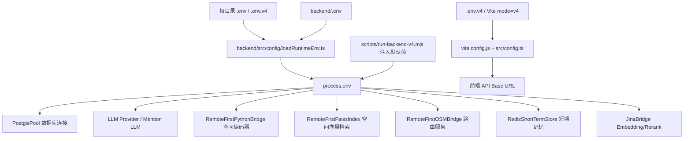
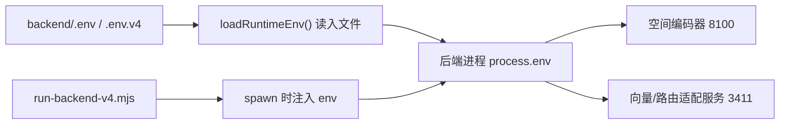
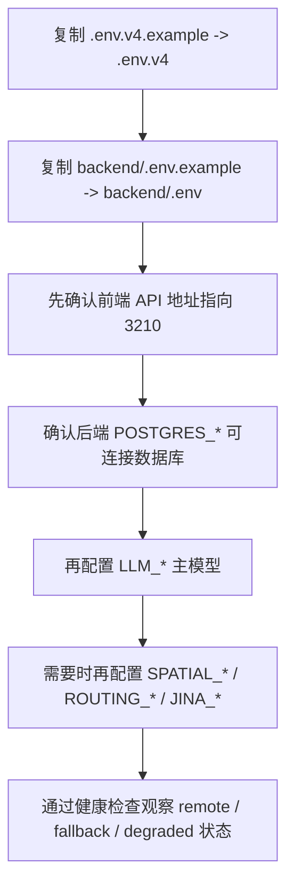

这一页只解释 **GeoLoom Agent 当前仓库里“配置文件如何被读取、分别控制什么、初学者应该改哪些项”**。从代码的第一原则看，这个项目的配置并不是“一个文件管全部”，而是分成 **前端运行配置**、**后端运行配置**、**启动脚本注入的默认值** 三层；真正理解它们的优先级，比死记变量名更重要。Sources: [README.md](README.md#L74-L123) [backend/src/config/loadRuntimeEnv.ts](backend/src/config/loadRuntimeEnv.ts#L36-L72)

对初学者最重要的结论可以先说在前面：前端主要使用根目录的 **`.env.v4` / `.env.v4.example`**，后端主要使用 **`backend/.env` / `backend/.env.example`**，而后端启动包装脚本还会在启动时补上一批默认远端地址，因此你即使没有手动填写全部空间服务地址，开发脚本也可能让系统先跑起来。Sources: [README.md](README.md#L83-L103) [package.json](package.json#L11-L24) [scripts/run-backend-v4.mjs](scripts/run-backend-v4.mjs#L13-L29)

## 先建立整体模型：配置从哪里来，流向哪里去

从实现上看，后端在 `server.ts` 启动最开始就执行 `loadRuntimeEnv()`，说明 **环境变量装载发生在后端所有服务创建之前**。随后数据库池、短期记忆、空间编码器、向量检索、路由桥接、Jina 网关等对象都直接从 `process.env` 读取配置，因此配置文件本质上是后端依赖装配的输入层。Sources: [backend/src/server.ts](backend/src/server.ts#L1-L4) [backend/src/server.ts](backend/src/server.ts#L39-L79) [backend/src/server.ts](backend/src/server.ts#L155-L257)

在前端侧，配置没有经过后端那种运行期文件装载，而是由 Vite 在构建/开发时读取环境变量，然后通过 `src/config.ts` 解析为 API 基地址。也就是说，**前端配置是“编译时/启动时决定的”，后端配置是“Node 进程启动时决定的”**。这也是为什么根目录有 `.env.v4.example`，而前端代码只关心 `VITE_*` 变量。Sources: [src/config.ts](src/config.ts#L1-L58) [vite.config.js](vite.config.js#L12-L19)

下面这个关系图有助于你把三层配置区分开：Mermaid 图里的“启动脚本注入”不是独立文件，但它会覆盖默认地址理解，因此必须和配置文件一起看。Sources: [backend/src/config/loadRuntimeEnv.ts](backend/src/config/loadRuntimeEnv.ts#L40-L59) [scripts/run-backend-v4.mjs](scripts/run-backend-v4.mjs#L13-L29)



## 配置优先级：谁覆盖谁

后端的加载顺序是明确写死的：候选文件依次为 **根目录 `.env` → 根目录 `.env.v4` → `backend/.env`**，后读取的值会覆盖前面的值；但最终合并时，**已有的 `process.env` 又会覆盖这些文件值**。这意味着如果你在命令行、脚本或操作系统里显式设置了某个环境变量，它的优先级最高。Sources: [backend/src/config/loadRuntimeEnv.ts](backend/src/config/loadRuntimeEnv.ts#L36-L65)

对 beginner 来说，可以把优先级记成下面这张表：如果某个值“看起来不是你在文件里写的那个”，优先怀疑是不是被启动脚本或系统环境覆盖了。Sources: [backend/src/config/loadRuntimeEnv.ts](backend/src/config/loadRuntimeEnv.ts#L40-L65) [scripts/run-backend-v4.mjs](scripts/run-backend-v4.mjs#L13-L29)

| 优先级 | 来源 | 典型用途 | 说明 |
|---|---|---|---|
| 最高 | 进程环境变量 `process.env` | CI、脚本注入、临时覆盖 | 最终覆盖所有文件值 |
| 高 | `backend/.env` | 后端正式本地配置 | 后端专用主配置 |
| 中 | 根目录 `.env.v4` | 前端 v4 模式、也可被后端读到 | 后端加载器会读取 |
| 低 | 根目录 `.env` | 通用根配置 | 可作为基础值 |
| 额外影响 | `run-backend-v4.mjs` 默认注入 | 给后端补空间依赖地址 | 本质上属于高优先级进程环境 |

## 你会接触到的配置文件

从仓库和说明可以验证，当前项目显式提供了两份示例文件：**根目录 `.env.v4.example`** 和 **`backend/.env.example`**。README 也明确给出在新机器上从示例复制到真实环境文件的命令。Sources: [README.md](README.md#L83-L103) [.env.v4.example](.env.v4.example#L1-L11) [backend/.env.example](backend/.env.example#L1-L49)

从用途划分看，可以这样理解：`.env.v4` 负责告诉前端“该把 API 请求打到哪里”；`backend/.env` 负责告诉后端“数据库、LLM、空间服务、Redis、Jina 等依赖怎么连”。如果你只想让页面能请求到后端，通常先改前端文件；如果你想让后端真正能访问数据库或模型，再改 `backend/.env`。Sources: [src/config.ts](src/config.ts#L24-L58) [backend/src/integration/postgisPool.ts](backend/src/integration/postgisPool.ts#L27-L48) [backend/src/llm/createDefaultLLMProvider.ts](backend/src/llm/createDefaultLLMProvider.ts#L21-L56)

项目结构里与本页相关的配置入口可以简化为下面这样。它只展示当前页面需要理解的文件，不展开其他系统模块。Sources: [README.md](README.md#L83-L103) [backend/src/config/loadRuntimeEnv.ts](backend/src/config/loadRuntimeEnv.ts#L36-L44)

```text
geoloom-agent/
├─ .env.v4.example        # 前端 v4 模式示例配置
├─ .env.v4                # 前端本地实际配置
├─ .env                   # 根级通用配置，可被后端读取
├─ backend/
│  ├─ .env.example        # 后端示例配置
│  ├─ .env                # 后端本地实际配置
│  └─ src/config/loadRuntimeEnv.ts
├─ src/config.ts          # 前端读取 VITE_* 变量
└─ scripts/run-backend-v4.mjs  # 后端启动时补默认环境变量
```

## 前端环境配置：`.env.v4` 主要控制什么

`.env.v4.example` 当前非常短，只包含 `VITE_BACKEND_VERSION`、三个 API Base 变量，以及一组 Jina 变量。就前端真正直接使用的代码而言，核心是 `VITE_BACKEND_VERSION`、`VITE_DEV_API_BASE`、`VITE_AI_DEV_API_BASE`、`VITE_SPATIAL_DEV_API_BASE` 这一组。Sources: [.env.v4.example](.env.v4.example#L1-L11) [src/config.ts](src/config.ts#L24-L58)

`src/config.ts` 的解析逻辑显示：在开发环境中，前端会优先读取 `VITE_AI_DEV_API_BASE` 和 `VITE_SPATIAL_DEV_API_BASE`；如果没填，则回退到 `VITE_DEV_API_BASE`；如果还没填，则依据 `VITE_BACKEND_VERSION` 自动选择默认后端地址。`v4` 模式默认是 `http://127.0.0.1:3210`。Sources: [src/config.ts](src/config.ts#L24-L38)

还有一个容易忽略但很关键的点：如果 AI 和 Spatial 的开发地址都是本地同一个地址，且没有开启 `VITE_DIRECT_DEV_API`，前端会优先走 **同源代理**，把 API base 解析成空字符串 `''`，再让 Vite 代理 `/api/*` 请求。这能减少跨域问题，也是很多初学者会误解的地方——“为什么配置了 3210，代码里最后却像没写 base URL”。Sources: [src/config.ts](src/config.ts#L39-L48) [vite.config.js](vite.config.js#L70-L100)

下面这张表是前端变量的最小必要理解。Sources: [.env.v4.example](.env.v4.example#L1-L11) [src/config.ts](src/config.ts#L24-L58) [vite.config.js](vite.config.js#L12-L19)

| 变量 | 作用 | 默认/回退行为 | 初学者建议 |
|---|---|---|---|
| `VITE_BACKEND_VERSION` | 指定后端版本模式 | `v4` 时默认开发地址为 `3210` | 保持 `v4` |
| `VITE_DEV_API_BASE` | 开发环境通用 API 地址 | 供 AI/Spatial 共用回退 | 本地开发通常设为 `http://127.0.0.1:3210` |
| `VITE_AI_DEV_API_BASE` | AI 请求专用开发地址 | 未设时回退到 `VITE_DEV_API_BASE` | 一般与后端同值 |
| `VITE_SPATIAL_DEV_API_BASE` | 空间请求专用开发地址 | 未设时回退到 `VITE_DEV_API_BASE` | 一般与后端同值 |
| `VITE_DIRECT_DEV_API` | 是否跳过同源代理 | 未开启时可能返回空 base，让 Vite 代理 | 不确定时先不要开 |

## Vite 代理与前端地址解析：为什么“看起来没配置也能通”

`vite.config.js` 中，开发服务器把 `/api/geo`、`/api/ai`、`/api/category`、`/api/spatial`、`/api/search` 全都代理到 `proxyTarget`；而 `proxyTarget` 首先取 `VITE_DEV_API_BASE`，否则在 `v4` 模式下默认指向 `http://127.0.0.1:3210`。所以只要后端本地在 3210 起起来，前端哪怕没有写很复杂的环境文件，开发模式通常也能正常访问。Sources: [vite.config.js](vite.config.js#L12-L19) [vite.config.js](vite.config.js#L70-L100)

这也是为什么“前端配置”和“后端配置”不能混为一谈：前端这里控制的是 **浏览器请求路由**，不是数据库、模型、空间服务本身。初学者如果遇到“页面能打开，但查询结果不对或服务 degraded”，问题往往已经不在前端 `.env.v4`，而在后端环境变量。Sources: [src/config.ts](src/config.ts#L24-L58) [backend/src/server.ts](backend/src/server.ts#L50-L79)

## 后端环境配置：`backend/.env` 是真正的运行核心

`backend/.env.example` 展示了后端当前最完整的配置入口，内容可分为 **服务监听**、**Postgres/PostGIS**、**LLM 主模型与回退模型**、**空间编码器/向量检索/路由服务**、**Redis 短期记忆**、**Jina 在线 API** 六组。Sources: [backend/.env.example](backend/.env.example#L1-L49)

后端入口 `server.ts` 直接根据这些变量创建数据库池、SQL 沙箱、短期记忆、空间桥接和 Jina 网关，因此 `backend/.env` 不是“可选附加项”，而是后端行为的主要控制面。即使某些依赖没有配，代码也会回退到本地 fallback 或 degraded 模式，但那只是为了让系统继续运行，不代表功能完整。Sources: [backend/src/server.ts](backend/src/server.ts#L50-L79) [backend/src/integration/faissIndex.ts](backend/src/integration/faissIndex.ts#L138-L170) [backend/src/integration/osmBridge.ts](backend/src/integration/osmBridge.ts#L80-L110)

## 服务监听与数据库参数

后端示例文件中，`PORT` 和 `HOST` 决定 Fastify 服务监听地址；`server.ts` 的默认值分别是 `3210` 和 `127.0.0.1`。这与你在 README 看到的开发地址完全一致。Sources: [backend/.env.example](backend/.env.example#L1-L2) [backend/src/server.ts](backend/src/server.ts#L39-L40) [README.md](README.md#L55-L60)

数据库连接由 `PostgisPool` 使用 `POSTGRES_HOST`、`POSTGRES_PORT`、`POSTGRES_USER`、`POSTGRES_PASSWORD`、`POSTGRES_DATABASE`、`POSTGRES_POOL_MAX` 构建；如果没配，会回退到 `127.0.0.1:15432 / postgres / 123456 / geoloom / 10`。同时 `server.ts` 还把 `POSTGRES_QUERY_TIMEOUT_MS`、`SQL_STATEMENT_TIMEOUT_MS`、`SQL_MAX_ROWS` 用于查询超时和 SQL 沙箱限制。Sources: [backend/.env.example](backend/.env.example#L3-L11) [backend/src/integration/postgisPool.ts](backend/src/integration/postgisPool.ts#L27-L48) [backend/src/server.ts](backend/src/server.ts#L50-L58)

下面这张表适合用来区分“连接参数”和“安全/性能约束参数”。Sources: [backend/.env.example](backend/.env.example#L3-L11) [backend/src/integration/postgisPool.ts](backend/src/integration/postgisPool.ts#L27-L38) [backend/src/server.ts](backend/src/server.ts#L50-L58)

| 变量 | 作用 | 代码中的默认值 | 影响 |
|---|---|---|---|
| `POSTGRES_HOST` | 数据库主机 | `127.0.0.1` | 决定连接目标 |
| `POSTGRES_PORT` | 数据库端口 | `15432` | 决定连接端口 |
| `POSTGRES_USER` | 用户名 | `postgres` | 决定认证身份 |
| `POSTGRES_PASSWORD` | 密码 | `123456` | 决定认证凭据 |
| `POSTGRES_DATABASE` | 数据库名 | `geoloom` | 决定连接库 |
| `POSTGRES_POOL_MAX` | 连接池大小 | `10` | 决定并发连接上限 |
| `POSTGRES_QUERY_TIMEOUT_MS` | 查询超时 | `5000` | 控制池查询时限 |
| `SQL_STATEMENT_TIMEOUT_MS` | SQL 语句时限 | `3000` | 控制单条 SQL 执行上限 |
| `SQL_MAX_ROWS` | 返回最大行数 | `200` | 控制结果规模 |

## LLM 参数：主模型与回退模型如何装配

LLM 的默认装配逻辑集中在 `createDefaultLLMProvider.ts`。它会先按前缀读取一组变量创建主模型 `LLM_*`，再读取 `LLM_FALLBACK_*` 创建回退模型；若 fallback 未就绪，就只返回主模型；若 fallback 已配置可用，则返回一个 `FailoverLLMProvider`。这说明当前项目的 LLM 配置不是“单实例”，而是 **主模型 + 可选故障转移模型**。Sources: [backend/src/llm/createDefaultLLMProvider.ts](backend/src/llm/createDefaultLLMProvider.ts#L12-L19) [backend/src/llm/createDefaultLLMProvider.ts](backend/src/llm/createDefaultLLMProvider.ts#L21-L56)

协议选择也不是硬编码某一家厂商。代码会先看 `LLM_PROTOCOL`；如果没填，再根据 `BASE_URL` 是否包含 `/anthropic` 推断协议，否则默认按 `openai` 兼容接口处理。因此 `.env.example` 里的 `LLM_PROTOCOL=openai` 与 `LLM_FALLBACK_PROTOCOL=anthropic`，实际上是在告诉系统分别实例化不同兼容层。Sources: [backend/.env.example](backend/.env.example#L12-L26) [backend/src/llm/createDefaultLLMProvider.ts](backend/src/llm/createDefaultLLMProvider.ts#L12-L19) [backend/src/llm/createDefaultLLMProvider.ts](backend/src/llm/createDefaultLLMProvider.ts#L21-L42)

对于初学者，最实用的理解方式如下。Sources: [backend/.env.example](backend/.env.example#L12-L26) [backend/src/llm/createDefaultLLMProvider.ts](backend/src/llm/createDefaultLLMProvider.ts#L21-L56)

| 变量组 | 作用 | 关键字段 |
|---|---|---|
| `LLM_*` | 主模型配置 | `PROTOCOL`、`BASE_URL`、`API_KEY`、`MODEL`、`TIMEOUT_MS` |
| `LLM_FALLBACK_*` | 回退模型配置 | 同上，外加 `ANTHROPIC_VERSION`、`MAX_TOKENS` |
| `LLM_MAX_TOKENS` | 令牌上限 | 主要对 anthropic 兼容路径提供回退值 |
| `LLM_ANALYSIS_TIMEOUT_MS` / `LLM_SYNTHESIS_TIMEOUT_MS` | 更细粒度超时 | 在示例文件中存在，但本页可验证代码主要展示了 provider 级超时读取 |

需要特别谨慎的一点是：本仓库示例文件里出现了真实风格的 API Key 文本。作为文档作者，这里只能陈述一个可验证事实：**示例文件中确实包含密钥样式字段**；从安全实践角度，你在自己的环境中应使用私有密钥并避免提交到版本库。Sources: [backend/.env.example](backend/.env.example#L44-L49) [.env.v4.example](.env.v4.example#L6-L11)

## Mention LLM：一个容易被忽略的扩展配置点

`server.ts` 里注册 Web POI Discovery skill 时，没有只用主 `LLM_*`，而是优先读取 `MENTION_LLM_BASE_URL`、`MENTION_LLM_API_KEY`、`MENTION_LLM_MODEL`；若这些未设置，再降级到主 `LLM_*`。这说明后端实际上支持“某个子任务使用专门的小模型”这一配置模式。Sources: [backend/src/server.ts](backend/src/server.ts#L161-L170)

这类变量不在 `backend/.env.example` 中完整展示，但代码已明确支持。对初学者而言，正确理解不是“必须马上补齐”，而是知道：**当你以后需要给 mention 提取单独换模型时，系统已有独立变量入口**。Sources: [backend/src/server.ts](backend/src/server.ts#L161-L170)

## 空间参数：空间编码器、向量检索、路径规划分别怎么配

空间相关配置分成三套远端依赖，而不是一个统一的 `SPATIAL_*` 开关。`backend/.env.example` 分别给出了 **空间编码器**、**空间向量检索**、**路由服务** 的 `BASE_URL / PATH / HEALTH_PATH / TIMEOUT_MS`。这说明当前架构把三类能力视为独立服务。Sources: [backend/.env.example](backend/.env.example#L27-L39)

### 1）空间编码器参数

`RemoteFirstPythonBridge` 会读取 `SPATIAL_ENCODER_BASE_URL`、`SPATIAL_ENCODER_ENCODE_PATH`、`SPATIAL_ENCODER_HEALTH_PATH`，并且还支持更细的 `SPATIAL_ENCODER_REGION_ENCODE_PATH`、`SPATIAL_ENCODER_POI_ENCODE_PATH`、`SPATIAL_ENCODER_CELL_CONTEXT_PATH`、`SPATIAL_ENCODER_CELL_SEARCH_PATH`、`SPATIAL_ENCODER_BATCH_CELL_CONTEXT_PATH`。如果没有配置 `BASE_URL`，它会退回本地 `LocalPythonBridge`。Sources: [backend/.env.example](backend/.env.example#L27-L30) [backend/src/integration/pythonBridge.ts](backend/src/integration/pythonBridge.ts#L220-L301)

更关键的是，这个桥接类是 **remote-first**：有远端地址就优先请求远端，失败再 fallback；没远端地址时直接 local。它的状态对象会在 `remote / local / fallback` 间切换，所以“服务没挂”和“正在用真实远端”不是同一件事。Sources: [backend/src/integration/pythonBridge.ts](backend/src/integration/pythonBridge.ts#L257-L301) [backend/src/integration/pythonBridge.ts](backend/src/integration/pythonBridge.ts#L332-L414)

### 2）空间向量检索参数

`RemoteFirstFaissIndex` 使用 `SPATIAL_VECTOR_BASE_URL`、`SPATIAL_VECTOR_POI_PATH`、`SPATIAL_VECTOR_REGION_PATH`、`SPATIAL_VECTOR_HEALTH_PATH`、`SPATIAL_VECTOR_TIMEOUT_MS`。如果远端不可达，会回退到本地 `LocalFaissIndex`，其返回的是内置样例候选，而非真实向量库查询。Sources: [backend/.env.example](backend/.env.example#L31-L35) [backend/src/integration/faissIndex.ts](backend/src/integration/faissIndex.ts#L113-L170) [backend/src/integration/faissIndex.ts](backend/src/integration/faissIndex.ts#L201-L265)

这意味着对 beginner 来说，最重要的判断标准不是“接口有结果”，而是健康状态中的 mode 是否为 `remote`。如果是 `fallback` 或 `local`，系统可能只是用本地降级数据在维持流程可跑。Sources: [backend/src/integration/faissIndex.ts](backend/src/integration/faissIndex.ts#L155-L170) [backend/src/integration/faissIndex.ts](backend/src/integration/faissIndex.ts#L247-L265) [README.md](README.md#L133-L147)

### 3）路由服务参数

`RemoteFirstOSMBridge` 使用 `ROUTING_BASE_URL`、`ROUTING_ROUTE_PATH`、`ROUTING_HEALTH_PATH`、`ROUTING_TIMEOUT_MS`。如果远端不可用，就退回本地 Haversine 近似距离估算；代码里这个 fallback 明确标记 `degraded: true`，原因是 `routing_service_unavailable`。Sources: [backend/.env.example](backend/.env.example#L36-L39) [backend/src/integration/osmBridge.ts](backend/src/integration/osmBridge.ts#L16-L31) [backend/src/integration/osmBridge.ts](backend/src/integration/osmBridge.ts#L33-L55) [backend/src/integration/osmBridge.ts](backend/src/integration/osmBridge.ts#L67-L190)

下面这张表把三类空间参数放在一起看，更容易形成系统感。Sources: [backend/.env.example](backend/.env.example#L27-L39) [backend/src/integration/pythonBridge.ts](backend/src/integration/pythonBridge.ts#L257-L301) [backend/src/integration/faissIndex.ts](backend/src/integration/faissIndex.ts#L138-L170) [backend/src/integration/osmBridge.ts](backend/src/integration/osmBridge.ts#L80-L110)

| 能力 | Base URL 变量 | 关键 Path 变量 | 未配置时行为 |
|---|---|---|---|
| 空间编码器 | `SPATIAL_ENCODER_BASE_URL` | `ENCODE_PATH`、`HEALTH_PATH`，以及 region/poi/cell 系列 path | 回退到 `LocalPythonBridge` |
| 向量检索 | `SPATIAL_VECTOR_BASE_URL` | `POI_PATH`、`REGION_PATH`、`HEALTH_PATH` | 回退到 `LocalFaissIndex` |
| 路由距离 | `ROUTING_BASE_URL` | `ROUTE_PATH`、`HEALTH_PATH` | 回退到 `LocalOSMBridge` |

## 启动脚本默认注入：为什么空间服务经常“不配也像配了”

`scripts/run-backend-v4.mjs` 会在启动后端时主动注入默认值，包括 `SPATIAL_ENCODER_BASE_URL=http://127.0.0.1:8100`、`SPATIAL_VECTOR_BASE_URL=http://127.0.0.1:3411`、`SPATIAL_VECTOR_HEALTH_PATH=/health/vector`、`ROUTING_BASE_URL=http://127.0.0.1:3411`、`ROUTING_HEALTH_PATH=/health/routing` 等。README 也明确说明这些是默认连接关系。Sources: [scripts/run-backend-v4.mjs](scripts/run-backend-v4.mjs#L13-L29) [README.md](README.md#L113-L121)

这会带来一个非常典型的初学者困惑：你在 `backend/.env` 里没写空间服务地址，但 `npm run dev:v4` 启动后仍然能看到后端尝试连接 8100 和 3411。原因不是“神秘默认值”，而是启动脚本在创建子进程时把这些值放进了 `env`。Sources: [scripts/run-backend-v4.mjs](scripts/run-backend-v4.mjs#L44-L54)

如果把“文件配置”和“脚本注入”关系画出来，会更直观。Sources: [backend/src/config/loadRuntimeEnv.ts](backend/src/config/loadRuntimeEnv.ts#L56-L65) [scripts/run-backend-v4.mjs](scripts/run-backend-v4.mjs#L13-L29)



## Redis 与短期记忆参数

`backend/.env.example` 中的 `REDIS_URL`、`REDIS_CONNECT_TIMEOUT_MS`、`SHORT_TERM_MEMORY_TTL_MS`、`SHORT_TERM_MEMORY_PREFIX`` 控制短期记忆。创建逻辑很清楚：如果 `REDIS_URL` 为空，`createRedisShortTermStoreFromEnv()` 返回 `null`；如果存在，就创建 Redis store，并把前缀和连接超时一起带入。Sources: [backend/.env.example](backend/.env.example#L40-L43) [backend/src/memory/RedisShortTermStore.ts](backend/src/memory/RedisShortTermStore.ts#L209-L220) [backend/src/server.ts](backend/src/server.ts#L60-L63)

因此这里不是“Redis 必填”。更准确地说，**Redis 是可选增强配置**：填了可以把短期记忆落到 Redis，不填则系统仍能运行，但不会启用这一路远端存储。Sources: [backend/src/memory/RedisShortTermStore.ts](backend/src/memory/RedisShortTermStore.ts#L209-L220) [backend/src/server.ts](backend/src/server.ts#L60-L66)

## Jina 参数：Embedding 与 Reranker 的在线能力入口

Jina 配置同时出现在根目录 `.env.v4.example` 和 `backend/.env.example` 中，字段包括 `JINA_API_KEY`、`JINA_EMBED_URL`、`JINA_RERANK_URL`、`JINA_EMBEDDING_MODEL`、`JINA_RERANKER_MODEL`。就后端实际代码而言，`JinaBridge` 从 `process.env` 读取这五个变量，并提供 embed 与 rerank 两项能力。Sources: [.env.v4.example](.env.v4.example#L6-L11) [backend/.env.example](backend/.env.example#L44-L49) [backend/src/integration/jinaBridge.ts](backend/src/integration/jinaBridge.ts#L123-L185)

如果 `JINA_API_KEY` 不存在或在线接口失败，`JinaBridge` 会降级到本地 `LocalFallbackBridge`。这个本地回退不是空实现，而是使用字符 bigram 的 Jaccard 相似度和 1024 维本地向量近似，这使系统在无远端 API 时仍可继续工作。Sources: [backend/src/integration/jinaBridge.ts](backend/src/integration/jinaBridge.ts#L39-L119) [backend/src/integration/jinaBridge.ts](backend/src/integration/jinaBridge.ts#L209-L267)

同时，`server.ts` 里 `CategoryEmbeddingIndex`、`PoiEmbeddingCache`、`EmbeddingIntentClassifier` 都依赖 `jinaBridge`，所以 Jina 配置并不只是“某个可有可无的实验项”，而是当前 embedding-first 路径的重要基础能力。Sources: [backend/src/server.ts](backend/src/server.ts#L155-L158) [backend/src/server.ts](backend/src/server.ts#L175-L235)

## 一张总表：当前页面涉及的核心配置项

为了方便 beginner 快速定位，下面按用途汇总最核心的一批变量。Sources: [.env.v4.example](.env.v4.example#L1-L11) [backend/.env.example](backend/.env.example#L1-L49) [src/config.ts](src/config.ts#L24-L58)

| 类别 | 关键变量 | 你什么时候需要改 |
|---|---|---|
| 前端 API | `VITE_BACKEND_VERSION`、`VITE_DEV_API_BASE`、`VITE_AI_DEV_API_BASE`、`VITE_SPATIAL_DEV_API_BASE` | 前端请求地址不对、想切换开发后端 |
| 服务监听 | `PORT`、`HOST` | 后端端口冲突或要换监听地址 |
| 数据库 | `POSTGRES_*` | 后端连不上 PostGIS |
| SQL 限制 | `POSTGRES_QUERY_TIMEOUT_MS`、`SQL_STATEMENT_TIMEOUT_MS`、`SQL_MAX_ROWS` | 查询太慢或结果过大 |
| 主 LLM | `LLM_*` | 想接入主模型 |
| 回退 LLM | `LLM_FALLBACK_*` | 想启用故障转移模型 |
| Mention LLM | `MENTION_LLM_*` | 想给 mention 提取单独配小模型 |
| 空间编码器 | `SPATIAL_ENCODER_*` | 编码服务地址变化或健康检查失败 |
| 空间向量检索 | `SPATIAL_VECTOR_*` | 向量检索服务地址变化 |
| 路由服务 | `ROUTING_*` | 距离计算要切到指定服务 |
| 短期记忆 | `REDIS_URL`、`SHORT_TERM_MEMORY_*` | 想把短期记忆放到 Redis |
| 在线 Embedding/Rerank | `JINA_*` | 想启用 Jina 在线能力 |

## 初学者最安全的修改顺序

如果你是第一次配置这个项目，最小可行顺序不是“把所有变量全部填完”，而是按依赖层级逐步验证：先复制示例文件，再确认前端能请求到后端，再确认后端能连数据库，最后再接入 LLM 和空间远端依赖。这种顺序符合当前代码的容错设计，因为后端允许部分依赖处于 fallback/degraded 模式。Sources: [README.md](README.md#L96-L103) [backend/src/integration/pythonBridge.ts](backend/src/integration/pythonBridge.ts#L332-L414) [backend/src/integration/faissIndex.ts](backend/src/integration/faissIndex.ts#L201-L265) [backend/src/integration/osmBridge.ts](backend/src/integration/osmBridge.ts#L112-L190)

下面这个步骤图只针对“配置理解与最小修改”，不展开启动命令细节。若你还没有完成环境复制和项目启动，建议先回到 [快速开始：环境配置与启动指南](2-kuai-su-kai-shi-huan-jing-pei-zhi-yu-qi-dong-zhi-nan)。Sources: [README.md](README.md#L74-L103) [package.json](package.json#L11-L24)



## 常见误区与排查思路

**误区一：页面能打开就说明配置正确。** 实际上前端能打开只代表 Vite 和浏览器工作正常，最多说明 API 代理路径可达；数据库、LLM、空间服务仍可能未正确配置。应继续检查后端健康状态和依赖模式。Sources: [vite.config.js](vite.config.js#L70-L100) [README.md](README.md#L125-L148)

**误区二：没在 `backend/.env` 写空间地址，就不会连接空间服务。** 实际并非如此，因为 `run-backend-v4.mjs` 会注入 8100 和 3411 这些默认地址。Sources: [scripts/run-backend-v4.mjs](scripts/run-backend-v4.mjs#L13-L29) [scripts/run-backend-v4.mjs](scripts/run-backend-v4.mjs#L44-L54)

**误区三：接口返回了内容，就说明正在使用真实远端能力。** 代码中多个组件都有 local/fallback 实现，所以必须看状态是 `remote`、`fallback` 还是 `local`。README 也专门提示用健康接口检查 `dependencies.*.mode`。Sources: [backend/src/integration/pythonBridge.ts](backend/src/integration/pythonBridge.ts#L286-L301) [backend/src/integration/faissIndex.ts](backend/src/integration/faissIndex.ts#L155-L170) [backend/src/integration/osmBridge.ts](backend/src/integration/osmBridge.ts#L94-L110) [README.md](README.md#L125-L148)

## 推荐阅读路径

如果你已经理解了本页的变量分层，下一步最合适的是回看配置如何参与启动与请求流转：先读 [快速开始：环境配置与启动指南](2-kuai-su-kai-shi-huan-jing-pei-zhi-yu-qi-dong-zhi-nan)，再读 [架构概览：前端、后端与 AI 引擎协同](3-jia-gou-gai-lan-qian-duan-hou-duan-yu-ai-yin-qing-xie-tong)，然后进入 [请求生命周期管理：从用户输入到流式响应](7-qing-qiu-sheng-ming-zhou-qi-guan-li-cong-yong-hu-shu-ru-dao-liu-shi-xiang-ying)。Sources: [README.md](README.md#L41-L73) [backend/src/server.ts](backend/src/server.ts#L226-L257) [backend/src/app.ts](backend/src/app.ts#L33-L67)

如果你现在最关心的是“某类配置到底驱动了哪个子系统”，可以按主题继续深入：LLM 相关读 [LLM 集成：意图识别与推理引擎](5-llm-ji-cheng-yi-tu-shi-bie-yu-tui-li-yin-qing)，空间依赖相关读 [空间数据服务：OSM 桥接与 PostGIS 存储](6-kong-jian-shu-ju-fu-wu-osm-qiao-jie-yu-postgis-cun-chu)，前端环境变量相关读 [前端架构：Vue 3 + Vite + 地理可视化组件](9-qian-duan-jia-gou-vue-3-vite-di-li-ke-shi-hua-zu-jian)。Sources: [src/config.ts](src/config.ts#L24-L58) [backend/src/llm/createDefaultLLMProvider.ts](backend/src/llm/createDefaultLLMProvider.ts#L21-L56) [backend/src/integration/postgisPool.ts](backend/src/integration/postgisPool.ts#L27-L48)