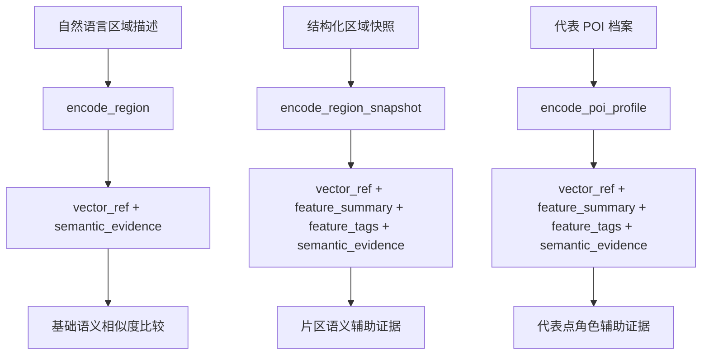
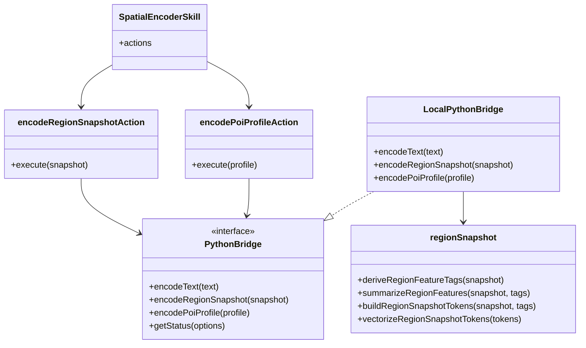

本页聚焦 GeoLoom Agent 中**空间编码器如何把区域快照与代表 POI 档案转成可复用向量引用**，以及这些编码结果如何以“语义辅助证据”而非硬事实的身份进入后续推理链。就实现边界而言，这里只讨论 `spatial_encoder` skill、区域/POI 编码契约、本地 fallback 的特征抽取逻辑，以及编码输出的结构化结果，不展开 FAISS 检索、PostGIS 查询或上层智能体编排细节。Sources: [SKILL.md](backend/SKILLS/SpatialEncoder/SKILL.md#L1-L14), [SpatialEncoderSkill.ts](backend/src/skills/spatial_encoder/SpatialEncoderSkill.ts#L1-L165)

从第一性原理看，这套设计要解决的不是“把地理对象存成向量”这么简单，而是把**自然语言空间语义、区域结构信号、代表点角色信号**统一压缩为可比较、可引用、可审计的中间表示。仓库中的实现已经形成三层抽象：`encode_region` 处理纯文本区域描述，`encode_region_snapshot` 处理结构化片区快照，`encode_poi_profile` 处理代表 POI 档案；三者最终都生成 `embedding_id`、`vector_ref` 与 `semantic_evidence`，但只有后两者额外返回 `feature_summary` 与 `feature_tags`，说明系统明确区分“文本向量化”与“结构化语义建模”两类能力。Sources: [SpatialEncoderSkill.ts](backend/src/skills/spatial_encoder/SpatialEncoderSkill.ts#L14-L165), [encodeRegion.ts](backend/src/skills/spatial_encoder/actions/encodeRegion.ts#L9-L47), [encodeRegionSnapshot.ts](backend/src/skills/spatial_encoder/actions/encodeRegionSnapshot.ts#L9-L50), [encodePoiProfile.ts](backend/src/skills/spatial_encoder/actions/encodePoiProfile.ts#L9-L50)

## 编码器在体系中的职责定位

`SpatialEncoder` skill 的元信息写得非常克制：它的职责是把区域或自然语言空间描述编码成向量引用，并做相似度评分；同时文档明确强调，**分数只能作为语义辅助证据，不能冒充硬事实**。这意味着该模块在架构上被定位为“语义压缩层”，不是事实计算层，也不是决策裁判层。对高级开发者而言，这个约束很关键，因为它决定了编码器输出的正确使用方式：可用于召回、辅助聚类、辅助解释、辅助主题识别，但不能直接得出“主导业态”“热点异常”“机会判断”等结论。Sources: [SKILL.md](backend/SKILLS/SpatialEncoder/SKILL.md#L1-L14)

在代码层面，这种职责定位通过统一输出中的 `semantic_evidence` 字段被制度化。无论是 `encode_region`、`encode_region_snapshot` 还是 `encode_poi_profile`，都会在调用 bridge 后通过 `toSemanticEvidenceStatus(await deps.bridge.getStatus({ probe: false }))` 补充依赖状态，再连同向量引用一起返回。也就是说，编码结果从生成之初就带着“这份语义证据来自什么依赖状态”的元信息，使上层能够区分远程模型、局部 fallback 或弱证据模式。Sources: [encodeRegion.ts](backend/src/skills/spatial_encoder/actions/encodeRegion.ts#L21-L45), [encodeRegionSnapshot.ts](backend/src/skills/spatial_encoder/actions/encodeRegionSnapshot.ts#L23-L49), [encodePoiProfile.ts](backend/src/skills/spatial_encoder/actions/encodePoiProfile.ts#L23-L49)

## 概念关系图：三类空间向量化入口

在阅读下面的 Mermaid 图之前，需要先把三个输入层次区分清楚：**区域文本**是最低语义密度的自由文本；**区域快照**是片区级结构化证据汇总；**POI 档案**是单个代表点的角色画像。它们都进入同一个 skill，但编码粒度和输出解释能力并不相同。Sources: [SpatialEncoderSkill.ts](backend/src/skills/spatial_encoder/SpatialEncoderSkill.ts#L14-L165), [pythonBridge.ts](backend/src/integration/pythonBridge.ts#L63-L84)

Sources: [SpatialEncoderSkill.ts](backend/src/skills/spatial_encoder/SpatialEncoderSkill.ts#L14-L165), [encodeRegion.ts](backend/src/skills/spatial_encoder/actions/encodeRegion.ts#L9-L47), [encodeRegionSnapshot.ts](backend/src/skills/spatial_encoder/actions/encodeRegionSnapshot.ts#L9-L50), [encodePoiProfile.ts](backend/src/skills/spatial_encoder/actions/encodePoiProfile.ts#L9-L50)

## Skill 接口与动作矩阵

从 `SpatialEncoderSkill.ts` 可以直接验证，该 skill 已经不再只有最初文档中的 `encode_query / encode_region / score_similarity` 三个动作，而是扩展出 `encode_region_snapshot` 与 `encode_poi_profile` 两类结构化编码动作。这说明仓库已经从“单句文本 embedding”演进到“证据对象 embedding”，并且输入 schema 已经把区域快照和 POI 档案建模为 JSON 对象，而不是拼接字符串后直接投喂模型。Sources: [SKILL.md](backend/SKILLS/SpatialEncoder/SKILL.md#L1-L14), [SpatialEncoderSkill.ts](backend/src/skills/spatial_encoder/SpatialEncoderSkill.ts#L14-L165)

| 动作 | 输入形态 | 输出形态 | 语义层级 | 适用场景 |
|---|---|---|---|---|
| `encode_query` | `{ text }` | 向量引用 + 语义证据 | 查询语义 | 把用户空间描述转成可复用向量 |
| `encode_region` | `{ label \| text }` | 向量引用 + 语义证据 | 区域标签语义 | 区域标签或简短描述编码 |
| `encode_region_snapshot` | `{ snapshot }` | 向量引用 + 特征摘要 + 特征标签 + 语义证据 | 片区结构语义 | 片区级证据压缩 |
| `encode_poi_profile` | `{ profile }` | 向量引用 + 特征摘要 + 特征标签 + 语义证据 | 代表点角色语义 | 代表样本的角色建模 |
| `score_similarity` | 向量引用对 | 相似度分数 | 向量比较 | 语义相似辅助判断 |

Sources: [SpatialEncoderSkill.ts](backend/src/skills/spatial_encoder/SpatialEncoderSkill.ts#L14-L165), [SKILL.md](backend/SKILLS/SpatialEncoder/SKILL.md#L1-L14)

## 区域快照编码：从片区证据到特征标签

`encode_region_snapshot` 的输入 schema 明确要求 `snapshot`，并允许包含 `anchorName`、`subjectName`、`rawQuery`、`dominantCategories`、`ringDistribution`、`hotspots`、`representativePois`、`aoiContext`、`landuseContext`、`competitionDensity` 等字段。这个集合非常说明问题：区域编码并不是直接对“光谷商圈”这种标签做向量化，而是对**片区结构证据的压缩结果**做向量化，因此输出天然带有“主导功能、圈层分布、热点核、AOI/用地语义、竞争密度”的综合视角。Sources: [SpatialEncoderSkill.ts](backend/src/skills/spatial_encoder/SpatialEncoderSkill.ts#L75-L119)

在动作实现中，`encodeRegionSnapshotAction` 的流程非常直接：从 payload 取 `snapshot`，调用 `deps.bridge.encodeRegionSnapshot(snapshot)`，再把 bridge 返回的向量存进 `store`，生成 `vector:region:${embeddingId}` 形式的 `vector_ref`。值得注意的是，`source` 字段并不是原始 JSON，而是 `encoded.summary || snapshot.subjectName || snapshot.anchorName || 'region_snapshot'`，说明向量存储同时保留了一个**可读来源摘要**，便于后续调试和审计。Sources: [encodeRegionSnapshot.ts](backend/src/skills/spatial_encoder/actions/encodeRegionSnapshot.ts#L9-L50)

## 区域特征抽取规则：可验证的启发式，而非黑箱模型

本地 fallback 的核心价值在 `regionSnapshot.ts` 中体现得最清楚。该文件首先定义了四组语义关键词：校园、居住、商业、交通，并通过 `collectSemanticText()` 把 `subjectName`、`anchorName`、AOI 上下文、代表 POI 名称与分类拼接成一个语义文本池。随后，`hasCampusSignal()`、`hasResidentialSignal()`、`hasCommercialSignal()`、`hasTransitSignal()` 分别用关键词匹配和 `landuseContext` 中的 `landType` 联合判定片区信号。整个过程完全可追溯，没有隐藏推理步骤。Sources: [regionSnapshot.ts](backend/src/evidence/areaInsight/regionSnapshot.ts#L8-L16), [regionSnapshot.ts](backend/src/evidence/areaInsight/regionSnapshot.ts#L83-L116)

`deriveRegionFeatureTags()` 则把这些底层信号提升成更稳定的区域特征标签。可验证的规则包括：若存在校园信号则推导 `campus_anchor`；居住与商业同时出现则推导 `mixed_use`，否则分别退化为 `residential_support` 或 `commercial_vitality`；存在交通信号则追加 `transit_connected`；若第一主导品类是餐饮且份额超过阈值，则追加 `food_dominant`；第二主导品类为零售且份额足够高，则追加 `retail_support`；热点数量决定 `single_core_hotspot` 或 `multi_core_hotspot`；近圈层份额足够高时追加 `inner_ring_concentration`；餐饮竞争密度高时追加 `food_competition_dense`；若头部结构中缺少生活服务，则给出 `life_service_gap`。这些规则共同构成了区域编码的**显式特征空间**。Sources: [regionSnapshot.ts](backend/src/evidence/areaInsight/regionSnapshot.ts#L118-L197)

## 区域特征标签对照表

| 特征 key | 标签 | 触发依据 |
|---|---|---|
| `campus_anchor` | 校园主导 | 片区主语、AOI 或用地包含校园/教育信号 |
| `mixed_use` | 居住商业混合 | 居住与商业信号同时成立 |
| `residential_support` | 居住支撑 | 仅居住信号明显 |
| `commercial_vitality` | 商业活力带 | 仅商业信号明显 |
| `transit_connected` | 交通口活力 | 站点/交通接驳语义明显 |
| `food_dominant` | 餐饮主导 | 头部品类为餐饮且 share 达阈值 |
| `retail_support` | 零售配套跟随 | 第二主导品类为零售且占比达阈值 |
| `single_core_hotspot` | 单核热点 | 热点数为 1 |
| `multi_core_hotspot` | 多核活力 | 热点数大于等于 2 |
| `inner_ring_concentration` | 近圈层集聚 | 最近圈层 share 足够高 |
| `food_competition_dense` | 餐饮竞争偏密 | 餐饮竞争 count / avgDistance 达阈值 |
| `life_service_gap` | 生活服务待补 | 头部 dominant categories 缺少生活服务 |

Sources: [regionSnapshot.ts](backend/src/evidence/areaInsight/regionSnapshot.ts#L13-L33), [regionSnapshot.ts](backend/src/evidence/areaInsight/regionSnapshot.ts#L136-L197)

## 区域编码的向量空间不是通用 embedding，而是特征词向量

`regionSnapshot.ts` 还暴露出一个关键实现事实：本地区域编码并不是调用外部 embedding API，而是把结构化区域特征投影到一个固定词汇表 `REGION_SNAPSHOT_VOCABULARY`。其中既包含 `feature:*` 类型的高阶标签，也包含 `category:*` 和 `landuse:*` 类型的中阶标签，例如 `feature:campus_anchor`、`feature:mixed_use`、`category:food`、`landuse:education`。这说明本地 fallback 本质上是一个**规则驱动、固定维度、可解释的稀疏语义向量**。Sources: [regionSnapshot.ts](backend/src/evidence/areaInsight/regionSnapshot.ts#L13-L33)

这种实现的优点是可审计、稳定、无需外部模型即可运行；限制也同样清晰：它表达的是仓库作者定义好的特征空间，而不是开放语义空间中的连续表征。因此它很适合作为工程 fallback 和可解释语义证据，但不应被误读为训练后的区域表征模型。这一点与开发计划中的限制说明完全一致：文档明确区分了“结构化 fallback”与“训练好的区域模型”，并提醒远程 cell model endpoint 的可用性仍需单独确认。Sources: [regionSnapshot.ts](backend/src/evidence/areaInsight/regionSnapshot.ts#L13-L33), [2026-04-09-region-snapshot-encoder.md](docs/plans/2026-04-09-region-snapshot-encoder.md#L119-L123)

## POI 档案编码：从代表样本到角色语义

与区域快照相对，`encode_poi_profile` 关注的是**单个代表 POI 在片区中的角色**。其输入 schema 要求 `profile.name`，并支持 `categoryMain`、`categorySub`、`distanceM`、`areaSubject`、`hotspotLabel`、`surroundingCategories`、`aoiContext` 等字段。这意味着一个 POI 被编码时，不只是“这个点是什么类别”，还要回答“它距离区域主语有多远、落在哪个热点语境里、周边伴生哪些品类、身处什么 AOI 背景”。Sources: [SpatialEncoderSkill.ts](backend/src/skills/spatial_encoder/SpatialEncoderSkill.ts#L121-L164)

`encodePoiProfileAction` 的执行模型与区域快照编码完全平行：调用 `deps.bridge.encodePoiProfile(profile)`，生成 `poi_${uuid}`，再落入 `vector:poi:${embeddingId}`。与区域编码相同，它也把 `feature_summary`、`feature_tags` 与 `semantic_evidence` 统一回传，因此上层使用 POI 编码结果时，不必额外知道底层是远程模型还是本地启发式，只需消费统一契约。Sources: [encodePoiProfile.ts](backend/src/skills/spatial_encoder/actions/encodePoiProfile.ts#L9-L50), [pythonBridge.ts](backend/src/integration/pythonBridge.ts#L63-L84)

## POI 编码的设计意图：支撑“代表点为何具有代表性”

从实现计划可以确认，POI 档案编码的目标不是增加一个普通 embedding 接口，而是把 `representativeSamples` 中最关键的 2–3 个样本转成**角色化证据**，例如“交通接驳点”“校园高频消费点”等。换言之，区域编码回答“这片区域整体像什么”，而 POI 编码补充“哪些代表点在支撑这个判断，以及它们分别扮演什么角色”。这就是两类编码器并存的架构理由。Sources: [2026-04-09-poi-profile-encoder.md](docs/plans/2026-04-09-poi-profile-encoder.md#L1-L12), [SpatialEncoderSkill.ts](backend/src/skills/spatial_encoder/SpatialEncoderSkill.ts#L121-L164)

## PythonBridge：统一远程模型与本地 fallback 的门面

无论区域还是 POI 编码，真正的执行入口都在 `PythonBridge`。接口定义直接暴露了三个关键方法：`encodeText(text)`、`encodeRegionSnapshot(snapshot)`、`encodePoiProfile(profile)`。这说明 skill 层并不关心底层是 Python 服务、HTTP 远程 endpoint 还是本地 TypeScript fallback；它只依赖稳定契约。这样的门面化设计把“编码调用协议”与“编码算法实现”彻底解耦。Sources: [pythonBridge.ts](backend/src/integration/pythonBridge.ts#L63-L84)

在 `LocalPythonBridge` 中，三类编码策略明显分层：`encodeText()` 使用一个非常小的固定词表 `VOCABULARY` 做文本 token 命中；`encodeRegionSnapshot()` 调用 `deriveRegionFeatureTags()`、`buildRegionSnapshotTokens()`、`vectorizeRegionSnapshotTokens()` 完成结构化区域编码；`encodePoiProfile()` 则调用 POI 档案对应的 `derivePoiFeatureTags()`、`buildPoiProfileTokens()`、`vectorizePoiProfileTokens()`。这再次证明，系统当前并不是把所有空间对象都粗暴地送进同一个 embedding API，而是按照对象层级采用不同的语义压缩路径。Sources: [pythonBridge.ts](backend/src/integration/pythonBridge.ts#L86-L147)

## 类/模块交互图：从结构化输入到向量引用

在阅读这张图时，需要先理解它描述的是**编码执行路径**，不是完整请求生命周期。它只覆盖当前页面关注的地理空间向量化模块。Sources: [SpatialEncoderSkill.ts](backend/src/skills/spatial_encoder/SpatialEncoderSkill.ts#L1-L165), [pythonBridge.ts](backend/src/integration/pythonBridge.ts#L110-L147), [regionSnapshot.ts](backend/src/evidence/areaInsight/regionSnapshot.ts#L136-L197)

Sources: [SpatialEncoderSkill.ts](backend/src/skills/spatial_encoder/SpatialEncoderSkill.ts#L1-L165), [encodeRegionSnapshot.ts](backend/src/skills/spatial_encoder/actions/encodeRegionSnapshot.ts#L9-L50), [encodePoiProfile.ts](backend/src/skills/spatial_encoder/actions/encodePoiProfile.ts#L9-L50), [pythonBridge.ts](backend/src/integration/pythonBridge.ts#L63-L147), [regionSnapshot.ts](backend/src/evidence/areaInsight/regionSnapshot.ts#L136-L197)

## 编码输出的工程语义：引用优先，而非原始向量外泄

三个动作的返回结构都遵循同一模式：`embedding_id`、`vector_dim`、`vector_ref`，而不是直接把向量大数组作为外部主接口返回。这是一个非常重要的工程选择：调用方消费的是**稳定引用**，不是一次性的数值结果。内部 store 通过 `vectorRef` 保存 `id / ref / vector / source / semanticEvidence`，从而让向量在后续 skill 调用中可复用，也避免上层到处传输大向量数组。Sources: [encodeRegion.ts](backend/src/skills/spatial_encoder/actions/encodeRegion.ts#L21-L45), [encodeRegionSnapshot.ts](backend/src/skills/spatial_encoder/actions/encodeRegionSnapshot.ts#L23-L49), [encodePoiProfile.ts](backend/src/skills/spatial_encoder/actions/encodePoiProfile.ts#L24-L49)

这种“引用优先”的设计还带来一个额外收益：编码动作的职责被限定为**生成中间表示**，而不是直接承担检索或渲染责任。也正因为如此，本页中的向量化模块可以独立演进，例如将本地规则向量替换为真实模型 embedding，而不需要整体推翻 skill 契约。Sources: [SpatialEncoderSkill.ts](backend/src/skills/spatial_encoder/SpatialEncoderSkill.ts#L14-L165), [pythonBridge.ts](backend/src/integration/pythonBridge.ts#L63-L84)

## 文本区域编码与结构化区域编码的差异

`encode_region` 的实现极简：取 `label || text`，调用 `bridge.encodeText(text)`，然后存储向量引用。它没有 `feature_summary`，也没有 `feature_tags`。这说明纯文本区域编码只保留“语义相似性”层面的能力。相比之下，`encode_region_snapshot` 则通过结构化快照获得“可解释的片区特征”。因此，这两个接口不是重复建设，而是分别覆盖**轻量文本语义**与**重型结构语义**两个层次。Sources: [encodeRegion.ts](backend/src/skills/spatial_encoder/actions/encodeRegion.ts#L9-L47), [encodeRegionSnapshot.ts](backend/src/skills/spatial_encoder/actions/encodeRegionSnapshot.ts#L9-L50)

| 维度 | `encode_region` | `encode_region_snapshot` |
|---|---|---|
| 输入 | 标签/文本 | 结构化快照 |
| 输出 | 向量引用 | 向量引用 + 特征摘要 + 特征标签 |
| 解释性 | 低 | 高 |
| 依赖证据 | 基本不依赖区域统计 | 依赖类别、圈层、热点、AOI、用地、竞争等证据 |
| 适合用途 | 快速语义匹配 | 片区语义建模与可解释辅助证据 |

Sources: [SpatialEncoderSkill.ts](backend/src/skills/spatial_encoder/SpatialEncoderSkill.ts#L45-L119), [encodeRegion.ts](backend/src/skills/spatial_encoder/actions/encodeRegion.ts#L9-L47), [encodeRegionSnapshot.ts](backend/src/skills/spatial_encoder/actions/encodeRegionSnapshot.ts#L9-L50)

## 渲染层可消费的结果形态

虽然本页不展开完整证据渲染逻辑，但可以验证渲染器具备“把分类标签人性化”的基础能力，例如把 `餐饮美食` 归一为“餐饮”、把 `购物服务` 归一为“零售配套”。这与区域编码器中的 `humanizeCategoryLabel()` 别名表高度一致，说明**编码层与呈现层使用了同一套语义压缩词汇习惯**，避免出现编码标签与文案描述脱节的问题。Sources: [regionSnapshot.ts](backend/src/evidence/areaInsight/regionSnapshot.ts#L53-L65), [Renderer.ts](backend/src/evidence/Renderer.ts#L53-L77)

## 演进脉络：从文本 embedding 到 embedding-first 结构语义

开发计划记录了这条演进线索。`2026-04-09-region-snapshot-encoder.md` 明确提出要让编码器“消费结构化区域快照而不是一句标签文本”；`2026-04-09-poi-profile-encoder.md` 则把代表 POI 档案接入主链；而 `2026-04-11-embedding-first-architecture.md` 进一步把“空间编码器：H3 cell 级别 88 维特征向量”列入现有 embedding 基础设施，并将 embedding-first 视为降低 LLM 依赖的升级方向。可验证的结论是：当前仓库中的 POI 与区域编码器不是孤立功能，而是整个系统朝**结构化语义优先**演进的中间成果。Sources: [2026-04-09-region-snapshot-encoder.md](docs/plans/2026-04-09-region-snapshot-encoder.md#L5-L9), [2026-04-09-poi-profile-encoder.md](docs/plans/2026-04-09-poi-profile-encoder.md#L5-L10), [2026-04-11-embedding-first-architecture.md](docs/plans/2026-04-11-embedding-first-architecture.md#L15-L20)

## 已验证的能力边界与限制

基于当前仓库内容，可以严格确认两点边界。第一，`SpatialEncoder` 的语义输出**被设计为弱证据**，文档与代码都在强调这一点；第二，本地桥接中的区域和 POI 编码**包含大量启发式规则与固定词表向量化**，因此可解释性强，但开放语义表达能力有限。至于远程模型真实效果、召回质量和线上相似度表现，本页不作推断，因为仓库中当前可直接验证的主要是契约和 fallback 实现。Sources: [SKILL.md](backend/SKILLS/SpatialEncoder/SKILL.md#L11-L14), [pythonBridge.ts](backend/src/integration/pythonBridge.ts#L110-L147), [2026-04-09-region-snapshot-encoder.md](docs/plans/2026-04-09-region-snapshot-encoder.md#L119-L123)

## 开发者行动建议

如果你接下来要继续深入这个主题，最合理的阅读顺序是先进入 [FAISS 索引与语义检索：高效空间匹配](14-faiss-suo-yin-yu-yu-yi-jian-suo-gao-xiao-kong-jian-pi-pei)，理解这些 `vector_ref` 如何参与相似度检索；若你想看这些结构化编码如何被上层任务链消费，则更适合跳到 [智能体编排：技能调度与任务执行](20-zhi-neng-ti-bian-pai-ji-neng-diao-du-yu-ren-wu-zhi-xing)；若你关注编码结果如何落到最终证据展示，可继续阅读 [证据生成与可视化：空间证据卡与叙事模式](8-zheng-ju-sheng-cheng-yu-ke-shi-hua-kong-jian-zheng-ju-qia-yu-xu-shi-mo-shi)。Sources: [SpatialEncoderSkill.ts](backend/src/skills/spatial_encoder/SpatialEncoderSkill.ts#L14-L165), [Renderer.ts](backend/src/evidence/Renderer.ts#L1-L77), [2026-04-11-embedding-first-architecture.md](docs/plans/2026-04-11-embedding-first-architecture.md#L15-L20)