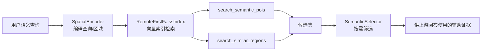
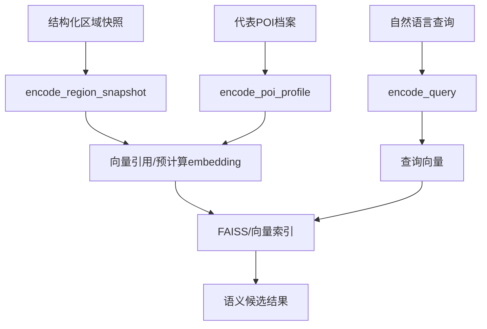

本页聚焦 GeoLoom Agent 在**向量索引与语义召回**这一层的架构定义：系统如何把空间对象或区域表征转成向量引用，如何通过语义相似性召回候选 POI 或相似区域，以及为什么这层能力被明确限制为“候选生成与语义辅助”，而不是直接输出事实结论。就当前仓库的可验证状态而言，FAISS 相关能力主要以**架构描述、技能契约与演进计划**出现，其中核心索引实体被命名为 `RemoteFirstFaissIndex`，支持 `search_similar_regions` 与 `search_semantic_pois` 两个动作。Sources: [description.md](.omm/overall-architecture/faiss-index/description.md#L1-L2), [SKILL.md](backend/SKILLS/SpatialVector/SKILL.md#L1-L14), [SKILL.md](backend/SKILLS/SpatialEncoder/SKILL.md#L1-L14)

## 先看核心结论：它解决的不是“事实查询”，而是“语义候选缩小”

从第一性原理看，空间检索可以分成两类问题：一类是“某个对象是否真的在这个范围内”，这属于确定性空间计算；另一类是“哪些对象或区域在语义上更像用户想找的东西”，这属于近似向量检索。当前仓库把后者独立建模为 `faiss-index` 与 `spatial_vector / spatial_encoder / semantic_selector` 组合能力，其中 `spatial_vector` 负责召回候选，`spatial_encoder` 负责把查询或区域编码为向量引用，`semantic_selector` 则在已有结构化证据基础上做按需筛选。这个分层说明：**FAISS 索引的职责是缩小候选空间，而不是裁定最终答案。** Sources: [description.md](.omm/overall-architecture/faiss-index/description.md#L1-L2), [SKILL.md](backend/SKILLS/SpatialVector/SKILL.md#L1-L14), [SKILL.md](backend/SKILLS/SemanticSelector/SKILL.md#L9-L19), [SKILL.md](backend/SKILLS/SpatialEncoder/SKILL.md#L9-L14)

更具体地说，`SpatialVector` 的技能说明把返回结果定义为“模糊空间候选召回和相似片区检索”，并明确指出这些结果只是**候选集**，不能替代 PostGIS 结构证据来直接回答机会、供给或竞争问题；`SpatialEncoder` 进一步强调相似度分数只是**语义辅助证据**，不能冒充硬事实。对于高级开发者，这意味着索引层应该被理解为一个 ANN/embedding retrieval stage，而不是 query engine 的最终裁决层。Sources: [SKILL.md](backend/SKILLS/SpatialVector/SKILL.md#L9-L14), [SKILL.md](backend/SKILLS/SpatialEncoder/SKILL.md#L9-L14)

## 架构定位：`RemoteFirstFaissIndex` 是一个远程优先的向量索引边界

仓库中唯一直接点名 FAISS 的架构说明写得非常集中：`RemoteFirstFaissIndex` 是一个“FAISS-based semantic vector index”，支持两个动作：`search_similar_regions` 用于寻找 POI 分布语义上相近的区域，`search_semantic_pois` 用于基于语义查询向量寻找匹配的 POI；同时说明向量 embedding 是**预先计算**并存储在索引中的。这几句话定义了该页面最重要的架构边界：它不是运行时从零构建向量，而是建立在离线或预处理 embedding 之上的查询层。Sources: [description.md](.omm/overall-architecture/faiss-index/description.md#L1-L2)

另一个值得注意的事实是，`backend/package.json` 当前只声明了 `fastify`、`pg` 等依赖，并没有本地 Node FAISS 绑定或显式向量数据库 SDK。这并不否定 FAISS 的存在，而是说明当前仓库可见的 Node 层**没有证明本地 FAISS 直接嵌入在后端进程中**；结合 `RemoteFirstFaissIndex` 这个命名，更稳妥的文档结论是：这里定义的是一个**远程优先的向量索引能力边界**，而不是已经在本仓库内实现完毕的本地库调用。Sources: [package.json](backend/package.json#L1-L38), [description.md](.omm/overall-architecture/faiss-index/description.md#L1-L2)

上图展示的是当前页面可验证的最小架构关系：编码器负责生成向量引用，FAISS 索引负责近似检索，选择器负责根据当前 query 的语义焦点保留真正相关的候选。这条链路在职责上是清晰单向的，也与 [核心技能模块：PostGIS、空间编码与语义选择](4-he-xin-ji-neng-mo-kuai-postgis-kong-jian-bian-ma-yu-yu-yi-xuan-ze) 的模块边界天然衔接，但本页只讨论其中的向量索引与语义召回部分。Sources: [description.md](.omm/overall-architecture/faiss-index/description.md#L1-L2), [SKILL.md](backend/SKILLS/SpatialEncoder/SKILL.md#L1-L14), [SKILL.md](backend/SKILLS/SpatialVector/SKILL.md#L1-L14), [SKILL.md](backend/SKILLS/SemanticSelector/SKILL.md#L9-L19)

## 两类核心动作：相似区域检索与语义 POI 检索

从接口语义上看，`search_similar_regions` 与 `search_semantic_pois` 分别面向两类检索对象。前者关注的是**区域级相似性**：不是比较单个 POI 名称，而是比较“区域中的 POI 分布是否在语义上类似”；后者关注的是**POI 级召回**：给定一个语义查询向量，从索引中找出最相关的地点对象。这种二分使索引层可以同时服务“找相似片区”和“找语义匹配地点”两种高级任务，而不把所有空间语义需求都压缩成单一检索接口。Sources: [description.md](.omm/overall-architecture/faiss-index/description.md#L1-L2), [SKILL.md](backend/SKILLS/SpatialVector/SKILL.md#L1-L14)

| 动作 | 检索对象 | 输入形态 | 输出定位 | 明确限制 |
|---|---|---|---|---|
| `search_similar_regions` | 区域/片区 | 区域向量或区域语义表征 | 语义相似区域候选 | 不能替代结构化区域证据 |
| `search_semantic_pois` | POI | 查询向量 | 语义匹配 POI 候选 | 不能直接作为机会/供给结论 |
| `score_similarity` | 向量间关系 | 查询或区域向量引用 | 相似度分数 | 分数仅为辅助证据 |

这张表把技能层与架构层的事实合并起来看：`SpatialVector` 暴露前两类检索动作，`SpatialEncoder` 暴露 `score_similarity` 这类相似度能力。它们形成的模式不是“索引即答案”，而是“编码—召回—评分—筛选”的逐层收敛。Sources: [description.md](.omm/overall-architecture/faiss-index/description.md#L1-L2), [SKILL.md](backend/SKILLS/SpatialVector/SKILL.md#L1-L14), [SKILL.md](backend/SKILLS/SpatialEncoder/SKILL.md#L1-L14)

## 数据前提：索引依赖预计算 embedding，而不是在线临时特征拼装

`faiss-index` 的架构描述明确指出，vector embeddings 是**pre-computed** 并存储在 FAISS index 中的。这一点非常关键，因为它决定了系统性能与召回质量的基本模式：在线查询阶段应只做编码、ANN 检索与少量后处理，而不应重新计算全量对象的向量。对高级开发者而言，这意味着系统的瓶颈与工程重点不在“查询时如何遍历对象”，而在“离线/预处理阶段如何稳定地产生可检索 embedding”。Sources: [description.md](.omm/overall-architecture/faiss-index/description.md#L1-L2)

仓库中的演进计划进一步补足了这种预计算思路的上下文。`Embedding-First 架构升级开发计划` 明确提出：现有系统已有 Jina embedding 基础设施，包含 `jina-embeddings-v5-text-small`、`CategoryEmbeddingIndex`、以及用于空间编码的 H3 cell 级特征向量；同时提出为 POI 增加 embedding 列并建立 HNSW 索引，以支持空间过滤后再进行语义排序。这说明项目整体在朝“**预编码 + 向量索引**”方向收敛，而 FAISS 页面应把这种模式视为本系统语义检索的基础原则。Sources: [2026-04-11-embedding-first-architecture.md](docs/plans/2026-04-11-embedding-first-architecture.md#L15-L20), [2026-04-11-embedding-first-architecture.md](docs/plans/2026-04-11-embedding-first-architecture.md#L56-L117)

## 索引输入从何而来：区域快照与 POI 档案是上游编码材料

虽然当前仓库没有展开 `RemoteFirstFaissIndex` 的具体实现代码，但相关计划文档已经给出它的上游输入形态。`Region Snapshot Encoder` 计划把 `cell-level` 的片区特征编码接入主链，要求 `spatial_encoder` 新增 `encode_region_snapshot`，输入是 area insight 已验证的**结构化区域快照**，输出包括 feature tags、summary 与可保存的 snapshot 向量引用。对 FAISS 页面来说，这构成了 `search_similar_regions` 的直接前置条件：区域要先被编码成稳定的语义表征，才可能被后续索引按相似度检索。Sources: [2026-04-09-region-snapshot-encoder.md](docs/plans/2026-04-09-region-snapshot-encoder.md#L5-L9), [2026-04-09-region-snapshot-encoder.md](docs/plans/2026-04-09-region-snapshot-encoder.md#L60-L79)

同样，`POI Profile Encoder` 计划说明系统希望把代表 POI 的结构化档案接入 `spatial_encoder`，并新增 `encode_poi_profile` action。这意味着 POI 向量并不只来自简单名称匹配，而是来自代表点的结构化描述与语义档案。由此可见，FAISS 索引层的质量在很大程度上受制于上游编码输入是否结构化、是否经过验证，以及是否真正捕获区域或 POI 的语义特征。Sources: [2026-04-09-poi-profile-encoder.md](docs/plans/2026-04-09-poi-profile-encoder.md#L5-L9)

这个关系图刻画的是“索引之前必须先编码”的架构事实。它既解释了为什么索引层只负责检索，也解释了为什么本页不能脱离编码器谈召回质量：如果区域快照和 POI 档案没有先被语义化，FAISS 只是在错误空间里做高效近邻搜索。Sources: [2026-04-09-region-snapshot-encoder.md](docs/plans/2026-04-09-region-snapshot-encoder.md#L5-L9), [2026-04-09-region-snapshot-encoder.md](docs/plans/2026-04-09-region-snapshot-encoder.md#L60-L79), [2026-04-09-poi-profile-encoder.md](docs/plans/2026-04-09-poi-profile-encoder.md#L5-L9), [SKILL.md](backend/SKILLS/SpatialEncoder/SKILL.md#L9-L14)

## 与 PostGIS 的关系：语义索引不是替代，而是互补

本仓库当前实际可见的空间数据读取实现，仍然明显建立在 PostGIS 风格的空间裁剪逻辑上。`fetchSpatialFeaturesFromDatabase` 支持按 `regions`、`geometry` 或 `bounds` 生成 `ST_Intersects` 与 envelope 条件，并从 `public.pois` 中读取名称、品类、经纬度等字段。这说明系统的确定性地理约束仍由空间数据库承担，尤其是在“某个对象是否落在几何范围内”这种问题上。Sources: [fetchSpatialFeatures.ts](backend/src/spatial/fetchSpatialFeatures.ts#L101-L127), [fetchSpatialFeatures.ts](backend/src/spatial/fetchSpatialFeatures.ts#L172-L209)

`Embedding-First` 计划把这种关系说得更明确：升级后的查询不是放弃 PostGIS，而是采用“**空间过滤 + 语义排序融合**”模式。计划中的 SQL 先使用 `ST_DWithin` 做空间剪枝，再使用 embedding 距离做语义排序，甚至给出空间距离与语义距离的加权排序公式。这对于理解 FAISS 页面非常重要：无论最终采用 FAISS 还是 pgvector/HNSW，本系统的语义检索设计都不是孤立运行，而是服务于“先保证空间相关，再按语义精排”的组合检索。Sources: [2026-04-11-embedding-first-architecture.md](docs/plans/2026-04-11-embedding-first-architecture.md#L85-L110), [fetchSpatialFeatures.ts](backend/src/spatial/fetchSpatialFeatures.ts#L186-L209)

| 维度 | PostGIS 空间检索 | FAISS/语义索引检索 |
|---|---|---|
| 关注点 | 几何关系、距离、范围约束 | 语义相似性、候选召回 |
| 输入 | geometry / bounds / region WKT | query vector / region vector |
| 输出可信度 | 确定性较强 | 近似、候选性质 |
| 适合回答 | 在不在、近不近、范围内有哪些 | 像不像、语义上最接近什么 |
| 在系统中的角色 | 结构证据主轴 | 辅助证据与候选收敛 |

表中差异正对应技能文档的限制声明：`SpatialVector` 与 `SpatialEncoder` 都强调其结果不能直接替代结构证据。因此，本页的正确理解方式不是“FAISS 比 PostGIS 更高级”，而是“**语义索引为结构查询提供更聪明的候选优先级**”。Sources: [SKILL.md](backend/SKILLS/SpatialVector/SKILL.md#L9-L14), [SKILL.md](backend/SKILLS/SpatialEncoder/SKILL.md#L9-L14), [fetchSpatialFeatures.ts](backend/src/spatial/fetchSpatialFeatures.ts#L101-L127), [2026-04-11-embedding-first-architecture.md](docs/plans/2026-04-11-embedding-first-architecture.md#L85-L110)

## 结果处理：语义召回之后还需要语义选择

如果向量索引只是返回最邻近对象，系统仍然可能被“相关但不重要”的样本淹没。`SemanticSelector` 的说明正是在解决这个问题：它面向 area insight 的按需取证场景，在已经拿到结构化区域证据后，根据当前 query 的语义焦点选择真正需要的类别、竞争层和代表样本，并明确反对把它当作黑名单过滤器或 prompt 补丁。换言之，**FAISS/向量索引解决的是 recall，SemanticSelector 解决的是 relevance focus。** Sources: [SKILL.md](backend/SKILLS/SemanticSelector/SKILL.md#L9-L19)

这种分工解释了为什么系统没有把“语义检索”做成一步到位的答案生成器。向量召回擅长的是高召回、弱约束；语义选择擅长的是在上下文中做问题相关性收敛。两者叠加，才能避免“明明检索到了很多相似对象，但回答仍然跑题”的典型问题。对于高级开发者，这意味着评估 FAISS 检索效果时不能只看 top-k 命中，还要看召回结果经过选择器之后是否真正服务当前问题。Sources: [SKILL.md](backend/SKILLS/SpatialVector/SKILL.md#L9-L14), [SKILL.md](backend/SKILLS/SemanticSelector/SKILL.md#L9-L19)

## 当前仓库的实现成熟度：架构明确，代码落地仍偏计划态

需要明确写出的一个事实是：当前仓库中可以直接查看到 `faiss-index` 的架构节点与相关技能契约，但没有检索到 `RemoteFirstFaissIndex` 的后端源码实现，也没有在 `backend/package.json` 中看到本地 FAISS 依赖。这意味着本页描述的重点必须放在**已被定义的能力边界和已验证的设计方向**，而不是臆测其底层已完全实现。Sources: [description.md](.omm/overall-architecture/faiss-index/description.md#L1-L2), [meta.yaml](.omm/overall-architecture/faiss-index/meta.yaml#L1-L9), [package.json](backend/package.json#L1-L38)

相反，当前代码与计划文档中更成熟的部分，是 embedding-first 思路、区域快照编码计划、POI profile 编码计划，以及 PostGIS + 向量排序融合的查询范式。因此，把本页写成“当前系统已经有完整本地 FAISS 服务”的表述是不准确的；更精确的说法是：**仓库已将 FAISS/语义索引定义为独立架构角色，并已围绕其输入编码、候选召回与后续筛选建立了清晰的演进路径。** Sources: [2026-04-11-embedding-first-architecture.md](docs/plans/2026-04-11-embedding-first-architecture.md#L15-L20), [2026-04-11-embedding-first-architecture.md](docs/plans/2026-04-11-embedding-first-architecture.md#L56-L117), [2026-04-09-region-snapshot-encoder.md](docs/plans/2026-04-09-region-snapshot-encoder.md#L13-L123), [2026-04-09-poi-profile-encoder.md](docs/plans/2026-04-09-poi-profile-encoder.md#L5-L9)

## 对高级开发者的实现启示

如果你正在阅读或扩展这一层，最应关注的不是“如何再包一层查询 API”，而是三个更底层的工程问题。第一，**索引对象的语义单位是什么**：区域快照、代表 POI 档案，还是普通 POI 文本拼接；第二，**向量何时生成**：离线批量预计算、启动时校验缺失率、查询时仅生成 query vector；第三，**召回结果如何进入主链**：是否作为 area insight 的辅助证据、是否交由 `SemanticSelector` 做 query-driven 收敛、是否与空间过滤结果融合排序。以上三点都能在现有技能与计划文档中找到直接依据。Sources: [description.md](.omm/overall-architecture/faiss-index/description.md#L1-L2), [SKILL.md](backend/SKILLS/SpatialVector/SKILL.md#L9-L14), [SKILL.md](backend/SKILLS/SemanticSelector/SKILL.md#L9-L19), [2026-04-11-embedding-first-architecture.md](docs/plans/2026-04-11-embedding-first-architecture.md#L69-L117), [2026-04-09-region-snapshot-encoder.md](docs/plans/2026-04-09-region-snapshot-encoder.md#L60-L79)

从性能视角看，这套设计天然适合“高维向量近邻召回 + 结构过滤”的双阶段模式。预计算 embedding 让在线查询不再遍历全量对象；空间过滤保证候选不会脱离地理上下文；语义选择则防止 top-k 结果在问题语义上失焦。这也是为什么本页标题中的“高效空间匹配”并不单纯指 ANN 算法快，而是指**通过职责拆分实现总体检索效率与答案相关性的平衡**。Sources: [description.md](.omm/overall-architecture/faiss-index/description.md#L1-L2), [2026-04-11-embedding-first-architecture.md](docs/plans/2026-04-11-embedding-first-architecture.md#L56-L117), [SKILL.md](backend/SKILLS/SemanticSelector/SKILL.md#L9-L19)

## 你接下来应该读什么

如果你想继续追踪“向量是如何生成的”，下一步应阅读 [POI 与区域编码器：地理空间向量化](13-poi-yu-qu-yu-bian-ma-qi-di-li-kong-jian-xiang-liang-hua)；如果你想理解语义检索如何与整体服务链路拼接，应继续到 [核心技能模块：PostGIS、空间编码与语义选择](4-he-xin-ji-neng-mo-kuai-postgis-kong-jian-bian-ma-yu-yu-yi-xuan-ze) 与 [请求生命周期管理：从用户输入到流式响应](7-qing-qiu-sheng-ming-zhou-qi-guan-li-cong-yong-hu-shu-ru-dao-liu-shi-xiang-ying)；如果你的关注点是空间确定性证据如何与语义召回互补，则应阅读 [空间数据服务：OSM 桥接与 PostGIS 存储](6-kong-jian-shu-ju-fu-wu-osm-qiao-jie-yu-postgis-cun-chu)。这些页面构成了本页的自然后继，但本页本身只定义 FAISS 索引与语义检索层的职责与边界。Sources: [description.md](.omm/overall-architecture/faiss-index/description.md#L1-L2), [SKILL.md](backend/SKILLS/SpatialVector/SKILL.md#L1-L14), [SKILL.md](backend/SKILLS/SpatialEncoder/SKILL.md#L1-L14)