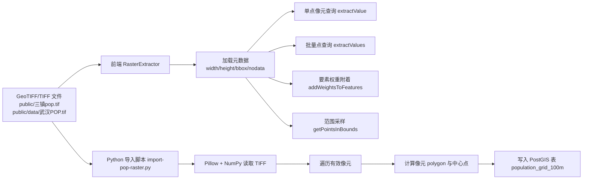

本页聚焦仓库中**与 TIFF/GeoTIFF 栅格读取、像元值提取、点权重附着、范围采样，以及栅格向 PostGIS 网格表导入**直接相关的实现，不展开地图组件、工作线程、通用空间检索或 AI 编排链路。代码显示该仓库当前形成了两条互补路径：**前端浏览器侧直接读取 GeoTIFF 并执行像元查询**，以及**离线脚本将 TIFF 栅格展开为数据库中的矢量网格单元**，两者共同服务于空间分析场景。Sources: [RasterExtractor.ts](src/utils/RasterExtractor.ts#L1-L294), [import-pop-raster.py](scripts/import-pop-raster.py#L1-L249)

## 作用边界与分析入口

从第一性原理看，所谓“栅格数据提取”在本仓库里并不是抽象 GIS 平台能力，而是围绕**人口栅格权重**这一具体数据资产展开：前端存在 `RasterExtractor` 负责从 GeoTIFF 读取数值并映射到经纬度点位，公共数据目录中存在 `武汉POP.tif` 与 `三镇pop.tif` 两份 TIFF 文件，而 Python 脚本则将默认输入设置为 `public/三镇pop.tif` 并导入 `population_grid_100m` 表。这说明当前实现关注的是**把单波段人口密度/人口分布栅格转成可查询权重**，而不是通用多波段遥感处理框架。Sources: [RasterExtractor.ts](src/utils/RasterExtractor.ts#L62-L100), [import-pop-raster.py](scripts/import-pop-raster.py#L41-L56), [README.md](README.md#L17-L24)

## 总体架构：前端即时提取与离线数据库化

在理解下面的图之前，需要先明确两个概念：其一，**浏览器侧提取**适合把经纬度点快速映射为像元值；其二，**数据库化导入**适合把每个有效像元转成带几何形状的记录，便于后续用空间 SQL 参与分析。这两个路径在仓库中并存，但代码里没有看到它们彼此直接调用，说明它们是**并行存在的两种实现策略**。Sources: [RasterExtractor.ts](src/utils/RasterExtractor.ts#L62-L100), [import-pop-raster.py](scripts/import-pop-raster.py#L202-L248)



## 前端侧核心对象：RasterExtractor 的状态模型

`RasterExtractor` 是一个有状态类，而不是纯函数工具。它维护 `tiff`、`image`、`rasterData`、`width`、`height`、`bbox`、`noDataValue`、`isLoaded` 等字段，表示一次栅格加载后的完整运行上下文。这种设计意味着后续的 `extractValue`、`extractValues`、`addWeightsToFeatures` 和 `getPointsInBounds` 都依赖**先调用 `load()` 成功完成初始化**。类末尾还导出了单例 `rasterExtractor`，表明仓库允许以共享实例方式在前端复用同一份已加载栅格。Sources: [RasterExtractor.ts](src/utils/RasterExtractor.ts#L36-L45), [RasterExtractor.ts](src/utils/RasterExtractor.ts#L62-L106), [RasterExtractor.ts](src/utils/RasterExtractor.ts#L292-L293)

## GeoTIFF 加载流程：从 URL 到内存中的单波段数组

`load(url)` 的执行路径非常直接：先通过 `fetch` 拉取二进制数据，再把 `ArrayBuffer` 交给 `geotiff` 库，之后取得首个 `image`，读取宽高、边界框和 `GDAL_NODATA` 元数据，最后通过 `readRasters()` 取出栅格数组，并只保留第一个波段 `rasters[0]`。这里最重要的实现事实有两个：**第一，当前逻辑只处理首波段数据；第二，边界框被视为 WGS84 坐标范围并直接用于后续经纬度映射**。Sources: [RasterExtractor.ts](src/utils/RasterExtractor.ts#L62-L100)

## 元数据约束：边界框与 NoData 的处理方式

`toBoundingBox()` 会对外部给出的边界框做严格数值化校验，仅当数组长度至少为 4 且四个值都为有限数时才接受，否则整个加载过程会抛出 `Invalid raster bounding box`。与此同时，`GDAL_NODATA` 被解析为浮点数保存到 `noDataValue`，后续像元查询时与实际值做精确相等比较。这说明当前实现依赖 TIFF 元数据的规范性：如果缺少合法边界框，就不允许进入后续空间分析；如果 NoData 可读取，则查询结果会把该值统一折叠为 0。Sources: [RasterExtractor.ts](src/utils/RasterExtractor.ts#L46-L60), [RasterExtractor.ts](src/utils/RasterExtractor.ts#L79-L90), [RasterExtractor.ts](src/utils/RasterExtractor.ts#L135-L143)

## 经纬度到像素索引的映射机制

`extractValue(lon, lat)` 体现了本页最核心的空间分析逻辑。它先检查点是否落在栅格边界框内，再通过 `(maxX - minX) / width` 和 `(maxY - minY) / height` 计算像元分辨率，然后将经度映射为列索引 `col = floor((lon - minX) / pixelWidth)`，将纬度映射为行索引 `row = floor((maxY - lat) / pixelHeight)`。注意这里纬度使用 `maxY - lat`，说明数组行号按**从北到南递增**处理。最终索引按 `row * width + col` 展开成一维数组位置。Sources: [RasterExtractor.ts](src/utils/RasterExtractor.ts#L108-L144)

## 边界处理策略：东界与南界可命中末像元

该映射实现对边界值做了显式保护：`col` 和 `row` 都通过 `Math.min(width - 1, ...)` 或 `Math.min(height - 1, ...)` 截断，因此恰好落在最大经度或最小纬度边界上的点，仍会归入最后一列或最后一行，而不是越界丢失。仓库中的单元测试正是围绕这一行为构建：在 2×2 栅格上，点 `(2, 1.5)` 返回东边界像元值 `20`，点 `(1.5, 0)` 返回南边界像元值 `40`。这证明当前实现对闭区间边界的语义是**包含右侧和下侧边界，并归并到最后一个像元**。Sources: [RasterExtractor.ts](src/utils/RasterExtractor.ts#L125-L133), [RasterExtractor.spec.js](src/utils/__tests__/RasterExtractor.spec.js#L5-L19)

## 查询结果的零值语义

`extractValue()` 在多种情况下都返回 `0`：栅格尚未加载、点位越界、像元尺寸非法、索引越界、像元值等于 NoData、值为 `NaN`、值为 `undefined/null`。这意味着当前类把“无结果”“无效值”“空值”统一压平成一个零值语义，而没有区分错误类型或缺失原因。对于人口栅格这样的非负权重场景，这是一种简单且可消费的接口形式，因为下游只需把 `0` 视作“无人口权重或不可用权重”。Sources: [RasterExtractor.ts](src/utils/RasterExtractor.ts#L108-L143)

## 批量点查询：extractValues 的职责

`extractValues(points)` 并没有增加新的空间算法，而是简单地将点数组映射到 `extractValue()`。因此它的价值在于**接口批处理**而不是向量化性能优化：若未加载栅格，则返回与输入点等长的全零数组；若已加载，则逐点求值。这种实现保持了 API 简洁，但没有看到专门的块读取、窗口裁剪或 Web Worker 并行化逻辑。Sources: [RasterExtractor.ts](src/utils/RasterExtractor.ts#L146-L152)

## 要素增强模式：把栅格值附着为 POI 权重

`addWeightsToFeatures()` 把栅格分析与 GeoJSON 风格要素对象连接起来。它要求每个要素的 `geometry.coordinates` 可解析出 `[lon, lat]`，随后为每个要素的 `properties` 注入 `weight` 字段。若几何坐标缺失，则仍返回拷贝对象，只是把 `weight` 设为 `0`。方法执行后还会统计非零权重点数、最大权重和平均权重并写日志，说明这个方法既承担**数据增强**，也承担一定的**运行时诊断**职责。Sources: [RasterExtractor.ts](src/utils/RasterExtractor.ts#L154-L199)

## 范围采样：从面域裁剪到稀疏点集

`getPointsInBounds(bounds, maxPoints)` 用于从给定范围内提取可视化或分析用点集。算法先计算查询范围与栅格外包框的重叠区域，再转换为起止行列范围；如果重叠为空，则直接返回空数组。之后它会估算区域像素总数，并通过 `ceil(sqrt(totalPixels / maxPoints))` 求出采样步长 `sampleRate`，再按行列双重步进扫描像元，把有效值转成像元中心点坐标 `{ lon, lat, weight }`。这说明它不是完整输出窗口内所有像元，而是一个**面向上限数量的自适应降采样器**。Sources: [RasterExtractor.ts](src/utils/RasterExtractor.ts#L230-L289)

## 范围采样的几何语义

在 `getPointsInBounds()` 中，输出点坐标不是像元左上角或边界，而是用 `rMinX + (col + 0.5) * pixelWidth` 与 `rMaxY - (row + 0.5) * pixelHeight` 计算的**像元中心点**。同时，方法会跳过 NoData、`NaN` 和 `<= 0` 的像元。这意味着该接口输出的是**正值有效像元中心采样点**，非常适合作为前端散点渲染、热力图抽样输入或局部分析的轻量数据源。Sources: [RasterExtractor.ts](src/utils/RasterExtractor.ts#L269-L288)

## 运行时可观测性：元数据、加载状态与释放

除了提取接口，`RasterExtractor` 还提供 `loaded` getter、`getMetadata()` 和 `dispose()`。`getMetadata()` 返回 `width`、`height`、`bbox`、`noDataValue` 与 `pixelCount`，便于上层显示当前加载栅格的概况；`dispose()` 则清空 TIFF 引用、影像对象、栅格数组并重置加载标志，表明作者明确考虑了前端内存生命周期管理，尤其是在大尺寸 GeoTIFF 场景下避免长期持有数组。Sources: [RasterExtractor.ts](src/utils/RasterExtractor.ts#L202-L228)

## 离线导入链路：TIFF 被展开为 PostGIS 网格表

与浏览器直接查询不同，`scripts/import-pop-raster.py` 走的是离线建模路径。脚本从命令行读取 TIFF 路径、目标表名、数据源名称、数据库连接参数、最小值阈值、批大小、导入上限、是否截断和是否 dry-run 等配置，默认 TIFF 为 `public/三镇pop.tif`，默认表为 `population_grid_100m`。这表明脚本目标是把人口栅格持久化成**可被 SQL 和空间索引直接利用的规则网格表**。Sources: [import-pop-raster.py](scripts/import-pop-raster.py#L41-L56)

## TIFF 读取方式：Pillow + TIFF Tag 解析

脚本的 `read_raster(path)` 使用 `PIL.Image.open()` 打开 TIFF，并借助 `numpy.asarray(..., dtype=np.float32)` 转成二维数组。地理参考信息则不是通过 GDAL，而是直接读取 TIFF 标签：`33922` 作为 tiepoint，`33550` 作为像元尺度，`34735` 用于推断地理坐标系，并在满足条件时将 SRID 设为 `4326`。因此这个脚本依赖的是**GeoTIFF 标签的最小必要子集**，足以恢复原点、像元大小和坐标系。Sources: [import-pop-raster.py](scripts/import-pop-raster.py#L59-L76)

## 有效像元筛选：仅导出大于阈值的单元

`iter_rows()` 先通过 `np.nonzero(array > min_value)` 找出所有值大于阈值的像元索引，之后可按 `limit_cells` 进一步截断。这说明导入过程不会把整张栅格无差别落表，而是只导入**大于最小值阈值的有效单元**。默认阈值为 `0.0`，因此零值和负值都会被剔除。对于人口分布栅格，这样的策略可以显著减少空白区域造成的存储膨胀。Sources: [import-pop-raster.py](scripts/import-pop-raster.py#L51-L56), [import-pop-raster.py](scripts/import-pop-raster.py#L79-L88)

## 像元到矢量网格的转换公式

每个有效像元会被转换出一套完整空间属性：脚本根据 `origin_lon + col_index * pixel_width` 计算左右经度边界，根据 `origin_lat - row_index * pixel_height` 计算上下纬度边界，再求中心点经纬度。最终生成一段 `POLYGON((...))` WKT 作为网格面，并同时保留中心点坐标。这意味着数据库中每一行既有**像元值**，也有**可参与空间相交运算的多边形**，还有**可参与点距离/聚合的中心点**。Sources: [import-pop-raster.py](scripts/import-pop-raster.py#L85-L107)

## PostGIS 表结构与索引设计

`ensure_table()` 会创建 `population_grid_100m` 这类表，字段包括 `source_name`、`row_index`、`col_index`、`pop_value`、`center_lon`、`center_lat`、`geom`、`center_geom` 以及时间戳；唯一约束为 `(source_name, row_index, col_index)`，并为 `geom`、`center_geom` 建立 GiST 索引，为 `pop_value` 建立降序索引。这个设计非常清晰：**行列号保证像元身份稳定，面几何用于空间覆盖查询，中心点用于点类分析，值索引用于高值筛选**。Sources: [import-pop-raster.py](scripts/import-pop-raster.py#L110-L131)

## 批量写入与幂等更新

`insert_batches()` 使用 `psycopg2.extras.execute_values` 批量插入，模板里将 WKT 转成 `ST_GeomFromText(..., 4326)`，并把中心点转成 `ST_SetSRID(ST_MakePoint(...), 4326)`。若 `(source_name, row_index, col_index)` 冲突，则执行更新，刷新数值、中心坐标、面几何、中心几何和 `updated_at`。因此脚本具备**增量重复导入不产生重复记录**的幂等特征。Sources: [import-pop-raster.py](scripts/import-pop-raster.py#L137-L199)

## 导入执行过程与诊断输出

`main()` 在真正入库前会输出 TIFF 路径、数组形状、SRID、原点、像元大小和正值单元总数；若开启 `dry-run` 则到此结束，不连接数据库。否则脚本建立 PostgreSQL 连接、确保表结构存在、可选截断旧表、批量导入并提交事务，异常时回滚。整个控制流体现出一种**先验证影像元数据，再决定是否落库**的保守执行策略。Sources: [import-pop-raster.py](scripts/import-pop-raster.py#L202-L248)

## 两条路径的对比

下表总结仓库中两类栅格处理路径的职责边界，便于高级开发者在扩展功能时快速判断应修改哪一层。Sources: [RasterExtractor.ts](src/utils/RasterExtractor.ts#L62-L289), [import-pop-raster.py](scripts/import-pop-raster.py#L41-L248)

| 维度 | 前端 `RasterExtractor` | 离线 `import-pop-raster.py` |
|---|---|---|
| 运行位置 | 浏览器 | 本地脚本/服务器环境 |
| 输入 | 通过 URL 获取的 GeoTIFF | 本地 TIFF 文件路径 |
| 核心目标 | 即时像元查询与前端权重增强 | 持久化为 PostGIS 网格表 |
| 数据形式 | 内存中的单波段数组 | 数据库中的 polygon/point 记录 |
| 主要输出 | 单点值、批量值、带 `weight` 的要素、采样点集 | `population_grid_100m` 表记录 |
| 空值处理 | 返回 `0` | 通过 `min-value` 过滤，不入库 |
| 适用场景 | 前端交互、可视化、轻量分析 | SQL 空间分析、索引查询、离线统计 |
| 幂等性 | 依赖内存实例，无持久化 | `ON CONFLICT` 更新，具备幂等导入 |

## 已验证的实现约束与未出现的能力

基于代码可验证事实，可以确认以下边界：当前前端类只读**单波段**数据；坐标映射直接依赖影像边界框，无投影转换流程；范围采样采用**规则抽样**而不是插值重采样；离线脚本仅实现 TIFF 到规则网格表的导入，不包含栅格重投影、重采样、金字塔、瓦片切片或多波段统计。由于仓库检视中没有看到这些能力的实现，因此它们不应被写入本页说明。Sources: [RasterExtractor.ts](src/utils/RasterExtractor.ts#L72-L90), [RasterExtractor.ts](src/utils/RasterExtractor.ts#L230-L289), [import-pop-raster.py](scripts/import-pop-raster.py#L59-L76), [import-pop-raster.py](scripts/import-pop-raster.py#L79-L107)

## 模块关系图

为了避免把本页与通用空间检索页混淆，下面的关系图只展示**栅格处理内部**的模块协作：公共 TIFF 文件是原始资产，`RasterExtractor` 面向前端即时分析，导入脚本面向数据库化建模，而测试只验证边界索引行为。Sources: [RasterExtractor.ts](src/utils/RasterExtractor.ts#L36-L293), [RasterExtractor.spec.js](src/utils/__tests__/RasterExtractor.spec.js#L1-L20), [import-pop-raster.py](scripts/import-pop-raster.py#L41-L248)

```mermaid
classDiagram
    class RasterExtractor {
      +load(url): Promise<boolean>
      +extractValue(lon, lat): number
      +extractValues(points): number[]
      +addWeightsToFeatures(features): features[]
      +getPointsInBounds(bounds, maxPoints): Point[]
      +getMetadata()
      +dispose()
    }

    class RasterExtractorSpec {
      +验证东边界像元命中
      +验证南边界像元命中
    }

    class ImportPopRasterPy {
      +read_raster(path)
      +iter_rows(raster, source_name, min_value, limit_cells)
      +ensure_table(cur, table_name, srid)
      +insert_batches(cur, table_name, rows, batch_size)
      +main()
    }

    RasterExtractorSpec --> RasterExtractor
    ImportPopRasterPy --> "GeoTIFF/TIFF 文件"
    RasterExtractor --> "GeoTIFF/TIFF 文件"
    ImportPopRasterPy --> "PostGIS population_grid_100m"
```

## 开发者最应关注的设计结论

对高级开发者而言，本页最重要的结论不是“仓库支持 TIFF”，而是：**它通过前端内存读取与数据库网格化两种方式，把人口栅格转成可参与空间决策的权重来源**。如果需求是给点要素附加人口权重，应优先关注 `extractValue()` 与 `addWeightsToFeatures()`；如果需求是做区域覆盖、统计筛选或数据库侧空间联动，应优先关注 `import-pop-raster.py` 生成的网格表结构。继续阅读时，若你要把这些权重与向量化空间能力结合，可转到 [空间数据服务：OSM 桥接与 PostGIS 存储](6-kong-jian-shu-ju-fu-wu-osm-qiao-jie-yu-postgis-cun-chu)；若你要理解更广义的空间编码体系，可转到 [POI 与区域编码器：地理空间向量化](13-poi-yu-qu-yu-bian-ma-qi-di-li-kong-jian-xiang-liang-hua)。Sources: [RasterExtractor.ts](src/utils/RasterExtractor.ts#L108-L199), [RasterExtractor.ts](src/utils/RasterExtractor.ts#L230-L289), [import-pop-raster.py](scripts/import-pop-raster.py#L110-L199)