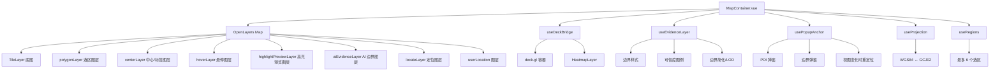

本页聚焦前端地图可视化内核：**`MapContainer.vue` 如何作为统一地图壳层，协调 OpenLayers 底图、POI 向量图层、AI 证据边界、deck.gl 热力叠加、弹窗锚点以及选区管理**。它不是单一“地图组件”，而是一个把多类空间渲染能力收束到同一交互平面的编排器，因此理解它的关键不在某个 API，而在**图层职责分离、坐标体系转换、交互事件路由与渲染同步机制**。Sources: [MapContainer.vue](src/components/MapContainer.vue#L169-L200), [MapContainer.vue](src/components/MapContainer.vue#L674-L720)

## 核心结论：地图容器是“渲染编排层”，不是“数据源”

从第一性原理看，地图容器解决的是三个问题：**地图实例生命周期**、**图层分层与可见性控制**、**交互命中后的语义分发**。`MapContainer.vue` 在 `onMounted` 中创建 OpenLayers `OlMap`，注入底图和多个业务图层，并在组件暴露的方法中统一提供 `flyTo`、`showHighlights`、`showAiSpatialEvidence`、`clearAiEvidenceBoundaries`、`openPolygonDraw` 等能力；这说明上层页面并不直接操纵 OpenLayers，而是通过地图容器提供的受控接口完成视图更新。Sources: [MapContainer.vue](src/components/MapContainer.vue#L674-L720), [MapContainer.vue](src/components/MapContainer.vue#L1773-L1802)

这种设计的直接收益是职责清晰：**数据归父组件或上层流程，渲染归 MapContainer，复杂地图子能力再下沉到 composables**。`useDeckBridge` 负责 deck.gl 叠加层，`useEvidenceLayer` 负责 AI 边界证据图层与图例，`usePopupAnchor` 负责弹窗锚定和重定位，`useProjection` 负责 WGS84/GCJ02 转换，`useRegions` 负责多选区实体状态。这种拆分方式说明本仓库并未把“地图功能”写成单体逻辑，而是按**渲染域能力**分解。Sources: [MapContainer.vue](src/components/MapContainer.vue#L192-L200), [MapContainer.vue](src/components/MapContainer.vue#L287-L300), [MapContainer.vue](src/components/MapContainer.vue#L550-L585), [MapContainer.vue](src/components/MapContainer.vue#L629-L644)

## 架构视图：地图容器与图层子系统的关系

在阅读下图前，可先把组件理解为两层：**OpenLayers 负责基础地图坐标系、矢量要素和交互事件；deck.gl 作为贴附在地图容器上的附加画布，负责热力等高密度聚合渲染**。弹窗、删除按钮和控制面板则属于 DOM 叠加层，不直接参与地图投影，但依赖地图像素坐标进行定位。Sources: [MapContainer.vue](src/components/MapContainer.vue#L1-L31), [MapContainer.vue](src/components/MapContainer.vue#L674-L720), [useDeckBridge.ts](src/composables/map/useDeckBridge.ts#L273-L339)

Sources: [MapContainer.vue](src/components/MapContainer.vue#L382-L497), [MapContainer.vue](src/components/MapContainer.vue#L550-L585), [MapContainer.vue](src/components/MapContainer.vue#L629-L644), [useDeckBridge.ts](src/composables/map/useDeckBridge.ts#L203-L339), [useEvidenceLayer.ts](src/composables/map/useEvidenceLayer.ts#L255-L399), [usePopupAnchor.ts](src/composables/map/usePopupAnchor.ts#L42-L178), [useProjection.ts](src/composables/map/useProjection.ts#L26-L74), [useRegions.ts](src/composables/useRegions.ts#L50-L107)

## 图层分层模型：每一层只承担一种视觉语义

`MapContainer.vue` 明确创建了多个 `VectorSource`/`VectorLayer`，并在初始化地图时按顺序组装为 `layers` 数组：底图 `baseLayer`、用户绘制选区 `polygonLayer`、中心点与标签 `centerLayer`、悬停图层 `hoverLayer`、高亮预览图层 `highlightPreviewLayer`、AI 证据图层 `aiEvidenceLayer`、用户定位精度圈与定位点图层等。这里的核心模式是**不要把所有业务要素塞入一个 source**，而是按交互语义切层，以减少样式分支和命中歧义。Sources: [MapContainer.vue](src/components/MapContainer.vue#L381-L497), [MapContainer.vue](src/components/MapContainer.vue#L691-L702)

这种分层对交互系统尤其重要。比如 `highlightPreviewLayer` 只负责突出显示当前结果集，`locateLayer` 只负责飞行定位后的单点标记，`aiEvidenceLayer` 只负责多边形证据边界；因此“清高亮”“清边界”“清定位”可以分别执行，而不是在一个混杂 source 中做条件删除。对应代码中，`clearHighlights()` 只清 `highlightPreviewSource` 与 deck 数据，`clearAiEvidenceBoundaries()` 只委托 AI 边界层清空并收起弹窗，用户定位则由 `syncUserLocationOverlay()` 独立维护。Sources: [MapContainer.vue](src/components/MapContainer.vue#L587-L604), [MapContainer.vue](src/components/MapContainer.vue#L606-L625), [MapContainer.vue](src/components/MapContainer.vue#L1502-L1505)

下表概括了当前已验证的主要图层职责。Sources: [MapContainer.vue](src/components/MapContainer.vue#L381-L497), [MapContainer.vue](src/components/MapContainer.vue#L691-L702), [useEvidenceLayer.ts](src/composables/map/useEvidenceLayer.ts#L255-L269)

| 图层/叠加 | 实现位置 | 主要内容 | 交互职责 | 清理方式 |
|---|---|---|---|---|
| `baseLayer` | `MapContainer.vue` | 高德 XYZ 底图 | 无业务交互 | 地图销毁时释放 |
| `polygonLayer` | `MapContainer.vue` | 用户绘制的 Polygon/Circle 选区 | 选区绘制与保留 | `clearPolygon` / `clearAllRegionsFromMap` |
| `centerLayer` | `MapContainer.vue` | 选区中心点、名称标签 | 选区辅助标注 | 清空选区时清理 |
| `hoverLayer` | `MapContainer.vue` | 悬停反馈 | POI hover 命中反馈 | 重绘或清高亮时 |
| `highlightPreviewLayer` | `MapContainer.vue` | 高亮结果集预览 | 视觉强调 | `clearHighlights` |
| `aiEvidenceLayer` | `useEvidenceLayer` | AI 边界、多边形证据 | 边界展示、可信度表达 | `clearAiEvidenceBoundaries` |
| `locateLayer` | `MapContainer.vue` | 飞行定位落点 | 定位后的视觉锚点 | `flyTo` 前先清 |
| `userLocationLayer` / `AccuracyLayer` | `MapContainer.vue` | 用户位置与精度圈 | 当前定位可视化 | `syncUserLocationOverlay` |
| deck.gl Heatmap | `useDeckBridge` | 热力图 | 高密度聚合渲染 | `clearDeckData` / bridge 销毁 |

## 地图初始化：先让底图可见，再逐步挂载复杂能力

地图初始化流程并不是“创建地图就完成”，而是分成了**底图就绪感知**和**地图实例绑定**两部分。组件用 `isBaseLayerReady` 控制一个首屏加载壳层，底图 source 在 `tileloadend` 或 `tileloaderror` 时都会触发 `markBaseLayerReady()`，并设置了 1800ms 超时兜底，避免底图异常时页面长期停留在白屏/等待状态。这个机制说明该组件把“地图是否可交互”和“底图瓦片是否有反馈”分开处理，优先保证首屏感知。Sources: [MapContainer.vue](src/components/MapContainer.vue#L4-L10), [MapContainer.vue](src/components/MapContainer.vue#L651-L667), [MapContainer.vue](src/components/MapContainer.vue#L674-L690)

地图实例创建后，组件注册了 `movestart`、`moveend`、`pointermove`、`singleclick` 等事件，并立即完成三件事：重建 POI 要素、同步用户定位图层、为弹窗挂载视图监听器。也就是说，这里不是“数据先入图层，地图后感知”，而是**地图先成为统一交互基座，再把数据和附加行为接上去**。Sources: [MapContainer.vue](src/components/MapContainer.vue#L691-L720), [MapContainer.vue](src/components/MapContainer.vue#L928-L959)

## 坐标系统：地图渲染层显式处理 WGS84 与 GCJ02 偏移

地图容器中的一个关键实现细节，是**底图和业务数据不假定天然同坐标系**。`useProjection` 提供 `wgs84ToGcj02`、`gcj02ToWgs84` 与 `toGcj02IfNeeded`，其中注释明确指出：在中国场景下，如果前端底图使用 GCJ02，而后端或输入数据使用 WGS84，不做转换会产生约 500 米级系统性偏移。这个说明不是抽象理论，而是仓库中实际防错逻辑的一部分。Sources: [useProjection.ts](src/composables/map/useProjection.ts#L3-L23), [useProjection.ts](src/composables/map/useProjection.ts#L46-L74)

`MapContainer.vue` 把这个能力封装为 `toMapLonLat()` 和 `resolveDisplayLonLat()`，并在 POI 重建、用户定位展示、飞行定位、上传多边形导入等路径中统一使用。换言之，**地图容器承担了“渲染坐标归一化”的责任**，上层业务不必关心底图采用什么地理基准。Sources: [MapContainer.vue](src/components/MapContainer.vue#L540-L548), [MapContainer.vue](src/components/MapContainer.vue#L606-L625), [MapContainer.vue](src/components/MapContainer.vue#L971-L1019), [MapContainer.vue](src/components/MapContainer.vue#L1747-L1754)

## POI 渲染路径：原始 GeoJSON 特征先转换为 OpenLayers Feature

POI 不直接以原始 GeoJSON 在地图上参与交互，而是先经 `rebuildPoiOlFeatures()` 转为 OpenLayers `Feature`。这一过程会解析显示坐标、执行必要的坐标转换、创建 `Point(fromLonLat([lon, lat]))`，并把原始对象挂在 `__raw` 字段，同时维护 `rawToOlMap` 映射。这个设计表明图层层面需要的是**高效命中的 OL 特征**，而不是直接依赖上层数据结构。Sources: [MapContainer.vue](src/components/MapContainer.vue#L945-L959)

这种“原始数据 → 渲染特征”的双轨结构后续服务于多个场景：鼠标命中后可以回溯 `__raw` 获取业务属性；从上层传入某个原始 feature 时，可以通过映射快速找到地图特征；`mapLayerIdentity.ts` 也正是通过 source 中 feature 是否携带 `__raw` 来识别该图层是否属于 POI 交互层。Sources: [mapLayerIdentity.ts](src/utils/mapLayerIdentity.ts#L20-L54), [MapContainer.vue](src/components/MapContainer.vue#L647-L650), [MapContainer.vue](src/components/MapContainer.vue#L945-L959)

## 弹窗锚点系统：弹窗是 DOM 层，但跟随地图视图变化

POI 弹窗并没有使用 OpenLayers 原生 Overlay，而是实现成模板中的绝对定位 DOM，并由 `usePopupAnchor` 控制显示状态、标题、详情行、箭头位置与上下朝向。其定位逻辑通过 `map.getPixelFromCoordinate()` 获取锚点像素，再结合容器尺寸与弹窗尺寸进行边界裁剪，避免弹窗超出视口。Sources: [MapContainer.vue](src/components/MapContainer.vue#L12-L31), [usePopupAnchor.ts](src/composables/map/usePopupAnchor.ts#L47-L110)

更关键的是，弹窗会监听视图的 `change:center`、`change:resolution`、`change:rotation` 事件，并通过 `requestAnimationFrame` 节流重算位置。这说明该实现把弹窗视为**地图视图的从属投影视图**，而不是静态浮层；地图一旦平移、缩放、旋转，弹窗也会重新对齐到原地理锚点。Sources: [usePopupAnchor.ts](src/composables/map/usePopupAnchor.ts#L112-L119), [usePopupAnchor.ts](src/composables/map/usePopupAnchor.ts#L165-L178), [MapContainer.vue](src/components/MapContainer.vue#L709-L719)

对于锚点坐标的求解，仓库还提供了 `resolvePopupAnchorCoordinate()` 工具：优先取 feature geometry 的坐标，其次从原始对象解析显示经纬度并投影，最后退回 fallback。这个函数说明系统考虑了**命中对象可能来自真实要素、业务原始对象或后备坐标**三种来源。Sources: [popupFeatureAnchor.ts](src/utils/popupFeatureAnchor.ts#L12-L59), [MapContainer.vue](src/components/MapContainer.vue#L198-L200)

## AI 证据图层：边界不仅显示，还携带可信度语义

AI 空间证据不是普通多边形叠加。`useEvidenceLayer` 首先创建独立的 `aiEvidenceLayerSource` 和 `aiEvidenceLayer`，再把边界类型分为 `fuzzyCore`、`fuzzyTransition`、`fuzzyOuter`、`vernacular`、`hotspot`、`queryBoundary`、`generic` 等预设类别，并为每类定义颜色、填充透明度、描边透明度和线宽。由此可见，该图层表达的不是“有没有边界”，而是**边界的来源与语义类型**。Sources: [useEvidenceLayer.ts](src/composables/map/useEvidenceLayer.ts#L76-L101), [useEvidenceLayer.ts](src/composables/map/useEvidenceLayer.ts#L255-L269)

可信度进一步影响样式。`createAiPolygonStyle()` 会根据 `confidence` 调整填充 alpha、描边 alpha、线宽，低可信边界还会使用虚线。这是一种典型的**视觉编码映射**：把模型信心映射到人眼可读的图形强弱，而不是只在文本里展示百分比。Sources: [useEvidenceLayer.ts](src/composables/map/useEvidenceLayer.ts#L205-L229)

同时，组件模板中存在“边界可信度”图例区块，显示模型名、均值、最低、最高，以及高/中/低可信桶数量；`useEvidenceLayer` 通过 `updateAiBoundaryLegend()` 根据统计值和实际渲染置信度生成这些状态。这说明 AI 边界层同时承担**几何渲染**与**统计摘要输出**两类职责。Sources: [MapContainer.vue](src/components/MapContainer.vue#L96-L130), [useEvidenceLayer.ts](src/composables/map/useEvidenceLayer.ts#L240-L333)

## AI 边界的性能策略：按分辨率做几何简化

对于复杂多边形，直接在交互过程中始终使用完整顶点几何会造成渲染和命中压力。`useEvidenceLayer` 显式保存完整 geometry 到 `__aiBoundaryGeometryFull`，并维护一个简化缓存 `__aiBoundarySimplifyCache`。在 `applyBoundaryLod()` 中，它会结合地图当前 `resolution` 与顶点数估算简化容差；顶点越多、分辨率越粗，容差越大。Sources: [useEvidenceLayer.ts](src/composables/map/useEvidenceLayer.ts#L103-L106), [useEvidenceLayer.ts](src/composables/map/useEvidenceLayer.ts#L231-L238), [useEvidenceLayer.ts](src/composables/map/useEvidenceLayer.ts#L366-L399)

这意味着系统采用的是**保真数据存储 + 交互态按需简化**的模式，而不是在入库或首次渲染时永久降采样。这样的好处是，地图平移/缩放时可以用更轻量的几何参与渲染，而在需要精确展示时仍可恢复完整边界。Sources: [useEvidenceLayer.ts](src/composables/map/useEvidenceLayer.ts#L335-L385), [useEvidenceLayer.ts](src/composables/map/useEvidenceLayer.ts#L387-L399)

## deck.gl 桥接：热力图作为“附着画布”而非 OpenLayers 图层

热力图没有塞进 OpenLayers 的 `layers` 数组，而是由 `useDeckBridge` 延迟加载 `@deck.gl/core` 与 `@deck.gl/aggregation-layers`，在地图容器内额外插入一个绝对定位的 `div`，再由 `Deck` 实例把 HeatmapLayer 画到这个容器里。其 `pointer-events` 被强制设为 `none`，说明 deck 叠加是**纯视觉增强层**，不抢占 OpenLayers 交互。Sources: [useDeckBridge.ts](src/composables/map/useDeckBridge.ts#L170-L197), [useDeckBridge.ts](src/composables/map/useDeckBridge.ts#L293-L333)

同步策略也很明确：OpenLayers 视图变化时，通过监听 `change:resolution`、`change:center`、`change:rotation` 触发 `scheduleDeckSync()`；该函数使用 `requestAnimationFrame` 统一刷新 deck 的 `viewState`，并在必要时重建热力层参数。其半径 `radiusPixels` 根据 zoom 自适应收缩，避免不同缩放级别下热力扩散范围失真。Sources: [useDeckBridge.ts](src/composables/map/useDeckBridge.ts#L94-L101), [useDeckBridge.ts](src/composables/map/useDeckBridge.ts#L203-L271), [useDeckBridge.ts](src/composables/map/useDeckBridge.ts#L316-L333)

从 `MapContainer.vue` 视角看，deck 相关状态只暴露为 `highlightData`、`heatmapData`、`markDeckLayersDirty()`、`scheduleDeckSync()`、`clearDeckData()` 等接口。这说明地图容器不会直接操作 deck 细节，而是把 deck 当作一个**可同步的辅助渲染后端**。Sources: [MapContainer.vue](src/components/MapContainer.vue#L627-L644), [useDeckBridge.ts](src/composables/map/useDeckBridge.ts#L360-L397)

## 选区管理：地图图元与业务选区对象并行维护

选区不是一次性绘制结果，而是持久的业务实体。`useRegions` 维护 `regions`、`activeRegionId`、`canAddRegion`、`addRegion`、`removeRegion`、`clearAllRegions` 等状态，并限制最多 6 个选区。每个 `Region` 同时保存几何、中心、边界 WKT、POI 集合、OpenLayers feature、标签 feature 与统计信息。Sources: [useRegions.ts](src/composables/useRegions.ts#L24-L59), [useRegions.ts](src/composables/useRegions.ts#L61-L150)

`MapContainer.vue` 则负责这些业务选区在地图上的实体化：绘制完成后生成 region，创建标签 feature，甚至为每个 region 创建一个删除按钮 Overlay。删除按钮并非普通 DOM，而是通过 OpenLayers `Overlay` 锚定到几何的右上角或圆的 45 度方向，从而把“删除”操作直接放入空间上下文。Sources: [MapContainer.vue](src/components/MapContainer.vue#L1025-L1069), [MapContainer.vue](src/components/MapContainer.vue#L1345-L1443), [MapContainer.vue](src/components/MapContainer.vue#L1448-L1497)

这形成了一个重要模式：**选区的业务状态由 composable 管，选区的空间表现由地图容器管**。因此清空所有选区时，组件不仅清 `regions`，也同步清除多边形 feature、中心标签、删除 overlay、AI 边界和高亮状态。Sources: [MapContainer.vue](src/components/MapContainer.vue#L1448-L1470), [useRegions.ts](src/composables/useRegions.ts#L168-L200)

## 飞行定位与高亮：地图视角变化与图层变化一起发生

`flyTo()` 展示了地图容器如何把“定位某个目标”拆成三个同步动作：先解析目标经纬度并转换到地图坐标，再更新 `locateLayer` 的落点标记，同时触发 `view.animate()` 平移缩放。如果目标是 POI 要素，还会更新 `currentLocatedPoi`，随后标记 deck 图层脏状态并安排同步。说明在这个组件中，**视图导航不是孤立操作，而是伴随图层状态更新的复合事务**。Sources: [MapContainer.vue](src/components/MapContainer.vue#L967-L1019), [MapContainer.vue](src/components/MapContainer.vue#L990-L991)

`showHighlights()` 则负责把一组要素投射到高亮预览层，同时联动 deck 数据；而 `clearHighlights()` 不仅清空 OpenLayers 预览 source，也清空 deck 数据缓存。这说明二维矢量高亮与聚合视觉层被视作一个共同的“结果强调通道”。Sources: [MapContainer.vue](src/components/MapContainer.vue#L1502-L1516), [MapContainer.vue](src/components/MapContainer.vue#L1518-L1520), [useDeckBridge.ts](src/composables/map/useDeckBridge.ts#L360-L367)

## 交互命中识别：通过图层身份而非样式猜测

在复杂地图中，鼠标命中到的 layer 可能很多，因此系统需要可靠判断某层是否属于“POI 可交互层”。`mapLayerIdentity.ts` 提供 `isPoiInteractionLayer()`，判断顺序包括：图层是否显式带 `__poiInteraction` 标记、是否就是 hover/highlight 图层、是否与这些图层共享 source、source 中 feature 是否带 `__raw`。这是一种**基于身份和数据特征的图层识别机制**，比仅靠 zIndex 或样式颜色更稳定。Sources: [mapLayerIdentity.ts](src/utils/mapLayerIdentity.ts#L14-L54)

`MapContainer.vue` 明确导入了这个工具，并把它与 `resolvePopupAnchorCoordinate()` 组合使用，表明该组件在处理 hover/click 时，不只关心“点到了东西”，还关心“点到的是否属于 POI 交互语义”。这能避免 AI 边界、多选区、多种辅助图层之间的事件串扰。Sources: [MapContainer.vue](src/components/MapContainer.vue#L196-L200)

## 地图容器暴露接口：它是上层页面的地图能力网关

从 `defineExpose()` 可见，地图容器对外暴露的是一组场景化方法，而不是 OpenLayers 原始实例的完整控制权：包括绘制、清除、高亮、飞行、导入多边形、展示 AI 证据、清空 POI、设置选区、截图等。这意味着上层调用方面对的是一个**任务接口层**，而不是底层图库 API。Sources: [MapContainer.vue](src/components/MapContainer.vue#L1773-L1802)

这种接口风格对中级开发者尤其重要，因为它把“地图该做什么”稳定下来，而把“内部如何管理 layer/source/overlay”隐藏在组件内部。若要继续理解这些上层能力如何被页面编排，可下一步阅读 [前端架构：Vue 3 + Vite + 地理可视化组件](9-qian-duan-jia-gou-vue-3-vite-di-li-ke-shi-hua-zu-jian)；若要理解 AI 输出如何进入地图证据图层，则更适合跳转 [证据生成与可视化：空间证据卡与叙事模式](8-zheng-ju-sheng-cheng-yu-ke-shi-hua-kong-jian-zheng-ju-qia-yu-xu-shi-mo-shi)。Sources: [MapContainer.vue](src/components/MapContainer.vue#L1773-L1802)

## 模块职责对照表

下表总结本页涉及的地图核心模块及其边界，便于在维护时快速定位改动入口。Sources: [MapContainer.vue](src/components/MapContainer.vue#L192-L200), [useDeckBridge.ts](src/composables/map/useDeckBridge.ts#L117-L123), [useEvidenceLayer.ts](src/composables/map/useEvidenceLayer.ts#L255-L261), [usePopupAnchor.ts](src/composables/map/usePopupAnchor.ts#L30-L46), [useProjection.ts](src/composables/map/useProjection.ts#L26-L30), [useRegions.ts](src/composables/useRegions.ts#L98-L107)

| 模块 | 主要责任 | 不负责什么 | 适合修改的场景 |
|---|---|---|---|
| `MapContainer.vue` | 地图实例、图层编排、对外暴露接口 | AI 证据解析细节、deck 内部实现 | 新增地图能力入口、调整图层顺序 |
| `useDeckBridge.ts` | deck.gl 初始化、视图同步、热力层更新 | OpenLayers feature 管理 | 调热力渲染参数、同步策略 |
| `useEvidenceLayer.ts` | AI 边界渲染、图例、几何简化 | POI 主渲染 | 新增边界类型、优化边界样式 |
| `usePopupAnchor.ts` | 弹窗状态与重定位 | 命中识别逻辑 | 调整弹窗布局和自动隐藏策略 |
| `useProjection.ts` | 坐标转换 | 图层渲染 | 接入新坐标系或修正偏移问题 |
| `useRegions.ts` | 选区业务状态与统计 | 地图 overlay 布局 | 调整选区数量上限和统计规则 |

## 理解本页后的建议阅读路径

如果你已经理解“地图容器如何组织图层”，下一步最自然的延伸是查看 [AI 聊天组件：流式对话与上下文绑定](17-ai-liao-tian-zu-jian-liu-shi-dui-hua-yu-shang-xia-wen-bang-ding)，理解地图操作如何与对话上下文联动；如果你关注渲染性能与异步计算，可以继续阅读 [工作线程：并行计算与数据加载优化](18-gong-zuo-xian-cheng-bing-xing-ji-suan-yu-shu-ju-jia-zai-you-hua)；如果你要从全局回看这些地图能力在前端中的组织位置，则回到 [前端架构：Vue 3 + Vite + 地理可视化组件](9-qian-duan-jia-gou-vue-3-vite-di-li-ke-shi-hua-zu-jian) 最合适。Sources: [MapContainer.vue](src/components/MapContainer.vue#L169-L200), [MapContainer.vue](src/components/MapContainer.vue#L1773-L1802)