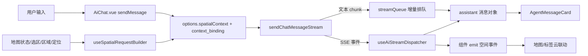
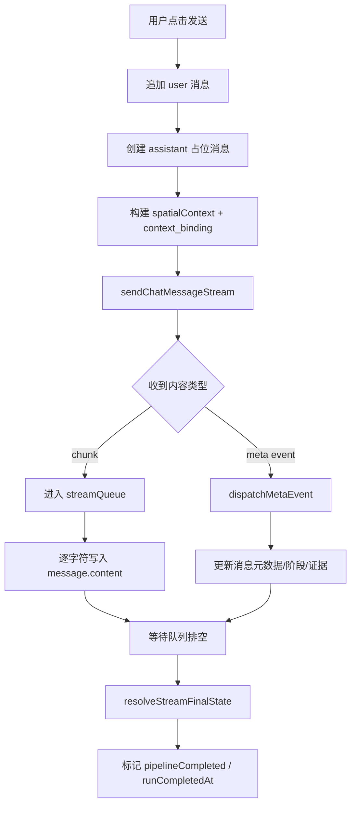

本页聚焦前端 **AI 聊天组件** 如何把用户输入、地图状态与后端 SSE 流式事件绑定成一次可追踪的对话运行。它不讨论地图容器、后端路由或通用状态系统本身，而只解释 `AiChat.vue`、流式分发器、上下文绑定构造器与 SSE 契约如何协同工作，让一次提问从“输入文本”变成“带空间语义、可增量渲染、可附着证据”的助手消息。Sources: [AiChat.vue](src/components/AiChat.vue#L682-L954), [useAiStreamDispatcher.ts](src/composables/ai/useAiStreamDispatcher.ts#L85-L576), [useSpatialRequestBuilder.ts](src/composables/ai/useSpatialRequestBuilder.ts#L118-L416), [sseEventSchema.ts](shared/sseEventSchema.ts#L54-L332)

## 核心定位：对话不是单次请求，而是一条带空间上下文的运行链

从第一性原理看，这个聊天组件承担四件事：**收集对话输入**、**注入地图上下文**、**消费流式事件**、**把结果回写为 UI 可展示的消息对象**。`sendMessage` 会先追加用户消息，再立即创建一个空的 assistant 消息作为“运行容器”；之后将地图边界、缩放、选区、区域、用户定位等信息经 `buildSpatialContext` 规范化，连同 `buildDslMetaSkeleton` 生成的 `context_binding` 一起放入请求选项；最后把 SSE 过程中收到的 `trace`、`stage`、`thinking`、`reasoning`、`intent_preview`、`pois`、`refined_result` 等事件交给 `dispatchMetaEvent` 做定向合并。Sources: [AiChat.vue](src/components/AiChat.vue#L682-L954), [useSpatialRequestBuilder.ts](src/composables/ai/useSpatialRequestBuilder.ts#L317-L416), [useAiStreamDispatcher.ts](src/composables/ai/useAiStreamDispatcher.ts#L229-L576)

在这个设计中，**消息对象本身就是运行状态容器**。assistant 消息除了 `content` 与 `timestamp`，还会携带 `runStartedAt`、`runCompletedAt`、`isThinking`、`isStreaming`、`pipelineStage`、`pipelineHighWaterStageIndex`、`intentPreview`、`toolCalls`、`boundary`、`spatialClusters`、`vernacularRegions`、`fuzzyRegions`、`analysisStats` 等字段，因此 UI 不需要再维护一套独立的“流式会话模型”，而是直接围绕消息渲染进度、推理状态和空间证据。Sources: [AiChat.vue](src/components/AiChat.vue#L725-L747), [useAiStreamDispatcher.ts](src/composables/ai/useAiStreamDispatcher.ts#L10-L48), [chatStreamState.ts](src/lib/chatStreamState.ts#L14-L39)

## 架构总览

在阅读 Mermaid 图之前，需要先明确三个角色：`AiChat.vue` 是编排层，负责发起请求与维护消息列表；`useSpatialRequestBuilder` 是输入归一化层，负责把前端地图状态转换成后端可消费的空间上下文和上下文绑定事件；`useAiStreamDispatcher` 是事件吸收层，负责把 SSE 元数据精确回写到某一条 assistant 消息。Sources: [AiChat.vue](src/components/AiChat.vue#L373-L387), [useSpatialRequestBuilder.ts](src/composables/ai/useSpatialRequestBuilder.ts#L118-L416), [useAiStreamDispatcher.ts](src/composables/ai/useAiStreamDispatcher.ts#L85-L576)

这个结构显示了一个关键模式：**文本流与结构化事件流是并行通道**。文本 chunk 只负责往 `content` 追加可见答案；而结构化 SSE 事件负责补充意图、阶段、边界、聚类、模糊区域、工具调用、统计信息等富语义元数据。最终二者在同一条 assistant 消息上汇合。Sources: [AiChat.vue](src/components/AiChat.vue#L515-L594), [AiChat.vue](src/components/AiChat.vue#L859-L889), [useAiStreamDispatcher.ts](src/composables/ai/useAiStreamDispatcher.ts#L242-L268)

## 请求构建：聊天输入如何绑定地图上下文

`AiChat.vue` 对外接收的属性本身就是上下文来源，包括 `poiFeatures`、`globalAnalysisEnabled`、`boundaryPolygon`、`drawMode`、`circleCenter`、`circleRadius`、`mapBounds`、`mapZoom`、`userLocation`、`regions`。发送消息时，这些状态会先进入 `buildSpatialContext`，被组织成包含 `boundary`、`mode`、`center`、`radius`、`viewport`、`mapZoom`、`userLocation`、`analysisScale` 和 `interactionHints` 的结构。这里的 `analysisScale` 直接由 zoom 推导，`interactionHints` 则编码了是否有手绘区域、区域数量、是否比较、POI 数量等交互事实。Sources: [AiChat.vue](src/components/AiChat.vue#L145-L195), [AiChat.vue](src/components/AiChat.vue#L780-L790), [useSpatialRequestBuilder.ts](src/composables/ai/useSpatialRequestBuilder.ts#L109-L116), [useSpatialRequestBuilder.ts](src/composables/ai/useSpatialRequestBuilder.ts#L360-L399)

`useSpatialRequestBuilder` 还承担了 **坐标系归一化**。当 `VITE_POI_COORD_SYS` 指示前端 POI 使用 `wgs84` 时，它会把前端显示坐标转换为后端期望的坐标；这种归一化不仅应用于单点，还覆盖边界点集、视口 bbox、区域 geometry、区域中心和用户定位，从而保证“用户在地图上看到的选择范围”与“后端接收到的空间约束”一致。Sources: [useSpatialRequestBuilder.ts](src/composables/ai/useSpatialRequestBuilder.ts#L49-L84), [useSpatialRequestBuilder.ts](src/composables/ai/useSpatialRequestBuilder.ts#L125-L186), [useSpatialRequestBuilder.ts](src/composables/ai/useSpatialRequestBuilder.ts#L188-L293)

更关键的是 `buildDslMetaSkeleton`。它调用 `createContextBindingManager().next()` 生成 `context_binding`，其中包含 `viewport_hash`、`client_view_id`、`event_seq`、`map_state_version`、`captured_at_ms`、`source`。这意味着每次发送消息时，前端都会为当前地图视图生成一个可复现、可比对的上下文标识，而不是只把原始 bbox 裸传给后端。Sources: [useSpatialRequestBuilder.ts](src/composables/ai/useSpatialRequestBuilder.ts#L317-L358), [contextBinding.ts](src/utils/contextBinding.ts#L18-L29), [contextBinding.ts](src/utils/contextBinding.ts#L118-L185)

## 上下文绑定机制：什么叫“绑定”，以及它具体绑定了什么

这里的“上下文绑定”不是简单地把地图边界附加到请求上，而是把 **当前地图状态转换成一个稳定签名**。`buildViewportHash` 会先对 viewport、drawMode、regions 做规范化，再对对象键排序，最后用 FNV-1a 哈希生成形如 `sha1:xxxxxxxx` 的 `viewport_hash`。区域本身也会被压缩成 `id`、`name`、`type`、`center`、`poiCount` 这样的标准结构并排序，因此同一组区域即使原始顺序不同，也会得到相同哈希。Sources: [contextBinding.ts](src/utils/contextBinding.ts#L31-L80), [contextBinding.ts](src/utils/contextBinding.ts#L82-L130)

`createContextBindingManager` 在此基础上再引入两个时序字段：`client_view_id` 用于标识浏览器端这条视图会话，`event_seq` 用于标识该视图下的第几次绑定事件。这样后端不只知道“你问了什么”，还知道“你是在同一个地图视图上持续追问，还是在新的地图状态下重新提问”。这是流式对话与空间状态保持一致的基础。Sources: [contextBinding.ts](src/utils/contextBinding.ts#L132-L185)

下表概括了上下文绑定载荷的作用边界：Sources: [contextBinding.ts](src/utils/contextBinding.ts#L9-L29), [useSpatialRequestBuilder.ts](src/composables/ai/useSpatialRequestBuilder.ts#L317-L358)

| 字段 | 来源 | 作用 |
|---|---|---|
| `viewport_hash` | 视口、绘制模式、区域摘要 | 标识当前地图状态是否发生语义变化 |
| `client_view_id` | 前端会话级随机稳定 ID | 关联同一浏览器视图下的多次追问 |
| `event_seq` | 递增序号 | 保证同一视图内请求顺序可追踪 |
| `map_state_version` | 可选外部版本号 | 预留地图状态版本对齐能力 |
| `captured_at_ms` | 发送时刻 | 记录上下文采样时间 |
| `source` | `frontend_injected` 或 `frontend_generated` | 区分由请求注入还是前端自动生成 |

## 流式响应模型：文本流与元事件流并存

`sendChatMessageStream` 体现了前端消费 SSE 的主逻辑。V1/V4 模式下，它向 `/chat` 发送 `messages`、`poiFeatures` 与 `options`，然后按 block 切分 SSE，利用 `validateSSEEventPayload` 对每个事件做结构校验；只要 schema 不通过，就转成 `schema_error` 交给上层，而不是默默吞掉。通过校验的事件会被逐个推送给 `onEvent`，遇到 `error` 事件则直接抛出异常中止本轮流。Sources: [aiService.ts](src/utils/aiService.ts#L355-L399), [geoloomApi.ts](src/lib/geoloomApi.ts#L34-L112), [sseEventSchema.ts](shared/sseEventSchema.ts#L14-L20)

V3 模式的兼容实现不同：`sendV3ChatStream` 按行读取 `event:` 与 `data:`，兼容 `meta`、`text` 与结构化事件。它会把 `text` 中的 `<think>` 片段剥离，只把可见内容传给 `onChunk`；结构化事件则走 `onMeta`。因此无论后端处于 V3 还是 V4，`AiChat.vue` 最终面对的都是同一种上层语义：**可显示文本 + 可分发元数据**。Sources: [v3aiService.ts](src/utils/v3aiService.ts#L88-L221), [v3aiService.ts](src/utils/v3aiService.ts#L275-L331)

下表展示前端明确识别的核心 SSE 事件类型：Sources: [aiService.ts](src/utils/aiService.ts#L106-L113), [sseEventSchema.ts](shared/sseEventSchema.ts#L54-L200), [SSEWriter.ts](backend/src/chat/SSEWriter.ts#L18-L113)

| 事件 | 主要语义 | 前端处理位置 |
|---|---|---|
| `trace` | traceId、schemaVersion、capabilities | 写入消息元数据 |
| `stage` | 当前流水阶段 | 更新 pipeline 状态 |
| `thinking` | 推理开始/结束提示 | 更新转圈与提示语 |
| `reasoning` | 推理内容片段 | 追加到 `reasoningContent` |
| `intent_preview` | 早期意图识别结果 | 更新意图预览与提示语 |
| `pois` | 结构化 POI 列表 | 写入消息与标签云来源 |
| `boundary` / `spatial_clusters` / `vernacular_regions` / `fuzzy_regions` | 空间证据 | 写入消息并向外 emit |
| `stats` | 统计信息 | 更新分析指标 |
| `refined_result` | 最终汇总结果 | 统一回写答案与证据 |
| `done` | 流程完成 | 标记完成 |
| `error` | 流中错误 | 终止并显示失败 |

## 事件分发器：SSE 事件如何变成一条“富消息”

`useAiStreamDispatcher` 的职责不是保存全局状态，而是把某次请求的 SSE 元事件精确落到 `messagesRef[aiMessageIndex]`。例如 `thinking` 会维护 `isThinking` 与 `thinkingMessage`；`reasoning` 会追加到 `reasoningContent`；`intent_preview` 会构造一个包含 `queryType`、`displayAnchor`、`targetCategory`、`confidence`、`needsWebSearch`、`categoryMain` 等字段的对象，并据此生成“已识别：某地 · 某类目”这样的提示文本。Sources: [useAiStreamDispatcher.ts](src/composables/ai/useAiStreamDispatcher.ts#L270-L390)

这个分发器同时负责 **SSE 元信息提升**。`applySSEMetaToMessage` 会从任意对象事件中抽出 `trace_id`、`schema_version`、`capabilities`，并写回消息顶层字段；因此后续的遥测、导出和 UI 状态都不必重新解析原始 payload。`trace`、`stage`、`intent_preview` 等事件还会被追加到 `agentEvents`，形成一条可回放的运行时间线。Sources: [useAiStreamDispatcher.ts](src/composables/ai/useAiStreamDispatcher.ts#L229-L240), [useAiStreamDispatcher.ts](src/composables/ai/useAiStreamDispatcher.ts#L270-L389)

`refined_result` 是最关键的汇总事件。分发器会先调用 `normalizeRefinedResultEvidence`，再把其中的 `boundary`、`spatialClusters`、`vernacularRegions`、`fuzzyRegions`、`stats`、`intent`、`toolCalls` 回写到消息；同时它也会向组件外发出 `ai-boundary`、`ai-spatial-clusters`、`ai-vernacular-regions`、`ai-fuzzy-regions`、`ai-analysis-stats`、`ai-intent-meta` 这些事件，使聊天面板成为“证据生产者”，而不是证据的唯一消费者。Sources: [useAiStreamDispatcher.ts](src/composables/ai/useAiStreamDispatcher.ts#L242-L268)

## 流式渲染：为什么要先排队，再逐字符落盘

文本 chunk 到达时，`AiChat.vue` 并不直接把整段内容一次性写入消息，而是先进入 `streamQueue`，再由一个 16ms 周期的定时器通过 `takeNextStreamCharacter` 逐字符消费。这种做法形成一种受控的“打字机流”，既能平滑展示，又能避免高频 chunk 直接触发过于密集的 DOM 更新。Sources: [AiChat.vue](src/components/AiChat.vue#L497-L562)

`waitForStreamQueueToDrain` 与 `flushStreamQueue` 解决的是收尾一致性问题。前者等待队列自然排空，超时则强制 flush；后者会把剩余 chunk 一次性补写到当前消息中。这样即使请求失败、结束过快或流中断，用户看到的消息也不会停留在半个字符或被截断的中间态。Sources: [AiChat.vue](src/components/AiChat.vue#L564-L604), [AiChat.vue](src/components/AiChat.vue#L914-L953)

在 UI 判定层，`isStreamingMessage`、`shouldShowPipelineForMessage`、`shouldShowRunStatus` 与 `getRunStatusForMessage` 共同决定某条 assistant 消息当前是否仍在运行、是否展示流水阶段、是否展示思考状态。这里的判断不是只看全局 `isTyping`，而是结合消息自身的 `pipelineCompleted`、`isStreaming`、`isThinking` 与 `reasoningContent` 做细粒度渲染。Sources: [AiChat.vue](src/components/AiChat.vue#L254-L337)

## 消息生命周期：从 queued 到 finalize

一次完整发送的消息生命周期可以概括为：先创建 assistant 占位消息，再记录 `queued` 事件，随后随着 SSE `stage` 事件推进 `pipelineStage`，在文本流阶段不断追加 `content`，最后在 `finally` 阶段调用 `resolveStreamFinalState` 统一决定 `isStreaming`、`isThinking`、`thinkingMessage`、`pipelineCompleted` 和是否把最终阶段落在 `answer`。Sources: [AiChat.vue](src/components/AiChat.vue#L725-L747), [AiChat.vue](src/components/AiChat.vue#L879-L953)

在这个模型里，**结束不是由某一个 SSE 事件单独决定，而是由请求结果与本地收尾逻辑共同决定**。这很重要，因为文本 chunk 可能仍在排队，`thinking` 也可能先于最终文本结束；组件通过 `resolveStreamFinalState` 延后最终状态翻转，避免出现“状态已完成但文本还在继续增长”的 UI 错位。Sources: [AiChat.vue](src/components/AiChat.vue#L914-L953)

下面的流程图展示了该生命周期：Sources: [AiChat.vue](src/components/AiChat.vue#L682-L954), [useAiStreamDispatcher.ts](src/composables/ai/useAiStreamDispatcher.ts#L270-L390)

## 可见文本与推理文本分离：为什么用户看不到 reasoning transcript

组件对助手可见文本做了专门的清洗。`sanitizeAssistantVisibleText` 会移除 `<think>` 标签以及看起来像“Thinking Process”“Analyze the Request”这类推理转录开头的内容；`sendChatMessageStream` 的文本回调也会先执行这一步，只有“可见答案文本”才会进入 `streamQueue`。Sources: [AiChat.vue](src/components/AiChat.vue#L612-L629), [AiChat.vue](src/components/AiChat.vue#L859-L865), [aiService.ts](src/utils/aiService.ts#L227-L234)

但推理信息并没有被丢弃。`useAiStreamDispatcher` 对 `reasoning` 事件会把内容累计到 `reasoningContent` 字段，并允许通过消息卡片选择性展示。因此系统实际上采用的是 **显示文本与推理文本双轨制**：回答区只显示清洗后的用户可读答案，调试或过程区可以保留 reasoning 证据。Sources: [useAiStreamDispatcher.ts](src/composables/ai/useAiStreamDispatcher.ts#L304-L320), [AiChat.vue](src/components/AiChat.vue#L312-L337)

下表对比这两条文本通道：Sources: [AiChat.vue](src/components/AiChat.vue#L622-L629), [AiChat.vue](src/components/AiChat.vue#L859-L865), [useAiStreamDispatcher.ts](src/composables/ai/useAiStreamDispatcher.ts#L304-L320)

| 通道 | 来源 | 存储字段 | 是否直接展示给用户 |
|---|---|---|---|
| 可见答案文本 | chunk / text 流 | `message.content` | 是 |
| 推理过程文本 | `reasoning` 事件 | `message.reasoningContent` | 否，按组件策略可选显示 |
| 思考状态提示 | `thinking` / `intent_preview` | `message.thinkingMessage` | 是，作为状态文案 |
| 结构化意图 | `intent_preview` / `refined_result.intent` | `message.intentPreview` / `message.intentMeta` | 间接展示 |

## 组件与地图联动：聊天结果如何回到空间界面

聊天组件并不只渲染文本。assistant 消息经过 `dispatchRefinedResult` 或 `pois` 事件更新后，可能包含 `boundary`、`spatialClusters`、`vernacularRegions`、`fuzzyRegions` 与 POI 列表。组件会把这些结构通过 `emit` 发给父层，例如 `ai-boundary`、`ai-spatial-clusters`、`ai-vernacular-regions`、`ai-fuzzy-regions`、`render-pois-to-map` 与 `render-to-tagcloud`。Sources: [useAiStreamDispatcher.ts](src/composables/ai/useAiStreamDispatcher.ts#L262-L268), [AiChat.vue](src/components/AiChat.vue#L198-L210), [AiChat.vue](src/components/AiChat.vue#L968-L982), [AiChat.vue](src/components/AiChat.vue#L1355-L1381)

`handleRenderToMap` 还会尝试从消息内容与 POI 构造一个 anchor feature，再连同 POI 一起发出；这说明聊天组件不是“地图的附属面板”，而是空间分析交互的一个入口与出口：输入来自地图状态，输出又能回灌到地图。Sources: [AiChat.vue](src/components/AiChat.vue#L962-L982)

## 后端契约：前端为什么能稳定消费这些事件

前端消费的事件并非松散约定，而是有明确的共享 schema 与写入器支持。`shared/sseEventSchema.ts` 定义了 `job`、`stage`、`thinking`、`reasoning`、`intent_preview`、`progress`、`partial`、`pois`、`boundary`、`spatial_clusters`、`vernacular_regions`、`fuzzy_regions`、`stats`、`web_search`、`entity_alignment`、`refined_result`、`error`、`done` 等事件的 JSON schema，并统一允许附加 `trace_id`、`schema_version`、`capabilities` 元字段。Sources: [sseEventSchema.ts](shared/sseEventSchema.ts#L21-L52), [sseEventSchema.ts](shared/sseEventSchema.ts#L54-L200)

后端 `SSEWriter` 则为这些事件提供稳定的发射接口，并在 `withMeta` 中自动把 `trace_id` 与 `schema_version` 附着到对象型 payload 上。`SurfaceChatRuntime` 在创建 writer 时固定使用 `v4.surface.v1` 作为 schemaVersion，因此前端可以把 schema 版本写回消息并参与后续观察与导出。Sources: [SSEWriter.ts](backend/src/chat/SSEWriter.ts#L9-L114), [SurfaceChatRuntime.ts](backend/src/chat/SurfaceChatRuntime.ts#L18-L31)

## 关键模式总结

从实现模式看，这个聊天组件最核心的不是“聊天 UI”，而是三个可复用设计：第一，**消息即运行状态**，使流式响应天然贴附于对话记录；第二，**文本流与结构化事件流分轨**，保证答案展示与证据更新互不干扰；第三，**上下文绑定显式化**，把地图状态变成可校验、可追踪的请求上下文，而不是隐式的瞬时前端状态。Sources: [AiChat.vue](src/components/AiChat.vue#L725-L747), [AiChat.vue](src/components/AiChat.vue#L859-L889), [contextBinding.ts](src/utils/contextBinding.ts#L118-L185)

对于中级开发者，理解这一页后，最值得继续深入的是两个方向：如果你想看流式事件从 HTTP 到 SSE 的后端出口，可继续阅读 [API 路由设计：RESTful 与 SSE 流式传输](22-api-lu-you-she-ji-restful-yu-sse-liu-shi-chuan-shu)；如果你想理解聊天结果如何进一步驱动地图与证据卡渲染，可继续阅读 [证据生成与可视化：空间证据卡与叙事模式](8-zheng-ju-sheng-cheng-yu-ke-shi-hua-kong-jian-zheng-ju-qia-yu-xu-shi-mo-shi) 与 [地图容器与图层管理：地理可视化核心](16-di-tu-rong-qi-yu-tu-ceng-guan-li-di-li-ke-shi-hua-he-xin)。Sources: [AiChat.vue](src/components/AiChat.vue#L55-L73), [AiChat.vue](src/components/AiChat.vue#L968-L982), [useAiStreamDispatcher.ts](src/composables/ai/useAiStreamDispatcher.ts#L262-L268)