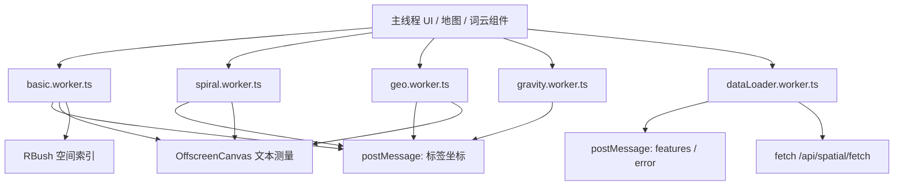
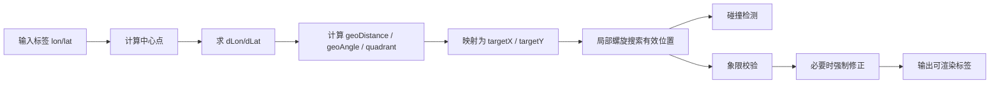

本页聚焦前端 **Web Worker 子系统**：它将高开销标签布局计算与 POI 数据抓取从主线程剥离出来，以降低界面阻塞、提升地图与可视化交互的响应性。就代码事实而言，当前仓库在 `src/workers` 下实现了 **4 个布局型 worker** 与 **1 个数据加载型 worker**，分别面向基础词云布局、螺旋布局、地理约束布局、重力环形布局，以及后端空间数据拉取。它们都通过 `self.onmessage` 接收主线程请求，再以 `postMessage` 回传最终结果，形成明确的计算隔离边界。Sources: [basic.worker.ts](src/workers/basic.worker.ts#L45-L71) [dataLoader.worker.ts](src/workers/dataLoader.worker.ts#L31-L82) [geo.worker.ts](src/workers/geo.worker.ts#L71-L121) [gravity.worker.ts](src/workers/gravity.worker.ts#L61-L62) [gravity.worker.ts](src/workers/gravity.worker.ts#L365-L376) [spiral.worker.ts](src/workers/spiral.worker.ts#L42-L66)

从架构第一原则看，这一层的职责不是“渲染 UI”，而是 **并行执行可独立求解的计算任务**。布局型 worker 负责把一组标签转成可渲染坐标；数据加载型 worker 负责把查询参数转成一次后端请求并返回特征列表。也就是说，主线程只保留编排和展示，worker 则承担 CPU 密集或 I/O 等待密集的工作，这正是本页“并行计算与数据加载优化”的核心。Sources: [dataLoader.worker.ts](src/workers/dataLoader.worker.ts#L24-L82) [basic.worker.ts](src/workers/basic.worker.ts#L108-L117) [geo.worker.ts](src/workers/geo.worker.ts#L123-L145) [gravity.worker.ts](src/workers/gravity.worker.ts#L253-L275) [spiral.worker.ts](src/workers/spiral.worker.ts#L68-L100)

## 模块版图：5 个 worker 的角色分工

当前 worker 目录结构很扁平，说明这里采用的是 **按任务类型分文件** 的方式，而不是共享一个统一调度器。每个 worker 文件既定义消息协议，也包含完整算法实现；测试文件一一对应，表明项目把“线程隔离逻辑”作为可直接验证的单元来维护。Sources: [src/workers 目录](src/workers#L1-L11)

| Worker | 主要职责 | 输入特征 | 输出结果 | 优化目标 |
|---|---|---|---|---|
| `basic.worker.ts` | 基础动态重心标签布局 | 标签、画布尺寸、布局配置 | 已放置标签数组 | 一般词云布局的快速放置 |
| `spiral.worker.ts` | 螺旋搜索标签布局 | 标签、画布尺寸、螺旋配置 | 已放置标签数组 | 以中心向外稳定扩展 |
| `geo.worker.ts` | 保留地理相对方位的布局 | 标签经纬度、中心点、布局配置 | 含象限/距离信息的标签数组 | 地理语义可解释性 |
| `gravity.worker.ts` | 基于方位与距离的环带布局 | 标签经纬度、中心点、尺寸 | 含 ring/bearing/distance 的结果 | 规则化展示大量点位 |
| `dataLoader.worker.ts` | 后端 POI 数据抓取 | 类别、范围、几何、limit、baseUrl | success/features 或 error | 降低主线程等待与解析负担 |

Sources: [basic.worker.ts](src/workers/basic.worker.ts#L8-L39) [dataLoader.worker.ts](src/workers/dataLoader.worker.ts#L1-L15) [geo.worker.ts](src/workers/geo.worker.ts#L1-L69) [gravity.worker.ts](src/workers/gravity.worker.ts#L1-L59) [spiral.worker.ts](src/workers/spiral.worker.ts#L1-L40)

## 架构关系图：主线程如何把计算与加载并行外包

先看图再看细节：下面这张 Mermaid 图描述的是当前代码已经实现的调用模式。它不是泛化的浏览器模型，而是对仓库内 worker 职责边界的抽象。布局 worker 和数据加载 worker 都是独立终点，彼此没有直接互调关系，意味着并行性主要由主线程调度触发。Sources: [basic.worker.ts](src/workers/basic.worker.ts#L62-L71) [dataLoader.worker.ts](src/workers/dataLoader.worker.ts#L32-L82) [geo.worker.ts](src/workers/geo.worker.ts#L111-L121) [gravity.worker.ts](src/workers/gravity.worker.ts#L365-L376) [spiral.worker.ts](src/workers/spiral.worker.ts#L57-L66)

## 统一通信模式：消息驱动而非共享状态

五个 worker 都采用同一种基础协议：**监听 `onmessage`，读取 `event.data`，执行任务，回传结果**。这意味着主线程与 worker 之间不存在共享内存或长生命周期状态同步；每次任务都以“请求对象 → 结果对象”的方式结束。这种模式的优点是边界清晰、容易测试，代价则是每次都需要完整传入参数。Sources: [basic.worker.ts](src/workers/basic.worker.ts#L62-L71) [dataLoader.worker.ts](src/workers/dataLoader.worker.ts#L32-L41) [geo.worker.ts](src/workers/geo.worker.ts#L111-L121) [gravity.worker.ts](src/workers/gravity.worker.ts#L365-L376) [spiral.worker.ts](src/workers/spiral.worker.ts#L57-L66)

从类型定义也可以看到，这些 worker 的消息协议都是 **局部自描述** 的：请求类型与结果类型定义在各自文件内，没有抽取到共享契约层。对文档读者而言，这表示优化逻辑是“按 worker 独立演化”的；对维护者而言，则意味着改动接口时需要同步关注调用方与测试。Sources: [basic.worker.ts](src/workers/basic.worker.ts#L3-L39) [dataLoader.worker.ts](src/workers/dataLoader.worker.ts#L1-L15) [geo.worker.ts](src/workers/geo.worker.ts#L1-L65) [gravity.worker.ts](src/workers/gravity.worker.ts#L8-L59) [spiral.worker.ts](src/workers/spiral.worker.ts#L1-L36)

## OffscreenCanvas：把文本测量也迁入 worker

`basic.worker.ts`、`geo.worker.ts` 与 `spiral.worker.ts` 都在 worker 内使用 `OffscreenCanvas` 获取 2D 上下文并测量文本宽度。这一点非常关键，因为标签布局算法必须知道文字宽高才能做碰撞检测；如果仍回到主线程测量，就会破坏并行隔离。为适配 worker 环境，这些文件还补了一个极小的 `document.createElement('canvas')` polyfill，在 `document` 缺失时返回 `OffscreenCanvas(1, 1)`。Sources: [basic.worker.ts](src/workers/basic.worker.ts#L41-L60) [basic.worker.ts](src/workers/basic.worker.ts#L130-L165) [geo.worker.ts](src/workers/geo.worker.ts#L67-L84) [geo.worker.ts](src/workers/geo.worker.ts#L137-L149) [geo.worker.ts](src/workers/geo.worker.ts#L195-L197) [spiral.worker.ts](src/workers/spiral.worker.ts#L38-L55) [spiral.worker.ts](src/workers/spiral.worker.ts#L94-L126)

这类实现说明当前优化不仅是“把循环搬进线程”，还包括 **把布局所需的几何测量依赖一并搬迁**。因此，主线程收到的已经不是“待计算文本”，而是可直接渲染的坐标与尺寸结果。Sources: [basic.worker.ts](src/workers/basic.worker.ts#L147-L178) [geo.worker.ts](src/workers/geo.worker.ts#L250-L273) [spiral.worker.ts](src/workers/spiral.worker.ts#L110-L139)

## 基础布局 worker：动态重心 + RBush 碰撞加速

`basic.worker.ts` 的核心思路是：先为每个标签测量尺寸并计算字体大小，然后按权重或字体大小排序，优先放置更重要的标签；放置过程中，第一个标签从中心开始，其余标签从“分布式种子点”与“当前已放置标签重心”的混合位置起步，再沿径向螺旋搜索最近可用位置。这个策略兼顾了中心聚集性与全局分散性。Sources: [basic.worker.ts](src/workers/basic.worker.ts#L73-L106) [basic.worker.ts](src/workers/basic.worker.ts#L138-L192) [basic.worker.ts](src/workers/basic.worker.ts#L204-L219)

它的关键优化点在于 **RBush 空间索引**。每放置一个标签，就把其包围盒插入树中；新候选位置通过 `tree.collides(candidateBox)` 检查是否冲突，而不是遍历所有已放置标签。对于标签数增大时，这是一种明显偏向性能的实现选择。Sources: [basic.worker.ts](src/workers/basic.worker.ts#L1-L2) [basic.worker.ts](src/workers/basic.worker.ts#L195-L198) [basic.worker.ts](src/workers/basic.worker.ts#L228-L236) [basic.worker.ts](src/workers/basic.worker.ts#L266-L308)

从实现结果看，`basic.worker` 更像是 **通用型高性能布局器**：不保留地理关系，不做旋转，只专注于边界约束、碰撞避免和中心优先放置。测试也只验证了这一最核心的不变量——所有已放置标签必须留在画布范围内。Sources: [basic.worker.ts](src/workers/basic.worker.ts#L167-L177) [basic.worker.ts](src/workers/basic.worker.ts#L311-L327) [basic.worker.spec.js](src/workers/__tests__/basic.worker.spec.js#L49-L85)

## 螺旋布局 worker：确定性中心扩散与分阶段退让

`spiral.worker.ts` 和基础布局一样，先做尺寸测量与权重归一化，再按权重或字体大小排序。区别在于它不使用空间索引和动态重心，而是对每个标签统一从画布中心开始，沿阿基米德螺旋轨迹向外搜索位置。Sources: [spiral.worker.ts](src/workers/spiral.worker.ts#L68-L89) [spiral.worker.ts](src/workers/spiral.worker.ts#L102-L152) [spiral.worker.ts](src/workers/spiral.worker.ts#L186-L239)

它的优化策略体现在 **分阶段降低最小间距**：`searchPhases` 按 `1.0 → 0.8 → 0.6 → 0.4 → 0.2` 依次缩放 `minGap`。这意味着算法先追求稀疏、美观的布局，失败后再逐步降低空间要求，尽可能提高放置成功率。与 `basic.worker` 相比，这是一种更偏“稳定可控”和“逐步让步”的搜索策略。Sources: [spiral.worker.ts](src/workers/spiral.worker.ts#L195-L205) [spiral.worker.ts](src/workers/spiral.worker.ts#L207-L237)

碰撞检测方面，螺旋布局仍采用顺序扫描已放置标签的矩形重叠判断，而不是 RBush。这表明它的实现优先级是算法简单和轨迹一致性，而非极致碰撞查询性能。测试同样验证了布局输出必须严格位于画布边界内。Sources: [spiral.worker.ts](src/workers/spiral.worker.ts#L242-L275) [spiral.worker.ts](src/workers/spiral.worker.ts#L277-L294) [spiral.worker.spec.js](src/workers/__tests__/spiral.worker.spec.js#L50-L88)

## 地理布局 worker：在并行线程中保留空间语义

`geo.worker.ts` 的目标不是单纯排满标签，而是在屏幕上尽量保留 **真实地理相对关系**。如果请求里传入了 `center`，它就直接使用；否则会对所有带经纬度的标签求平均中心。随后，它计算每个点相对中心的 `dLon`、`dLat`、地理距离、角度与象限，并将这些量映射成画布上的目标位置。Sources: [geo.worker.ts](src/workers/geo.worker.ts#L151-L179) [geo.worker.ts](src/workers/geo.worker.ts#L202-L244) [geo.worker.ts](src/workers/geo.worker.ts#L250-L273)

它的布局过程可理解为“**先按地理目标点投影，再局部螺旋避让**”。每个标签先拥有一个 `targetX/targetY`，然后通过 `findValidPosition` 在目标附近做有限次数搜索；搜索时同时检查画布边界、碰撞以及 **是否仍处于原始象限**。如果第一次失败，还会缩小字体后再尝试一次。Sources: [geo.worker.ts](src/workers/geo.worker.ts#L258-L272) [geo.worker.ts](src/workers/geo.worker.ts#L293-L341) [geo.worker.ts](src/workers/geo.worker.ts#L367-L420)

更关键的是，结果生成前还有一次 **象限校验与强制修正**。若某标签因避让而跨越中心轴线，`verifyQuadrant` 会识别错误，`forceCorrectQuadrant` 会将其拉回目标象限。这说明该 worker 优先维护“东在右、西在左、北在上、南在下”这样的地理解释性。对应测试也验证了 `minTagSpacing` 变大时，标签会被推得更远，说明间距参数直接影响空间展开程度。Sources: [geo.worker.ts](src/workers/geo.worker.ts#L345-L364) [geo.worker.ts](src/workers/geo.worker.ts#L422-L475) [geo.worker.ts](src/workers/geo.worker.ts#L477-L500) [geo.worker.spec.js](src/workers/__tests__/geo.worker.spec.js#L57-L103)

下面这张图展示了 `geo.worker` 的概念关系。它强调的是“地理量 → 屏幕量 → 碰撞修正”的三段式过程。Sources: [geo.worker.ts](src/workers/geo.worker.ts#L202-L244) [geo.worker.ts](src/workers/geo.worker.ts#L250-L273) [geo.worker.ts](src/workers/geo.worker.ts#L367-L420)

## 重力布局 worker：环带分层的规则化布局

`gravity.worker.ts` 走的是另一条路线：先根据画布尺寸与标签数量通过 `getAdaptiveConfig` 自动推导字体范围、环数、环间距、最大半径与碰撞迭代次数，因此它对容器大小与数据规模具有自适应特征。Sources: [gravity.worker.ts](src/workers/gravity.worker.ts#L73-L101) [gravity.worker.ts](src/workers/gravity.worker.ts#L267-L270)

在地理信息可用时，这个 worker 会计算每个标签相对中心的 **bearing** 和 **distance**；然后按距离排序分配 ring，再按 bearing 在每个 ring 内排序，最终把标签布到以中心为圆心的多层环带上。之后再做多轮两两碰撞消解，并把结果裁剪回边界内。这个模式的优势不是“最紧凑”，而是 **层次清晰、方向明确、适合大量点位的结构化展示**。Sources: [gravity.worker.ts](src/workers/gravity.worker.ts#L103-L143) [gravity.worker.ts](src/workers/gravity.worker.ts#L158-L171) [gravity.worker.ts](src/workers/gravity.worker.ts#L182-L211) [gravity.worker.ts](src/workers/gravity.worker.ts#L276-L351)

它输出的结果中保留了 `ring`、`bearing`、`distance`，并总是在数组开头插入一个名为“中心位置”的中心标签。这意味着消费方可以把它当成一种 **可解释布局结果**，而不仅仅是坐标数组。测试也专门验证：即使中心坐标包含 `0`，显式中心仍然会被正确使用，避免把零值误判为无效参数。Sources: [gravity.worker.ts](src/workers/gravity.worker.ts#L213-L251) [gravity.worker.ts](src/workers/gravity.worker.ts#L340-L362) [gravity.worker.spec.js](src/workers/__tests__/gravity.worker.spec.js#L26-L53)

## 数据加载 worker：把 POI 查询 I/O 从主线程拆出

`dataLoader.worker.ts` 是唯一非布局型 worker。它从消息中读取 `category`、`categories`、`bounds`、`geometry`、`limit` 和 `baseUrl`，然后调用 `resolveCategories` 将“单类别”和“多类别数组”两种输入统一成 `categories` 数组，再向 `${baseUrl}/api/spatial/fetch` 发送 POST 请求。Sources: [dataLoader.worker.ts](src/workers/dataLoader.worker.ts#L1-L9) [dataLoader.worker.ts](src/workers/dataLoader.worker.ts#L24-L29) [dataLoader.worker.ts](src/workers/dataLoader.worker.ts#L32-L57)

其优化价值不在于 CPU 计算，而在于 **把网络等待、错误处理与 JSON 解析放到 worker 线程**。请求成功时，它只把 `{ success, name, features }` 回传主线程；失败时则统一通过 `getErrorMessage` 归一化错误文本。测试验证了一个兼容性细节：当 `categories` 是空数组时，会自动回退到单个 `category` 字段，说明这个 worker 还承担了新旧调用方式之间的平滑适配。Sources: [dataLoader.worker.ts](src/workers/dataLoader.worker.ts#L17-L22) [dataLoader.worker.ts](src/workers/dataLoader.worker.ts#L43-L81) [dataLoader.worker.spec.js](src/workers/__tests__/dataLoader.worker.spec.js#L37-L65)

## 四种布局算法对比：优化方向并不相同

这四个布局型 worker 都是“并行计算”，但并不是同一种优化。它们分别在 **查询加速、搜索稳定性、地理语义保持、规则化呈现** 之间做了不同取舍。理解这一点，比记住函数名更重要。Sources: [basic.worker.ts](src/workers/basic.worker.ts#L194-L236) [geo.worker.ts](src/workers/geo.worker.ts#L293-L364) [gravity.worker.ts](src/workers/gravity.worker.ts#L302-L362) [spiral.worker.ts](src/workers/spiral.worker.ts#L154-L239)

| 维度 | basic | spiral | geo | gravity |
|---|---|---|---|---|
| 主要布局依据 | 重心 + 径向搜索 | 中心螺旋搜索 | 地理目标点 + 象限约束 | bearing/distance + ring |
| 碰撞检测 | RBush 空间索引 | 顺序矩形检测 | 顺序矩形检测 | 两两迭代推开 |
| 地理语义保持 | 无 | 无 | 强 | 中等偏强 |
| 参数自适应 | 手动配置为主 | 手动配置为主 | 手动配置为主 | 自动配置明显 |
| 失败退让机制 | 搜索直到超出最大半径 | 分阶段降低 `minGap` | 缩小字体后二次重试 | 多轮碰撞消解 |
| 输出附加语义 | 少 | 少 | `geoDistance/geoAngle/quadrant` | `ring/bearing/distance` |

Sources: [basic.worker.ts](src/workers/basic.worker.ts#L122-L128) [basic.worker.ts](src/workers/basic.worker.ts#L266-L308) [spiral.worker.ts](src/workers/spiral.worker.ts#L81-L89) [spiral.worker.ts](src/workers/spiral.worker.ts#L195-L239) [geo.worker.ts](src/workers/geo.worker.ts#L96-L109) [geo.worker.ts](src/workers/geo.worker.ts#L345-L364) [gravity.worker.ts](src/workers/gravity.worker.ts#L73-L101) [gravity.worker.ts](src/workers/gravity.worker.ts#L340-L362)

## 测试所揭示的质量边界

worker 测试并不追求验证所有几何细节，而是优先锁定几个 **最重要的不变量**。`basic` 和 `spiral` 都检查结果是否越界；`geo` 检查间距参数是否真正影响中心距离；`gravity` 检查显式中心坐标为零时是否仍被尊重；`dataLoader` 检查类别参数兼容逻辑。这说明当前测试策略更偏向“行为边界保障”，而不是“像素级快照验证”。Sources: [basic.worker.spec.js](src/workers/__tests__/basic.worker.spec.js#L49-L85) [dataLoader.worker.spec.js](src/workers/__tests__/dataLoader.worker.spec.js#L37-L65) [geo.worker.spec.js](src/workers/__tests__/geo.worker.spec.js#L57-L103) [gravity.worker.spec.js](src/workers/__tests__/gravity.worker.spec.js#L26-L53) [spiral.worker.spec.js](src/workers/__tests__/spiral.worker.spec.js#L50-L88)

另一个值得注意的事实是，测试通过伪造 `self`、`OffscreenCanvas` 与 `fetch` 来直接导入 worker 模块并调用 `onmessage`。这表明这些 worker 被设计成 **可在无真实浏览器线程环境下进行隔离验证**，从而降低了并发逻辑的测试门槛。Sources: [basic.worker.spec.js](src/workers/__tests__/basic.worker.spec.js#L3-L47) [dataLoader.worker.spec.js](src/workers/__tests__/dataLoader.worker.spec.js#L3-L35) [geo.worker.spec.js](src/workers/__tests__/geo.worker.spec.js#L3-L55) [gravity.worker.spec.js](src/workers/__tests__/gravity.worker.spec.js#L3-L24) [spiral.worker.spec.js](src/workers/__tests__/spiral.worker.spec.js#L3-L48)

## 线程优化的实际结论：这个子系统解决了什么问题

综合代码可以得出一个严格可验证的结论：当前仓库通过 worker 子系统解决了两类前端性能问题。第一类是 **标签布局的 CPU 密集计算**，包括文本测量、碰撞判断、螺旋搜索、空间索引查询、距离角度计算与迭代消解；第二类是 **空间数据拉取的等待与解析开销**，即将 fetch 与响应处理转移到独立线程。Sources: [basic.worker.ts](src/workers/basic.worker.ts#L130-L178) [basic.worker.ts](src/workers/basic.worker.ts#L194-L263) [geo.worker.ts](src/workers/geo.worker.ts#L202-L364) [gravity.worker.ts](src/workers/gravity.worker.ts#L253-L362) [spiral.worker.ts](src/workers/spiral.worker.ts#L102-L183) [dataLoader.worker.ts](src/workers/dataLoader.worker.ts#L32-L82)

更进一步说，这里实现的不是一个统一的“高性能引擎”，而是一组 **面向不同可视化语义的专用线程策略**。如果你想继续理解这些 worker 的消费方与界面集成方式，下一步建议阅读 [地图容器与图层管理：地理可视化核心](16-di-tu-rong-qi-yu-tu-ceng-guan-li-di-li-ke-shi-hua-he-xin) 与 [前端架构：Vue 3 + Vite + 地理可视化组件](9-qian-duan-jia-gou-vue-3-vite-di-li-ke-shi-hua-zu-jian)；如果你想理解其输出如何进入更复杂的 AI 展示链路，则可继续查看 [证据生成与可视化：空间证据卡与叙事模式](8-zheng-ju-sheng-cheng-yu-ke-shi-hua-kong-jian-zheng-ju-qia-yu-xu-shi-mo-shi)。Sources: [basic.worker.ts](src/workers/basic.worker.ts#L62-L71) [dataLoader.worker.ts](src/workers/dataLoader.worker.ts#L32-L82) [geo.worker.ts](src/workers/geo.worker.ts#L111-L121) [gravity.worker.ts](src/workers/gravity.worker.ts#L365-L376) [spiral.worker.ts](src/workers/spiral.worker.ts#L57-L66)