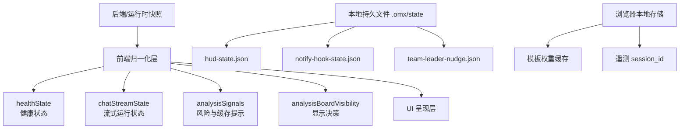
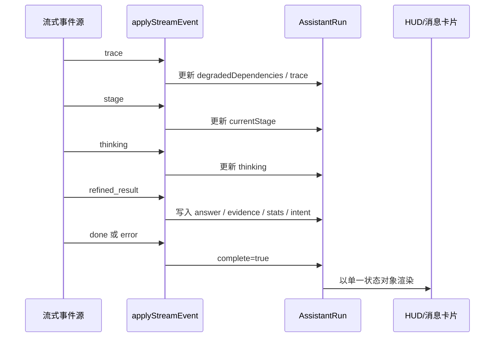
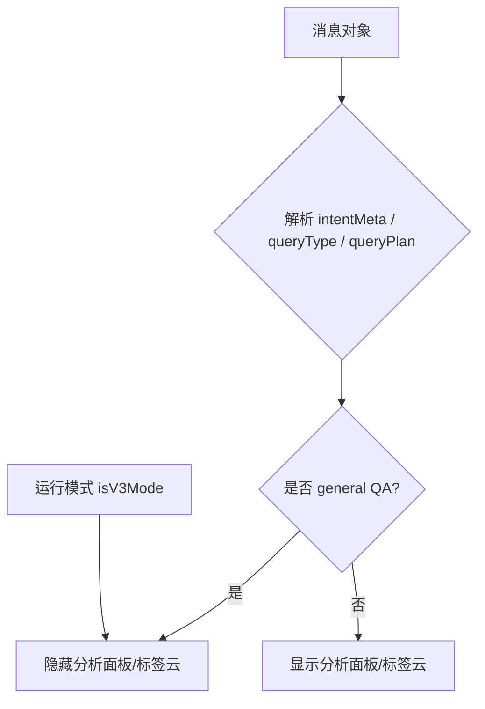

本页聚焦 GeoLoom Agent 中与**运行可见性**相关的状态层，而不是业务数据本身。就已验证代码而言，这一层由三类机制构成：其一是**面向界面的前端状态归一化**，用于把健康快照、流式事件和分析提示压缩成稳定的 UI 可消费结构；其二是**面向会话的本地持久状态**，用于记录 HUD、通知去重与团队协作提示的最近状态；其三是**面向遥测的会话状态**，用于在浏览器侧维护模板权重缓存与遥测会话标识。它们共同承担的职责不是“做分析”，而是让分析过程**可见、可恢复、可去重、可解释**。Sources: [healthState.ts](src/lib/healthState.ts#L1-L65), [chatStreamState.ts](src/lib/chatStreamState.ts#L1-L177), [analysisSignals.ts](src/utils/analysisSignals.ts#L1-L68), [analysisBoardVisibility.ts](src/utils/analysisBoardVisibility.ts#L1-L96), [aiTelemetry.ts](src/services/aiTelemetry.ts#L1-L200), [hud-state.json](.omx/state/hud-state.json#L1-L6), [notify-hook-state.json](.omx/state/notify-hook-state.json#L1-L8), [team-leader-nudge.json](.omx/state/team-leader-nudge.json#L1-L5)

## 先从第一原则理解：这里管理的不是领域状态，而是“系统对自身状态的说明”

从第一原则出发，HUD、通知和团队协作状态都属于**元状态（meta-state）**：它们描述的不是地图对象、POI 集合或分析结果，而是“系统现在怎么样”“刚刚发生了什么”“是否已经通知过某人”“当前协作是否需要提醒”。在前端代码中，这种模式非常明确：`normalizeHealthState` 负责将健康检查结果压平成统一结构，`applyStreamEvent` 负责把离散 SSE 事件累积为单次运行状态，`resolveAnalysisSignals` 负责从统计字段中提取缓存标签与风险告警，而 `shouldShowAnalysisBoard` 则负责决定某条消息是否值得展示分析面板。这说明状态管理的重点是**表达运行过程**，而非重复存储业务数据。Sources: [healthState.ts](src/lib/healthState.ts#L3-L63), [chatStreamState.ts](src/lib/chatStreamState.ts#L8-L176), [analysisSignals.ts](src/utils/analysisSignals.ts#L3-L67), [analysisBoardVisibility.ts](src/utils/analysisBoardVisibility.ts#L19-L95)

上图的阅读前提是：Mermaid 图中的“前端归一化层”并不是独立框架，而是一组小而专用的工具模块。它们的共同设计特征是输入宽松、输出稳定，这使 UI 不必直接依赖后端原始字段命名或事件顺序。Sources: [healthState.ts](src/lib/healthState.ts#L25-L63), [chatStreamState.ts](src/lib/chatStreamState.ts#L41-L176), [aiTelemetry.ts](src/services/aiTelemetry.ts#L34-L167)

## 架构分层：HUD、通知、团队协作状态分别落在不同介质上

从存储介质看，这套状态系统并不是集中式 store，而是**按用途分散存放**。`.omx/state/hud-state.json` 记录 HUD 最近一次交互时间、进度时间、轮次计数和最近输出摘要，显然偏向“外部运行面板摘要”；`.omx/state/notify-hook-state.json` 记录最近事件键及时间戳，核心用途是**通知去重**；`.omx/state/team-leader-nudge.json` 则记录按团队维度的 nudged/idle/progress 信息，体现出**团队级协作提醒**的独立状态空间。与之不同，前端运行态并未写入这些文件，而是在内存中通过归一化函数形成瞬时状态。浏览器端另有 `aiTelemetry.ts` 使用 `localStorage` 缓存模板权重，形成一种轻量持久层。Sources: [hud-state.json](.omx/state/hud-state.json#L1-L6), [notify-hook-state.json](.omx/state/notify-hook-state.json#L1-L8), [team-leader-nudge.json](.omx/state/team-leader-nudge.json#L1-L5), [aiTelemetry.ts](src/services/aiTelemetry.ts#L34-L167)

| 状态类别 | 主要职责 | 存储位置 | 生命周期 | 典型字段 |
|---|---|---|---|---|
| HUD 摘要状态 | 展示最近轮次与输出摘要 | `.omx/state/hud-state.json` | 跨进程/跨轮次持久 | `last_turn_at`、`turn_count`、`last_agent_output` |
| 通知钩子状态 | 避免重复通知 | `.omx/state/notify-hook-state.json` | 跨事件持久 | `recent_turns`、`last_event_at` |
| 团队协作提醒状态 | 记录按团队的 nudged/idle/progress | `.omx/state/team-leader-nudge.json` | 跨团队协作周期持久 | `last_nudged_by_team`、`progress_by_team` |
| 健康状态 | 把运行依赖快照变成 UI 结构 | 前端内存 | 单次查询/刷新周期 | `providerReady`、`dependencies` |
| 流式运行状态 | 聚合 SSE 事件成单次 assistant run | 前端内存 | 单次消息运行 | `currentStage`、`thinking`、`events` |
| 遥测缓存状态 | 模板权重缓存、session 标识 | 浏览器 `localStorage` + 模块变量 | 会话级/TTL 级 | `version`、`loadedAt`、`sessionId` |

Sources: [hud-state.json](.omx/state/hud-state.json#L1-L6), [notify-hook-state.json](.omx/state/notify-hook-state.json#L1-L8), [team-leader-nudge.json](.omx/state/team-leader-nudge.json#L1-L5), [healthState.ts](src/lib/healthState.ts#L3-L63), [chatStreamState.ts](src/lib/chatStreamState.ts#L8-L176), [aiTelemetry.ts](src/services/aiTelemetry.ts#L34-L167)

## HUD 状态：以最小摘要保留最近运行上下文

`.omx/state/hud-state.json` 当前可验证字段很少，但信息密度很高：`last_turn_at` 和 `last_progress_at` 表示最近轮次与最近进度更新时间，`turn_count` 表示已处理轮数，`last_agent_output` 则保存最近一次智能体输出摘要。这种结构说明 HUD 并不试图保存完整历史，而是采用**最近态快照**策略，适合外部状态栏、终端角标或面板概览。这也意味着 HUD 状态的设计目标不是重建完整会话，而是快速回答“最近是否还活着、走到哪一步、刚刚输出了什么”。Sources: [hud-state.json](.omx/state/hud-state.json#L1-L6)

从前端侧对应思路看，`chatStreamState.ts` 也采用了相同的“摘要优先”原则：单次运行中的离散事件会被汇总到 `AssistantRun` 结构中，而 `events` 仅保留最近 24 条记录，避免 UI 状态无限增长。HUD 文件与前端运行状态虽不共用同一实现，但在设计哲学上是一致的：**保留足够解释当前态的信息，而非保留全部原始过程**。Sources: [chatStreamState.ts](src/lib/chatStreamState.ts#L8-L95), [hud-state.json](.omx/state/hud-state.json#L1-L6)

## 通知状态：核心不是“发通知”，而是“避免重复发通知”

`notify-hook-state.json` 的结构直接暴露了通知系统的核心约束：`recent_turns` 是一个事件键到时间戳的映射，键中包含类似会话/轮次/事件类型的复合标识，`last_event_at` 则记录最近事件时间。可验证事实是，这个文件没有消息正文、通知级别或接收人列表，只有**去重所需的最小索引**。因此在这个仓库中，通知状态的显式职责不是内容管理，而是**幂等控制**。Sources: [notify-hook-state.json](.omx/state/notify-hook-state.json#L1-L8)

这一思路与前端事件处理模块的设计形成呼应。`applyStreamEvent` 每接收一条事件，都把它追加进 `events`，但同时限制历史长度；事件名如 `trace`、`stage`、`thinking`、`refined_result`、`done`、`error` 会决定更新哪个摘要字段。也就是说，前端关注“如何把事件收敛成当前展示状态”，而通知钩子文件关注“某个事件是否已经处理过”。两者都围绕**事件幂等化与可展示化**展开，只是一个面向 UI，一个面向通知侧效果控制。Sources: [chatStreamState.ts](src/lib/chatStreamState.ts#L54-L176), [notify-hook-state.json](.omx/state/notify-hook-state.json#L1-L8)

## 团队协作状态：以团队维度记录提醒与进度，而不是用户维度的复杂协同模型

`team-leader-nudge.json` 目前包含三个对象：`last_nudged_by_team`、`last_idle_nudged_by_team`、`progress_by_team`。当前样本值为空对象，但字段命名已经足够说明架构意图：系统按**team** 作为一等维度记录普通提醒、空闲提醒和进度情况，而不是按个人、频道或任务树建立复杂状态图。这意味着当前团队协作状态更像一个**协调提示层**，服务于“何时该提醒某团队继续推进”这一轻量协作需求，而非完整项目管理系统。Sources: [team-leader-nudge.json](.omx/state/team-leader-nudge.json#L1-L5)

这种团队级最小状态模型与 HUD/通知一样，体现出同一原则：**只保留驱动动作所必需的信息**。如果未来需要把这部分扩展成更复杂的协作机制，最自然的演进方向也应是围绕 team 粒度逐步增加字段，而不是推翻现有结构。就当前仓库证据而言，我们只能确认存在团队提醒与进度占位结构，不能证明已有更丰富的协作工作流实现。Sources: [team-leader-nudge.json](.omx/state/team-leader-nudge.json#L1-L5)

## 前端运行态一：健康状态归一化承担 HUD/提示面板的数据清洗职责

`normalizeHealthState` 是一个典型的前端防御式状态归一化函数。它对输入 `payload` 做三件关键工作：首先保证顶层对象一定是 plain object；其次将 `dependencies` 这个原本可能是 map 的结构转换为 `HealthDependency[]`，方便直接渲染列表；最后把 `provider_ready`、`degraded_dependencies`、`skills_registered` 等字段统一映射到类型稳定的前端字段上。这意味着 UI 可以依赖 `providerReady`、`dependencies`、`degradedDependencies` 等固定形态，而不必处理后端字段缺失、类型不一致或容器格式错误。Sources: [healthState.ts](src/lib/healthState.ts#L1-L63)

测试文件进一步验证了这个模块的角色：一组测试确认它能保留降级依赖与依赖详情；另一组测试确认当 `dependencies` 或 `degraded_dependencies` 结构错误时，会安全回退为空数组而不是抛异常。这种设计非常适合 HUD 类组件，因为 HUD 的核心价值是“始终能显示状态”，即便状态是不完整的。Sources: [healthState.spec.js](src/lib/healthState.spec.js#L1-L47), [healthState.ts](src/lib/healthState.ts#L25-L63)

| 健康状态字段 | 来源字段 | 归一化后用途 | 容错策略 |
|---|---|---|---|
| `providerReady` | `provider_ready` | 判断提供方是否可用 | 非 `true` 即 `false` |
| `degradedDependencies` | `degraded_dependencies` | 显示降级依赖列表 | 非数组返回空数组 |
| `dependencies` | `dependencies` 对象 | 渲染依赖明细列表 | 非对象返回空列表 |
| `skillsRegistered` | `skills_registered` | 展示注册技能数量 | 非数值回退为 `0` |
| `llm` / `memory` | 同名对象 | 展示模块健康详情 | 非对象回退为 `{ ready: false }` |

Sources: [healthState.ts](src/lib/healthState.ts#L12-L63), [healthState.spec.js](src/lib/healthState.spec.js#L5-L47)

## 前端运行态二：流式状态聚合是聊天面板与状态 HUD 的核心骨架

`chatStreamState.ts` 展示了前端如何把逐步到达的 SSE 事件折叠成一个完整的运行状态对象 `AssistantRun`。初始化函数 `createAssistantRun` 会创建带有 `currentStage: 'pending'`、`thinking: ''`、`complete: false` 的基线状态；随后 `applyStreamEvent` 根据事件类型增量更新字段。这个模型的关键价值在于，它把原本分散的 `trace`、`stage`、`thinking`、`pois`、`boundary`、`stats`、`refined_result`、`done`、`error` 统一收敛为**单个可观察对象**。Sources: [chatStreamState.ts](src/lib/chatStreamState.ts#L8-L176)

从状态职责上看，`trace` 事件负责补充 `degradedDependencies`，`stage` 事件负责推进阶段名，`thinking` 事件负责更新中间推理文案，而 `refined_result` 事件则一次性写入最终答案、工具调用、边界、空间聚类、证据视图和意图信息。换言之，系统并不是每种 UI 都监听原始流，而是先在中间层构建一个**运行态汇总对象**，再由展示层取用。对于 HUD 类面板，这是一种比直接订阅原始事件更稳定的状态组织方式。Sources: [chatStreamState.ts](src/lib/chatStreamState.ts#L91-L176)

测试也验证了这一点：单测依次注入 `trace`、`stage`、`intent_preview`、`refined_result`、`done` 后，可以一次性断言当前阶段、意图预览、答案、工具调用、证据视图、统计信息与降级依赖均已正确聚合。这说明该模块的目标不是事件转发，而是**事件折叠（event folding）**。Sources: [chatStreamState.spec.js](src/lib/chatStreamState.spec.js#L1-L60), [chatStreamState.ts](src/lib/chatStreamState.ts#L91-L176)

阅读这个时序图的前提是：`AssistantRun` 不是全局 store，而是一次 assistant 执行的局部聚合体。它解决的是“流式状态如何稳定落地到 UI”这个问题。Sources: [chatStreamState.ts](src/lib/chatStreamState.ts#L62-L176)

## 前端运行态三：分析信号状态把技术指标翻译成用户可理解提示

`resolveAnalysisSignals` 展现了另一类典型状态管理：将偏技术的统计字段映射为 UI 可读标签。函数会从 `rawStats` 中提取 `cache_hit`、`cache_key_version`、`geometry_match`、`undersegmentation_risk`、`writer_hallucination`，并输出 `cacheHit`、`cacheLabel` 与 `riskWarnings`。特别关键的是，返回值中的告警信息不是原始布尔值，而是已经被翻译成中文描述，例如“当前结果可能存在分区不足风险”与“文本可能含未证实结论”。这说明状态层在这里承担了**语义解释器**的职责。Sources: [analysisSignals.ts](src/utils/analysisSignals.ts#L3-L67)

这种模式非常适合 HUD、通知条或消息卡中的状态标签，因为 UI 无需知道 `undersegmentation_risk` 的内部判定逻辑，只需消费统一的 `riskWarnings[]`。同时，缓存标签会区分“来自同视图缓存”“缓存命中（几何待核验）”“已基于当前视图重算”，说明状态层不仅报告真假，还编码了**可信度上下文**。Sources: [analysisSignals.ts](src/utils/analysisSignals.ts#L20-L67)

| 原始统计字段 | 归一化结果 | 面向用户的解释层 |
|---|---|---|
| `cache_hit=true` + `geometry_match=true` | `cacheLabel=来自同视图缓存` | 结果可直接视为视图内复用 |
| `cache_hit=true` + `geometry_match=false` | `cacheLabel=缓存命中（几何待核验）` | 命中了缓存，但几何一致性需核验 |
| `cache_hit=false` | `cacheLabel=已基于当前视图重算` | 明确告诉用户这次不是复用缓存 |
| `undersegmentation_risk=true` | `riskWarnings[undersegmentation_risk]` | 提醒可能分区不足 |
| `writer_hallucination=true` | `riskWarnings[writer_hallucination]` | 提醒优先参考结构化证据 |

Sources: [analysisSignals.ts](src/utils/analysisSignals.ts#L25-L67)

## 前端运行态四：分析面板显示决策本质上也是状态管理

`analysisBoardVisibility.ts` 证明了“是否显示某个面板”本身就是一种状态管理问题。它先从消息对象中解析 `queryType`、`intentMode` 和 `queryPlan`，再通过 `isGeneralQaMessage` 判断该消息是否属于一般问答或越界输入。如果属于 `general_qa`、`irrelevant_input`、`llm_chat`、`out_of_scope`，或者缺乏可识别的空间推理计划，系统就倾向将其归类为一般问答；反之则允许分析面板显示。`shouldShowAnalysisBoard` 进一步加入 `isV3Mode` 条件，说明不同运行模式也会影响显示策略。Sources: [analysisBoardVisibility.ts](src/utils/analysisBoardVisibility.ts#L1-L95)

这类逻辑之所以应归入状态管理，而不是纯 UI 逻辑，是因为它定义了**消息状态到界面状态的映射规则**。在 `AiChat.vue` 中，`isGeneralQaMessage` 被直接用于判断是否展示标签云，因此消息的“分析性”已经成为一类跨组件共享的派生状态，而不是单个组件内部的临时判断。Sources: [analysisBoardVisibility.ts](src/utils/analysisBoardVisibility.ts#L61-L95), [AiChat.vue](src/components/AiChat.vue#L55-L65), [AiChat.vue](src/components/AiChat.vue#L136-L139)

该图的关键点在于：最终决策依赖的不是一个单字段，而是多个消息语义字段与运行模式共同构成的派生状态。Sources: [analysisBoardVisibility.ts](src/utils/analysisBoardVisibility.ts#L19-L95)

## 遥测会话状态：会话 ID 与模板权重缓存构成“软状态层”

`aiTelemetry.ts` 虽然不是 HUD 或通知模块，但从状态管理角度非常重要。它维护了一个模块级 `sessionId`，通过 `createSessionId`、`getTelemetrySessionId`、`resetTelemetrySessionId` 控制会话标识；同时维护 `cachedWeights`，并通过 `localStorage` 读写 `ai_template_weights_v1`。`refreshTemplateWeights` 还引入 TTL、强制刷新与 V4 模式短路逻辑。这里的重点在于，这些状态不是展示给用户看的，但会影响前端对模板权重与遥测上报的一致性认知。Sources: [aiTelemetry.ts](src/services/aiTelemetry.ts#L34-L167)

其设计特点同样体现了“优先可用，再求精确”：如果网络失败或网关异常，函数会静默降级到本地缓存权重；如果处于 V4 模式，则直接返回当前快照而不走远端请求。对于中级开发者而言，这说明仓库中的状态管理并不局限于 Vue 组件内 reactive state，还包括**模块级缓存状态**与**浏览器存储状态**。Sources: [aiTelemetry.ts](src/services/aiTelemetry.ts#L40-L167)

## 在界面中的落点：AiChat 已经消费了状态派生函数，而不是直接解释底层字段

就当前已验证代码而言，`AiChat.vue` 明确导入并使用了 `resolveAnalysisSignals`、`isGeneralQaMessage`、`refreshTemplateWeights` 等状态相关能力。模板中，`AgentMessageCard` 的 `show-tag-cloud` 直接基于 `!isGeneralQaMessage(msg) && Array.isArray(msg.pois) && msg.pois.length > 0` 判定；脚本区则导入分析信号与遥测工具。这说明聊天界面不是直接解释原始服务端返回，而是通过一系列已归一化或已派生的状态函数做渲染决策。Sources: [AiChat.vue](src/components/AiChat.vue#L55-L65), [AiChat.vue](src/components/AiChat.vue#L114-L143)

需要注意的是，在当前证据范围内，我们能确认 `AiChat` 依赖这些状态工具，但不能仅凭已查看片段证明所有 HUD 或通知 UI 的完整呈现形式。因此本页只记录**已验证的状态接口与调用关系**，不推断未直接看到的组件布局细节。Sources: [AiChat.vue](src/components/AiChat.vue#L55-L65), [AiChat.vue](src/components/AiChat.vue#L114-L143)

## 设计模式总结：这套状态管理采用“小模块归一化 + 最小持久快照 + 显示层派生判断”

将前述证据收束后，可以识别出三个稳定模式。第一，前端对外部输入采用**归一化模式**，如健康状态、流式事件、分析信号；第二，运行外壳对长期状态采用**最小快照模式**，如 HUD、通知去重、团队 nudges；第三，UI 可见性采用**派生状态模式**，如分析面板是否显示、标签云是否展示。这种拆分避免了单个“大而全”的状态中心，也降低了不同状态域之间的耦合。Sources: [healthState.ts](src/lib/healthState.ts#L25-L63), [chatStreamState.ts](src/lib/chatStreamState.ts#L91-L176), [analysisSignals.ts](src/utils/analysisSignals.ts#L25-L67), [analysisBoardVisibility.ts](src/utils/analysisBoardVisibility.ts#L61-L95), [hud-state.json](.omx/state/hud-state.json#L1-L6), [notify-hook-state.json](.omx/state/notify-hook-state.json#L1-L8), [team-leader-nudge.json](.omx/state/team-leader-nudge.json#L1-L5)

| 模式 | 代表实现 | 优点 | 当前边界 |
|---|---|---|---|
| 归一化模式 | `normalizeHealthState`、`applyStreamEvent` | 输入宽松、输出稳定、适合 UI | 主要覆盖运行可见性数据 |
| 最小快照模式 | `hud-state.json`、`notify-hook-state.json`、`team-leader-nudge.json` | 易持久化、低成本、适合幂等控制 | 不保留完整历史 |
| 派生状态模式 | `resolveAnalysisSignals`、`shouldShowAnalysisBoard` | 让 UI 只消费解释后的状态 | 规则需与消息契约同步 |
| 软缓存模式 | `cachedWeights` + `localStorage` | 降低网络依赖、提升响应性 | 一致性依赖 TTL 与手动刷新 |

Sources: [healthState.ts](src/lib/healthState.ts#L25-L63), [chatStreamState.ts](src/lib/chatStreamState.ts#L91-L176), [analysisSignals.ts](src/utils/analysisSignals.ts#L25-L67), [analysisBoardVisibility.ts](src/utils/analysisBoardVisibility.ts#L84-L95), [aiTelemetry.ts](src/services/aiTelemetry.ts#L34-L167), [hud-state.json](.omx/state/hud-state.json#L1-L6), [notify-hook-state.json](.omx/state/notify-hook-state.json#L1-L8), [team-leader-nudge.json](.omx/state/team-leader-nudge.json#L1-L5)

## 对前端开发者的直接启示

如果你要扩展 HUD、通知或团队协作状态，当前仓库的最佳切入点不是新增一个全局 store，而是先判断你的状态属于哪一类：如果它是服务端快照，应新增一个**归一化函数**；如果它只用于避免重复处理，应优先设计**最小持久键结构**；如果它决定某个面板是否展示，应优先实现为**派生判断函数**。这与 [AI 聊天组件：流式对话与上下文绑定](17-ai-liao-tian-zu-jian-liu-shi-dui-hua-yu-shang-xia-wen-bang-ding) 中的消息流展示逻辑天然衔接，也与 [请求生命周期管理：从用户输入到流式响应](7-qing-qiu-sheng-ming-zhou-qi-guan-li-cong-yong-hu-shu-ru-dao-liu-shi-xiang-ying) 中的阶段推进模型互补。Sources: [chatStreamState.ts](src/lib/chatStreamState.ts#L62-L176), [analysisBoardVisibility.ts](src/utils/analysisBoardVisibility.ts#L61-L95), [AiChat.vue](src/components/AiChat.vue#L55-L65), [AiChat.vue](src/components/AiChat.vue#L114-L143)

## 建议的继续阅读路径

若你想理解这些状态是如何被聊天界面消费的，下一步应阅读 [AI 聊天组件：流式对话与上下文绑定](17-ai-liao-tian-zu-jian-liu-shi-dui-hua-yu-shang-xia-wen-bang-ding)。若你想理解流式事件本身从哪里来，继续阅读 [请求生命周期管理：从用户输入到流式响应](7-qing-qiu-sheng-ming-zhou-qi-guan-li-cong-yong-hu-shu-ru-dao-liu-shi-xiang-ying)。若你要把这些状态接到更系统的指标或反馈链路上，则应阅读 [可观测性：指标收集与遥测服务](25-ke-guan-ce-xing-zhi-biao-shou-ji-yu-yao-ce-fu-wu)。Sources: [AiChat.vue](src/components/AiChat.vue#L114-L143), [aiTelemetry.ts](src/services/aiTelemetry.ts#L113-L199), [chatStreamState.ts](src/lib/chatStreamState.ts#L91-L176)