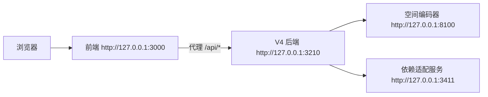
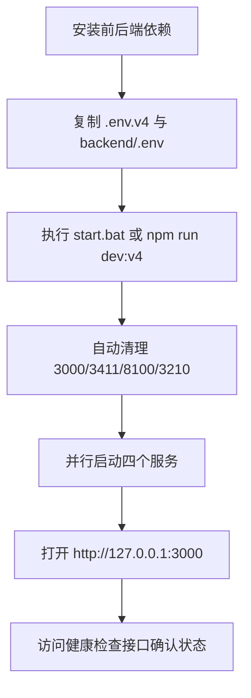

本页只回答一个初学者最关心的问题：**拿到 GeoLoom Agent 仓库后，如何在本机完成依赖安装、环境准备、整栈启动与基本验证**。从实现上看，这个仓库已经把前端、后端、真实依赖适配服务、空间编码器启动器，以及健康检查脚本编排成一条统一入口，因此初学者不需要先理解全部内部架构，也能按步骤跑通最小可用开发环境。若你想先了解系统全貌，再回到本页实践，可先阅读[项目概述：GeoLoom Agent 地理智能代理系统](1-xiang-mu-gai-shu-geoloom-agent-di-li-zhi-neng-dai-li-xi-tong)，启动成功后再进入[架构概览：前端、后端与 AI 引擎协同](3-jia-gou-gai-lan-qian-duan-hou-duan-yu-ai-yin-qing-xie-tong)。Sources: [README.md](README.md#L41-L123), [package.json](package.json#L6-L45)

## 你现在所在的位置与阅读路径

你当前位于 Get Started 部分的第二页，主题是**环境配置与启动**，它位于“项目概述”之后、“架构概览”之前。最合理的阅读顺序是：先通过[项目概述：GeoLoom Agent 地理智能代理系统](1-xiang-mu-gai-shu-geoloom-agent-di-li-zhi-neng-dai-li-xi-tong)建立目标认知；再使用本页完成本地启动；随后继续阅读[架构概览：前端、后端与 AI 引擎协同](3-jia-gou-gai-lan-qian-duan-hou-duan-yu-ai-yin-qing-xie-tong)、[工具链与脚本：开发、构建与部署自动化](11-gong-ju-lian-yu-jiao-ben-kai-fa-gou-jian-yu-bu-shu-zi-dong-hua)与[配置文件详解：环境、LLM 与空间参数](12-pei-zhi-wen-jian-xiang-jie-huan-jing-llm-yu-kong-jian-can-shu)，这样可以把“先跑起来”与“为什么这样设计”连成闭环。Sources: [README.md](README.md#L41-L123)

## 先从第一原则理解：启动的本质是什么

从脚本定义可以验证，这个项目的“快速开始”不是单独启动一个 Web 页，而是**并行拉起四个协作服务**：前端 Vite 开发服务器、后端真实依赖适配服务、空间编码器服务，以及 V4 后端主服务。根目录的 `dev:v4` 脚本使用 `concurrently` 同时启动这四项；而 `start.bat` 在 Windows 下只是对这条命令做了一层更易用的包装，并在启动前打印四个固定访问地址。对初学者而言，这意味着**主入口只有一条命令**，不需要逐个进入子目录手工启动。Sources: [package.json](package.json#L6-L45), [start.bat](start.bat#L1-L13)

```mermaid
flowchart TD
    A[开发者执行 start.bat 或 npm run dev:v4] --> B[清理端口占用]
    B --> C[启动前端 Vite :3000]
    B --> D[启动依赖适配服务 :3411]
    B --> E[启动空间编码器 :8100]
    B --> F[启动 V4 后端 :3210]
    C --> G[浏览器访问前端]
    G --> H[/api/geo 等请求走 Vite 代理]
    H --> F
    F --> D
    F --> E
```
Sources: [package.json](package.json#L11-L23), [vite.config.js](vite.config.js#L70-L106), [scripts/run-backend-v4.mjs](scripts/run-backend-v4.mjs#L13-L29)

## 启动后的服务关系图

在开发模式下，前端固定监听 `127.0.0.1:3000`，并把 `/api/geo`、`/api/ai`、`/api/category`、`/api/spatial`、`/api/search` 等请求代理到后端；后端默认监听 `127.0.0.1:3210`；依赖适配服务监听 `127.0.0.1:3411`；编码器服务监听 `127.0.0.1:8100`。因此，初学者通常只需要打开前端地址，但真正的数据处理会沿着“前端 → 后端 → 编码器/依赖服务”的链路继续流动。Sources: [vite.config.js](vite.config.js#L12-L19), [vite.config.js](vite.config.js#L70-L106), [scripts/run-backend-v4.mjs](scripts/run-backend-v4.mjs#L14-L29), [start.bat](start.bat#L5-L11)


Sources: [vite.config.js](vite.config.js#L70-L106), [scripts/run-backend-v4.mjs](scripts/run-backend-v4.mjs#L16-L29)

## 项目结构中与你启动最相关的部分

对于“快速开始”场景，没有必要一次读完整个仓库。真正与环境配置和启动直接相关的，是根目录脚本、前端配置、后端环境文件与后端启动入口。下面这张结构图保留了最小启动视角，适合初学者先建立操作地图。Sources: [README.md](README.md#L26-L39), [package.json](package.json#L6-L45), [backend/package.json](backend/package.json#L6-L17)

```text
geoloom-agent/
├─ package.json                # 根脚本：整栈 dev/start/build/test
├─ start.bat                   # Windows 一键启动入口
├─ .env.v4.example             # 前端/根模式示例环境
├─ scripts/
│  ├─ cleanup-ports.mjs        # 启动前清理端口
│  ├─ run-backend-v4.mjs       # 后端包装启动器
│  ├─ run-encoder-service.mjs  # 编码器启动器（失败时可切 fallback）
│  └─ smoke-stack.mjs          # 整栈健康检查
├─ src/                        # 前端源码
├─ vite.config.js              # 前端端口与代理配置
└─ backend/
   ├─ package.json             # 后端 dev/build/test/start 脚本
   ├─ .env.example             # 后端示例环境
   └─ src/
      ├─ server.ts             # 后端主入口
      └─ app.ts                # 路由注册
```
Sources: [README.md](README.md#L26-L39), [vite.config.js](vite.config.js#L70-L106), [backend/src/server.ts](backend/src/server.ts#L39-L40)

## 环境要求

从根 `package.json` 和 `backend/package.json` 可以直接验证，前后端都要求 **Node.js >= 18.0.0**。此外，编码器启动脚本会优先调用 `python` 命令去运行 `..\vector-encoder\run.py serve --port 8100`，这说明若你希望使用“真实编码器”，本机还需要能直接执行 Python；如果真实编码器无法启动，脚本会自动切换到 fallback 编码器服务，因此 Python 缺失不会必然阻断整个项目启动，但会影响其实际编码器来源。Sources: [package.json](package.json#L86-L88), [backend/package.json](backend/package.json#L34-L36), [scripts/run-encoder-service.mjs](scripts/run-encoder-service.mjs#L9-L12), [scripts/run-encoder-service.mjs](scripts/run-encoder-service.mjs#L27-L50), [scripts/run-encoder-service.mjs](scripts/run-encoder-service.mjs#L55-L117)

| 组件 | 最低要求/默认行为 | 是否快速开始必须理解 |
|---|---|---|
| Node.js | `>=18.0.0` | 是 |
| npm | 用于安装前后端依赖与运行脚本 | 是 |
| Python | 编码器真实进程默认通过 `python` 启动 | 建议 |
| Windows 批处理 | 可直接用 `start.bat` 一键启动 | 对 Windows 用户建议 |
| vector-encoder | 若真实服务可用则优先使用，否则退回 fallback | 否，先会用即可 |

Sources: [package.json](package.json#L6-L45), [package.json](package.json#L86-L88), [backend/package.json](backend/package.json#L6-L17), [scripts/run-encoder-service.mjs](scripts/run-encoder-service.mjs#L9-L12), [scripts/run-encoder-service.mjs](scripts/run-encoder-service.mjs#L27-L50)

## 第一步：安装依赖

README 明确给出了最小安装命令：先安装根目录依赖，再安装后端依赖。这与脚本设计一致，因为前端脚本定义在根 `package.json` 中，而后端运行、构建与测试定义在 `backend/package.json` 中，二者是分开安装的。Sources: [README.md](README.md#L74-L103), [package.json](package.json#L6-L45), [backend/package.json](backend/package.json#L6-L17)

```bash
npm install
npm --prefix backend install
```
Sources: [README.md](README.md#L76-L81)

## 第二步：准备环境文件

README 说明：在当前这台机器上，`.env.v4` 与 `backend/.env` 已经准备好；如果你在另一台新机器上重新克隆仓库，则需要分别从示例文件复制。示例文件内容也能验证其职责分工：根目录 `.env.v4.example` 主要定义前端开发模式下的 API 基地址与 Jina 配置；`backend/.env.example` 主要定义后端监听地址、Postgres、LLM、空间依赖、Redis 等运行参数。对于初学者，最重要的是先复制文件、再按实际环境填值，而不是一开始就修改代码。Sources: [README.md](README.md#L83-L103), [.env.v4.example](.env.v4.example#L1-L11), [backend/.env.example](backend/.env.example#L1-L49)

```bash
copy .env.v4.example .env.v4
copy backend\.env.example backend\.env
```
Sources: [README.md](README.md#L96-L101)

| 文件 | 作用 | 关键内容 |
|---|---|---|
| `.env.v4` | 前端/根开发模式配置 | `VITE_BACKEND_VERSION`、`VITE_DEV_API_BASE` |
| `backend/.env` | 后端运行配置 | `PORT`、`POSTGRES_*`、`LLM_*`、`SPATIAL_*`、`ROUTING_*` |
| `start.bat` | Windows 启动入口 | 调用 `npm run dev:v4` |
| `scripts/run-backend-v4.mjs` | 后端启动时注入默认依赖地址 | 自动补全 `3210/3411/8100` |

Sources: [.env.v4.example](.env.v4.example#L1-L11), [backend/.env.example](backend/.env.example#L1-L49), [start.bat](start.bat#L1-L13), [scripts/run-backend-v4.mjs](scripts/run-backend-v4.mjs#L13-L29)

## 第三步：理解“默认就能工作”的开发地址

根环境文件把前端 API 基地址默认指向 `http://127.0.0.1:3210`，而前端运行时还有一层优化：当检测到开发环境中 AI 与空间 API 都指向同一个本地地址，且没有显式启用 `VITE_DIRECT_DEV_API` 时，会优先退化为**空字符串同源代理**，也就是让浏览器请求直接走当前前端域名下的 `/api/...`，再由 Vite 代理到后端。这种设计减少了初学者遇到跨域与直连配置的复杂度。Sources: [.env.v4.example](.env.v4.example#L1-L4), [src/config.ts](src/config.ts#L24-L58), [vite.config.js](vite.config.js#L70-L99)

| 配置项 | 默认值 | 含义 |
|---|---|---|
| `VITE_BACKEND_VERSION` | `v4` | 前端按 V4 后端模式运行 |
| `VITE_DEV_API_BASE` | `http://127.0.0.1:3210` | 开发模式后端地址 |
| `VITE_AI_DEV_API_BASE` | `http://127.0.0.1:3210` | AI 接口开发地址 |
| `VITE_SPATIAL_DEV_API_BASE` | `http://127.0.0.1:3210` | 空间接口开发地址 |
| `VITE_DIRECT_DEV_API` | 默认未开启 | 未开启时更倾向使用同源代理 |

Sources: [.env.v4.example](.env.v4.example#L1-L4), [src/config.ts](src/config.ts#L24-L58)

## 第四步：一键启动整栈

Windows 用户可直接运行 `start.bat`；若你习惯命令行，也可以在仓库根目录执行 `npm run dev:v4`。两种方式本质相同：都会先清理目标端口，再并行启动四个服务。这里“先清理端口”不是文档口号，而是由 `predev:v4` 和相关 `predev:*` 脚本显式执行 `scripts/cleanup-ports.mjs` 完成的。该脚本会检查端口监听情况，并在 Windows 上通过 `taskkill` 杀掉占用进程，以保证 `3000`、`3411`、`8100`、`3210` 能成功绑定。Sources: [start.bat](start.bat#L1-L13), [package.json](package.json#L7-L23), [scripts/cleanup-ports.mjs](scripts/cleanup-ports.mjs#L4-L16), [scripts/cleanup-ports.mjs](scripts/cleanup-ports.mjs#L73-L127)

```bat
start.bat
```
Sources: [README.md](README.md#L41-L47), [start.bat](start.bat#L1-L13)

```bash
npm run dev:v4
```
Sources: [README.md](README.md#L49-L53), [package.json](package.json#L11-L23)


Sources: [README.md](README.md#L74-L103), [package.json](package.json#L7-L23), [scripts/cleanup-ports.mjs](scripts/cleanup-ports.mjs#L93-L127)

## 启动时每个服务分别做什么

根脚本中的四个子命令分工非常明确。`dev:frontend:v4` 启动 Vite 前端；`dev:deps` 进入 `backend` 子项目并启动 `src/dev/realDependencyService.ts`；`dev:encoder-service` 通过包装器启动真实编码器或 fallback 编码器；`dev:backend` 则通过包装器先编译后端 TypeScript，再运行 `dist/src/server.js`，同时注入编码器、向量与路由依赖的默认地址。对初学者而言，理解这个映射有助于判断“哪一块失败了”。Sources: [package.json](package.json#L15-L23), [backend/package.json](backend/package.json#L6-L12), [scripts/run-backend-v4.mjs](scripts/run-backend-v4.mjs#L31-L55), [scripts/run-encoder-service.mjs](scripts/run-encoder-service.mjs#L27-L50)

| 启动命令 | 实际作用 | 默认端口 |
|---|---|---|
| `npm run dev:frontend:v4` | 启动前端开发服务器 | `3000` |
| `npm run dev:deps` | 启动真实依赖适配服务 | `3411` |
| `npm run dev:encoder-service` | 启动编码器，失败时切换 fallback | `8100` |
| `npm run dev:backend` | 编译并运行后端主服务 | `3210` |

Sources: [package.json](package.json#L15-L23), [backend/package.json](backend/package.json#L6-L12), [scripts/run-backend-v4.mjs](scripts/run-backend-v4.mjs#L31-L55), [scripts/run-encoder-service.mjs](scripts/run-encoder-service.mjs#L55-L117)

## 第五步：在浏览器中访问前端

开发模式下，前端固定监听 `http://127.0.0.1:3000`，预览模式则是 `http://127.0.0.1:4173`。本页聚焦快速开始，因此你只需在开发模式中打开 `3000` 端口即可；如果后续你想了解 preview/build 的差异，再继续阅读[工具链与脚本：开发、构建与部署自动化](11-gong-ju-lian-yu-jiao-ben-kai-fa-gou-jian-yu-bu-shu-zi-dong-hua)。Sources: [start.bat](start.bat#L7-L10), [vite.config.js](vite.config.js#L70-L105), [package.json](package.json#L33-L45)

```text
开发前端地址：http://127.0.0.1:3000
后端地址：http://127.0.0.1:3210
依赖服务地址：http://127.0.0.1:3411
编码器地址：http://127.0.0.1:8100
```
Sources: [README.md](README.md#L55-L60), [start.bat](start.bat#L7-L10)

## 第六步：先做最小健康检查

README 给出的首个验证接口是 `GET /api/geo/health`。从后端应用注册逻辑可以看到，Geo 相关路由统一挂载在 `/api/geo` 前缀下，因此这个健康接口确实属于系统主入口的一部分，而不是临时调试路径。初学者完成整栈启动后，第一件事不是立刻测试复杂问答，而是先确认后端健康是否可访问。Sources: [README.md](README.md#L125-L148), [backend/src/app.ts](backend/src/app.ts#L55-L64)

```bash
curl http://127.0.0.1:3210/api/geo/health
```
Sources: [README.md](README.md#L127-L131)

## 你应该重点看哪些健康字段

README 明确列出了几个关键字段：`provider_ready`、`services.database`、`dependencies.spatial_encoder.mode`、`dependencies.spatial_vector.mode`、`dependencies.route_distance.mode`、`degraded_dependencies`。这些字段之所以重要，是因为 `smoke-stack.mjs` 也会强制检查 `spatial_encoder`、`spatial_vector`、`route_distance` 三项依赖模式必须为 `remote`，否则直接失败。也就是说，这些字段不是“可看可不看”的附加信息，而是项目用来判定整栈是否真正接通的核心证据。Sources: [README.md](README.md#L125-L148), [scripts/smoke-stack.mjs](scripts/smoke-stack.mjs#L57-L80), [scripts/smoke-stack.mjs](scripts/smoke-stack.mjs#L126-L129)

| 字段 | 期望现象 | 说明 |
|---|---|---|
| `provider_ready` | `true` | 后端整体提供者就绪 |
| `services.database` | 可用 | 数据库链路正常 |
| `dependencies.spatial_encoder.mode` | `remote` | 编码器依赖已接上 |
| `dependencies.spatial_vector.mode` | `remote` | 向量检索依赖已接上 |
| `dependencies.route_distance.mode` | `remote` | 路由距离依赖已接上 |
| `degraded_dependencies` | 尽量为空或可解释 | 表示降级中的依赖 |

Sources: [README.md](README.md#L133-L140), [scripts/smoke-stack.mjs](scripts/smoke-stack.mjs#L126-L129)

## 第七步：验证依赖服务与编码器本身

除了后端总健康，README 还要求分别检查编码器与依赖适配服务。`smoke-stack.mjs` 的实现进一步说明了这些检查的严格条件：编码器健康接口必须返回 `encoder_loaded === true`；向量和路由健康接口必须返回 `status === 'ok'`。因此，如果总健康失败，下一步就应直接对这三个地址逐一确认。Sources: [README.md](README.md#L142-L148), [scripts/smoke-stack.mjs](scripts/smoke-stack.mjs#L68-L80)

```bash
curl http://127.0.0.1:8100/health
curl http://127.0.0.1:3411/health/vector
curl http://127.0.0.1:3411/health/routing
```
Sources: [README.md](README.md#L144-L147)

## 第八步：用 smoke 脚本做整栈验证

当你完成基本健康检查后，最稳妥的下一步不是手工点界面，而是执行仓库内置的整栈烟雾测试。根脚本提供了 `smoke` 与 `smoke:dev` 两种入口，其中 `smoke:dev` 明确把前端地址设为 `http://127.0.0.1:3000`。该脚本不仅检查前端首页、总健康、编码器、向量和路由健康，还会真实发送语义 POI 查询、相似区域查询、路由计算，以及 `/api/geo/chat` 的 SSE 请求，并验证事件序列包含 `refined_result` 与结尾 `done`。这对初学者很有价值，因为它把“页面能打开”和“后端完整链路能工作”区分开了。Sources: [package.json](package.json#L43-L44), [scripts/smoke-stack.mjs](scripts/smoke-stack.mjs#L57-L183)

```bash
npm run smoke:dev
```
Sources: [README.md](README.md#L152-L159), [package.json](package.json#L43-L44)

## 启动命令与验证命令对照

为了避免“我现在该执行哪条命令”的混乱，下面用对照表整理快速开始阶段最常用的命令。Sources: [README.md](README.md#L41-L159), [package.json](package.json#L6-L45), [backend/package.json](backend/package.json#L6-L17)

| 目的 | 命令 | 说明 |
|---|---|---|
| 安装根依赖 | `npm install` | 安装前端与根脚本依赖 |
| 安装后端依赖 | `npm --prefix backend install` | 安装后端依赖 |
| Windows 一键启动 | `start.bat` | 适合初学者 |
| 命令行整栈启动 | `npm run dev:v4` | 启动四个服务 |
| 运行全部测试 | `npm run test` | 前后端测试一起跑 |
| 构建项目 | `npm run build` | 前端构建 + 后端构建 |
| 开发环境烟雾测试 | `npm run smoke:dev` | 检查整栈链路 |

Sources: [README.md](README.md#L41-L159), [package.json](package.json#L6-L45), [backend/package.json](backend/package.json#L6-L17)

## 启动前后：你会看到什么变化

从操作体验角度，快速开始最明显的“前后变化”是：启动前你只有源码和脚本；启动后你同时拥有一个前端入口和三类后端支撑服务。用表格表达这一点，能帮助初学者建立更稳定的执行反馈预期。Sources: [start.bat](start.bat#L5-L11), [package.json](package.json#L11-L23), [README.md](README.md#L55-L60)

| 阶段 | 状态 |
|---|---|
| 启动前 | 本机没有 `3000/3411/8100/3210` 上的项目服务 |
| 执行 `npm run dev:v4` 后 | 自动清理旧端口占用 |
| 启动中 | 四个服务并行输出日志 |
| 启动完成后 | 可打开 `http://127.0.0.1:3000`，并访问健康检查接口 |

Sources: [package.json](package.json#L11-L23), [scripts/cleanup-ports.mjs](scripts/cleanup-ports.mjs#L93-L127), [start.bat](start.bat#L5-L11)

## 常见问题排查

快速开始阶段最常见的问题都能从现有脚本中找到证据链。第一类是**端口被占用**，这通常会在 `cleanup-ports.mjs` 中被提前发现；第二类是**编码器真实进程无法启动**，这时 `run-encoder-service.mjs` 会记录“switching to fallback”；第三类是**后端健康接口能通，但依赖模式不是 remote**，这种情况下 smoke 脚本会直接失败；第四类是**前端能打开但 API 不工作**，这时需要优先检查 Vite 代理目标与后端地址是否仍为 `3210`。Sources: [scripts/cleanup-ports.mjs](scripts/cleanup-ports.mjs#L93-L127), [scripts/run-encoder-service.mjs](scripts/run-encoder-service.mjs#L27-L50), [scripts/run-encoder-service.mjs](scripts/run-encoder-service.mjs#L80-L103), [scripts/smoke-stack.mjs](scripts/smoke-stack.mjs#L57-L80), [vite.config.js](vite.config.js#L70-L99)

| 现象 | 优先检查项 | 依据 |
|---|---|---|
| 启动时报端口冲突 | 是否有旧进程占用 `3000/3411/8100/3210` | `cleanup-ports.mjs` 会清理这些端口 |
| 编码器日志异常 | 是否切到了 fallback，是否缺 Python/模块 | `run-encoder-service.mjs` 有自动降级逻辑 |
| `/api/geo/health` 不符合预期 | 检查依赖模式是否为 `remote` | smoke 脚本强制校验 |
| 前端打开但接口报错 | 检查 Vite proxy 与后端地址 | `vite.config.js` 中定义了代理规则 |

Sources: [scripts/cleanup-ports.mjs](scripts/cleanup-ports.mjs#L93-L127), [scripts/run-encoder-service.mjs](scripts/run-encoder-service.mjs#L27-L50), [scripts/run-encoder-service.mjs](scripts/run-encoder-service.mjs#L80-L103), [scripts/smoke-stack.mjs](scripts/smoke-stack.mjs#L126-L129), [vite.config.js](vite.config.js#L70-L99)

## 一个适合初学者的最短成功路径

如果你只想用最短路径把系统跑起来，请按这个顺序执行：先安装依赖；若新机器无环境文件则复制 `.env.v4` 与 `backend/.env`；然后在仓库根目录执行 `start.bat` 或 `npm run dev:v4`；待四个服务稳定后，用浏览器打开 `http://127.0.0.1:3000`；最后执行 `npm run smoke:dev` 验证整栈链路。这条路径完全基于仓库现有脚本设计，不要求你先理解内部技能模块、路由设计或算法细节。若你已经成功完成这一步，下一页建议阅读[架构概览：前端、后端与 AI 引擎协同](3-jia-gou-gai-lan-qian-duan-hou-duan-yu-ai-yin-qing-xie-tong)；若你想深入理解命令与脚本本身，则继续阅读[工具链与脚本：开发、构建与部署自动化](11-gong-ju-lian-yu-jiao-ben-kai-fa-gou-jian-yu-bu-shu-zi-dong-hua)和[配置文件详解：环境、LLM 与空间参数](12-pei-zhi-wen-jian-xiang-jie-huan-jing-llm-yu-kong-jian-can-shu)。Sources: [README.md](README.md#L74-L159), [package.json](package.json#L11-L23), [package.json](package.json#L43-L44), [start.bat](start.bat#L1-L13)