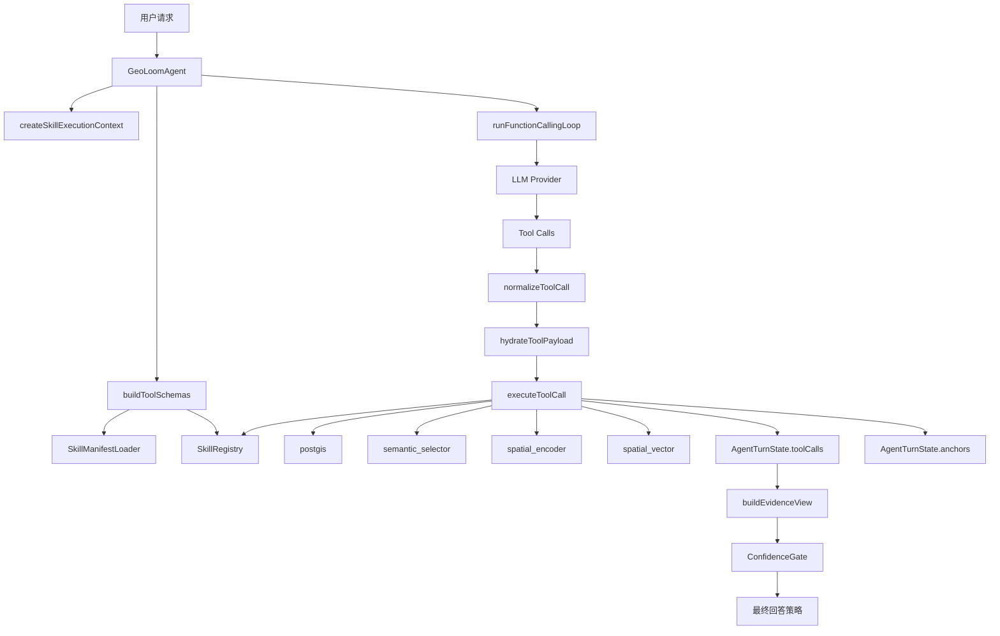
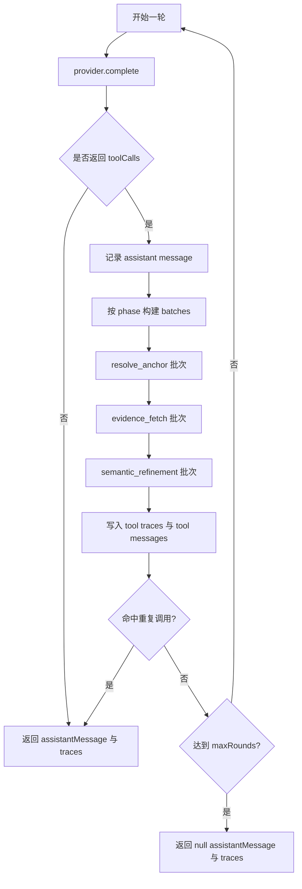

本页聚焦 **GeoLoom Agent 后端中的智能体编排层**：它如何把用户问题转成可执行的工具调用、如何在多轮函数调用循环中组织技能、如何把工具结果沉淀为可追踪的执行轨迹，并在最终回答前通过置信门控决定是放行、降级还是要求澄清。它不展开介绍具体技能内部实现、API 路由细节或前端消费方式，而只讨论编排与执行这一层的系统机制。Sources: [GeoLoomAgent.ts](backend/src/agent/GeoLoomAgent.ts#L3002-L3108), [FunctionCallingLoop.ts](backend/src/llm/FunctionCallingLoop.ts#L105-L172), [ConfidenceGate.ts](backend/src/agent/ConfidenceGate.ts#L3-L39)

从第一性原理看，这个编排层要解决四个问题：**谁能被调用**、**何时调用什么**、**如何安全执行**、**什么时候可以把结果当答案输出**。在 GeoLoom Agent 中，这四件事分别由 `SkillRegistry`、技能清单与工具 schema、函数调用循环与 payload 归一化、以及 `ConfidenceGate` 协同完成；因此“智能体”并不是自由调用任意代码，而是在一个受限且可审计的技能执行平面上工作。Sources: [SkillRegistry.ts](backend/src/skills/SkillRegistry.ts#L4-L35), [toolSchemaBuilder.ts](backend/src/llm/toolSchemaBuilder.ts#L26-L66), [SkillManifestLoader.ts](backend/src/skills/SkillManifestLoader.ts#L26-L96), [ConfidenceGate.ts](backend/src/agent/ConfidenceGate.ts#L3-L39)

## 编排层的核心对象模型

编排的最小执行单元不是“提示词”，而是 **SkillDefinition + action + payload + context**。每个技能定义了名称、能力、动作集合以及统一的 `execute` 接口；执行上下文则携带 `traceId`、`requestId`、`sessionId` 与结构化 logger，这意味着每次调度都天然具备链路追踪元数据。这个设计把“技能能力描述”与“本次执行语境”明确分离，使编排器可以在不依赖具体实现细节的前提下调度任意符合契约的技能。Sources: [types.ts](backend/src/skills/types.ts#L18-L71), [SkillContext.ts](backend/src/skills/SkillContext.ts#L6-L30)

`SkillRegistry` 负责运行时注册与去重校验。它用 `Map<string, SkillDefinition>` 保存技能定义，重复注册会抛出 `duplicate_skill` 错误；而编排层通过 `get(name)` 做按名解析，通过 `list()` 暴露能力摘要。这说明编排器依赖的是 **名称稳定的技能地址空间**，而非直接引用某个模块实例。Sources: [SkillRegistry.ts](backend/src/skills/SkillRegistry.ts#L4-L35)

在会话内，编排状态被收敛到 `AgentTurnState`。这里最关键的字段有三个：`toolCalls` 保存全部工具执行轨迹，`anchors` 维护主/次锚点解析结果，`spatialConstraint` 保存空间范围约束；此外还记录 SQL 校验尝试与通过次数。换句话说，任务执行不是一次性的“调用-返回”，而是以 **状态机形式累积中间产物**，后续工具可以消费前面步骤的结果。Sources: [types.ts](backend/src/agent/types.ts#L51-L62)

下图展示了编排层中的核心关系。阅读图前需要先把 Mermaid 看成“控制面”图：方框是模块，箭头表示调用或数据注入，不表示类继承。Sources: [GeoLoomAgent.ts](backend/src/agent/GeoLoomAgent.ts#L3002-L3195), [FunctionCallingLoop.ts](backend/src/llm/FunctionCallingLoop.ts#L105-L172), [SkillRegistry.ts](backend/src/skills/SkillRegistry.ts#L4-L35)

Sources: [GeoLoomAgent.ts](backend/src/agent/GeoLoomAgent.ts#L3002-L3195), [FunctionCallingLoop.ts](backend/src/llm/FunctionCallingLoop.ts#L44-L172)

## 技能暴露机制：从清单到可调用工具

GeoLoom Agent 不直接把所有技能动作无条件暴露给 LLM，而是先读取 `backend/SKILLS/*/SKILL.md` 清单文件。`SkillManifestLoader` 会遍历技能目录，解析 front matter 中的 `name`、`runtimeSkill`、`actions`、`capabilities`，并额外抽取 `## Prompt` 段落作为 `promptSnippet`。这意味着编排层有一套 **文档驱动的工具暴露机制**：工具能做什么、推荐何时使用、允许哪些 action，均可由清单文件控制。Sources: [SkillManifestLoader.ts](backend/src/skills/SkillManifestLoader.ts#L35-L96), [SKILL.md](backend/SKILLS/PostGIS/SKILL.md#L1-L17), [SKILL.md](backend/SKILLS/SemanticSelector/SKILL.md#L1-L19)

`buildToolSchemas` 再把运行时技能定义与技能清单合并，生成 LLM 可见的 `ToolSchema`。若清单显式声明了 `actions`，则只暴露这些动作；否则才退回到技能定义中的全部动作。同时，工具描述会把清单中的 `description` 与 `promptSnippet` 拼接进 schema 描述字段中。这一点很关键：**编排策略的一部分被前移到 tool schema 构造阶段**，模型看到的不是抽象工具名，而是带使用边界的能力说明。Sources: [toolSchemaBuilder.ts](backend/src/llm/toolSchemaBuilder.ts#L5-L65), [SKILL.md](backend/SKILLS/PostGIS/SKILL.md#L11-L17)

从当前技能清单可以验证，编排层至少围绕四类关键能力工作：`postgis` 负责锚点解析与空间 SQL；`semantic_selector` 在结构化区域证据基础上做按需取证；`spatial_encoder` 负责语义编码与相似度评分；`spatial_vector` 负责向量召回与相似区域搜索。它们在清单中都被明确限定为“结构证据优先、语义证据辅助”的分工关系，这与后续调度波次分类形成闭环。Sources: [SKILL.md](backend/SKILLS/PostGIS/SKILL.md#L1-L17), [SKILL.md](backend/SKILLS/SemanticSelector/SKILL.md#L1-L19), [SKILL.md](backend/SKILLS/SpatialEncoder/SKILL.md#L1-L14), [SKILL.md](backend/SKILLS/SpatialVector/SKILL.md#L1-L14)

下表概括了编排层实际可见的关键技能角色。Sources: [SKILL.md](backend/SKILLS/PostGIS/SKILL.md#L1-L17), [SKILL.md](backend/SKILLS/SemanticSelector/SKILL.md#L1-L19), [SKILL.md](backend/SKILLS/SpatialEncoder/SKILL.md#L1-L14), [SKILL.md](backend/SKILLS/SpatialVector/SKILL.md#L1-L14)

| 技能 | 编排角色 | 主要动作 | 在调度中的位置 | 证据属性 |
|---|---|---|---|---|
| `postgis` | 空间事实主通道 | `resolve_anchor`, `validate_spatial_sql`, `execute_spatial_sql` | 先于大多数其他技能 | 硬事实/结构证据 |
| `semantic_selector` | area insight 按需取证 | `select_area_evidence` | 结构证据之后 | 精炼证据，不生成新事实 |
| `spatial_encoder` | 语义编码 | `encode_query`, `encode_region`, `score_similarity` | 语义补充阶段 | 辅助语义证据 |
| `spatial_vector` | 语义召回 | `search_semantic_pois`, `search_similar_regions` | 编码之后或并列补充 | 候选/相似性证据 |

## 调度策略：函数调用循环不是线性串行，而是分阶段波次执行

真正的调度核心在 `runFunctionCallingLoop`。这个循环每一轮先把当前消息与工具 schema 发给 provider，拿回 assistant message、tool calls 与 `finishReason`；如果模型不再请求工具，则直接返回，否则把 assistant message 追加到消息上下文中，再执行工具调用。这里体现的是标准的 **LLM 驱动控制回路**，但 GeoLoom 在此基础上增加了波次划分与去重机制。Sources: [FunctionCallingLoop.ts](backend/src/llm/FunctionCallingLoop.ts#L105-L172)

波次划分由 `classifyExecutionPhase` 与 `buildToolCallBatches` 决定。`resolve_anchor` 被单独视为一个阶段；`postgis.execute_spatial_sql` 与 `route_distance` 被归为 `evidence_fetch`；`semantic_selector.select_area_evidence`、`spatial_encoder`、`spatial_vector` 被归为 `semantic_refinement`。相同阶段的调用会被打包进同一 batch，而 batch 之间顺序执行。这说明编排器不是盲目并发所有工具，而是按 **解析锚点 → 抓取证据 → 语义精炼** 的依赖链分波执行。Sources: [FunctionCallingLoop.ts](backend/src/llm/FunctionCallingLoop.ts#L44-L103)

同一个 batch 内，如果提供了 `onToolCallBatch` 且批次长度大于 1，则走批量回调；否则就用 `Promise.all` 并发执行本批次中的多个工具。与此同时，系统用 `seenFingerprints` 记录工具调用指纹；若遇到重复调用，会标记 `hitDuplicate` 并提前停止循环。这个设计同时解决了两个常见问题：**可并发的证据抓取不必串行等待**，以及 **LLM 自旋式重复调用不会无限消耗资源**。Sources: [FunctionCallingLoop.ts](backend/src/llm/FunctionCallingLoop.ts#L65-L103), [FunctionCallingLoop.ts](backend/src/llm/FunctionCallingLoop.ts#L141-L165)

用流程图表示，这个执行回路更接近“受控多轮计划-执行循环”，而不是一次性 planner。阅读时请注意，图中的“阶段”就是代码里的 execution phase。Sources: [FunctionCallingLoop.ts](backend/src/llm/FunctionCallingLoop.ts#L44-L172)

Sources: [FunctionCallingLoop.ts](backend/src/llm/FunctionCallingLoop.ts#L105-L172)

## 工具调用执行：归一化、注水、审计、失败中止

当函数调用循环真正触发某次调用时，`GeoLoomAgent.executeToolCall` 负责落地执行。第一步是 `normalizeToolCall`：对于 `postgis.resolve_anchor`，它会把 `anchor`、`place`、`query` 等不同别名统一归并为 `place_name`，并把角色名标准化；对于 `execute_spatial_sql`，它会归一化 `categoryKey/category_key`。这说明编排层承担了 **LLM 输出纠偏层** 的职责，避免模型轻微偏离契约就导致工具不可执行。Sources: [GeoLoomAgent.ts](backend/src/agent/GeoLoomAgent.ts#L3002-L3012), [GeoLoomAgent.ts](backend/src/agent/GeoLoomAgent.ts#L3110-L3153)

这一步已有明确单元测试验证。测试表明，`resolve_anchor` 的 `anchor: '武汉大学'` 会被标准化为 `place_name: '武汉大学'` 且 `role: 'primary'`；`categoryKey: 'cafe'` 会被归一为 `categoryKey: 'coffee'` 与 `category_key: 'coffee'`。这不是推测，而是编排器已被测试固定的行为。Sources: [GeoLoomAgent.spec.ts](backend/tests/unit/agent/GeoLoomAgent.spec.ts#L68-L117)

第二步是 `hydrateToolPayload`。目前它特别处理 `semantic_selector.select_area_evidence`：如果 payload 中没有完整 `area_insight`，就从历史 `toolCalls` 中自动收集 `area_category_histogram`、`area_ring_distribution`、`area_representative_sample`、`area_competition_density`、`area_h3_hotspots`、`area_aoi_context`、`area_landuse_context` 等模板结果，并补入 `raw_query`、`semantic_focus`、`anchor_name` 与 `fallback_rows`。这说明后续技能不是孤立调用，而是由编排器基于全局执行痕迹 **自动拼装上游证据上下文**。Sources: [GeoLoomAgent.ts](backend/src/agent/GeoLoomAgent.ts#L3163-L3195), [GeoLoomAgent.ts](backend/src/agent/GeoLoomAgent.ts#L869-L898)

第三步才是真正的技能执行。`executeToolCall` 会从注册表取技能，若不存在则写入一条 `status: 'error'` 的 trace；若存在，则根据调用类型走特殊分支：已有主锚点时，某些 `postgis.resolve_anchor` 可直接返回 synthetic 结果；带模板名的 `postgis.execute_spatial_sql` 会转入模板执行路径；其他情况则调用技能自己的 `execute`。一旦抛异常，系统会记录告警日志、推入 `execution_exception` trace，并抛出 `ToolExecutionAbortError` 中止本轮。Sources: [GeoLoomAgent.ts](backend/src/agent/GeoLoomAgent.ts#L3002-L3081)

无论成功还是失败，执行结果都会被写成 `ToolExecutionTrace` 追加到 `state.toolCalls`。若本次是 `resolve_anchor` 并成功返回锚点，编排器还会把结果写回 `state.anchors[role]`。这意味着 **trace 不只是审计日志，也是后续编排的事实数据库**。Sources: [GeoLoomAgent.ts](backend/src/agent/GeoLoomAgent.ts#L3083-L3108), [types.ts](backend/src/agent/types.ts#L51-L62)

## 模板化任务执行：SQL 不是由 LLM自由生成，而是受模板约束

在空间证据获取上，编排器对 `postgis.execute_spatial_sql` 做了更强的收束：若 payload 指定 `template`，会进入 `executePostgisTemplate`，而不是直接把任意 SQL 交给技能执行。对比“开放式 SQL 生成”，这里的实际模式是 **模板驱动 + 参数注入 + 执行前校验**。Sources: [GeoLoomAgent.ts](backend/src/agent/GeoLoomAgent.ts#L3052-L3055), [GeoLoomAgent.ts](backend/src/agent/GeoLoomAgent.ts#L3197-L3374)

`executePostgisTemplate` 对不同任务形态做了分流。`compare_places` 是最典型的复合任务：若主次锚点不存在，但空间约束里已有两个 region，则遍历 region 列表，为每个区域构建锚点和局部空间约束，分别执行模板 SQL，最终合成为 `comparison_pairs`；如果有两个已解析锚点，则直接对两侧分别查询并返回成对结果；若两者都不满足，则返回 `missing_anchor` 错误。这个分支说明编排层具备 **任务级拆分与聚合** 能力，而不是单次工具调用转发器。Sources: [GeoLoomAgent.ts](backend/src/agent/GeoLoomAgent.ts#L3204-L3331)

对普通模板，编排器要求存在主锚点坐标，否则拒绝执行；满足条件后，会调用 `executeTemplateSQL` 构造 SQL、执行 `validate_spatial_sql`、统计校验次数，再执行真实 SQL。只有验证通过才会继续数据库执行，否则直接返回空结果。这一层把“空间查询任务”从原始数据库操作提升为 **受监管的编排动作**。Sources: [GeoLoomAgent.ts](backend/src/agent/GeoLoomAgent.ts#L3333-L3397)

模板 SQL 还会根据 viewport 尺度切换生成策略。测试 `GeoLoomAgentViewportSql.spec.ts` 明确验证：当 map view 很大时，`area_representative_sample` 会切到 tile-aware 的 viewport synthesis SQL，且包含 `tile_x`、`tile_y`、`anchor_priority` 并调整 `LIMIT`。这表明任务执行不仅由 queryType 决定，还受到空间视口尺度影响。Sources: [GeoLoomAgentViewportSql.spec.ts](backend/tests/unit/agent/GeoLoomAgentViewportSql.spec.ts#L5-L56)

下表总结了编排器对几类任务的执行模式。Sources: [GeoLoomAgent.ts](backend/src/agent/GeoLoomAgent.ts#L1502-L1529), [GeoLoomAgent.ts](backend/src/agent/GeoLoomAgent.ts#L3197-L3397)

| 任务类型 | 默认 tool intent | 核心执行模式 | 对锚点的要求 |
|---|---|---|---|
| `nearby_poi` | `candidate_lookup` / `candidate_reputation` | 先解析锚点，再模板查周边候选 | 需要主锚点 |
| `nearest_station` | `nearest_transit` | 先解析锚点，再做最近站点查询 | 需要主锚点 |
| `area_overview` | `area_insight` | 批量抓取结构模板，再可选语义精炼 | 通常需要主锚点或 viewport |
| `compare_places` | `place_comparison` | 双锚点或双 region 拆分执行，再聚合成 pair | 需要两个比较对象 |
| `similar_regions` | `similar_region_search` | 区域编码/向量召回类查询 | 可不依赖传统锚点坐标 |

## 任务状态如何反哺后续调度

编排层不是“先执行完再统一解释”，而是在执行过程中不断把结果写回状态，从而影响后续决策。最显式的例子是锚点：`resolve_anchor` 成功后会更新 `state.anchors`，之后模板 SQL 执行、证据视图构建和回答渲染都依赖这个结果；若 map view 自身有坐标，而 `resolve_anchor` 返回了无坐标锚点，系统还会把主锚点回退到 viewport center。Sources: [GeoLoomAgent.ts](backend/src/agent/GeoLoomAgent.ts#L2162-L2175), [GeoLoomAgent.ts](backend/src/agent/GeoLoomAgent.ts#L3083-L3089)

另一个例子是 area insight 取证链。系统会从全部 `toolCalls` 中回收按模板命名的 PostGIS 结果，再查找最近一次 `semantic_selector.select_area_evidence` 的输出，随后用于 `buildEvidenceView` 以及区域语义增强。换句话说，**工具调用顺序本身就是语义装配顺序**：先有结构模板，后有选择结果，再有编码与展示。Sources: [GeoLoomAgent.ts](backend/src/agent/GeoLoomAgent.ts#L869-L898), [GeoLoomAgent.ts](backend/src/agent/GeoLoomAgent.ts#L2177-L2195)

测试也覆盖了这一点：在 `buildEvidenceView` 的测试中，若 `toolCalls` 中已经存在 histogram、representative sample 与 `semantic_selector` 的成功结果，编排器会优先采用语义选择后的 area evidence，而不是机械使用全部原始样本。这说明调度与证据视图构建并非松耦合，而是 **trace-driven assembly**。Sources: [GeoLoomAgent.spec.ts](backend/tests/unit/agent/GeoLoomAgent.spec.ts#L119-L200)

## 结果门控：不是所有执行成功都能直接变成答案

智能体编排的最后一道关卡是 `ConfidenceGate`。它只看三个输入：锚点是否解析、证据数量是否大于零、证据是否冲突。若锚点未解析，返回 `clarify/unresolved_anchor`；若有冲突，返回 `clarify/conflicting_evidence`；若没有证据，返回 `degraded/insufficient_evidence`；仅当这三项都满足时，才返回 `allow/ok`。这个机制非常朴素，但它把“生成回答”的前提从模型自信感收束为可验证条件。Sources: [ConfidenceGate.ts](backend/src/agent/ConfidenceGate.ts#L3-L39)

这些门控规则有对应单元测试固定：未解析锚点必须要求澄清；证据为空时必须降级；证据冲突时必须阻断高置信回答。对于编排架构而言，这一点比答案模板更重要，因为它定义了 **任务执行完成 ≠ 回答可放行**。Sources: [ConfidenceGate.spec.ts](backend/tests/unit/agent/ConfidenceGate.spec.ts#L5-L40)

在主流程中，系统先根据 `buildEvidenceView` 统计 `evidenceCount`，再调用 `confidenceGate.evaluate` 决定后续回答策略。若允许且合成回答接地，就优先使用 `llm_synthesized`；否则可回退到 `llm_direct`、`insufficient_evidence` 或 `deterministic_renderer`。因此编排层最终输出的并不是单一“模型答案”，而是 **基于证据质量切换的回答源策略**。Sources: [GeoLoomAgent.ts](backend/src/agent/GeoLoomAgent.ts#L2196-L2286)

## 编排设计的可验证模式总结

综合代码可验证出，这套智能体编排并不是一个完全自治的 agent planner，而是一个 **强约束、分阶段、状态累积、证据门控** 的执行系统。其本质模式可以概括为：清单决定工具暴露边界，函数调用循环决定调度波次，编排器本身负责输入归一化与上下文注水，技能执行结果全部沉淀为 trace，最后再由置信门控决定是否放行结论。Sources: [SkillManifestLoader.ts](backend/src/skills/SkillManifestLoader.ts#L35-L96), [toolSchemaBuilder.ts](backend/src/llm/toolSchemaBuilder.ts#L26-L66), [FunctionCallingLoop.ts](backend/src/llm/FunctionCallingLoop.ts#L44-L172), [GeoLoomAgent.ts](backend/src/agent/GeoLoomAgent.ts#L3002-L3195), [ConfidenceGate.ts](backend/src/agent/ConfidenceGate.ts#L3-L39)

如果你想继续沿着依赖关系深入，下一步最自然的阅读路径是查看 [核心技能模块：PostGIS、空间编码与语义选择](4-he-xin-ji-neng-mo-kuai-postgis-kong-jian-bian-ma-yu-yu-yi-xuan-ze) 理解被调度对象本身，或进入 [请求生命周期管理：从用户输入到流式响应](7-qing-qiu-sheng-ming-zhou-qi-guan-li-cong-yong-hu-shu-ru-dao-liu-shi-xiang-ying) 观察这个编排器如何嵌入整条请求链路；若你更关心模型与工具的接口边界，则应继续阅读 [LLM 集成：意图识别与推理引擎](5-llm-ji-cheng-yi-tu-shi-bie-yu-tui-li-yin-qing)。Sources: [SurfaceChatRuntime.ts](backend/src/chat/SurfaceChatRuntime.ts#L12-L39), [FunctionCallingLoop.ts](backend/src/llm/FunctionCallingLoop.ts#L105-L172), [toolSchemaBuilder.ts](backend/src/llm/toolSchemaBuilder.ts#L26-L66)