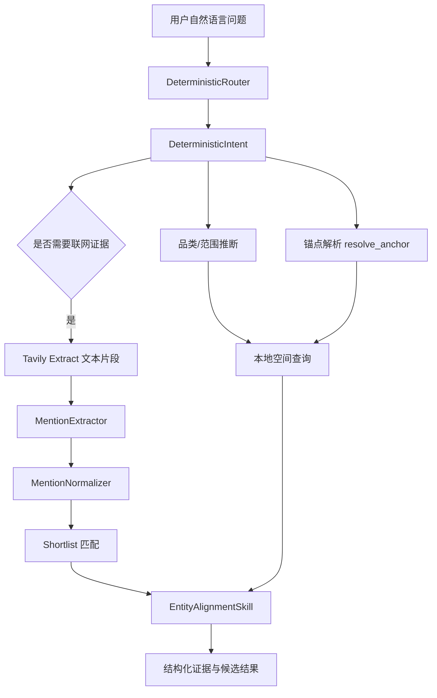
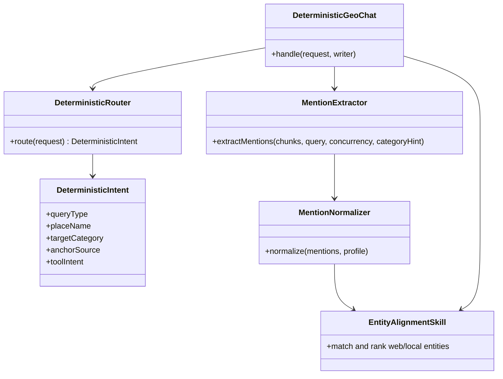

本页聚焦 GeoLoom Agent 中与**自然语言地理理解**直接相关的后端与近端前端能力：它并不是一个独立的“通用 NLP 微服务”，而是由**确定性意图路由、地点锚点解析、联网 POI mention 提取、mention 归一化、实体对齐**共同组成的地理语言理解链路。其目标不是抽象地识别任何实体，而是将用户问题中的**地点、区域、品类与候选 POI 名称**转化为后续检索与证据拼装可消费的结构化输入。Sources: [types.ts](backend/src/chat/types.ts#L29-L81), [DeterministicRouter.ts](backend/src/chat/DeterministicRouter.ts#L1-L38), [types.ts](backend/src/skills/web_poi_discovery/types.ts#L1-L20)

从架构位置上看，当前页面位于“后端服务与 API 设计”中的 [NLP 服务：命名实体识别与地理解析](21-nlp-fu-wu-ming-ming-shi-ti-shi-bie-yu-di-li-jie-xi)。它与 [LLM 集成：意图识别与推理引擎](5-llm-ji-cheng-yi-tu-shi-bie-yu-tui-li-yin-qing)、[智能体编排：技能调度与任务执行](20-zhi-neng-ti-bian-pai-ji-neng-diao-du-yu-ren-wu-zhi-xing)、[API 路由设计：RESTful 与 SSE 流式传输](22-api-lu-you-she-ji-restful-yu-sse-liu-shi-chuan-shu) 紧密相连，但本页只讨论“语言到地理结构”的解析本身，不展开路由协议、完整编排策略或渲染输出。Sources: [types.ts](backend/src/chat/types.ts#L54-L81), [DeterministicGeoChat.ts](backend/src/chat/DeterministicGeoChat.ts#L70-L107), [geo.ts](backend/src/routes/geo.ts#L5-L62)

## 核心结论：这里的“NLP”是地理任务定向解析，而非通用文本理解

系统当前采用两条可验证的解析思路。第一条是**确定性规则链**：通过 `DeterministicRouter` 从问句中推断 `queryType`、`placeName`、`targetCategory`、`anchorSource`、`toolIntent` 等字段，形成 `DeterministicIntent`。这条链服务于“附近有什么”“最近地铁站”“区域概览”“地点比较”等高频地理问句，并把自然语言压缩为结构化任务定义。Sources: [types.ts](backend/src/chat/types.ts#L54-L81), [DeterministicGeoChat.ts](backend/src/chat/DeterministicGeoChat.ts#L96-L107), [DeterministicRouter.ts](backend/src/chat/DeterministicRouter.ts#L106-L184)

第二条是**联网语义发现链**：当需要从网页中发现真实 POI 时，系统不再依赖传统 NER + 正则，而是将网页片段送入 `MentionExtractor`，由 LLM 输出结构化 mention JSON，然后通过 `MentionNormalizer` 做聚合去噪，再进入 shortlist 匹配与实体对齐。代码注释明确写明这条链“替代 NER + 正则方案”，说明仓库中“命名实体识别”在实现层面更接近**LLM 驱动的领域实体抽取**。Sources: [mentionExtractor.ts](backend/src/skills/web_poi_discovery/mentionExtractor.ts#L1-L17), [types.ts](backend/src/skills/web_poi_discovery/types.ts#L41-L61), [mentionNormalizer.ts](backend/src/skills/web_poi_discovery/mentionNormalizer.ts#L1-L8)

## 概念关系图

在阅读下图前，需要先把三个概念区分清楚：**意图解析**回答“用户想做什么”；**锚点解析**回答“围绕哪个地点/区域”；**实体识别与对齐**回答“网页或候选结果里提到的名字是否对应本地 POI”。这三者串联后，系统才能把自然语言转化为稳定的空间查询输入。Sources: [types.ts](backend/src/chat/types.ts#L54-L81), [EntityAlignmentSkill.ts](backend/src/skills/entity_alignment/EntityAlignmentSkill.ts#L1-L6)

Sources: [DeterministicGeoChat.ts](backend/src/chat/DeterministicGeoChat.ts#L143-L200), [NLContractCompiler.ts](backend/src/contract/NLContractCompiler.ts#L61-L85), [types.ts](backend/src/skills/web_poi_discovery/types.ts#L153-L175)

## 一、确定性意图解析：从问句中抽取地理任务骨架

`DeterministicIntent` 是整个 NLP 链路的核心结构。它至少包含 `queryType`、`rawQuery`、`placeName`、`targetCategory`、`radiusM`、`needsClarification`，并可带上 `anchorSource`、`secondaryPlaceName`、`categoryMain`、`categorySub`、`toolIntent`、`searchIntentHint` 等扩展信息。这个设计说明解析结果不是“词法实体列表”，而是**面向后续空间执行器的任务对象**。Sources: [types.ts](backend/src/chat/types.ts#L54-L81)

`DeterministicRouter` 先定义可识别的品类提示词，如咖啡、餐饮、商超、地铁站，并通过 `CATEGORY_HINTS` 将自然语言中的别名映射到统一 `categoryKey` 与展示标签。与传统 NER 不同，这里并不追求从任意文本中抽取所有类别词，而是围绕系统支持的地理任务建立有限但稳定的品类词汇表。Sources: [DeterministicRouter.ts](backend/src/chat/DeterministicRouter.ts#L3-L30), [types.ts](backend/src/chat/types.ts#L61-L68)

地点锚点的抽取依赖一组明确的规则函数。`extractNearbyAnchor` 通过“附近/周边”前缀截取锚点，`extractNearestAnchor` 针对“最近”类查询，`extractCompareAnchors` 识别“比较 A 和 B”的双锚点模式，`extractSimilarAnchor` 识别“和某地相似”的参照锚点。同时 `sanitizeAnchor` 会去除礼貌前缀、动作引导语与尾部连接词，避免把“请帮我看看武汉大学附近”中的功能性语言误当成地点名。Sources: [DeterministicRouter.ts](backend/src/chat/DeterministicRouter.ts#L75-L138)

系统还显式维护了一组**歧义锚点**，如“这里”“这附近”“当前片区”“此处”。这些词被识别为不可直接执行的地理指代，若没有地图视图或用户位置支撑，就会落入澄清流程。这说明该解析层不仅做实体识别，也承担**指代可执行性判断**。Sources: [DeterministicRouter.ts](backend/src/chat/DeterministicRouter.ts#L32-L38), [DeterministicRouter.ts](backend/src/chat/DeterministicRouter.ts#L82-L103), [DeterministicRouter.ts](backend/src/chat/DeterministicRouter.ts#L166-L196)

## 二、锚点解析：从地点文本到可执行坐标

在 `DeterministicGeoChat.handle` 中，意图解析完成后并不会直接查询数据库，而是先调用技能动作 `resolve_anchor`，传入 `place_name` 和角色 `primary`。只有当返回的锚点存在、来源不是 `unresolved`，且拥有有效经纬度时，后续模板查询才会继续。这表明“地理解析”的真正完成标准不是抽到一个地点字符串，而是**把地点名成功落到空间坐标上**。Sources: [DeterministicGeoChat.ts](backend/src/chat/DeterministicGeoChat.ts#L143-L160), [types.ts](backend/src/chat/types.ts#L105-L115)

如果锚点未解析成功，系统会把原始意图重新包装成 `needsClarification: true` 的版本，并返回“请换成更明确的学校、商圈、地标或站点名称”的提示。这一回退逻辑体现出一个重要边界：当前实现不做开放世界模糊地名消歧，而是把未成功解析的地点直接转化为**交互式澄清问题**。Sources: [DeterministicGeoChat.ts](backend/src/chat/DeterministicGeoChat.ts#L160-L190)

从类型定义看，解析后的锚点对象区分了 `place_name`、`display_name`、`resolved_place_name`、`poi_id`、`lon`、`lat` 与 `coord_sys`。因此该系统中的“地理解析”不只是地名归一化，还包括**显示名、解析名、数据库实体 ID 和坐标系元数据**的统一。Sources: [types.ts](backend/src/chat/types.ts#L105-L125)

## 三、联网 mention 提取：LLM 替代传统 NER

`MentionExtractor` 的注释直接说明它是“LLM 结构化 mention 提取”，并且“替代 NER + 正则方案”。其 system prompt 规定只提取被明确提及的真实店名、景点名、机构名，优先具体商家或景点，不提取城市名、区域名、大学名等地理区域词，也不提取泛词。由此可见，系统将命名实体识别收敛为**POI 名称抽取任务**。Sources: [mentionExtractor.ts](backend/src/skills/web_poi_discovery/mentionExtractor.ts#L1-L17), [mentionExtractor.ts](backend/src/skills/web_poi_discovery/mentionExtractor.ts#L17-L41)

提取接口要求模型返回 JSON 数组，每项至少包含 `mention`、`evidence_span`、`area_hint`、`category_hint`、`confidence`、`is_generic`。这比常见 NER BIO 标注更偏向**证据化抽取**：系统不仅要实体名，还要它在原文中的证据短语与上下文区域/品类提示，从而支持后续匹配与解释。Sources: [mentionExtractor.ts](backend/src/skills/web_poi_discovery/mentionExtractor.ts#L31-L41), [types.ts](backend/src/skills/web_poi_discovery/types.ts#L43-L61)

执行层面，`extractMentions` 会对多个 Tavily chunk 并发调用 `extractFromSingleChunk`，默认并发度为 6。每个 chunk 会把“用户查询”“目标品类”“网页标题”“网页片段”一起发给模型，片段长度截断到 900 字符。这说明 mention 提取不是孤立的句子级 NER，而是**查询条件感知的文档片段抽取**。Sources: [mentionExtractor.ts](backend/src/skills/web_poi_discovery/mentionExtractor.ts#L65-L77), [mentionExtractor.ts](backend/src/skills/web_poi_discovery/mentionExtractor.ts#L118-L141)

解析模型响应时，系统支持从 markdown code block 中提取 JSON，并只接受 JSON 数组结构；对每个 mention 还会映射来源网页标题、URL、区域提示、品类提示与置信度。换言之，LLM 的输出在进入系统内部前已经被强制约束成结构化、可追溯的数据对象。Sources: [mentionExtractor.ts](backend/src/skills/web_poi_discovery/mentionExtractor.ts#L163-L200), [mentionExtractor.ts](backend/src/skills/web_poi_discovery/mentionExtractor.ts#L190-L205)

## 四、mention 归一化：从网页名字到稳定实体名

`MentionNormalizer` 的职责写得非常直接：**同名异写归并、过滤泛词/场景词/区域词/文章小标题、输出去重后的 mention 列表**。它首先把行政区、城市名和常见大学名放进 `AREA_WORDS`，并明确将这些名称视为不应作为独立 mention 的区域词。这与 `MentionExtractor` prompt 中“不提取大学名与区域词”的要求形成双重保险。Sources: [mentionNormalizer.ts](backend/src/skills/web_poi_discovery/mentionNormalizer.ts#L1-L8), [mentionNormalizer.ts](backend/src/skills/web_poi_discovery/mentionNormalizer.ts#L12-L22)

在噪声过滤上，系统使用 `NOISE_PATTERNS` 与 `isNoiseMention` 排除“首页”“登录”“攻略”“榜单”“官网”“客户端”“停车场”“洗手间”等网页和设施噪声，并对过短、过长、纯数字或区域词实体直接过滤。这里的思路不是语言学上的词性判断，而是围绕 POI 候选质量进行**领域噪声裁剪**。Sources: [mentionNormalizer.ts](backend/src/skills/web_poi_discovery/mentionNormalizer.ts#L24-L45)

在名称归并上，系统首先做轻量繁简统一，再通过 `CATEGORY_SUFFIXES` 剥离常见品类后缀，例如“豆皮”“面馆”“酒店”“景区”“公园”“旗舰店”等，以提取更稳定的核心名称。代码注释举例说明“老通城豆皮 -> 老通城”“四季美汤包 -> 四季美”。这一步的本质是把网页语言中的**带业态修饰的 mention**收缩为更适合与本地 POI 匹配的 canonical name。Sources: [mentionNormalizer.ts](backend/src/skills/web_poi_discovery/mentionNormalizer.ts#L63-L86), [mentionNormalizer.ts](backend/src/skills/web_poi_discovery/mentionNormalizer.ts#L112-L128)

归并算法采用“精确匹配 coreName / rawName，再做模糊匹配”的层次化策略，并为每个 `NormalizedMentionGroup` 累积 `count`、`maxConfidence`、`evidenceSpans`、`urls`。因此最终输出不是单条实体，而是一个**带来源聚合统计的实体簇**。Sources: [mentionNormalizer.ts](backend/src/skills/web_poi_discovery/mentionNormalizer.ts#L47-L61), [mentionNormalizer.ts](backend/src/skills/web_poi_discovery/mentionNormalizer.ts#L130-L200)

## 五、实体对齐：把网页 mention 与本地 POI 绑定

`EntityAlignmentSkill` 的职责是把联网搜索结果与本地 POI 数据库进行匹配，算法由**名称相似度、空间邻近度、类别一致性**构成，并输出 `matched / unmatched_web / unmatched_local` 以及融合排序结果。这一步是 NLP 链路中最关键的“语义落地”阶段，因为它决定了提取出的 mention 是否能成为系统可信证据。Sources: [EntityAlignmentSkill.ts](backend/src/skills/entity_alignment/EntityAlignmentSkill.ts#L1-L6), [EntityAlignmentSkill.ts](backend/src/skills/entity_alignment/EntityAlignmentSkill.ts#L38-L71)

名称相似度部分采用多策略组合：先对名称做清洗，移除括号后缀、分隔符和通用后缀，再计算归一化编辑距离与子串包含度，最后取最优值。代码中明确处理“老乡鸡(湖北大学店) -> 老乡鸡”这类门店修饰场景，可见设计重点是**品牌名与门店名之间的对齐**。Sources: [EntityAlignmentSkill.ts](backend/src/skills/entity_alignment/EntityAlignmentSkill.ts#L73-L143)

空间邻近度是类别感知的：代码把“购物、商场、景区、公园、教育、医院、娱乐”等定义为目的地型类别，对这类 POI 使用更宽松的距离衰减；而餐饮、便利等步行型类别在 500 米后快速衰减。这意味着实体对齐不是纯文本匹配，而是融合了“用户愿不愿意为某类目的地走远”的空间行为假设。Sources: [EntityAlignmentSkill.ts](backend/src/skills/entity_alignment/EntityAlignmentSkill.ts#L145-L177)

类别一致性部分维护了类别别名和上下位映射，如“餐饮”覆盖中餐、西餐、火锅、面馆、饮品、咖啡、甜品等子类；“咖啡”映射到咖啡厅、咖啡馆、咖啡店。由此可以推断，系统会用网页 snippet 的语义线索去约束本地 POI 类别，降低仅凭名字相似导致的误匹配。Sources: [EntityAlignmentSkill.ts](backend/src/skills/entity_alignment/EntityAlignmentSkill.ts#L179-L188), [EntityAlignmentSkill.ts](backend/src/skills/entity_alignment/EntityAlignmentSkill.ts#L190-L200)

## 六、候选提取旧链路：规则抽取仍然存在于 Web POI Discovery 内部

虽然新链路已经用 `MentionExtractor` 替代传统 NER + 正则，但 `candidateExtractor.ts` 仍保留了一套规则化候选提取能力，注释中注明它是“候选提取 + 过滤 + 排序模块”，并且“移植自 backend/scripts/test_full_pipeline.mjs”。这说明仓库中仍存在一部分**规则抽取遗产**，主要用于候选清洗、切分与启发式得分，而不是主导当前 mention 抽取。Sources: [candidateExtractor.ts](backend/src/skills/web_poi_discovery/candidateExtractor.ts#L1-L7)

该模块同样维护行政区名集合、区域别名映射和大量噪声模式，提供 `normalizeCandidateName`、`isNoiseEntity`、`splitRegexCandidate`、`buildRegexPatterns` 等函数。与 `MentionNormalizer` 相比，它更偏向**从弱结构文本中切片生成候选名称**，而不是对 LLM 产出的结构化 mention 做聚合。Sources: [candidateExtractor.ts](backend/src/skills/web_poi_discovery/candidateExtractor.ts#L17-L38), [candidateExtractor.ts](backend/src/skills/web_poi_discovery/candidateExtractor.ts#L85-L103), [candidateExtractor.ts](backend/src/skills/web_poi_discovery/candidateExtractor.ts#L165-L199)

从文档角度，这意味着当前仓库中的“命名实体识别”并不是单一路线，而是经历了从**规则/正则候选抽取**向**LLM 结构化 mention 提取**的演进。对于维护者而言，判断某段解析逻辑属于现行主链路还是历史兼容模块，是理解代码时必须首先做的分层。Sources: [mentionExtractor.ts](backend/src/skills/web_poi_discovery/mentionExtractor.ts#L1-L6), [candidateExtractor.ts](backend/src/skills/web_poi_discovery/candidateExtractor.ts#L1-L4)

## 七、前端侧的近似 NLP：标签提取与地理诊断不属于后端主解析链

前端 `placeTagExtractor.ts` 提供了一个基于 POI 结果构建地点标签的工具。它会从 POI 名称、类别和相关性分数中抽取候选标签，去除括号后缀、门区后缀，识别弱名称，并按 canonical name 聚合。这个模块服务于 UI 标签展示，不直接参与后端问句解析，因此它属于**结果后处理层的轻量名称归并**，而不是本页所述主干 NLP 服务。Sources: [placeTagExtractor.ts](src/utils/placeTagExtractor.ts#L15-L57), [placeTagExtractor.ts](src/utils/placeTagExtractor.ts#L63-L87), [placeTagExtractor.ts](src/utils/placeTagExtractor.ts#L168-L200)

`geolocationDiagnostics.ts` 则完全不同：它根据浏览器品牌、精度和权限状态生成“粗定位”解释文本，例如 Chrome 当前只拿到网络级粗定位。这是面向终端地理定位失败诊断的提示构造器，不处理地名、实体或 POI 名称，因此不应与命名实体识别混淆。Sources: [geolocationDiagnostics.ts](src/utils/geolocationDiagnostics.ts#L1-L12), [geolocationDiagnostics.ts](src/utils/geolocationDiagnostics.ts#L27-L50)

## 八、模块职责对照表

| 模块 | 输入 | 核心职责 | 输出 | 在本页中的角色 |
|---|---|---|---|---|
| `DeterministicRouter` | 用户问句、选中区域/类别、空间上下文 | 识别查询类型、锚点、品类、澄清需求 | `DeterministicIntent` | 意图与地理骨架解析 |
| `resolve_anchor` 调用点 | `placeName` | 把地点文本解析为坐标化锚点 | `ResolvedAnchor` | 地理解析落地 |
| `MentionExtractor` | 网页标题与片段、用户查询、品类提示 | LLM 结构化 mention 提取 | `WebMention[]` | 命名实体识别主链 |
| `MentionNormalizer` | `WebMention[]` | 去噪、归一化、聚合 | `NormalizedMentionGroup[]` | mention 规范化 |
| `EntityAlignmentSkill` | 网页实体、本地 POI | 名称+空间+类别融合对齐 | 匹配结果与融合排序 | 实体落库验证 |
| `candidateExtractor` | 弱结构文本 | 正则候选切分与旧链路过滤 | 候选名称集合 | 历史/辅助规则链 |
| `placeTagExtractor` | POI 结果集 | UI 标签提取与名称归并 | 标签列表 | 前端展示辅助 |

Sources: [DeterministicRouter.ts](backend/src/chat/DeterministicRouter.ts#L1-L30), [DeterministicGeoChat.ts](backend/src/chat/DeterministicGeoChat.ts#L143-L200), [mentionExtractor.ts](backend/src/skills/web_poi_discovery/mentionExtractor.ts#L65-L77), [mentionNormalizer.ts](backend/src/skills/web_poi_discovery/mentionNormalizer.ts#L130-L200), [EntityAlignmentSkill.ts](backend/src/skills/entity_alignment/EntityAlignmentSkill.ts#L38-L71), [candidateExtractor.ts](backend/src/skills/web_poi_discovery/candidateExtractor.ts#L1-L7), [placeTagExtractor.ts](src/utils/placeTagExtractor.ts#L168-L200)

## 九、实现模式比较：规则解析、LLM 抽取与融合对齐

| 解析模式 | 代表实现 | 优势 | 边界 | 当前仓库中的定位 |
|---|---|---|---|---|
| 规则意图解析 | `DeterministicRouter` | 稳定、低延迟、输出结构固定 | 受支持问句模式有限 | 主入口 |
| LLM mention 抽取 | `MentionExtractor` | 对网页片段中的真实 POI 名更灵活 | 依赖模型可用性与 prompt 约束 | 主发现链 |
| 规则候选抽取 | `candidateExtractor` | 对特定领域词形可控 | 泛化能力弱、维护成本高 | 旧链路/辅助 |
| 融合实体对齐 | `EntityAlignmentSkill` | 同时利用文本、空间、类别信号 | 依赖本地 POI 和距离信息 | 可信验证层 |

Sources: [DeterministicRouter.ts](backend/src/chat/DeterministicRouter.ts#L106-L184), [mentionExtractor.ts](backend/src/skills/web_poi_discovery/mentionExtractor.ts#L17-L41), [candidateExtractor.ts](backend/src/skills/web_poi_discovery/candidateExtractor.ts#L193-L199), [EntityAlignmentSkill.ts](backend/src/skills/entity_alignment/EntityAlignmentSkill.ts#L1-L6)

## 十、一个可验证的模块交互图

理解这个交互图的关键在于：**问句中的地点解析**与**网页中的实体解析**是两条不同子链，前者围绕 anchor，后者围绕 mention，二者最终在实体对齐层汇合。Sources: [DeterministicGeoChat.ts](backend/src/chat/DeterministicGeoChat.ts#L96-L160), [types.ts](backend/src/skills/web_poi_discovery/types.ts#L153-L175)

Sources: [DeterministicGeoChat.ts](backend/src/chat/DeterministicGeoChat.ts#L51-L70), [mentionExtractor.ts](backend/src/skills/web_poi_discovery/mentionExtractor.ts#L52-L77), [mentionNormalizer.ts](backend/src/skills/web_poi_discovery/mentionNormalizer.ts#L130-L140), [EntityAlignmentSkill.ts](backend/src/skills/entity_alignment/EntityAlignmentSkill.ts#L1-L6)

## 十一、维护者应把握的架构边界

第一，当前代码库没有发现一个统一命名为 “NLPService” 的集中式服务类；相反，NLP 能力被分散在聊天路由、contract 编译、web discovery 与 entity alignment 之中。因此维护时应按**职责链**而不是按“服务名”定位代码。Sources: [DeterministicGeoChat.ts](backend/src/chat/DeterministicGeoChat.ts#L51-L70), [NLContractCompiler.ts](backend/src/contract/NLContractCompiler.ts#L8-L18), [EntityAlignmentSkill.ts](backend/src/skills/entity_alignment/EntityAlignmentSkill.ts#L1-L6)

第二，`NLContractCompiler` 并不负责实体识别，但它会根据 `DeterministicIntent` 的 `queryType` 和原始问句进一步推断 `depth`、`scope`、`needsWebEvidence` 与 `webSearchStrategy`。这意味着 NLP 解析结果不仅驱动空间查询，也决定是否启动联网证据链。Sources: [NLContractCompiler.ts](backend/src/contract/NLContractCompiler.ts#L12-L30), [NLContractCompiler.ts](backend/src/contract/NLContractCompiler.ts#L61-L85)

第三，`/health` 路由只暴露依赖状态与技能注册信息，不暴露专门的 NLP 健康项。这再次说明 NLP 并非一个独立部署单元，而是内嵌在整体聊天/技能框架中。Sources: [geo.ts](backend/src/routes/geo.ts#L16-L61)

## 延伸阅读

如果你希望继续沿着当前主题向外扩展，最合理的阅读顺序是先看 [智能体编排：技能调度与任务执行](20-zhi-neng-ti-bian-pai-ji-neng-diao-du-yu-ren-wu-zhi-xing)，理解 `resolve_anchor`、entity alignment 与 discovery 技能怎样被调度；再看 [API 路由设计：RESTful 与 SSE 流式传输](22-api-lu-you-she-ji-restful-yu-sse-liu-shi-chuan-shu)，理解这些解析结果如何进入对外接口；若要理解更上游的模型与推理边界，再读 [LLM 集成：意图识别与推理引擎](5-llm-ji-cheng-yi-tu-shi-bie-yu-tui-li-yin-qing)。Sources: [DeterministicGeoChat.ts](backend/src/chat/DeterministicGeoChat.ts#L82-L107), [geo.ts](backend/src/routes/geo.ts#L16-L61), [NLContractCompiler.ts](backend/src/contract/NLContractCompiler.ts#L54-L85)