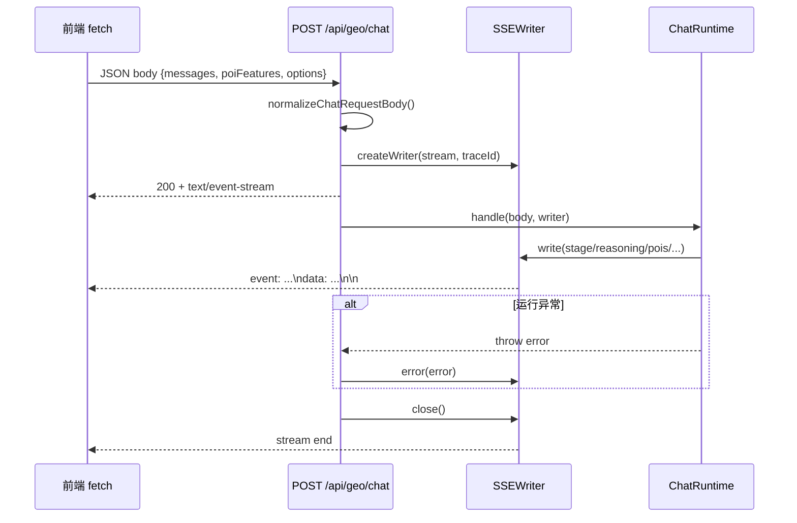

本页聚焦 GeoLoom Agent 后端对外暴露的 **API 路由结构、前缀分层、请求/响应模式，以及基于 SSE 的流式传输契约**。其核心设计并非“所有接口都流式化”，而是将**可枚举、可重试、可缓存的资源访问**维持为 RESTful 端点，将**长时推理、阶段反馈、增量结果输出**收束到单一聊天流接口，从而形成“**资源接口同步返回 + 智能体接口事件流返回**”的双轨模式。Sources: [app.ts](backend/src/app.ts#L33-L66) [chat.ts](backend/src/routes/chat.ts#L63-L91) [geo.ts](backend/src/routes/geo.ts#L16-L61) [skills.ts](backend/src/routes/skills.ts#L15-L60) [category.ts](backend/src/routes/category.ts#L11-L34) [spatial.ts](backend/src/routes/spatial.ts#L11-L32) [narrativeProbe.ts](backend/src/routes/narrativeProbe.ts#L48-L85)

## 路由分区总览：以前缀表达职责边界

从第一性原理看，这套 API 设计首先解决的是**职责分区**问题。`createApp` 将接口注册拆分为三个前缀域：`/api/category` 负责品类目录查询，`/api/spatial` 负责空间特征抓取，`/api/geo` 作为与地理智能运行时绑定的主入口，承载健康检查、技能调用、聊天流以及 narrative probe。这意味着 API 的结构不是按技术实现切分，而是按**资源域与运行域**切分：静态或准静态资源走独立前缀，运行期编排能力统一挂在 `geo` 域下。Sources: [app.ts](backend/src/app.ts#L33-L66)

在实现层，Fastify 通过多次 `app.register(..., { prefix })` 形成命名空间式路由树。`category` 与 `spatial` 注册器被包裹在各自专属前缀下，而 `geo` 前缀内部继续挂载 health、skills、chat、narrative probe 等运行期接口。这种注册方式让 URL 设计与服务注入同步完成：例如 `chat` 路由只有在 `options.chat` 存在时才注册，`narrative probe` 只有在 `options.narrativeRuntime` 存在时才暴露，体现出**能力感知的条件式路由装配**。Sources: [app.ts](backend/src/app.ts#L43-L64)

下表概括当前可验证的 API 路由版图。可以看到，**RESTful 风格用于资源与动作调用，SSE 仅用于会话式长任务输出**，两者职责非常清晰。Sources: [category.ts](backend/src/routes/category.ts#L11-L34) [spatial.ts](backend/src/routes/spatial.ts#L11-L32) [geo.ts](backend/src/routes/geo.ts#L16-L61) [skills.ts](backend/src/routes/skills.ts#L15-L60) [chat.ts](backend/src/routes/chat.ts#L69-L90) [narrativeProbe.ts](backend/src/routes/narrativeProbe.ts#L52-L84)

| 前缀 | 方法 | 路径 | 模式 | 职责 |
|---|---|---|---|---|
| `/api/category` | GET | `/tree` | REST JSON | 返回分类树 |
| `/api/category` | GET | `/flat` | REST JSON | 返回扁平分类列表 |
| `/api/spatial` | POST | `/fetch` | REST JSON | 按请求体抓取空间特征 |
| `/api/geo` | GET | `/health` | REST JSON | 返回服务健康与依赖状态 |
| `/api/geo` | GET | `/skills` | REST JSON | 枚举已注册技能 |
| `/api/geo` | POST | `/skills/:name/call` | REST JSON | 同步执行技能动作 |
| `/api/geo` | POST | `/chat` | SSE | 流式返回聊天/推理事件 |
| `/api/geo` | POST | `/narrative/probe` | REST JSON | 以 viewport 为输入进行 narrative probe |

## 架构关系图：REST 资源面与 SSE 会话面

在阅读下面 Mermaid 图之前，先明确两个概念：**资源面**指一次请求对应一次完整 JSON 响应的接口；**会话面**指请求建立后，服务端持续推送多类事件直到完成的接口。该仓库的 API 设计就是把两者放进同一服务进程中，但用不同路由与响应语义严格隔离。Sources: [app.ts](backend/src/app.ts#L33-L66) [chat.ts](backend/src/routes/chat.ts#L69-L90) [SSEWriter.ts](backend/src/chat/SSEWriter.ts#L9-L114)

```mermaid
flowchart LR
    FE[前端调用层] --> CAT[/api/category/*]
    FE --> SPA[/api/spatial/fetch]
    FE --> HEALTH[/api/geo/health]
    FE --> SKILLS[/api/geo/skills]
    FE --> CALL[/api/geo/skills/:name/call]
    FE --> CHAT[/api/geo/chat]
    FE --> PROBE[/api/geo/narrative/probe]

    CAT --> JSON1[一次性 JSON 响应]
    SPA --> JSON2[一次性 JSON 响应]
    HEALTH --> JSON3[一次性 JSON 响应]
    SKILLS --> JSON4[一次性 JSON 响应]
    CALL --> JSON5[一次性 JSON 响应]
    PROBE --> JSON6[一次性 JSON 响应]

    CHAT --> STREAM[PassThrough + SSEWriter]
    STREAM --> EVT1[event: stage]
    STREAM --> EVT2[event: reasoning]
    STREAM --> EVT3[event: pois]
    STREAM --> EVT4[event: refined_result]
    STREAM --> EVT5[event: error]
    STREAM --> EVT6[event: done]
```
Sources: [app.ts](backend/src/app.ts#L43-L64) [chat.ts](backend/src/routes/chat.ts#L69-L90) [SSEWriter.ts](backend/src/chat/SSEWriter.ts#L18-L114)

## RESTful 设计模式：面向资源枚举与可预测动作

`/api/category/tree` 与 `/api/category/flat` 是最典型的资源读取型接口。它们都使用 `GET`，都不依赖请求体，都在失败时返回 `500` 与结构化错误对象，差异仅在于返回的是树结构还是经 `flattenCategoryTree` 处理后的扁平结构。这属于标准的 **representation-oriented** REST 风格：同一底层资源域——category catalog——通过不同视图投影为两种只读表示。Sources: [category.ts](backend/src/routes/category.ts#L3-L35)

`/api/spatial/fetch` 虽然是 `POST`，但依然属于 RESTful 的资源访问变体，而不是流式接口。其设计原因可从代码直接验证：输入是一个结构较复杂的 `SpatialFetchRequest`，服务端将其整体交给 `fetchSpatialFeatures` 处理，成功时返回 `{ success: true, features }`，依赖不存在则返回 `503`，运行失败返回 `500`。这里的 `POST` 用于承载复杂查询条件，而非表示异步会话。Sources: [spatial.ts](backend/src/routes/spatial.ts#L3-L33)

`/api/geo/health` 则体现出运维语义上的 REST 端点设计。它同步汇总数据库健康、聊天 runtime 健康、依赖项状态、降级依赖列表以及已注册技能清单，最后统一返回一个 JSON 文档。值得注意的是，该接口即便数据库不可用，顶层 `status` 仍返回 `'ok'`，而将退化状态放入 `degraded_dependencies` 与 `services.database` 中表达，因此它更像**能力快照接口**而不是简单的存活探针。Sources: [geo.ts](backend/src/routes/geo.ts#L16-L61)

`/api/geo/skills` 与 `/api/geo/skills/:name/call` 共同构成“可发现 + 可调用”的动作型 REST 接口。前者用 `GET` 返回注册表枚举，后者用 `POST` 触发具名技能的具名 action，并将 `payload`、`session_id`、自动生成的 `trace_id` 与执行耗时一并放入响应。这不是 SSE，因为执行被封装为**一次同步请求，一次完整结果返回**。即使 action 本质上较重，它仍以 RPC-over-HTTP 的方式出现，而未升级为事件流。Sources: [skills.ts](backend/src/routes/skills.ts#L9-L60)

`/api/geo/narrative/probe` 是另一个具有代表性的非流式计算接口。它接收 viewport、可选 rawQuery、includeEncoder、topRaw 等参数，先做输入归一化与校验，再调用 `narrativeRuntime.probe` 返回 `{ ok: true, data }`。这说明仓库并未把所有“AI 相关”操作都做成 SSE，而是依据**是否需要逐步反馈**来决定传输形式：probe 适合一次性计算结果，chat 才适合流式阶段输出。Sources: [narrativeProbe.ts](backend/src/routes/narrativeProbe.ts#L7-L85)

## SSE 设计模式：单入口、多事件、渐进式完成

SSE 只出现在 `/api/geo/chat`，而且实现非常直接：服务端在收到 POST 后先构造 `PassThrough` 流，再由 `deps.chat.createWriter` 创建 `SSEWriter`，随后手动设置 `Content-Type: text/event-stream; charset=utf-8`、`Cache-Control: no-cache, no-transform`、`Connection: keep-alive` 与 `X-Trace-Id`，最后立即 `reply.send(stream)` 将连接交给客户端持续读取。此时 HTTP 请求已经成功建立，但业务计算仍在后台继续进行。Sources: [chat.ts](backend/src/routes/chat.ts#L69-L90)

这种实现的关键点在于：**请求方法仍然是 POST，但响应语义变成事件流**。也就是说，该接口并未使用浏览器原生 `EventSource` 所要求的 GET 模式，而是采用 `fetch + ReadableStream` 消费 SSE 文本块。这使得请求体可以自然携带 `messages`、`poiFeatures` 与 `options`，避免把复杂上下文塞进 query string。前端 `streamGeoChat` 与 `sendChatMessageStream` 都是通过 `fetch(..., { method: 'POST', body: JSON.stringify(...) })` 来读取流式响应的。Sources: [chat.ts](backend/src/routes/chat.ts#L69-L90) [geoloomApi.ts](src/lib/geoloomApi.ts#L56-L112) [aiService.ts](src/utils/aiService.ts#L355-L418)

从生命周期看，`/chat` 路由先完成请求体归一化，再生成 `traceId`，接着把写入器交给聊天运行时执行。若运行时抛出异常，路由层调用 `writer.error(error)` 发出 `error` 事件；无论成功或失败，最终都调用 `writer.close()` 结束流。这意味着 SSE 的终止条件不是 TCP 被动断开，而是由路由层显式收口。Sources: [chat.ts](backend/src/routes/chat.ts#L20-L61) [chat.ts](backend/src/routes/chat.ts#L69-L90)

下图展示了该 SSE 通道的运行顺序。阅读图时注意：客户端拿到的不是一个 JSON 文档，而是多个以空行分隔的 **SSE block**。Sources: [chat.ts](backend/src/routes/chat.ts#L69-L90) [SSEWriter.ts](backend/src/chat/SSEWriter.ts#L110-L114) [geoloomApi.ts](src/lib/geoloomApi.ts#L82-L111)


Sources: [chat.ts](backend/src/routes/chat.ts#L25-L90) [SSEWriter.ts](backend/src/chat/SSEWriter.ts#L18-L114)

## 聊天请求归一化：为兼容历史调用而保持单一内部契约

`registerChatRoutes` 在真正调用运行时之前，先通过 `normalizeChatRequestBody` 做兼容层归一化。这里可以验证出两个明确目标：第一，兼容旧字段名，如 `message`、`query`、`userQuery`、`user_query`；第二，将旧式单字符串输入统一转换为 `messages: [{ role: 'user', content }]` 的新结构。这让路由层承担了**外部兼容适配器**角色，而内部 runtime 始终只面对 `ChatRequestV4`。Sources: [chat.ts](backend/src/routes/chat.ts#L9-L61) [types.ts](backend/src/chat/types.ts#L23-L27)

同样的兼容逻辑也用于 `requestId` 与 `sessionId`。如果 `options.requestId` 或 `options.sessionId` 未显式提供，路由会从 `requestId` / `request_id` 与 `sessionId` / `session_id` 中提取旧值写回 `options`。这说明 API 演进并非通过并行维护多个版本路径，而是通过**输入兼容 + 内部统一模型**来收敛版本差异。Sources: [chat.ts](backend/src/routes/chat.ts#L38-L60)

`ChatRequestV4` 本身只定义了三个顶层域：`messages`、可选 `poiFeatures`、可选 `options`；其中 `options` 允许挂载 `surface`、`spatialContext`、`regions`、`selectedCategories`、`sourcePolicy`、`skipCache`、`forceRefresh` 等扩展字段。这种设计使聊天接口成为一个**可演化封套协议**：主结构稳定，细节能力通过 `options` 扩张。Sources: [types.ts](backend/src/chat/types.ts#L8-L27)

## SSE 事件模型：事件名承载语义，payload 承载数据

`SSEWriter` 是整个流式协议的核心抽象。它为 `job`、`stage`、`thinking`、`reasoning`、`intent_preview`、`pois`、`boundary`、`spatial_clusters`、`vernacular_regions`、`fuzzy_regions`、`stats`、`web_search`、`entity_alignment`、`message`、`refined_result`、`done`、`error` 提供了具名方法，最终都落到统一的 `write(event, payload)`。这表明协议设计是**多事件类型、统一封装格式**，而不是单事件类型下的多态字段。Sources: [SSEWriter.ts](backend/src/chat/SSEWriter.ts#L18-L114)

写出格式也完全符合 SSE 文本协议：每个事件块由 `event: ${event}` 与 `data: ${JSON.stringify(...)}` 组成，并以两个换行结尾。也就是说，服务端并不依赖任何高级框架协议层，而是自行序列化为标准 SSE 块。由于 `withMeta` 会给对象型 payload 注入 `trace_id` 与 `schema_version`，所以大多数对象事件天然带有链路追踪与协议版本信息；数组型 payload 如 `pois`、`vernacular_regions`、`fuzzy_regions` 则不会被注入这些元信息。Sources: [SSEWriter.ts](backend/src/chat/SSEWriter.ts#L95-L114)

`SurfaceChatRuntime` 则进一步说明了 SSE 流接口背后的一个设计原则：**统一路由，不统一实现**。它根据 `request.options.surface` 在 `defaultRuntime` 与 `narrativeRuntime` 间切换，但创建出来的 writer 永远使用相同的 `schemaVersion: 'v4.surface.v1'`。换言之，前端面对的是稳定的流协议，后端可在相同协议壳下切换不同运行时。Sources: [SurfaceChatRuntime.ts](backend/src/chat/SurfaceChatRuntime.ts#L8-L39)

下表总结当前代码中可验证的 SSE 事件类型与语义角色。这里不讨论具体业务算法，仅讨论传输协议中的职责定位。Sources: [SSEWriter.ts](backend/src/chat/SSEWriter.ts#L18-L114) [sseEventSchema.ts](shared/sseEventSchema.ts#L54-L213)

| 事件名 | payload 形态 | 语义角色 |
|---|---|---|
| `job` | object | 描述任务模式 |
| `stage` | object | 描述当前阶段名 |
| `thinking` | object | 轻量思考状态 |
| `reasoning` | object | 显式推理内容 |
| `intent_preview` | object | 意图解析预览 |
| `progress` | object | 进度数值 |
| `partial` | object | 文本片段 |
| `pois` | array | POI 列表结果 |
| `boundary` | object/array/string/null | 边界结果 |
| `spatial_clusters` | object | 聚类热点 |
| `vernacular_regions` | array | 地域俗称结果 |
| `fuzzy_regions` | array | 模糊区域结果 |
| `stats` | object | 统计信息 |
| `web_search` | object | 联网检索状态 |
| `entity_alignment` | object | 实体对齐状态 |
| `refined_result` | object | 结构化最终结果 |
| `error` | object | 错误终止信息 |
| `done` | object | 流完成信号 |
| `schema_error` | object | 前端本地校验失败时派生出的伪事件 |

## SSE 契约校验：共享 schema 作为前后端协议护栏

该仓库的一个高价值设计是把 SSE 事件 schema 放在 `shared/sseEventSchema.ts` 中，由前端直接复用。`SSE_EVENT_SCHEMAS` 为主要事件定义了 JSON schema 风格的结构描述，例如 `stage` 要求包含 `name`，`reasoning` 要求包含 `content`，`progress` 要求包含 `progress`，`error` 要求包含 `message`。这说明 SSE 并不是“纯文本随便发”，而是有**共享契约**约束的。Sources: [sseEventSchema.ts](shared/sseEventSchema.ts#L21-L213)

更重要的是，`withEventMeta` 会在对象型 schema 上统一补入 `trace_id`、`schema_version`、`capabilities` 等元字段，因此 schema 层已经内建了**链路与版本元数据的保底约束**。即使不同事件承载不同业务字段，它们仍可以共享同一组协议元信息。Sources: [sseEventSchema.ts](shared/sseEventSchema.ts#L21-L52) [sseEventSchema.ts](shared/sseEventSchema.ts#L54-L213)

前端消费时，无论是较新的 `streamGeoChat`，还是较完整的 `sendChatMessageStream`，都会在解析到事件后调用 `validateSSEEventPayload`。若校验失败，前端不会把原事件直接透出，而是转化为本地 `schema_error` 元事件供上层处理。这意味着协议容错被放在客户端消费层，而不是假定服务端永远正确。Sources: [geoloomApi.ts](src/lib/geoloomApi.ts#L34-L53) [geoloomApi.ts](src/lib/geoloomApi.ts#L93-L111) [aiService.ts](src/utils/aiService.ts#L470-L495)

## 前端消费模式：不是 EventSource，而是 fetch + 流读取

前端对 `/api/geo/chat` 的消费方式非常值得单独说明，因为它决定了 API 设计的若干边界。`src/lib/geoloomApi.ts` 中的 `streamGeoChat` 使用 `fetch` 发起 `POST`，随后从 `response.body.getReader()` 逐块读取字节流，拼接到 buffer 中，再按 `\n\n` 分割 SSE block，最终用 `parseSseEventBlock` 提取 `event` 和 `data`。这是一种**手工 SSE 解析**，适用于 POST 场景。Sources: [geoloomApi.ts](src/lib/geoloomApi.ts#L56-L112)

`src/utils/aiService.ts` 采用了更细粒度的解析路径：它按单行处理流内容，通过 `currentEvent` 跟踪最近的 `event:` 行，再对随后的 `data:` 行做 JSON 解析，并根据事件类型分派到 meta 通道或文本输出通道。这种实现使前端既能处理结构化事件，也能处理增量文本，同时还能在 `refined_result`、`stats` 等事件上提取额外时序信息。Sources: [aiService.ts](src/utils/aiService.ts#L377-L519)

这种客户端实现反过来解释了为什么后端聊天接口选择 `POST + text/event-stream`：因为聊天请求需要一个较大的 JSON body，而前端又需要持续读取事件流；原生 `EventSource` 不支持自定义 POST body，因此仓库选择了**协议上是 SSE，传输发起上是 fetch** 的混合模式。Sources: [chat.ts](backend/src/routes/chat.ts#L69-L90) [geoloomApi.ts](src/lib/geoloomApi.ts#L56-L112)

## 错误处理与状态表达：HTTP 状态码负责建连结果，SSE 事件负责运行结果

REST 接口普遍采用传统的 HTTP 状态码策略：未找到技能时 `/skills/:name/call` 返回 `404`，技能执行业务失败返回 `400`，category 与 spatial 路由在内部异常时返回 `500`，spatial 服务不可用时返回 `503`，narrative probe 参数错误返回 `400`。这里，**HTTP 状态码直接表达请求语义是否成立**。Sources: [skills.ts](backend/src/routes/skills.ts#L28-L59) [category.ts](backend/src/routes/category.ts#L11-L34) [spatial.ts](backend/src/routes/spatial.ts#L11-L31) [narrativeProbe.ts](backend/src/routes/narrativeProbe.ts#L56-L82)

SSE 接口则采用分层错误语义。连接建立失败时仍由 HTTP 非 2xx 体现；一旦流已建立，业务错误不再依赖修改状态码，而是通过 `event: error` 推送 `{ message }`，然后结束流。前端也按此约定：若流内收到 `error` 事件，会提取 `message` 并抛出异常。因此，在流式接口里，**HTTP 负责 transport-level success，SSE event 负责 runtime-level success**。Sources: [chat.ts](backend/src/routes/chat.ts#L75-L87) [SSEWriter.ts](backend/src/chat/SSEWriter.ts#L90-L114) [geoloomApi.ts](src/lib/geoloomApi.ts#L72-L80) [geoloomApi.ts](src/lib/geoloomApi.ts#L105-L109)

## API 设计取舍：为什么是“REST + 单 SSE 通道”而不是“全流式化”

从已验证代码可得出一个明确架构模式：仓库将 API 分为**枚举型资源接口**、**同步动作接口**、**长任务会话接口**三类，其中只有第三类使用 SSE。这种设计有两个直接优势。第一，资源接口可以保持简单、直观、便于调试；第二，流式协议只需在一个核心入口维护，从而降低前后端协议演化成本。Sources: [app.ts](backend/src/app.ts#L43-L64) [chat.ts](backend/src/routes/chat.ts#L69-L90) [skills.ts](backend/src/routes/skills.ts#L15-L60)

与之相对，如果将 `skills/:name/call`、`narrative/probe`、`spatial/fetch` 全部流式化，虽然形式统一，但客户端复杂度会明显上升，而且对于天然一次性结果的接口没有明显收益。当前设计恰好体现了**按交互时长与可视反馈需求选择传输模型**，而非按“是否 AI”来粗暴划分。Sources: [spatial.ts](backend/src/routes/spatial.ts#L11-L32) [narrativeProbe.ts](backend/src/routes/narrativeProbe.ts#L52-L84) [chat.ts](backend/src/routes/chat.ts#L69-L90)

下表对 RESTful 与 SSE 两种接口模式在本仓库中的实际落点做一个对照。Sources: [chat.ts](backend/src/routes/chat.ts#L69-L90) [skills.ts](backend/src/routes/skills.ts#L19-L60) [spatial.ts](backend/src/routes/spatial.ts#L11-L32) [category.ts](backend/src/routes/category.ts#L11-L34) [narrativeProbe.ts](backend/src/routes/narrativeProbe.ts#L52-L84)

| 维度 | RESTful 接口 | SSE 流式接口 |
|---|---|---|
| 路由示例 | `/api/category/tree`、`/api/spatial/fetch`、`/api/geo/skills/:name/call` | `/api/geo/chat` |
| 请求方式 | GET / POST | POST |
| 响应次数 | 一次响应完成 | 多事件逐步输出 |
| 适用场景 | 资源获取、同步动作、一次性计算 | 长时推理、阶段反馈、增量内容 |
| 状态表达 | HTTP 状态码 + JSON body | HTTP 建连成功 + `error/done` 事件 |
| 客户端实现 | `response.json()` | `fetch + ReadableStream + SSE 解析` |
| 契约形态 | 路由级 JSON 结构 | 事件名 + 事件 payload schema |

## 当前页的位置与延伸阅读

你当前位于 **[API 路由设计：RESTful 与 SSE 流式传输](22-api-lu-you-she-ji-restful-yu-sse-liu-shi-chuan-shu)**。如果你希望继续沿着调用链向上理解“这些路由是如何接入整体请求处理生命周期的”，下一步应阅读 [请求生命周期管理：从用户输入到流式响应](7-qing-qiu-sheng-ming-zhou-qi-guan-li-cong-yong-hu-shu-ru-dao-liu-shi-xiang-ying)；如果你要进一步理解流式聊天背后的智能体执行逻辑，应阅读 [智能体编排：技能调度与任务执行](20-zhi-neng-ti-bian-pai-ji-neng-diao-du-yu-ren-wu-zhi-xing)；如果你关注前端如何消费这些流事件并映射到 UI，应阅读 [AI 聊天组件：流式对话与上下文绑定](17-ai-liao-tian-zu-jian-liu-shi-dui-hua-yu-shang-xia-wen-bang-ding)。Sources: [app.ts](backend/src/app.ts#L43-L64) [geoloomApi.ts](src/lib/geoloomApi.ts#L56-L112) [aiService.ts](src/utils/aiService.ts#L355-L519)