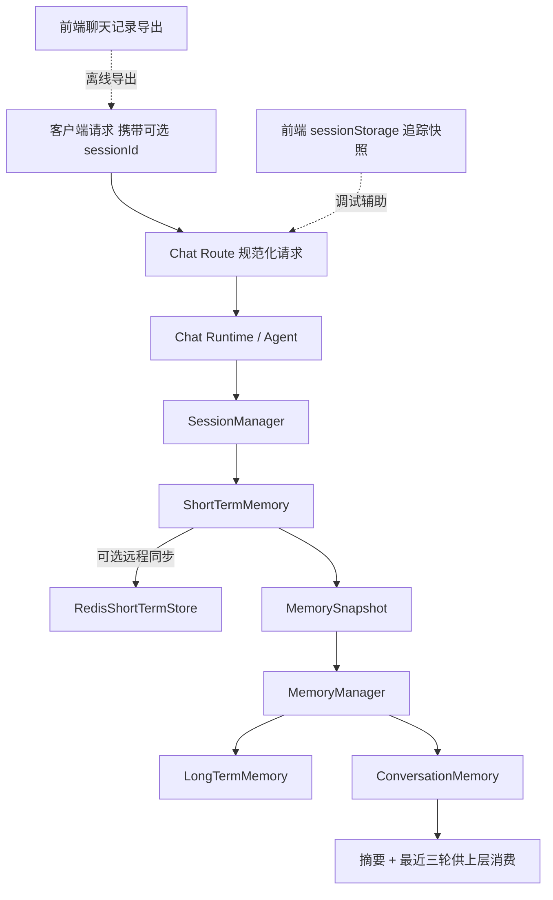
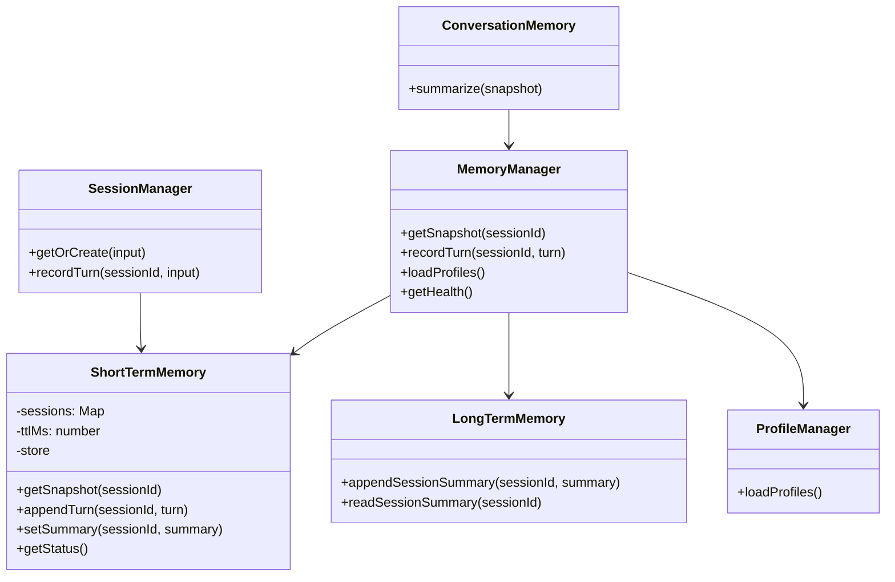

本页聚焦 GeoLoom Agent 中与**会话记忆、短期缓存、长期摘要持久化以及前端轻量会话存储**直接相关的实现边界。就代码证据而言，这一主题并不是一个独立数据库子系统，而是由后端 `ShortTermMemory`、`LongTermMemory`、`MemoryManager`、`SessionManager`，以及前端用于导出与追踪的浏览器存储工具共同构成的**分层记忆体系**：短期层保存当前会话轮次与摘要，长期层以文件方式落盘会话摘要，前端层则承担调试追踪与导出，不参与服务端权威记忆。Sources: [MemoryManager.ts](backend/src/memory/MemoryManager.ts#L1-L63), [ShortTermMemory.ts](backend/src/memory/ShortTermMemory.ts#L1-L190), [LongTermMemory.ts](backend/src/memory/LongTermMemory.ts#L1-L40), [SessionManager.ts](backend/src/agent/SessionManager.ts#L1-L42), [chatHistoryExport.ts](src/utils/chatHistoryExport.ts#L1-L177), [v2TraceSession.ts](src/utils/v2TraceSession.ts#L1-L196)

从第一性原理看，这套设计解决的是三个不同问题：**会话上下文连续性**、**跨请求的低成本持久化**、以及**依赖失效时的退化运行**。代码中没有出现复杂 ORM、统一缓存框架或事务存储层；相反，系统采用了更直接的策略：短期记忆优先使用内存 `Map`，可选接入 Redis 作为远程短期存储；长期记忆则只写入按 `sessionId` 命名的 JSON 文件；配置画像单独由 `ProfileManager` 从默认 Markdown 文件读取。这说明当前页面的核心不是“通用数据平台”，而是“面向对话代理的记忆拼装”。Sources: [ShortTermMemory.ts](backend/src/memory/ShortTermMemory.ts#L22-L50), [RedisShortTermStore.ts](backend/src/memory/RedisShortTermStore.ts#L85-L221), [LongTermMemory.ts](backend/src/memory/LongTermMemory.ts#L5-L39), [ProfileManager.ts](backend/src/memory/ProfileManager.ts#L7-L34)

## 架构总览：短期记忆、长期摘要与前端会话存储的边界

后端的记忆架构可以概括为：`SessionManager` 负责会话标识与轮次写入入口，`ShortTermMemory` 负责当前会话完整轮次与短摘要，`LongTermMemory` 负责摘要文件持久化，`MemoryManager` 负责将两者合并成对外快照，而 `ConversationMemory` 只对快照做轻量裁剪，返回摘要与最近三轮。这个关系说明系统把“记忆生成”“记忆存储”“记忆消费”刻意分层，而不是让 Agent 直接读写多个存储后端。Sources: [SessionManager.ts](backend/src/agent/SessionManager.ts#L6-L42), [ShortTermMemory.ts](backend/src/memory/ShortTermMemory.ts#L17-L190), [LongTermMemory.ts](backend/src/memory/LongTermMemory.ts#L5-L39), [MemoryManager.ts](backend/src/memory/MemoryManager.ts#L7-L63), [ConversationMemory.ts](backend/src/agent/ConversationMemory.ts#L1-L18)

在前端，存在两类与“持久化”相关但职责不同的实现：其一是 `v2TraceSession.ts` 使用 `window.sessionStorage` 存放追踪快照与最近事件，主要服务调试和可观测性；其二是 `chatHistoryExport.ts` 将消息与运行时间线组装成可导出文本，但并未把它持久写入某个后端仓库。因此，这些前端模块属于**会话辅助状态与导出能力**，不应与后端权威记忆混为一谈。Sources: [v2TraceSession.ts](src/utils/v2TraceSession.ts#L1-L196), [chatHistoryExport.ts](src/utils/chatHistoryExport.ts#L1-L177), [chatStreamState.ts](src/lib/chatStreamState.ts#L8-L177)



该图的阅读前提是区分两种“持久化”：**后端权威持久化**指 `LongTermMemory` 写入 `backend/data/memory` 目录的 JSON 摘要；**前端本地持久化**指浏览器 `sessionStorage` 中的追踪状态。二者服务目标不同，前者用于跨请求恢复摘要，后者用于当前浏览器会话内的调试与展示。Sources: [LongTermMemory.ts](backend/src/memory/LongTermMemory.ts#L18-L37), [v2TraceSession.ts](src/utils/v2TraceSession.ts#L51-L77)

## 核心数据模型：系统到底记住了什么

后端记忆围绕 `MemoryTurn` 与 `MemorySnapshot` 两个结构展开。单轮记忆包含 `traceId`、`userQuery`、`answer`、可选 `intent` 与 `createdAt`；完整快照则包含 `sessionId`、`summary`、`recentTurns` 与 `turns`。这意味着当前系统保存的是**已发生对话的压缩语义与原始轮次列表**，而不是工具执行细节、地图状态快照或完整中间推理链。Sources: [types.ts](backend/src/agent/types.ts#L10-L28)

`ShortTermRecordData` 进一步展示了短期层的真实存储形态：记录项持有 `sessionId`、`summary`、`turns` 和 `updatedAt`。其中 `updatedAt` 被用于 TTL 清理，`summary` 则由最近两轮自动拼接生成。换言之，短期层不是单纯 KV 缓存，它同时承担了**轮次归档 + 轻摘要生成 + 生命周期裁剪**三项职责。Sources: [ShortTermMemory.ts](backend/src/memory/ShortTermMemory.ts#L4-L20), [ShortTermMemory.ts](backend/src/memory/ShortTermMemory.ts#L91-L103), [ShortTermMemory.ts](backend/src/memory/ShortTermMemory.ts#L162-L178)

下面的表格总结了系统中几类“记忆/存储”对象的边界。Sources: [types.ts](backend/src/agent/types.ts#L3-L28), [ShortTermMemory.ts](backend/src/memory/ShortTermMemory.ts#L4-L20), [LongTermMemory.ts](backend/src/memory/LongTermMemory.ts#L18-L37), [v2TraceSession.ts](src/utils/v2TraceSession.ts#L18-L31)

| 层级 | 结构/载体 | 保存内容 | 生命周期 | 权威性 |
|---|---|---|---|---|
| 会话短期记忆 | `ShortTermRecordData` / `Map` 或 Redis | 全量 `turns`、`summary`、`updatedAt` | TTL 控制 | 后端权威 |
| 会话快照 | `MemorySnapshot` | `summary`、`recentTurns`、`turns` | 按读取瞬时生成 | 后端派生结果 |
| 长期记忆 | `sessionId.json` | `sessionId`、`summary`、`updatedAt` | 文件长期存在 | 后端权威摘要 |
| 会话记录元信息 | `SessionRecord` | `id`、`requestId`、时间戳 | 请求处理期/可重建 | 后端派生结果 |
| 前端追踪会话 | `sessionStorage` | trace、job、最近事件、摘要 | 浏览器会话期 | 前端辅助状态 |
| 前端导出文本 | Markdown 字符串 | 对话记录、推理摘要、时间线 | 用户导出时生成 | 离线产物 |

## 短期记忆：基于 TTL 的会话上下文缓存

`ShortTermMemory` 的默认实现以 `Map<string, ShortTermRecordData>` 作为本地会话容器，并在构造时接受 `ttlMs` 与可选 `store`。若未提供远程存储，系统将其状态标记为 `local` 且 `degraded: true`，原因是 `remote_unconfigured`；这不是故障，而是显式表明系统运行在本地退化模式。Sources: [ShortTermMemory.ts](backend/src/memory/ShortTermMemory.ts#L22-L50), [dependencyStatus.ts](backend/src/integration/dependencyStatus.ts#L1-L30)

读取快照时，`getSnapshot(sessionId)` 先执行 `prune()`，再尝试从本地 `Map` 读取；若配置了远程存储，则优先通过 `store.getRecord(sessionId)` 拉取，并把远程结果重新写回本地 `sessions`。如果没有任何记录，方法返回空摘要、空 `recentTurns`、空 `turns` 的标准化结构。这个行为非常关键：它保证上层消费方总能拿到稳定形状的数据，而无需判断 `null`。Sources: [ShortTermMemory.ts](backend/src/memory/ShortTermMemory.ts#L52-L89)

写入轮次时，`appendTurn` 会通过 `ensure` 确保会话存在，然后把新 `MemoryTurn` 追加到 `turns`，刷新 `updatedAt`，并调用 `buildSummary` 依据最近两轮生成摘要，最后执行远程同步。也就是说，短期摘要并不是独立计算管线，而是写入路径上的同步副产品。Sources: [ShortTermMemory.ts](backend/src/memory/ShortTermMemory.ts#L91-L97), [ShortTermMemory.ts](backend/src/memory/ShortTermMemory.ts#L132-L178)

TTL 回收逻辑完全在 `prune()` 中实现：遍历所有本地会话，若 `now - updatedAt > ttlMs`，则从 `Map` 中删除对应条目。默认 TTL 是 24 小时。这说明本地短期记忆具备**惰性清理**特征——只有在读取时才触发过期淘汰，而不是后台定时任务。Sources: [ShortTermMemory.ts](backend/src/memory/ShortTermMemory.ts#L31-L34), [ShortTermMemory.ts](backend/src/memory/ShortTermMemory.ts#L162-L169)

## 远程短期存储：Redis 作为可选增强层

`ShortTermMemoryStore` 只是一个很小的抽象接口：`getRecord`、`setRecord`，以及可选的 `ping`。这表明短期远程存储被设计成**插拔式能力**，而不是框架级依赖。当前仓库内唯一实现是 `RedisShortTermStore`。Sources: [ShortTermMemory.ts](backend/src/memory/ShortTermMemory.ts#L11-L20), [RedisShortTermStore.ts](backend/src/memory/RedisShortTermStore.ts#L106-L221)

`RedisShortTermStore` 并未引入 Redis 客户端依赖，而是直接使用 Node 的 `net` 与 `tls`，手写 RESP 编码与响应解析。这一实现包含 `encodeCommand`、`parseRedisValue`、认证、数据库选择、超时控制与 socket 生命周期管理，说明仓库刻意避免增加外部运行时依赖，把 Redis 通信控制在单文件内完成。Sources: [RedisShortTermStore.ts](backend/src/memory/RedisShortTermStore.ts#L1-L83), [RedisShortTermStore.ts](backend/src/memory/RedisShortTermStore.ts#L142-L207), [backend/package.json](backend/package.json#L19-L37)

在 Redis 模式下，记录通过 `SET key JSON PX ttlMs` 写入，键名前缀默认为 `v4:short-term:`，TTL 至少为 1000 毫秒。读取则执行 `GET` 并将 JSON 反序列化为 `ShortTermRecordData`。此外，工厂函数 `createRedisShortTermStoreFromEnv()` 只在 `REDIS_URL` 存在时返回实例，并可读取 `SHORT_TERM_MEMORY_PREFIX` 与 `REDIS_CONNECT_TIMEOUT_MS`。Sources: [RedisShortTermStore.ts](backend/src/memory/RedisShortTermStore.ts#L124-L140), [RedisShortTermStore.ts](backend/src/memory/RedisShortTermStore.ts#L209-L220)

更重要的是退化机制：一旦远程读取、写入或 `ping` 失败，`ShortTermMemory` 会调用 `markFallback()`，将状态切换到 `mode: 'fallback'`、`degraded: true`、`reason: 'remote_store_unavailable'`。随后系统仍然继续使用本地 `Map` 运作，因此 Redis 在这里是**增强可靠性与跨进程共享的可选层**，不是启动必需条件。Sources: [ShortTermMemory.ts](backend/src/memory/ShortTermMemory.ts#L56-L72), [ShortTermMemory.ts](backend/src/memory/ShortTermMemory.ts#L106-L130), [ShortTermMemory.ts](backend/src/memory/ShortTermMemory.ts#L146-L159), [ShortTermMemory.ts](backend/src/memory/ShortTermMemory.ts#L180-L188)

下面的表格概括了短期存储的三种运行状态。Sources: [ShortTermMemory.ts](backend/src/memory/ShortTermMemory.ts#L35-L49), [ShortTermMemory.ts](backend/src/memory/ShortTermMemory.ts#L63-L68), [ShortTermMemory.ts](backend/src/memory/ShortTermMemory.ts#L180-L187)

| 模式 | 触发条件 | `ready` | `degraded` | 说明 |
|---|---|---:|---:|---|
| `local` | 未配置远程 `store` | 是 | 是 | 仅本地内存，远程能力未启用 |
| `remote` | 远程读取/写入/探活成功 | 是 | 否 | Redis 可用，短期会话可跨进程共享 |
| `fallback` | 远程失败后回退 | 是 | 是 | 继续本地运行，但远程存储失效 |

## 长期持久化：按会话摘要落盘，而非完整对话归档

`LongTermMemory` 的实现极其克制：构造时只接收 `dataDir`，写入时确保目录存在，然后将 `{ sessionId, summary, updatedAt }` 序列化为 `${sessionId}.json`。读取时如果文件存在则返回 `summary`，否则返回空字符串。由此可验证，长期层只持久化**摘要级结果**，并不保存完整 `turns`。Sources: [LongTermMemory.ts](backend/src/memory/LongTermMemory.ts#L5-L39)

这种设计的直接效果是：长期记忆成本低、格式简单、恢复快，但信息密度也较低。会话跨重启后，系统只能稳定恢复摘要文本，而非逐轮原始对话。对中级开发者而言，这一点非常关键，因为它解释了为什么 `MemoryManager` 会把长期摘要与短期摘要再做一次拼接：长期层本身并不掌握完整上下文。Sources: [LongTermMemory.ts](backend/src/memory/LongTermMemory.ts#L18-L37), [MemoryManager.ts](backend/src/memory/MemoryManager.ts#L16-L23)

从仓库结构看，长期记忆目录位于 `backend/data/memory`。该目录出现在项目结构中，但本次代码证据未展示预置文件内容，因此唯一可以确认的是：长期持久化目标路径已经在仓库层面预留，且写入逻辑以该类抽象承载。Sources: [LongTermMemory.ts](backend/src/memory/LongTermMemory.ts#L9-L16)

## 记忆编排器：MemoryManager 如何拼装最终快照

`MemoryManager` 是这一页最重要的编排对象。`getSnapshot(sessionId)` 会先取短期快照，再读取长期摘要，最后把两者通过 `[longTermSummary, shortTerm.summary].filter(Boolean).join(' | ')` 合成为统一 `summary` 字段。这说明对外暴露的摘要视图是**长期摘要在前、短期摘要在后**的串联结果。Sources: [MemoryManager.ts](backend/src/memory/MemoryManager.ts#L16-L23)

写入路径同样体现了“短期优先、长期跟进”的策略：`recordTurn` 先向短期层追加轮次，再立即重新获取短期快照，并把该快照的 `summary` 写入长期层。也就是说，长期文件中的摘要始终是由最新短期摘要覆盖而来，而不是独立增量追加。Sources: [MemoryManager.ts](backend/src/memory/MemoryManager.ts#L26-L30)

`MemoryManager` 还负责汇总健康状态。当前实现中，短期层状态来自 `shortTerm.getStatus()`；长期层则被硬编码为 `ready: true`、`mode: 'local'`、`degraded: false`。这意味着长期层目前没有像短期 Redis 那样的探测逻辑，健康报告更多反映的是**短期远程依赖可用性**，而不是文件系统写权限或磁盘状态。Sources: [MemoryManager.ts](backend/src/memory/MemoryManager.ts#L36-L61)



这个类关系图的前提是理解“谁拥有写权限”。在现有实现中，`SessionManager` 直接写短期轮次，`MemoryManager` 则承担跨层汇总与摘要落盘；`ConversationMemory` 本身不持有状态，只消费 `MemorySnapshot`。因此，真正的状态边界落在 `ShortTermMemory` 与 `LongTermMemory`，而不是 Agent 表层对象。Sources: [SessionManager.ts](backend/src/agent/SessionManager.ts#L10-L40), [MemoryManager.ts](backend/src/memory/MemoryManager.ts#L13-L61), [ConversationMemory.ts](backend/src/agent/ConversationMemory.ts#L3-L17)

## 会话标识与轮次写入：SessionManager 的职责

`SessionManager` 的 `getOrCreate` 方法接收 `requestId` 与可选 `sessionId`。若调用方未提供 `sessionId`，它会生成 `sess_${randomUUID()}`；随后通过 `ShortTermMemory.getSnapshot(sessionId)` 读取已有轮次，并把第一轮的 `createdAt` 视为会话创建时间，否则以当前时间作为新会话创建时间。可见，系统没有单独的 session 表，而是通过短期记忆内容反推会话元信息。Sources: [SessionManager.ts](backend/src/agent/SessionManager.ts#L10-L25)

`recordTurn` 只做一件事：把 `traceId`、`userQuery`、`answer`、可选 `intent` 和新的 ISO 时间戳组装成 `MemoryTurn`，再调用 `ShortTermMemory.appendTurn`。这说明当前代码证据下，**会话轮次原始记录的唯一写入口在短期层**，长期层永远只接收摘要。Sources: [SessionManager.ts](backend/src/agent/SessionManager.ts#L27-L40), [types.ts](backend/src/agent/types.ts#L10-L23)

与聊天路由配合来看，HTTP 层允许请求体通过 `options.sessionId`、`sessionId` 或 `session_id` 注入会话标识，并会将这些旧格式统一折叠到 `ChatRequestV4.options.sessionId`。因此，后端会话连续性的关键前提是客户端稳定回传同一 `sessionId`。Sources: [chat.ts](backend/src/routes/chat.ts#L9-L60)

## 画像文件：不是会话记忆，但属于持久化上下文输入

`ProfileManager` 并不管理会话轮次，而是从 `profileDir` 读取 `soul.md.default` 与 `user.md.default`，如果文件缺失则回退到内置默认文案。它返回的 `ProfilesSnapshot` 只包含 `soul` 与 `user` 两个字符串。Sources: [ProfileManager.ts](backend/src/memory/ProfileManager.ts#L7-L34), [types.ts](backend/src/agent/types.ts#L25-L28)

之所以本页需要覆盖这部分，是因为 `MemoryManager` 把 `profiles.loadProfiles()` 纳入统一接口，这使“记忆管理器”不仅输出会话上下文，也输出**长期稳定的人设/用户偏好文本**。不过从实现上说，这类数据更接近“持久化配置输入”，而不是动态会话记忆。Sources: [MemoryManager.ts](backend/src/memory/MemoryManager.ts#L32-L34), [ProfileManager.ts](backend/src/memory/ProfileManager.ts#L20-L33)

## 前端本地持久化：调试追踪与导出，不是后端权威记忆

前端 `v2TraceSession.ts` 使用固定键 `v2-agent-trace-session` 将追踪快照写入 `window.sessionStorage`，包括 `session_id`、`query`、`trace_id`、`job_id`、`latest_summary`、`latest_answer`、`latest_event` 和 `events`。事件数量最多保留 120 条，所有写入失败都会被静默忽略。这种设计明显偏向**可观测性便利**而非严格一致性。Sources: [v2TraceSession.ts](src/utils/v2TraceSession.ts#L1-L8), [v2TraceSession.ts](src/utils/v2TraceSession.ts#L18-L31), [v2TraceSession.ts](src/utils/v2TraceSession.ts#L68-L77), [v2TraceSession.ts](src/utils/v2TraceSession.ts#L129-L190)

与之配套，`chatStreamState.ts` 在内存中累积单次助手运行状态，保留最近 24 条流事件，并把 `refined_result` 归一化为答案、工具调用、证据视图等 UI 可消费数据。但该状态对象本身没有写入浏览器持久存储，因此它属于**运行中状态缓存**，而不是跨刷新恢复的数据层。Sources: [chatStreamState.ts](src/lib/chatStreamState.ts#L8-L39), [chatStreamState.ts](src/lib/chatStreamState.ts#L91-L176)

`chatHistoryExport.ts` 则进一步把消息、推理信息与运行时间线拼装成 Markdown 文本导出。其输入是前端已持有的消息与面板元数据，而不是后端记忆接口返回的专用导出格式。因此这里的“持久化”更准确地说是**用户侧内容导出**。Sources: [chatHistoryExport.ts](src/utils/chatHistoryExport.ts#L25-L33), [chatHistoryExport.ts](src/utils/chatHistoryExport.ts#L108-L177)

## 模式比较：当前仓库中的记忆与缓存策略

为了避免将本页与 [状态管理：HUD、通知与团队协作状态](19-zhuang-tai-guan-li-hud-tong-zhi-yu-tuan-dui-xie-zuo-zhuang-tai) 混淆，可以用下表区分本页真正覆盖的“记忆/持久化”模式。Sources: [ShortTermMemory.ts](backend/src/memory/ShortTermMemory.ts#L22-L190), [LongTermMemory.ts](backend/src/memory/LongTermMemory.ts#L18-L39), [v2TraceSession.ts](src/utils/v2TraceSession.ts#L51-L103), [chatStreamState.ts](src/lib/chatStreamState.ts#L62-L88)

| 模式 | 位置 | 读写方式 | 保存粒度 | 典型用途 | 失效方式 |
|---|---|---|---|---|---|
| 本地短期记忆 | 后端进程内 `Map` | 同步对象操作 + 异步接口封装 | 会话全部轮次 | 多轮对话上下文 | TTL 惰性清理/进程重启丢失 |
| Redis 短期记忆 | 远程 Redis | TCP/TLS RESP 命令 | 会话全部轮次 | 跨进程共享短期上下文 | TTL 到期/远程不可用 |
| 文件长期摘要 | `backend/data/memory` | JSON 文件读写 | 单会话摘要 | 跨重启恢复摘要 | 文件缺失时返回空 |
| 前端追踪会话 | `sessionStorage` | 浏览器键值写入 | trace + 最近事件 | 调试、回放、诊断 | 关闭会话页或清空存储 |
| 前端运行状态 | JS 内存对象 | 流式事件累积 | 当前一次运行 | UI 实时展示 | 刷新页面丢失 |
| 导出文本 | 生成字符串 | 用户触发导出 | 人类可读记录 | 离线留档 | 未导出则不保留 |

## 设计特征与约束：从代码中能确认的结论

第一，系统的后端记忆是**摘要优先**而不是全量历史归档优先。短期层保存全量轮次，但长期层只保存摘要，且摘要由最近两轮压缩生成。这使实现简单，却也意味着长期恢复能力受摘要质量限制。Sources: [ShortTermMemory.ts](backend/src/memory/ShortTermMemory.ts#L171-L178), [LongTermMemory.ts](backend/src/memory/LongTermMemory.ts#L18-L37), [MemoryManager.ts](backend/src/memory/MemoryManager.ts#L26-L30)

第二，系统把**可用性优先于远程一致性**编码到了实现里。Redis 出错不会阻断会话，而是立即回落到本地 `Map`，同时通过依赖状态标记退化。这种模式很适合开发与单机场景，也减少了远程依赖成为单点故障的风险。Sources: [ShortTermMemory.ts](backend/src/memory/ShortTermMemory.ts#L56-L72), [ShortTermMemory.ts](backend/src/memory/ShortTermMemory.ts#L146-L159), [ShortTermMemory.ts](backend/src/memory/ShortTermMemory.ts#L180-L188)

第三，当前代码没有展示数据库级缓存索引、批量清理任务、版本迁移或冲突合并逻辑。因此可以确认，本页覆盖的“数据缓存”主要指**对话会话级缓存**，而不是面向空间数据查询结果的通用缓存层。Sources: [ShortTermMemory.ts](backend/src/memory/ShortTermMemory.ts#L22-L190), [RedisShortTermStore.ts](backend/src/memory/RedisShortTermStore.ts#L106-L221), [LongTermMemory.ts](backend/src/memory/LongTermMemory.ts#L18-L39)

## 项目内相关目录视图

本页涉及的存储相关目录在仓库中的位置如下，便于读者建立代码导航感。Sources: [MemoryManager.ts](backend/src/memory/MemoryManager.ts#L1-L63), [chatHistoryExport.ts](src/utils/chatHistoryExport.ts#L1-L177), [v2TraceSession.ts](src/utils/v2TraceSession.ts#L1-L196)

```text
backend/
├── data/
│   └── memory/              # 长期摘要 JSON 落盘目录
├── profiles/
│   ├── soul.md.default      # 默认系统画像
│   └── user.md.default      # 默认用户画像
└── src/
    ├── agent/
    │   ├── ConversationMemory.ts
    │   └── SessionManager.ts
    └── memory/
        ├── LongTermMemory.ts
        ├── MemoryManager.ts
        ├── ProfileManager.ts
        ├── RedisShortTermStore.ts
        └── ShortTermMemory.ts

src/
├── lib/
│   └── chatStreamState.ts   # 前端运行态缓存
└── utils/
    ├── chatHistoryExport.ts # 对话导出
    └── v2TraceSession.ts    # sessionStorage 追踪快照
```

## 阅读建议与下一步

如果你想继续理解“这些记忆何时被读取、何时被写入”，下一步最自然的是阅读 [请求生命周期管理：从用户输入到流式响应](7-qing-qiu-sheng-ming-zhou-qi-guan-li-cong-yong-hu-shu-ru-dao-liu-shi-xiang-ying)，因为它解释记忆层在整个请求管线中的时序位置。Sources: [chat.ts](backend/src/routes/chat.ts#L63-L92), [app.ts](backend/src/app.ts#L33-L67)

如果你更关注“会话记忆如何参与智能体决策与多轮上下文构造”，建议转到 [智能体编排：技能调度与任务执行](20-zhi-neng-ti-bian-pai-ji-neng-diao-du-yu-ren-wu-zhi-xing)。如果你想区分本页中的前端本地存储与一般 UI 状态管理边界，则适合继续阅读 [状态管理：HUD、通知与团队协作状态](19-zhuang-tai-guan-li-hud-tong-zhi-yu-tuan-dui-xie-zuo-zhuang-tai)。Sources: [SessionManager.ts](backend/src/agent/SessionManager.ts#L10-L40), [v2TraceSession.ts](src/utils/v2TraceSession.ts#L51-L103), [chatStreamState.ts](src/lib/chatStreamState.ts#L62-L176)