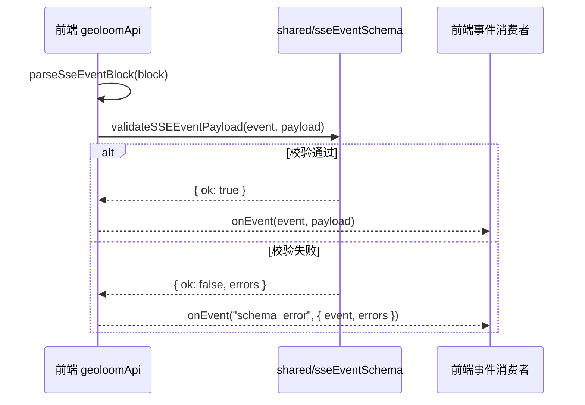

本页聚焦 GeoLoom Agent 中**可验证的 TypeScript 契约层**：后端领域类型、前后端共享事件模式、前端归一化数据模型，以及少量用于运行时守卫的结构化 schema。它不讨论服务编排、算法流程或 UI 设计本身，而是回答一个更基础的问题：**系统如何用 TypeScript 把“输入—处理中间态—输出”约束成稳定的数据边界**。Sources: [types.ts](backend/src/chat/types.ts#L1-L368), [sseEventSchema.ts](shared/sseEventSchema.ts#L1-L332), [types.ts](backend/src/agent/types.ts#L1-L62)

## 类型系统的第一性原理：以“边界契约”而非“全局统一模型”为中心

从代码结构看，这个仓库没有把所有类型集中到单一 `models.ts`，而是采用**按子域分散定义、按边界共享最小集合**的方式：聊天域有 `backend/src/chat/types.ts`，智能体状态有 `backend/src/agent/types.ts`，LLM 适配器有 `backend/src/llm/types.ts`，技能框架有 `backend/src/skills/types.ts`，自然语言契约有 `backend/src/contract/types.ts`，叙事模式有 `backend/src/narrative/types.ts`，而真正前后端共享的仅有 `shared/sseEventSchema.ts`。这说明类型系统的设计目标不是追求单一“大一统领域模型”，而是优先保障**模块自治、边界清晰、跨端最小耦合**。Sources: [types.ts](backend/src/chat/types.ts#L1-L368), [types.ts](backend/src/agent/types.ts#L1-L62), [types.ts](backend/src/llm/types.ts#L1-L61), [types.ts](backend/src/skills/types.ts#L1-L72), [types.ts](backend/src/contract/types.ts#L1-L28), [types.ts](backend/src/narrative/types.ts#L1-L181), [sseEventSchema.ts](shared/sseEventSchema.ts#L1-L332)

在这个意义上，GeoLoom Agent 的 TypeScript 类型系统更接近**契约分层**：一层是请求入口契约，例如 `ChatRequestV4` 与 `ChatRequestOptionsV4`；一层是执行过程契约，例如 `DeterministicIntent`、`ToolExecutionTrace`、`AgentTurnState`；一层是结果载荷契约，例如 `EvidenceView`、`RenderedAnswer`、`NarrativeTourResult`；最后一层是跨进程/跨端传输契约，例如 SSE 事件 schema。每层都只暴露当前阶段所需的结构，从而降低上层对底层内部实现的认知负担。Sources: [types.ts](backend/src/chat/types.ts#L3-L27), [types.ts](backend/src/chat/types.ts#L54-L81), [types.ts](backend/src/chat/types.ts#L321-L367), [types.ts](backend/src/agent/types.ts#L51-L61), [types.ts](backend/src/narrative/types.ts#L167-L180), [sseEventSchema.ts](shared/sseEventSchema.ts#L54-L213)

上图展示的是“契约层次”而非运行时调用栈：请求对象先定义入口语义，随后在后端被转化为更强语义的执行中间态，最终被包装成结果视图并通过 SSE 事件流发往前端，前端再将其归一化为渲染友好的数据模型。这种分层解释了为什么同一个业务概念在不同文件中会有不同形态——那不是重复建模，而是**面向边界的多视图建模**。Sources: [types.ts](backend/src/chat/types.ts#L23-L27), [types.ts](backend/src/chat/types.ts#L54-L81), [types.ts](backend/src/chat/types.ts#L321-L348), [sseEventSchema.ts](shared/sseEventSchema.ts#L54-L213), [aiEvidencePayload.ts](src/utils/aiEvidencePayload.ts#L17-L29), [aiMapRenderPayload.ts](src/utils/aiMapRenderPayload.ts#L16-L31)

## 模块分布：类型定义并不集中，但边界非常明确

从目录分布看，后端类型主要嵌入在业务模块自身，而不是独立抽离到一个中央类型包中。例如 `backend/src/chat/types.ts` 同时定义请求、意图、证据、区域画像、工具轨迹等；`backend/src/narrative/types.ts` 则完整承载叙事模式的点、边界、节点、过渡和最终结果。这种布局意味着类型定义与业务演化同步，便于在局部修改时维持语义一致性。Sources: [types.ts](backend/src/chat/types.ts#L1-L368), [types.ts](backend/src/narrative/types.ts#L1-L181)

与之相对，`shared/sseEventSchema.ts` 采用显式共享文件，表示 SSE 事件是一个真正需要跨前后端共同理解的公共契约。前端 `src/lib/geoloomApi.ts` 直接导入其中的 `validateSSEEventPayload` 与 `SSEValidationResult`，在解析每个 SSE block 后立刻进行验证；验证失败时不会继续按正常事件处理，而是转发为 `schema_error`。这说明共享类型不是“为了复用而复用”，而是仅在**跨端消息格式必须一致**时才提升到 shared 层。Sources: [sseEventSchema.ts](shared/sseEventSchema.ts#L14-L19), [sseEventSchema.ts](shared/sseEventSchema.ts#L54-L213), [sseEventSchema.ts](shared/sseEventSchema.ts#L307-L331), [geoloomApi.ts](src/lib/geoloomApi.ts#L1-L8), [geoloomApi.ts](src/lib/geoloomApi.ts#L34-L54), [geoloomApi.ts](src/lib/geoloomApi.ts#L93-L110)

| 类型位置 | 代表文件 | 主要职责 | 共享范围 |
|---|---|---|---|
| 后端业务域 | `backend/src/chat/types.ts` | 请求、意图、证据、工具轨迹 | 后端内部 |
| 后端状态域 | `backend/src/agent/types.ts` | 会话、记忆、智能体回合状态 | 后端内部 |
| 后端协议域 | `backend/src/llm/types.ts`、`backend/src/skills/types.ts` | LLM 与技能调用协议 | 后端内部 |
| 后端解释域 | `backend/src/contract/types.ts`、`backend/src/narrative/types.ts` | NL 契约、叙事结果模型 | 后端内部 |
| 跨端共享域 | `shared/sseEventSchema.ts` | SSE 事件 schema 与校验 | 前后端共享 |
| 前端归一化域 | `src/utils/aiEvidencePayload.ts`、`src/utils/aiMapRenderPayload.ts` | 弱结构输入转稳定渲染模型 | 前端内部 |

Sources: [types.ts](backend/src/chat/types.ts#L1-L368), [types.ts](backend/src/agent/types.ts#L1-L62), [types.ts](backend/src/llm/types.ts#L1-L61), [types.ts](backend/src/skills/types.ts#L1-L72), [types.ts](backend/src/contract/types.ts#L1-L28), [types.ts](backend/src/narrative/types.ts#L1-L181), [sseEventSchema.ts](shared/sseEventSchema.ts#L1-L332), [aiEvidencePayload.ts](src/utils/aiEvidencePayload.ts#L1-L160), [aiMapRenderPayload.ts](src/utils/aiMapRenderPayload.ts#L1-L188)

## 请求入口模型：宽输入、窄语义

聊天入口类型 `ChatRequestV4` 很简洁，只要求 `messages: ChatMessageV4[]`，并允许可选的 `poiFeatures` 与 `options`；而 `ChatMessageV4` 仅约束 `role: string` 与 `content: unknown`。`ChatRequestOptionsV4` 虽然定义了若干已知字段，如 `requestId`、`sessionId`、`surface`、`spatialContext`、`regions`、`selectedCategories`、`skipCache`、`forceRefresh`，但同时保留 `[key: string]: unknown` 索引签名。这表明入口类型刻意保持**兼容性优先**，避免因为前端参数扩展导致后端入口频繁失配。Sources: [types.ts](backend/src/chat/types.ts#L3-L27)

这种“宽输入”策略在前端也有对应体现。`filterV3ChatOptions` 使用 allowlist，只从任意 `options: unknown` 中提取允许字段，返回 `Partial<Record<V3OptionAllowlistKey, unknown>>`；未列入白名单的字段会被静默丢弃。也就是说，前端并不试图在入口层完全静态穷举所有选项，而是通过**弱输入 + 白名单裁剪**来构造受控请求载荷。Sources: [v3RequestOptions.ts](src/utils/v3RequestOptions.ts#L1-L46)

这类入口建模的价值在于：系统把“兼容旧参数、接纳未知扩展”的压力放在最外围，而不是把不稳定性传导到核心领域模型中。进入领域层后，类型立即收紧为更明确的语义结构，比如 `DeterministicIntent` 不再使用 `unknown`，而是明确枚举查询类型、意图模式、锚点来源、工具意图和半径等字段。Sources: [types.ts](backend/src/chat/types.ts#L29-L81), [v3RequestOptions.ts](src/utils/v3RequestOptions.ts#L23-L41)

## 意图模型：用字面量联合约束决策空间

`backend/src/chat/types.ts` 中最关键的中间态类型之一是 `DeterministicIntent`。它用多个字符串字面量联合收紧决策空间：`QueryType` 限定为 `nearby_poi`、`nearest_station`、`area_overview`、`similar_regions`、`compare_places`、`unsupported`；`IntentMode` 限定为 `deterministic_visible_loop` 或 `agent_full_loop`；`AnchorSource` 限定为 `place`、`map_view`、`user_location`；`ToolIntentMode` 进一步描述工具编排目标。这些联合类型的作用不是装饰性的，而是把运行时本可无限发散的自由文本语义压缩为**有限状态集合**。Sources: [types.ts](backend/src/chat/types.ts#L29-L53), [types.ts](backend/src/chat/types.ts#L54-L81)

更重要的是，`DeterministicIntent` 同时承载了“解析结果”和“调度提示”两类信息。例如 `placeName`、`secondaryPlaceName`、`targetCategory`、`radiusM` 属于语义解析结果；`needsClarification`、`clarificationHint`、`needsWebSearch`、`toolIntent`、`searchIntentHint` 则属于后续执行层的调度提示。这说明中间态类型并非纯数据镜像，而是**决策后的结构化语义**。Sources: [types.ts](backend/src/chat/types.ts#L54-L81)

与 `DeterministicIntent` 相邻的 `ViewportContextMeta` 和 `UserLocationContext` 则体现了空间上下文在类型上的独立建模：前者关注地图尺度与边界，后者关注用户位置、精度、坐标系和采集时间。系统没有把它们塞进统一的“context”黑箱对象，而是分解为可命名、可追踪、可复用的小型结构。Sources: [types.ts](backend/src/chat/types.ts#L83-L103)

## 智能体状态模型：把执行现场显式化

`backend/src/agent/types.ts` 中的 `AgentTurnState` 是另一类关键契约。它把一次回合执行现场显式表示为：`requestId`、`traceId`、`sessionId`、工具调用轨迹 `toolCalls`、锚点表 `anchors`、证据视图 `evidenceView`、空间约束 `spatialConstraint`、以及 SQL 校验计数器。这里的重点不是字段数量，而是**状态外显**：原本可能散落在临时变量中的执行信息，被提升为统一状态对象，便于在多步骤链路中传递与观测。Sources: [types.ts](backend/src/agent/types.ts#L51-L61)

`SessionRecord`、`MemoryTurn`、`MemorySnapshot` 与 `ProfilesSnapshot` 则提供了会话与记忆的结构化表示。其中 `MemoryTurn` 明确保留 `intent?: Record<string, unknown>`，说明记忆层并不强耦合某一种意图实现；而 `MemorySnapshot` 同时维护 `recentTurns` 与 `turns`，说明系统在类型上区分了短期上下文与完整历史。对于中间层开发者而言，这比“用数组存一切”更有架构信号：**状态不是自然产生的，它被刻意设计成可追踪对象**。Sources: [types.ts](backend/src/agent/types.ts#L3-L28)

`ConfidenceDecision` 与 `SpatialAnalysisConstraint` 则继续体现字面量联合的使用。前者把置信决策限制为 `allow`、`clarify`、`degraded`，并以 `ok`、`unresolved_anchor`、`insufficient_evidence`、`conflicting_evidence` 解释原因；后者把空间分析范围限制为 `regions`、`boundary`、`viewport`、`circle`、`anchor_radius`。这些类型让“为什么降级”“分析范围是什么”不再依赖字符串约定，而成为编译期可检查的显式契约。Sources: [types.ts](backend/src/agent/types.ts#L30-L49)

## 结果视图模型：EvidenceView 是后端对前端的主输出壳层

在聊天域中，`EvidenceView` 是最像“统一结果外壳”的类型。它以 `type: EvidenceViewType` 区分结果视图形态，枚举值包括 `poi_list`、`transport`、`area_overview`、`bucket`、`comparison`、`semantic_candidate`；所有视图共享 `anchor`、`items`、`meta` 三个核心字段，再通过可选字段挂载比较对、桶数据、区域列表、边界、聚类、模糊区域、区域画像、异常信号、机会信号、代表样本、语义证据等扩展内容。换言之，`EvidenceView` 不是严格判别联合，而是一个**稳定主壳 + 宽可选载荷**的输出模型。Sources: [types.ts](backend/src/chat/types.ts#L313-L348)

这种设计的优点是前端只需知道一个主要结果对象形状，就能在不同视图类型间共享大部分消费逻辑；代价则是可选字段较多，需要消费者结合 `type` 判定哪些字段真正存在。但从现有代码可验证的事实看，系统确实选择了“统一外壳优先”，而非为每种视图建立完全独立的返回类型。Sources: [types.ts](backend/src/chat/types.ts#L313-L348)

`RenderedAnswer` 进一步将最终文本答案和证据摘要绑定为 `answer`、`summary`、`pois`、`stats` 四元组，形成更靠近终端展示的轻量结果；而 `ToolExecutionTrace` 则为工具链保留了 `planned`、`running`、`done`、`error` 状态，以及错误种类、载荷、结果和延迟时间。这种并置说明该系统同时维护**面向用户的结果模型**与**面向诊断的执行模型**。Sources: [types.ts](backend/src/chat/types.ts#L350-L367)

## 区域与叙事数据模型：复杂空间对象采用组合式建模

聊天域中与区域洞察相关的类型采用明显的组合方式：`AreaProfile` 由主导类别、主次分类、低信号比例、环带客流等子结构构成；`AreaHotspot`、`AreaAoiContextItem`、`AreaLanduseContextItem` 分别描述热点、AOI 上下文和土地利用上下文；`AreaInsightSignal` 与 `AreaInsightConfidence` 则抽象风险/机会信号及其置信度。这些类型没有被简化成一个大而平的对象，而是通过多个小接口嵌套，表现出**复杂领域分解**而非字段堆叠。Sources: [types.ts](backend/src/chat/types.ts#L150-L228), [types.ts](backend/src/chat/types.ts#L230-L311), [types.ts](backend/src/chat/types.ts#L321-L348)

`backend/src/narrative/types.ts` 把这种组合模式推进得更彻底。`NarrativeNodeBoundary` 描述模糊边界及来源；`NarrativeNode` 组合了中心点、类别、标签、理由、网页事实、层级、理由卡片、成员点集与可选边界；`NarrativeTourStep` 则面向前端播放语义，补充时长、口播文本、过渡理由、标签语与边界。这不是简单的 POJO 集合，而是把叙事模式所需的**几何、语义、来源、呈现时序**整合为一套自描述模型。Sources: [types.ts](backend/src/narrative/types.ts#L5-L37), [types.ts](backend/src/narrative/types.ts#L39-L113), [types.ts](backend/src/narrative/types.ts#L115-L180)

值得注意的是，叙事类型中大量字段都保留 `| null` 或 `?`，例如 `categoryMain?`、`distanceM?`、`webFacts?`、`tier?`、`boundary?`。这反映的不是类型松散，而是对“空间分析结果天然不完备”的承认：系统通过显式可空而不是隐式缺省，表达了复杂地理推断中的不确定性边界。Sources: [types.ts](backend/src/narrative/types.ts#L81-L113), [types.ts](backend/src/narrative/types.ts#L121-L145)

## LLM 与技能协议：协议对象小而硬

`backend/src/llm/types.ts` 展现的是另一种风格：这里的接口数量不多，但边界极硬。`ToolSchema` 明确要求 `name`、`description` 和 `inputSchema`；`ToolCallRequest` 固定为 `id`、`name`、`arguments`；`LLMMessage` 与 `LLMAssistantMessage` 约束角色集合、文本内容、工具调用和内容块；`LLMResponse` 只允许 `finishReason` 为 `tool_calls` 或 `stop`。这是一套典型的**协议层类型**，强调可交换性与适配器一致性。Sources: [types.ts](backend/src/llm/types.ts#L1-L61)

技能系统同样如此。`SkillDefinition` 强制技能声明 `name`、`description`、`actions`、`capabilities`，并实现统一 `execute` 签名；`SkillExecutionResult<TData = any>` 虽允许泛型数据体，但返回壳结构固定为 `ok`、`data`、`error`、`meta`；`SkillActionDefinition` 同时持有 `inputSchema` 与 `outputSchema`。这说明技能框架的抽象重点不是业务字段，而是**所有技能都服从相同调用协议与 schema 描述能力**。Sources: [types.ts](backend/src/skills/types.ts#L4-L72)

## Schema 类型：这里存在“两套 JsonSchema”而非单一统一定义

仓库中至少存在两套名为 `JsonSchema` 的定义。`backend/src/skills/types.ts` 中的 `JsonSchema` 较宽，支持 `type`、`properties`、`required`、`items`、`additionalProperties`、`oneOf`、`anyOf`、`enum`、`const`、`description` 以及任意附加键；它服务于技能动作与 LLM 工具 schema 描述。`shared/sseEventSchema.ts` 中的 `JsonSchema` 则更窄，只支持 SSE 校验所需的子集，包括 `type`、`anyOf`、`properties`、`required`、`items`、`enum`、`additionalProperties`、`minItems`。这说明项目没有追求“一个 JsonSchema 走天下”，而是根据使用场景定义**局部足够的 schema 方言**。Sources: [types.ts](backend/src/skills/types.ts#L4-L16), [sseEventSchema.ts](shared/sseEventSchema.ts#L1-L12)

这种分裂并非错误证据，而是边界选择：技能 schema 更像描述能力与工具输入输出，需要更丰富的关键词；SSE schema 更像前端运行时校验器的最小实现，因此只实现当前验证逻辑真正用到的子集。从 `validateSchema` 的代码可见，SSE 校验器只处理 `anyOf`、`type`、`enum`、数组项、必填字段和 `additionalProperties: false` 等规则，并未实现完整 JSON Schema 规范。Sources: [sseEventSchema.ts](shared/sseEventSchema.ts#L238-L305)

| Schema 定义 | 文件 | 目标用途 | 特征 |
|---|---|---|---|
| `JsonSchema` | `backend/src/skills/types.ts` | 技能动作、LLM 工具输入输出描述 | 关键词更宽，允许任意附加键 |
| `JsonSchema` | `shared/sseEventSchema.ts` | SSE 事件载荷前端校验 | 关键词更少，匹配本地校验器能力 |

Sources: [types.ts](backend/src/skills/types.ts#L4-L16), [sseEventSchema.ts](shared/sseEventSchema.ts#L1-L12), [sseEventSchema.ts](shared/sseEventSchema.ts#L238-L305)

## SSE 共享契约：少数真正跨端强一致的数据边界

`shared/sseEventSchema.ts` 是本仓库最明确的跨端契约实现。文件先定义 `SSE_EVENT_META_PROPERTIES`，包含 `trace_id`、`schema_version`、`capabilities`，然后用 `withEventMeta` 将这些元字段注入对象型 schema 或 `anyOf` 子 schema。之后，`SSE_EVENT_SCHEMAS` 为 `job`、`stage`、`thinking`、`reasoning`、`intent_preview`、`progress`、`partial`、`spatial_clusters`、`stats`、`web_search`、`entity_alignment`、`refined_result`、`error`、`done`、`schema_error` 等事件建立校验规则。Sources: [sseEventSchema.ts](shared/sseEventSchema.ts#L21-L52), [sseEventSchema.ts](shared/sseEventSchema.ts#L54-L213)

前端 `parseSseEventBlock` 在解析出 `eventName` 与 JSON `payload` 后，立刻调用 `validateSSEEventPayload`；一旦 `validation.ok` 为假，`streamGeoChat` 会发出 `schema_error` 事件并跳过原始消息处理。这一机制意味着 TypeScript 类型并没有单独承担所有安全职责，而是与共享 schema 一起形成**静态声明 + 运行时校验**的双层保障。Sources: [geoloomApi.ts](src/lib/geoloomApi.ts#L34-L54), [geoloomApi.ts](src/lib/geoloomApi.ts#L93-L110), [sseEventSchema.ts](shared/sseEventSchema.ts#L311-L331)

这张图表达的不是网络路径，而是**类型契约在前端消费链中的作用点**：共享 schema 直接介入事件解析流程，阻止格式错误的数据进入后续 UI 状态层。对于中级开发者，这一点尤其关键，因为它说明 GeoLoom Agent 的类型系统不只存在于 `.ts` 编译器里，也存在于传输层的运行时防线中。Sources: [geoloomApi.ts](src/lib/geoloomApi.ts#L34-L54), [geoloomApi.ts](src/lib/geoloomApi.ts#L56-L112), [sseEventSchema.ts](shared/sseEventSchema.ts#L54-L213), [sseEventSchema.ts](shared/sseEventSchema.ts#L311-L331)

## 前端归一化模型：从 unknown 输入提炼稳定渲染结构

前端工具函数 `normalizeAiEvidencePayload` 和 `normalizeAiMapRenderPayload` 展示了这个仓库面对不稳定输入时的典型模式：**先接收 `unknown`，再归一化为明确接口**。例如 `normalizeAiEvidencePayload` 最终输出 `NormalizedAiEvidencePayload`，其字段被压缩为 `boundary`、`stats`、`clusters`、`vernacularRegions`、`fuzzyRegions`；而 `normalizeFuzzyRegion` 会把层级信息统一成 `NormalizedFuzzyHierarchy`，并为模糊性信息提供默认结构。Sources: [aiEvidencePayload.ts](src/utils/aiEvidencePayload.ts#L3-L29), [aiEvidencePayload.ts](src/utils/aiEvidencePayload.ts#L31-L100)

同样，`normalizeAiMapRenderPayload` 负责把任意载荷转成 `NormalizedRenderFeature[]` 和可选的 `anchorFeature`。它内部显式处理名称回退、坐标系解析、点坐标抽取、去重键构造与锚点标记，并将输出稳定为 GeoJSON Feature 形态加上 `coordSys` 与 `properties`。这种模式说明前端类型系统的主要任务不是约束服务端返回值“天生完美”，而是通过局部归一化函数把弱结构、兼容历史字段命名的输入，转成渲染层可以依赖的**稳定中间模型**。Sources: [aiMapRenderPayload.ts](src/utils/aiMapRenderPayload.ts#L4-L31), [aiMapRenderPayload.ts](src/utils/aiMapRenderPayload.ts#L33-L141), [aiMapRenderPayload.ts](src/utils/aiMapRenderPayload.ts#L143-L187)

这类设计与后端入口层“宽输入、窄语义”形成镜像：后端在接收侧宽容，前端在消费侧归一。两端都承认边界数据可能不稳定，但都通过类型与归一化函数把不稳定性隔离在边缘，而不让核心逻辑直接操作原始 `unknown`。Sources: [types.ts](backend/src/chat/types.ts#L10-L27), [aiEvidencePayload.ts](src/utils/aiEvidencePayload.ts#L31-L100), [aiMapRenderPayload.ts](src/utils/aiMapRenderPayload.ts#L33-L187)

## 声明文件与基础环境类型：最小化补齐，而非扩展全局

前端的 `src/env.d.ts` 只做了两件事：引入 `vite/client` 类型，以及为 `*.vue` 模块声明 `DefineComponent<Record<string, never>, Record<string, never>, unknown>` 默认导出。这里没有额外扩展全局 Window、没有复杂的 ambient declarations，也没有定制宏类型。这说明仓库在环境声明上采取**最小补齐策略**：只补足编译器识别 `.vue` 单文件组件所必需的部分。Sources: [env.d.ts](src/env.d.ts#L1-L9)

这种克制与整体类型风格一致：类型主要服务于边界契约与业务模型，而不是建立庞大的全局声明系统。对文档读者来说，这意味着阅读类型系统时应优先查看业务模块内的 `types.ts` 和 shared schema，而不是期待一个中心化的 declarations 目录。Sources: [env.d.ts](src/env.d.ts#L1-L9), [types.ts](backend/src/chat/types.ts#L1-L368), [sseEventSchema.ts](shared/sseEventSchema.ts#L1-L332)

## 该类型系统的可验证模式总结

综合上述文件，可以把 GeoLoom Agent 的 TypeScript 契约与数据模型总结为四个可验证模式。第一，**边界优先**：类型围绕请求、执行、输出、传输边界分层定义，而不是只按数据库实体组织。第二，**联合类型用于限制决策空间**：在意图、状态、结果模式中大量使用字符串字面量联合。第三，**运行时归一化补足静态类型不足**：前端通过 `unknown -> normalized interface` 的函数稳定数据形态。第四，**共享契约极小但很硬**：真正跨前后端共享的只有 SSE 事件 schema，而它又带有运行时验证逻辑。Sources: [types.ts](backend/src/chat/types.ts#L29-L81), [types.ts](backend/src/chat/types.ts#L313-L348), [types.ts](backend/src/agent/types.ts#L30-L61), [sseEventSchema.ts](shared/sseEventSchema.ts#L54-L213), [sseEventSchema.ts](shared/sseEventSchema.ts#L311-L331), [aiEvidencePayload.ts](src/utils/aiEvidencePayload.ts#L82-L159), [aiMapRenderPayload.ts](src/utils/aiMapRenderPayload.ts#L96-L187)

| 模式 | 代码证据 | 含义 |
|---|---|---|
| 边界优先建模 | `ChatRequestV4`、`AgentTurnState`、`EvidenceView`、`SSE_EVENT_SCHEMAS` | 类型围绕输入/中间态/输出/传输层组织 |
| 联合类型收敛状态空间 | `QueryType`、`IntentMode`、`ConfidenceDecision.status`、`EvidenceViewType` | 编译期限制合法状态集合 |
| 归一化函数桥接弱结构数据 | `normalizeAiEvidencePayload`、`normalizeAiMapRenderPayload` | 边缘容错，核心稳定 |
| 共享 schema + 运行时验证 | `validateSSEEventPayload` + `streamGeoChat` | 类型安全不只依赖编译器 |

Sources: [types.ts](backend/src/chat/types.ts#L29-L81), [types.ts](backend/src/chat/types.ts#L313-L348), [types.ts](backend/src/agent/types.ts#L30-L61), [sseEventSchema.ts](shared/sseEventSchema.ts#L238-L331), [geoloomApi.ts](src/lib/geoloomApi.ts#L34-L54), [geoloomApi.ts](src/lib/geoloomApi.ts#L93-L110), [aiEvidencePayload.ts](src/utils/aiEvidencePayload.ts#L82-L159), [aiMapRenderPayload.ts](src/utils/aiMapRenderPayload.ts#L143-L187)

## 阅读建议：从本页继续深入的正确方向

如果你已经理解本页的类型边界，下一步最自然的阅读顺序是：先去看 [API 路由设计：RESTful 与 SSE 流式传输](22-api-lu-you-she-ji-restful-yu-sse-liu-shi-chuan-shu)，理解这些契约在传输层如何被消费；再看 [请求生命周期管理：从用户输入到流式响应](7-qing-qiu-sheng-ming-zhou-qi-guan-li-cong-yong-hu-shu-ru-dao-liu-shi-xiang-ying)，观察 `ChatRequestV4`、`DeterministicIntent`、`EvidenceView` 在完整链路中的流转；若你更关心类型如何支撑扩展能力，则继续阅读 [智能体编排：技能调度与任务执行](20-zhi-neng-ti-bian-pai-ji-neng-diao-du-yu-ren-wu-zhi-xing) 与 [可观测性：指标收集与遥测服务](25-ke-guan-ce-xing-zhi-biao-shou-ji-yu-yao-ce-fu-wu)。Sources: [types.ts](backend/src/chat/types.ts#L23-L27), [types.ts](backend/src/chat/types.ts#L54-L81), [types.ts](backend/src/chat/types.ts#L321-L367), [types.ts](backend/src/skills/types.ts#L18-L72), [sseEventSchema.ts](shared/sseEventSchema.ts#L54-L332)