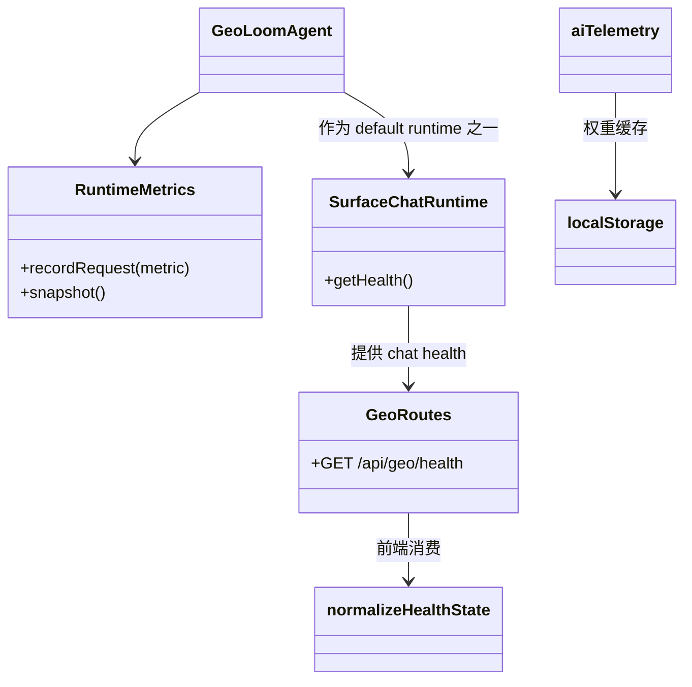

本页聚焦 GeoLoom Agent 中**已经落地、且可由代码直接验证**的可观测性能力：后端运行时指标聚合、健康状态输出、前端健康数据标准化，以及前端 AI 模板反馈遥测。它不讨论日志体系、告警平台或外部监控栈集成，因为当前检索范围内没有可验证的实现证据。对于系统整体链路，可继续阅读[请求生命周期管理：从用户输入到流式响应](7-qing-qiu-sheng-ming-zhou-qi-guan-li-cong-yong-hu-shu-ru-dao-liu-shi-xiang-ying)与[API 路由设计：RESTful 与 SSE 流式传输](22-api-lu-you-she-ji-restful-yu-sse-liu-shi-chuan-shu)。  
Sources: [RuntimeMetrics.ts](backend/src/metrics/RuntimeMetrics.ts#L1-L211), [geo.ts](backend/src/routes/geo.ts#L1-L63), [healthState.ts](src/lib/healthState.ts#L1-L65), [aiTelemetry.ts](src/services/aiTelemetry.ts#L1-L239)

## 可观测性边界：系统当前实际覆盖了什么

从第一性原理看，这个仓库中的“可观测性”不是单一模块，而是由三条可验证链路组成：**后端运行时指标聚合**负责把请求执行结果压缩为统计快照；**后端健康接口**负责把数据库、聊天运行时与技能注册信息合成为 `/health` 响应；**前端遥测服务**负责围绕 AI 模板权重与用户反馈发送轻量级事件，并在浏览器侧缓存权重快照。前端还额外提供了一个 `normalizeHealthState` 适配层，用于把健康接口响应转成稳定 UI 结构。  
Sources: [RuntimeMetrics.ts](backend/src/metrics/RuntimeMetrics.ts#L1-L211), [geo.ts](backend/src/routes/geo.ts#L5-L63), [healthState.ts](src/lib/healthState.ts#L1-L65), [aiTelemetry.ts](src/services/aiTelemetry.ts#L1-L239)

在架构关系上，后端 `/api/geo/health` 是当前最明确的可观测性出口；它调用数据库健康检查，并尝试合并聊天运行时的健康信息，最终把 `metrics`、`dependencies`、`degraded_dependencies`、`skills_registered` 等信息统一返回。前端并不直接依赖后端内部实现，而是通过 `normalizeHealthState` 对不稳定或畸形数据做容错转换，这说明该系统把“健康数据契约稳定化”视为前端可观测性的组成部分。  
Sources: [app.ts](backend/src/app.ts#L17-L31), [geo.ts](backend/src/routes/geo.ts#L16-L63), [healthState.ts](src/lib/healthState.ts#L25-L65), [healthState.spec.js](src/lib/healthState.spec.js#L5-L47)

```mermaid
flowchart LR
    A[请求执行结果] --> B[RuntimeMetrics.recordRequest]
    B --> C[RuntimeMetrics.snapshot]
    C --> D[Chat Runtime 健康信息]
    E[数据库 healthcheck] --> F[/api/geo/health]
    D --> F
    F --> G[前端 normalizeHealthState]
    H[前端 AI 交互] --> I[sendTemplateFeedback]
    J[后端模板权重接口] --> K[refreshTemplateWeights]
    K --> L[localStorage 权重缓存]
```

上图表示两个平行方向：一条是**服务端运行状态观测链**，另一条是**前端 AI 遥测链**。它们共享“轻量、容错、面向 UI 与调试”的特征，而不是 Prometheus 风格的通用基础设施。  
Sources: [RuntimeMetrics.ts](backend/src/metrics/RuntimeMetrics.ts#L72-L211), [geo.ts](backend/src/routes/geo.ts#L16-L63), [aiTelemetry.ts](src/services/aiTelemetry.ts#L94-L239)

## 后端指标模型：RuntimeMetrics 采集的是什么

后端的核心指标容器是 `RuntimeMetrics`。它接受 `RuntimeRequestMetric` 输入，并聚合为 `RuntimeMetricsSnapshot`。从接口定义看，采集维度包含五类：**总体请求量与延迟**、**SQL 校验通过率**、**答案 grounded 比率**、**阶段耗时**、**LLM / tool 执行复杂度**，外加一个“是否存在不必要分析”的布尔计数器。这说明当前指标不是面向机器资源，而是面向**AI 任务执行质量与推理成本**。  
Sources: [RuntimeMetrics.ts](backend/src/metrics/RuntimeMetrics.ts#L1-L56)

`RuntimeMetrics.recordRequest` 的写入方式是典型的**滑动窗口聚合**。类内部维护多个数组：总延迟、意图识别耗时、证据运行耗时、综合生成耗时、LLM 轮数、工具调用次数；每次记录后，如果长度超过 `windowSize` 就裁剪旧数据。默认窗口大小来自构造参数，最低为 1，默认值为 200。这意味着该指标模块更适合运行态近似观测，而不是长期审计存档。  
Sources: [RuntimeMetrics.ts](backend/src/metrics/RuntimeMetrics.ts#L72-L152)

`snapshot()` 输出的快照结构非常明确：`requests_total`、`latency.p50_ms/p95_ms`、`sql.validation_*`、`sql_valid_rate`、`answers.grounded/ungrounded`、`evidence_grounded_answer_rate`、`phase_latency.*`、`llm_rounds.avg/max`、`tool_calls.avg/max`、`unnecessary_analysis_rate`。其中百分位通过本地排序和 `ceil(length * ratio) - 1` 计算，比例值统一保留三位小数。这种实现强调**可解释性优先于精确统计库依赖**。  
Sources: [RuntimeMetrics.ts](backend/src/metrics/RuntimeMetrics.ts#L58-L70), [RuntimeMetrics.ts](backend/src/metrics/RuntimeMetrics.ts#L154-L211)

下表概括了当前后端指标语义：

| 指标域 | 代表字段 | 观测目标 | 计算方式 |
|---|---|---|---|
| 请求吞吐/时延 | `requests_total`, `latency.p50_ms`, `latency.p95_ms` | 判断近期响应速度 | 滑动窗口 + 百分位 |
| SQL 质量 | `sql.validation_attempts`, `sql_valid_rate` | 观测 SQL 校验链是否稳定 | 计数 + 比例 |
| 答案 grounding | `answers.grounded`, `evidence_grounded_answer_rate` | 判断结果是否有证据支撑 | 计数 + 比例 |
| 阶段耗时 | `phase_latency.intent_*`, `evidence_*`, `synthesis_*` | 定位瓶颈阶段 | 分阶段滑动窗口 |
| 推理复杂度 | `llm_rounds.avg/max`, `tool_calls.avg/max` | 观测模型与工具开销 | 数组平均值/最大值 |
| 内容偏移 | `unnecessary_analysis_rate` | 判断是否输出用户未请求分析 | 布尔计数占比 |

Sources: [RuntimeMetrics.ts](backend/src/metrics/RuntimeMetrics.ts#L19-L56), [RuntimeMetrics.ts](backend/src/metrics/RuntimeMetrics.ts#L154-L211)

## “不必要分析”检测：质量观测而非业务拦截

`UnnecessaryAnalysisDetector` 的定位在注释中写得很清楚：**“阶段 0：可观测性埋点，不改变业务行为”**。这意味着它当前只承担质量观测角色，不参与响应裁剪、拒绝或重写。它通过一组中文关键词判断回答中是否包含用户未请求的“机会点、异常点、投资、开店建议、发展潜力、值得关注”等内容。  
Sources: [UnnecessaryAnalysisDetector.ts](backend/src/metrics/UnnecessaryAnalysisDetector.ts#L1-L16)

它的逻辑非常保守：如果用户查询文本本身已经包含这些关键词，则直接返回 `false`；否则只要答案包含任一模式词，就认定存在“不必要分析”。这不是语义模型，而是**规则型质量探针**。因此它的价值在于持续观测回答是否发生“分析越界”，而不是精确理解自然语言。  
Sources: [UnnecessaryAnalysisDetector.ts](backend/src/metrics/UnnecessaryAnalysisDetector.ts#L5-L15)

`GeoLoomAgent` 明确引入了 `RuntimeMetrics` 与 `detectUnnecessaryAnalysis`，说明该主执行运行时已经把这类质量指标视为正式依赖，即便本次未继续展开到具体调用点，至少可以确认指标与探针都位于代理主运行时依赖图中，而不是孤立的未接线工具。  
Sources: [GeoLoomAgent.ts](backend/src/agent/GeoLoomAgent.ts#L54-L56)

## 健康接口：/api/geo/health 暴露了哪些状态

后端健康接口由 `registerGeoRoutes` 注册在 `/health`，而 `createApp` 将整个 geo 路由前缀挂在 `/api/geo` 下，因此其实际路径是 **`/api/geo/health`**。这个接口的第一层职责是运行数据库健康检查：`checkDatabaseHealth()` 成功则视为数据库 ready，失败则标记为 degraded，并附带 `connection_failed` 原因。  
Sources: [app.ts](backend/src/app.ts#L55-L64), [geo.ts](backend/src/routes/geo.ts#L16-L27)

第二层职责是**合并聊天运行时健康信息**。路由通过 `deps.chat?.getHealth?.()` 取得聊天子系统健康快照，再与数据库状态合并为统一响应。返回体中固定包含 `status`、`version`、`services.database`、`llm`、`memory`、`metrics`、`provider_ready`、`dependencies`、`degraded_dependencies`、`skills`、`skills_registered`。这说明健康接口兼具三种用途：依赖可达性检查、运行能力快照、技能注册面观测。  
Sources: [geo.ts](backend/src/routes/geo.ts#L16-L60)

`SurfaceChatRuntime.getHealth()` 当前返回的不是扁平字段，而是 `{ default, narrative }` 两个子运行时健康结果。这一点很关键：路由代码在读取 `chatHealth.llm`、`chatHealth.metrics` 等字段时，实际上期待聊天运行时能提供扁平化健康结构；但 `SurfaceChatRuntime` 只保证返回双运行时容器。因此，当前代码中**已可验证的事实**是：surface 运行时暴露了 default/narrative 双健康视图，而 geo 路由预留了接收扁平健康字段的能力。是否存在更深层 flatten 逻辑，本次证据范围内无法确认。  
Sources: [SurfaceChatRuntime.ts](backend/src/chat/SurfaceChatRuntime.ts#L12-L39), [geo.ts](backend/src/routes/geo.ts#L20-L25), [geo.ts](backend/src/routes/geo.ts#L45-L54)

下表总结健康接口中可以稳定依赖的字段：

| 字段 | 来源 | 含义 |
|---|---|---|
| `status` | 路由固定返回 | 当前接口状态 |
| `version` | 应用启动配置 | 服务版本 |
| `services.database` | 数据库健康检查 | 数据库连接状态 |
| `llm` | chat health 或默认值 | LLM 子系统健康快照 |
| `memory` | chat health 或默认值 | memory 子系统健康快照 |
| `metrics` | chat health | 运行时指标快照挂载位 |
| `provider_ready` | chat health | 模型提供方是否 ready |
| `dependencies` | chat health + database 合并 | 依赖字典 |
| `degraded_dependencies` | chat health + database 合并 | 降级依赖列表 |
| `skills` / `skills_registered` | `SkillRegistry` | 已注册技能及数量 |

Sources: [geo.ts](backend/src/routes/geo.ts#L16-L60)

## 前端健康状态标准化：把不稳定响应变成稳定 UI 数据

前端的 `normalizeHealthState` 是一个典型的**契约整形层**。它接收任意 `payload`，先判断是否为 plain object，再对 `dependencies`、`degraded_dependencies`、`llm`、`memory`、`metrics` 做类型保护。最终输出稳定的 `HealthState`：`status`、`version`、`providerReady`、`llm`、`memory`、`degradedDependencies`、`dependencies`、`skillsRegistered`、`skills`、`metrics`。  
Sources: [healthState.ts](src/lib/healthState.ts#L1-L65)

这种设计的价值在于：即使后端返回的 `dependencies` 不是对象、`degraded_dependencies` 不是数组，前端仍会回退为空集合，而不是把异常数据传播进组件树。测试文件直接验证了两类行为：一是正常情况下会把 `provider_ready`、`skills_registered`、依赖降级原因等字段正确转成前端命名；二是畸形依赖容器会被忽略。  
Sources: [healthState.ts](src/lib/healthState.ts#L36-L63), [healthState.spec.js](src/lib/healthState.spec.js#L5-L47)

这意味着前端健康可观测性不只是“展示后端结果”，而是在代码层面承担了**防御式解析**职责。对于中级开发者而言，这一点很重要：前端不是监控的消费者终端，而是**健康契约的二次稳定器**。  
Sources: [healthState.ts](src/lib/healthState.ts#L25-L65), [healthState.spec.js](src/lib/healthState.spec.js#L38-L47)

## 前端 AI 遥测：模板权重缓存与反馈事件

`src/services/aiTelemetry.ts` 展示了当前前端 AI 遥测的两项能力：**模板权重读取/刷新**与**模板反馈上报**。它首先定义了 `TemplateWeightsSnapshot`、`TemplateFeedbackPayload`、`NormalizedIntentMeta` 等类型，随后在模块级维护 `cachedWeights` 与 `sessionId`。`sessionId` 由 `createSessionId()` 生成，格式为 `session_<timestamp>_<random>`，并可通过 `getTelemetrySessionId` 与 `resetTelemetrySessionId` 访问。  
Sources: [aiTelemetry.ts](src/services/aiTelemetry.ts#L3-L68), [aiTelemetry.ts](src/services/aiTelemetry.ts#L113-L128)

模板权重刷新由 `refreshTemplateWeights()` 完成。它具备三层保护：第一，若运行在 V4 模式则直接返回本地快照，不访问远端；第二，若未强制刷新且缓存未过 TTL，则直接复用本地缓存；第三，即使网络失败或响应不合法，也会静默降级回现有缓存。权重成功获取后会写入 `localStorage` 的 `ai_template_weights_v1`。这说明其设计目标是**不影响主交互链路的弱依赖遥测**。  
Sources: [aiTelemetry.ts](src/services/aiTelemetry.ts#L40-L48), [aiTelemetry.ts](src/services/aiTelemetry.ts#L94-L167)

模板反馈发送由 `sendTemplateFeedback()` 实现。它要求必须存在 `traceId`，否则直接返回 `false`；请求体中会统一转换成 `trace_id`、`event_type`、`template_id`、`intent_meta`、`ts`、`extra` 结构，其中 `extra` 会补充 `session_id` 与 `source`，默认来源是 `ai-panel`。请求目标为 `${AI_API_BASE}/template-feedback`，且在 V4 模式下直接短路为 `false`。这表明当前前端遥测是**有 trace 约束、可按后端版本门控**的事件上报机制。  
Sources: [aiTelemetry.ts](src/services/aiTelemetry.ts#L169-L239)

测试文件验证了一个关键健壮性约束：如果服务器返回的 `weights` 是数组等畸形结构，`refreshTemplateWeights()` 不会把它原样持久化，而是会将 `weights` 归一化为空对象，并写入安全缓存。这直接证明该遥测模块不仅负责“发事件”，还负责**防止坏遥测数据污染本地状态**。  
Sources: [aiTelemetry.spec.js](src/services/aiTelemetry.spec.js#L17-L37), [aiTelemetry.ts](src/services/aiTelemetry.ts#L50-L56), [aiTelemetry.ts](src/services/aiTelemetry.ts#L153-L162)

## 模块交互关系：可观测性并不是旁路，而是内嵌在运行时中的

虽然当前仓库没有单独的 observability package，但代码关系显示它已经深入主执行路径：`GeoLoomAgent` 依赖 `RuntimeMetrics` 与 `detectUnnecessaryAnalysis`，`SurfaceChatRuntime` 聚合多个 surface 的健康信息，`geo` 路由把这些状态与数据库健康、技能注册清单合并成接口输出，前端再通过 `normalizeHealthState` 与 `aiTelemetry` 把状态可视化或继续上报。这是一种**“内嵌式观测”架构**，而不是独立旁路系统。  
Sources: [GeoLoomAgent.ts](backend/src/agent/GeoLoomAgent.ts#L54-L56), [SurfaceChatRuntime.ts](backend/src/chat/SurfaceChatRuntime.ts#L12-L39), [geo.ts](backend/src/routes/geo.ts#L16-L60), [healthState.ts](src/lib/healthState.ts#L48-L63), [aiTelemetry.ts](src/services/aiTelemetry.ts#L135-L239)



这张关系图反映的是代码中可直接验证的依赖方向，而不是推测性的运行顺序。它说明可观测性已经覆盖了**采集、汇总、暴露、消费、再上报**五个阶段，只是每个阶段都以轻量实现存在。  
Sources: [RuntimeMetrics.ts](backend/src/metrics/RuntimeMetrics.ts#L72-L211), [SurfaceChatRuntime.ts](backend/src/chat/SurfaceChatRuntime.ts#L12-L39), [geo.ts](backend/src/routes/geo.ts#L16-L60), [healthState.ts](src/lib/healthState.ts#L48-L63), [aiTelemetry.ts](src/services/aiTelemetry.ts#L67-L167)

## 设计特征总结：当前可观测性的优点与约束

从已验证实现看，这套可观测性设计有三个鲜明优点。第一，**业务语义强**：它跟踪的是 grounded rate、tool call、phase latency 这类 AI 代理特有指标，而不是泛化 CPU/内存。第二，**容错明确**：健康状态与模板权重都对畸形数据有硬保护。第三，**侵入性低**：例如不必要分析探针只做埋点，不改业务行为；模板反馈网络异常也静默降级。  
Sources: [RuntimeMetrics.ts](backend/src/metrics/RuntimeMetrics.ts#L5-L17), [UnnecessaryAnalysisDetector.ts](backend/src/metrics/UnnecessaryAnalysisDetector.ts#L1-L16), [healthState.ts](src/lib/healthState.ts#L25-L65), [aiTelemetry.ts](src/services/aiTelemetry.ts#L147-L167)

它的约束同样清晰。首先，当前证据只显示**聚合与接口输出**，未显示统一指标出口如 Prometheus 文本格式。其次，`RuntimeMetrics` 使用内存滑动窗口，天然不具备跨进程、跨重启持久性。再次，`SurfaceChatRuntime.getHealth()` 与 `/health` 路由期望的扁平健康结构之间存在一个可见的接口形态差异，至少说明这部分契约仍处于演化中。  
Sources: [RuntimeMetrics.ts](backend/src/metrics/RuntimeMetrics.ts#L72-L97), [geo.ts](backend/src/routes/geo.ts#L20-L25), [SurfaceChatRuntime.ts](backend/src/chat/SurfaceChatRuntime.ts#L33-L38)

## 面向开发者的阅读建议

如果你想继续理解这些指标是在请求链路的哪个阶段被填充，下一步最合理的是阅读[请求生命周期管理：从用户输入到流式响应](7-qing-qiu-sheng-ming-zhou-qi-guan-li-cong-yong-hu-shu-ru-dao-liu-shi-xiang-ying)。如果你更关心 `/api/geo/health` 与 SSE/REST 出口如何组织，应转到[API 路由设计：RESTful 与 SSE 流式传输](22-api-lu-you-she-ji-restful-yu-sse-liu-shi-chuan-shu)。如果你想理解 `traceId`、AI 面板事件与前端交互来源，可继续阅读[AI 聊天组件：流式对话与上下文绑定](17-ai-liao-tian-zu-jian-liu-shi-dui-hua-yu-shang-xia-wen-bang-ding)。