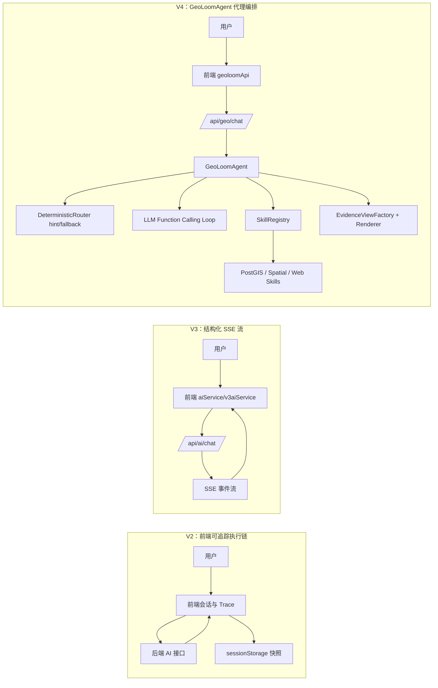
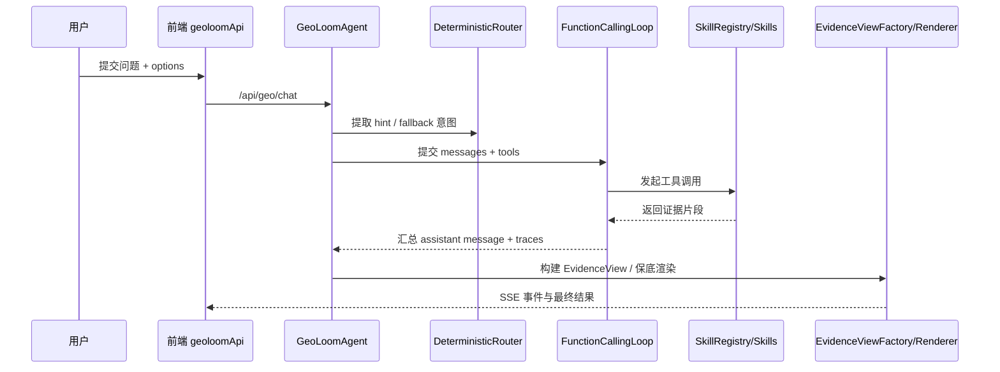

这页聚焦 **GeoLoom Agent 从 V2、V3 走到 V4 的可验证架构演进轨迹**，目标不是复述所有功能，而是解释系统如何从“前端可追踪的流程化 AI 调用”逐步转向“以后端代理编排为中心、以证据视图为输出、并持续向 LLM-first 与 embedding-first 收敛”的架构。这里仅讨论版本演进本身、关键分层变化、责任迁移与当前 V4 的演化方向。Sources: [v2TraceSession.ts](src/utils/v2TraceSession.ts#L1-L196), [v3aiService.ts](src/utils/v3aiService.ts#L1-L200), [aiService.ts](src/utils/aiService.ts#L101-L121), [geoloomApi.ts](src/lib/geoloomApi.ts#L22-L113), [GeoLoomAgent.ts](backend/src/agent/GeoLoomAgent.ts#L70-L118)

## 先看结论：这次迭代的第一性原理

从第一性原理看，这个项目在重构中的核心问题不是“换了多少文件”，而是 **谁负责理解意图、谁负责组织证据、谁负责生成回答**。V2 更像一次可追踪的会话执行链；V3 开始引入标准化 SSE 事件流与前端请求选项收敛；V4 则把主控制权推向 `GeoLoomAgent`，由它统一接管技能注册、函数调用循环、证据构建与回答策略，并把前端接口收敛到 `/api/geo/*` 这一组更明确的代理入口。Sources: [v2TraceSession.ts](src/utils/v2TraceSession.ts#L18-L31), [v3RequestOptions.ts](src/utils/v3RequestOptions.ts#L1-L45), [geoloomApi.ts](src/lib/geoloomApi.ts#L26-L113), [server.ts](backend/src/server.ts#L226-L257), [GeoLoomAgent.ts](backend/src/agent/GeoLoomAgent.ts#L31-L68)

## 版本演进总览

在实现层面，V2、V3、V4 不是简单线性替换，而是 **控制面逐步后移、协议逐步规范化、推理逐步从规则与模板向代理式编排迁移**。V2 的明确证据是前端保留了 `v2-agent-trace-session` 会话快照，包括 `architecture_mode`、事件列表、最新摘要与答案，这说明当时用户侧需要显式保存执行轨迹。V3 则围绕 `/api/ai/chat` 建立了结构化 SSE 流，前端可识别 `stage`、`thinking`、`intent_preview`、`refined_result` 等事件。到了 V4，前端默认入口可切换到 `/api/geo/chat`，后端由 `GeoLoomAgent` 统一整合路由、技能、记忆、embedding 索引与证据工厂，表明系统重心已经转向后端代理内核。Sources: [v2TraceSession.ts](src/utils/v2TraceSession.ts#L1-L31), [v3aiService.ts](src/utils/v3aiService.ts#L4-L24), [v3aiService.ts](src/utils/v3aiService.ts#L88-L200), [aiService.ts](src/utils/aiService.ts#L101-L113), [geoloomApi.ts](src/lib/geoloomApi.ts#L56-L113), [server.ts](backend/src/server.ts#L214-L257)

## 架构关系图：从前端追踪到后端代理中枢

下面这张图用于帮助理解“控制权迁移”的结构性变化。阅读前提是：**Mermaid 图中的箭头表示主控制流，而不是所有数据依赖**；重点是看每一代里，意图判断、证据获取、回答生成分别靠近哪一层。

Sources: [v2TraceSession.ts](src/utils/v2TraceSession.ts#L51-L77), [v3aiService.ts](src/utils/v3aiService.ts#L88-L200), [geoloomApi.ts](src/lib/geoloomApi.ts#L56-L113), [server.ts](backend/src/server.ts#L80-L159), [GeoLoomAgent.ts](backend/src/agent/GeoLoomAgent.ts#L23-L39), [functionCallingLoop.ts](backend/src/llm/functionCallingLoop.ts#L105-L172)

## V2：以会话追踪为中心的早期架构形态

V2 最鲜明的特征不是复杂的模型链，而是 **对执行过程的显式留痕**。`startV2TraceSession`、`appendV2TraceEvent`、`finalizeV2TraceSession` 围绕一个浏览器存储键维护完整快照，快照内含 `session_id`、`query`、`architecture_mode`、`trace_id`、`job_state`、`latest_summary` 和事件数组。这说明当时架构把“过程可见性”作为重要目标，前端不仅消费结果，还承担了部分状态承载责任。Sources: [v2TraceSession.ts](src/utils/v2TraceSession.ts#L1-L31), [v2TraceSession.ts](src/utils/v2TraceSession.ts#L83-L191)

V2 的这种设计意味着，系统在该阶段更接近 **“流式任务执行 + 前端留档”** 模式：后端发事件，前端积累事件，最终形成可恢复快照。`MAX_TRACE_EVENTS` 被固定为 120，且追加逻辑会持续更新 `trace_id`、`job_id`、`job_state` 与摘要文本，说明追踪对象并不只是聊天文本，而是一次具有状态推进语义的代理任务。Sources: [v2TraceSession.ts](src/utils/v2TraceSession.ts#L1-L3), [v2TraceSession.ts](src/utils/v2TraceSession.ts#L129-L168)

从重构视角看，V2 的局限也因此清晰：**状态语义外露在前端，架构模式以“观察执行”而不是“抽象协议”组织**。这为后续 V3 的 SSE 事件规范化与 V4 的后端代理内聚化提供了演进动机。Sources: [v2TraceSession.ts](src/utils/v2TraceSession.ts#L18-L31), [v3aiService.ts](src/utils/v3aiService.ts#L5-L24), [geoloomApi.ts](src/lib/geoloomApi.ts#L34-L54)

## V3：以结构化 SSE 协议为中心的过渡层

V3 的关键不是完全换架构，而是把“可观察执行”升级成 **标准化事件协议**。`v3aiService.ts` 定义了固定的元事件集合，包括 `stage`、`thinking`、`reasoning`、`intent_preview`、`pois`、`boundary`、`stats`、`refined_result`、`done` 和 `error`，并通过 `validateStructuredEvent` 校验事件负载。这说明 V3 已经明显在做协议收敛：前端不再只是被动保存事件，而是开始理解事件类型及其语义边界。Sources: [v3aiService.ts](src/utils/v3aiService.ts#L4-L24), [v3aiService.ts](src/utils/v3aiService.ts#L148-L200)

V3 还引入了一个重要的工程化动作：**请求参数白名单化**。`filterV3ChatOptions` 只允许 `requestId`、`sessionId`、`clientMetrics`、`spatialContext`、`analysisDepth` 等有限键进入聊天调用，这代表系统已经意识到前端直传选项会让协议失控，因此在版本过渡中先做参数面收缩。Sources: [v3RequestOptions.ts](src/utils/v3RequestOptions.ts#L1-L45)

在前端服务层，`aiService.ts` 通过 `VITE_BACKEND_VERSION` 区分 `v3` 与 `v4` 模式，并在 V3 模式下将后端 API 基址设为 `/api/ai`。这显示出 V3 本质上是 **接口组织与流式交互的中间形态**：它还保留旧路径命名，但已经具备较完整的结构化流能力。Sources: [aiService.ts](src/utils/aiService.ts#L101-L121)

## V3 到 V4：真正变化的是“主控制权”而不是路径名

从代码证据看，V3 到 V4 的核心跃迁并不是简单把 `/api/ai/chat` 改成 `/api/geo/chat`，而是 **把编排权集中到 `GeoLoomAgent`**。V4 的服务器启动流程中，后端先初始化 `PostgisPool`、`SQLSandbox`、`SkillRegistry`、短长期记忆、远程桥接与多类技能，然后将这些能力注入一个 `GeoLoomAgent` 实例，再把它挂入 `SurfaceChatRuntime`。这说明 V4 已不再把后端视为单一聊天接口，而是一个明确的代理运行时。Sources: [server.ts](backend/src/server.ts#L50-L79), [server.ts](backend/src/server.ts#L80-L159), [server.ts](backend/src/server.ts#L226-L257)

前端侧也同步出现了协议切面变化：`geoloomApi.ts` 专门面向 `/api/geo/health` 和 `/api/geo/chat`，并在接收 SSE 块后按事件名进行 schema 校验，再分发 `schema_error` 或正常事件。这表明 V4 的前端接入层更轻，更像 **协议消费者**，而不再承担执行语义管理。Sources: [geoloomApi.ts](src/lib/geoloomApi.ts#L22-L32), [geoloomApi.ts](src/lib/geoloomApi.ts#L56-L113)

## V4 的内核：统一代理、技能注册与函数调用循环

V4 的 `GeoLoomAgent` 是版本演进的真正拐点。它同时依赖 `EvidenceViewFactory`、`Renderer`、LLM Provider、`runFunctionCallingLoop`、`SkillRegistry`、分类索引、POI embedding 缓存、意图分类器、记忆系统与依赖状态聚合器。这种依赖形态本身就是架构信号：**V4 把意图解析、证据拼装、技能调用、结果呈现统一收敛在一个代理核心中**。Sources: [GeoLoomAgent.ts](backend/src/agent/GeoLoomAgent.ts#L23-L68)

函数调用循环的实现进一步证明了这一点。`runFunctionCallingLoop` 在每轮向 provider 发送 `messages + tools`，根据返回的 `toolCalls` 组织执行批次，并通过 `seenFingerprints` 防止重复调用同一工具与参数组合。它还按 `resolve_anchor`、`evidence_fetch`、`semantic_refinement` 将工具划分波次，说明 V4 已经把“工具调用顺序”设计为运行时逻辑，而不是静态模板。Sources: [functionCallingLoop.ts](backend/src/llm/functionCallingLoop.ts#L24-L63), [functionCallingLoop.ts](backend/src/llm/functionCallingLoop.ts#L65-L103), [functionCallingLoop.ts](backend/src/llm/functionCallingLoop.ts#L105-L172)

这使 V4 与早期版本在本质上拉开差距：**早期版本是事件驱动的 AI 服务，V4 是带有运行策略的工具代理**。Sources: [v3aiService.ts](src/utils/v3aiService.ts#L88-L200), [GeoLoomAgent.ts](backend/src/agent/GeoLoomAgent.ts#L70-L118), [functionCallingLoop.ts](backend/src/llm/functionCallingLoop.ts#L105-L172)

## 路由器的降级：从主判官到 hint/fallback

当前仓库中的演进计划直接指出，V4 的 area insight 恢复目标之一，是把 `DeterministicRouter` 从“主决策器”降级为 “hint / fallback 层”。计划明确要求：保留锚点抽取、`user_location`/`map_view` 识别、clarification hint 与 provider 不可用时的 deterministic fallback，但不再让 router 提前写死 `area_overview` 的证据链和回答路径。Sources: [2026-04-08-v4-area-insight-recovery.md](docs/plans/2026-04-08-v4-area-insight-recovery.md#L53-L77)

这一方向与当前 `DeterministicRouter` 的代码角色是对齐的。它主要做模式匹配：分类别名识别、模糊锚点判定、附近/最近/对比锚点抽取、澄清提示生成与 `spatialContext` 检查。测试也证明它现在面向的是查询归类和边界控制，例如把“这里适合开什么店”在存在 viewport 时路由为 `area_overview + map_view`，缺乏上下文时则要求澄清。Sources: [DeterministicRouter.ts](backend/src/chat/DeterministicRouter.ts#L9-L38), [DeterministicRouter.ts](backend/src/chat/DeterministicRouter.ts#L75-L116), [DeterministicRouter.ts](backend/src/chat/DeterministicRouter.ts#L166-L196), [DeterministicRouter.spec.ts](backend/tests/unit/chat/DeterministicRouter.spec.ts#L33-L59), [DeterministicRouter.spec.ts](backend/tests/unit/chat/DeterministicRouter.spec.ts#L158-L190)

换言之，V4 的重构不是删除确定性组件，而是 **重新安放其权力边界**。Sources: [2026-04-08-v4-area-insight-recovery.md](docs/plans/2026-04-08-v4-area-insight-recovery.md#L13-L20), [DeterministicRouter.ts](backend/src/chat/DeterministicRouter.ts#L166-L196)

## LLM-first：V4 在意图理解上的一次权力回收

2026-04-09 的计划文档进一步给出另一个清晰信号：当 provider 可用时，`GeoLoomAgent` 应该 **始终先尝试由 LLM 推导 intent**，`DeterministicRouter` 只作为后备。文档明确要求扩展 LLM 意图字段 `placeName`、`secondaryPlaceName`、`targetCategory`，并让 provider-ready 请求不再先看 router 是否失败。Sources: [2026-04-09-llm-first-intent.md](docs/plans/2026-04-09-llm-first-intent.md#L5-L8), [2026-04-09-llm-first-intent.md](docs/plans/2026-04-09-llm-first-intent.md#L43-L81)

这说明 V4 的演进中存在一次重要的认知转向：**规则层不再被视为默认真相，而只是低成本护栏**。对于复杂自然语言，系统希望把 `queryType`、`anchorSource`、`placeName` 的主解释权交给模型，而不是让模型去迎合 router 的预分类。Sources: [2026-04-09-llm-first-intent.md](docs/plans/2026-04-09-llm-first-intent.md#L48-L71)

如果把这一点与上节结合，就能看到 V4 的主线不是“更强规则”，而是 **规则降级 + 代理上移**。Sources: [2026-04-08-v4-area-insight-recovery.md](docs/plans/2026-04-08-v4-area-insight-recovery.md#L53-L77), [2026-04-09-llm-first-intent.md](docs/plans/2026-04-09-llm-first-intent.md#L43-L81)

## Embedding-first：V4 继续从“理解依赖 LLM”转向“召回依赖向量”

如果说 LLM-first 解决的是“谁解释问题”，那么 2026-04-11 的文档则在推进另一个方向：**让系统在分类、召回、对齐上减少对 LLM 的刚性依赖**。该计划明确指出现有瓶颈包括：品类解析依赖 LLM 结构化输出、品类 embedding 输入太粗、web 搜索与 POI 匹配仍停留在 name matching、PostGIS 查询缺乏语义排序等。Sources: [2026-04-11-embedding-first-architecture.md](docs/plans/2026-04-11-embedding-first-architecture.md#L6-L20)

这一演进已经部分落地到服务启动逻辑。`server.ts` 会构建 `CategoryEmbeddingIndex`、校验 `pgvector` 扩展与 `pois.embedding` 列、统计 embedding 覆盖率，并初始化 `PoiEmbeddingCache` 与 `EmbeddingIntentClassifier`，然后把这些对象注入 `GeoLoomAgent`。这证明 V4 当前不是“纯 LLM-first”，而是正在转向 **LLM 负责高阶编排，embedding 负责高频理解与召回** 的混合架构。Sources: [server.ts](backend/src/server.ts#L175-L224), [server.ts](backend/src/server.ts#L226-L235), [GeoLoomAgent.ts](backend/src/agent/GeoLoomAgent.ts#L45-L49)

因此，从 V2 到 V4 的演进并非单轴升级，而是双轴迁移：一条轴把控制权从前端和规则挪向代理与 LLM，另一条轴把高频匹配从 LLM 挪向向量索引与语义排序。Sources: [2026-04-09-llm-first-intent.md](docs/plans/2026-04-09-llm-first-intent.md#L43-L81), [2026-04-11-embedding-first-architecture.md](docs/plans/2026-04-11-embedding-first-architecture.md#L56-L116), [server.ts](backend/src/server.ts#L175-L235)

## 证据层的重构：从“查询结果”到“分析视图”

V4 另一个决定性变化，是把回答前的数据组织方式抽象成 `EvidenceView`。`AreaOverviewView` 不只是收集 POI 列表，它会构造 buckets、hotspots、AOI context、landuse context，并结合代表样本优先级、异常信号、机会信号等生成一个更接近分析对象的视图。尤其值得注意的是，它引入了大 viewport 下的代表锚点优先逻辑，而不是把代表样本简单理解为若干随机 POI。Sources: [AreaOverviewView.ts](backend/src/evidence/views/AreaOverviewView.ts#L37-L74), [AreaOverviewView.ts](backend/src/evidence/views/AreaOverviewView.ts#L143-L193), [AreaOverviewView.ts](backend/src/evidence/views/AreaOverviewView.ts#L14-L24)

与之对应，`Renderer` 在当前代码中承担的是 **把证据视图压缩成保守摘要** 的角色。它根据 `dominantCategories`、热点、代表样本、机会信号和语义标签来生成人类可读段落。这意味着系统已经从“SQL 返回什么就展示什么”转向“先构建分析语义层，再决定如何表达”。Sources: [Renderer.ts](backend/src/evidence/Renderer.ts#L53-L99), [Renderer.ts](backend/src/evidence/Renderer.ts#L102-L152), [Renderer.ts](backend/src/evidence/Renderer.ts#L165-L189)

演进计划也明确要求把 `area_overview` Evidence View 升级为携带 `areaProfile`、`hotspots`、`anomalySignals`、`opportunitySignals`、`representativeSamples`、`confidence` 与 `semanticHints` 的结构，并将 `Renderer` 重新定位为 provider 不可用时的保底摘要器。这进一步确认：**V4 的核心不是文本生成，而是证据结构化**。Sources: [2026-04-08-v4-area-insight-recovery.md](docs/plans/2026-04-08-v4-area-insight-recovery.md#L175-L198)

## 各版本关键模式对比

| 维度 | V2 | V3 | V4 |
|---|---|---|---|
| 主控制重心 | 前端 trace 会话 | 结构化流协议 | 后端代理运行时 |
| 前端角色 | 保存与恢复执行快照 | 消费 SSE 元事件 | 调用 `/api/geo/*` 协议接口 |
| 后端角色 | 响应流式事件 | 提供标准化 AI 流 | 统一编排技能、记忆、证据、回答 |
| 意图理解 | 未体现统一代理抽象，偏执行追踪 | 仍以聊天服务为主 | Router + LLM/Embedding 分类器并存，持续向 LLM-first/embedding-first 演化 |
| 输出组织 | 事件与摘要 | 事件类型化 | EvidenceView + Renderer/LLM |
| 典型技术信号 | sessionStorage trace | SSE event schema + option allowlist | SkillRegistry + FunctionCallingLoop + Embedding 索引 |

Sources: [v2TraceSession.ts](src/utils/v2TraceSession.ts#L1-L31), [v2TraceSession.ts](src/utils/v2TraceSession.ts#L105-L191), [v3aiService.ts](src/utils/v3aiService.ts#L4-L24), [v3RequestOptions.ts](src/utils/v3RequestOptions.ts#L1-L45), [geoloomApi.ts](src/lib/geoloomApi.ts#L56-L113), [server.ts](backend/src/server.ts#L80-L159), [server.ts](backend/src/server.ts#L175-L235), [functionCallingLoop.ts](backend/src/llm/functionCallingLoop.ts#L105-L172)

## 当前 V4 的“进行时”状态：不是终点，而是可见的重构平台

从测试与计划文档交叉看，当前 V4 已经是代理式平台，但仍处于 **“主路径持续收敛”** 状态。测试中已经出现 `intentMode: 'agent_full_loop'`、语义选择结果参与 `area_overview` 证据构建等断言，说明系统正把 area insight 从固定 SQL 流程恢复到真正的 agent orchestration。Sources: [GeoLoomAgent.spec.ts](backend/tests/unit/agent/GeoLoomAgent.spec.ts#L119-L200), [2026-04-08-v4-area-insight-recovery.md](docs/plans/2026-04-08-v4-area-insight-recovery.md#L23-L50)

同样，脚本层也体现出 V4 已被当作独立运行栈处理。`run-backend-v4.mjs` 为后端注入 `SPATIAL_ENCODER_BASE_URL`、`SPATIAL_VECTOR_BASE_URL`、`ROUTING_BASE_URL`、`NER_URL`、`CRAWL4AI_URL` 等依赖，`v4-dependency-adapter.mjs` 则提供了 dependency adapter 和 encoder adapter 的本地占位服务。这说明 V4 不只是代码版本标签，而是围绕新依赖拓扑组织起来的一套运行模型。Sources: [run-backend-v4.mjs](scripts/run-backend-v4.mjs#L11-L29), [run-backend-v4.mjs](scripts/run-backend-v4.mjs#L31-L64), [v4-dependency-adapter.mjs](scripts/v4-dependency-adapter.mjs#L1-L130)

## 一个更精确的理解框架：V2、V3、V4 分别解决了什么问题

若用架构问题来归纳，这三代版本分别在解决不同层次的问题。**V2 解决“怎么追踪一次 AI 执行”**，**V3 解决“怎么把 AI 流变成可校验协议”**，**V4 解决“怎么把地理分析系统组织成可编排代理”**。这也是为什么 V4 会同时出现 `SkillRegistry`、`FunctionCallingLoop`、`EvidenceViewFactory`、`EmbeddingIntentClassifier` 与多类桥接服务：它承担的已经不是单一问答，而是一个面向空间分析任务的代理平台。Sources: [v2TraceSession.ts](src/utils/v2TraceSession.ts#L105-L191), [v3aiService.ts](src/utils/v3aiService.ts#L153-L199), [server.ts](backend/src/server.ts#L80-L159), [GeoLoomAgent.ts](backend/src/agent/GeoLoomAgent.ts#L31-L68), [functionCallingLoop.ts](backend/src/llm/functionCallingLoop.ts#L105-L172)

## 交互图：V4 中控制权如何流动

下面这张图专门展示 V4 当前的职责边界。阅读前提是：图中的 `Router` 表示 hint/fallback，不代表它总是主导执行；真正需要关注的是 `GeoLoomAgent -> LLM Loop -> Skills -> EvidenceView` 的主链条。

Sources: [geoloomApi.ts](src/lib/geoloomApi.ts#L56-L113), [GeoLoomAgent.ts](backend/src/agent/GeoLoomAgent.ts#L23-L39), [functionCallingLoop.ts](backend/src/llm/functionCallingLoop.ts#L105-L172), [2026-04-08-v4-area-insight-recovery.md](docs/plans/2026-04-08-v4-area-insight-recovery.md#L112-L138)

## 对高级开发者最重要的判断

对高级开发者而言，最值得把握的不是“现在已经完全 V4 化了没有”，而是 **系统演进的稳定方向已经足够明确**：  
**第一，前端正在退居协议消费层；第二，确定性路由器正在退居护栏层；第三，后端代理正在成为唯一主编排中心；第四，证据视图正在取代原始查询结果成为回答输入；第五，embedding 正在接管高频理解与召回任务。** 这些变化在代码、测试与计划文档中都能互相印证。Sources: [geoloomApi.ts](src/lib/geoloomApi.ts#L56-L113), [DeterministicRouter.spec.ts](backend/tests/unit/chat/DeterministicRouter.spec.ts#L158-L190), [GeoLoomAgent.spec.ts](backend/tests/unit/agent/GeoLoomAgent.spec.ts#L119-L200), [2026-04-09-llm-first-intent.md](docs/plans/2026-04-09-llm-first-intent.md#L43-L81), [2026-04-11-embedding-first-architecture.md](docs/plans/2026-04-11-embedding-first-architecture.md#L56-L116)

## 建议的继续阅读路径

如果你想从本页继续深入，最合理的顺序是先看 [智能体编排：技能调度与任务执行](20-zhi-neng-ti-bian-pai-ji-neng-diao-yu-ren-wu-zhi-xing) 理解 V4 代理如何运行，再看 [请求生命周期管理：从用户输入到流式响应](7-qing-qiu-sheng-ming-zhou-qi-guan-li-cong-yong-hu-shu-ru-dao-liu-shi-xiang-ying) 理解请求在系统中的传播路径；如果你关心 V4 的证据表达层，则应继续阅读 [证据生成与可视化：空间证据卡与叙事模式](8-zheng-ju-sheng-cheng-yu-ke-shi-hua-kong-jian-zheng-ju-qia-yu-xu-shi-mo-shi)；如果你更关心向量化方向，则应继续阅读 [FAISS 索引与语义检索：高效空间匹配](14-faiss-suo-yin-yu-yu-yi-jian-suo-gao-xiao-kong-jian-pi-pei)。Sources: [server.ts](backend/src/server.ts#L76-L159), [GeoLoomAgent.ts](backend/src/agent/GeoLoomAgent.ts#L31-L68), [2026-04-11-embedding-first-architecture.md](docs/plans/2026-04-11-embedding-first-architecture.md#L120-L160)