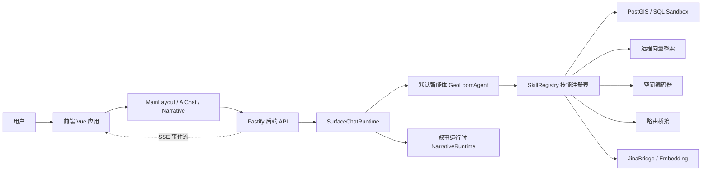
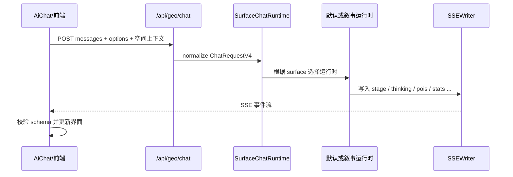

这一页的目标，是帮助初学者先建立 **GeoLoom Agent 作为“前端界面 + 后端服务 + AI/空间引擎”三层协作系统** 的整体认知，而不是直接陷入某个单独模块的细节。仓库本身明确说明，这不是一个只保留演示 UI 的前端项目，而是把完整前端框架壳、V4 后端、真实空间依赖适配服务、编码器服务以及测试/构建链路一起迁移出来，使其可以作为独立整栈系统运行。Sources: [README.md](README.md#L13-L40)

从一阶原理看，这个系统解决的问题可以拆成三件事：**前端负责承接用户交互与地图上下文，后端负责路由、编排与统一 API 契约，AI/空间引擎负责推理、检索和空间计算**。这种分层在代码里有直接证据：前端通过 Vue Router 挂载主布局与叙事视图；后端通过 Fastify 注册 `/api/geo`、`/api/spatial`、`/api/category` 等接口；而聊天运行时又继续把请求分派到默认智能体运行时与叙事运行时。Sources: [src/router/index.ts](src/router/index.ts#L1-L33) [backend/src/app.ts](backend/src/app.ts#L33-L66) [backend/src/chat/SurfaceChatRuntime.ts](backend/src/chat/SurfaceChatRuntime.ts#L12-L39)

对初学者最重要的判断标准不是“目录很多”，而是要先看 **系统启动时到底拉起了哪些协作单元**。根目录脚本定义显示，`npm run dev:v4` 会并发启动前端、真实依赖适配服务、空间编码器服务和 V4 后端四个进程；README 也进一步给出默认端口：前端 `3000`、依赖服务 `3411`、编码器 `8100`、后端 `3210`。因此，这个项目不是浏览器直接调用 AI，也不是单个 Node 服务包办一切，而是一个 **多进程协作的整栈架构**。Sources: [package.json](package.json#L6-L45) [README.md](README.md#L41-L73)

## 先看全局：系统如何分层

可以把 GeoLoom Agent 理解成三个协同层次。**展示层** 是 Vue 3 前端，负责页面路由、地图界面、控制面板、AI 对话面板与叙事视图；**应用层** 是 Fastify 后端，负责接收请求、暴露统一接口、维护技能注册表、汇总健康状态；**能力层** 则是各种 AI 与空间依赖，包括默认智能体、叙事运行时、PostGIS、远程向量检索、空间编码器与路由桥接。Sources: [src/main.ts](src/main.ts#L1-L31) [src/router/index.ts](src/router/index.ts#L1-L33) [backend/src/server.ts](backend/src/server.ts#L50-L78) [backend/src/server.ts](backend/src/server.ts#L226-L257)

在实现上，前端应用入口非常轻：`src/main.ts` 只负责创建 Vue 应用、挂载路由并渲染 `App.vue`；`App.vue` 又只输出 `<router-view>`。这说明页面级结构控制并不写在根组件，而是交给路由目标组件，形成“入口极薄、布局独立”的组织方式。对初学者来说，这意味着“你看到的主界面”并不在 `App.vue`，而主要在 `MainLayout.vue` 和叙事视图中。Sources: [src/main.ts](src/main.ts#L1-L31) [src/App.vue](src/App.vue#L1-L17) [src/router/index.ts](src/router/index.ts#L9-L30)

后端的入口则更像“装配厂”。`backend/src/server.ts` 先构造数据库连接池、SQL 沙箱、短期/长期记忆、会话管理器、远程桥接、Embedding 索引和意图分类器，再创建默认聊天运行时 `GeoLoomAgent` 与叙事运行时 `NarrativeRuntime`，最后通过 `SurfaceChatRuntime` 把二者包装成一个统一聊天入口，再交给 `createApp()` 暴露 HTTP 服务。这个顺序表明：**HTTP 只是外壳，真正核心是运行时装配与技能编排**。Sources: [backend/src/server.ts](backend/src/server.ts#L50-L78) [backend/src/server.ts](backend/src/server.ts#L214-L257)

下面这张图可以帮助你把三层协同关系先固定在脑中。阅读 Mermaid 图前要先知道：方框代表运行单元，箭头代表调用方向；其中 “SSE” 表示后端向前端持续推送流式事件，而不是一次性返回整块结果。Sources: [src/lib/geoloomApi.ts](src/lib/geoloomApi.ts#L56-L112) [backend/src/routes/chat.ts](backend/src/routes/chat.ts#L69-L90)



Sources: [backend/src/server.ts](backend/src/server.ts#L226-L257) [backend/src/app.ts](backend/src/app.ts#L43-L64) [backend/src/chat/SurfaceChatRuntime.ts](backend/src/chat/SurfaceChatRuntime.ts#L12-L39)

## 可视化项目结构：哪些目录代表架构主干

对于当前页面而言，最值得关注的不是全部目录，而是能解释协同关系的主干目录。下表把“前端、后端、共享契约、启动脚本”四个层面压缩到一个视图里，帮助你快速建立代码地图。Sources: [README.md](README.md#L15-L39)

| 层次 | 关键目录/文件 | 在架构中的作用 |
|---|---|---|
| 前端界面 | `src/`、`src/MainLayout.vue`、`src/components/AiChat.vue` | 承载地图、控制面板、AI 对话与叙事界面 |
| 后端应用 | `backend/src/`、`backend/src/server.ts`、`backend/src/app.ts` | 暴露 API、装配运行时、注册技能与依赖 |
| 共享协议 | `shared/sseEventSchema.ts` | 定义前后端共用的 SSE 事件结构校验 |
| 启动编排 | `package.json`、`scripts/run-backend-v4.mjs` | 统一拉起整栈服务并注入依赖地址 |

Sources: [src/MainLayout.vue](src/MainLayout.vue#L115-L200) [src/components/AiChat.vue](src/components/AiChat.vue#L113-L200) [backend/src/server.ts](backend/src/server.ts#L226-L257) [shared/sseEventSchema.ts](shared/sseEventSchema.ts#L54-L200) [scripts/run-backend-v4.mjs](scripts/run-backend-v4.mjs#L13-L29)

如果用树状方式压缩展示，当前架构主线可以简化成下面这样。它的意义不在于穷举文件，而在于告诉你：**前端、后端、共享契约、脚本层是并列存在的，不是一个目录附属另一个目录**。Sources: [src/router/index.ts](src/router/index.ts#L1-L33) [backend/src/app.ts](backend/src/app.ts#L33-L66) [shared/sseEventSchema.ts](shared/sseEventSchema.ts#L1-L54)

```text
geoloom-agent/
├─ src/                     # Vue 前端
│  ├─ MainLayout.vue        # 主交互界面
│  ├─ components/AiChat.vue # AI 对话面板
│  └─ views/NarrativeMode.vue
├─ backend/src/             # Fastify + 智能体运行时
│  ├─ server.ts             # 系统装配入口
│  ├─ app.ts                # API 注册
│  ├─ routes/               # /api/geo 等路由
│  └─ chat/                 # SSE 与聊天运行时
├─ shared/                  # 前后端共享协议
│  └─ sseEventSchema.ts
└─ scripts/                 # 启动与依赖编排脚本
```

Sources: [src/router/index.ts](src/router/index.ts#L1-L33) [backend/src/server.ts](backend/src/server.ts#L226-L257) [shared/sseEventSchema.ts](shared/sseEventSchema.ts#L54-L200) [package.json](package.json#L11-L24)

## 前端层：界面不是单页聊天，而是地图驱动工作台

前端主入口通过路由把 `/` 指向 `MainLayout`，把 `/narrative` 指向 `NarrativeMode`，说明系统至少有两种主要交互表面：**主工作台** 与 **叙事模式**。这对理解整体架构很关键，因为后端后面也对应提供了“默认运行时”和“叙事运行时”两个聊天表面。前后端在“表面 surface”这个概念上是对齐的。Sources: [src/router/index.ts](src/router/index.ts#L6-L25) [backend/src/chat/types.ts](backend/src/chat/types.ts#L8-L20) [backend/src/chat/SurfaceChatRuntime.ts](backend/src/chat/SurfaceChatRuntime.ts#L26-L31)

`MainLayout.vue` 的模板直接展示了前端工作台的骨架：顶部是控制面板，主体区域是地图面板、标签云面板和 AI 面板的组合布局。尤其值得注意的是，`MapContainer`、`TagCloud`、`AiChat` 并不是互相孤立的组件，而是通过一组共享状态协同，例如地图边界、已选多边形、全域分析开关、悬停/点击要素等。这说明前端并不是“先聊天再看图”，而是 **以地图状态为上下文中心，再把 AI 能力嵌入其中**。Sources: [src/MainLayout.vue](src/MainLayout.vue#L44-L90) [src/MainLayout.vue](src/MainLayout.vue#L115-L200)

`AiChat.vue` 则揭示了 AI 面板在前端架构中的角色：它接收 `poiFeatures`、`boundaryPolygon`、`mapBounds`、`mapZoom`、`userLocation`、`selectedCategories`、`regions` 等大量空间上下文相关 props。这说明聊天请求不是只包含一句文本，而是会把当前地图、选区和类别过滤一并带入，形成 **“自然语言 + 空间状态” 联合输入**。对初学者来说，这就是本项目与普通聊天网页最大的架构差异。Sources: [src/components/AiChat.vue](src/components/AiChat.vue#L145-L199)

叙事模式 `NarrativeMode.vue` 进一步说明，前端还支持一种不同于常规问答的展示方式：背景地图始终存在，而右侧脚本面板承担“区域导览骨架生成”和“漫游播放”功能。由于该视图仍然基于 `MapContainer`，所以它不是一个脱离地图的纯文本页，而是同一地图能力上的另一种 AI 表达界面。Sources: [src/views/NarrativeMode.vue](src/views/NarrativeMode.vue#L10-L25) [src/views/NarrativeMode.vue](src/views/NarrativeMode.vue#L58-L124)

## 后端层：Fastify 是统一入口，运行时是真正核心

`createApp()` 函数清晰展示了后端 API 的分层方式：`/api/category` 提供分类树，`/api/spatial` 提供空间要素访问，而 `/api/geo` 下同时挂载健康检查、技能接口、聊天接口和叙事探针接口。也就是说，后端不是按“数据库接口”和“AI 接口”简单切分，而是把 **地理智能能力统一收敛到 `/api/geo` 命名空间**。Sources: [backend/src/app.ts](backend/src/app.ts#L38-L64)

聊天接口通过 `registerChatRoutes()` 实现，其中 `POST /chat` 会把输入规范化成 `ChatRequestV4`，然后创建 `PassThrough` 流与 `SSEWriter`，设置 `text/event-stream` 响应头，并在处理完成后关闭流。这段代码很关键，因为它说明后端对聊天的默认输出形式不是 JSON，而是 **SSE 流式事件序列**。Sources: [backend/src/routes/chat.ts](backend/src/routes/chat.ts#L25-L60) [backend/src/routes/chat.ts](backend/src/routes/chat.ts#L69-L90)

健康检查路由 `GET /api/geo/health` 又展示了另一个架构特点：后端会把数据库、聊天运行时健康信息、依赖降级状态、已注册技能列表统一汇总成一个系统级视图。也就是说，Fastify 不只是转发请求，它还承担 **整栈状态汇总点** 的职责。对于初学者而言，这种设计意味着排查问题时不必先翻很多日志，先看健康接口即可判断数据库、依赖和技能注册是否正常。Sources: [backend/src/routes/geo.ts](backend/src/routes/geo.ts#L16-L61)

从 `server.ts` 可以看到，后端内部真正承担业务能力的是 `SkillRegistry`、`GeoLoomAgent`、`NarrativeRuntime` 和多个 bridge/index/pool。Fastify 最终只是把这些能力以 API 形式暴露出来。因此，这个项目的后端更接近 **“运行时容器 + HTTP 外壳”** 的结构，而不是传统只写控制器的 Web 服务。Sources: [backend/src/server.ts](backend/src/server.ts#L59-L79) [backend/src/server.ts](backend/src/server.ts#L226-L257)

## AI 引擎层：不是单一模型，而是运行时 + 技能 + 外部依赖的组合

如果只看名字，容易误以为“AI 引擎”就是一个 LLM 接口。但在这个仓库里，AI 能力是由多个层级共同构成的。`server.ts` 显示，系统会注册 PostGIS 技能、空间编码技能、空间向量技能、路径距离技能、语义选择技能、多搜索引擎技能、实体对齐技能，以及可选的 Tavily/Web POI Discovery 技能。这说明所谓 AI 引擎，本质上是 **模型能力、空间检索能力和外部搜索能力的组合编排**。Sources: [backend/src/server.ts](backend/src/server.ts#L80-L170)

更进一步，`GeoLoomAgent` 不是直接裸连所有外部服务，而是通过 `RemoteFirstPythonBridge`、`RemoteFirstFaissIndex`、`RemoteFirstOSMBridge`、`JinaBridge`、`PostgisPool` 等桥接/索引对象取得能力。这种写法表明架构上强调 **依赖抽象层**：运行时面对的是统一 bridge/index 接口，而不是硬编码某个 HTTP 地址或数据库细节。Sources: [backend/src/server.ts](backend/src/server.ts#L76-L78) [backend/src/server.ts](backend/src/server.ts#L155-L179)

`SurfaceChatRuntime` 则进一步说明 AI 层并不只有一种对话模式。它根据 `request.options.surface` 选择默认运行时或叙事运行时；如果没有明确指定，就走默认模式。这种设计让后端能在同一个聊天入口后面承载多种 AI 体验，而前端只需改变 surface 或入口页面即可。Sources: [backend/src/chat/SurfaceChatRuntime.ts](backend/src/chat/SurfaceChatRuntime.ts#L8-L31) [backend/src/chat/types.ts](backend/src/chat/types.ts#L8-L27)

从启动脚本看，AI/空间引擎也不是都内嵌在后端进程里。`run-backend-v4.mjs` 会向后端注入 `SPATIAL_ENCODER_BASE_URL`、`SPATIAL_VECTOR_BASE_URL`、`ROUTING_BASE_URL` 等地址；README 也明确说明后端看到的是 remote 模式依赖，而不是本地 mock。这意味着后端更像 **编排者**，而不是所有计算都在自己进程中完成。Sources: [scripts/run-backend-v4.mjs](scripts/run-backend-v4.mjs#L13-L29) [README.md](README.md#L105-L123)

## 前后端协同的关键：共享 SSE 协议

这个项目最有代表性的协同点，是前后端围绕 SSE 事件流建立了共享契约。后端的 `SSEWriter` 能写出 `job`、`stage`、`thinking`、`reasoning`、`intent_preview`、`pois`、`boundary`、`stats`、`refined_result`、`done`、`error` 等事件；并且会在对象型 payload 上自动附加 `trace_id` 与 `schema_version` 元信息。Sources: [backend/src/chat/SSEWriter.ts](backend/src/chat/SSEWriter.ts#L18-L114)

前端的 `streamGeoChat()` 则通过 `fetch` 读取响应体流，按 `\n\n` 分割 SSE block，再把每个 block 交给 `parseSseEventBlock()` 解析；随后还会调用共享的 `validateSSEEventPayload()` 做结构校验。也就是说，前端并不是“盲收字符串”，而是 **按事件名解析、按 schema 校验、按事件类型分发**。Sources: [src/lib/geoloomApi.ts](src/lib/geoloomApi.ts#L34-L53) [src/lib/geoloomApi.ts](src/lib/geoloomApi.ts#L56-L112)

共享协议文件 `shared/sseEventSchema.ts` 进一步把这种契约写成显式 schema。例如 `job` 事件至少要有 `mode`，`stage` 要有 `name`，`reasoning` 要有 `content`，`progress` 要有 `progress`，`error` 要有 `message`。这使得“前后端协同”不只是口头约定，而是放进代码中的 **可验证协议层**。Sources: [shared/sseEventSchema.ts](shared/sseEventSchema.ts#L54-L200)

对初学者而言，这里要抓住一个核心模式：**前端不等待“完整回答生成后再显示”，而是在后端推理过程中持续接收状态、证据与结果片段**。这就是为什么系统能同时表现“思考中”“阶段切换”“空间证据更新”“最终结果完成”等 UI 状态。Sources: [backend/src/chat/SSEWriter.ts](backend/src/chat/SSEWriter.ts#L33-L88) [src/lib/geoloomApi.ts](src/lib/geoloomApi.ts#L93-L110)

下面这张图专门解释一次聊天请求的协同路径。看图前先记住：矩形表示代码模块，虚线箭头表示流式回传。Sources: [backend/src/routes/chat.ts](backend/src/routes/chat.ts#L69-L90) [src/lib/geoloomApi.ts](src/lib/geoloomApi.ts#L56-L112)



Sources: [backend/src/routes/chat.ts](backend/src/routes/chat.ts#L25-L90) [backend/src/chat/SurfaceChatRuntime.ts](backend/src/chat/SurfaceChatRuntime.ts#L18-L31) [src/lib/geoloomApi.ts](src/lib/geoloomApi.ts#L34-L112)

## 为什么说这是“地图驱动的 AI 系统”，不是普通聊天站点

`AiChat.vue` 接收的 props 明确包括地图范围、边界、多区域、类别过滤、用户位置等空间要素，这些并不是聊天附属信息，而是请求构建的重要输入。与此同时，后端 `ChatRequestOptionsV4` 也把 `spatialContext`、`regions`、`selectedCategories`、`surface` 等字段纳入正式请求结构。因此，系统的输入模型从一开始就不是“message string”，而是 **文本意图 + 空间语境 + 交互状态**。Sources: [src/components/AiChat.vue](src/components/AiChat.vue#L145-L199) [backend/src/chat/types.ts](backend/src/chat/types.ts#L10-L27)

前端配置文件也反映了这种架构自觉。`src/config.ts` 中，开发模式下的默认 API 基址在 V4 下指向 `http://127.0.0.1:3210`，而前端还会根据是否同源代理、是否直接连开发 API 来决定使用空路径还是显式地址。这说明前端被设计成既能和本地后端协同开发，也能在代理场景下保持统一调用方式。Sources: [src/config.ts](src/config.ts#L24-L58)

换句话说，本系统不是“浏览器 -> LLM API” 的直连模式，而是“浏览器 -> 应用后端 -> 智能体/空间服务”的中间层模式。这样做的直接收益，是敏感配置不暴露在前端、多个依赖可以统一编排、SSE 协议可以由后端统一生成，而前端只负责消费。`aiService.ts` 的文件头部也明确写明：所有敏感配置已经移至后端，前端只负责调用接口与处理流式响应。Sources: [src/utils/aiService.ts](src/utils/aiService.ts#L1-L15)

## 主要协作单元对照表

为了帮助初学者建立“谁负责什么”的稳定认知，下面用一张表把关键单元做对照。这里不追求列出所有模块，只保留本页所需的架构角色。Sources: [src/MainLayout.vue](src/MainLayout.vue#L123-L200) [backend/src/app.ts](backend/src/app.ts#L43-L64) [backend/src/server.ts](backend/src/server.ts#L226-L257)

| 协作单元 | 代表文件 | 核心职责 | 对外协作方式 |
|---|---|---|---|
| 前端应用入口 | `src/main.ts` | 启动 Vue、挂载路由 | 加载页面壳 |
| 主工作台 | `src/MainLayout.vue` | 组织地图、控制面板、AI 面板 | 向 AI 面板与地图分发状态 |
| AI 对话面板 | `src/components/AiChat.vue` | 收集文本与空间上下文，驱动 AI 交互 | 调用后端流式接口 |
| API 装配层 | `backend/src/app.ts` | 注册 `/api/category`、`/api/spatial`、`/api/geo` | 统一暴露 HTTP 能力 |
| 服务装配入口 | `backend/src/server.ts` | 构造依赖、注册技能、创建运行时 | 作为整栈后端核心入口 |
| 聊天入口 | `backend/src/routes/chat.ts` | 接收请求并建立 SSE 流 | 把请求交给聊天运行时 |
| 运行时分发层 | `backend/src/chat/SurfaceChatRuntime.ts` | 在默认模式与叙事模式之间切换 | 选择具体运行时 |
| SSE 协议层 | `backend/src/chat/SSEWriter.ts` + `shared/sseEventSchema.ts` | 输出并校验事件流协议 | 连接前后端实时通信 |

Sources: [src/main.ts](src/main.ts#L1-L31) [src/components/AiChat.vue](src/components/AiChat.vue#L113-L199) [backend/src/routes/chat.ts](backend/src/routes/chat.ts#L63-L90) [backend/src/chat/SurfaceChatRuntime.ts](backend/src/chat/SurfaceChatRuntime.ts#L12-L39) [shared/sseEventSchema.ts](shared/sseEventSchema.ts#L54-L200)

## 初学者应该如何理解这套协同链路

如果你是第一次接触这个仓库，可以按下面的顺序建立心智模型。先把它看成一个 **以地图为中心的前端工作台**；然后理解后端不是只做转发，而是在 `/api/geo` 下统一承接健康检查、技能和聊天；最后再接受一个事实：所谓 AI 引擎不是一个孤立模型，而是默认运行时、叙事运行时、技能注册表、数据库、向量服务、编码器和路由服务共同组成的能力系统。Sources: [src/MainLayout.vue](src/MainLayout.vue#L123-L200) [backend/src/app.ts](backend/src/app.ts#L43-L64) [backend/src/server.ts](backend/src/server.ts#L80-L170)

从 AIDA 的角度看，这一页最该让你产生的“Desire”不是“我已经懂所有模块”，而是“我已经知道从哪里继续深入”。如果你想看前端主工作台和地图交互如何展开，下一步读 [前端架构：Vue 3 + Vite + 地理可视化组件](9-qian-duan-jia-gou-vue-3-vite-di-li-ke-shi-hua-zu-jian)；如果你想看后端 API 如何组织，继续读 [API 路由设计：RESTful 与 SSE 流式传输](22-api-lu-you-she-ji-restful-yu-sse-liu-shi-chuan-shu)；如果你想理解一次请求如何穿过整条链路，则最适合接着读 [请求生命周期管理：从用户输入到流式响应](7-qing-qiu-sheng-ming-zhou-qi-guan-li-cong-yong-hu-shu-ru-dao-liu-shi-xiang-ying)。Sources: [src/router/index.ts](src/router/index.ts#L9-L25) [backend/src/routes/chat.ts](backend/src/routes/chat.ts#L69-L90) [src/lib/geoloomApi.ts](src/lib/geoloomApi.ts#L56-L112)

## 建议阅读路径

因为本页是“架构概览”，最合理的阅读推进应该是先总后分。建议你从当前页继续按照下面顺序走：先理解请求如何流动，再看前端和后端分别如何实现，最后再深入技能与证据层。这样能避免一开始就陷入某个局部实现。Sources: [backend/src/app.ts](backend/src/app.ts#L43-L64) [backend/src/server.ts](backend/src/server.ts#L226-L257)

1. 当前页：[架构概览：前端、后端与 AI 引擎协同](3-jia-gou-gai-lan-qian-duan-hou-duan-yu-ai-yin-qing-xie-tong)  
2. 下一页优先建议：[请求生命周期管理：从用户输入到流式响应](7-qing-qiu-sheng-ming-zhou-qi-guan-li-cong-yong-hu-shu-ru-dao-liu-shi-xiang-ying)  
3. 然后阅读前端实现：[前端架构：Vue 3 + Vite + 地理可视化组件](9-qian-duan-jia-gou-vue-3-vite-di-li-ke-shi-hua-zu-jian)  
4. 再读后端接口实现：[API 路由设计：RESTful 与 SSE 流式传输](22-api-lu-you-she-ji-restful-yu-sse-liu-shi-chuan-shu)  
5. 若想理解 AI 能力来源，继续看 [核心技能模块：PostGIS、空间编码与语义选择](4-he-xin-ji-neng-mo-kuai-postgis-kong-jian-bian-ma-yu-yu-yi-xuan-ze) 与 [LLM 集成：意图识别与推理引擎](5-llm-ji-cheng-yi-tu-shi-bie-yu-tui-li-yin-qing) 。Sources: [backend/src/server.ts](backend/src/server.ts#L80-L170) [backend/src/routes/geo.ts](backend/src/routes/geo.ts#L39-L60)