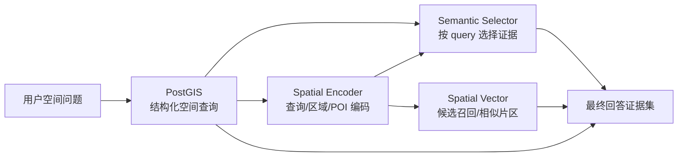
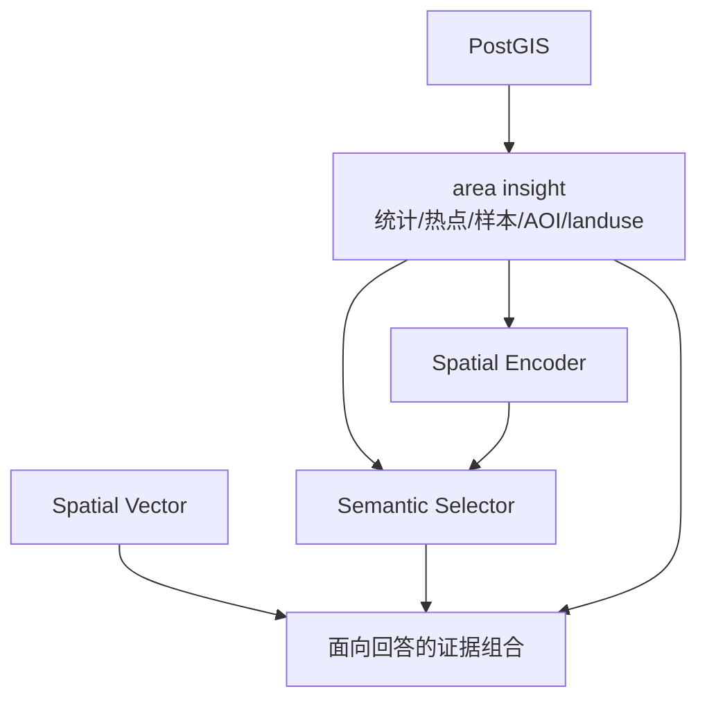

这一页聚焦 GeoLoom Agent 在“**结构化空间事实**”与“**语义辅助理解**”之间建立的核心技能分层：**PostGIS** 负责可审计、只读、受限的空间事实查询；**Spatial Encoder** 负责把查询、区域快照与代表性 POI 编码为向量引用；**Semantic Selector** 负责在已有区域证据之上做按问题语义聚焦的证据裁剪；**Spatial Vector** 则负责语义候选召回与相似片区检索。它们共同构成一个“先结构、后语义；先证据、后解释”的技能组合，而不是彼此替代。Sources: [SKILL.md](backend/SKILLS/PostGIS/SKILL.md#L1-L17), [SKILL.md](backend/SKILLS/SpatialEncoder/SKILL.md#L1-L14), [SKILL.md](backend/SKILLS/SemanticSelector/SKILL.md#L1-L19), [SKILL.md](backend/SKILLS/SpatialVector/SKILL.md#L1-L14)

从架构位置看，这些能力都以统一的 **SkillDefinition / SkillActionDefinition / SkillExecutionResult** 契约暴露给技能注册表；每个技能声明名称、能力、动作输入输出模式，并返回带 `ok / data / error / meta` 的统一结果对象。这意味着“核心技能模块”不是零散函数集合，而是可被统一编排、列举与审计的后端能力接口层。Sources: [types.ts](backend/src/skills/types.ts#L1-L72), [SkillRegistry.ts](backend/src/skills/SkillRegistry.ts#L1-L37)

## 核心设计原则：结构证据优先，语义证据从属

这一组技能最重要的第一性原则，是把**空间事实**与**语义相似性**明确分层。PostGIS 的技能说明直接要求：在片区洞察题中，优先获取结构、热点、代表样本、供给结构和竞争密度；`area_aoi_context` 与 `area_landuse_context` 只作为增强证据；如果证据不足，必须澄清，不能脑补。对应地，Spatial Encoder 与 Spatial Vector 的说明都强调：向量编码、相似度和候选召回**不能冒充硬事实**，只能作为辅助证据。Sources: [SKILL.md](backend/SKILLS/PostGIS/SKILL.md#L9-L17), [SKILL.md](backend/SKILLS/SpatialEncoder/SKILL.md#L9-L14), [SKILL.md](backend/SKILLS/SpatialVector/SKILL.md#L9-L14)

Semantic Selector 的定位进一步收紧了语义模块的职责边界：它不是黑名单过滤器，也不是 prompt 补丁，而是在**已经拿到结构化区域证据后**，根据当前 query 的语义焦点，从 `categoryHistogram`、`representativeSamples`、`competitionDensity`、`aoiContext`、`landuseContext` 等证据中保留真正相关的部分。因此，语义选择发生在结构证据之后，而不是之前。Sources: [SKILL.md](backend/SKILLS/SemanticSelector/SKILL.md#L9-L19), [SemanticSelectorSkill.ts](backend/src/skills/semantic_selector/SemanticSelectorSkill.ts#L6-L42)

下图展示了这四类技能之间的职责关系。阅读这个图时，可以把它理解为一条从“可验证事实”走向“语义辅助解释”的证据递进链，而不是并列调用链。


Sources: [PostGISSkill.ts](backend/src/skills/postgis/PostGISSkill.ts#L36-L49), [SpatialEncoderSkill.ts](backend/src/skills/spatial_encoder/SpatialEncoderSkill.ts#L311-L375), [SemanticSelectorSkill.ts](backend/src/skills/semantic_selector/SemanticSelectorSkill.ts#L54-L160), [SpatialVectorSkill.ts](backend/src/skills/spatial_vector/SpatialVectorSkill.ts#L68-L104)

## 模块总览：四类技能如何分工

下表概括了当前页涉及的四个核心技能模块。重点不在“它们都能处理空间问题”，而在“它们处理的是不同证据层级”。Sources: [PostGISSkill.ts](backend/src/skills/postgis/PostGISSkill.ts#L50-L160), [SpatialEncoderSkill.ts](backend/src/skills/spatial_encoder/SpatialEncoderSkill.ts#L14-L303), [SemanticSelectorSkill.ts](backend/src/skills/semantic_selector/SemanticSelectorSkill.ts#L6-L42), [SpatialVectorSkill.ts](backend/src/skills/spatial_vector/SpatialVectorSkill.ts#L7-L66)

| 技能 | 主要职责 | 典型动作 | 输出性质 | 是否可直接支撑空间事实结论 |
|---|---|---|---|---|
| **PostGIS** | 查询结构化空间事实 | `get_schema_catalog`、`resolve_anchor`、`validate_spatial_sql`、`execute_spatial_sql` | 行数据、统计结果、审计信息 | **可以** |
| **Spatial Encoder** | 编码 query / 区域快照 / POI 档案并评分 | `encode_query`、`encode_region_snapshot`、`encode_poi_profile`、`score_similarity` | 向量引用、特征标签、语义状态 | **不可以单独支撑** |
| **Semantic Selector** | 从 area insight 中按 query 聚焦证据 | `select_area_evidence` | 筛选后的证据集、诊断信息 | **依赖已有结构证据** |
| **Spatial Vector** | 召回语义候选与相似片区 | `search_semantic_pois`、`search_similar_regions` | 候选列表、相似度分数 | **不可以单独支撑** |

Sources: [PostGISSkill.ts](backend/src/skills/postgis/PostGISSkill.ts#L50-L160), [SpatialEncoderSkill.ts](backend/src/skills/spatial_encoder/SpatialEncoderSkill.ts#L14-L303), [SemanticSelectorSkill.ts](backend/src/skills/semantic_selector/SemanticSelectorSkill.ts#L6-L42), [SpatialVectorSkill.ts](backend/src/skills/spatial_vector/SpatialVectorSkill.ts#L7-L66)

## 项目中的技能实现位置

在仓库结构中，文档级技能说明位于 `backend/SKILLS/*/SKILL.md`，运行时实现集中在 `backend/src/skills/*`。其中 PostGIS 拥有最完整的动作子目录和 SQL 模板；Spatial Encoder 与 Spatial Vector 分别有独立 action 目录；Semantic Selector 当前实现集中在单一技能文件，并依赖 `backend/src/evidence/areaInsight/semanticDenoiser.ts` 完成核心筛选逻辑。这个布局也反映了技能成熟度：PostGIS 更偏“受控执行系统”，语义模块更偏“推理辅助层”。Sources: [目录结构](backend/SKILLS#L1-L10), [目录结构](backend/src/skills#L1-L49)

```text
backend/
├─ SKILLS/
│  ├─ PostGIS/SKILL.md
│  ├─ SemanticSelector/SKILL.md
│  ├─ SpatialEncoder/SKILL.md
│  └─ SpatialVector/SKILL.md
└─ src/skills/
   ├─ postgis/
   │  ├─ PostGISSkill.ts
   │  ├─ actions/
   │  ├─ templates/
   │  └─ sqlSecurity.ts
   ├─ semantic_selector/
   │  └─ SemanticSelectorSkill.ts
   ├─ spatial_encoder/
   │  ├─ SpatialEncoderSkill.ts
   │  └─ actions/
   └─ spatial_vector/
      ├─ SpatialVectorSkill.ts
      └─ actions/
```
Sources: [目录结构](backend/SKILLS#L1-L10), [目录结构](backend/src/skills#L1-L49)

## PostGIS：结构化空间事实的主技能

PostGIS 技能暴露四个动作：`get_schema_catalog`、`resolve_anchor`、`validate_spatial_sql`、`execute_spatial_sql`。其中最关键的不是“能执行 SQL”，而是它把执行前、中、后的控制点全部放进了技能边界内：先拿白名单 schema 目录，再解析锚点，再校验 SQL，最后通过 sandbox 执行只读查询。这使得空间事实获取从一开始就是**受限、可审计、最小授权**的。Sources: [PostGISSkill.ts](backend/src/skills/postgis/PostGISSkill.ts#L50-L160), [getSchemaCatalog.ts](backend/src/skills/postgis/actions/getSchemaCatalog.ts#L1-L24)

### PostGIS 的白名单与安全边界

`createPostgisCatalog()` 明确定义了允许访问的表、函数、必需空间函数与最大返回行数。表级白名单包括 `pois`、`districts`、`aois`、`landuse`、`population_grid_100m`、`cells`、`roads` 等；函数级白名单包括 `count`、`sum`、`avg` 以及多种 `ST_*` 空间函数；同时要求查询至少使用 `st_dwithin`、`st_intersects`、`st_contains` 之一，并将 `maxLimit` 固定为 200。这不是一般意义上的 ORM 封装，而是**显式的查询能力收口**。Sources: [sqlSecurity.ts](backend/src/skills/postgis/sqlSecurity.ts#L1-L156)

`validateSpatialSQLAction()` 会使用 `SQLSandbox` 对传入 SQL 做校验；若不通过，则返回 `sql_validation_failed`。测试进一步验证了几个关键边界：允许带空间谓词与 `LIMIT` 的只读查询；拒绝 `DELETE` 等变更语句；拒绝没有 `LIMIT` 的查询；拒绝缺少空间谓词的查询；拒绝非白名单函数如 `pg_sleep`；拒绝访问非白名单表如 `users`。从文档角度说，这些测试就是 PostGIS 模块边界的最直接证据。Sources: [validateSQL.ts](backend/src/skills/postgis/actions/validateSQL.ts#L1-L50), [validateSQL.spec.ts](backend/tests/unit/skills/postgis/validateSQL.spec.ts#L1-L141)

### PostGIS 的模板化查询策略

`execute_spatial_sql` 的输入模式并不鼓励自由 SQL，而是优先要求使用 `template`。模板名被枚举为 `nearby_poi`、`nearest_station`、`area_category_histogram`、`area_ring_distribution`、`area_representative_sample`、`area_competition_density`、`area_h3_hotspots`、`area_aoi_context`、`area_landuse_context` 等。换句话说，系统试图把高频空间问题压缩为一组**可复用、可限制、可组合**的模板入口，而不是每次让模型现场生成 SQL。Sources: [PostGISSkill.ts](backend/src/skills/postgis/PostGISSkill.ts#L36-L49), [PostGISSkill.ts](backend/src/skills/postgis/PostGISSkill.ts#L111-L159)

当最终进入执行阶段时，`executeSpatialSQLAction()` 并不直接连数据库执行文本，而是再次经过 `sandbox.execute()`，由 sandbox 提供超时和执行包装，再调用底层 `query(sql, [], timeoutMs)`。因此，PostGIS 不是“校验一次然后裸奔执行”，而是“校验模型 + 沙箱执行模型”的双层控制。Sources: [executeSQL.ts](backend/src/skills/postgis/actions/executeSQL.ts#L1-L50)

### PostGIS 的锚点解析能力

`resolve_anchor` 不是简单字符串透传。实现中它会从 `place_name`、`anchor_text`、`anchor_name`、`query` 等多个字段读取地点名，支持 LLM 工具调用时常见的不同参数命名；同时维护别名映射，例如 `华师一附中 -> 华中师范大学第一附属中学`；并结合地点类型推断、类别匹配、名称后缀判断、近邻实体支持度等规则，对候选 POI 进行打分。这里的重点是：锚点解析本身已经被设计成“针对教育、交通等空间主语的容错解析器”，而不是单纯全文检索。Sources: [resolveAnchor.ts](backend/src/skills/postgis/actions/resolveAnchor.ts#L16-L117), [resolveAnchor.ts](backend/src/skills/postgis/actions/resolveAnchor.ts#L158-L200)

对应测试显示，这套规则能处理直接精确命中、学校别名归一、`anchor_text`/`anchor_name` 兼容输入、模糊候选排序，以及“优先主校体而非附属设施”的场景。例如在“武汉大学”候选中，系统会优先主学校实体，而不是“武汉大学保卫一分部(文理学部)”之类衍生设施。Sources: [resolveAnchor.spec.ts](backend/tests/unit/skills/postgis/resolveAnchor.spec.ts#L1-L200)

## Spatial Encoder：把空间描述转成可比较的语义引用

Spatial Encoder 技能的能力面明显比 SKILL 文档中写得更广：运行时除 `encode_query`、`encode_region`、`score_similarity` 外，还支持 `encode_region_snapshot`、`encode_poi_profile`、`inspect_anchor_cell`、`search_anchor_cells`、`annotate_poi_cells`。这说明该技能已经从“纯文本编码器”扩展为“**区域结构快照编码器 + town cell 上下文补全器 + 相似度打分器**”。Sources: [SKILL.md](backend/SKILLS/SpatialEncoder/SKILL.md#L1-L14), [SpatialEncoderSkill.ts](backend/src/skills/spatial_encoder/SpatialEncoderSkill.ts#L305-L376)

### 向量引用而非直接暴露原始向量

`encodeQueryAction()` 调用 `bridge.encodeText()` 之后，不是把原始向量直接暴露为跨模块公共对象，而是生成 `embedding_id` 与 `vector_ref`，并把真实向量存入技能内部 `Map<string, VectorRecord>`。随后 `score_similarity` 根据 `query_vector_ref` 与 `candidate_vector_refs` 做相似度排序。这个设计有两个明显效果：第一，模块边界外只拿到**引用**而不是内部向量状态；第二，后续动作可以围绕同一批编码结果复用状态。Sources: [encodeQuery.ts](backend/src/skills/spatial_encoder/actions/encodeQuery.ts#L1-L54), [SpatialEncoderSkill.ts](backend/src/skills/spatial_encoder/SpatialEncoderSkill.ts#L308-L360)

### 区域快照编码：把结构证据重新组织成语义摘要

`encode_region_snapshot` 的输入不是一句文本，而是一个结构化 `snapshot`，其中可包含 `dominantCategories`、`ringDistribution`、`hotspots`、`representativePois`、`aoiContext`、`landuseContext`、`competitionDensity` 等。编码动作调用 `bridge.encodeRegionSnapshot(snapshot)` 后，返回 `feature_summary` 和 `feature_tags`。这表明区域编码不是把原始 area insight 拼成字符串再嵌入，而是显式把结构证据转为“片区特征标签”。Sources: [SpatialEncoderSkill.ts](backend/src/skills/spatial_encoder/SpatialEncoderSkill.ts#L75-L120), [encodeRegionSnapshot.ts](backend/src/skills/spatial_encoder/actions/encodeRegionSnapshot.ts#L1-L52)

这些区域标签的生成规则定义在 `regionSnapshot.ts`。例如，当 AOI / 用地 /文本线索共同指向校园时，会打上 `campus_anchor`；居住与商业信号共存会形成 `mixed_use`；热点数为 1 或大于等于 2 时分别形成 `single_core_hotspot` 或 `multi_core_hotspot`；餐饮占比高时生成 `food_dominant`；生活服务未进入头部结构时生成 `life_service_gap`。从架构意义上看，这一步完成了**从统计结果到语义标签**的受控映射。Sources: [regionSnapshot.ts](backend/src/evidence/areaInsight/regionSnapshot.ts#L13-L33), [regionSnapshot.ts](backend/src/evidence/areaInsight/regionSnapshot.ts#L136-L197)

### POI 档案编码：让“代表样本”拥有可比较的角色语义

`encode_poi_profile` 接受单个代表 POI 的档案，包括名称、主次类目、距离、片区主语、热点标签、周边类目、AOI 上下文等，并输出 `feature_summary` 与 `feature_tags`。在 `poiProfile.ts` 中，系统会根据样本是否处于校园语境、是否带交通/餐饮/零售/服务关键词、是否位于热点带、是否落在核心圈层，为其打上 `transit_gateway`、`campus_anchor`、`student_daily_consumption`、`food_anchor`、`daily_service_node`、`core_ring_sample` 等角色标签。这样，代表样本不只是“例子”，还是可参与相似判断的语义角色单元。Sources: [SpatialEncoderSkill.ts](backend/src/skills/spatial_encoder/SpatialEncoderSkill.ts#L121-L165), [poiProfile.ts](backend/src/evidence/areaInsight/poiProfile.ts#L15-L25), [poiProfile.ts](backend/src/evidence/areaInsight/poiProfile.ts#L52-L106)

### 本地回退与语义证据状态

Spatial Encoder 所有关键动作都会附带 `semantic_evidence`。`LocalPythonBridge` 在本地模式下使用有限词表对文本做简单向量化，区域与 POI 则通过本地规则提取 token 与标签；测试显示，在默认本地实现下，`encode_query` 返回的语义证据会被标为 `degraded` 且 `weakEvidence: true`，而当远程编码服务可用时，语义证据会升级为 `available` 且 `weakEvidence: false`。这说明系统不仅返回结果，还显式告诉上层“这个语义结论的依赖质量如何”。Sources: [pythonBridge.ts](backend/src/integration/pythonBridge.ts#L94-L118), [pythonBridge.ts](backend/src/integration/pythonBridge.ts#L121-L147), [SpatialEncoderSkill.spec.ts](backend/tests/unit/skills/spatial_encoder/SpatialEncoderSkill.spec.ts#L6-L25), [SpatialEncoderSkill.spec.ts](backend/tests/unit/skills/spatial_encoder/SpatialEncoderSkill.spec.ts#L27-L126)

## Semantic Selector：按 query 语义做证据去噪

Semantic Selector 当前只暴露一个动作：`select_area_evidence`。它要求至少提供 `raw_query`，并且必须同时拥有 area insight 或 fallback rows，否则会返回 `missing_area_insight`。这很好地揭示了该技能的本质：它不负责生成区域证据，只负责**在现有证据集上做二次选择**。Sources: [SemanticSelectorSkill.ts](backend/src/skills/semantic_selector/SemanticSelectorSkill.ts#L6-L42), [SemanticSelectorSkill.ts](backend/src/skills/semantic_selector/SemanticSelectorSkill.ts#L77-L113)

从执行逻辑看，该技能会提取 `raw_query`、`semantic_focus`、`anchor_name` 和 `area_insight`，然后调用 `selector.denoise()`。默认实现是 `IntentAwareAreaSemanticDenoiser`。执行结果中不仅有 `selected_rows` 和 `selected_area_insight`，还包含 `diagnostics`：是否应用、关注 query、保留的类别、丢弃的类别、保留/丢弃的样本、阈值。这意味着它是一个**可解释的筛选器**，而不是只返回黑箱结果。Sources: [SemanticSelectorSkill.ts](backend/src/skills/semantic_selector/SemanticSelectorSkill.ts#L54-L160)

`semanticDenoiser.ts` 的实现使用了多个层次的语义近似手段：先清洗 query 中的填充词与区域泛称，再构造类别桶候选与样本候选；之后结合文本编码向量、余弦相似度、字符 n-gram 与 Dice 系数等方法，对候选与 query 焦点进行对齐。这里值得注意的是，它并没有替代结构证据，而是围绕 `categoryHistogram` 和 `representativeSamples` 等已有结构结果做“保留谁、舍弃谁”的决策。Sources: [semanticDenoiser.ts](backend/src/evidence/areaInsight/semanticDenoiser.ts#L76-L98), [semanticDenoiser.ts](backend/src/evidence/areaInsight/semanticDenoiser.ts#L121-L175), [semanticDenoiser.ts](backend/src/evidence/areaInsight/semanticDenoiser.ts#L189-L200)

测试用例很好地展示了它的价值：当 query 是“总结一下华中农业大学周边的业态结构”时，若 area insight 同时存在 `餐饮美食`、`购物服务`、`公共厕所`、`停车场` 等类别，Semantic Selector 会保留前两类，并跳过后两类；同时只保留相应代表样本，并在诊断信息中明确列出 `selectedCategories` 与 `skippedCategories`。这正是“按需取证”的实现证据。Sources: [SemanticSelectorSkill.spec.ts](backend/tests/unit/skills/semantic_selector/SemanticSelectorSkill.spec.ts#L89-L149)

## Spatial Vector：语义候选召回，不是事实数据库

Spatial Vector 技能只做两件事：`search_semantic_pois` 和 `search_similar_regions`。前者返回描述性文本对应的 POI 候选，后者返回相似片区列表。运行时实现默认依赖 `LocalFaissIndex`，但接口层设计成可替换的 `FaissIndex`，并支持 `RemoteFirstFaissIndex`。这意味着该模块被当作**检索接口**，而不是固定本地索引实现。Sources: [SpatialVectorSkill.ts](backend/src/skills/spatial_vector/SpatialVectorSkill.ts#L7-L104), [faissIndex.ts](backend/src/integration/faissIndex.ts#L24-L28), [faissIndex.ts](backend/src/integration/faissIndex.ts#L113-L171)

本地索引实现并非真正的 FAISS 近邻搜索，而是基于预置 `REGION_CATALOG`、`POI_CATALOG` 和标签重叠分数的简化回退机制。例如区域目录中包含“街道口-武大商圈”“光谷青年社区”“远郊物流仓储片区”等条目，POI 目录中包含“校园咖啡实验室”“地铁口轻食咖啡”“社区便利咖啡馆”等候选；查询分数由基础分加标签重叠比例构成。这种设计说明：默认本地模式的重点是**保证语义能力接口存在**，而不是保证高保真召回。Sources: [faissIndex.ts](backend/src/integration/faissIndex.ts#L30-L79), [faissIndex.ts](backend/src/integration/faissIndex.ts#L81-L111)

与 Spatial Encoder 类似，Spatial Vector 也显式暴露 `semantic_evidence`。测试表明，本地默认模式下其证据等级是 `degraded`；若远程向量索引服务就绪，则会返回 `available`、`mode: remote` 和对应目标地址。这再次强调：系统把“召回结果”与“召回可信度”一起输出，防止上层把本地回退候选误读成高置信事实。Sources: [searchSemanticPOIs.ts](backend/src/skills/spatial_vector/actions/searchSemanticPOIs.ts#L1-L34), [searchSimilarRegions.ts](backend/src/skills/spatial_vector/actions/searchSimilarRegions.ts#L1-L34), [SpatialVectorSkill.spec.ts](backend/tests/unit/skills/spatial_vector/SpatialVectorSkill.spec.ts#L6-L83)

## 四类技能的交互模式

如果把这一页内容压缩成一个交互模式，可以总结为：**PostGIS 产出结构证据，Spatial Encoder 产出语义引用，Semantic Selector 负责基于 query 收缩证据面，Spatial Vector 负责补充候选对照面。** 它们分别回答四个问题：这里“有什么事实”、这些事实“像什么语义模式”、当前问题“该看哪些事实”、以及“还有哪些相似候选可供参照”。Sources: [SKILL.md](backend/SKILLS/PostGIS/SKILL.md#L11-L17), [SKILL.md](backend/SKILLS/SpatialEncoder/SKILL.md#L11-L14), [SKILL.md](backend/SKILLS/SemanticSelector/SKILL.md#L11-L19), [SKILL.md](backend/SKILLS/SpatialVector/SKILL.md#L11-L14)

下图把这种交互整理成模块关系图。阅读时请注意箭头方向：Semantic Selector 消费的是已经存在的 `area_insight`，而 Spatial Vector 的输出是“候选/相似”，不是结构事实主链的一部分。


Sources: [PostGISSkill.ts](backend/src/skills/postgis/PostGISSkill.ts#L162-L200), [SemanticSelectorSkill.ts](backend/src/skills/semantic_selector/SemanticSelectorSkill.ts#L115-L143), [SpatialEncoderSkill.ts](backend/src/skills/spatial_encoder/SpatialEncoderSkill.ts#L330-L360), [SpatialVectorSkill.ts](backend/src/skills/spatial_vector/SpatialVectorSkill.ts#L83-L104)

## 能力边界对比：什么时候用哪个技能

对中级开发者来说，最容易犯的错误是把“语义相关”误认为“事实成立”。下面这张表给出更实用的判断准则。Sources: [SKILL.md](backend/SKILLS/PostGIS/SKILL.md#L11-L17), [SKILL.md](backend/SKILLS/SpatialEncoder/SKILL.md#L11-L14), [SKILL.md](backend/SKILLS/SemanticSelector/SKILL.md#L12-L19), [SKILL.md](backend/SKILLS/SpatialVector/SKILL.md#L11-L14)

| 问题类型 | 首选技能 | 原因 | 不应单独依赖的技能 |
|---|---|---|---|
| 周边业态结构、热点、竞争密度 | **PostGIS** | 需要统计、分布、代表样本等硬证据 | Spatial Encoder / Spatial Vector |
| 已拿到 area insight，但问题只关注某类主题 | **Semantic Selector** | 需要按 query 保留相关类别与样本 | 单靠手写规则或全量 area insight |
| 把区域快照或 POI 样本转为可比较语义特征 | **Spatial Encoder** | 需要特征标签、向量引用、相似度评分 | PostGIS 直接替代语义编码 |
| 找语义相似 POI 或相似片区作为候选参考 | **Spatial Vector** | 需要召回候选或对照区域 | PostGIS 结构查询 |

Sources: [SKILL.md](backend/SKILLS/PostGIS/SKILL.md#L11-L17), [SKILL.md](backend/SKILLS/SpatialEncoder/SKILL.md#L11-L14), [SKILL.md](backend/SKILLS/SemanticSelector/SKILL.md#L12-L19), [SKILL.md](backend/SKILLS/SpatialVector/SKILL.md#L11-L14)

## 测试证据揭示的稳定行为

单元测试目录中，这四类技能都有专门测试：`postgis`、`semantic_selector`、`spatial_encoder`、`spatial_vector`。这说明它们不是实验性散点实现，而是被视作稳定的技能边界。尤其是 PostGIS 的安全校验、锚点解析，Semantic Selector 的 query 驱动筛选，以及 Encoder / Vector 的远程可用性降级语义，都已经被测试固化。Sources: [目录列表](backend/tests/unit/skills/postgis#L1-L1), [目录列表](backend/tests/unit/skills/semantic_selector#L1-L1), [目录列表](backend/tests/unit/skills/spatial_encoder#L1-L1), [目录列表](backend/tests/unit/skills/spatial_vector#L1-L1)

从代码考古角度看，这些测试还暴露出一个重要架构选择：**系统不假定所有高级依赖始终在线**。无论是编码器还是向量索引，都通过 `semantic_evidence` 与 dependency status 显式传递“remote / local / fallback / degraded”等状态；因此，调用方必须把这些技能当作“有质量标签的证据提供者”，而不是无条件可信的 oracle。Sources: [SpatialEncoderSkill.spec.ts](backend/tests/unit/skills/spatial_encoder/SpatialEncoderSkill.spec.ts#L27-L126), [SpatialVectorSkill.spec.ts](backend/tests/unit/skills/spatial_vector/SpatialVectorSkill.spec.ts#L43-L82), [faissIndex.ts](backend/src/integration/faissIndex.ts#L123-L199)

## 阅读路径建议

如果你已经理解本页的技能边界，下一步最自然的延伸有三条：想看这些技能如何被更高层任务编排，可继续阅读 [智能体编排：技能调度与任务执行](20-zhi-neng-ti-bian-pai-ji-neng-diao-du-yu-ren-wu-zhi-xing)；想深入理解区域与 POI 向量化细节，可继续阅读 [POI 与区域编码器：地理空间向量化](13-poi-yu-qu-yu-bian-ma-qi-di-li-kong-jian-xiang-liang-hua)；想看 PostGIS 在存储与空间服务层面的上下文，可继续阅读 [空间数据服务：OSM 桥接与 PostGIS 存储](6-kong-jian-shu-ju-fu-wu-osm-qiao-jie-yu-postgis-cun-chu)。Sources: [SKILL.md](backend/SKILLS/PostGIS/SKILL.md#L11-L17), [SpatialEncoderSkill.ts](backend/src/skills/spatial_encoder/SpatialEncoderSkill.ts#L311-L375), [SemanticSelectorSkill.ts](backend/src/skills/semantic_selector/SemanticSelectorSkill.ts#L60-L160), [SpatialVectorSkill.ts](backend/src/skills/spatial_vector/SpatialVectorSkill.ts#L73-L104)