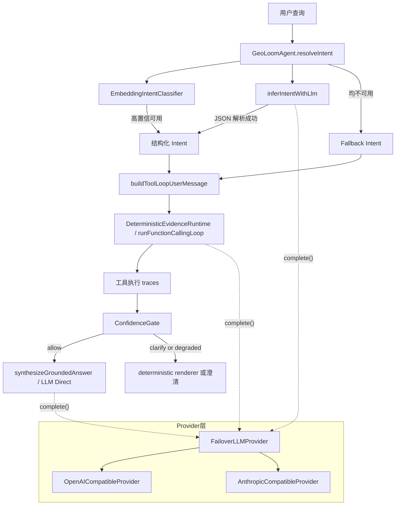
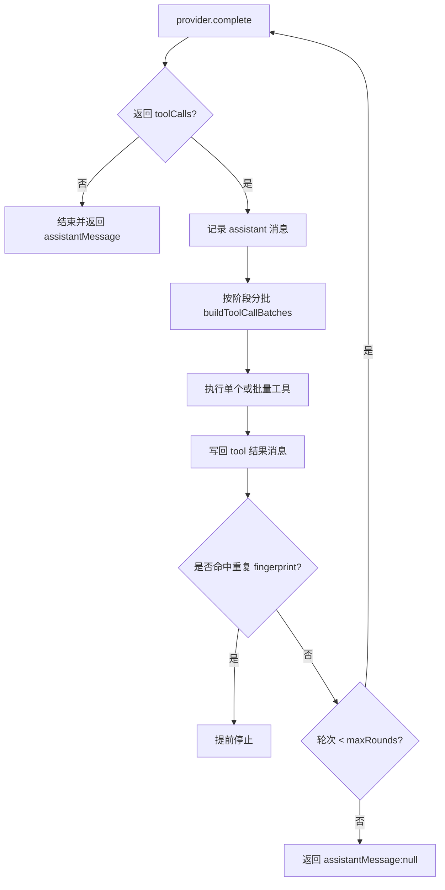

本页聚焦 GeoLoom Agent 中 **LLM 如何被接入为“意图理解器 + 工具编排器 + 最终证据合成器”**，并说明它与回退机制、结构化工具循环、证据门控之间的职责边界。这里不展开空间技能细节、SSE 生命周期或前端展示，而只讨论 LLM 子系统本身在后端中的位置与行为。作为当前目录中的概览页，建议后续阅读 [请求生命周期管理：从用户输入到流式响应](7-qing-qiu-sheng-ming-zhou-qi-guan-li-cong-yong-hu-shu-ru-dao-liu-shi-xiang-ying)、[智能体编排：技能调度与任务执行](20-zhi-neng-ti-bian-pai-ji-neng-diao-du-yu-ren-wu-zhi-xing) 与 [证据生成与可视化：空间证据卡与叙事模式](8-zheng-ju-sheng-ming-yu-ke-shi-hua-kong-jian-zheng-ju-qia-yu-xu-shi-mo-shi)。Sources: [GeoLoomAgent.ts](backend/src/agent/GeoLoomAgent.ts#L1677-L1696), [2026-04-09-llm-first-intent-design.md](docs/plans/2026-04-09-llm-first-intent-design.md#L5-L26)

## 核心结论：LLM 已不是“补救器”，而是主理解链路

从设计文档到当前实现可以验证，系统已经采用 **LLM-first intent** 路径：当 provider 可用时，请求会优先进入 `inferIntentWithLlm()`，由模型直接输出结构化意图；只有当 LLM 不可用、解析失败，或结果不可用时，才退回 fallback intent。该目标在设计文档中明确提出“LLM 先理解 -> LLM 编排工具 -> LLM 基于证据输出”，并在 `resolveIntent()` 中体现为：先尝试 embedding 分类，必要时再尝试 LLM 解析，最终才使用 fallback intent。Sources: [2026-04-09-llm-first-intent-design.md](docs/plans/2026-04-09-llm-first-intent-design.md#L16-L36), [GeoLoomAgent.ts](backend/src/agent/GeoLoomAgent.ts#L2500-L2543), [GeoLoomAgent.ts](backend/src/agent/GeoLoomAgent.ts#L2545-L2629)

这种架构变化的意义在于：**自然语言理解从规则前置，转向模型前置**。设计文档把旧问题定义为 `DeterministicRouter` 先决定 `queryType / placeName / anchorSource`，导致用户问法稍有变化就可能被规则拦截；新方向则要求 provider ready 时由 LLM 直接理解原始用户 NL，并直接给出 `queryType`、`anchorSource`、`placeName`、`secondaryPlaceName` 等字段。当前 `inferIntentWithLlm()` 的输出契约已与该目标一致。Sources: [2026-04-09-llm-first-intent-design.md](docs/plans/2026-04-09-llm-first-intent-design.md#L9-L27), [GeoLoomAgent.ts](backend/src/agent/GeoLoomAgent.ts#L2757-L2854)

## 架构总览

在理解下面的 Mermaid 图之前，先把系统分成三层：第一层是 **Provider 抽象层**，负责对接 OpenAI-compatible、Anthropic-compatible 与 failover；第二层是 **Agent 推理层**，负责意图解析、工具循环和最终合成；第三层是 **Guardrail 层**，负责在证据不足或锚点不明确时阻止模型把不稳定内容当成结论输出。Sources: [types.ts](backend/src/llm/types.ts#L20-L60), [createDefaultLLMProvider.ts](backend/src/llm/createDefaultLLMProvider.ts#L21-L56), [ConfidenceGate.ts](backend/src/agent/ConfidenceGate.ts#L3-L38)


Sources: [GeoLoomAgent.ts](backend/src/agent/GeoLoomAgent.ts#L2500-L2629), [GeoLoomAgent.ts](backend/src/agent/GeoLoomAgent.ts#L2876-L2899), [FunctionCallingLoop.ts](backend/src/llm/FunctionCallingLoop.ts#L105-L172), [createDefaultLLMProvider.ts](backend/src/llm/createDefaultLLMProvider.ts#L21-L56)

## 模块结构视图

就代码组织而言，LLM 子系统并不集中在单一文件里，而是由 **provider 适配、函数调用循环、agent 意图解释、内存 mock provider** 四类模块协作完成。下表显示了当前页真正相关的核心文件。Sources: [backend/src/llm](backend/src/llm#L1-L8), [backend/src/agent](backend/src/agent#L1-L7)

| 模块 | 主要职责 | 关键文件 |
|---|---|---|
| Provider 抽象 | 定义统一消息、工具调用、响应格式 | `backend/src/llm/types.ts` |
| Provider 实现 | 对接 OpenAI / Anthropic 兼容接口 | `OpenAICompatibleProvider.ts`、`AnthropicCompatibleProvider.ts` |
| Provider 选择与容错 | 主 provider + fallback provider 失效切换 | `createDefaultLLMProvider.ts`、`FailoverLLMProvider.ts` |
| Tool Loop | 执行模型工具调用、分批、去重、轮次限制 | `FunctionCallingLoop.ts` |
| Agent 意图理解 | 生成意图理解 prompt、解析 JSON、装配 intent | `GeoLoomAgent.ts` |
| 本地内存模型 | 无外部模型时模拟意图 JSON 与工具规划 | `InMemoryLLMProvider.ts` |

Sources: [types.ts](backend/src/llm/types.ts#L3-L60), [OpenAICompatibleProvider.ts](backend/src/llm/OpenAICompatibleProvider.ts#L5-L232), [AnthropicCompatibleProvider.ts](backend/src/llm/AnthropicCompatibleProvider.ts#L18-L317), [FunctionCallingLoop.ts](backend/src/llm/FunctionCallingLoop.ts#L4-L172), [InMemoryLLMProvider.ts](backend/src/llm/InMemoryLLMProvider.ts#L166-L439)

```text
backend/src/llm
├── AnthropicCompatibleProvider.ts
├── FailoverLLMProvider.ts
├── FunctionCallingLoop.ts
├── InMemoryLLMProvider.ts
├── OpenAICompatibleProvider.ts
├── createDefaultLLMProvider.ts
├── toolSchemaBuilder.ts
└── types.ts
```
Sources: [backend/src/llm](backend/src/llm#L1-L8)

## 统一契约：LLM 在系统内被视为“可发起工具调用的结构化消息服务”

`backend/src/llm/types.ts` 定义了整个 LLM 子系统的协议边界。这里最关键的不是“文本 completion”，而是四个结构：`LLMMessage` 表示 system/user/assistant/tool 消息；`ToolSchema` 描述可调用技能；`ToolCallRequest` 表示模型发起的函数调用；`LLMResponse` 则统一返回 `assistantMessage`、`toolCalls` 与 `finishReason`。这意味着系统视角中的 LLM 不是纯文本生成器，而是一个可在多轮对话中驱动工具调用的状态机。Sources: [types.ts](backend/src/llm/types.ts#L3-L60)

这种设计还有一个重要效果：上层 Agent 不需要知道下游具体是 OpenAI 风格还是 Anthropic 风格。它只需要调用 `provider.complete({ messages, tools, timeoutMs })`，并读取统一后的 `assistantMessage.toolCalls` 与 `finishReason`。也正因为协议被抽象统一，`GeoLoomAgent` 可以在意图识别、工具补充和最终合成这三个阶段复用同一套 provider。Sources: [types.ts](backend/src/llm/types.ts#L44-L60), [GeoLoomAgent.ts](backend/src/agent/GeoLoomAgent.ts#L2757-L2824), [FunctionCallingLoop.ts](backend/src/llm/FunctionCallingLoop.ts#L113-L118)

## Provider 选择：基于环境变量的协议分派与故障切换

默认 provider 由 `createDefaultLLMProvider()` 创建。它先读取 `LLM_*` 与 `LLM_FALLBACK_*` 两组环境变量，再通过 `resolveProtocol()` 判断目标接口是 `openai` 还是 `anthropic`。如果 fallback provider 未就绪，则仅使用 primary；若 fallback 已配置，则包装成 `FailoverLLMProvider`。Sources: [createDefaultLLMProvider.ts](backend/src/llm/createDefaultLLMProvider.ts#L5-L56)

环境变量加载则由 `loadRuntimeEnv()` 完成。它会尝试合并仓库根目录 `.env`、`.env.v4` 与 `backend/.env`，并写回 `process.env`。这意味着 LLM 配置并不是写死在 agent 内部，而是通过运行时环境动态注入。Sources: [loadRuntimeEnv.ts](backend/src/config/loadRuntimeEnv.ts#L36-L72)

下表概括了 provider 选择逻辑。Sources: [createDefaultLLMProvider.ts](backend/src/llm/createDefaultLLMProvider.ts#L12-L56), [FailoverLLMProvider.ts](backend/src/llm/FailoverLLMProvider.ts#L8-L41)

| 条件 | 结果 |
|---|---|
| `LLM_PROTOCOL=anthropic` 或 `LLM_BASE_URL` 包含 `/anthropic` | 创建 `AnthropicCompatibleProvider` |
| 其他情况 | 创建 `OpenAICompatibleProvider` |
| `LLM_FALLBACK_*` 未配置完整 | 只返回 primary provider |
| `LLM_FALLBACK_*` 已就绪 | 返回 `FailoverLLMProvider(primary, fallback)` |
| primary ready 且调用成功 | 使用 primary |
| primary ready 但调用抛错且 fallback ready | 自动切到 fallback |

Sources: [createDefaultLLMProvider.ts](backend/src/llm/createDefaultLLMProvider.ts#L12-L56), [FailoverLLMProvider.ts](backend/src/llm/FailoverLLMProvider.ts#L11-L41)

## OpenAI 与 Anthropic 兼容层：差异被吸收到 Provider 内部

`OpenAICompatibleProvider` 会把内部消息转换为 `/chat/completions` 所需格式，并把工具 schema 映射到 `tools[].function.parameters`。收到响应后，它会把 `message.tool_calls[].function.arguments` 做 JSON 尝试解析，无法解析时保留为 `raw_arguments`，然后统一产出 `LLMResponse`。Sources: [OpenAICompatibleProvider.ts](backend/src/llm/OpenAICompatibleProvider.ts#L12-L21), [OpenAICompatibleProvider.ts](backend/src/llm/OpenAICompatibleProvider.ts#L63-L119), [OpenAICompatibleProvider.ts](backend/src/llm/OpenAICompatibleProvider.ts#L154-L232)

`AnthropicCompatibleProvider` 则把 system prompt 单独拼接，把 assistant/tool 历史编码为 content blocks，并把 tool result 累积成后续 user 消息中的 `tool_result` block。它还实现了瞬时错误重试、429/5xx 可恢复判断，以及 `max_tokens` 的安全夹取。换言之，Anthropic 的 block 风格协议差异，已经完全被隐藏在 provider 适配器内。Sources: [AnthropicCompatibleProvider.ts](backend/src/llm/AnthropicCompatibleProvider.ts#L27-L38), [AnthropicCompatibleProvider.ts](backend/src/llm/AnthropicCompatibleProvider.ts#L100-L177), [AnthropicCompatibleProvider.ts](backend/src/llm/AnthropicCompatibleProvider.ts#L238-L315)

## 意图识别：LLM 被要求只返回 JSON，而不是自由文本

`inferIntentWithLlm()` 是当前实现中最核心的意图理解入口。它向 provider 发送两条消息：一条 system 消息明确要求“你是 GeoLoom V4 的意图理解器，只能返回一个 JSON 对象，不能输出解释，不能调用 tools”；一条 user 消息描述可选 `queryType`、`anchorSource`、`toolIntent`、`needsWebSearch` 等字段，并附带 `user_query`、`follow_up_recent_intent`、`embedding_prior`、`has_spatial_view`、`has_user_location`、`selected_categories`、`selected_regions` 等上下文。Sources: [GeoLoomAgent.ts](backend/src/agent/GeoLoomAgent.ts#L2776-L2824)

解析阶段同样是结构化的。返回文本先经过 `extractJsonObject()` 截取 JSON 主体，再由 `JSON.parse()` 反序列化，并通过 `isSupportedQueryType()`、`isSupportedAnchorSource()`、`normalizeToolIntentMode()` 等函数做白名单验证。最终只接受系统支持的字段组合；任何异常都会被捕获并返回 `null`。这使得模型在“意图识别阶段”并没有直接控制后续链路，而只是提供一个受约束的结构化 hint。Sources: [GeoLoomAgent.ts](backend/src/agent/GeoLoomAgent.ts#L1252-L1284), [GeoLoomAgent.ts](backend/src/agent/GeoLoomAgent.ts#L2826-L2854)

## 从 LLM Hint 到系统 Intent：模型输出不会被原样信任

`buildIntentFromLlmHint()` 展示了系统如何把 LLM JSON 转换成真正的内部 `DeterministicIntent`。这里有三个关键保护：第一，**锚点来源必须与当前上下文匹配**，例如只有 `hasMapView` 为真时才接受 `map_view`；第二，`compare_places` 在缺失第二锚点时，会根据已选 region 或 map view 降级解释；第三，`needsClarification` 并不只听模型，而是结合 placeName、secondaryPlaceName、空间上下文重新推导。Sources: [GeoLoomAgent.ts](backend/src/agent/GeoLoomAgent.ts#L2642-L2755)

这说明架构上采用的是 **“LLM 提议，系统裁决”** 模式。模型可以建议 `queryType=area_overview`、`anchorSource=map_view`，但是否真的可执行，仍取决于 request 中是否存在视口、用户定位或结构化选区。模型负责语言理解，系统负责上下文合法性约束。Sources: [GeoLoomAgent.ts](backend/src/agent/GeoLoomAgent.ts#L2652-L2699), [GeoLoomAgent.ts](backend/src/agent/GeoLoomAgent.ts#L2700-L2755)

## Embedding 与 LLM 的关系：不是替代，而是协同决策

当前 `resolveIntent()` 并不是简单的“永远 LLM first”。真实实现是：如果 `EmbeddingIntentClassifier` 已就绪，先做 embedding 分类；当 embedding 结果为 `unsupported`，或者策略函数 `shouldPreferLlmIntentPlanner()` 判定仍应交给 LLM 时，再调用 `inferIntentWithLlm()`；如果 embedding 结果置信度足够且 queryType 受支持，则直接构造 intent 并返回 `source: 'embedding'`。Sources: [GeoLoomAgent.ts](backend/src/agent/GeoLoomAgent.ts#L2545-L2605), [GeoLoomAgent.ts](backend/src/agent/GeoLoomAgent.ts#L1286-L1305)

因此，本页更准确的表述应是：**LLM 是主自然语言理解器，但在实现层面被纳入“Embedding 优先、LLM 补充、Fallback 保底”的三层判定框架**。这与设计文档的“provider ready 时 LLM-first”目标相比，代码已经进一步演化，引入了 embedding 分类作为更快的前置结构化信号，但当 embedding 不稳定时，仍由 LLM 接管自然语言理解。Sources: [2026-04-09-llm-first-intent.md](docs/plans/2026-04-09-llm-first-intent.md#L43-L76), [GeoLoomAgent.ts](backend/src/agent/GeoLoomAgent.ts#L2500-L2629)

## 工具编排：LLM 使用统一 Tool Loop 驱动多轮推理

当系统进入需要 LLM 补充的推理阶段时，核心执行器是 `runFunctionCallingLoop()`。该循环每轮调用 `provider.complete()`，把 assistant 的 `toolCalls` 取出后追加到消息历史，再把每个工具结果作为 `role: 'tool'` 消息写回，然后进入下一轮。循环默认最多 4 轮，可通过 `maxRounds` 调整。Sources: [FunctionCallingLoop.ts](backend/src/llm/FunctionCallingLoop.ts#L105-L172)

该循环并不是盲目串行。`classifyExecutionPhase()` 会把工具调用分为 `resolve_anchor`、`evidence_fetch`、`semantic_refinement` 等阶段；`buildToolCallBatches()` 则把同波次、同阶段的调用聚成 batch，并在 `onToolCallBatch` 可用时并行执行。此外，它还通过 `seenFingerprints` 检测相同 name+arguments 的重复调用，一旦出现重复，会提前终止，防止模型陷入循环。Sources: [FunctionCallingLoop.ts](backend/src/llm/FunctionCallingLoop.ts#L44-L103), [FunctionCallingLoop.ts](backend/src/llm/FunctionCallingLoop.ts#L141-L165)

下面这张图展示了 Tool Loop 的逻辑。Sources: [FunctionCallingLoop.ts](backend/src/llm/FunctionCallingLoop.ts#L24-L172)


Sources: [FunctionCallingLoop.ts](backend/src/llm/FunctionCallingLoop.ts#L65-L103), [FunctionCallingLoop.ts](backend/src/llm/FunctionCallingLoop.ts#L113-L172)

## Agent 中的两种推理轨道：Fast Track 与 Deep Track

在 `GeoLoomAgent` 中，LLM 不总是参与完整工具循环。系统会根据任务类型与证据需求，将执行分成 `fast` 与 `deep` 两条轨道。Fast Track 走 `DeterministicEvidenceRuntime`，强调零 LLM 并行取证；Deep Track 先执行确定性探针，再在证据缺口存在时，调用一次 `runFunctionCallingLoop()` 作为“逃逸阀”补充工具调用，最多一轮。Sources: [GeoLoomAgent.ts](backend/src/agent/GeoLoomAgent.ts#L2049-L2157)

这说明当前的推理引擎并非“全量 agentic loop”，而是 **确定性优先、LLM 补洞** 的混合模式。LLM 在这里的价值不是无条件主导所有取证，而是在复杂分析任务中承担“最后一轮策略补充器”的角色，以减少成本与不稳定性。Sources: [GeoLoomAgent.ts](backend/src/agent/GeoLoomAgent.ts#L2068-L2082), [GeoLoomAgent.ts](backend/src/agent/GeoLoomAgent.ts#L2083-L2153)

## Tool Intent：LLM 不只判问题类型，还给出工具规划方向

在意图识别 prompt 中，系统要求模型同时返回 `toolIntent`，其可选值包括 `candidate_lookup`、`candidate_reputation`、`nearest_transit`、`area_insight`、`place_comparison`、`similar_region_search`。这些值不是展示字段，而是直接进入下游编排提示。Sources: [GeoLoomAgent.ts](backend/src/agent/GeoLoomAgent.ts#L2798-L2819), [GeoLoomAgent.ts](backend/src/agent/GeoLoomAgent.ts#L1506-L1544)

`buildToolLoopUserMessage()` 会把 `queryType`、`anchorSource`、`placeName`、`targetCategory`、`categoryKey`、`toolIntent`、`searchIntentHint` 拼成编排上下文，然后补充针对不同 queryType 的专门指令，例如 nearby 查询应先锁定锚点、不要答成片区总结；area_overview 则强调围绕原问题按需取证。也就是说，**LLM 第一阶段输出的不是最终计划，而是第二阶段工具规划的控制面板**。Sources: [GeoLoomAgent.ts](backend/src/agent/GeoLoomAgent.ts#L2876-L2899)

## 最终回答阶段：LLM 只能在证据通过门控后成为“答案来源”

LLM 在最终输出阶段有两条可能路径。第一条是 `synthesizeGroundedAnswer()` 生成的证据合成稿，若通过 `isAnswerGrounded()` 校验，则记为 `llm_synthesized`；第二条是工具循环中 assistant 直接给出的文本内容，若也能落到证据上，则记为 `llm_direct`。否则系统会退回 `deterministic_renderer` 或 `insufficient_evidence`。Sources: [GeoLoomAgent.ts](backend/src/agent/GeoLoomAgent.ts#L2234-L2279)

这一段实现非常关键，因为它定义了 **LLM 不是天然可信答案源**。只有在 `ConfidenceGate` 放行、并且答案被判定为 grounded 后，LLM 才能成为真正的 `answer_source`。否则即使模型写出流畅结论，也会被降回确定性模板或透明失败提示。Sources: [ConfidenceGate.ts](backend/src/agent/ConfidenceGate.ts#L3-L38), [GeoLoomAgent.ts](backend/src/agent/GeoLoomAgent.ts#L2248-L2302)

下表总结了最终答案来源的判定模式。Sources: [GeoLoomAgent.ts](backend/src/agent/GeoLoomAgent.ts#L2251-L2292), [GeoLoomAgent.ts](backend/src/agent/GeoLoomAgent.ts#L2344-L2376)

| answer_source | 触发条件 | 含义 |
|---|---|---|
| `llm_synthesized` | 最终证据合成成功且 grounded | LLM 作为证据组织器输出 |
| `llm_direct` | 工具循环中的直接回答 grounded | LLM 直接基于证据作答 |
| `deterministic_renderer` | LLM 未通过 grounded 校验或未参与 | 使用确定性模板渲染 |
| `insufficient_evidence` | provider 可用但分析级证据不足 | 透明说明本轮不下结论 |
| `clarification` | 锚点或范围不明确 | 请求用户补充信息 |
| `fallback_deterministic_renderer` | 补充阶段 provider 失败后回退 | 故障场景下的保底输出 |

Sources: [GeoLoomAgent.ts](backend/src/agent/GeoLoomAgent.ts#L2263-L2292), [GeoLoomAgent.ts](backend/src/agent/GeoLoomAgent.ts#L2344-L2376)

## Guardrail：LLM 能推理，但不能越过空间与证据约束

除了最终的 `ConfidenceGate`，系统在更早阶段还有 `IntentAlignmentGuard`。它会在缺少 viewport、boundary、drawn region 或 user location 时评估是否必须澄清；特别是“附近/周边”类问题在只有用户位置、但没有显式半径时，会直接要求确认范围。Sources: [IntentAlignmentGuard.ts](backend/src/agent/IntentAlignmentGuard.ts#L17-L69)

这与 LLM 子系统的关系在于：模型虽然可以把一句话理解成 `nearby_poi` 或 `area_overview`，但 **空间上下文是否足以执行**，不是模型说了算，而是 guard 说了算。换句话说，GeoLoom 的 LLM 集成方式从根本上反对“让模型独自决定一切”，而是把它嵌入一个带有显式 guardrail 的执行环境里。Sources: [IntentAlignmentGuard.ts](backend/src/agent/IntentAlignmentGuard.ts#L24-L69), [ConfidenceGate.ts](backend/src/agent/ConfidenceGate.ts#L4-L38)

## InMemoryLLMProvider：本地模拟器复刻了同一份契约

`InMemoryLLMProvider` 的价值不只是测试方便，更重要的是它复刻了 **与线上 provider 相同的结构化契约**。当 system prompt 包含“GeoLoom V4 的意图理解器”时，它直接返回 `buildIntentClassifierJson(query)` 的 JSON 文本；当 query 命中比较、相似区域、区域解读、周边查询、最近地铁站等模式时，它会以 `tool_calls` 的形式模拟真实 agent loop。Sources: [InMemoryLLMProvider.ts](backend/src/llm/InMemoryLLMProvider.ts#L90-L164), [InMemoryLLMProvider.ts](backend/src/llm/InMemoryLLMProvider.ts#L198-L390)

这与设计计划中的要求完全一致：文档明确要求 in-memory mock 与 fallback tool planner 保持相同的 LLM-first 契约，避免测试体系继续绑死在旧规则路径上。当前实现中，mock 意图 JSON 已包含 `placeName`、`secondaryPlaceName`、`targetCategory`、`categoryKey`、`needsClarification` 等字段，说明测试环境与真实运行时共享同一接口形状。Sources: [2026-04-09-llm-first-intent-design.md](docs/plans/2026-04-09-llm-first-intent-design.md#L30-L37), [InMemoryLLMProvider.ts](backend/src/llm/InMemoryLLMProvider.ts#L90-L164)

## 设计模式对比

从架构模式上看，这套实现并不属于纯粹的 ReAct，也不是单纯的 router-based pipeline，而是一个 **结构化意图解析 + 受限函数调用 + 证据门控合成** 的混合模型。Sources: [GeoLoomAgent.ts](backend/src/agent/GeoLoomAgent.ts#L2500-L2854), [FunctionCallingLoop.ts](backend/src/llm/FunctionCallingLoop.ts#L105-L172)

| 模式 | 在本仓库中的体现 | 优点 | 约束 |
|---|---|---|---|
| 规则路由优先 | 设计文档中的旧路径，被降为 fallback | 快、可解释 | 对自然语言变体脆弱 |
| LLM-first 结构化意图 | `inferIntentWithLlm()` + `buildIntentFromLlmHint()` | 理解更强，支持显式锚点提取 | 需要 JSON 解析与守卫 |
| Embedding 先验分类 | `resolveIntent()` 前半段 | 成本低、速度快 | 低置信时仍需 LLM 接管 |
| 函数调用循环 | `runFunctionCallingLoop()` | 可多轮补证据 | 必须防重复与控轮次 |
| Grounded synthesis | `llm_synthesized` / `llm_direct` 判定 | 输出更自然 | 必须经过证据约束 |

Sources: [2026-04-09-llm-first-intent-design.md](docs/plans/2026-04-09-llm-first-intent-design.md#L9-L27), [GeoLoomAgent.ts](backend/src/agent/GeoLoomAgent.ts#L2545-L2629), [GeoLoomAgent.ts](backend/src/agent/GeoLoomAgent.ts#L2234-L2302), [FunctionCallingLoop.ts](backend/src/llm/FunctionCallingLoop.ts#L65-L172)

## 面向开发者的阅读路径

如果你接下来想继续理解这一页背后的实现细节，最合理的路径是：先看 [请求生命周期管理：从用户输入到流式响应](7-qing-qiu-sheng-ming-zhou-qi-guan-li-cong-yong-hu-shu-ru-dao-liu-shi-xiang-ying)，理解 `handle()` 如何嵌入 intent 与 synthesis；再看 [智能体编排：技能调度与任务执行](20-zhi-neng-ti-bian-pai-ji-neng-diao-du-yu-ren-wu-zhi-xing)，理解 tool schema、skill registry 与执行上下文；最后看 [配置文件详解：环境、LLM 与空间参数](12-pei-zhi-wen-jian-xiang-jie-huan-jing-llm-yu-kong-jian-can-shu)，对应 provider 环境变量的实际部署方式。Sources: [GeoLoomAgent.ts](backend/src/agent/GeoLoomAgent.ts#L2007-L2057), [createDefaultLLMProvider.ts](backend/src/llm/createDefaultLLMProvider.ts#L21-L56), [loadRuntimeEnv.ts](backend/src/config/loadRuntimeEnv.ts#L36-L72)

## 总结

GeoLoom 的 LLM 集成并不是把模型简单塞进聊天接口，而是把它放进一个 **可验证、可回退、可约束** 的推理框架：provider 层统一协议并支持故障切换，意图层要求只输出结构化 JSON，工具层通过批处理与去重控制多轮调用，答案层则以 grounded 检查和 confidence gate 限制模型越权。对中级开发者而言，最值得把握的不是某个 prompt 文案，而是这条主线：**模型负责理解与组织，系统负责裁决与约束。** Sources: [types.ts](backend/src/llm/types.ts#L44-L60), [FailoverLLMProvider.ts](backend/src/llm/FailoverLLMProvider.ts#L23-L41), [GeoLoomAgent.ts](backend/src/agent/GeoLoomAgent.ts#L2757-L2854), [FunctionCallingLoop.ts](backend/src/llm/FunctionCallingLoop.ts#L141-L165), [GeoLoomAgent.ts](backend/src/agent/GeoLoomAgent.ts#L2234-L2302)